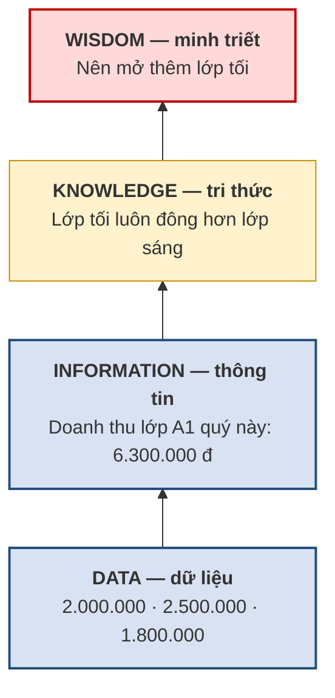
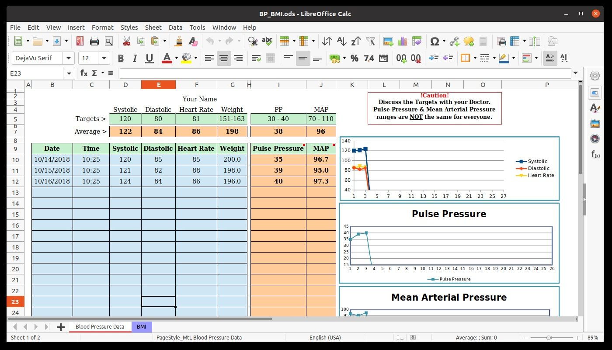

# 1.1. Dữ liệu, thông tin và cơ sở dữ liệu

*(1,0 tiết)*

## 1.1.1. Dữ liệu và thông tin

Hai từ *dữ liệu* và *thông tin* thường được dùng thay thế cho nhau trong giao tiếp hằng ngày, nhưng trong ngành cơ sở dữ liệu chúng chỉ hai thứ khác nhau, và việc phân biệt được chúng là bước đầu tiên để hiểu vì sao cơ sở dữ liệu phải lưu nhiều hơn là chỉ lưu con số.

!!! note "Định nghĩa 1.1"

    **Dữ liệu** *(data)* là những **sự kiện thô** *(raw facts)* chưa qua xử lý, được ghi nhận và lưu trữ. **Thông tin** *(information)* là **kết quả của việc xử lý dữ liệu** trong một ngữ cảnh xác định, nhằm làm lộ ra ý nghĩa phục vụ cho việc ra quyết định [3, tr. 5–7].

Có thể tóm tắt quan hệ giữa hai khái niệm này bằng một công thức dễ nhớ:

> **Dữ liệu + Ngữ cảnh + Xử lý = Thông tin**

Yếu tố then chốt trong công thức trên là **ngữ cảnh**. Một dữ liệu tách rời khỏi ngữ cảnh thì không nói lên điều gì, và điều đáng chú ý là cùng một dữ liệu đặt vào các ngữ cảnh khác nhau sẽ cho ra những thông tin khác hẳn nhau, thậm chí dẫn tới những hành động trái ngược.

!!! example "Ví dụ 1.1"

    Xét con số `38`. Tự thân nó vô nghĩa — đó là dữ liệu. Nếu biết thêm rằng đây là *nhiệt độ cơ thể tính bằng độ C của một bệnh nhân*, con số ấy trở thành thông tin "bệnh nhân đang sốt" và dẫn tới hành động cho khám ngay. Nếu đó là *sĩ số của lớp CNTT01*, nó thành thông tin "lớp có quy mô trung bình" và dẫn tới quyết định xếp phòng học bình thường. Còn nếu đó là *nhiệt độ ngoài trời*, thông tin thu được là "trời nắng gắt" và hành động hợp lý là hoãn hoạt động ngoài trời. Một dữ liệu, ba ngữ cảnh, ba hành động khác nhau.

Xếp ba ngữ cảnh ấy cạnh nhau, công thức ở trên hiện ra từng cột một.

**Bảng 1.1. Một dữ liệu, ba ngữ cảnh, ba hành động — Ví dụ 1.1 nhìn theo công thức**

| Dữ liệu | + Ngữ cảnh | + Xử lý | = Thông tin | → Hành động |
|:--:|---|---|---|---|
| `38` | nhiệt độ cơ thể bệnh nhân (°C) | so với ngưỡng 37,5 | "bệnh nhân đang sốt" | cho khám ngay |
| `38` | sĩ số lớp CNTT01 | so với sức chứa phòng | "lớp quy mô trung bình" | xếp phòng bình thường |
| `38` | nhiệt độ ngoài trời (°C) | so với ngưỡng an toàn | "trời nắng gắt" | hoãn hoạt động ngoài trời |

Cột đầu tiên **giống hệt nhau** ở cả ba dòng; mọi khác biệt nằm ở cột ngữ cảnh. Đó là lý do một cơ sở dữ liệu không thể chỉ lưu cột đầu tiên.

Ví dụ trên dẫn tới một hệ quả thiết kế rất quan trọng, mà toàn bộ chương này sẽ khai triển: **một cơ sở dữ liệu không thể chỉ lưu dữ liệu; nó buộc phải lưu kèm cả phần mô tả ngữ cảnh của dữ liệu đó.** Phần mô tả ấy có tên riêng — *metadata* — và sẽ được trình bày ở mục 1.1.4.

!!! warning "Chú ý"

    Một nhầm lẫn phổ biến là nghĩ rằng "thông tin chỉ là dữ liệu được trình bày đẹp hơn". Không phải như vậy. Bước xử lý có thể rất đơn giản (sắp xếp, đếm, cộng dồn) hoặc rất phức tạp (dự báo thống kê), nhưng **bắt buộc phải có bước xử lý và phải có ngữ cảnh** thì dữ liệu mới trở thành thông tin. Trình bày lại một danh sách cho gọn gàng không tạo ra thông tin mới.

## 1.1.2. Từ dữ liệu đến quyết định: tháp DIKW

Trong khoa học thông tin, người ta sắp xếp bốn tầng giá trị theo thứ tự tăng dần, gọi là **tháp DIKW** — viết tắt của *Data – Information – Knowledge – Wisdom*. Mô hình này giúp người học định vị được cơ sở dữ liệu nằm ở đâu trong toàn bộ chuỗi giá trị của một tổ chức.

**Bảng 1.2. Bốn tầng của tháp DIKW, minh họa tại Trung tâm Anh ngữ ABC**

| Tầng | Tên gọi | Trả lời câu hỏi | Ví dụ tại Trung tâm ABC |
|:--:|---|---|---|
| 1 | **Data** — dữ liệu | *Cái gì?* — sự kiện thô | `2.000.000`, `2.500.000`, `1.800.000` |
| 2 | **Information** — thông tin | *Ai? Ở đâu? Bao nhiêu?* | Doanh thu lớp A1 trong quý = 6.300.000 đồng |
| 3 | **Knowledge** — tri thức | *Như thế nào?* — quy luật | Lớp buổi tối luôn đông hơn lớp buổi sáng |
| 4 | **Wisdom** — minh triết | *Nên làm gì?* — quyết định | Nên mở thêm lớp tối và giảm bớt lớp sáng |

**Hình 1.1. Tháp DIKW — cơ sở dữ liệu ở hai tầng dưới, tổn thất bộc lộ ở tầng trên cùng**

Hai tầng tô xanh là phạm vi của học phần. Hai tầng trên là đích đến của tổ chức — và cũng là nơi một thiết kế tồi ở tầng dưới cùng để lại hậu quả đắt nhất.

Cơ sở dữ liệu mà học phần này bàn tới nằm ở **tầng 1 và tầng 2**. Nhưng mục đích cuối cùng của mọi tổ chức lại nằm ở tầng 3 và tầng 4 — họ cần rút ra quy luật và ra quyết định. Điều này giải thích vì sao thiết kế cơ sở dữ liệu lại quan trọng đến vậy: **một cơ sở dữ liệu thiết kế tồi sẽ chặn đứng con đường đi lên các tầng trên**. Dữ liệu sai dẫn tới thông tin sai, thông tin sai dẫn tới quy luật rút ra sai, và cuối cùng là quyết định sai. Tổn thất không nằm ở tầng dữ liệu mà bộc lộ ở tầng quyết định, thường là rất muộn và rất đắt.

## 1.1.3. Ba dạng dữ liệu

Không phải mọi dữ liệu đều có hình dạng giống nhau, và điều này quyết định loại công nghệ nào phù hợp để lưu trữ chúng. Người ta phân biệt ba dạng [3, tr. 22–24].

**Bảng 1.3. Ba dạng dữ liệu**

| Dạng | Đặc điểm | Ví dụ | Công nghệ phù hợp |
|---|---|---|---|
| **Có cấu trúc** *(structured)* | Được tổ chức thành các trường có tên, có kiểu, có độ dài xác định trước | Bảng danh sách học viên: mã, họ tên, ngày sinh | **Cơ sở dữ liệu quan hệ** |
| **Bán cấu trúc** *(semi-structured)* | Có một số dấu hiệu tổ chức (nhãn, thẻ) nhưng không theo lược đồ cố định | Tệp XML, JSON, thư điện tử, trang web | CSDL dạng văn kiện, XML |
| **Phi cấu trúc** *(unstructured)* | Không có tổ chức nội tại để máy khai thác trực tiếp | Ảnh chụp, video, bản ghi âm, văn bản tự do | Hệ thống tệp, kho đối tượng |

Điều người học cần nắm là: **học phần này, và cơ sở dữ liệu quan hệ nói chung, xử lý dữ liệu có cấu trúc.** Đây là một giới hạn có chủ ý chứ không phải một khiếm khuyết. Chính vì buộc dữ liệu phải có cấu trúc rõ ràng mà cơ sở dữ liệu quan hệ mới có thể kiểm tra tính đúng đắn, bảo đảm nhất quán và trả lời truy vấn nhanh — những việc mà một kho ảnh hay một thư mục tài liệu không làm được.

{width=55%}

*Ảnh minh họa: mẫu Căn cước công dân. Bức ảnh chụp tấm thẻ là dữ liệu phi cấu trúc; thứ được đưa vào cơ sở dữ liệu là các trường rút ra từ nó: số định danh, họ tên, ngày sinh, cùng đường dẫn tới tệp ảnh gốc — Nguồn: Wikimedia Commons · Chính phủ Việt Nam · Public domain.*

Một điểm thường bị hiểu nhầm: dữ liệu phi cấu trúc không hề "kém giá trị" hơn. Thực tế trong nhiều tổ chức, phần lớn khối lượng dữ liệu là phi cấu trúc. Nhưng để khai thác được chúng, người ta phải **rút ra phần có cấu trúc** rồi lưu vào cơ sở dữ liệu. Chẳng hạn với một ảnh chụp thẻ học viên, cái được đưa vào cơ sở dữ liệu không phải bản thân bức ảnh mà là các trường trích xuất từ ảnh: mã học viên, họ tên, ngày cấp, cùng với đường dẫn tới tệp ảnh gốc.

## 1.1.4. Cơ sở dữ liệu và metadata

!!! note "Định nghĩa 1.2"

    **Cơ sở dữ liệu** *(database)* là một **tập hợp có tổ chức các dữ liệu có liên quan logic với nhau**, được lưu trữ tập trung và **dùng chung** cho nhiều người dùng, nhiều ứng dụng [3, tr. 7].

Ba tính từ trong định nghĩa trên đều mang ý nghĩa cụ thể, không phải là chữ nghĩa trang trí. **Có tổ chức** nghĩa là dữ liệu được sắp xếp theo một cấu trúc đã định trước, chứ không đổ vào một cách tùy tiện. **Có liên quan logic** nghĩa là các dữ liệu trong cùng một cơ sở dữ liệu cùng phục vụ một lĩnh vực hoạt động; danh sách học viên và danh sách lớp học thuộc về nhau, còn danh sách học viên và giá cổ phiếu thì không. **Dùng chung** nghĩa là nhiều bộ phận cùng làm việc trên một bản dữ liệu duy nhất — đây chính là điểm khác biệt căn bản so với cách mỗi phòng ban giữ một tệp riêng như trong tình huống ở phần Dẫn nhập.

Điểm đặc biệt nhất, và cũng là điểm dễ bị bỏ qua nhất, là một cơ sở dữ liệu chứa **hai phần** chứ không phải một:

1. **Dữ liệu người dùng cuối** — các sự kiện mà tổ chức quan tâm: học viên nào, học lớp nào, đóng bao nhiêu tiền.
2. **Metadata** *(siêu dữ liệu)* — "dữ liệu mô tả dữ liệu".

!!! note "Định nghĩa 1.3"

    **Metadata** là phần dữ liệu **mô tả đặc trưng của chính dữ liệu** được lưu trong cơ sở dữ liệu: tên các trường, kiểu dữ liệu, độ dài, tính bắt buộc, các ràng buộc phải thỏa mãn và mối liên hệ giữa các nhóm dữ liệu.

{width=50%}

*Ảnh minh họa: một mẫu đơn đã điền. Phần in sẵn — nhãn ô, chỗ chia ngăn, chỉ dẫn — có trước khi ai điền và quy định người ta được điền gì: đó là metadata; phần viết tay vào ô là dữ liệu — Nguồn: Wikimedia Commons · Unknown author · Public domain.*

Khái niệm metadata thường gây khó khăn ở lần tiếp xúc đầu tiên vì nó có tính tự quy chiếu. Một phép loại suy giúp làm rõ: hãy nghĩ tới một **mẫu đơn đăng ký in sẵn**. Những gì *người ta điền vào* mẫu đơn — "Trần An", "12/04/2005" — đó là **dữ liệu**. Còn những gì *đã in sẵn trên mẫu đơn* — dòng chữ "Họ và tên" bên cạnh ô trống, ghi chú "chỉ nhận chữ cái", dấu sao đỏ báo hiệu trường bắt buộc, ô "Ngày sinh" chia sẵn thành ba ngăn ngày/tháng/năm — đó là **metadata**. Mẫu đơn tồn tại trước khi có người điền, và nó quy định người ta được phép điền cái gì.

**Bảng 1.4. Phép loại suy mẫu đơn: cái gì in sẵn, cái gì được điền vào**

| Trên mẫu đơn | Là gì? | Trong cơ sở dữ liệu |
|---|---|---|
| Dòng chữ "Họ và tên" bên cạnh ô trống | in sẵn → **metadata** | tên cột `HOTEN` |
| Ghi chú "chỉ nhận chữ cái", ô ngày sinh chia ba ngăn | in sẵn → **metadata** | kiểu dữ liệu `chuỗi`, `ngày tháng` |
| Dấu sao đỏ báo trường bắt buộc | in sẵn → **metadata** | ràng buộc *không rỗng* |
| "Trần An", "12/04/2005" viết tay vào ô | người điền → **dữ liệu** | một dòng của bảng |
| Mẫu đơn tồn tại trước khi có ai điền | metadata có trước dữ liệu | lược đồ được thiết kế trước |

Trong một cơ sở dữ liệu, metadata cũng có hình dạng tương tự. Bảng dưới đây trình bày metadata của một bảng `SINHVIEN`.

**Bảng 1.5. Metadata của bảng `SINHVIEN`**

| Tên cột | Kiểu dữ liệu | Bắt buộc? | Ràng buộc |
|---|---|:--:|---|
| `MASV` | Chuỗi (10) | Có | Khóa chính — không trùng, không rỗng |
| `HOTEN` | Chuỗi (50) | Có | — |
| `NGAYSINH` | Ngày tháng | Không | Phải trước ngày hiện tại |
| `DIEMTB` | Số thực | Không | Nằm trong khoảng từ 0 đến 4 |

Chính nhờ có metadata mà hệ quản trị cơ sở dữ liệu mới **tự động kiểm tra** được dữ liệu nhập vào. Khi người dùng gõ nhầm điểm trung bình là `40` thay vì `4.0`, hệ thống từ chối ngay lập tức vì nó biết trường này chỉ nhận giá trị từ 0 đến 4 — biết được điều đó là nhờ đọc metadata. Không có metadata, hệ quản trị cơ sở dữ liệu chỉ còn là một nơi chứa dữ liệu thụ động, không khác gì một thư mục tệp.

{width=70%}

*Ảnh minh họa: một bảng tính. Với phần mềm bảng tính, tiêu đề cột "Điểm trung bình" chỉ là một ô chứa chữ như mọi ô khác — không có metadata nào để nó biết cột ấy phải là số trong khoảng 0–4 — Nguồn: Wikimedia Commons · Jasozh · CC BY-SA 4.0.*

Muốn thấy metadata "làm việc", hãy thử nhập ba dòng dưới đây vào một bảng tính và vào một bảng `SINHVIEN` đã khai báo metadata như Bảng 1.5.

**Bảng 1.6. Ba dòng bảng tính chấp nhận, hệ quản trị từ chối**

| MASV | HOTEN | NGAYSINH | DIEMTB | Bảng tính | Hệ quản trị nói gì |
|---|---|---|---|:--:|---|
| SV01 | Trần An | 12/04/2005 | 3.2 | ✓ | ✓ hợp lệ |
| SV01 | Lê Bình | 30/09/2004 | chưa có | ✓ | ✗ `MASV` trùng; `DIEMTB` phải là số |
| SV03 | Phạm Cường | 15/01/2030 | 40 | ✓ | ✗ ngày sinh sau hôm nay; điểm ngoài khoảng 0–4 |

Bảng tính nhận cả ba dòng mà không phàn nàn, vì với nó mọi ô đều chỉ là chữ. Hệ quản trị từ chối hai dòng sau ngay lúc nhập — không phải vì nó "thông minh hơn", mà vì nó **đọc được metadata**.

!!! warning "Chú ý"

    Trong bảng tính, metadata gần như không tồn tại dưới dạng máy hiểu được. Tiêu đề cột "Điểm trung bình" ở dòng đầu tiên chỉ là một ô chứa chữ, đối với phần mềm bảng tính nó không khác gì các ô còn lại. Vì vậy bảng tính không thể ngăn người dùng gõ chữ "chưa có" vào cột điểm số, cũng không thể ngăn hai người nhập cùng một mã học viên. **Đây là khác biệt căn bản đầu tiên giữa bảng tính và cơ sở dữ liệu.**

!!! question "Tự kiểm tra 1.1"

    *(tự trả lời trước, rồi mở đáp án bên dưới)*

    1. Con số `7,5` là dữ liệu hay thông tin? Thêm ngữ cảnh nào để nó thành thông tin và dẫn tới một hành động?
    2. Trên thẻ sinh viên của bạn, chỉ ra hai thứ là metadata và hai thứ là dữ liệu.
    3. Bảng tính có ngăn được việc gõ chữ "chưa có" vào cột điểm không? Vì sao?

??? success "Đáp án tự kiểm tra 1.1"

    *(1)* `7,5` là dữ liệu. Thêm ngữ cảnh "điểm trung bình học kỳ của sinh viên X, thang 10" và xử lý "so với ngưỡng học bổng 8,0" thì thành thông tin "chưa đạt học bổng", dẫn tới hành động không xét học bổng. *(2)* Metadata: nhãn "Họ và tên", "Mã SV" in sẵn và định dạng ngày cấp; dữ liệu: tên của bạn, mã của bạn. *(3)* Không. Với bảng tính, tiêu đề "Điểm" chỉ là một ô chứa chữ; nó không có metadata để biết cột ấy phải là số.

---

---

[← Trang trước](index.md) · [Trang sau →](1-2-he-quan-tri-co-so-du-lieu.md)
