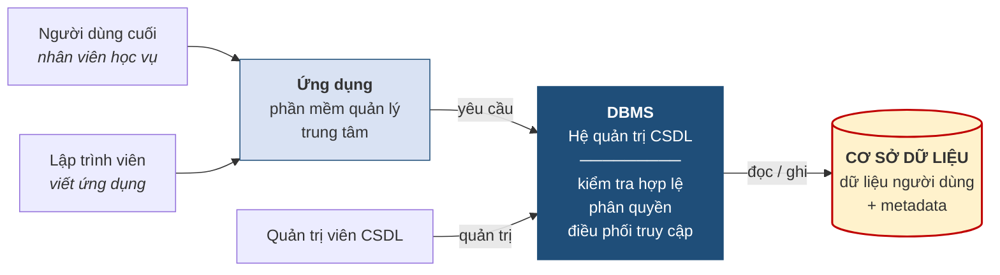

# 1.2. Hệ quản trị cơ sở dữ liệu

*(0,5 tiết)*

## 1.2.1. Khái niệm và vai trò trung gian

Bản thân cơ sở dữ liệu chỉ là dữ liệu nằm trên đĩa. Để làm việc được với nó, cần một phần mềm chuyên trách.

!!! note "Định nghĩa 1.4"

    **Hệ quản trị cơ sở dữ liệu** *(Database Management System — DBMS)* là **phần mềm trung gian** giữa người dùng cùng các ứng dụng với cơ sở dữ liệu vật lý, có nhiệm vụ quản lý cấu trúc của cơ sở dữ liệu và điều khiển mọi truy cập vào dữ liệu [3, tr. 7–9].

Từ khóa cần nhấn mạnh là **trung gian**. Không ai — kể cả lập trình viên — được phép đọc hay ghi trực tiếp lên tệp dữ liệu. Mọi yêu cầu đều phải đi qua hệ quản trị cơ sở dữ liệu, và chính vì mọi thứ đều đi qua một cửa duy nhất mà phần mềm này mới có thể kiểm soát được tính đúng đắn, phân quyền truy cập và xử lý tình huống nhiều người cùng thao tác một lúc.

**Hình 1.2. Vai trò trung gian của hệ quản trị cơ sở dữ liệu**

Vai trò trung gian đem lại một lợi ích ít khi được nhận ra ngay: nó **giấu đi sự phức tạp của việc lưu trữ**. Người dùng chỉ cần nói "cho tôi danh sách học viên lớp A1"; họ không cần biết dữ liệu nằm ở tệp nào, trên ổ đĩa nào, được sắp xếp ra sao, có chỉ mục hay không. Toàn bộ phần đó do hệ quản trị cơ sở dữ liệu lo. Ý tưởng "giấu đi sự phức tạp" này sẽ được hệ thống hóa thành một kiến trúc chính thức ở mục 1.5.

## 1.2.2. Phân biệt cơ sở dữ liệu, hệ quản trị cơ sở dữ liệu và hệ cơ sở dữ liệu

Ba thuật ngữ này rất hay bị dùng lẫn, kể cả trong tài liệu chuyên môn. Cần phân biệt dứt khoát ngay từ đầu:

- **Cơ sở dữ liệu** *(database)* là **dữ liệu** — phần nội dung được lưu trữ, gồm dữ liệu người dùng và metadata.
- **Hệ quản trị cơ sở dữ liệu** *(DBMS)* là **phần mềm** quản lý cơ sở dữ liệu đó. MySQL, SQL Server, PostgreSQL, Oracle là những hệ quản trị cơ sở dữ liệu.
- **Hệ cơ sở dữ liệu** *(database system)* là **toàn bộ hệ thống** gồm cơ sở dữ liệu, hệ quản trị cơ sở dữ liệu, phần cứng, các ứng dụng, quy trình vận hành và con người sử dụng nó.

{width=70%}

*Ảnh minh họa: phòng đọc của một thư viện đại học. Sách trên giá là cơ sở dữ liệu; thủ thư cùng hệ thống phiếu mượn và quy tắc xếp giá là hệ quản trị; cả tòa nhà với giá sách, thủ thư, nội quy và bạn đọc là hệ cơ sở dữ liệu — Nguồn: Wikimedia Commons · Dr. Marcus Gossler · CC BY-SA 3.0.*

Một cách ghi nhớ: nếu ví cơ sở dữ liệu là **sách trong thư viện**, thì hệ quản trị cơ sở dữ liệu là **người thủ thư** cùng toàn bộ hệ thống phiếu mượn và quy tắc sắp xếp, còn hệ cơ sở dữ liệu là **cả thư viện** — bao gồm tòa nhà, giá sách, thủ thư, nội quy và bạn đọc.

**Bảng 1.7. Ba khái niệm qua phép loại suy thư viện**

| Khái niệm | Trong thư viện | Bản chất | Ví dụ |
|---|---|---|---|
| **Cơ sở dữ liệu** | Sách trên giá | **Dữ liệu** được lưu, gồm dữ liệu người dùng và metadata | Toàn bộ bảng của Trung tâm ABC |
| **Hệ quản trị CSDL** | Thủ thư, hệ thống phiếu mượn, quy tắc xếp giá | **Phần mềm** quản lý và điều khiển mọi truy cập | MySQL, SQL Server, PostgreSQL, Oracle |
| **Hệ cơ sở dữ liệu** | Cả thư viện: tòa nhà, giá sách, thủ thư, nội quy, bạn đọc | **Toàn bộ hệ thống**: dữ liệu, phần mềm, phần cứng, ứng dụng, thủ tục, con người | Hệ thống quản lý đào tạo đang chạy của trường |

!!! warning "Chú ý"

    Câu nói thường gặp "*tôi đã cài đặt cơ sở dữ liệu MySQL*" là chưa chính xác về thuật ngữ. Cái được cài đặt là **hệ quản trị** cơ sở dữ liệu MySQL; cơ sở dữ liệu là thứ được tạo ra *sau đó*, bên trong hệ quản trị ấy. Một hệ quản trị có thể chứa nhiều cơ sở dữ liệu độc lập với nhau.

## 1.2.3. Phân loại hệ quản trị cơ sở dữ liệu

Người học thường đặt câu hỏi rất tự nhiên: *"Có nhiều hệ quản trị như vậy thì chúng khác nhau ở đâu, và khi nào dùng cái nào?"* Có ba tiêu chí phân loại thông dụng [3, tr. 15–19].

**Bảng 1.8. Ba cách phân loại hệ quản trị cơ sở dữ liệu**

| Tiêu chí | Các loại | Đặc điểm và ví dụ |
|---|---|---|
| **Số người dùng** | *Một người dùng* — chỉ phục vụ một người tại một thời điểm; trường hợp riêng là loại chạy trên máy để bàn | Microsoft Access dùng cho một người quản lý sổ sách cá nhân |
| | *Nhiều người dùng* — phục vụ đồng thời nhiều người; chia tiếp thành cấp phòng ban và cấp doanh nghiệp | MySQL, SQL Server, Oracle phục vụ cả trung tâm cùng lúc |
| **Vị trí lưu trữ** | *Tập trung* — toàn bộ dữ liệu đặt ở một nơi | Máy chủ đặt tại văn phòng trung tâm |
| | *Phân tán* — dữ liệu trải trên nhiều địa điểm nhưng người dùng vẫn thấy như một | Chuỗi trung tâm có nhiều chi nhánh, mỗi chi nhánh giữ một phần |
| **Mục đích sử dụng** | *Xử lý giao dịch trực tuyến* (OLTP) — tối ưu cho thêm, sửa, xóa nhanh và chính xác | Hệ thống ghi danh, thu học phí hằng ngày |
| | *Kho dữ liệu* (data warehouse) — tối ưu cho tổng hợp, phân tích trên khối lượng lớn | Hệ thống báo cáo doanh thu nhiều năm để tìm xu hướng |

Phân loại theo **mục đích sử dụng** đáng chú ý nhất đối với người thiết kế, vì hai mục đích này đòi hỏi hai cách thiết kế trái ngược nhau. Hệ thống xử lý giao dịch cần dữ liệu được tách nhỏ triệt để để tránh trùng lặp và bảo đảm chính xác; kho dữ liệu lại thường **cố ý gộp lại** để truy vấn tổng hợp chạy nhanh. Toàn bộ học phần này hướng tới nhóm thứ nhất; kỹ thuật cố ý gộp lại của nhóm thứ hai sẽ được nhắc tới ở Chương 5 dưới tên gọi *phi chuẩn hóa*.

---

---

[← Trang trước](1-1-du-lieu-thong-tin-va-co-so-du-lieu.md) · [Trang sau →](1-3-vi-sao-can-co-so-du-lieu.md)
