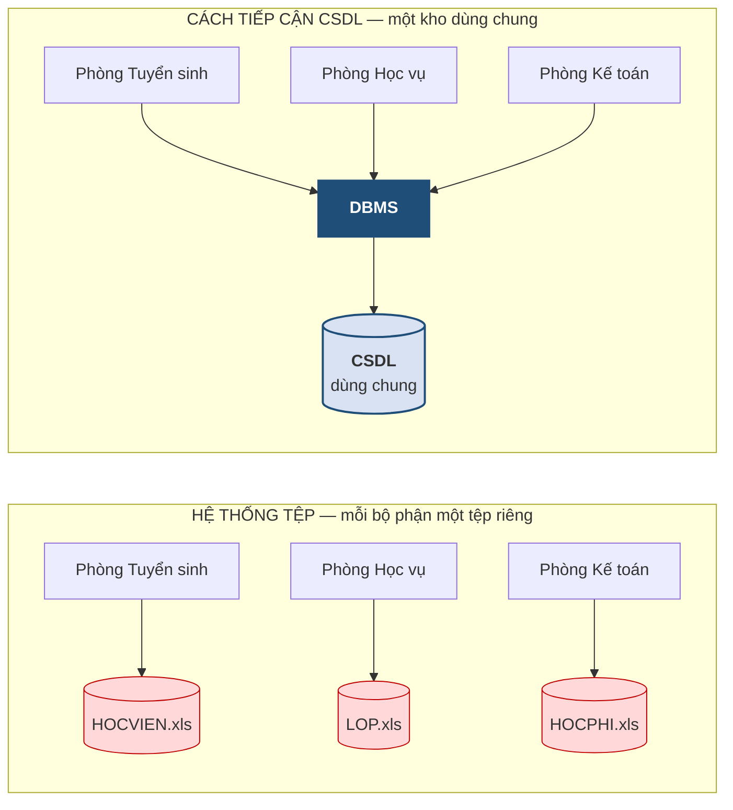
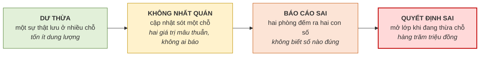

# 1.3. Vì sao cần cơ sở dữ liệu

*(1,0 tiết)*

Mục này trả lời câu hỏi nền tảng nhất của chương: **nếu đã có tệp và bảng tính, tại sao còn phải học cơ sở dữ liệu?** Câu trả lời không nằm ở chỗ cơ sở dữ liệu "hiện đại hơn", mà nằm ở bốn hạn chế cụ thể, có thể chỉ ra và định lượng được, của cách tổ chức dữ liệu bằng hệ thống tệp.

## 1.3.1. Hệ thống tệp và bốn hạn chế của nó

{width=60%}

*Ảnh minh họa: tủ tệp hồ sơ giấy. Hệ thống tệp là phiên bản điện tử của cách quản lý này: mỗi bộ phận một ngăn riêng, cùng một người có hồ sơ ở nhiều ngăn, sửa một ngăn thì các ngăn kia không biết — Nguồn: Wikimedia Commons · Tony Webster · CC BY-SA 2.0.*

Trước khi cơ sở dữ liệu ra đời vào cuối những năm 1960, các tổ chức quản lý dữ liệu bằng **hệ thống tệp** *(file system)*: mỗi bộ phận nghiệp vụ có tệp dữ liệu riêng và chương trình xử lý riêng. Cách làm này vẫn còn phổ biến đến ngày nay dưới hình thức "mỗi phòng một tệp bảng tính".

**Hình 1.3. Hệ thống tệp và cách tiếp cận cơ sở dữ liệu**

Hình vẽ mới cho thấy *ai giữ tệp nào*. Hãy mở ba tệp ấy ra và nhìn vào một học viên cụ thể.

**Bảng 1.9. Cùng một học viên trong ba tệp của ba phòng — tình huống ở phần Dẫn nhập**

| Tệp | Phòng giữ | Dòng về Trần An | Số điện thoại |
|---|---|---|---|
| `HOCVIEN.xls` | Tuyển sinh | HV01 · Trần An · sinh 12/04/2005 | **0905111222** *(mới, đã cập nhật)* |
| `LOP.xls` | Học vụ | A1 · Trần An | 0905111111 *(cũ)* |
| `HOCPHI.xls` | Kế toán | Trần An · 3.000.000 · chưa đóng | 0905111111 *(cũ)* — kế toán gọi nhắc vào số này |

Điều bất thường thấy ngay: **họ tên và số điện thoại của cùng một học viên xuất hiện trong cả ba tệp**, và khi Trần An báo đổi số cho phòng Tuyển sinh, hai tệp kia vẫn giữ số cũ. Từ quan sát đó, bốn hạn chế lần lượt lộ ra.

**Hạn chế thứ nhất — dư thừa dữ liệu** *(data redundancy)*. Cùng một sự kiện được lưu ở nhiều nơi. Đây không đơn thuần là chuyện tốn dung lượng lưu trữ; dung lượng ngày nay rất rẻ. Vấn đề nằm ở chỗ dư thừa là **nguồn gốc** của ba hạn chế còn lại.

**Hạn chế thứ hai — không nhất quán dữ liệu** *(data inconsistency)*. Khi một sự kiện được lưu ở ba nơi, chỉ cần cập nhật thiếu một nơi là cơ sở dữ liệu chứa hai giá trị mâu thuẫn cho cùng một sự thật. Điều đáng sợ là hệ thống **không hề báo lỗi**: cả hai giá trị đều là dữ liệu hợp lệ xét riêng lẻ. Sự mâu thuẫn chỉ bị phát hiện khi có người tình cờ đối chiếu, thường là rất muộn.

**Hạn chế thứ ba — dị thường khi cập nhật** *(update anomalies)*. Do cấu trúc lưu trữ nhập nhằng, các thao tác thêm, sửa, xóa gây ra những hậu quả ngoài ý muốn. Ba loại dị thường cụ thể sẽ được phân tích chi tiết ở mục 1.7.

**Hạn chế thứ tư — phụ thuộc dữ liệu** *(data dependence)*. Trong hệ thống tệp, mỗi chương trình phải tự biết cấu trúc vật lý của tệp: cột nào ở vị trí nào, dài bao nhiêu ký tự. Hệ quả là **chỉ cần đổi cấu trúc tệp một chút là mọi chương trình đọc tệp ấy đều phải sửa lại**. Thêm một cột "email" vào tệp học viên có thể buộc phải sửa và biên dịch lại năm chương trình khác nhau. Đây là hạn chế tốn kém nhất về lâu dài và cũng chính là hạn chế mà kiến trúc ba mức ở mục 1.5 được sinh ra để giải quyết.

## 1.3.2. Định lượng mức dư thừa trên một trường hợp cụ thể

Nói "dư thừa gây hại" là nói định tính. Người thiết kế cần biết định lượng. Ta xét bảng dữ liệu phẳng của Trung tâm ABC — cùng chính là bảng sẽ được dùng lại ở mục 1.7 và ở các chương sau.

**Bảng 1.10. Tệp phẳng `HOCVIEN_LOP` của Trung tâm Anh ngữ ABC**

| MAHV | HOTEN | MALOP | TENLOP | GIAOVIEN | SDT_GV |
|---|---|---|---|---|---|
| HV01 | Trần An | A1 | Anh cơ bản 1 | Lê Hoa | 0905111111 |
| HV02 | Lê Bình | A1 | Anh cơ bản 1 | Lê Hoa | 0905111111 |
| HV03 | Phạm Cường | A1 | Anh cơ bản 1 | Lê Hoa | 0905111111 |
| HV04 | Võ Dung | A2 | Anh giao tiếp | Trần Mai | 0905222222 |

Bảng có 4 dòng và 6 cột, tổng cộng 24 ô. Hãy đếm xem bao nhiêu ô trong số đó là **thừa** — hiểu theo nghĩa: nếu xóa đi, ta vẫn khôi phục lại được từ những ô còn lại.

Ba cột `MAHV`, `HOTEN` là dữ liệu riêng của từng học viên, không dòng nào lặp lại dòng nào: **8 ô, không thừa ô nào**. Cột `MALOP` chỉ có hai giá trị phân biệt là A1 và A2, nhưng mã lớp cần thiết để biết học viên nào học lớp nào, nên cũng **không thừa**. Ba cột còn lại thì khác. `TENLOP` phụ thuộc hoàn toàn vào `MALOP`: hễ biết A1 là biết ngay "Anh cơ bản 1". Ba dòng đầu cùng ghi "Anh cơ bản 1" nghĩa là **hai ô thừa**. Tương tự, `GIAOVIEN` và `SDT_GV` đều phụ thuộc vào `MALOP`, mỗi cột thừa hai ô ở ba dòng đầu — tổng cộng **bốn ô thừa** nữa.

**Bảng 1.11. Đếm ô thừa theo từng cột của Bảng 1.10**

| Cột | Số ô | Ô thừa | Vì sao |
|---|:--:|:--:|---|
| `MAHV` | 4 | 0 | mỗi dòng một mã khác nhau |
| `HOTEN` | 4 | 0 | mỗi dòng một người khác nhau |
| `MALOP` | 4 | 0 | lặp giá trị nhưng cần để biết ai học lớp nào |
| `TENLOP` | 4 | 2 | biết `A1` là biết "Anh cơ bản 1" — ba dòng, thừa hai |
| `GIAOVIEN` | 4 | 2 | cùng lý do: phụ thuộc vào `MALOP` |
| `SDT_GV` | 4 | 2 | cùng lý do |
| **Tổng** | **24** | **6** | **25 %** |

Từ bảng trên rút ra công thức tổng quát: nếu lớp A1 có **n** học viên (và lớp A2 vẫn một học viên), bảng phẳng có `6(n + 1)` ô, trong đó ba cột phụ thuộc vào lớp mỗi cột thừa `n − 1` ô:

> **Tỷ lệ ô thừa = 3(n − 1) / 6(n + 1)** — với n = 3 được 6/24 = 25 %; với n = 30 được 87/186 ≈ 47 %; khi n rất lớn tiến tới 50 %.

Vậy trong 24 ô có **6 ô thừa, chiếm 25%**. Con số này không lớn vì bảng ví dụ chỉ có 4 dòng. Nhưng hãy để ý điều gì xảy ra khi trung tâm phát triển: nếu lớp A1 có 30 học viên thay vì 3, thì riêng thông tin của cô Lê Hoa sẽ bị lặp **30 lần**, và tỷ lệ ô thừa vọt lên xấp xỉ 50%. **Mức dư thừa tăng theo quy mô dữ liệu, trong khi lượng thông tin thật sự thì không đổi** — cô Lê Hoa vẫn chỉ có một số điện thoại duy nhất.

!!! warning "Chú ý"

    Cách nhận diện dư thừa ở đây vẫn dựa vào trực giác — "thấy giá trị lặp lại thì nghi ngờ". Trực giác này đủ dùng cho một bảng 6 cột, nhưng sẽ thất bại với hệ thống hàng chục bảng. Chương 5 sẽ thay trực giác bằng một công cụ toán học chính xác gọi là **phụ thuộc hàm**, và khi đó câu "`TENLOP` phụ thuộc hoàn toàn vào `MALOP`" sẽ được viết gọn thành `MALOP → TENLOP`.

## 1.3.3. Từ dư thừa đến quyết định sai

Bốn hạn chế nêu ở mục 1.3.1 không đứng độc lập; chúng nối với nhau thành một chuỗi nhân quả mà gốc rễ là **dư thừa**.

Dư thừa khiến cùng một sự thật được lưu ở nhiều chỗ. Vì nằm ở nhiều chỗ nên mỗi lần thay đổi phải cập nhật đồng loạt, mà cập nhật đồng loạt thì sớm muộn cũng sót — sinh ra **không nhất quán**. Khi dữ liệu đã mâu thuẫn, mọi báo cáo tổng hợp từ nó đều đáng ngờ: hai bộ phận cùng đếm số học viên đang theo học có thể ra hai con số khác nhau, và không ai biết con số nào đúng. Báo cáo sai dẫn tới **quyết định sai** — trung tâm mở thêm lớp trong khi thực ra đang thừa chỗ, hoặc ngược lại.

**Hình 1.4. Chuỗi nhân quả từ dư thừa tới quyết định sai — chi phí tăng theo từng mắt xích**

Điều đáng lưu ý về mặt quản trị là **chi phí của chuỗi này tăng dần theo từng mắt xích**. Ở mắt xích đầu, dư thừa chỉ tốn ít dung lượng đĩa, gần như miễn phí. Ở mắt xích cuối, một quyết định kinh doanh sai có thể tốn hàng trăm triệu đồng. Nhưng vì tổn thất chỉ bộc lộ ở cuối chuỗi, người ta thường không truy ngược về nguyên nhân gốc, và tiếp tục sống chung với thiết kế tồi.

Đây chính là lý do sâu xa để học phần này tồn tại: **chặn chuỗi nhân quả ngay tại mắt xích đầu tiên, bằng cách thiết kế cơ sở dữ liệu sao cho không có dư thừa ngay từ đầu.**

## 1.3.4. Cách tiếp cận cơ sở dữ liệu khắc phục ra sao

Cách tiếp cận cơ sở dữ liệu giải quyết bốn hạn chế trên bằng hai thay đổi căn bản: **gộp dữ liệu vào một kho dùng chung** và **đặt một phần mềm trung gian kiểm soát mọi truy cập**.

**Bảng 1.12. So sánh hệ thống tệp và cách tiếp cận cơ sở dữ liệu**

| Tiêu chí | Hệ thống tệp | Cách tiếp cận cơ sở dữ liệu |
|---|---|---|
| **Tổ chức dữ liệu** | Mỗi bộ phận một tệp riêng | Một kho dùng chung |
| **Dư thừa** | Cao — dữ liệu lặp ở nhiều tệp | Được kiểm soát, giảm tới mức tối thiểu |
| **Nhất quán** | Khó bảo đảm, phải làm thủ công | Do hệ quản trị bảo đảm tự động |
| **Metadata** | Không có, hoặc chỉ nằm trong đầu người viết chương trình | Lưu ngay trong cơ sở dữ liệu, máy đọc được |
| **Phụ thuộc dữ liệu** | Chương trình gắn chặt với cấu trúc tệp | Được tách rời nhờ kiến trúc ba mức *(mục 1.5)* |
| **Nhiều người truy cập đồng thời** | Không kiểm soát được | Do hệ quản trị điều phối |
| **Phân quyền, an toàn** | Ở mức tệp — cho phép hoặc cấm cả tệp | Chi tiết tới từng bảng, từng cột |
| **Truy vấn tùy ý** | Phải viết chương trình mới | Dùng ngôn ngữ truy vấn có sẵn |

Tuy vậy, cần giữ một cái nhìn cân bằng. Cách tiếp cận cơ sở dữ liệu cũng có **cái giá** của nó: chi phí mua bản quyền hoặc hạ tầng máy chủ, yêu cầu nhân sự có chuyên môn để quản trị, và độ phức tạp cao hơn hẳn khi bắt đầu. Với một cửa hàng nhỏ ghi chép mười khách hàng, dùng bảng tính vẫn là lựa chọn hợp lý. **Cơ sở dữ liệu trở nên đáng giá khi dữ liệu được dùng chung bởi nhiều người, khi tính đúng đắn là bắt buộc, và khi hệ thống còn phải sống lâu dài.** Ba điều kiện ấy đúng với hầu hết hệ thống nghiệp vụ thực tế.

!!! question "Tự kiểm tra 1.3"

    *(tự trả lời trước, rồi mở đáp án bên dưới)*

    1. Trong bốn hạn chế của hệ thống tệp, hạn chế nào là gốc rễ của ba hạn chế còn lại?
    2. Lớp A1 có 10 học viên, lớp A2 có 1. Bảng phẳng như Bảng 1.10 có bao nhiêu ô và bao nhiêu ô thừa?
    3. Một cửa hàng nhỏ ghi chép 10 khách hàng bằng bảng tính. Có nên chuyển sang cơ sở dữ liệu không? Nêu ba điều kiện để cơ sở dữ liệu trở nên đáng giá.

??? success "Đáp án tự kiểm tra 1.3"

    *(1)* Dư thừa dữ liệu. *(2)* 11 học viên → 66 ô; ba cột phụ thuộc lớp mỗi cột thừa 9 ô → 27 ô thừa (≈ 41 %). *(3)* Chưa cần. Cơ sở dữ liệu đáng giá khi dữ liệu dùng chung nhiều người, khi tính đúng đắn là bắt buộc, và khi hệ thống phải sống lâu dài.

---

---

[← Trang trước](1-2-he-quan-tri-co-so-du-lieu.md) · [Trang sau →](1-4-mo-hinh-du-lieu-luoc-do-va-the-hien.md)
