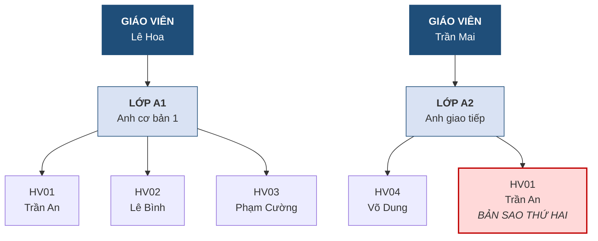
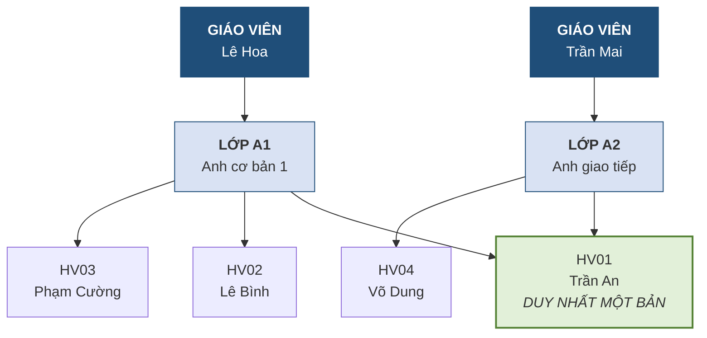
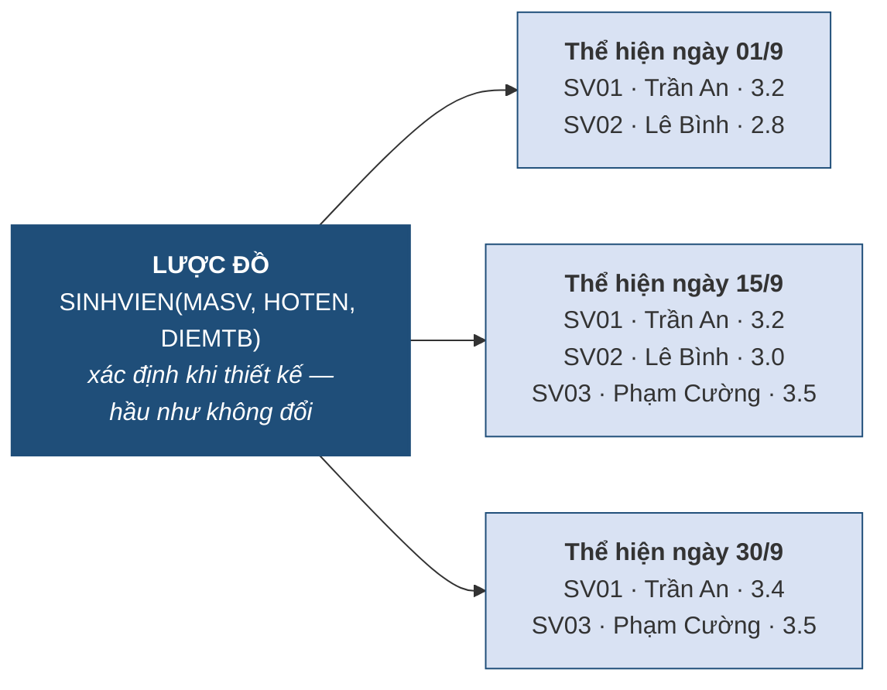

# 1.4. Mô hình dữ liệu, lược đồ và thể hiện

*(0,5 tiết)*

## 1.4.1. Mô hình dữ liệu

!!! note "Định nghĩa 1.5"

    **Mô hình dữ liệu** *(data model)* là một **tập hợp các khái niệm và quy tắc** dùng để mô tả cấu trúc của dữ liệu, các phép toán trên dữ liệu và các ràng buộc mà dữ liệu phải tuân thủ.

Mô hình dữ liệu đóng vai trò như một **bộ từ vựng chung**. Khi ta nói "hãy dùng mô hình quan hệ", điều đó có nghĩa là mọi người tham gia dự án cùng thống nhất rằng dữ liệu sẽ được tổ chức thành các *bảng* gồm *dòng* và *cột*, rằng các bảng liên hệ với nhau qua *khóa*, và rằng có một tập phép toán xác định để lấy dữ liệu ra. Không có bộ từ vựng chung ấy, mỗi người thiết kế theo một kiểu và không ai đọc được thiết kế của ai.

Có thể so sánh mô hình dữ liệu với **bản vẽ kiến trúc** trong xây dựng. Bản vẽ không phải ngôi nhà, nhưng nó quy ước rằng đường nét đậm là tường chịu lực, ô vuông có hai đường chéo là cửa sổ. Nhờ quy ước ấy mà kiến trúc sư ở Đà Nẵng vẽ xong, thợ xây ở Hà Nội đọc vẫn hiểu.

## 1.4.2. Các thế hệ mô hình dữ liệu

Mô hình quan hệ mà học phần này tập trung vào không phải là mô hình duy nhất, cũng không phải mô hình đầu tiên. Hiểu quá trình phát triển giúp người học nhận ra **vì sao** mô hình quan hệ chiếm ưu thế, thay vì chỉ chấp nhận nó như một sự đã rồi.

**Bảng 1.7. Các thế hệ mô hình dữ liệu**

| Thời kỳ | Mô hình | Cách tổ chức | Hạn chế chính |
|---|---|---|---|
| Những năm 1960 | **Phân cấp** *(hierarchical)* | Dữ liệu xếp thành cây; mỗi nút con có đúng một nút cha | Không diễn tả được quan hệ nhiều–nhiều; đổi cấu trúc rất tốn kém |
| Cuối 1960 – 1970 | **Mạng** *(network)* | Dữ liệu xếp thành đồ thị; một nút có thể có nhiều cha | Diễn tả được nhiều hơn nhưng cực kỳ phức tạp khi lập trình |
| Từ 1970 | **Quan hệ** *(relational)* | Dữ liệu là các **bảng**; liên kết thể hiện bằng **giá trị của khóa** | Có thể chậm hơn khi dữ liệu rất lớn và phi cấu trúc |
| Từ cuối 1980 | **Hướng đối tượng** | Dữ liệu và thao tác đóng gói thành đối tượng | Không đạt được mức phổ biến như mô hình quan hệ |
| Từ khoảng 2010 | **NoSQL** | Nhiều dạng: khóa–giá trị, văn kiện, cột rộng, đồ thị | Thường đánh đổi tính nhất quán để lấy tốc độ và khả năng mở rộng |

Bảng liệt kê ở trên mới chỉ cho biết các mô hình *tên gì*. Để thấy chúng **khác nhau ra sao trong thực tế**, cách tốt nhất là lấy **một dữ liệu duy nhất** rồi biểu diễn nó lần lượt dưới từng mô hình. Ta dùng ngay dữ liệu của Trung tâm Anh ngữ ABC.

!!! example "Ví dụ 1.2 — Trung tâm Anh ngữ ABC dưới bốn mô hình dữ liệu"

    **Dữ liệu cần lưu.** Cô *Lê Hoa* dạy lớp **A1** *(Anh cơ bản 1)* gồm ba học viên: Trần An, Lê Bình, Phạm Cường. Cô *Trần Mai* dạy lớp **A2** *(Anh giao tiếp)* có một học viên là Võ Dung.

    **Tình huống phát sinh.** Học viên **Trần An muốn học thêm lớp A2**. Đây là một yêu cầu hết sức bình thường trong đời sống của trung tâm — nhưng chính nó sẽ phơi bày sự khác nhau giữa các mô hình.

**a) Mô hình phân cấp — dữ liệu là một cái cây**

Mô hình phân cấp tổ chức dữ liệu thành cây, trong đó **mỗi nút con chỉ được có đúng một nút cha**. Với Trung tâm ABC, cách tổ chức tự nhiên là: giáo viên ở gốc, lớp là con của giáo viên, học viên là con của lớp.

**Hình 1.3. Trung tâm ABC trong mô hình phân cấp — Trần An buộc phải lưu hai lần**



Khi Trần An đăng ký thêm lớp A2, mô hình phân cấp lâm vào bế tắc. Quy tắc "mỗi con một cha" không cho phép nút *Trần An* vừa treo dưới lớp A1 vừa treo dưới lớp A2. Lối thoát duy nhất là **tạo thêm một bản sao** của Trần An dưới nhánh A2.

Hậu quả thì người học đã quá quen từ mục 1.3: dữ liệu của Trần An giờ nằm ở hai chỗ. Nếu em ấy đổi số điện thoại mà chỉ sửa một nhánh, cơ sở dữ liệu lập tức mâu thuẫn. **Toàn bộ chuỗi nhân quả dư thừa → không nhất quán → quyết định sai quay trở lại**, lần này không phải do người thiết kế cẩu thả mà do **chính mô hình dữ liệu ép buộc**.

Đây là hạn chế căn bản của mô hình phân cấp: nó chỉ diễn tả được quan hệ **một–nhiều**. Một giáo viên dạy nhiều lớp thì được; một học viên học nhiều lớp thì không.

**b) Mô hình mạng — nới lỏng quy tắc "một cha"**

Mô hình mạng ra đời để gỡ đúng nút thắt đó: nó cho phép **một nút có nhiều nút cha**.

**Hình 1.4. Trung tâm ABC trong mô hình mạng — Trần An chỉ còn một bản**



Bài toán dư thừa được giải quyết: Trần An chỉ tồn tại **một bản duy nhất**, có hai mũi tên trỏ tới từ hai lớp. Nhưng mô hình mạng lại sinh ra một khó khăn mới, lần này nằm ở phía người lập trình.

Các mũi tên trong Hình 1.4 không phải là dữ liệu — chúng là **con trỏ vật lý** tới địa chỉ lưu trữ. Muốn biết lớp A2 có những học viên nào, chương trình phải *tự lần theo* chuỗi con trỏ, từng bước một, theo đúng đường đi mà người thiết kế đã dựng sẵn. Người lập trình vì thế buộc phải thuộc lòng cấu trúc liên kết bên trong. Tệ hơn, nếu sau này muốn truy vấn theo một hướng chưa được dựng sẵn — chẳng hạn *"cô Lê Hoa đang dạy bao nhiêu học viên"* — thì phải **sửa lại cấu trúc dữ liệu**, không chỉ sửa chương trình.

**c) Mô hình quan hệ — thay con trỏ bằng giá trị**

Mô hình quan hệ giải bài toán theo một cách khác hẳn: nó **bỏ hoàn toàn con trỏ**, và diễn tả liên kết bằng **giá trị dữ liệu nằm ngay trong bảng**.

Cùng dữ liệu ấy được tổ chức thành các bảng như sau *(chỉ hiện các cột cần cho ví dụ)*:

> **GIAOVIEN**
>
> | MAGV | HOTEN_GV |
> |---|---|
> | GV01 | Lê Hoa |
> | GV02 | Trần Mai |
>
> **LOP**
>
> | MALOP | TENLOP | MAGV |
> |---|---|---|
> | A1 | Anh cơ bản 1 | GV01 |
> | A2 | Anh giao tiếp | GV02 |
>
> **HOCVIEN**
>
> | MAHV | HOTEN |
> |---|---|
> | HV01 | Trần An |
> | HV02 | Lê Bình |
> | HV03 | Phạm Cường |
> | HV04 | Võ Dung |
>
> **GHIDANH** — bảng ghi lại việc *ai học lớp nào*
>
> | MAHV | MALOP |
> |---|---|
> | HV01 | A1 |
> | HV02 | A1 |
> | HV03 | A1 |
> | HV04 | A2 |
> | **HV01** | **A2** |  ← *Trần An học thêm lớp A2* |

Hãy chú ý dòng cuối cùng của bảng `GHIDANH`. Việc Trần An đăng ký thêm lớp A2 được xử lý bằng đúng một thao tác: **thêm một dòng**. Không tạo bản sao học viên nào, không dựng thêm con trỏ nào, không sửa cấu trúc gì cả. Bảng `HOCVIEN` vẫn chỉ có bốn dòng, mỗi học viên đúng một bản.

Điểm tinh tế ở đây, và cũng là điều làm nên sức mạnh của mô hình quan hệ: **liên kết được thể hiện bằng sự trùng khớp giá trị**. Dòng `(HV01, A2)` nói rằng có một mối liên hệ giữa học viên `HV01` và lớp `A2`, đơn giản vì các giá trị ấy khớp với giá trị trong hai bảng kia. Không có bất kỳ địa chỉ vật lý nào tham gia. Hệ quả là hệ quản trị được **tự do thay đổi cách cất giữ dữ liệu trên đĩa** mà liên kết vẫn nguyên vẹn — chính là *độc lập dữ liệu vật lý* sẽ được trình bày ở mục 1.5.3.

Một hệ quả nữa cũng rất đáng giá: vì liên kết chỉ là giá trị, ta có thể hỏi theo **bất kỳ hướng nào** mà không cần dựng trước đường đi. Câu hỏi *"cô Lê Hoa dạy bao nhiêu học viên"* được trả lời bằng cách ghép ba bảng theo giá trị khớp nhau, không phải sửa cấu trúc như trong mô hình mạng.

!!! warning "Chú ý"

    Bảng `GHIDANH` xuất hiện ở đây không phải ngẫu nhiên. Đó là cách mô hình quan hệ xử lý quan hệ **nhiều–nhiều**: khi một học viên học nhiều lớp *và* một lớp có nhiều học viên, ta tạo một bảng trung gian lưu các cặp. Kỹ thuật này sẽ được trình bày bài bản ở **Chương 2** và **Chương 3**; tên đầy đủ của nó là *tách quan hệ nhiều–nhiều*.

**d) Mô hình văn kiện — khi cấu trúc cây quay trở lại**

Trong nhóm NoSQL, dạng phổ biến nhất là **văn kiện** *(document)*: mỗi bản ghi là một cấu trúc lồng nhau, thường viết theo định dạng JSON. Dữ liệu của lớp A1 có thể được lưu trong một văn kiện duy nhất:

```json
{
  "malop": "A1",
  "tenlop": "Anh cơ bản 1",
  "giaovien": { "magv": "GV01", "hoten": "Lê Hoa", "sdt": "0905111111" },
  "hocvien": [
    { "mahv": "HV01", "hoten": "Trần An" },
    { "mahv": "HV02", "hoten": "Lê Bình" },
    { "mahv": "HV03", "hoten": "Phạm Cường" }
  ]
}
```

Ưu điểm lộ ra ngay: chỉ cần **một lần đọc** là lấy được trọn vẹn thông tin về lớp A1 — tên lớp, giáo viên và toàn bộ danh sách học viên. Mô hình quan hệ muốn có kết quả tương tự thì phải ghép bốn bảng. Với những hệ thống phục vụ hàng triệu lượt truy cập, khác biệt về tốc độ này là rất đáng kể.

Nhưng hãy nhìn kỹ cấu trúc: đó chính là **một cái cây** — lớp ở gốc, giáo viên và học viên là nhánh. Và vì thế những hạn chế của mô hình phân cấp cũng quay lại. Khi Trần An học thêm lớp A2, văn kiện của lớp A2 lại phải chứa **một bản sao nữa** của Trần An. Nếu em ấy đổi tên hay đổi số điện thoại, người lập trình phải tự tìm và sửa ở mọi văn kiện có chứa em — hệ quản trị không tự làm việc đó, vì nó không hề biết hai bản ghi kia nói về cùng một người.

!!! warning "Chú ý"

    Điều này cho thấy sự đánh đổi trong thiết kế cơ sở dữ liệu là **có tính chu kỳ chứ không phải một chiều tiến hóa**. Mô hình văn kiện đổi *tính nhất quán do hệ thống bảo đảm* lấy *tốc độ đọc*. Sự đánh đổi ấy hợp lý với một trang thương mại điện tử hiển thị mô tả sản phẩm, nhưng không chấp nhận được với hệ thống quản lý điểm hay tài khoản ngân hàng.

**Tổng kết ví dụ.** Bốn mô hình vừa xét đều lưu đúng một sự thật như nhau, nhưng khác nhau ở chỗ **liên kết được biểu diễn bằng cái gì**: mô hình phân cấp và mô hình văn kiện dùng *vị trí lồng nhau*, mô hình mạng dùng *con trỏ*, còn mô hình quan hệ dùng *giá trị*. Chính lựa chọn cuối cùng — dùng giá trị — mới cho phép mô hình quan hệ vừa loại bỏ được dư thừa, vừa giữ được sự đơn giản cho người lập trình.

Bước ngoặt lớn nhất trong bảng trên xảy ra năm **1970**, khi E. F. Codd công bố mô hình quan hệ. Đóng góp mang tính cách mạng của Codd không phải là ý tưởng "lưu dữ liệu thành bảng" — bảng biểu đã có từ lâu — mà là hai điều sau.

Thứ nhất, ông đề xuất **thể hiện liên kết giữa các bảng bằng chính giá trị dữ liệu** chứ không bằng con trỏ vật lý. Trong mô hình phân cấp và mô hình mạng, muốn biết học viên nào thuộc lớp nào, chương trình phải lần theo các con trỏ trỏ tới địa chỉ lưu trữ. Trong mô hình quan hệ, ta chỉ cần ghi giá trị `MALOP = "A1"` vào dòng học viên. Sự khác biệt tưởng nhỏ này có hệ quả to lớn: **liên kết trở nên độc lập hoàn toàn với cách dữ liệu được cất giữ trên đĩa**, và do đó cấu trúc lưu trữ có thể thay đổi mà chương trình không cần sửa.

Thứ hai, ông đặt mô hình trên **nền tảng toán học** — lý thuyết tập hợp và logic vị từ. Nhờ đó, tính đúng đắn của một thiết kế có thể được **chứng minh** chứ không chỉ được tranh luận. Toàn bộ Chương 3 và Chương 5 của học phần này là sự khai triển của nền tảng toán học ấy.

!!! warning "Chú ý"

    Sự xuất hiện của NoSQL đôi khi bị hiểu là "mô hình quan hệ đã lỗi thời". Cách hiểu đó không chính xác. NoSQL ra đời để giải quyết một lớp bài toán khác — dữ liệu cực lớn, cấu trúc thay đổi liên tục, chấp nhận nhất quán ở mức thấp hơn để đổi lấy tốc độ. Với các hệ thống nghiệp vụ đòi hỏi dữ liệu chính xác tuyệt đối như ngân hàng, quản lý đào tạo hay bán hàng, **mô hình quan hệ vẫn là lựa chọn chuẩn mực**.

## 1.4.3. Ba mức của mô hình dữ liệu

Trong quá trình thiết kế, mô hình dữ liệu được xây dựng qua ba mức, đi từ trừu tượng tới cụ thể.

- **Mô hình quan niệm** *(conceptual model)*: mô tả dữ liệu theo cách nhìn nghiệp vụ, hoàn toàn độc lập với công nghệ. Ở mức này ta nói "trung tâm có học viên, có lớp, mỗi học viên đăng ký một hoặc nhiều lớp". Công cụ thể hiện là **sơ đồ thực thể – liên kết (ERD)** — nội dung của Chương 2.
- **Mô hình logic** *(logical model)*: chuyển mô hình quan niệm sang một mô hình dữ liệu cụ thể, thường là mô hình quan hệ, nhưng vẫn chưa gắn với một hệ quản trị nào. Ở mức này ta viết `HOCVIEN(MAHV, HOTEN, MALOP)` cùng các khóa. Đây là nội dung Chương 3.
- **Mô hình vật lý** *(physical model)*: mô tả cách dữ liệu thực sự được lưu trữ trên thiết bị — kiểu dữ liệu cụ thể của hệ quản trị, chỉ mục, phân vùng. Mức này thuộc phạm vi học phần *Hệ quản trị cơ sở dữ liệu*.

Ba mức này tương ứng với ba câu hỏi kế tiếp nhau: **"Nghiệp vụ có những gì?"** rồi **"Tổ chức thành bảng ra sao?"** rồi **"Lưu lên đĩa thế nào?"**. Người thiết kế đi tuần tự từ trên xuống; đi tắt là nguyên nhân phổ biến nhất của những thiết kế hỏng.

## 1.4.4. Lược đồ và thể hiện

Đây là cặp khái niệm trừu tượng nhất của chương, nhưng cũng là cặp khái niệm được dùng lại nhiều nhất ở các chương sau.

!!! note "Định nghĩa 1.6"

    **Lược đồ** *(schema)* là **phần mô tả cấu trúc** của cơ sở dữ liệu — gồm tên các bảng, tên và kiểu các cột, các ràng buộc và liên kết. Lược đồ được xác định khi thiết kế và **rất ít khi thay đổi**.

    **Thể hiện** *(instance)* là **tập dữ liệu thực tế** đang có trong cơ sở dữ liệu **tại một thời điểm cụ thể**. Thể hiện **thay đổi liên tục** theo từng thao tác thêm, sửa, xóa.

Cách phân biệt dễ nhớ nhất: **lược đồ là cái khuôn, thể hiện là cái bánh đúc ra từ khuôn đó**. Một cái khuôn dùng được hàng nghìn lần, mỗi lần cho ra một chiếc bánh khác nhau về nhân, về màu, nhưng tất cả đều cùng hình dạng.

**Hình 1.5. Một lược đồ — nhiều thể hiện theo thời gian**



Ba thể hiện trong hình khác nhau hoàn toàn về nội dung: số dòng khác nhau, điểm số thay đổi, có sinh viên mới thêm vào và có sinh viên đã rút. Nhưng **cả ba đều tuân theo đúng một lược đồ**: đều có ba cột với đúng tên ấy và đúng kiểu ấy.

!!! warning "Chú ý"

    Người mới học hay nói "*cơ sở dữ liệu của tôi thay đổi liên tục*". Cần nói chính xác hơn: **thể hiện** thay đổi liên tục, còn **lược đồ** thì gần như đứng yên. Nếu một hệ thống mà lược đồ cũng phải sửa liên tục thì đó là dấu hiệu thiết kế ban đầu chưa tốt, vì mỗi lần sửa lược đồ đều kéo theo chi phí sửa ứng dụng và chuyển đổi dữ liệu cũ.

---


---

[← Trang trước](1-3-vi-sao-can-co-so-du-lieu.md) · [Trang sau →](1-5-kien-truc-ba-muc-va-tinh-doc-lap-du-lieu.md)
