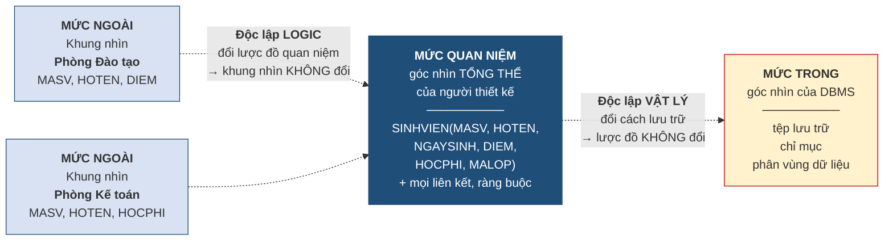

# 1.5. Kiến trúc ba mức và tính độc lập dữ liệu

*(0,5 tiết)*

## 1.5.1. Kiến trúc ba mức ANSI/SPARC

Hãy trở lại hạn chế thứ tư của hệ thống tệp: **phụ thuộc dữ liệu** — chương trình gắn chặt với cấu trúc lưu trữ. Kiến trúc ba mức là lời giải chính thức cho hạn chế đó.

Vấn đề đặt ra như sau. Cùng một cơ sở dữ liệu của trường, phòng Đào tạo cần xem *điểm*, phòng Kế toán cần xem *học phí*, còn quản trị viên cần biết dữ liệu nằm ở tệp nào trên ổ đĩa nào. Ba người, ba nhu cầu hoàn toàn khác nhau, nhưng chỉ có một cơ sở dữ liệu. Làm sao phục vụ được cả ba mà không để nhu cầu của người này ràng buộc người kia?

Ủy ban ANSI/SPARC vào những năm 1970 đưa ra lời giải: **tách sự mô tả dữ liệu thành ba mức trừu tượng** [3, tr. 46–49].

**Hình 1.6. Kiến trúc ba mức ANSI/SPARC và hai loại độc lập dữ liệu**

**Mức ngoài** *(external level)* là góc nhìn của từng nhóm người dùng. Mỗi nhóm chỉ thấy phần dữ liệu liên quan tới công việc của mình, dưới dạng một **khung nhìn** *(view)*. Một cơ sở dữ liệu có thể có rất nhiều khung nhìn khác nhau. Phòng Kế toán không nhìn thấy cột điểm, và điều đó vừa đơn giản hóa công việc của họ vừa là một biện pháp bảo mật.

**Mức quan niệm** *(conceptual level)* là góc nhìn tổng thể của người thiết kế: toàn bộ các bảng, các cột, các liên kết và ràng buộc của cả tổ chức. Mức này **chỉ có một**, và nó chính là sản phẩm của công việc thiết kế mà học phần này dạy.

**Mức trong** *(internal level)* là góc nhìn của hệ quản trị cơ sở dữ liệu: dữ liệu được lưu vào tệp nào, tổ chức theo cấu trúc gì, có chỉ mục nào để tìm nhanh. Mức này cũng chỉ có một.

Một phép loại suy giúp ghi nhớ ba mức trên là **nhà hàng**. Mức ngoài là **thực đơn** mà khách cầm trên tay — chỉ ghi tên món và giá, và nhà hàng có thể có nhiều thực đơn khác nhau cho khách chay, cho trẻ em, cho tiệc cưới. Mức quan niệm là **sổ công thức tổng thể** mà bếp trưởng nắm giữ — đầy đủ mọi món, định lượng từng nguyên liệu. Mức trong là **kho và tủ đông** — nguyên liệu cất ở ngăn nào, sắp xếp ra sao. Điểm mấu chốt: **khách không cần biết kho lạnh nằm ở đâu, và bếp trưởng không cần biết khách đang đọc trang nào của thực đơn.** Mỗi mức làm việc của mình.

## 1.5.2. Phân biệt kiến trúc ba mức với ba mức của mô hình dữ liệu

Đến đây người học đã gặp **hai bộ ba mức** khác nhau: ba mức mô hình dữ liệu ở mục 1.4.3 và ba mức kiến trúc ở mục 1.5.1. Vì tên gọi có phần trùng nhau — cả hai đều có từ "quan niệm" và "vật lý" — nên đây là chỗ nhầm lẫn kinh điển. Cần phân biệt dứt khoát.

**Bảng 1.8. Hai bộ "ba mức" — không được lẫn lộn**

| | **Ba mức của MÔ HÌNH dữ liệu** *(mục 1.4.3)* | **Ba mức của KIẾN TRÚC** *(mục 1.5.1)* |
|---|---|---|
| **Trả lời câu hỏi** | Thiết kế đi qua những **giai đoạn** nào? | Một cơ sở dữ liệu đang chạy được **mô tả** ở mấy tầng? |
| **Bản chất** | Các **bước trong quy trình thiết kế**, nối tiếp nhau theo thời gian | Các **tầng mô tả cùng tồn tại** song song tại mọi thời điểm |
| **Tên các mức** | Quan niệm → Logic → Vật lý | Ngoài → Quan niệm → Trong |
| **Số lượng** | Ba bước làm lần lượt, xong bước này sang bước kia | Mức ngoài có **nhiều**; mức quan niệm và mức trong mỗi thứ **một** |
| **Ai quan tâm** | Người thiết kế, trong giai đoạn xây dựng hệ thống | Người dùng, người thiết kế và hệ quản trị, trong suốt vòng đời hệ thống |

Cách phân biệt ngắn gọn: **ba mức mô hình là ba chặng của một hành trình; ba mức kiến trúc là ba tầng của một tòa nhà.** Hành trình đi qua từng chặng rồi kết thúc; tòa nhà thì cả ba tầng cùng đứng đó suốt thời gian sử dụng.

Điểm giao nhau giữa hai bộ khái niệm nằm ở chỗ: sản phẩm của **mô hình logic** (chặng thứ hai của hành trình thiết kế) chính là thứ được đặt vào **mức quan niệm** (tầng giữa của kiến trúc). Nói cách khác, cái mà người thiết kế vẽ ra ở Chương 3 sẽ trở thành lược đồ quan niệm của hệ thống khi vận hành.

## 1.5.3. Tính độc lập dữ liệu

Lợi ích lớn nhất mà kiến trúc ba mức mang lại có tên riêng.

!!! note "Định nghĩa 1.7"

    **Tính độc lập dữ liệu** *(data independence)* là khả năng **thay đổi mô tả dữ liệu ở một mức mà không phải sửa mô tả ở mức cao hơn**. Có hai loại:

    - **Độc lập dữ liệu vật lý** *(physical data independence)*: thay đổi cách lưu trữ ở mức trong mà **không phải sửa lược đồ quan niệm**.
    - **Độc lập dữ liệu logic** *(logical data independence)*: thay đổi lược đồ quan niệm mà **không phải sửa các khung nhìn** ở mức ngoài.

    **Ví dụ 1.3 (độc lập vật lý).** Quản trị viên nhận thấy việc tìm sinh viên theo họ tên chạy chậm, nên tạo thêm một chỉ mục trên cột `HOTEN`. Đây là thay đổi thuần túy ở mức trong. Lược đồ quan niệm `SINHVIEN(MASV, HOTEN, ...)` không đổi một chữ, và **không một ứng dụng nào phải sửa hay biên dịch lại**. Tương tự khi chuyển toàn bộ dữ liệu sang một ổ đĩa mới nhanh hơn.

    **Ví dụ 1.4 (độc lập logic).** Nhà trường quyết định bổ sung cột `EMAIL` vào bảng `SINHVIEN`. Đây là thay đổi ở mức quan niệm. Khung nhìn của phòng Kế toán vốn chỉ gồm `MASV, HOTEN, HOCPHI` nên **hoàn toàn không bị ảnh hưởng**, và phần mềm kế toán chạy bình thường như chưa có gì xảy ra.

Trong thực tế, **độc lập vật lý dễ đạt được hơn độc lập logic**. Các hệ quản trị hiện đại bảo đảm độc lập vật lý gần như trọn vẹn. Độc lập logic khó hơn vì có những thay đổi ở mức quan niệm — chẳng hạn xóa hẳn một cột mà khung nhìn đang dùng — thì không cách nào che giấu được với mức ngoài.

## 1.5.4. Điều gì xảy ra khi mất tính độc lập dữ liệu

Giá trị của tính độc lập dữ liệu chỉ thật sự hiện ra khi ta hình dung viễn cảnh không có nó. Xét lại Trung tâm ABC, giả sử trung tâm quản lý bằng hệ thống tệp và có năm chương trình cùng đọc tệp `HOCVIEN.dat`, trong đó mỗi dòng được quy ước: 10 ký tự đầu là mã học viên, 50 ký tự tiếp theo là họ tên, 10 ký tự tiếp là số điện thoại.

Nay trung tâm cần lưu thêm địa chỉ thư điện tử. Vì không có tầng trung gian nào che chắn, hậu quả dây chuyền như sau. Cấu trúc dòng dữ liệu thay đổi, nên **cả năm chương trình** đều phải được mở ra, sửa lại phần đọc tệp, biên dịch lại và triển khai lại. Trong thời gian chuyển đổi, tệp cũ và tệp mới có cấu trúc khác nhau, nên phải viết thêm một chương trình chuyển đổi dữ liệu. Nếu một trong năm chương trình bị bỏ sót — điều rất dễ xảy ra khi hệ thống đã chạy nhiều năm và người viết ban đầu đã nghỉ việc — thì chương trình đó sẽ đọc sai toàn bộ dữ liệu từ vị trí ký tự thứ 71 trở đi, mà **không báo lỗi gì cả**, chỉ đơn giản là hiển thị những chuỗi ký tự vô nghĩa.

Với kiến trúc ba mức, cũng yêu cầu ấy được xử lý bằng một thao tác duy nhất là thêm một cột vào lược đồ quan niệm. Các ứng dụng cũ vốn không hỏi tới cột mới nên tiếp tục chạy nguyên vẹn.

**Đây chính là câu trả lời cho câu hỏi "học kiến trúc ba mức để làm gì".** Nó không phải là lý thuyết suông; nó là cơ chế quyết định chi phí bảo trì của hệ thống trong suốt vòng đời — thường kéo dài mười đến hai mươi năm.

---

---

[← Trang trước](1-4-mo-hinh-du-lieu-luoc-do-va-the-hien.md) · [Trang sau →](1-6-ngon-ngu-giao-dich-va-cau-truc-cua-mot-he-quan-tri-co-so-du-lieu.md)
