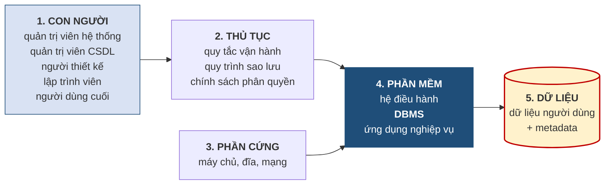

# 1.6. Ngôn ngữ, giao dịch và cấu trúc của một hệ quản trị cơ sở dữ liệu

*(0,5 tiết)*

## 1.6.1. Các nhóm ngôn ngữ cơ sở dữ liệu

Muốn làm việc với cơ sở dữ liệu, người dùng phải "nói chuyện" với hệ quản trị bằng một ngôn ngữ. Các câu lệnh được chia thành bốn nhóm theo mục đích sử dụng.

**Bảng 1.9. Bốn nhóm ngôn ngữ cơ sở dữ liệu**

| Nhóm | Tên đầy đủ | Mục đích | Lệnh tiêu biểu |
|---|---|---|---|
| **DDL** | *Data Definition Language* | **Định nghĩa cấu trúc** — tạo, sửa, xóa bảng và các đối tượng | `CREATE`, `ALTER`, `DROP` |
| **DML** | *Data Manipulation Language* | **Thao tác dữ liệu** — thêm, sửa, xóa dòng dữ liệu | `INSERT`, `UPDATE`, `DELETE` |
| **DQL** | *Data Query Language* | **Truy vấn** — lấy dữ liệu ra để xem | `SELECT` |
| **DCL** | *Data Control Language* | **Kiểm soát quyền** — cấp và thu hồi quyền truy cập | `GRANT`, `REVOKE` |

Cách phân biệt cốt lõi nằm ở chỗ **đối tượng tác động**. Lệnh DDL tác động lên **metadata** — chúng thay đổi cái khuôn, tức là lược đồ. Lệnh DML và DQL tác động lên **dữ liệu** — chúng thay đổi hoặc đọc cái bánh, tức là thể hiện. Đây chính là cặp khái niệm lược đồ – thể hiện ở mục 1.4.4 được nhìn lại từ góc độ câu lệnh.

!!! warning "Chú ý"

    Trong thực tế, **DQL thường được xem là một phần của DML** vì cả hai đều làm việc trên dữ liệu chứ không phải trên cấu trúc. Tài liệu này tách riêng để làm nổi bật vai trò đặc biệt quan trọng của truy vấn. Ngoài ra còn có nhóm **TCL** *(Transaction Control Language)* gồm `COMMIT` và `ROLLBACK`, gắn với nội dung giao dịch ở mục kế tiếp.

Cần nhắc lại phạm vi: học phần này **không dạy viết câu lệnh SQL**. Bảng trên nhằm giúp người học nhận biết được các nhóm lệnh khi gặp, và hiểu rằng thiết kế mà mình vẽ ra ở các chương sau cuối cùng sẽ được diễn đạt bằng các lệnh DDL. Kỹ năng viết SQL thuộc học phần *Hệ quản trị cơ sở dữ liệu*.

## 1.6.2. Giao dịch và các tính chất ACID

!!! note "Định nghĩa 1.8"

    **Giao dịch** *(transaction)* là một **dãy các thao tác trên cơ sở dữ liệu được xem như một đơn vị công việc không thể chia nhỏ**: hoặc toàn bộ dãy thao tác đó được thực hiện trọn vẹn, hoặc không thao tác nào có hiệu lực.

Ví dụ kinh điển là chuyển khoản ngân hàng. Chuyển 1 triệu đồng từ tài khoản A sang tài khoản B gồm hai thao tác: trừ 1 triệu ở A, rồi cộng 1 triệu vào B. Nếu hệ thống mất điện đúng vào khoảnh khắc giữa hai thao tác, tiền đã bị trừ ở A nhưng chưa được cộng vào B — **1 triệu đồng biến mất**. Cơ chế giao dịch bảo đảm tình huống đó không xảy ra: khi hệ thống khởi động lại, thao tác trừ tiền dở dang sẽ được hoàn tác, số dư của A trở về nguyên trạng.

Một giao dịch đúng đắn phải thỏa mãn bốn tính chất, gọi tắt là **ACID**.

**Bảng 1.10. Bốn tính chất ACID của giao dịch**

| Chữ | Tính chất | Nội dung | Ví dụ với thao tác chuyển khoản |
|:--:|---|---|---|
| **A** | *Atomicity* — **nguyên tố** | Làm hết hoặc không làm gì | Không thể trừ tiền ở A mà không cộng vào B |
| **C** | *Consistency* — **nhất quán** | Trước và sau giao dịch, mọi ràng buộc đều được thỏa mãn | Tổng số dư của A và B không đổi sau khi chuyển |
| **I** | *Isolation* — **cô lập** | Các giao dịch chạy đồng thời không làm nhiễu nhau | Hai người cùng chuyển tiền không làm sai số dư của nhau |
| **D** | *Durability* — **bền vững** | Kết quả đã xác nhận thì tồn tại vĩnh viễn | Đã báo "chuyển thành công" thì mất điện cũng không mất tiền |

Trong bốn tính chất, **Consistency có liên hệ trực tiếp nhất với học phần này**. Nó phát biểu rằng sau mỗi giao dịch, mọi ràng buộc của cơ sở dữ liệu phải còn nguyên vẹn. Nhưng để hệ quản trị kiểm tra được điều đó, **các ràng buộc phải được khai báo trước** — và việc xác định cho đúng những ràng buộc ấy chính là nội dung Chương 4.

Nội dung giao dịch chỉ được trình bày ở **mức nhận biết** trong học phần này. Các cơ chế cài đặt như khóa, nhật ký giao dịch, xử lý bế tắc thuộc học phần *Hệ quản trị cơ sở dữ liệu*.

## 1.6.3. Các chức năng của một hệ quản trị cơ sở dữ liệu

Một hệ quản trị cơ sở dữ liệu hiện đại đảm nhận đồng thời nhiều chức năng, có thể nhóm thành sáu nhóm chính [3, tr. 12–15].

**Quản lý từ điển dữ liệu.** Hệ quản trị lưu trữ toàn bộ metadata và tra cứu chúng mỗi khi xử lý một yêu cầu. Đây là chức năng nền tảng nhất — mọi chức năng khác đều dựa lên nó.

**Quản lý lưu trữ dữ liệu.** Hệ quản trị quyết định dữ liệu được cất giữ ra sao trên thiết bị, tạo và duy trì các cấu trúc phụ trợ như chỉ mục để tăng tốc truy vấn. Người dùng hoàn toàn không cần biết tới phần này — đó chính là biểu hiện của tính độc lập dữ liệu vật lý.

**Biến đổi và trình bày dữ liệu.** Hệ quản trị chuyển đổi giữa định dạng lưu trữ bên trong và định dạng mà người dùng mong đợi. Một ngày tháng có thể được lưu dưới dạng số nguyên nhưng hiển thị theo kiểu ngày/tháng/năm.

**Quản lý an toàn.** Hệ quản trị kiểm soát ai được xem gì, ai được sửa gì, tới từng bảng và từng cột.

**Điều khiển truy cập đồng thời.** Khi nhiều người cùng thao tác trên một dữ liệu, hệ quản trị bảo đảm kết quả vẫn đúng. Nếu hai nhân viên cùng lúc ghi danh học viên vào lớp cuối cùng còn một chỗ trống, hệ quản trị phải bảo đảm chỉ một người thành công.

**Sao lưu và phục hồi.** Hệ quản trị cung cấp cơ chế sao lưu định kỳ và khôi phục dữ liệu sau sự cố, bảo đảm tính bền vững đã nêu trong ACID.

## 1.6.4. Năm thành phần của một hệ cơ sở dữ liệu

Như đã phân biệt ở mục 1.2.2, *hệ cơ sở dữ liệu* rộng hơn nhiều so với phần mềm hệ quản trị. Nó gồm **năm thành phần**.

**Hình 1.7. Năm thành phần của một hệ cơ sở dữ liệu**

Thành phần **con người** gồm nhiều vai trò khác nhau, và người học nên định vị được mình sẽ đứng ở đâu sau khi ra trường. *Quản trị viên hệ thống* lo phần cứng và mạng. *Quản trị viên cơ sở dữ liệu* chịu trách nhiệm vận hành hệ quản trị: phân quyền, sao lưu, theo dõi hiệu năng. *Người thiết kế cơ sở dữ liệu* xây dựng lược đồ — **đây chính là vai trò mà học phần này đào tạo**. *Lập trình viên* viết các ứng dụng sử dụng cơ sở dữ liệu. *Người dùng cuối* là nhân viên nghiệp vụ khai thác hệ thống hằng ngày.

Thành phần **thủ tục** thường bị bỏ quên nhưng lại quyết định hệ thống có sống được lâu dài hay không. Một hệ thống có phần mềm tốt, phần cứng mạnh nhưng không có quy trình sao lưu rõ ràng thì vẫn có thể mất sạch dữ liệu chỉ vì một sự cố ổ cứng.

## 1.6.5. Từ điển dữ liệu trong một hệ quản trị thực tế

Metadata đã được giới thiệu ở mục 1.1.4 như một khái niệm. Mục này cho thấy nó tồn tại **thực sự** bên trong hệ quản trị dưới dạng nào — nội dung này giảng viên trình diễn trực tiếp trên lớp, người học chỉ cần quan sát và đọc hiểu, không phải tự cài đặt hay viết lệnh.

Điều đáng ngạc nhiên là: **hệ quản trị lưu metadata bằng chính các bảng dữ liệu**. Nghĩa là trong cơ sở dữ liệu có những bảng đặc biệt mà nội dung của chúng lại là mô tả về các bảng khác. Tập hợp các bảng đặc biệt này gọi là **từ điển dữ liệu** *(data dictionary)* hay **catalog hệ thống**. Trong MySQL, PostgreSQL và SQL Server, chúng nằm trong một lược đồ chuẩn tên là `INFORMATION_SCHEMA`.

!!! example "Ví dụ 1.5"

    Sau khi tạo bảng `SINHVIEN`, nếu tra cứu bảng hệ thống `INFORMATION_SCHEMA.COLUMNS` và lọc theo tên bảng, hệ quản trị sẽ trả về một kết quả có dạng như sau:

    | TABLE_NAME | COLUMN_NAME | DATA_TYPE | IS_NULLABLE | CHARACTER_MAXIMUM_LENGTH |
    |---|---|---|:--:|:--:|
    | SINHVIEN | MASV | varchar | NO | 10 |
    | SINHVIEN | HOTEN | varchar | NO | 50 |
    | SINHVIEN | NGAYSINH | date | YES | *(trống)* |
    | SINHVIEN | DIEMTB | decimal | YES | *(trống)* |

    Hãy đối chiếu kết quả này với Bảng 1.3 ở mục 1.1.4. Đó chính là **cùng một metadata**: một bên là cách con người ghi ra giấy khi thiết kế, một bên là cách hệ quản trị tự lưu lại để máy sử dụng.

Quan sát này có ý nghĩa vượt xa một thao tác kỹ thuật. Nó cho thấy metadata **không phải là tài liệu đi kèm cơ sở dữ liệu, mà là một bộ phận của chính cơ sở dữ liệu**. Nhờ vậy hệ quản trị có thể tự đọc metadata để kiểm tra dữ liệu nhập vào, và các công cụ bên ngoài có thể tự sinh ra tài liệu thiết kế hoặc mã nguồn từ cơ sở dữ liệu đang chạy.

---

---

[← Trang trước](1-5-kien-truc-ba-muc-va-tinh-doc-lap-du-lieu.md) · [Trang sau →](1-7-vi-du-tong-hop-trung-tam-anh-ngu-abc.md)
