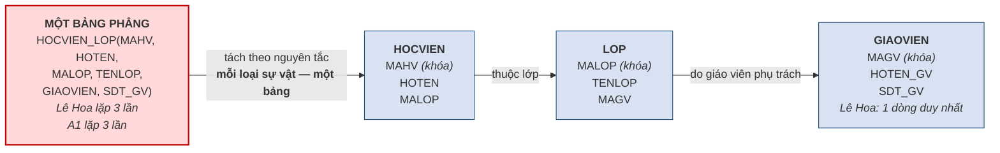

# 1.7. Ví dụ tổng hợp: Trung tâm Anh ngữ ABC

Mục này vận dụng toàn bộ khái niệm của chương vào một tình huống trọn vẹn. Ví dụ ở đây sẽ được dùng lại và mở rộng liên tục cho đến hết Chương 5, nên người học cần nắm thật chắc.

**Tình huống.** Trung tâm Anh ngữ ABC quản lý toàn bộ hoạt động bằng **một bảng dữ liệu duy nhất**, chính là Bảng 1.10 đã trình bày ở mục 1.3.2. Ta phân tích tình huống này theo bốn bước.

**Bước 1 — Nhận diện dư thừa.** Như đã đếm ở mục 1.3.2, thông tin của cô Lê Hoa gồm họ tên và số điện thoại bị lặp lại **ba lần**, tên lớp "Anh cơ bản 1" cũng lặp **ba lần**. Sáu trong hai mươi tư ô là thừa.

**Bước 2 — Chỉ ra ba dị thường.** Dư thừa không dừng lại ở lãng phí; nó sinh ra ba loại sự cố cụ thể khi vận hành.

**Bảng 1.24. Ba dị thường trên bảng phẳng và cách thiết kế mới khắc phục**

| Loại dị thường | Tình huống trên bảng phẳng | Hậu quả | Trên thiết kế ba bảng |
|---|---|---|---|
| **Dị thường sửa** *(update)* | Cô Lê Hoa đổi số điện thoại | Phải sửa **ba dòng**; sót một dòng là cơ sở dữ liệu có hai số điện thoại khác nhau cho cùng một người | Số điện thoại nằm ở **đúng một dòng** trong bảng `GIAOVIEN`; sửa một lần, **không thể** mâu thuẫn |
| **Dị thường thêm** *(insert)* | Mở lớp A3 mới, chưa tuyển được học viên nào | **Không thêm được**, vì mỗi dòng bắt buộc phải có mã học viên. Muốn lưu lớp A3 phải bịa ra một học viên không có thật | Thêm lớp A3 vào bảng `LOP`, **không cần** học viên nào |
| **Dị thường xóa** *(delete)* | Học viên HV04 nghỉ học, xóa dòng của em | **Mất luôn** thông tin lớp A2 và cô Trần Mai, dù lớp và giáo viên vẫn đang tồn tại | Xóa HV04 khỏi bảng `HOCVIEN`; lớp A2 và cô Trần Mai **vẫn nguyên vẹn** |

Trong ba loại trên, **dị thường xóa nguy hiểm nhất** vì đó là mất mát dữ liệu thật sự và mất **trong im lặng** — hệ thống không báo lỗi, không cảnh báo, người dùng chỉ phát hiện ra khi cần tới thông tin đã mất.

**Bước 3 — Tách bảng để khắc phục.** Nguyên tắc tách rất đơn giản về mặt trực giác: **mỗi loại sự vật được lưu vào một bảng riêng**. Ở đây có ba loại sự vật là học viên, lớp học và giáo viên, nên ta tách thành ba bảng.

**Hình 1.11. Từ một bảng phẳng thành ba bảng liên kết**

Ba bảng thu được, viết theo quy ước sẽ dùng từ Chương 3 trở đi:

- `GIAOVIEN(MAGV, HOTEN_GV, SDT_GV)`
- `LOP(MALOP, TENLOP, MAGV)` — trong đó `MAGV` liên kết tới bảng `GIAOVIEN`
- `HOCVIEN(MAHV, HOTEN, MALOP)` — trong đó `MALOP` liên kết tới bảng `LOP`

Nhưng lược đồ mới chỉ là cái khuôn. Điều thuyết phục nhất là nhìn **chính bốn dòng dữ liệu của Bảng 1.10** được phân bố lại vào ba bảng.

**Bảng 1.25. Cùng dữ liệu ấy sau khi tách thành ba bảng**

`GIAOVIEN`

| MAGV | HOTEN_GV | SDT_GV |
|---|---|---|
| GV1 | Lê Hoa | 0905111111 |
| GV2 | Trần Mai | 0905222222 |

`LOP`

| MALOP | TENLOP | MAGV |
|---|---|---|
| A1 | Anh cơ bản 1 | GV1 |
| A2 | Anh giao tiếp | GV2 |

`HOCVIEN`

| MAHV | HOTEN | MALOP |
|---|---|---|
| HV01 | Trần An | A1 |
| HV02 | Lê Bình | A1 |
| HV03 | Phạm Cường | A1 |
| HV04 | Võ Dung | A2 |

Hãy đối chiếu với Bảng 1.10. Cô **Lê Hoa** trước đây xuất hiện **ba lần**, nay chỉ còn **một dòng duy nhất** trong bảng `GIAOVIEN`. Tên lớp *"Anh cơ bản 1"* trước lặp ba lần, nay cũng chỉ còn một. Ba dòng học viên của lớp A1 giờ chỉ giữ lại mã lớp `A1` — một giá trị ngắn đóng vai trò **con đường dẫn** tới thông tin đầy đủ nằm ở bảng khác.

!!! warning "Chú ý — một con số bất ngờ, và bài học rút ra từ nó"

    Hãy đếm số ô của thiết kế mới: `GIAOVIEN` có 2 × 3 = 6 ô, `LOP` có 2 × 3 = 6 ô, `HOCVIEN` có 4 × 3 = 12 ô. Tổng cộng **24 ô** — **đúng bằng** 24 ô của bảng phẳng ban đầu. Tách bảng ở quy mô này **không tiết kiệm được ô nào cả**, vì phần dư thừa loại bỏ được vừa đúng bằng phần cột khóa phải thêm vào.

    Điều đó dẫn tới một kết luận quan trọng: **chuẩn hóa không phải để tiết kiệm dung lượng.** Mục đích thật sự là **loại bỏ dị thường** — tức bảo đảm dữ liệu luôn đúng và không mâu thuẫn. Dung lượng chỉ là hệ quả phụ, và nó chỉ hiện ra khi dữ liệu lớn lên.

**Bảng 1.26. Số ô của hai thiết kế theo quy mô — n là số học viên lớp A1**

| Quy mô | Bảng phẳng: `6(n + 1)` ô | Ba bảng: `12 + 3(n + 1)` ô | Tiết kiệm |
|---|:--:|:--:|:--:|
| n = 3 *(ví dụ trên)* | 24 | 24 | 0 % |
| n = 10 | 66 | 45 | 32 % |
| n = 30 | 186 | 105 | 44 % |
| n = 300 | 1.806 | 915 | 49 % |

Hai thiết kế bằng nhau đúng tại n = 3; từ đó trở đi ba bảng luôn ít ô hơn, và tỷ lệ tiết kiệm tiến tới 50 % khi n lớn.

> Thử với quy mô thật: nếu lớp A1 có **30 học viên** thay vì 3, tổng cộng 31 học viên. Bảng phẳng cần 31 × 6 = **186 ô**. Thiết kế ba bảng cần 6 + 6 + 31 × 3 = **105 ô** — tiết kiệm khoảng **44%**. Càng nhiều dữ liệu, khoảng cách càng lớn; nhưng ngay cả khi nó bằng không như ví dụ trên, việc tách vẫn đáng làm, **vì lý do đúng đắn chứ không phải vì lý do dung lượng**.

**Bước 4 — Kiểm chứng.** Cột cuối của Bảng 1.24 đã cho thấy cả ba dị thường đều biến mất trên thiết kế mới. Điều đáng chú ý là chúng biến mất **không phải nhờ một quy tắc vá lỗi nào**, mà nhờ nguyên nhân gốc rễ đã được loại bỏ: sau khi tách, mỗi sự thật chỉ còn được lưu ở **đúng một chỗ**.

!!! warning "Chú ý — và một lời hẹn với các chương sau"

    Ở chương này ta tách bảng **bằng trực giác**, theo cảm nhận "thấy giá trị lặp lại thì tách ra". Cách làm ấy đủ dùng cho một bảng sáu cột, nhưng sẽ sụp đổ khi đứng trước một hệ thống bốn mươi bảng: lúc đó không còn nhìn bằng mắt mà thấy được, và hai người thiết kế sẽ cho ra hai kết quả khác nhau mà không ai chứng minh được ai đúng.

    Vì vậy học phần cần một **phương pháp**. Chương 2 sẽ thay trực giác bằng một quy trình có kỷ luật để phát hiện ra các loại sự vật cần tách. Chương 3 cho ta cấu trúc chặt chẽ để biểu diễn chúng. Chương 4 bổ sung các ràng buộc bảo vệ tính đúng đắn. Và **Chương 5 sẽ chuẩn hóa lại đúng bảng phẳng này bằng công cụ toán học — kết quả thu được sẽ đúng bằng ba bảng mà hôm nay ta vừa đoán ra, nhưng lần đó ta chứng minh được vì sao nó đúng.**

!!! question "Tự kiểm tra 1.7"

    *(tự trả lời trước, rồi mở đáp án bên dưới)*

    1. Trên bảng phẳng của ABC, mở lớp A3 chưa có học viên gặp dị thường nào? Vì sao?
    2. Vì sao tách bảng ở quy mô 3 học viên không tiết kiệm được ô nào mà vẫn đáng làm?
    3. Lệnh `CREATE TABLE` thuộc nhóm ngôn ngữ nào và tác động lên lược đồ hay thể hiện?

??? success "Đáp án tự kiểm tra 1.7"

    *(1)* Dị thường thêm: mỗi dòng bắt buộc có mã học viên, chưa có học viên thì không thêm được lớp. *(2)* Vì mục đích của việc tách là loại bỏ ba dị thường, không phải tiết kiệm dung lượng; dung lượng chỉ là hệ quả phụ hiện ra khi dữ liệu lớn. *(3)* Nhóm DDL; tác động lên lược đồ (cái khuôn), không phải thể hiện.

---

---

[← Trang trước](1-6-ngon-ngu-giao-dich-va-cau-truc-cua-mot-he-quan-tri-co-so-du-lieu.md) · [Trang sau →](tom-tat.md)
