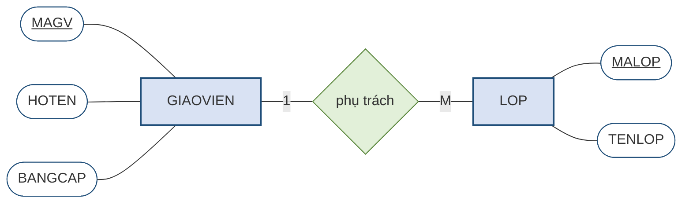

# 2.1. Quá trình thiết kế cơ sở dữ liệu và quy tắc nghiệp vụ

*(1,0 tiết)*

## 2.1.1. Ba mức thiết kế

Chương 1 đã giới thiệu ba mức của mô hình dữ liệu ở mục 1.4.3. Mục này nhìn lại chúng dưới góc độ **quy trình làm việc**, vì đó chính là bản đồ cho phần còn lại của học phần.

**Thiết kế quan niệm** *(conceptual design)* trả lời câu hỏi **"nghiệp vụ có những gì?"**. Kết quả là một lược đồ ER mô tả thế giới thực, hoàn toàn độc lập với mọi công nghệ. Đây là nội dung của **Chương 2**.

**Thiết kế logic** *(logical design)* trả lời câu hỏi **"tổ chức thành bảng ra sao?"**. Kết quả là một tập các quan hệ với đầy đủ khóa chính và khóa ngoại. Đây là nội dung của **Chương 3**, và một phần của Chương 5.

**Thiết kế vật lý** *(physical design)* trả lời câu hỏi **"lưu lên đĩa thế nào?"** — chọn kiểu dữ liệu cụ thể, tạo chỉ mục, phân vùng. Phần này thuộc học phần *Hệ quản trị cơ sở dữ liệu*.

!!! warning "Chú ý"

    Trình tự ba mức phải được tôn trọng. Sai lầm phổ biến nhất của người mới học là **nhảy thẳng vào thiết kế bảng** ngay khi đọc xong đề bài, bỏ qua mức quan niệm. Hậu quả là thiết kế bám sát cách diễn đạt tình cờ của đề bài thay vì bám sát bản chất nghiệp vụ, và khi nghiệp vụ thay đổi một chút thì toàn bộ thiết kế phải làm lại.

## 2.1.2. Quy tắc nghiệp vụ — nguyên liệu đầu vào

Thiết kế quan niệm cần nguyên liệu, và nguyên liệu ấy là quy tắc nghiệp vụ.

!!! note "Định nghĩa 2.1"

    **Quy tắc nghiệp vụ** *(business rule)* là một **phát biểu ngắn gọn, rõ ràng, bằng ngôn ngữ tự nhiên**, mô tả một chính sách, một quy trình hoặc một ràng buộc trong hoạt động của tổ chức.

Quy tắc nghiệp vụ không do người thiết kế nghĩ ra. Chúng được **thu thập** từ ba nguồn: phỏng vấn người sử dụng hệ thống, đọc tài liệu và biểu mẫu hiện hành, và quan sát quy trình làm việc thực tế. Đây là công việc của con người với con người, không phải công việc kỹ thuật — nhưng chất lượng của toàn bộ thiết kế phụ thuộc vào nó.

Vai trò của quy tắc nghiệp vụ đối với người thiết kế có ba mặt. Thứ nhất, chúng **xác định phạm vi**: cái gì cần lưu, cái gì không. Thứ hai, chúng **quyết định cấu trúc**: mỗi quy tắc thường ứng với một thành phần cụ thể của lược đồ ER. Thứ ba, chúng là **căn cứ để tranh luận**: khi hai người thiết kế bất đồng, cách giải quyết không phải là ai lớn tiếng hơn mà là quay lại đọc quy tắc nghiệp vụ.

## 2.1.3. Thế nào là một quy tắc nghiệp vụ tốt

Không phải phát biểu nào của khách hàng cũng dùng được. Một quy tắc nghiệp vụ tốt phải **đếm được** — nghĩa là từ nó, người thiết kế rút ra được một con số hoặc một quyết định dứt khoát.

!!! example "Ví dụ 2.1"

    Xét ba phát biểu sau về Trung tâm ABC.

    **(a)** *"Chúng tôi quản lý học viên rất chặt chẽ."* — Đây **không phải** quy tắc nghiệp vụ. Nó không cho biết cần lưu gì, cũng không cho biết ràng buộc nào. Người thiết kế không rút ra được điều gì.

    **(b)** *"Học viên có thể học nhiều lớp."* — Đây là một quy tắc **chấp nhận được nhưng chưa đủ**. Nó cho biết một chiều của liên kết, còn thiếu chiều kia.

    **(c)** *"Một học viên có thể ghi danh nhiều lớp; một lớp có nhiều học viên; mỗi lượt ghi danh được ghi nhận ngày ghi danh và mức học phí."* — Đây là một quy tắc **tốt**. Từ nó, người thiết kế rút ra ngay: liên kết là **nhiều–nhiều**, và liên kết ấy **có thuộc tính riêng**.

Ba đặc điểm của một quy tắc nghiệp vụ tốt có thể tóm lại như sau. Nó **nói về một sự việc cụ thể** chứ không phải một cảm nhận chung. Nó **dùng các từ chỉ số lượng** — một, nhiều, không quá, ít nhất — để người đọc đếm được. Và nó **nêu cả hai chiều** khi mô tả mối liên hệ giữa hai sự vật.

!!! warning "Chú ý"

    Khi khách hàng phát biểu mơ hồ, nhiệm vụ của người thiết kế **không phải** là tự đoán mà là **hỏi lại cho rõ**. Câu hỏi hữu ích nhất luôn có dạng *"Một X thì liên quan tới bao nhiêu Y?"* — và phải hỏi cả chiều ngược lại. Kỹ thuật này được trình bày ở mục 2.4.2.

## 2.1.4. Lược đồ ER — sản phẩm của thiết kế quan niệm

Mục 2.1.1 đã nói rằng thiết kế quan niệm cho ra một **lược đồ ER**, nhưng chưa nói lược đồ ấy trông như thế nào. Cần bổ khuyết điều đó ngay bây giờ, vì lý do rất giản dị: người thợ chỉ đọc được bản vẽ khi đã hình dung được ngôi nhà hoàn thiện. Mục này đưa ra **cái nhìn toàn cảnh** — vừa đủ để đọc một lược đồ nhỏ và để hiểu các mục sau đang bàn về cái gì. Chi tiết của từng thành phần sẽ được trình bày lần lượt từ mục 2.2 đến mục 2.7.

!!! note "Định nghĩa 2.2"

    **Mô hình thực thể – liên kết** *(Entity–Relationship model, ER)* là một mô hình dữ liệu ở **mức quan niệm**, mô tả thế giới thực bằng **ba loại thành phần**: **thực thể**, **thuộc tính** và **liên kết**. Bản vẽ biểu diễn mô hình ấy được gọi là **lược đồ ER** *(Entity–Relationship Diagram, ERD)*.

Ba thành phần ấy không phải là phát minh kỹ thuật xa lạ. Chúng ứng với ba câu hỏi rất đời thường mà bất kỳ ai cũng đặt ra khi tìm hiểu một tổ chức.

**Thực thể** trả lời câu hỏi **"ở đây có những sự vật nào?"** — học viên, lớp học, giáo viên. Trên lược đồ, mỗi thực thể là một **hình chữ nhật**.

**Thuộc tính** trả lời câu hỏi **"mỗi sự vật ấy cần biết những gì?"** — học viên thì cần biết mã, họ tên, ngày sinh. Trên lược đồ, mỗi thuộc tính là một **hình oval** nối vào thực thể của nó bằng một đoạn thẳng.

**Liên kết** trả lời câu hỏi **"các sự vật ấy quan hệ với nhau ra sao?"** — giáo viên phụ trách lớp. Trên lược đồ, mỗi liên kết là một **hình thoi** đặt giữa hai thực thể, và **con số ghi trên cạnh nối** cho biết một bên đi với bao nhiêu bên kia.

Hình 2.1 là một lược đồ ER hoàn chỉnh — nhỏ nhất có thể, nhưng đã đủ cả ba thành phần.

**Hình 2.1. Một lược đồ ER nhỏ — ba thành phần cơ bản**

Điều đáng chú ý nhất ở hình trên là nó **đọc thành lời được**, và câu đọc ra là một câu tiếng Việt bình thường: *"Mỗi giáo viên — có mã giáo viên, họ tên, bằng cấp — phụ trách nhiều lớp; mỗi lớp — có mã lớp, tên lớp — do đúng một giáo viên phụ trách."* Chính đặc điểm này làm nên giá trị của mô hình ER. Chủ trung tâm ABC không biết gì về cơ sở dữ liệu vẫn đọc được lược đồ và có thể nói ngay: *"chỗ này chưa đúng, một lớp bên tôi đôi khi có hai giáo viên dạy chung"*. Một sai sót được phát hiện ở giai đoạn này chỉ tốn công sửa một nét vẽ; cũng sai sót ấy nếu để lọt tới lúc hệ thống đã chạy thì tốn kém gấp bội.

!!! warning "Chú ý"

    Lược đồ ER **không phải** bản thiết kế bảng. Trong Hình 2.1 không có dòng dữ liệu nào, không có kiểu dữ liệu, không có khóa ngoại — vì đây là bản mô tả **thế giới thực**, chưa phải bản mô tả **cách lưu trữ**. Việc biến lược đồ ER thành các bảng cụ thể là công việc của Chương 3.

Ba thành phần trên mới là bộ khung. Trên bộ khung ấy, mô hình ER còn bổ sung một số sắc thái mà chương này sẽ lần lượt trình bày: thuộc tính nào đóng vai trò **thuộc tính khóa** để phân biệt các cá thể *(mục 2.3)*; một liên kết có **kết nối** và **sự tham gia** ra sao *(mục 2.5)*; và ba trường hợp đặc biệt — liên kết đệ quy, thực thể yếu, liên kết nhiều–nhiều *(mục 2.6)*. Bộ ký hiệu đầy đủ được tổng hợp thành bảng tra ở **mục 2.2.2**.

## 2.1.5. Từ quy tắc nghiệp vụ sang thành phần của mô hình ER

Đã có nguyên liệu *(quy tắc nghiệp vụ, mục 2.1.2)* và đã biết sản phẩm cần làm ra trông như thế nào *(lược đồ ER, mục 2.1.4)*, còn lại là câu hỏi nối hai đầu ấy: **đọc một câu quy tắc nghiệp vụ thì rút ra được thành phần nào của lược đồ?**

Có một quy luật rất tiện dụng: **loại từ trong câu quy tắc nghiệp vụ gợi ý loại thành phần trong lược đồ ER**. Quy luật này không phải là công thức máy móc, nhưng nó cho người thiết kế một điểm khởi đầu vững chắc.

**Bảng 2.1. Phiên dịch quy tắc nghiệp vụ sang thành phần ER**

| Trong câu quy tắc nghiệp vụ | Thường tương ứng với | Ví dụ tại Trung tâm ABC |
|---|---|---|
| **Danh từ** chỉ sự vật cần lưu thông tin | **Thực thể** *(mục 2.2)* | *"trung tâm có nhiều **giáo viên**"* → thực thể `GIAOVIEN` |
| **Danh từ** chỉ đặc điểm của một sự vật | **Thuộc tính** *(mục 2.2)* | *"mỗi giáo viên có **họ tên**, **bằng cấp**"* |
| **Động từ** nối hai danh từ | **Liên kết** *(mục 2.4)* | *"mỗi lớp **do** một giáo viên **phụ trách**"* |
| Từ chỉ **số lượng**: một, nhiều | **Kết nối** *(1:1, 1:M, M:N — mục 2.5)* | *"một giáo viên phụ trách **nhiều** lớp"* |
| Cụm **"có thể"**, **"chưa có"** | **Tham gia tùy chọn** *(mục 2.5)* | *"giáo viên **có thể chưa** phụ trách lớp nào"* |
| Cụm **"bắt buộc"**, **"phải"** | **Tham gia bắt buộc** *(mục 2.5)* | *"mỗi lớp **phải** thuộc một khóa học"* |
| **Nhiều giá trị** cho cùng một đặc điểm | **Thuộc tính đa trị** → phải tách *(mục 2.2.4)* | *"học viên có **nhiều số điện thoại**"* |

Cột giữa có ghi kèm số mục, vì ở đây người học mới chỉ cần **nhận ra tên gọi** của từng thành phần chứ chưa cần nắm hết sắc thái của nó; mỗi thành phần sẽ được học kỹ ở mục tương ứng. Bảng này vì vậy nên được xem như một **bảng tra dùng lại nhiều lần**: mục 2.9 sẽ quay lại dùng đúng nó để giải trọn vẹn bài toán Trung tâm ABC.

Cần nhấn mạnh rằng bảng trên là **gợi ý chứ không phải quy tắc tuyệt đối**. Không phải danh từ nào cũng thành thực thể — nếu một danh từ chỉ có duy nhất một đặc điểm và không liên kết với gì khác, nó thường chỉ nên là thuộc tính. Mục 2.2.1 sẽ đưa ra tiêu chí phân biệt.

---

---

[← Trang trước](index.md) · [Trang sau →](2-2-thuc-the-va-thuoc-tinh.md)
