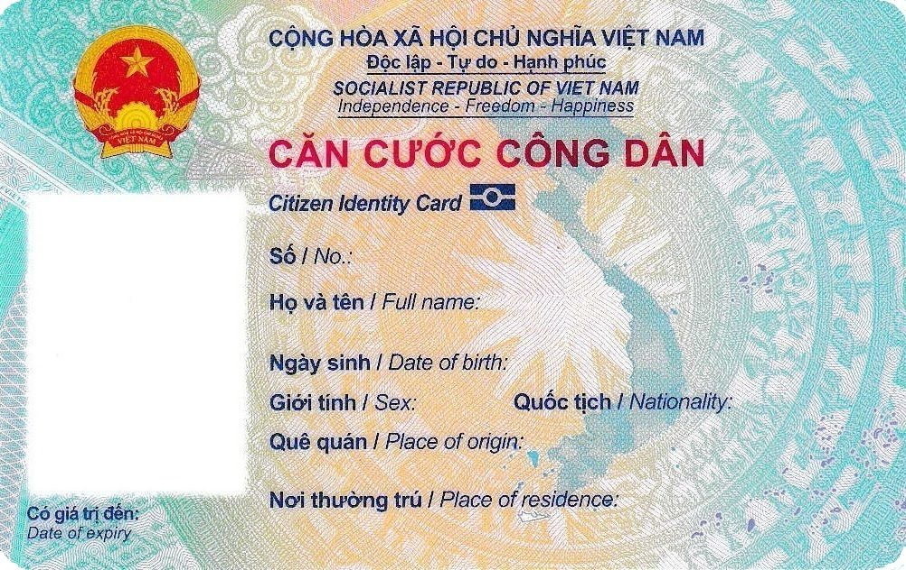
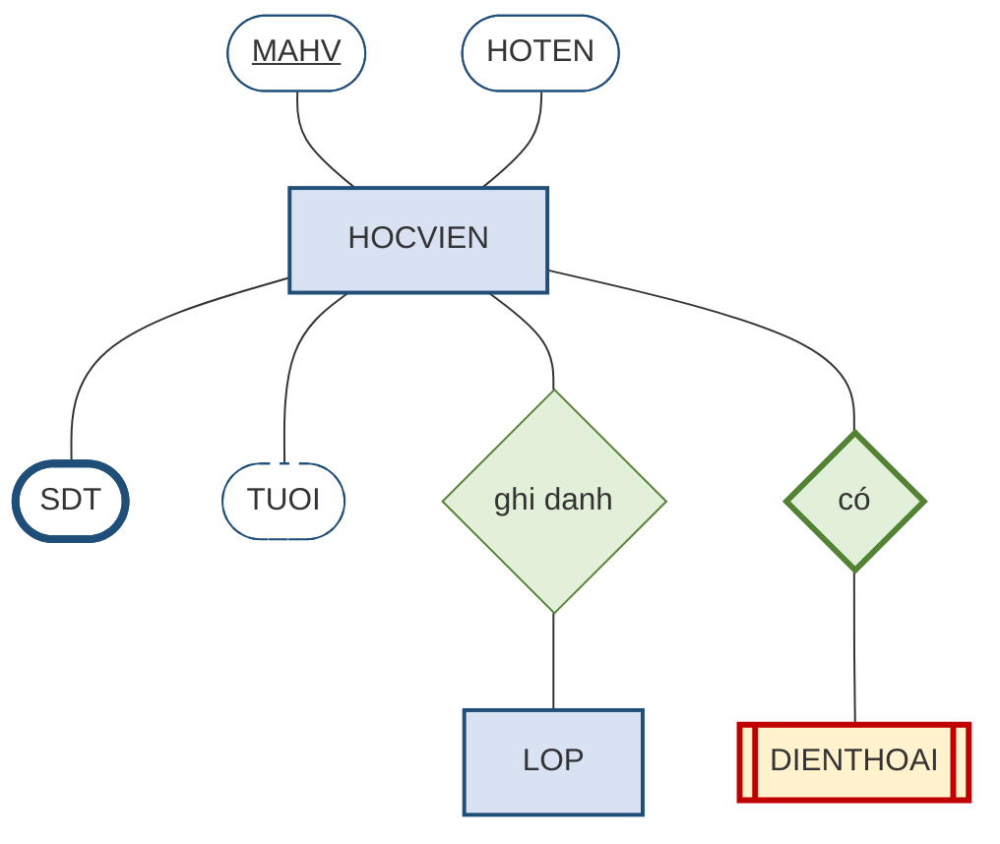
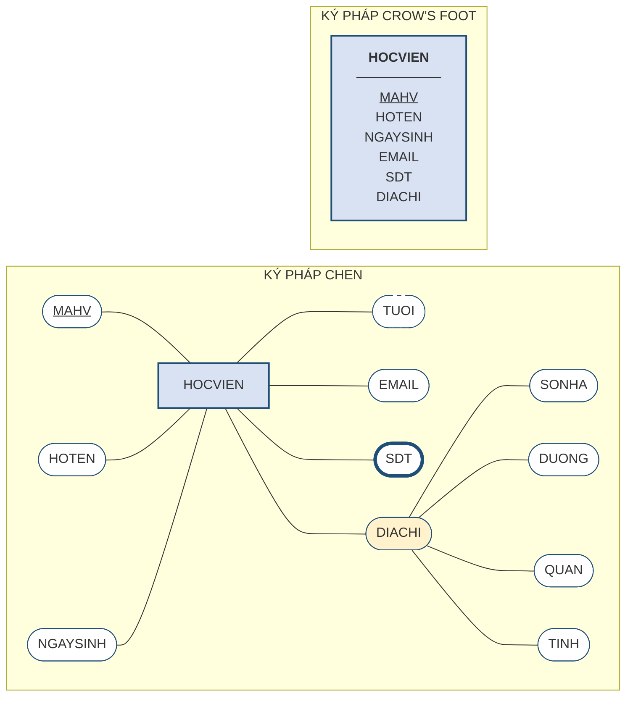
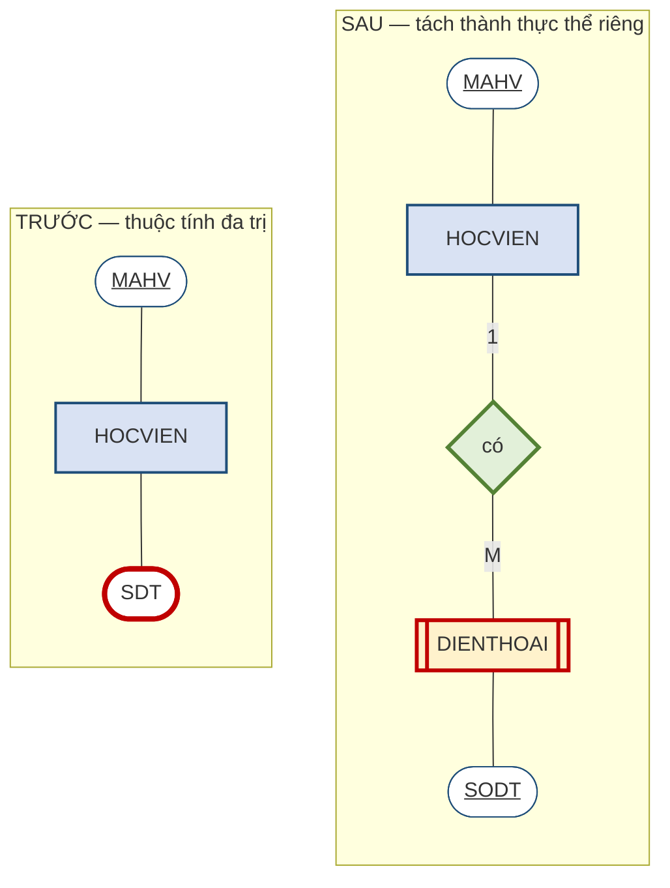

# 2.2. Thực thể và thuộc tính

*(1,5 tiết)*

Mục 2.1.4 đã giới thiệu ba thành phần của lược đồ ER ở mức toàn cảnh. Từ đây trở đi, chương này đi vào từng thành phần theo đúng thứ tự ấy. Mục 2.2 bàn về **hai thành phần đầu — thực thể và thuộc tính**; liên kết sẽ được bàn từ mục 2.4.

## 2.2.1. Thực thể và thể hiện thực thể

!!! note "Định nghĩa 2.3"

    **Thực thể** *(entity)* — chính xác hơn là **kiểu thực thể** *(entity type)* — là một **loại sự vật hoặc sự kiện** mà tổ chức cần lưu trữ thông tin về nó. **Thể hiện thực thể** *(entity instance)* là **một cá thể cụ thể** thuộc loại đó.

Cặp khái niệm này song song hoàn toàn với cặp *lược đồ – thể hiện* ở mục 1.4.4 của Chương 1. `HOCVIEN` là một thực thể — nó là cái khuôn, mô tả rằng mọi học viên đều có mã, họ tên, ngày sinh. Còn "HV01, Trần An, sinh 12/04/2005" là một **thể hiện** — một cá thể cụ thể đúc ra từ khuôn ấy. Trong lược đồ ER ta chỉ vẽ **thực thể**; các thể hiện chỉ xuất hiện khi hệ thống đã vận hành và có dữ liệu thật.

Câu hỏi khó hơn là: **khi nào một danh từ xứng đáng trở thành thực thể?** Có ba tiêu chí thực dụng.

{width=70%}

*Ảnh minh họa: mẫu Căn cước công dân. Nhìn tấm thẻ như một thực thể `CONGDAN`: mỗi ô trên thẻ là một thuộc tính; số định danh là thuộc tính khóa; nơi thường trú gồm nhiều phần là thuộc tính phức hợp — Nguồn: Wikimedia Commons · Chính phủ Việt Nam · Public domain.*

Thứ nhất, nó phải có **nhiều hơn một đặc điểm** cần lưu. Nếu về "màu sắc" ta chỉ cần lưu duy nhất tên màu, thì màu sắc nên là một thuộc tính chứ không phải một thực thể. Nhưng nếu ta còn cần lưu mã màu, nhà cung cấp sơn và ngày cập nhật bảng màu, thì nó đã đủ tư cách làm thực thể.

Thứ hai, nó phải có **nhiều cá thể phân biệt được**. Một sự vật chỉ tồn tại đúng một bản — chẳng hạn "bản thân trung tâm ABC" — không nên làm thực thể, vì bảng dữ liệu tương ứng sẽ chỉ có một dòng.

Thứ ba, nó phải **có liên kết với sự vật khác**. Một danh từ đứng biệt lập, không liên hệ với bất cứ gì trong hệ thống, thường là dấu hiệu nó nằm ngoài phạm vi bài toán.

## 2.2.2. Ký pháp Chen — bộ ký hiệu của lược đồ ER

Hình 2.1 mới dùng tới ba ký hiệu cơ bản — chữ nhật, oval, hình thoi. Bộ ký hiệu đầy đủ còn vài ký hiệu nữa, và trước khi đi tiếp vào các khái niệm thì cần thống nhất **cách vẽ** cho cả chương. Giáo trình này chọn **ký pháp Chen** làm ký pháp chính, vì ba lý do.

Thứ nhất, đây là **ký pháp gốc**, do chính Peter Chen đề xuất năm 1976 cùng với mô hình ER. Thứ hai, nó **tường minh nhất**: mỗi khái niệm có một ký hiệu riêng, nhìn vào hình là đọc ra ngay, không cần tra bảng quy ước. Thứ ba — và quan trọng nhất về mặt sư phạm — nó **buộc người vẽ phải nghĩ**: muốn vẽ một thuộc tính đa trị, ta phải cố tình vẽ hai đường viền; muốn vẽ một thuộc tính khóa, ta phải cố tình gạch chân. Mỗi nét vẽ là một quyết định thiết kế được ghi nhận. Ký pháp Crow's Foot gọn hơn nhưng lại giấu bớt các quyết định ấy đi, nên phù hợp hơn ở giai đoạn làm tài liệu chứ không phải giai đoạn học.

**Bảng 2.2. Bộ ký hiệu của ký pháp Chen**

| Khái niệm | Ký hiệu Chen | Ghi chú |
|---|---|---|
| **Thực thể** | Hình chữ nhật | Ghi tên thực thể, viết in |
| **Thực thể yếu** | Hình chữ nhật **hai đường viền** | Xem mục 2.6.3 |
| **Thuộc tính** | Hình **oval** nối với thực thể bằng một đoạn thẳng | |
| **Thuộc tính khóa** | Oval có tên **gạch chân** | Xem mục 2.3 |
| **Thuộc tính đa trị** | Oval **hai đường viền** | Phải tách — xem mục 2.2.4 |
| **Thuộc tính dẫn xuất** | Oval **nét đứt** | Thường không lưu — xem mục 2.2.5 |
| **Thuộc tính phức hợp** | Oval mẹ, các oval con nối vào | |
| **Liên kết** | Hình **thoi** đặt giữa hai thực thể | Ghi động từ |
| **Liên kết định danh** | Hình thoi **hai đường viền** | Nối tới thực thể yếu |
| **Kết nối** | Ghi `1`, `M`, `N` **trên cạnh nối**, ở đầu nào mô tả số lượng thực thể ở đầu đó | Xem mục 2.5.1 |
| **Lực lượng và tham gia** | Cặp `(min, max)` ghi **cạnh thực thể**, cho biết một thể hiện của thực thể ấy tham gia liên kết ít nhất/nhiều nhất bao nhiêu lần; `min = 0` là tùy chọn, `min ≥ 1` là bắt buộc | Xem mục 2.5.1 và 2.5.3 |
| **Tham gia bắt buộc** *(cách vẽ gốc)* | Cạnh nối vẽ **hai vạch** | Giáo trình dùng cặp `(min, max)` thay cho cách này |
| **Thuộc tính của liên kết** | Oval nối vào **hình thoi** thay vì vào chữ nhật | Xem mục 2.6.4 |
| **Thực thể cha – con** | **Vòng tròn** đặt giữa cha và các con, trong ghi `d` *(rời nhau)* hoặc `o` *(chồng lấn)* | Xem mục 2.7 |
| **Phân cấp đầy đủ** | Cạnh nối cha với vòng tròn ghi **"đầy đủ"** *(cách vẽ gốc: hai vạch)*; **"không đầy đủ"** là một vạch | Xem mục 2.7.5 |

**Hình 2.3. Bộ ký hiệu Chen — tổng quan**

Đọc hình trên theo thứ tự: `MAHV` là **thuộc tính khóa** *(gạch chân)*; `HOTEN` là thuộc tính thường; `SDT` là **thuộc tính đa trị** *(viền dày, thể hiện hai đường viền)*; `TUOI` là **thuộc tính dẫn xuất** *(nét đứt)*; `DIENTHOAI` là **thực thể yếu** *(chữ nhật hai viền)* nối với `HOCVIEN` qua **liên kết định danh** *(hình thoi viền dày)*.

!!! warning "Chú ý về hình vẽ trong giáo trình này"

    Công cụ vẽ được dùng để tạo hình minh họa thể hiện oval dưới dạng **hình bo tròn hai đầu**, và thể hiện "hai đường viền" bằng **đường viền dày**. Khi vẽ tay hoặc vẽ bằng draw.io, người học hãy vẽ đúng chuẩn: **oval thật** và **hai đường viền thật**.

## 2.2.3. Bốn cặp phân loại thuộc tính

!!! note "Định nghĩa 2.4"

    **Thuộc tính** *(attribute)* là một **đặc điểm** của thực thể mà ta cần lưu trữ.

Thuộc tính được phân loại theo bốn cặp tiêu chí độc lập với nhau. Một thuộc tính cụ thể sẽ mang một giá trị trên mỗi cặp — chẳng hạn có thể vừa là *phức hợp* vừa là *đơn trị* vừa là *lưu trữ* vừa là *bắt buộc*.

**Bảng 2.3. Bốn cặp phân loại thuộc tính**

| Cặp tiêu chí | Loại thứ nhất | Loại thứ hai | Ví dụ tại Trung tâm ABC |
|---|---|---|---|
| **Theo cấu trúc** | **Đơn** *(simple)* — không chia nhỏ được | **Phức hợp** *(composite)* — gồm nhiều phần có nghĩa | `NGAYSINH` là đơn; `DIACHI` là phức hợp *(số nhà, đường, quận, tỉnh)* |
| **Theo số giá trị** | **Đơn trị** *(single-valued)* — một cá thể có một giá trị | **Đa trị** *(multivalued)* — một cá thể có nhiều giá trị | `HOTEN` là đơn trị; `SDT` của học viên là **đa trị** |
| **Theo nguồn gốc** | **Lưu trữ** *(stored)* — được nhập vào và cất giữ | **Dẫn xuất** *(derived)* — tính ra từ thuộc tính khác | `NGAYSINH` là lưu trữ; `TUOI` là **dẫn xuất** |
| **Theo tính bắt buộc** | **Bắt buộc** *(required)* — không được để trống | **Tùy chọn** *(optional)* — được phép trống | `HOTEN` bắt buộc; `EMAIL` có thể tùy chọn |

Bốn cặp tiêu chí trên đều có chỗ trên lược đồ Chen. Hãy vẽ **một thực thể `HOCVIEN` mang đủ mọi loại thuộc tính** theo cả hai ký pháp để thấy điều đó.

**Hình 2.4. Thuộc tính của thực thể `HOCVIEN` — bốn cặp phân loại trong ký pháp Chen, đối chiếu Crow's Foot**

Phía Chen đọc từ trên xuống: `MAHV` **gạch chân** là thuộc tính khóa; `HOTEN`, `NGAYSINH`, `EMAIL` là thuộc tính **đơn, đơn trị, lưu trữ**; `TUOI` vẽ **nét đứt** vì là thuộc tính **dẫn xuất**; `SDT` vẽ **viền kép** vì là thuộc tính **đa trị**; `DIACHI` là thuộc tính **phức hợp** — một oval mẹ với bốn oval con `SONHA`, `DUONG`, `QUAN`, `TINH` nối vào. Cặp tiêu chí thứ tư *(bắt buộc/tùy chọn)* là cặp duy nhất ký pháp Chen **không có ký hiệu riêng**; nó được ghi chú bằng lời và sẽ trở thành ràng buộc *không rỗng* ở Chương 3.

Hai cách vẽ chứa **cùng một lượng thông tin**, nhưng phân bố khác hẳn. Ký pháp Chen **trải thuộc tính ra ngoài** thành các oval riêng biệt: nhờ vậy mỗi thuộc tính có chỗ để mang ký hiệu riêng của nó — gạch chân cho khóa, viền kép cho đa trị, nét đứt cho dẫn xuất. Ký pháp Crow's Foot **gom thuộc tính vào trong ô chữ nhật** thành một danh sách: gọn hơn rất nhiều, nhưng vì mỗi thuộc tính chỉ còn là một dòng chữ nên nó **mất chỗ để thể hiện các sắc thái ấy** — thường chỉ giữ lại được gạch chân cho khóa.

Đó là lý do giáo trình chọn Chen cho phần học lý thuyết và phần giải bài, còn Crow's Foot dùng khi cần trình bày lược đồ lớn. Mục 2.8.3 sẽ trình bày kỹ ký pháp Crow's Foot.

{width=60%}

*Ảnh minh họa: địa chỉ trên một phong bì thư gồm tên người nhận, đường, thành phố, bang. Giữ nguyên một khối để in, hay tách ra để thống kê theo thành phố — đó là quyết định về thuộc tính phức hợp — Nguồn: Wikimedia Commons · DPLA · CC BY 4.0.*

Hai cặp đầu có hệ quả thiết kế trực tiếp. Với thuộc tính **phức hợp**, người thiết kế phải quyết định: tách thành các thuộc tính con hay giữ nguyên một khối? Nguyên tắc là **tách nếu về sau còn cần truy vấn theo từng phần**. Nếu trung tâm cần thống kê học viên theo quận, thì `DIACHI` phải tách. Nếu địa chỉ chỉ dùng để in lên giấy chứng nhận, giữ nguyên một khối là đủ.

Với thuộc tính **đa trị**, không có lựa chọn nào cả — nó **bắt buộc phải tách**, và đây là nội dung mục tiếp theo.

## 2.2.4. Thuộc tính đa trị và ba cách xử lý

Đây là quyết định thiết kế đầu tiên trong chương có một đáp án đúng duy nhất, nên đáng để phân tích kỹ.

!!! example "Ví dụ 2.2"

    Học viên Trần An có **ba số điện thoại**. Cần lưu trữ như thế nào?

Trước khi bàn đúng sai, hãy nhìn thẳng vào **dữ liệu** mà mỗi cách sẽ tạo ra. Trần An có ba số; Lê Bình và Phạm Chi mỗi người một số.

**Bảng 2.4. Ba cách lưu số điện thoại của học viên — nhìn ở mức dữ liệu**

*Cách 1 — nhồi mọi số vào một ô:*

| MAHV | HOTEN | SDT |
|---|---|---|
| HV01 | Trần An | `0905111222, 0906333444, 0907555666` |
| HV02 | Lê Bình | `0912000111` |
| HV03 | Phạm Chi | `0933222333` |

*Cách 2 — tạo sẵn ba cột:*

| MAHV | HOTEN | SDT1 | SDT2 | SDT3 |
|---|---|---|---|---|
| HV01 | Trần An | `0905111222` | `0906333444` | `0907555666` |
| HV02 | Lê Bình | `0912000111` | *(trống)* | *(trống)* |
| HV03 | Phạm Chi | `0933222333` | *(trống)* | *(trống)* |

*Cách 3 — tách thành thực thể riêng, mỗi số một dòng:*

| MAHV | HOTEN |
|---|---|
| HV01 | Trần An |
| HV02 | Lê Bình |
| HV03 | Phạm Chi |

| MAHV | SODT |
|---|---|
| HV01 | `0905111222` |
| HV01 | `0906333444` |
| HV01 | `0907555666` |
| HV02 | `0912000111` |
| HV03 | `0933222333` |

Ba bảng trên tự chúng đã nói lên phần lớn câu chuyện. Ở cách 1, ô `SDT` của Trần An chứa một **chuỗi ba giá trị** — hệ quản trị chỉ thấy một dòng chữ. Ở cách 2, bốn trong sáu ô số điện thoại **để trống**, và bảng đã "đóng đinh" con số ba. Ở cách 3, bảng `HOCVIEN` sạch sẽ, còn bảng `DIENTHOAI` cứ mỗi số **một dòng** — Trần An chiếm ba dòng, hai người kia mỗi người một dòng, không ô nào trống.

**Cách 1 — nhồi mọi số vào một ô**, ngăn cách bằng dấu phẩy. Cách này hỏng vì ba lý do. Không tìm kiếm được: câu hỏi *"số 0906222 là của ai?"* buộc hệ thống phải dò từng chuỗi ký tự. Không kiểm tra được: hệ quản trị chỉ thấy một chuỗi văn bản nên không thể bảo đảm mỗi phần tử đều là số điện thoại hợp lệ. Và quan trọng nhất, nó vi phạm nguyên tắc **mỗi ô chứa đúng một giá trị đơn** — nguyên tắc này sẽ được gọi tên chính thức ở Chương 5 là **dạng chuẩn 1**.

**Cách 2 — tạo ba cột** `SDT1`, `SDT2`, `SDT3`. Cách này thoạt nhìn hợp lý nhưng hỏng vì hai lý do nghiêm trọng hơn. Thứ nhất, nó **đoán trước một con số** mà thực tế không đoán được: hôm nay ba cột là đủ, ngày mai có học viên khai bốn số thì phải **sửa cấu trúc bảng** — đúng là lỗi *phụ thuộc dữ liệu* mà Chương 1 đã chỉ ra ở mục 1.3.1. Thứ hai, nếu chín mươi phần trăm học viên chỉ có một số, thì hai cột còn lại **trống ở hầu hết các dòng**, gây lãng phí và làm mọi truy vấn phức tạp thêm.

**Cách 3 — tách thành một thực thể riêng** `DIENTHOAI` với liên kết một–nhiều tới `HOCVIEN`. Đây là cách duy nhất đúng. Muốn thêm số thứ tư, thứ mười, chỉ cần **thêm một dòng**; không có ô trống nào; và tìm kiếm theo số điện thoại trở thành một truy vấn bình thường.

Trên lược đồ Chen, cách 3 là một phép biến đổi rất dễ nhận ra: **oval viền kép biến mất, thay bằng một hình chữ nhật mới** nối về thực thể gốc qua một liên kết 1:M.

**Hình 2.5. Thuộc tính đa trị `SDT` trước và sau khi tách — ký pháp Chen**

Thực thể `DIENTHOAI` được vẽ **chữ nhật hai viền** và liên kết *"có"* vẽ **hình thoi hai viền**: đó là ký hiệu của *thực thể yếu* và *liên kết định danh*, sẽ được giải thích ở mục 2.6.3. Ở đây chỉ cần ghi nhớ hình dạng của phép biến đổi.

**Bảng 2.5. Kiểm chứng cách 3 bằng bốn câu hỏi khó**

| Câu hỏi | Cách 1 | Cách 2 | Cách 3 |
|---|:--:|:--:|:--:|
| Học viên khai thêm số thứ tư | Sửa chuỗi, dễ sai | **Sửa cấu trúc bảng** | Thêm một dòng |
| Tìm chủ nhân của số `0906222` | Dò từng chuỗi | Tìm trên 3 cột | Truy vấn thường |
| Đếm số học viên có trên hai số | Rất khó | Đếm ô không trống | Đếm nhóm |
| Bảo đảm số điện thoại đúng định dạng | Không thể | Được, nhưng ba lần | Được, một lần |

!!! warning "Chú ý"

    Quy tắc rút ra là dứt khoát: **thuộc tính đa trị luôn phải tách thành một thực thể riêng.** Đây không phải là lời khuyên tùy hoàn cảnh mà là một yêu cầu bắt buộc. Người học nên tập phản xạ: hễ trong đề bài xuất hiện chữ *"nhiều"* đứng trước một đặc điểm — nhiều số điện thoại, nhiều bằng cấp, nhiều kỹ năng — thì lập tức đánh dấu để tách ở bước xử lý đặc biệt.

## 2.2.5. Thuộc tính dẫn xuất — lưu lại hay tính lại?

Thuộc tính dẫn xuất đặt ra một câu hỏi thiết kế thú vị: đã tính được từ dữ liệu khác thì có nên lưu không?

Xét thuộc tính `TUOI` của học viên. Nó tính được từ `NGAYSINH`. Nếu **lưu lại**, mỗi lần đọc rất nhanh nhưng dữ liệu **sai ngay sau sinh nhật của học viên** trừ khi có cơ chế cập nhật. Nếu **tính lại mỗi lần cần**, dữ liệu luôn đúng nhưng tốn chút thời gian xử lý.

Nguyên tắc chung là **không lưu thuộc tính dẫn xuất**, vì lưu lại chính là tạo ra dư thừa — và dư thừa dẫn tới không nhất quán, đúng chuỗi nhân quả của mục 1.3.3. Trong lược đồ ER, thuộc tính dẫn xuất vẫn được vẽ ra để ghi nhận nhu cầu nghiệp vụ, nhưng đánh dấu riêng *(thường bằng đường nét đứt)* để người làm bước sau biết rằng nó không cần một cột trong bảng.

Ngoại lệ chỉ xuất hiện khi phép tính quá tốn kém và được dùng liên tục — chẳng hạn `SISO` của lớp, nếu phải đếm lại trên hàng vạn dòng ghi danh mỗi lần hiển thị. Khi ấy người ta chấp nhận lưu, nhưng **phải kèm cơ chế bảo đảm nó luôn khớp**. Tình huống này sẽ quay lại ở Chương 4 dưới dạng một ràng buộc toàn vẹn khó, và ở Chương 5 dưới tên gọi *phi chuẩn hóa*.

---

---

[← Trang trước](2-1-qua-trinh-thiet-ke-co-so-du-lieu-va-quy-tac-nghiep-vu.md) · [Trang sau →](2-3-thuoc-tinh-khoa-va-dinh-danh.md)
