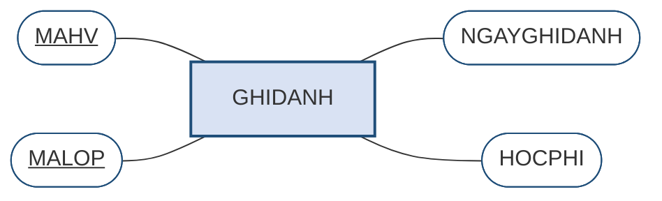

# 2.3. Thuộc tính khóa và định danh

*(0,5 tiết)*

## 2.3.1. Hai tiêu chí bắt buộc của thuộc tính khóa

!!! note "Định nghĩa 2.5"

    **Thuộc tính khóa** hay **thuộc tính định danh** *(key attribute / identifier)* của một thực thể là **một thuộc tính, hoặc một nhóm thuộc tính**, dùng để **phân biệt duy nhất** từng thể hiện của thực thể đó.

    Trong ký pháp Chen, thuộc tính khóa được vẽ như mọi thuộc tính khác — **một hình oval** — nhưng tên của nó được **gạch chân**.

!!! warning "Chú ý về thuật ngữ"

    Giáo trình này dùng **"thuộc tính khóa"** ở Chương 2 và để dành từ **"khóa"** cho Chương 3. Lý do không phải là câu nệ chữ nghĩa mà nằm ở bản chất hai mô hình. Trong mô hình ER, **mọi thứ gắn vào thực thể đều là thuộc tính**; khóa chỉ là một *loại thuộc tính đặc biệt* — và ký pháp Chen thể hiện đúng điều đó bằng cách vẫn vẽ nó là một oval, chỉ thêm gạch chân. Sang Chương 3, mô hình quan hệ mới đưa ra cả một hệ thống khái niệm riêng — *siêu khóa, khóa dự tuyển, khóa chính, khóa ngoại* — và khi ấy từ "khóa" mang nghĩa kỹ thuật chặt chẽ hơn hẳn. Nhiều tài liệu tiếng Việt gọi tắt cả hai là "khóa"; người học cần biết để không bối rối khi đọc tài liệu khác.

Một thuộc tính khóa hợp lệ phải thỏa mãn **đồng thời hai tiêu chí**, thiếu một trong hai đều không dùng được.

**Bảng 2.6. Hai tiêu chí bắt buộc của một thuộc tính khóa**

| Tiêu chí | Nội dung | Hỏng ra sao nếu vi phạm |
|---|---|---|
| **Tính duy nhất** | Không có hai thể hiện nào mang cùng giá trị | Hai học viên cùng mã → không phân biệt được ai với ai |
| **Tính tối thiểu** | Bỏ bớt bất kỳ thuộc tính nào trong nhóm thì mất tính duy nhất | Thừa thuộc tính → tốn chỗ, ràng buộc sai, tham chiếu phình to |

Tính tối thiểu thường bị bỏ qua nhưng rất quan trọng. Giả sử ta chọn thuộc tính khóa của `HOCVIEN` là cặp `(MAHV, HOTEN)`. Hãy kiểm tra trên vài dòng dữ liệu.

**Bảng 2.7. Kiểm tra hai tiêu chí trên dữ liệu `HOCVIEN`**

| MAHV | HOTEN | NGAYSINH | Nhận xét |
|---|---|---|---|
| HV01 | Trần An | 12/04/2005 | |
| HV02 | Lê Bình | 03/09/2004 | |
| HV03 | Trần An | 25/11/2005 | trùng tên với HV01 |

Che cột `HOTEN` đi: ba dòng vẫn phân biệt được nhờ `MAHV` — vậy `HOTEN` là **thừa**, cặp `(MAHV, HOTEN)` vi phạm tính tối thiểu. Che cột `MAHV` đi: hai dòng "Trần An" trùng nhau — vậy `HOTEN` một mình **không duy nhất**, không thể làm thuộc tính khóa. Kết luận: thuộc tính khóa đúng là `MAHV`, và chỉ `MAHV`. Cặp `(MAHV, HOTEN)` đúng là duy nhất — nhưng **không tối thiểu**, vì chỉ riêng `MAHV` đã đủ duy nhất rồi. Hậu quả thực tế: mọi thực thể khác muốn tham chiếu tới học viên đều phải mang theo cả hai thuộc tính, và nếu học viên đổi tên thì phải sửa dây chuyền ở mọi nơi.

## 2.3.2. Thuộc tính khóa tự nhiên và khóa thay thế

Khi chọn thuộc tính khóa, người thiết kế đứng trước hai lựa chọn cơ bản [3, Ch.5].

!!! note "Định nghĩa 2.6"

    **Khóa tự nhiên** *(natural key)* là thuộc tính khóa được lấy từ **một thuộc tính vốn có ý nghĩa nghiệp vụ** của sự vật — số căn cước, biển số xe, mã số thuế.

    **Khóa thay thế** *(surrogate key)* là thuộc tính khóa **do hệ thống tự sinh ra**, thường là một số nguyên tăng dần, **không mang bất kỳ ý nghĩa nghiệp vụ nào**.

!!! example "Ví dụ 2.3"

    Với thực thể `HOCVIEN` của Trung tâm ABC, có thể chọn:

    - **Khóa tự nhiên:** số căn cước công dân của học viên.
    - **Khóa thay thế:** một mã `MAHV` do hệ thống tự sinh — HV01, HV02, HV03…

**Bảng 2.8. So sánh khóa tự nhiên và khóa thay thế**

| Tiêu chí | Khóa tự nhiên | Khóa thay thế |
|---|---|---|
| **Ý nghĩa** | Người đọc hiểu ngay giá trị nói gì | Vô nghĩa, chỉ để phân biệt |
| **Tính ổn định** | Có thể **đổi** *(đổi số căn cước, đổi biển số)* | Không bao giờ đổi |
| **Luôn có sẵn?** | Có thể **chưa có** lúc nhập liệu *(trẻ em chưa có căn cước)* | Luôn sinh được ngay |
| **Kích thước** | Thường dài, kiểu chuỗi | Ngắn, số nguyên — khóa ngoại nhẹ |
| **Rủi ro riêng tư** | Số căn cước lan sang mọi bảng tham chiếu | Không lộ thông tin gì |
| **Kiểm tra trùng lặp** | Tự nhiên phát hiện được người trùng | Có thể tạo **hai bản ghi cho cùng một người** mà không biết |

{width=45%}

*Ảnh minh họa: máy phát số thứ tự xếp hàng. Con số trên phiếu không nói gì về người cầm nó, nhưng suốt buổi không ai có số trùng — hình ảnh gần nhất của khóa thay thế — Nguồn: Wikimedia Commons · Hugh Llewelyn · CC BY-SA 2.0.*

Kinh nghiệm thực tiễn dẫn tới một khuyến nghị khá thống nhất: **ưu tiên khóa thay thế cho khóa chính, đồng thời vẫn khai báo khóa tự nhiên như một ràng buộc duy nhất**. Cách làm này gộp được ưu điểm của cả hai — khóa chính ngắn gọn và bất biến để các bảng khác tham chiếu, còn tính duy nhất theo nghiệp vụ vẫn được hệ quản trị bảo vệ.

Lý do quyết định nằm ở cột **tính ổn định**. Khóa chính là thứ mà mọi bảng khác tham chiếu tới; nếu nó thay đổi, toàn bộ tham chiếu phải sửa theo. Mà thuộc tính nghiệp vụ thì **luôn có khả năng thay đổi** — điều mà người thiết kế ở thời điểm đầu dự án thường tin chắc là không bao giờ xảy ra.

!!! warning "Chú ý"

    Đừng dùng khóa thay thế như một cái cớ để **né tránh việc suy nghĩ**. Gán một mã tự sinh cho mọi thực thể là việc dễ, nhưng nếu không đồng thời xác định đâu là tổ hợp thuộc tính thật sự phân biệt các cá thể, hệ thống sẽ lặng lẽ chứa các bản ghi trùng lặp — cùng một học viên đăng ký hai lần với hai mã khác nhau. **Khóa thay thế thay thế cho khóa chính, không thay thế cho việc phân tích.**

## 2.3.3. Thuộc tính khóa phức hợp

Đôi khi không thuộc tính đơn lẻ nào đủ phân biệt, và ta cần **thuộc tính khóa phức hợp** — nhóm gồm từ hai thuộc tính trở lên. Trong ký pháp Chen, cả hai oval đều được gạch chân.

Trường hợp điển hình là thực thể `GHIDANH` của Trung tâm ABC. Một lượt ghi danh không có mã riêng; điều phân biệt lượt này với lượt kia là **cặp** *(học viên nào, lớp nào)*. Vì vậy thuộc tính khóa của nó là `(MAHV, MALOP)`. Dữ liệu cho thấy vì sao không thuộc tính nào đứng một mình được.

**Bảng 2.9. Dữ liệu `GHIDANH` — không cột nào một mình đủ phân biệt**

| MAHV | MALOP | NGAYGHIDANH | HOCPHI |
|---|---|---|---|
| HV01 | L01 | 05/01/2026 | 3.000.000 |
| HV01 | L02 | 12/01/2026 | 2.500.000 |
| HV02 | L01 | 06/01/2026 | 3.000.000 |

`MAHV` một mình không đủ: `HV01` xuất hiện hai dòng. `MALOP` một mình cũng không đủ: `L01` xuất hiện hai dòng. Nhưng **cặp** `(MAHV, MALOP)` thì không dòng nào trùng — và bỏ bớt một trong hai là mất ngay tính duy nhất, nên cặp này **vừa duy nhất vừa tối thiểu**.

**Hình 2.6. Thuộc tính khóa phức hợp của `GHIDANH` — hai oval cùng gạch chân**

Ở đây `GHIDANH` tạm vẽ như một thực thể bình thường; đến mục 2.6.4 ta sẽ thấy nó thật ra là **thực thể kết hợp** sinh ra từ một liên kết nhiều–nhiều, và khi ấy nó được vẽ chữ nhật hai viền.

Thuộc tính khóa phức hợp xuất hiện tự nhiên ở hai chỗ mà chương này sẽ gặp lại: **thực thể yếu** *(mục 2.6.3)* và **thực thể kết hợp sinh ra từ liên kết nhiều–nhiều** *(mục 2.6.4)*.

---

---

[← Trang trước](2-2-thuc-the-va-thuoc-tinh.md) · [Trang sau →](2-4-lien-ket-va-ky-thuat-hoi-hai-chieu.md)
