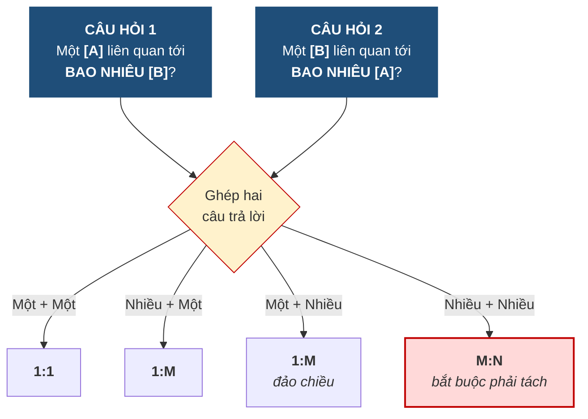

# 2.4. Liên kết và kỹ thuật hỏi hai chiều

*(1,0 tiết)*

## 2.4.1. Liên kết

!!! note "Định nghĩa 2.7"

    **Liên kết** *(relationship)* là một **mối liên hệ có ý nghĩa nghiệp vụ** giữa các thực thể.

    Trong ký pháp Chen, liên kết được vẽ bằng một **hình thoi** đặt giữa hai thực thể, bên trong ghi **động từ** mô tả mối liên hệ.

Trong quy tắc nghiệp vụ, liên kết thường xuất hiện dưới dạng **động từ** nối hai danh từ: giáo viên **phụ trách** lớp, học viên **ghi danh** lớp, khóa học **là tiên quyết của** khóa học khác.

Việc dành hẳn một ký hiệu riêng cho liên kết là một lựa chọn có chủ ý của Chen, và nó có giá trị thực tế. Vì liên kết là một hình độc lập chứ không phải chỉ là một đường kẻ, **nó có chỗ để mang thuộc tính riêng** — điều sẽ trở nên thiết yếu ở mục 2.6.4 khi ta gặp liên kết nhiều–nhiều có thuộc tính. Ký pháp Crow's Foot vẽ liên kết chỉ bằng một đường nối, nên khi liên kết có thuộc tính thì buộc phải tạo thêm một ô chữ nhật — tức là phải quyết định sớm hơn.

Việc phát hiện ra có một liên kết thường không khó. Cái khó nằm ở bước tiếp theo: **xác định cho đúng loại liên kết ấy là 1:1, 1:M hay M:N**. Xác định sai ở đây kéo theo sai toàn bộ thiết kế các bước sau, và đây là lỗi phổ biến nhất của người mới học.

## 2.4.2. Kỹ thuật hỏi hai chiều

Có một kỹ thuật đơn giản loại bỏ gần như hoàn toàn khả năng nhầm lẫn: **luôn đặt hai câu hỏi, mỗi câu cho một chiều**, rồi ghép hai câu trả lời lại.

**Hình 2.7. Kỹ thuật hỏi hai chiều — quy trình xác định loại liên kết**

Sức mạnh của kỹ thuật này nằm ở chỗ nó **buộc người thiết kế phải hỏi cả chiều ngược lại** — mà chiều ngược lại chính là chiều người ta hay quên. Khi nghe *"một giáo viên phụ trách nhiều lớp"*, phản xạ tự nhiên là kết luận ngay 1:M. Nhưng nếu không hỏi tiếp *"một lớp do bao nhiêu giáo viên phụ trách?"*, ta có thể bỏ sót trường hợp trung tâm cho phép hai giáo viên đồng phụ trách một lớp — và khi ấy liên kết thật sự là M:N.

Cách chắc chắn nhất để không nhầm là **nhìn xuống mức thể hiện** — liệt kê vài giáo viên, vài lớp cụ thể, và nối ai với lớp nào. Bảng dưới đây làm đúng việc ấy cho ba tình huống nghiệp vụ khác nhau của **cùng một cặp** `GIAOVIEN` – `LOP`. Mỗi dòng là một "sợi dây" nối một giáo viên với một lớp; hai câu hỏi của kỹ thuật hỏi hai chiều trở thành hai phép đếm: *đếm xem một mã giáo viên xuất hiện mấy dòng* và *đếm xem một mã lớp xuất hiện mấy dòng*.

**Bảng 2.10. Cùng cặp `GIAOVIEN` – `LOP`, ba tình huống nghiệp vụ nhìn ở mức thể hiện**

*Tình huống A — "mỗi giáo viên chỉ dạy một lớp, mỗi lớp chỉ một giáo viên":*

| GIAOVIEN | | LOP |
|:--:|:--:|:--:|
| GV01 | ─── | L01 |
| GV02 | ─── | L02 |
| GV03 | ─── | L03 |

*Tình huống B — "một giáo viên phụ trách nhiều lớp; mỗi lớp đúng một giáo viên; giáo viên mới có thể chưa có lớp":*

| GIAOVIEN | | LOP |
|:--:|:--:|:--:|
| GV01 | ─── | L01 |
| GV01 | ─── | L02 |
| GV02 | ─── | L03 |
| GV03 | | *(chưa có lớp)* |

*Tình huống C — "một giáo viên phụ trách nhiều lớp; một lớp có thể do hai giáo viên đồng phụ trách":*

| GIAOVIEN | | LOP |
|:--:|:--:|:--:|
| GV01 | ─── | L01 |
| GV01 | ─── | L02 |
| GV02 | ─── | L01 |

Đếm trên từng bảng. Ở tình huống A, mỗi mã giáo viên và mỗi mã lớp đều xuất hiện **đúng một dòng** → **1:1**. Ở tình huống B, `GV01` xuất hiện **hai dòng** nhưng mỗi mã lớp chỉ **một dòng** → một giáo viên nhiều lớp, một lớp một giáo viên → **1:M**. Ở tình huống C, `GV01` xuất hiện hai dòng **và** `L01` cũng xuất hiện hai dòng → cả hai chiều đều "nhiều" → **M:N**. Điểm mấu chốt: chỉ nhìn cột `GIAOVIEN` thì tình huống B và C **giống hệt nhau** — phải nhìn sang cột `LOP` mới phân biệt được. Đó chính là lý do phải hỏi chiều thứ hai.

## 2.4.3. Áp dụng cho Trung tâm Anh ngữ ABC

**Bảng 2.11. Bảng hỏi hai chiều cho Trung tâm ABC**

| Cặp thực thể | Câu hỏi chiều thứ nhất | Câu hỏi chiều thứ hai | Kết luận |
|---|---|---|:--:|
| `GIAOVIEN` – `LOP` | Một giáo viên phụ trách bao nhiêu lớp? → **Nhiều** *(hoặc chưa lớp nào)* | Một lớp do bao nhiêu giáo viên phụ trách? → **Một** | **1:M** |
| `KHOAHOC` – `LOP` | Một khóa học mở bao nhiêu lớp? → **Nhiều** | Một lớp thuộc bao nhiêu khóa học? → **Một** | **1:M** |
| `HOCVIEN` – `DIENTHOAI` | Một học viên có bao nhiêu số? → **Nhiều** | Một số thuộc bao nhiêu học viên? → **Một** | **1:M** |
| `HOCVIEN` – `LOP` | Một học viên ghi danh bao nhiêu lớp? → **Nhiều** | Một lớp có bao nhiêu học viên? → **Nhiều** | **M:N** |
| `KHOAHOC` – `KHOAHOC` | Một khóa là tiên quyết của bao nhiêu khóa? → **Nhiều** | Một khóa có bao nhiêu khóa tiên quyết? → **Nhiều** | **M:N đệ quy** |

Hai dòng cuối cần lưu ý đặc biệt vì chúng là **liên kết nhiều–nhiều**, và như mục 2.6.4 sẽ chỉ ra, loại liên kết này **bắt buộc phải tách** trước khi chuyển sang thiết kế bảng.

---

---

[← Trang trước](2-3-thuoc-tinh-khoa-va-dinh-danh.md) · [Trang sau →](2-5-ket-noi-luc-luong-va-su-tham-gia.md)
