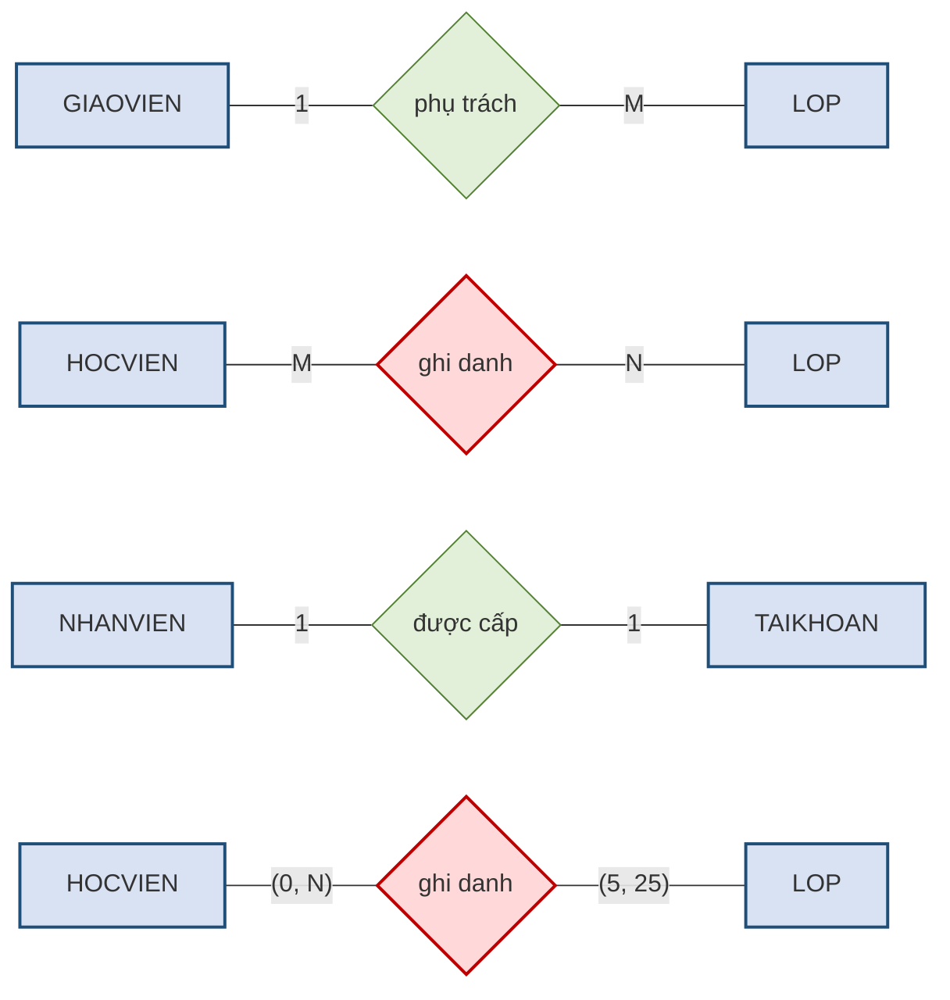
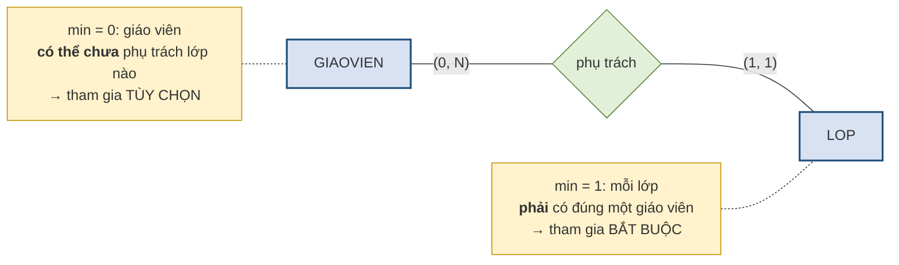
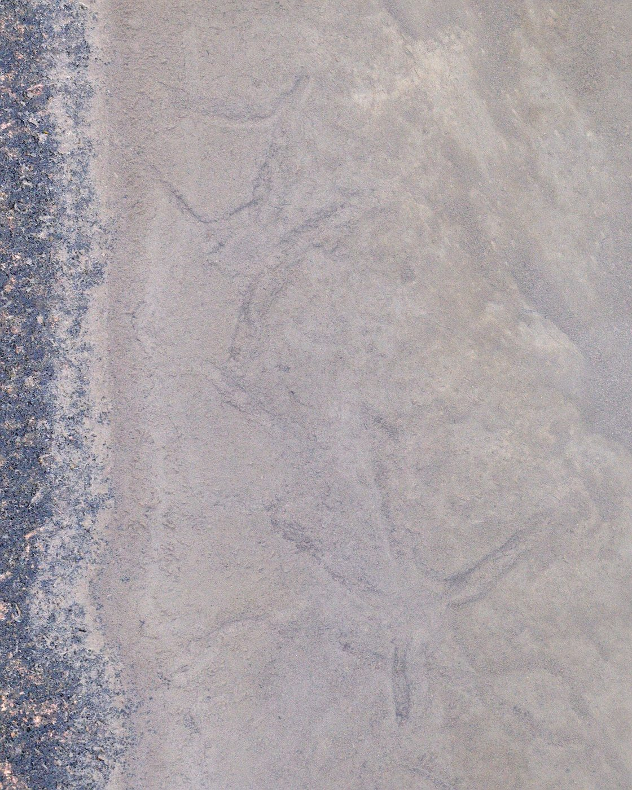

# 2.5. Kết nối, lực lượng và sự tham gia

*(1,0 tiết)*

## 2.5.1. Kết nối và lực lượng

Hai khái niệm này thường bị dùng lẫn, nhưng chúng mô tả hai mức chi tiết khác nhau của cùng một sự việc.

!!! note "Định nghĩa 2.8"

    **Kết nối** *(connectivity)* mô tả **loại** của liên kết ở mức khái quát: một–một *(1:1)*, một–nhiều *(1:M)* hay nhiều–nhiều *(M:N)*.

    **Lực lượng** *(cardinality)* mô tả **con số cụ thể**: số lượng tối thiểu và tối đa các thể hiện tham gia, viết dưới dạng cặp `(min, max)`.

!!! example "Ví dụ 2.4"

    Quy tắc *"mỗi lớp có ít nhất 5 và nhiều nhất 25 học viên"* cho biết **kết nối** là nhiều–nhiều nếu xét cả hai chiều *(một học viên cũng ghi danh nhiều lớp)*, còn **lực lượng** của lớp trong liên kết ghi danh là `(5, 25)`: mỗi lớp tham gia liên kết ít nhất 5 lần và nhiều nhất 25 lần.

Trong ký pháp Chen, kết nối được ghi bằng các ký tự **`1`, `M`, `N` đặt ngay trên cạnh nối** giữa thực thể và hình thoi liên kết. Lực lượng chi tiết thì viết dưới dạng cặp **`(min, max)` đặt cạnh thực thể**, và cặp số ấy trả lời câu hỏi: *một thể hiện của thực thể này tham gia vào liên kết ít nhất và nhiều nhất bao nhiêu lần?* Ba dòng đầu của hình dưới dùng chữ cái; dòng cuối vẽ lại liên kết ghi danh bằng cặp số để thấy hai cách ghi đặt cạnh nhau.

**Hình 2.8. Ký pháp Chen — ba loại kết nối và cách ghi lực lượng `(min, max)`, minh họa tại Trung tâm ABC**

Cách đọc rất trực tiếp và đây là ưu điểm lớn của ký pháp Chen: **chữ cái ghi ở đầu nào cho biết số lượng thực thể ở đầu đó**. Dòng thứ nhất đọc là *"một giáo viên phụ trách M lớp, một lớp do 1 giáo viên phụ trách"* — tức **1:M**. Dòng thứ hai có `M` và `N` ở hai đầu nên là **M:N**, và liên kết này được tô đỏ vì nó **bắt buộc phải tách** theo mục 2.6.4.

Dòng thứ tư là chính liên kết ghi danh ấy, nhưng ghi bằng **cặp `(min, max)`** theo quy tắc nghiệp vụ của Ví dụ 2.4. Cặp `(5, 25)` đặt **cạnh `LOP`** vì nó nói về lớp: *một lớp tham gia liên kết ghi danh từ 5 đến 25 lần* — tức có 5 đến 25 học viên. Cặp `(0, N)` đặt **cạnh `HOCVIEN`** vì nó nói về học viên: *một học viên ghi danh từ 0 đến N lớp*. Nhìn kỹ sẽ thấy hai cách ghi **đặt số ở hai đầu ngược nhau**: chữ `N` "số lớp của một học viên" nằm bên `LOP`, còn cặp `(0, N)` "số lần một học viên tham gia" nằm bên `HOCVIEN`. Cả hai cùng nói một sự thật; chỉ khác chỗ đứng. Giáo trình dùng chữ cái khi chỉ cần nêu loại kết nối, và dùng cặp số khi cần ghi đủ lực lượng và sự tham gia *(mục 2.5.3)*.

!!! warning "Chú ý"

    Một số tài liệu ghi chữ cái theo quy ước ngược lại — đặt ở đầu **đối diện**. Khi đọc lược đồ của người khác, việc đầu tiên cần làm là **kiểm tra quy ước** bằng một liên kết mà bản thân mình chắc chắn biết loại, rồi mới đọc các liên kết còn lại. Giáo trình này nhất quán dùng hai quy ước: *chữ cái ở đầu nào mô tả số lượng thực thể ở đầu đó*, và *cặp `(min, max)` ở đầu nào mô tả số lần tham gia của thực thể ở đầu đó*.

Lực lượng chi tiết hơn kết nối, và nó ghi lại những quy định nghiệp vụ mà kết nối không diễn tả nổi. Tuy vậy phần lớn các con số lực lượng **không được hệ quản trị kiểm tra tự động** — chúng sẽ trở thành các ràng buộc toàn vẹn phải xử lý riêng ở Chương 4.

## 2.5.2. Sự tham gia: tùy chọn hay bắt buộc

!!! note "Định nghĩa 2.9"

    **Sự tham gia** *(participation)* cho biết một thể hiện của thực thể **có buộc phải** tham gia vào liên kết hay không.

    - **Tham gia bắt buộc** *(mandatory)*: mọi thể hiện đều phải tham gia — tương ứng `min = 1`.
    - **Tham gia tùy chọn** *(optional)*: có thể có thể hiện không tham gia — tương ứng `min = 0`.

Điểm dễ nhầm nhất — và đáng nhấn mạnh — là **hai chiều của cùng một liên kết có thể có tính tham gia khác nhau**.

!!! example "Ví dụ 2.5"

    Xét liên kết *"giáo viên phụ trách lớp"* tại Trung tâm ABC.

    - Chiều từ `LOP`: **bắt buộc**. Không thể tồn tại một lớp không có giáo viên nào phụ trách — trung tâm không mở lớp như vậy.
    - Chiều từ `GIAOVIEN`: **tùy chọn**. Một giáo viên mới tuyển, chưa được phân lớp nào, vẫn là giáo viên của trung tâm và vẫn phải có trong hệ thống.

    Tình huống B của Bảng 2.10 chính là trường hợp này: `GV03` **không có dòng nào** — giáo viên tồn tại mà không tham gia liên kết; trong khi mọi mã lớp đều xuất hiện **ít nhất một dòng** — không lớp nào đứng ngoài.

Sự bất đối xứng này có hệ quả rất cụ thể ở Chương 3. Tham gia **bắt buộc** sẽ trở thành ràng buộc *không được rỗng* trên khóa ngoại; tham gia **tùy chọn** thì cho phép rỗng. Xác định sai một trong hai, hệ thống hoặc từ chối những dữ liệu hợp lệ, hoặc chấp nhận những dữ liệu vô nghĩa.

!!! warning "Chú ý"

    Trong đề bài, tính tham gia tùy chọn hầu như luôn được báo hiệu bằng những cụm từ như *"có thể"*, *"chưa có"*, *"không nhất thiết"*. Người học nên tập thói quen **khoanh tròn những cụm từ này ngay khi đọc đề** — chúng là thông tin thiết kế chứ không phải lời văn thừa.

## 2.5.3. Thể hiện sự tham gia trong hai ký pháp

**Trong ký pháp Chen**, tính tham gia được thể hiện bằng **số nét của cạnh nối** giữa thực thể và hình thoi liên kết: cạnh **một nét** nghĩa là tham gia **tùy chọn**, cạnh **hai nét song song** nghĩa là tham gia **bắt buộc**. Cách khác, tường minh hơn và ngày càng phổ biến, là **ghi thẳng cặp `(min, max)`** lên cạnh nối — khi đó `(0, N)` là tùy chọn còn `(1, N)` là bắt buộc. Giáo trình này dùng cách ghi cặp số vì nó không gây nhầm và đọc được ngay.

**Hình 2.9. Ví dụ 2.5 vẽ theo ký pháp Chen — hai chiều, hai tính tham gia khác nhau**

Đọc hình: cặp `(0, N)` cạnh `GIAOVIEN` cho biết **một giáo viên** tham gia liên kết từ 0 tới N lần; số `0` chính là chỗ ghi nhận *"giáo viên mới chưa có lớp"*. Cặp `(1, 1)` cạnh `LOP` cho biết **một lớp** tham gia đúng một lần — không hơn *(một giáo viên phụ trách)* và không kém *(phải có giáo viên)*. Chỉ hai con số `min` đã nói hết Ví dụ 2.5, và nói bằng thứ mà Chương 3 dùng được ngay.

**Trong ký pháp Crow's Foot**, tính tham gia và kết nối được gộp vào **một ký hiệu duy nhất đặt ở đầu mút** của đường liên kết. Đây là điểm mạnh nhất của ký pháp này.

**Bảng 2.12. Ký hiệu đầu mút Crow's Foot — gộp kết nối và tham gia**

| Ký hiệu đầu mút | Đọc là | Nghĩa `(min, max)` |
|---|---|:--:|
| Hai gạch ngang | Đúng một, bắt buộc | `(1, 1)` |
| Vòng tròn kèm một gạch | Không quá một, tùy chọn | `(0, 1)` |
| Một gạch kèm chân quạ | Một hoặc nhiều, bắt buộc | `(1, N)` |
| Vòng tròn kèm chân quạ | Không hoặc nhiều, tùy chọn | `(0, N)` |

**Hình 2.10. Bốn ký hiệu đầu mút của ký pháp Crow's Foot**

Trên hình, **thực thể nằm bên phải** và đường liên kết đi tới từ bên trái. Thứ tự đặt ký hiệu tuân theo đúng quy tắc *đọc từ ngoài vào trong*: ký hiệu **xa thực thể** cho biết `min`, ký hiệu **sát thực thể** cho biết `max`.

{width=40%}

*Ảnh minh họa: dấu chân chim trên cát, ba ngón tỏa ra — hình ảnh gốc của ký hiệu "nhiều" trong ký pháp Crow's Foot (chân quạ) — Nguồn: Wikimedia Commons · Ryan Hodnett · CC BY-SA 4.0.*

Có một mẹo đọc rất dễ nhớ: **vòng tròn đọc là "không", gạch đọc là "một", chân quạ đọc là "nhiều"**. Ký hiệu ở đầu mút gồm hai phần — phần ngoài cùng cho biết `min`, phần trong cho biết `max`. Vậy "vòng tròn kèm chân quạ" đọc là *"không hoặc nhiều"*.

Mục 2.8.3 sẽ trình bày kỹ hơn cách đọc một lược đồ Crow's Foot hoàn chỉnh.

---

---

[← Trang trước](2-4-lien-ket-va-ky-thuat-hoi-hai-chieu.md) · [Trang sau →](2-6-bac-lien-ket-thuc-the-yeu-va-thuc-the-ket-hop.md)
