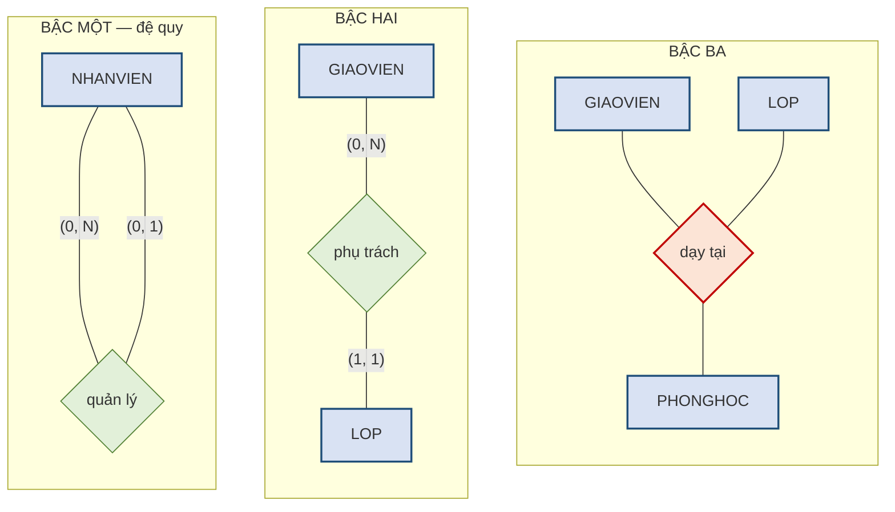
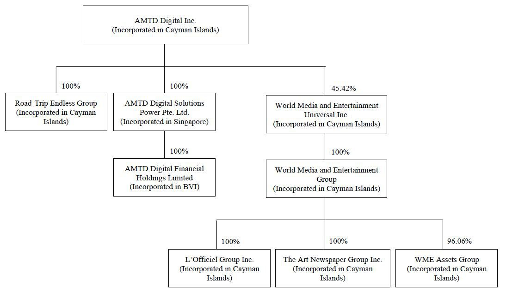
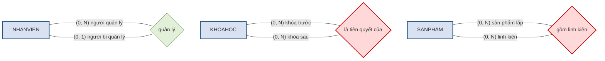
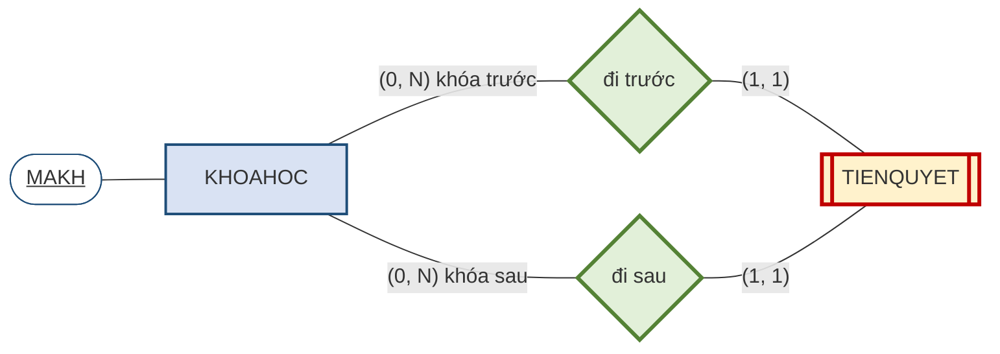
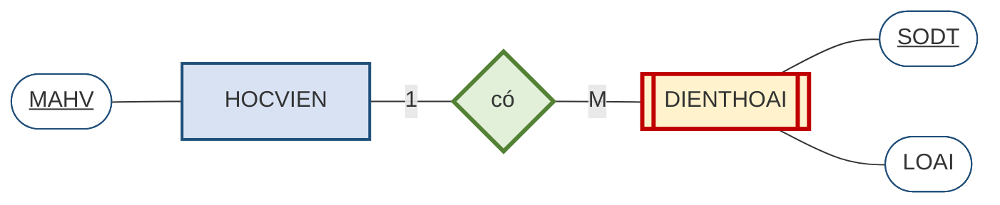
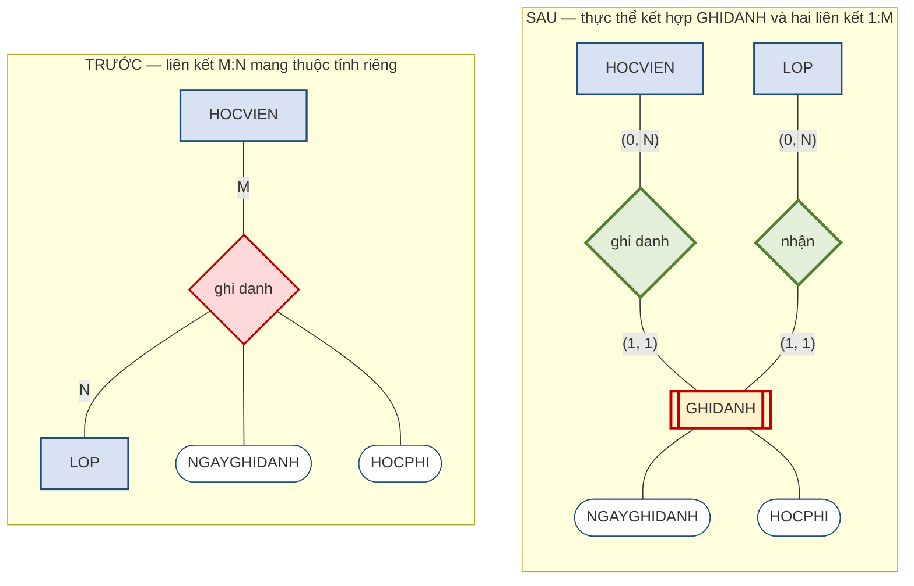

# 2.6. Bậc liên kết, thực thể yếu và thực thể kết hợp

*(1,5 tiết)*

## 2.6.1. Bậc của liên kết

!!! note "Định nghĩa 2.10"

    **Bậc** *(degree)* của một liên kết là **số thực thể tham gia** vào liên kết đó.

Liên kết **bậc hai** *(binary)* nối hai thực thể khác nhau và chiếm áp đảo trong thực tế. Liên kết **bậc một** *(unary)* nối một thực thể với chính nó — gọi là liên kết đệ quy, trình bày ở mục sau. Liên kết **bậc ba** *(ternary)* nối ba thực thể cùng lúc; loại này hiếm và thường nên tách thành các liên kết bậc hai để dễ xử lý.

**Hình 2.11. Ba bậc của liên kết trong ký pháp Chen — bậc một, bậc hai, bậc ba**

Hình thoi bậc ba có **ba cạnh** tỏa ra ba thực thể. Ví dụ *"giáo viên dạy lớp tại phòng học"* là bậc ba thật sự khi ba sự vật chỉ có nghĩa **cùng nhau**: biết giáo viên và lớp chưa đủ suy ra phòng, biết lớp và phòng chưa đủ suy ra giáo viên. Nếu có thể tách thành hai liên kết bậc hai mà không mất thông tin *(chẳng hạn mỗi lớp luôn học ở một phòng cố định)* thì nên tách. Hình thoi bậc ba được tô đỏ vì, giống liên kết M:N, nó **phải xử lý** trước khi chuyển sang mô hình quan hệ.

## 2.6.2. Liên kết đệ quy

!!! note "Định nghĩa 2.11"

    **Liên kết đệ quy** *(recursive relationship)* là liên kết mà **một thực thể liên hệ với chính nó**.

{width=70%}

*Ảnh minh họa: sơ đồ tổ chức của một tập đoàn. Mọi ô đều cùng một loại sự vật (đơn vị thành viên) và liên kết "sở hữu" nối đơn vị với đơn vị — một thực thể liên hệ với chính nó — Nguồn: Wikimedia Commons · AMTD Digital · CC0.*

Loại liên kết này thường gây bối rối lúc đầu, nhưng nó xuất hiện rất nhiều trong đời sống.

**Hình 2.12. Ba ví dụ liên kết đệ quy, vẽ theo ký pháp Chen**

Điểm đáng chú ý về mặt ký pháp: liên kết đệ quy vẽ theo Chen **không có gì đặc biệt** — vẫn là một hình thoi, chỉ khác ở chỗ **cả hai cạnh của nó cùng nối về một hình chữ nhật**. Đây lại là một ưu điểm nữa của Chen: người học không phải nhớ thêm ký hiệu mới nào cho trường hợp này. Chỉ có một việc bắt buộc phải làm thêm: **ghi vai trò** lên mỗi cạnh — *người quản lý* / *người bị quản lý*, *khóa trước* / *khóa sau* — vì hai cạnh cùng chạm vào một thực thể, không ghi vai trò thì không biết cạnh nào là chiều nào.

Ví dụ thứ nhất là **quan hệ quản lý**: một nhân viên quản lý nhiều nhân viên khác, và mỗi nhân viên có một người quản lý. Đây là đệ quy 1:M.

Ví dụ thứ hai là **khóa học tiên quyết** — chính là quy tắc thứ bảy trong bài toán Trung tâm ABC. Một khóa học có thể là tiên quyết của nhiều khóa khác, và một khóa có thể đòi hỏi nhiều khóa tiên quyết. Đây là đệ quy M:N.

Ví dụ thứ ba là **cấu thành sản phẩm**: một sản phẩm gồm nhiều linh kiện, mà mỗi linh kiện cũng có thể là một sản phẩm được lắp từ các linh kiện nhỏ hơn.

!!! warning "Chú ý"

    Liên kết đệ quy **M:N phải tách** giống hệt liên kết M:N thông thường. Điểm khác biệt duy nhất là bảng sinh ra sẽ có **hai cột cùng tham chiếu về một bảng**, nên phải đặt tên hai cột khác nhau để phân biệt vai trò — chẳng hạn `TIENQUYET(MAKH_truoc, MAKH_sau)`. Quên đặt tên phân biệt là lỗi rất hay gặp.

Việc tách ấy trông như thế nào trên lược đồ? Thực thể mới `TIENQUYET` phải nối về `KHOAHOC` **hai lần**, mỗi lần một vai trò — đó là điều mà người mới học hay vẽ thiếu.

**Hình 2.13. Liên kết đệ quy M:N sau khi tách — `KHOAHOC` nối hai lần vào `TIENQUYET`**

Mỗi thể hiện của `TIENQUYET` là một cặp *(khóa trước, khóa sau)*, nên nó tham gia **đúng một lần** vào mỗi liên kết — `(1, 1)` ở cả hai cạnh. Còn một khóa học có thể đứng trước nhiều khóa và đứng sau nhiều khóa — `(0, N)` ở cả hai vai trò. Hai hình thoi vẽ viền kép vì `TIENQUYET` mượn thuộc tính khóa của `KHOAHOC` qua cả hai; hai cột `MAKH_truoc`, `MAKH_sau` của Chú ý ở trên chính là dấu vết của hai cạnh này khi sang Chương 3.

## 2.6.3. Thực thể mạnh và thực thể yếu

!!! note "Định nghĩa 2.12"

    **Thực thể yếu** *(weak entity)* là thực thể thỏa mãn **đồng thời hai điều kiện**:

    1. **Phụ thuộc tồn tại**: nó không thể tồn tại nếu thực thể chủ không tồn tại.
    2. **Thuộc tính khóa không đầy đủ**: nó phải mượn thuộc tính khóa của thực thể chủ mới đủ phân biệt.

    Thực thể không thỏa mãn cả hai điều kiện gọi là **thực thể mạnh** *(strong entity)*.

Phải nhấn mạnh chữ **đồng thời**. Rất nhiều thực thể phụ thuộc tồn tại vào thực thể khác nhưng vẫn có thuộc tính khóa riêng đầy đủ, và những thực thể đó **không phải** là thực thể yếu.

!!! example "Ví dụ 2.6"

    Thực thể `DIENTHOAI` của Trung tâm ABC là thực thể **yếu**. Điều kiện thứ nhất thỏa mãn: một số điện thoại chỉ tồn tại trong hệ thống khi gắn với một học viên; xóa học viên thì số điện thoại của họ cũng không còn ý nghĩa. Điều kiện thứ hai cũng thỏa mãn: bản thân số điện thoại không đủ làm thuộc tính khóa nếu ta cho phép hai học viên dùng chung một số máy bàn gia đình, nên thuộc tính khóa phải là cặp `(MAHV, SODT)`.

    Ngược lại, thực thể `LOP` **không phải** là thực thể yếu, dù mỗi lớp đều phải thuộc một khóa học. Lý do: `MALOP` tự nó đã đủ phân biệt mọi lớp, không cần mượn `MAKH`. Đây chỉ là phụ thuộc tồn tại chứ không phải thực thể yếu.

Điều kiện thứ hai dễ thấy nhất khi nhìn vào dữ liệu.

**Bảng 2.13. Dữ liệu `DIENTHOAI` khi hai học viên khai chung số máy bàn**

| MAHV | SODT | LOAI |
|---|---|---|
| HV01 | `0905111222` | di động |
| HV01 | `02363811111` | máy bàn |
| HV02 | `02363811111` | máy bàn |

Dòng 2 và dòng 3 có **cùng `SODT`** — hai anh em trong một nhà khai chung số máy bàn. Vậy `SODT` một mình không phân biệt được hai dòng; phải ghép thêm `MAHV` mượn từ `HOCVIEN` mới đủ. Đó là nghĩa cụ thể của "thuộc tính khóa không đầy đủ".

Trong ký pháp Chen, thực thể yếu và liên kết dẫn tới nó đều được vẽ bằng **hai đường viền** — một quy ước rất hợp lý, vì hai đặc điểm ấy luôn đi cùng nhau.

**Hình 2.14. Thực thể yếu trong ký pháp Chen — trường hợp `DIENTHOAI`**

Hình trên đọc như sau. `DIENTHOAI` vẽ **chữ nhật hai viền** vì nó là thực thể yếu. Liên kết *"có"* vẽ **hình thoi hai viền** vì đây là **liên kết định danh** *(identifying relationship)* — chính nó cung cấp phần khóa còn thiếu. Bên trong `DIENTHOAI`, thuộc tính `SODT` được gạch chân, nhưng **nó chỉ là một nửa của thuộc tính khóa**; nửa còn lại là `MAHV` mượn từ `HOCVIEN` qua liên kết định danh. Ghép lại mới đủ phân biệt.

**Bảng 2.14. Cùng một sự vật, hai cách đặt thuộc tính khóa cho hai kết luận khác nhau**

| Tình huống | Thuộc tính khóa | Có phải thực thể yếu? |
|---|---|---|
| Mỗi số điện thoại chỉ thuộc đúng một học viên và không trùng lặp trong toàn hệ thống | `SODT` — đủ duy nhất một mình | **Không** — chỉ phụ thuộc tồn tại |
| Hai học viên trong cùng gia đình khai chung một số máy bàn | `(MAHV, SODT)` — phải mượn khóa của thực thể chủ | **Có** — thực thể yếu |

Ví dụ này minh họa một điều quan trọng về nghề thiết kế: **cùng một sự vật ngoài đời có thể cho hai mô hình khác nhau, tùy vào quy tắc nghiệp vụ**. Không có đáp án đúng tuyệt đối tách rời khỏi ngữ cảnh — và đó chính là lý do quy tắc nghiệp vụ ở mục 2.1 phải được thu thập cho thật rõ ràng.

## 2.6.4. Thực thể kết hợp — vì sao liên kết M:N bắt buộc phải tách

Đây là nội dung quan trọng nhất của mục 2.6, và là chỗ mà thiết kế của người mới học hay đổ vỡ.

Xét quy tắc thứ năm của Trung tâm ABC: *"Một học viên ghi danh nhiều lớp; một lớp có nhiều học viên. Mỗi lượt ghi danh ghi nhận ngày ghi danh và học phí."*

Câu hỏi đặt ra rất cụ thể: **thuộc tính `HOCPHI` thuộc về thực thể nào?**

Hãy nhìn vài dòng dữ liệu về học phí.

**Bảng 2.15. Học phí thay đổi theo cặp *(học viên, lớp)*, không theo riêng bên nào**

| Học viên | Lớp | Học phí |
|---|---|---|
| HV01 Trần An | L01 | 3.000.000 |
| HV01 Trần An | L02 | 2.500.000 |
| HV02 Lê Bình | L01 | 2.400.000 *(ưu đãi)* |

Thuộc tính `HOCPHI` **không thuộc về học viên**, vì cùng một học viên có thể đóng các mức khác nhau cho các lớp khác nhau. Nó cũng **không thuộc về lớp**, vì cùng một lớp có thể thu các mức khác nhau tùy học viên có được ưu đãi hay không. Nó chỉ có nghĩa khi gắn với **một cặp cụ thể** *(học viên này, lớp này)*.

Điều đó cho thấy giữa hai thực thể đang tồn tại một **sự vật thứ ba mà ta chưa đặt tên**: bản thân *lượt ghi danh*. Khi được đặt tên và cấp thuộc tính khóa, nó trở thành một thực thể đầy đủ.

Trên lược đồ Chen, việc ấy là một phép biến đổi có hình dạng rõ ràng: ở tầng trên, hai thuộc tính đang **treo trên hình thoi** M:N; ở tầng dưới, hình thoi đỏ biến mất, thay bằng một **thực thể kết hợp** mang hai thuộc tính ấy, nối về hai thực thể gốc bằng hai liên kết định danh.

**Hình 2.15. Tách liên kết M:N có thuộc tính thành thực thể kết hợp — trước và sau**

!!! note "Định nghĩa 2.13"

    **Thực thể kết hợp** *(associative entity / bridge entity)* là thực thể sinh ra từ việc **tách một liên kết nhiều–nhiều**. Thuộc tính khóa của nó là **khóa phức hợp** ghép từ thuộc tính khóa của hai thực thể gốc, và nó có thể mang **thuộc tính riêng**.

Sau khi tách, liên kết M:N ban đầu được thay bằng **hai liên kết 1:M**: `HOCVIEN` một–nhiều `GHIDANH`, và `LOP` một–nhiều `GHIDANH` — đúng như tầng dưới của Hình 2.15. Cặp `(1, 1)` ở phía `GHIDANH` trên cả hai cạnh nói rằng mỗi lượt ghi danh thuộc về **đúng một** học viên và **đúng một** lớp; thuộc tính khóa `(MAHV, MALOP)` của nó *(Hình 2.6)* chính là hai thuộc tính khóa mượn qua hai liên kết định danh này.

{width=60%}

*Ảnh minh họa: quầy bán vé xem phim. Mỗi lần một người vào một suất chiếu, rạp in ra một tờ vé có ghế, giá, giờ chiếu; tờ vé ấy có thật, nên nó là một thực thể — Nguồn: Wikimedia Commons · DPLA · Public domain.*

Một mẹo nhận biết rất hiệu quả là **phép thử tờ phiếu**: hãy tự hỏi *"mỗi lần sự việc này xảy ra, tổ chức có in ra hay ghi lại một tờ giấy nào không?"* Nếu có — phiếu ghi danh, hóa đơn, phiếu mượn sách, vé xe — thì tờ giấy ấy chính là một thực thể có thật, và các thông tin ghi trên đó chính là thuộc tính của nó.

!!! warning "Chú ý"

    Cần phân biệt hai tình huống. Nếu liên kết M:N **có thuộc tính riêng** như trường hợp `GHIDANH`, thì việc tách là hiển nhiên. Nhưng ngay cả khi liên kết M:N **không có thuộc tính nào**, ta **vẫn phải tách** ở bước chuyển sang mô hình quan hệ — vì mô hình quan hệ không có cách nào biểu diễn trực tiếp một liên kết nhiều–nhiều. Điều này sẽ được chứng minh ở Chương 3.

---

---

[← Trang trước](2-5-ket-noi-luc-luong-va-su-tham-gia.md) · [Trang sau →](2-7-mo-hinh-er-mo-rong-eer.md)
