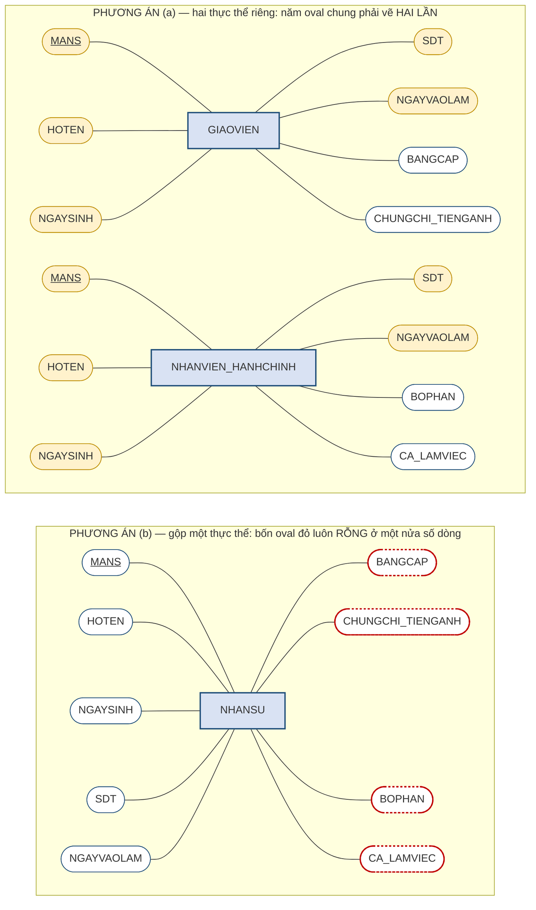
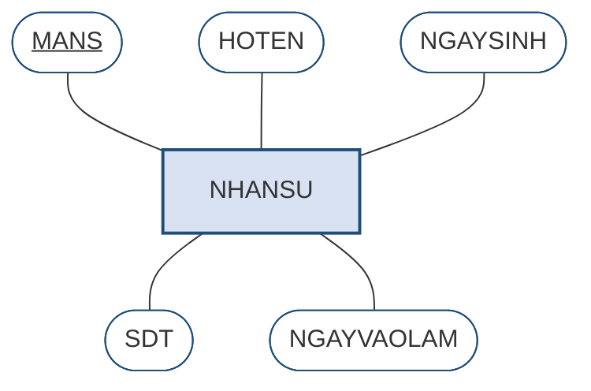
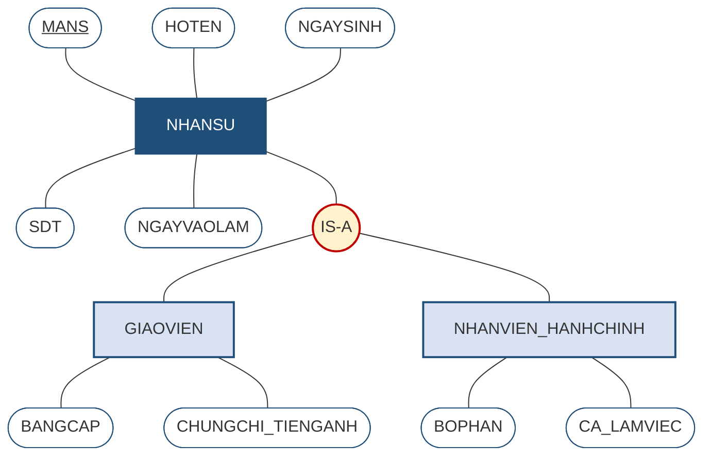
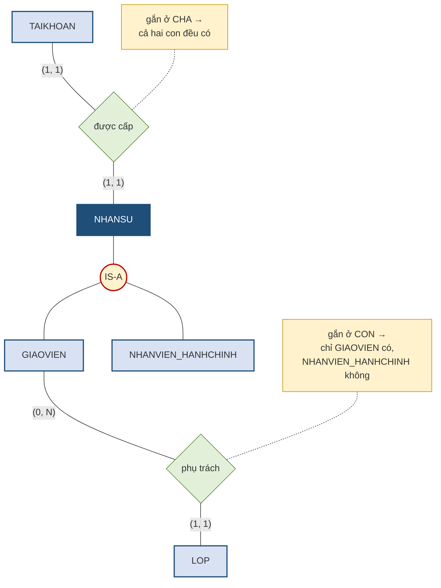
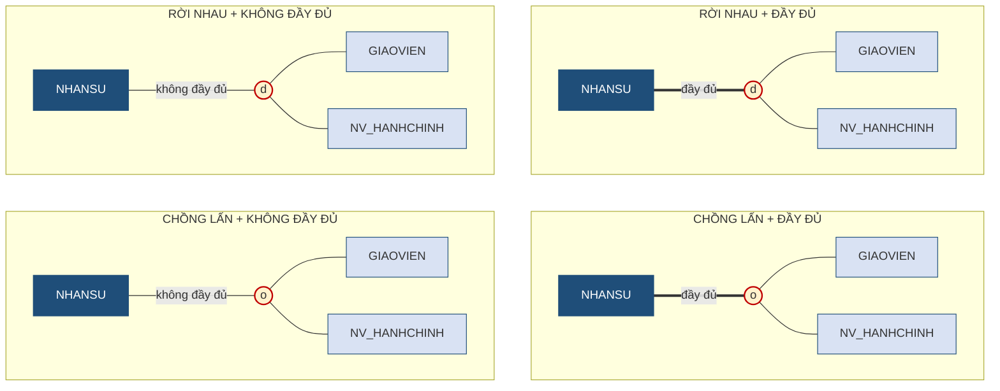

# 2.7. Mô hình ER mở rộng (EER)

*(1,0 tiết)*

## 2.7.1. Vì sao cần mở rộng mô hình ER

Mô hình ER cơ bản trình bày ở các mục trên đã đủ dùng cho phần lớn bài toán. Nhưng có một tình huống mà nó xử lý rất vụng về, và tình huống ấy lại xuất hiện thường xuyên: khi **nhiều loại sự vật vừa giống nhau vừa khác nhau**.

!!! example "Ví dụ 2.7"

    Trung tâm ABC muốn quản lý toàn bộ **nhân sự** — bao gồm giáo viên và nhân viên hành chính. Cả hai nhóm đều có mã nhân sự, họ tên, ngày sinh, số điện thoại, ngày vào làm. Nhưng riêng giáo viên còn có bằng cấp và chứng chỉ tiếng Anh; riêng nhân viên hành chính có bộ phận công tác và ca làm việc.

{width=60%}

*Ảnh minh họa: bãi giữ xe của một siêu thị ở Đông Hà. Xe máy và ô tô đều có biển số, chủ xe, giờ vào bãi; nhưng xe máy có dung tích xi lanh, ô tô có số chỗ ngồi — vừa giống vừa khác nhau, và "xe máy *là một* xe" — Nguồn: Wikimedia Commons · Phương Huy · CC BY-SA 4.0.*

Mục này giải Ví dụ 2.7 **qua năm bước**, mỗi bước một hình vẽ theo ký pháp Chen, để người học thấy mô hình mở rộng được sinh ra từ đâu chứ không phải được áp đặt từ trên xuống.

**Bước 1 — đọc quy tắc, tách thuộc tính chung và thuộc tính riêng.** Việc đầu tiên là lập một bảng đối chiếu: thuộc tính nào cả hai nhóm đều có, thuộc tính nào chỉ một nhóm có.

**Bảng 2.16. Thuộc tính của hai nhóm nhân sự trong Ví dụ 2.7**

| Thuộc tính | Giáo viên | Nhân viên hành chính | Kết luận |
|---|:--:|:--:|---|
| `MANS` | ✓ | ✓ | **chung** — và là thuộc tính khóa |
| `HOTEN` | ✓ | ✓ | **chung** |
| `NGAYSINH` | ✓ | ✓ | **chung** |
| `SDT` | ✓ | ✓ | **chung** |
| `NGAYVAOLAM` | ✓ | ✓ | **chung** |
| `BANGCAP` | ✓ | — | **riêng** giáo viên |
| `CHUNGCHI_TIENGANH` | ✓ | — | **riêng** giáo viên |
| `BOPHAN` | — | ✓ | **riêng** nhân viên hành chính |
| `CA_LAMVIEC` | — | ✓ | **riêng** nhân viên hành chính |

Kết quả rất rõ: **năm thuộc tính chung** và **hai cặp thuộc tính riêng**. Chính cấu trúc "năm chung, hai–hai riêng" này là thứ mô hình ER cơ bản không diễn tả nổi.

**Bước 2 — thử vẽ bằng mô hình ER cơ bản.** Với bộ ký hiệu đã có, người thiết kế chỉ có hai lựa chọn, và **cả hai đều tồi**. Hãy vẽ cả hai ra để thấy vì sao.

**Hình 2.16. Hai phương án vẽ Ví dụ 2.7 bằng ER cơ bản — cả hai đều tồi**

**Phương án (a) — tạo hai thực thể riêng biệt** `GIAOVIEN` và `NHANVIEN_HANHCHINH`. Nhìn vào hình: mười oval tô vàng là **năm thuộc tính chung vẽ hai lần**. Đó chính là dư thừa — lần này không phải dư thừa dữ liệu mà là **dư thừa ở mức cấu trúc**. Hậu quả rất thực tế: khi trung tâm muốn bổ sung trường "email công vụ" cho mọi nhân sự, phải sửa ở hai chỗ; quên một chỗ là hai nhóm nhân sự có cấu trúc lệch nhau.

**Phương án (b) — gộp tất cả vào một thực thể** `NHANSU` với đầy đủ chín thuộc tính. Bốn oval viền đỏ nét đứt là bốn thuộc tính riêng: với mỗi giáo viên, ô "bộ phận công tác" và "ca làm việc" **bỏ trống**; với mỗi nhân viên hành chính, ô "bằng cấp" và "chứng chỉ" **bỏ trống**. Bảng dữ liệu đầy ô rỗng, và tệ hơn, hệ thống **không thể ngăn** việc điền nhầm bộ phận công tác cho một giáo viên — vì trên lược đồ, giáo viên và nhân viên hành chính đã **không còn phân biệt được**.

**Mô hình ER mở rộng** *(Extended Entity–Relationship — EER)* bổ sung đúng những khái niệm cần thiết để thoát khỏi thế lưỡng nan này. Ba bước còn lại sẽ dùng chúng.

## 2.7.2. Thực thể cha và thực thể con

!!! note "Định nghĩa 2.14"

    **Thực thể cha** *(supertype)* là thực thể chứa các **thuộc tính chung** cho một nhóm sự vật. **Thực thể con** *(subtype)* là thực thể chứa các **thuộc tính riêng** của một tập hợp con cụ thể trong nhóm đó.

    Quan hệ giữa chúng gọi là **quan hệ cha–con** hay **quan hệ IS-A** — đọc là *"một thực thể con LÀ MỘT thực thể cha"*.

**Bước 3 — vẽ thực thể cha.** Lấy đúng năm thuộc tính chung ở Bảng 2.16 và đặt vào một thực thể duy nhất `NHANSU`. Đây là một thực thể Chen hoàn toàn bình thường: chữ nhật, năm oval, `MANS` gạch chân.

**Hình 2.17. Bước 3 — thực thể cha `NHANSU` chỉ mang năm thuộc tính chung**

**Bước 4 — vẽ hai thực thể con và nối chúng với cha.** Mỗi thực thể con chỉ mang **thuộc tính riêng** của nó — hai oval, không hơn. Chúng nối với cha qua một **vòng tròn** đặt giữa: đó là ký hiệu duy nhất mà EER thêm vào bộ ký hiệu Chen. Thực thể con **không vẽ lại** `MANS` hay bất kỳ thuộc tính chung nào; chúng sẽ có được các thuộc tính ấy nhờ cơ chế kế thừa ở mục 2.7.3.

**Hình 2.18. Bước 4 — phân cấp cha–con của Ví dụ 2.7, ký pháp Chen mở rộng**

So với Hình 2.16, lược đồ này có **đúng chín oval** — mỗi thuộc tính vẽ **một lần**, ở đúng tầng của nó. Không còn oval vàng lặp lại như phương án (a), cũng không còn oval đỏ rỗng như phương án (b).

Cách đọc sơ đồ trên: *"Một giáo viên **là một** nhân sự"* và *"một nhân viên hành chính **là một** nhân sự"*. Phép thử để kiểm tra xem có đúng là quan hệ cha–con hay không chính là câu **"LÀ MỘT"**: nếu đặt vào câu ấy mà nghe xuôi thì đúng, còn nếu phải nói *"có một"* thì đó là liên kết thông thường chứ không phải cha–con.

!!! warning "Chú ý"

    Đây là chỗ nhầm lẫn phổ biến nhất khi học EER. *"Lớp **có** nhiều học viên"* — dùng động từ **có**, nên đó là **liên kết** bình thường. *"Giáo viên **là một** nhân sự"* — dùng **là một**, nên đó là **quan hệ cha–con**. Người học nên đọc thành tiếng câu tiếng Việt trước khi vẽ.

Vòng tròn giữa cha và các con ở Hình 2.18 hiện mới ghi chữ *IS-A*. Trong ký pháp chuẩn, bên trong vòng tròn phải ghi một ký hiệu ràng buộc, và cạnh nối từ cha xuống vòng tròn phải là một hay hai vạch — đó là **Bước 5**, trình bày ở mục 2.7.5, sau khi đã hiểu tính kế thừa.

## 2.7.3. Tính kế thừa

!!! note "Định nghĩa 2.15"

    **Kế thừa** *(inheritance)* là nguyên tắc theo đó **thực thể con tự động có mọi thuộc tính và mọi liên kết của thực thể cha**, mà không cần khai báo lại.

Đây chính là cơ chế loại bỏ dư thừa cấu trúc. Trong Hình 2.18, thực thể `GIAOVIEN` chỉ khai báo hai thuộc tính riêng, nhưng trên thực tế nó **có đầy đủ bảy thuộc tính** — năm thuộc tính kế thừa từ `NHANSU` cộng hai thuộc tính riêng.

Kế thừa áp dụng cho **cả liên kết**, và điều này rất đáng chú ý. Nếu ta khai báo liên kết *"mỗi nhân sự được cấp một tài khoản đăng nhập"* ở mức thực thể cha, thì cả giáo viên lẫn nhân viên hành chính đều tự động có liên kết ấy.

Ngược lại, **liên kết riêng của thực thể con thì không lan lên cha**. Liên kết *"giáo viên phụ trách lớp"* chỉ gắn với `GIAOVIEN`; nhân viên hành chính không phụ trách lớp nào. Đây chính là ưu điểm lớn nhất của EER so với phương án gộp chung ở mục 2.7.1: nó **diễn tả được rằng chỉ một nhóm con mới có liên kết ấy**.

**Hình 2.19. Liên kết gắn ở tầng nào thì ai có — kế thừa liên kết trong phân cấp**

Hình trên bỏ bớt các oval thuộc tính để tập trung vào liên kết. Đọc từ trên xuống: liên kết *"được cấp"* chạm vào `NHANSU`, nên **chảy xuống** cả hai con; liên kết *"phụ trách"* chạm vào `GIAOVIEN`, nên **dừng ở đó** — trên lược đồ không có đường nào từ `LOP` tới `NHANVIEN_HANHCHINH`, và đó chính là cách EER nói rằng nhân viên hành chính không phụ trách lớp.

Thuộc tính khóa của thực thể con luôn là **thuộc tính khóa của thực thể cha**. Trong ví dụ trên, thuộc tính khóa của `GIAOVIEN` vẫn là `MANS`, không phải một mã mới. Lý do rất tự nhiên: một giáo viên **là một** nhân sự, nên hai bên nói về cùng một cá thể và phải dùng chung định danh.

## 2.7.4. Chuyên biệt hóa và tổng quát hóa

Có hai hướng đi để đến được một phân cấp cha–con, và chúng phản ánh hai tình huống làm việc khác nhau trong thực tế.

!!! note "Định nghĩa 2.16"

    **Chuyên biệt hóa** *(specialization)* là quá trình đi **từ trên xuống**: xuất phát từ một thực thể tổng quát, phát hiện ra các nhóm con có thuộc tính riêng và tách chúng ra.

    **Tổng quát hóa** *(generalization)* là quá trình đi **từ dưới lên**: xuất phát từ nhiều thực thể riêng lẻ, nhận ra chúng có phần chung và gộp phần chung ấy thành một thực thể cha.

**Chuyên biệt hóa** là con đường thường gặp khi xây hệ thống mới. Người thiết kế bắt đầu với `NHANSU`, rồi trong quá trình phỏng vấn phát hiện ra giáo viên cần lưu bằng cấp còn nhân viên hành chính thì không — thế là tách.

**Tổng quát hóa** là con đường thường gặp khi cải tạo hệ thống cũ. Trung tâm đã có sẵn hai bảng riêng biệt, chạy nhiều năm; người thiết kế nhìn vào và nhận ra chúng lặp lại năm cột giống hệt nhau — thế là gộp phần chung lên thành `NHANSU`.

Hai quá trình cho ra **cùng một kết quả**; chúng chỉ khác nhau ở điểm xuất phát.

## 2.7.5. Hai ràng buộc của phân cấp cha–con

Vẽ được phân cấp mới chỉ là một nửa công việc. Phần còn lại — **Bước 5** của Ví dụ 2.7 — là trả lời **hai câu hỏi ràng buộc**, rồi ghi câu trả lời vào vòng tròn và cạnh nối của Hình 2.18. Câu trả lời quyết định trực tiếp cách cài đặt ở Chương 3.

**Câu hỏi thứ nhất — một cá thể có thể thuộc mấy nhóm con cùng lúc?**

!!! note "Định nghĩa 2.17"

    Ràng buộc **rời nhau** *(disjoint)*: mỗi thể hiện của thực thể cha chỉ thuộc **đúng một** thực thể con. Ký hiệu **`d`**.

    Ràng buộc **chồng lấn** *(overlapping)*: một thể hiện **có thể thuộc nhiều** thực thể con cùng lúc. Ký hiệu **`o`**.

**Câu hỏi thứ hai — mọi cá thể có bắt buộc thuộc một nhóm con nào đó không?**

!!! note "Định nghĩa 2.18"

    Ràng buộc **đầy đủ** *(total / complete)*: mọi thể hiện của cha **đều phải** thuộc ít nhất một con. Ký hiệu bằng **hai gạch** nối cha với vòng tròn.

    Ràng buộc **không đầy đủ** *(partial / incomplete)*: **có thể có** thể hiện của cha không thuộc con nào. Ký hiệu bằng **một gạch**.

Hai câu hỏi độc lập với nhau, nên có bốn tổ hợp.

**Bảng 2.17. Bốn tổ hợp ràng buộc và ví dụ tại Trung tâm ABC**

| Tổ hợp | Nghĩa | Tình huống minh họa |
|---|---|---|
| **Rời nhau + Đầy đủ** | Mỗi nhân sự thuộc **đúng một** nhóm, và **không ai** đứng ngoài | Trung tâm quy định mọi nhân sự **hoặc** là giáo viên **hoặc** là nhân viên hành chính, không kiêm nhiệm |
| **Rời nhau + Không đầy đủ** | Mỗi nhân sự thuộc **nhiều nhất một** nhóm, **có người** đứng ngoài | Ngoài hai nhóm trên còn có bảo vệ, tạp vụ — chưa được mô hình hóa thành nhóm con |
| **Chồng lấn + Đầy đủ** | Có thể thuộc **nhiều nhóm**, nhưng **không ai** đứng ngoài | Một giáo viên kiêm quản lý học vụ — thuộc cả hai nhóm; mọi nhân sự đều thuộc ít nhất một nhóm |
| **Chồng lấn + Không đầy đủ** | Có thể thuộc **nhiều nhóm**, và **có người** đứng ngoài | Trường hợp tổng quát nhất, ít ràng buộc nhất |

Bốn tổ hợp ấy vẽ ra thành bốn lược đồ chỉ khác nhau ở **chữ trong vòng tròn** và **số vạch của cạnh nối từ cha**. Để hình gọn, các oval thuộc tính được lược bỏ.

**Hình 2.20. Bốn tổ hợp ràng buộc của phân cấp cha–con — ký hiệu trên lược đồ**

Quy ước đọc: chữ **`d`** *(disjoint)* hay **`o`** *(overlapping)* trong vòng tròn trả lời câu hỏi thứ nhất; cạnh **nét đậm ghi "đầy đủ"** *(ký pháp gốc vẽ hai vạch)* hay **nét thường ghi "không đầy đủ"** *(một vạch)* trả lời câu hỏi thứ hai. Khi vẽ tay, hãy vẽ đúng hai vạch song song cho trường hợp đầy đủ.

!!! example "Ví dụ 2.8 — Bước 5 của Ví dụ 2.7"

    Với Trung tâm ABC, câu trả lời **phụ thuộc hoàn toàn vào quy tắc nghiệp vụ**, không phải vào sở thích của người thiết kế. Nếu chủ trung tâm nói *"cô Lê Hoa vừa dạy lớp A1 vừa phụ trách học vụ buổi sáng"*, thì ràng buộc là **chồng lấn** — ghi `o` vào vòng tròn. Nếu chủ trung tâm nói *"chúng tôi còn có một bác bảo vệ và một cô tạp vụ"*, thì ràng buộc là **không đầy đủ** — cạnh từ `NHANSU` xuống vòng tròn chỉ một vạch. Lược đồ hoàn chỉnh của Ví dụ 2.7 khi ấy là ô **CHỒNG LẤN + KHÔNG ĐẦY ĐỦ** của Hình 2.20, cộng với các oval thuộc tính của Hình 2.18. Nếu chủ trung tâm nói ngược lại — *"không ai kiêm nhiệm, và ngoài hai nhóm này không còn ai"* — thì lược đồ là ô **RỜI NHAU + ĐẦY ĐỦ**. Đây chính là lý do mục 2.1 nhấn mạnh việc thu thập quy tắc nghiệp vụ cho rõ — nếu không hỏi, người thiết kế sẽ mặc định sai.

## 2.7.6. Khi nào nên và không nên dùng EER

EER là công cụ mạnh, và giống mọi công cụ mạnh, nó bị lạm dụng khá thường xuyên. Ba tiêu chí sau giúp quyết định.

**Nên dùng** khi các nhóm con có **thuộc tính riêng khác nhau đáng kể** — từ khoảng ba thuộc tính trở lên; hoặc khi chúng có **liên kết riêng** mà nhóm khác không có; hoặc khi nghiệp vụ **thật sự phân biệt** các nhóm ấy trong quy trình làm việc.

**Không nên dùng** khi sự khác biệt giữa các nhóm chỉ nằm ở **một thuộc tính** — khi ấy chỉ cần thêm một cột phân loại là đủ; hoặc khi các nhóm con **không có thuộc tính riêng nào**, chỉ khác nhau về tên gọi; hoặc khi phân cấp sâu quá **ba tầng**, vì lúc đó sơ đồ trở nên khó đọc hơn cả vấn đề nó định giải quyết.

!!! warning "Chú ý"

    Người học đã biết lập trình hướng đối tượng rất dễ lạm dụng EER, vì quan hệ cha–con trông giống hệt tính kế thừa của lớp đối tượng. Nhưng có một khác biệt căn bản: trong lập trình, kế thừa là công cụ **tái sử dụng mã nguồn**; trong thiết kế cơ sở dữ liệu, quan hệ cha–con phải phản ánh một **sự phân loại có thật trong nghiệp vụ**. Tiêu chuẩn để dùng nó không phải là "làm thế cho gọn", mà là "nghiệp vụ có thật sự phân biệt hai nhóm này không".

---

---

[← Trang trước](2-6-bac-lien-ket-thuc-the-yeu-va-thuc-the-ket-hop.md) · [Trang sau →](2-8-quy-trinh-xay-dung-luoc-do-er-va-cac-ky-phap.md)
