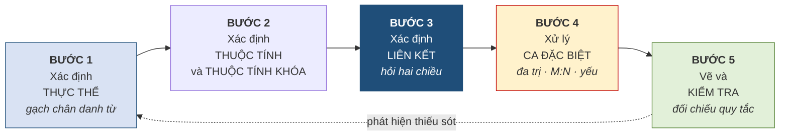
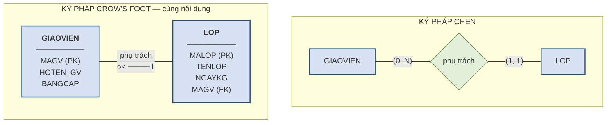

# 2.8. Quy trình xây dựng lược đồ ER và các ký pháp

*(0,5 tiết)*

## 2.8.1. Quy trình năm bước

**Hình 2.12. Quy trình năm bước xây dựng lược đồ ER**

Mũi tên nét đứt quay ngược từ Bước 5 về Bước 1 không phải là chi tiết trang trí. Thiết kế cơ sở dữ liệu là một quá trình **lặp**: bước kiểm tra cuối cùng gần như luôn phát hiện ra thiếu sót, và khi ấy phải quay lại. Người thiết kế có kinh nghiệm coi việc lặp hai đến ba vòng là bình thường.

**Bước 1 — xác định thực thể.** Đọc kỹ quy tắc nghiệp vụ và gạch chân các danh từ chỉ sự vật cần lưu thông tin, rồi lọc lại bằng ba tiêu chí ở mục 2.2.1.

**Bước 2 — xác định thuộc tính và thuộc tính khóa.** Với mỗi thực thể, liệt kê các đặc điểm cần lưu và chọn thuộc tính khóa theo hai tiêu chí ở mục 2.3.1. Ở bước này chỉ **đánh dấu** các thuộc tính đa trị, chưa xử lý.

**Bước 3 — xác định liên kết.** Với mỗi cặp thực thể có thể liên quan, áp dụng kỹ thuật hỏi hai chiều để xác định loại liên kết, rồi xác định tính tham gia cho từng chiều.

**Bước 4 — xử lý các trường hợp đặc biệt.** Tách thuộc tính đa trị, tách liên kết M:N thành thực thể kết hợp, xử lý thực thể yếu và liên kết đệ quy.

**Bước 5 — vẽ và kiểm tra.** Vẽ lược đồ hoàn chỉnh rồi **đối chiếu ngược lại từng quy tắc nghiệp vụ**: mỗi quy tắc phải tìm được chỗ của nó trong lược đồ. Quy tắc nào không tìm được chỗ nghĩa là còn thiếu sót.

!!! warning "Chú ý"

    Sai lầm phổ biến nhất là **làm gộp Bước 2 và Bước 4** — vừa liệt kê thuộc tính vừa tách bảng. Cách làm này rối và rất dễ bỏ sót. Hãy hoàn thành trọn vẹn việc liệt kê trước, rồi mới xử lý các ca đặc biệt trong một lượt riêng.

## 2.8.2. Ký pháp Chen — tóm tắt

Ký pháp Chen đã được dạy và dùng xuyên suốt từ mục 2.2.2, nên ở đây chỉ cần tổng kết lại **điểm mạnh và điểm yếu**.

**Điểm mạnh** nằm ở chỗ mỗi khái niệm có **một ký hiệu riêng**: thực thể là chữ nhật, thuộc tính là oval, liên kết là hình thoi, và các sắc thái — khóa, đa trị, dẫn xuất, yếu, định danh — đều có ký hiệu phân biệt. Nhờ vậy một lược đồ Chen **tự nó là tài liệu đầy đủ**, không cần chú giải kèm theo. Đặc biệt, vì liên kết là một hình độc lập nên **nó mang được thuộc tính riêng** — điều mà Crow's Foot không làm trực tiếp được.

**Điểm yếu** là **tốn diện tích**. Mỗi thuộc tính chiếm một oval riêng cộng một đoạn nối, nên một thực thể sáu thuộc tính đã chiếm chỗ bằng cả một cụm hình. Một lược đồ mười thực thể vẽ đầy đủ theo Chen thường không vừa khổ A4.

Cách xử lý thông dụng cho lược đồ lớn — và cũng là cách giáo trình này dùng ở mục 2.9.5 — là vẽ Chen **chỉ với thực thể, liên kết và thuộc tính khóa**, còn danh sách thuộc tính đầy đủ thì trình bày riêng bằng văn bản hoặc bằng một lược đồ Crow's Foot đi kèm.

## 2.8.3. Ký pháp Crow's Foot

Ký pháp **Crow's Foot** *(chân quạ)* là ký pháp được các công cụ vẽ và các tài liệu thiết kế công nghiệp dùng phổ biến nhất hiện nay. Người học cần đọc thành thạo nó, vì hầu hết lược đồ gặp trong thực tế đều ở dạng này.

**Cách vẽ thực thể.** Mỗi thực thể là một **hình chữ nhật chia hai ngăn**: ngăn trên ghi **tên thực thể**, ngăn dưới liệt kê **các thuộc tính**, mỗi thuộc tính một dòng. Thuộc tính khóa được **gạch chân** hoặc đánh dấu `PK`; thuộc tính tham chiếu tới thực thể khác đánh dấu `FK`. Toàn bộ thuộc tính nằm **bên trong** ô, không có oval nào cả — đây là khác biệt lớn nhất so với Chen.

**Cách vẽ liên kết.** Liên kết **không có hình riêng**; nó chỉ là một **đường nối** giữa hai ô chữ nhật, với **ký hiệu đầu mút** ở mỗi đầu theo Bảng 2.8, và tên liên kết ghi trên đường nối.

**Hình 2.13. Cùng một liên kết vẽ bằng hai ký pháp**

**Cách đọc một đường liên kết — chỗ hay đọc ngược.** Quy tắc là: **ký hiệu ở đầu nào mô tả số lượng thực thể ở đầu đó**. Trong Hình 2.13, đầu phía `LOP` mang chân quạ, nghĩa là *"một giáo viên phụ trách nhiều lớp"*; đầu phía `GIAOVIEN` mang hai gạch, nghĩa là *"một lớp do đúng một giáo viên phụ trách"*. Vòng tròn ở phía `LOP` cho biết giáo viên **có thể chưa** phụ trách lớp nào.

Người mới học rất hay đọc ngược — nhìn chân quạ ở phía `LOP` rồi kết luận "một lớp có nhiều giáo viên". Mẹo tránh nhầm: **đặt ngón tay che một đầu, đọc đầu còn lại, rồi mới đổi bên.**

**Ba hạn chế cần biết.** Thứ nhất, Crow's Foot **không có chỗ vẽ thuộc tính của liên kết** — muốn diễn tả `HOCPHI` của lượt ghi danh thì buộc phải tạo hẳn một ô chữ nhật `GHIDANH`, tức là đã làm luôn việc tách ở Bước 4. Thứ hai, nó **không phân biệt được thuộc tính đa trị hay dẫn xuất**, vì mỗi thuộc tính chỉ là một dòng chữ. Thứ ba, ký hiệu **thực thể yếu** không thống nhất giữa các công cụ.

!!! warning "Chú ý"

    Chính ba hạn chế trên là lý do giáo trình chọn **Chen làm ký pháp chính khi học và khi giải bài**: nó ép người thiết kế phải nhận diện và ghi lại đầy đủ mọi đặc điểm. Crow's Foot được dùng ở bước **trình bày kết quả cuối cùng**, khi các quyết định đã chốt và điều cần nhất là sự gọn gàng.

## 2.8.4. Sơ lược về sơ đồ lớp UML

**UML** *(Unified Modeling Language)* là ngôn ngữ mô hình hóa dùng rộng rãi trong công nghệ phần mềm. Sơ đồ lớp *(class diagram)* của UML có nhiều điểm tương đồng với lược đồ ER, nên người học cần biết cách đối chiếu.

**Bảng 2.11. Đối chiếu mô hình ER và sơ đồ lớp UML**

| Mô hình ER | Sơ đồ lớp UML | Ghi chú |
|---|---|---|
| Thực thể *(entity)* | Lớp *(class)* | Tương đương |
| Thuộc tính *(attribute)* | Thuộc tính *(attribute)* | Tương đương |
| Liên kết *(relationship)* | Liên kết *(association)* | Tương đương |
| Lực lượng `(min, max)` | Bội số *(multiplicity)* `min..max` | UML viết `0..*` thay cho `(0, N)` |
| Thực thể cha – con *(EER)* | Tổng quát hóa *(generalization)* | Tương đương |
| Thực thể kết hợp | Lớp liên kết *(association class)* | Tương đương |
| *(không có)* | **Phương thức** *(method)* | UML mô tả cả **hành vi**; ER chỉ mô tả **dữ liệu** |

Khác biệt căn bản nằm ở dòng cuối cùng. UML mô tả cả dữ liệu lẫn **hành vi** của đối tượng, vì nó phục vụ thiết kế phần mềm nói chung. Mô hình ER chỉ mô tả **dữ liệu**, vì nó phục vụ thiết kế cơ sở dữ liệu. Do đó một sơ đồ lớp UML có thể chuyển thành lược đồ ER bằng cách bỏ đi phần phương thức, nhưng chiều ngược lại thì thiếu thông tin.

---

---

[← Trang trước](2-7-mo-hinh-er-mo-rong-eer.md) · [Trang sau →](2-9-vi-du-tong-hop-trung-tam-anh-ngu-abc.md)
