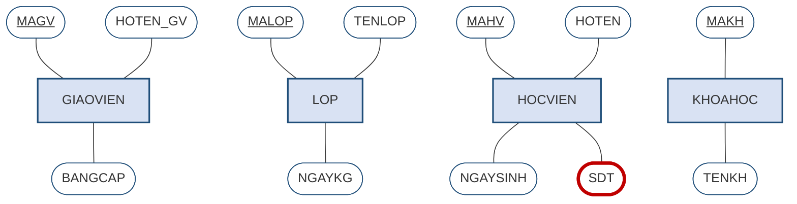
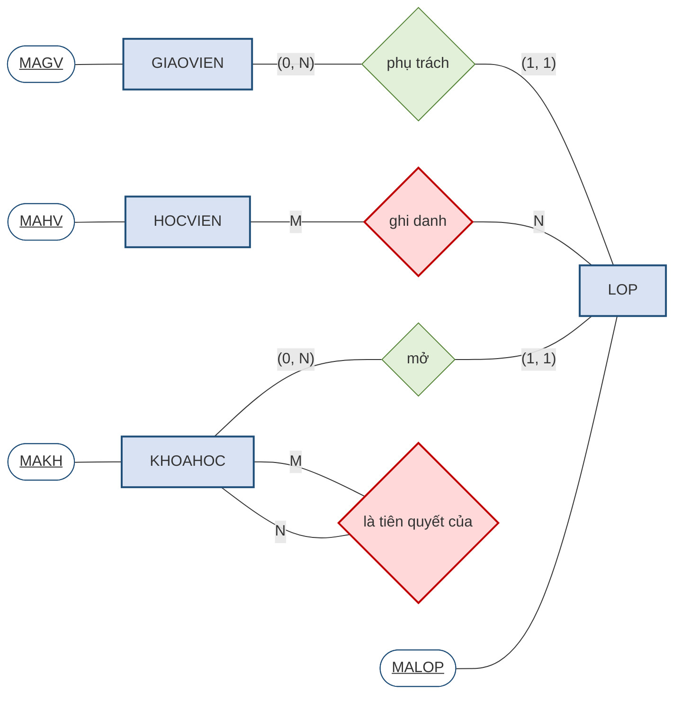
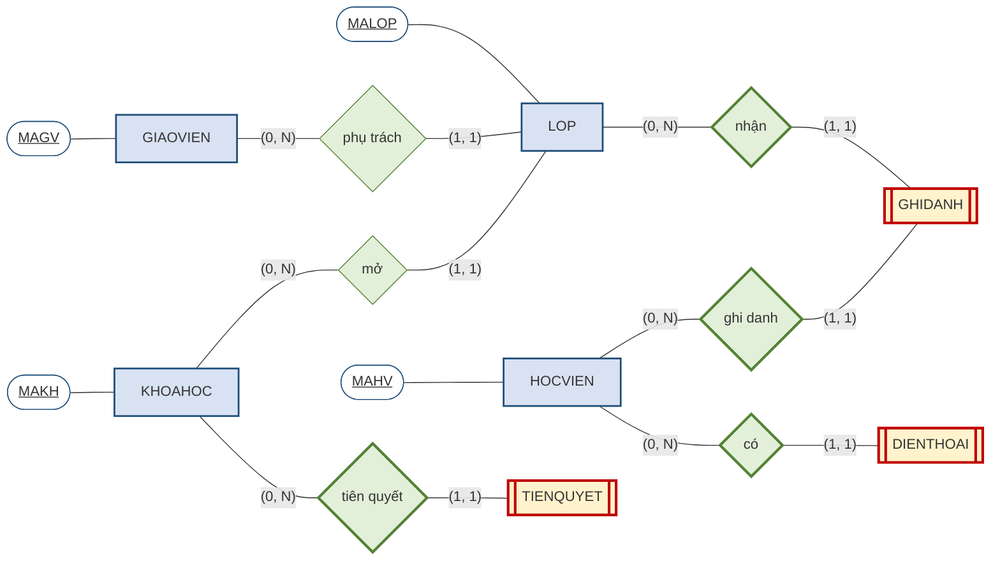
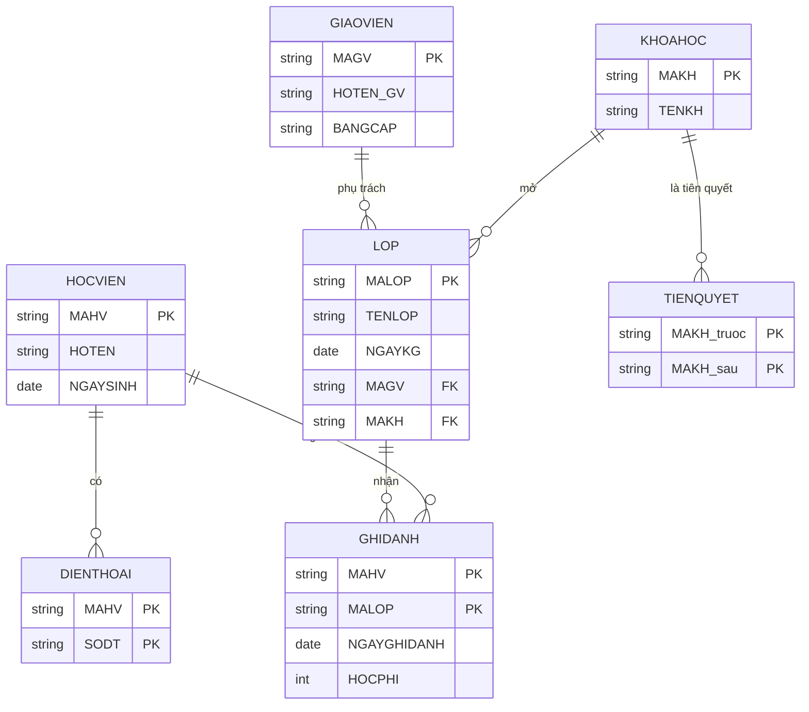

# 2.9. Ví dụ tổng hợp: Trung tâm Anh ngữ ABC

Mục này vận dụng trọn vẹn quy trình năm bước cho bài toán đã theo suốt học phần.

## 2.9.1. Đề bài — bảy quy tắc nghiệp vụ

1. Trung tâm có nhiều **giáo viên**; mỗi giáo viên có mã, họ tên, bằng cấp.
2. Trung tâm mở nhiều **lớp**; mỗi lớp có mã lớp, tên lớp, ngày khai giảng.
3. Mỗi **lớp** do **đúng một** giáo viên phụ trách. Một **giáo viên** có thể phụ trách **nhiều** lớp, hoặc **chưa** lớp nào *(giáo viên mới)*.
4. Mỗi **học viên** có mã, họ tên, ngày sinh và **nhiều số điện thoại**.
5. Một **học viên** ghi danh **nhiều** lớp; một **lớp** có **nhiều** học viên. Mỗi lượt ghi danh ghi nhận **ngày ghi danh** và **học phí**.
6. Mỗi lớp thuộc **một khóa học** *(ví dụ Anh cơ bản 1)*; một khóa học mở **nhiều** lớp.
7. Một **khóa học** có thể là **tiên quyết** của nhiều khóa học khác.

Trước khi bắt tay vào Bước 1, nên đọc lướt toàn đề để **đánh dấu các bẫy thiết kế**, dựa vào bảng phiên dịch ở mục 2.1.5 *(Bảng 2.1)*.

**Bảng 2.12. Nhận diện bẫy thiết kế ngay khi đọc đề**

| Quy tắc | Từ khóa đáng chú ý | Dấu hiệu | Xử lý ở bước |
|:--:|---|---|:--:|
| 3 | *"có thể"*, *"chưa lớp nào"* | Tham gia **tùy chọn** `min = 0` | Bước 3 |
| 4 | *"nhiều số điện thoại"* | Thuộc tính **đa trị** → phải tách | Bước 4 |
| 5 | *"nhiều…nhiều"* kèm *"học phí"* | **M:N có thuộc tính riêng** → thực thể kết hợp | Bước 4 |
| 7 | *"tiên quyết"* của chính khóa học | Liên kết **đệ quy M:N** | Bước 4 |

## 2.9.2. Bước 1 và 2 — thực thể, thuộc tính, thuộc tính khóa

Gạch chân các danh từ chỉ sự vật cần lưu thông tin, thu được **bốn thực thể** ban đầu: `GIAOVIEN`, `LOP`, `HOCVIEN`, `KHOAHOC`. Liệt kê thuộc tính và chọn thuộc tính khóa *(in đậm)*:

- `GIAOVIEN(`**`MAGV`**`, HOTEN_GV, BANGCAP)`
- `LOP(`**`MALOP`**`, TENLOP, NGAYKG)`
- `HOCVIEN(`**`MAHV`**`, HOTEN, NGAYSINH)`
- `KHOAHOC(`**`MAKH`**`, TENKH)`

Vẽ theo ký pháp Chen, bốn thực thể này cùng thuộc tính của chúng có dạng như sau. Ở bước này **chưa có liên kết nào** — các thực thể còn đứng rời nhau.

**Hình 2.14. Bước 1–2 — bốn thực thể với thuộc tính, ký pháp Chen**

!!! warning "Chú ý"

    Thuộc tính `SDT` của học viên là **đa trị**, nên trong Hình 2.14 nó được vẽ bằng **oval viền kép** và tô đỏ để đánh dấu. Nó **chưa** được xử lý ở bước này; việc tách sẽ làm ở Bước 4. Đây là minh họa cho lời khuyên ở mục 2.8.1: làm đúng thứ tự, đừng nhảy cóc. Ghi nhận vấn đề ngay khi phát hiện, nhưng xử lý đúng lượt của nó.

## 2.9.3. Bước 3 — xác định liên kết

Áp dụng kỹ thuật hỏi hai chiều cho từng cặp thực thể; kết quả đã được lập thành **Bảng 2.7** ở mục 2.4.3. Bổ sung thêm tính tham gia:

- `GIAOVIEN` – `LOP`: **1:M**. Phía lớp **bắt buộc** *(mọi lớp đều phải có giáo viên)*; phía giáo viên **tùy chọn** *(giáo viên mới chưa có lớp)*.
- `KHOAHOC` – `LOP`: **1:M**. Phía lớp **bắt buộc**; phía khóa học **tùy chọn** *(khóa học có thể chưa mở lớp nào)*.
- `HOCVIEN` – `LOP`: **M:N**, có thuộc tính riêng.
- `KHOAHOC` – `KHOAHOC`: **M:N đệ quy**.

Nối các hình thoi liên kết vào lược đồ Chen, ta được bức tranh sau. Để hình dễ đọc, từ đây trở đi chỉ hiện **thuộc tính khóa**; danh sách thuộc tính đầy đủ đã có ở Hình 2.14.

**Hình 2.15. Bước 3 — thêm liên kết và lực lượng, ký pháp Chen**

Hai hình thoi tô đỏ là hai liên kết **M:N** — chúng chính là danh sách việc phải làm ở Bước 4. Lược đồ hiện tại **chưa dùng được**: mô hình quan hệ ở Chương 3 không biểu diễn được liên kết M:N, và thuộc tính `HOCPHI` của quy tắc 5 vẫn chưa có chỗ đặt.

## 2.9.4. Bước 4 — xử lý ba ca đặc biệt

**Ca thứ nhất — thuộc tính đa trị `SDT`.** Theo mục 2.2.4, tách thành thực thể yếu `DIENTHOAI(`**`MAHV`**`,` **`SODT`**`)`, liên kết 1:M với `HOCVIEN`. Thuộc tính khóa là cặp phức hợp vì hai học viên trong cùng gia đình có thể khai chung một số máy bàn.

**Ca thứ hai — liên kết M:N giữa `HOCVIEN` và `LOP`.** Theo mục 2.6.4, tách thành thực thể kết hợp `GHIDANH(`**`MAHV`**`,` **`MALOP`**`, NGAYGHIDANH, HOCPHI)`. Liên kết M:N ban đầu được thay bằng hai liên kết 1:M.

**Ca thứ ba — liên kết đệ quy M:N của `KHOAHOC`.** Theo mục 2.6.2, tách thành `TIENQUYET(`**`MAKH_truoc`**`,` **`MAKH_sau`**`)`. Chú ý hai cột đều tham chiếu về `KHOAHOC` nhưng phải mang **tên khác nhau** để phân biệt vai trò.

Sau Bước 4, số thực thể tăng từ bốn lên **bảy**.

## 2.9.5. Bước 5 — lược đồ ER hoàn chỉnh

Lược đồ cuối cùng được trình bày bằng **cả hai ký pháp**, vì mỗi ký pháp cho thấy một mặt khác nhau của cùng một thiết kế.

**Hình 2.16. Lược đồ ER hoàn chỉnh của Trung tâm Anh ngữ ABC — ký pháp Chen**

*(chỉ hiện thuộc tính khóa; danh sách thuộc tính đầy đủ xem Hình 2.17)*

So sánh Hình 2.16 với Hình 2.15 cho thấy rõ tác dụng của Bước 4. **Hai hình thoi đỏ M:N đã biến mất**, thay vào đó là ba **thực thể yếu hoặc kết hợp** *(vẽ chữ nhật hai viền)* nối qua các **liên kết định danh** *(hình thoi hai viền)*. Mọi liên kết còn lại đều là **1:M** — dạng duy nhất mà mô hình quan hệ ở Chương 3 biểu diễn được trực tiếp.

Cùng lược đồ ấy trình bày theo Crow's Foot thì gọn hơn nhiều và **hiện được đầy đủ thuộc tính**:

**Hình 2.17. Lược đồ ER của Trung tâm Anh ngữ ABC — ký pháp Crow's Foot**

**Bảng 2.13. Bảy thực thể của lược đồ cuối cùng**

| # | Thực thể | Loại | Nguồn gốc |
|:--:|---|---|---|
| 1 | `GIAOVIEN` | Mạnh | Quy tắc 1 |
| 2 | `LOP` | Mạnh | Quy tắc 2 |
| 3 | `HOCVIEN` | Mạnh | Quy tắc 4 |
| 4 | `KHOAHOC` | Mạnh | Quy tắc 6 |
| 5 | `DIENTHOAI` | **Yếu** | Tách thuộc tính đa trị *(quy tắc 4)* |
| 6 | `GHIDANH` | **Kết hợp** | Tách liên kết M:N *(quy tắc 5)* |
| 7 | `TIENQUYET` | **Kết hợp** | Tách liên kết M:N đệ quy *(quy tắc 7)* |

Bước kiểm tra cuối cùng là **đối chiếu ngược từng quy tắc nghiệp vụ với lược đồ**. Cả bảy quy tắc đều tìm được chỗ của mình: quy tắc 1, 2, 4, 6 thành thực thể và thuộc tính; quy tắc 3 và 6 thành liên kết 1:M; quy tắc 5 thành `GHIDANH`; quy tắc 7 thành `TIENQUYET`. Lược đồ đầy đủ.

## 2.9.6. Nhìn lại Chương 1 — bốn thực thể mà trực giác không thấy

Chương 1 giải cùng bài toán này bằng trực giác và thu được **ba bảng**: `GIAOVIEN`, `LOP`, `HOCVIEN`. Chương 2 giải bằng phương pháp và thu được **bảy thực thể**. Bốn thực thể chênh lệch là `KHOAHOC`, `DIENTHOAI`, `GHIDANH`, `TIENQUYET`.

Điều đáng suy nghĩ là **vì sao trực giác không nhìn thấy chúng**. Câu trả lời nằm ở chỗ trực giác chỉ làm được một việc duy nhất: nhìn vào dữ liệu đã có và phát hiện chỗ lặp lại. Bốn thực thể bị bỏ sót đều **không lộ ra dưới dạng lặp lại** trong bảng phẳng ban đầu.

`KHOAHOC` không xuất hiện vì bảng phẳng ở Chương 1 chưa có cột nào về khóa học. `DIENTHOAI` không xuất hiện vì bảng ấy chỉ để chỗ cho một số điện thoại. `GHIDANH` không xuất hiện vì bảng phẳng gán mỗi học viên vào đúng một lớp, nên quan hệ nhiều–nhiều bị che khuất hoàn toàn. Và `TIENQUYET` không xuất hiện vì quan hệ tiên quyết giữa các khóa học **không nằm trong dữ liệu**, nó nằm trong **quy tắc nghiệp vụ** — thứ mà chỉ có phỏng vấn mới moi ra được.

Đây chính là bài học lớn nhất của Chương 2: **thiết kế cơ sở dữ liệu không phải là công việc dọn dẹp dữ liệu có sẵn, mà là công việc mô hình hóa nghiệp vụ.** Dữ liệu hiện có chỉ phản ánh những gì hệ thống cũ *tình cờ* ghi lại được — thường là một phần rất nhỏ của nghiệp vụ thật.

**Bảng 2.14. Cùng một cặp thực thể, hai quy tắc nghiệp vụ khác nhau cho hai lược đồ khác nhau**

| Quy tắc nghiệp vụ | Kết luận về liên kết | Lược đồ |
|---|---|---|
| *"Mỗi học viên chỉ học một lớp duy nhất"* | **1:M** | Chỉ cần đặt `MALOP` vào `HOCVIEN` — hai thực thể |
| *"Một học viên ghi danh nhiều lớp, mỗi lượt có học phí riêng"* | **M:N có thuộc tính** | Phải sinh thêm `GHIDANH` — ba thực thể |

Bảng trên khép lại chương bằng một kết luận về nghề nghiệp: **không có lược đồ đúng tuyệt đối, chỉ có lược đồ đúng với một tập quy tắc nghiệp vụ xác định.** Người thiết kế giỏi không phải là người vẽ nhanh, mà là người **hỏi đúng câu hỏi** trước khi vẽ.

---

---

[← Trang trước](2-8-quy-trinh-xay-dung-luoc-do-er-va-cac-ky-phap.md) · [Trang sau →](tom-tat.md)
