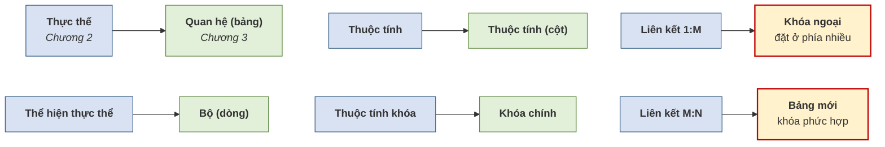

# 3.1. Quan hệ, bộ, thuộc tính và miền giá trị

*(1,0 tiết)*

## 3.1.1. Quan hệ — và một cạm bẫy thuật ngữ

!!! note "Định nghĩa 3.1"

    **Quan hệ** *(relation)* là một **bảng hai chiều** gồm các dòng và các cột, trong đó mỗi dòng biểu diễn một thể hiện thực thể và mỗi cột biểu diễn một thuộc tính.

Trước khi đi tiếp, cần gỡ ngay một hiểu nhầm rất phổ biến, và cũng là hiểu nhầm được Coronel cảnh báo riêng [3, tr. 60].

Nhiều người tưởng mô hình được gọi là *"mô hình **quan hệ**"* vì nó có **"quan hệ giữa các bảng"**. Điều đó **sai**. Codd là một **nhà toán học**, và trong toán học **"relation"** là một thuật ngữ đã có sẵn từ trước, **đồng nghĩa với "bảng"** — cụ thể là một tập các bộ. Ông dùng từ ấy để chỉ **chính cái bảng**, không phải mối liên hệ giữa các bảng.

| Thuật ngữ | Nghĩa | Học ở |
|---|---|---|
| **Quan hệ** *(relation)* | **Chính cái bảng** | Chương 3 |
| **Liên kết** *(relationship)* | Mối liên hệ **giữa** các thực thể hoặc bảng | Chương 2 |

Có một lập luận phản bác rất gọn cho cách hiểu sai. Mô hình **phân cấp** và mô hình **mạng** — hai mô hình ra đời trước Codd và đã trình bày ở mục 1.4.2 — **cũng có liên kết** giữa dữ liệu, thậm chí chằng chịt hơn nhiều. Vậy tại sao chúng không được gọi là "mô hình quan hệ"? Bởi vì *"quan hệ"* **không** có nghĩa là *"có liên kết"*; nó có nghĩa là **"dữ liệu được biểu diễn bằng bảng"**.

!!! warning "Chú ý"

    Câu cần nhớ: ***"quan hệ" là danh từ chỉ cái bảng, không phải mối liên hệ.*** Người học nên tự kiểm tra bằng cách đọc lại tên chương: *"Mô hình dữ liệu quan hệ"* nghĩa là *"mô hình dữ liệu dạng bảng"*.

## 3.1.2. Bộ, thuộc tính, miền giá trị, bậc và lực lượng

Mô hình quan hệ có một bộ thuật ngữ toán học riêng, song song với cách gọi thông thường.

**Bảng 3.1. Ba lớp thuật ngữ song song**

| Thuật ngữ toán học | Cách gọi trong cơ sở dữ liệu | Cách gọi thông thường |
|---|---|---|
| Quan hệ *(relation)* | Bảng *(table)* | Bảng |
| Bộ *(tuple)* | Bản ghi *(record)* | Dòng |
| Thuộc tính *(attribute)* | Trường *(field)* | Cột |
| Miền giá trị *(domain)* | Kiểu dữ liệu và ràng buộc | Giá trị hợp lệ |

!!! note "Định nghĩa 3.2"

    **Miền giá trị** *(domain)* của một thuộc tính là **tập hợp mọi giá trị hợp lệ** mà thuộc tính đó được phép nhận.

    **Bậc** *(degree)* của một quan hệ là **số thuộc tính** của nó. **Lực lượng** *(cardinality)* của một quan hệ là **số bộ** hiện có trong nó.

    **Ví dụ 3.1.** Quan hệ `HOCVIEN(MAHV, HOTEN, NGAYSINH)` có **bậc bằng 3**. Nếu trung tâm hiện có 250 học viên thì **lực lượng bằng 250**. Miền giá trị của `NGAYSINH` là *"mọi ngày hợp lệ, trước ngày hiện tại"*; miền giá trị của `MAHV` là *"chuỗi 4 ký tự, bắt đầu bằng HV"*.

Cần lưu ý rằng **bậc là đặc trưng của lược đồ** nên gần như không đổi, còn **lực lượng là đặc trưng của thể hiện** nên thay đổi liên tục — đúng cặp khái niệm lược đồ và thể hiện đã học ở mục 1.4.4.

!!! warning "Chú ý"

    Từ *"lực lượng"* ở đây **khác nghĩa** với *"lực lượng"* trong mô hình ER ở mục 2.5.1. Ở Chương 2, lực lượng là cặp `(min, max)` mô tả số thể hiện tham gia một liên kết. Ở Chương 3, lực lượng là **số dòng của một bảng**. Cùng một từ tiếng Việt dịch từ *cardinality*, nhưng dùng trong hai ngữ cảnh khác nhau.

## 3.1.3. Tám đặc trưng của một bảng quan hệ

Không phải bảng nào cũng là quan hệ. Một bảng chỉ được coi là quan hệ khi thỏa mãn tám đặc trưng sau [3, tr. 60].

**Bảng 3.2. Tám đặc trưng của một bảng quan hệ**

| # | Đặc trưng |
|:--:|---|
| 1 | Là cấu trúc **hai chiều** gồm dòng và cột |
| 2 | Mỗi **dòng (bộ)** biểu diễn **một** thể hiện thực thể |
| 3 | Mỗi **cột** là một thuộc tính, có **tên phân biệt** trong bảng |
| 4 | ⭐ Mỗi **ô chứa đúng một giá trị đơn** |
| 5 | Mọi giá trị trong cùng một cột có **cùng định dạng dữ liệu** |
| 6 | Mỗi cột có một **miền giá trị** xác định |
| 7 | ⭐ **Thứ tự dòng và thứ tự cột không quan trọng** |
| 8 | Mỗi bảng phải có thuộc tính hoặc tổ hợp thuộc tính **định danh duy nhất** mỗi dòng |

Hai đặc trưng được đánh dấu sao đáng dừng lại phân tích, vì chúng có hệ quả trực tiếp tới công việc thiết kế.

**Đặc trưng 4 — mỗi ô một giá trị đơn.** Người học đã gặp nguyên tắc này ở Chương 2 mà chưa biết tên nó. Chính vì nguyên tắc này mà cách nhồi ba số điện thoại vào một ô bị bác bỏ ở mục 2.2.4. Hôm nay ta gọi đúng tên, và ở mục 3.4.2 sẽ dùng nó thêm một lần nữa để **chứng minh** vì sao khóa ngoại bắt buộc phải đặt ở phía "nhiều". Ở Chương 5, nguyên tắc này sẽ được nâng lên thành **dạng chuẩn 1**.

**Đặc trưng 7 — thứ tự không quan trọng.** Đây là đặc trưng nghe lạ nhất với người quen dùng bảng tính, nên cần một bảng đối chiếu.

| | Trong bảng tính | Trong cơ sở dữ liệu |
|---|---|---|
| Có khái niệm "dòng thứ 5" không? | **Có** — người dùng nói "dòng 5", "ô C7" | **Không** — khái niệm đó không tồn tại |
| Lấy dữ liệu ra bằng gì? | Bằng **vị trí** *(tọa độ ô)* | Bằng **giá trị khóa** *(`MAHV = 'HV01'`)* |
| Vì sao? | Bảng tính là một lưới tọa độ | Bảng là một **tập hợp** toán học — mà tập hợp không có thứ tự |

!!! warning "Chú ý — một cảnh báo nghề nghiệp"

    Không bao giờ được viết chương trình theo kiểu *"lấy dòng đầu tiên vì đó là bản ghi mới nhất"*. Không có gì bảo đảm điều đó. Chương trình có thể chạy đúng hôm nay và sai vào ngày hệ quản trị thay đổi cách tối ưu truy vấn. Muốn có thứ tự thì **phải sắp xếp tường minh** theo một cột cụ thể.

## 3.1.4. Từ điển phiên dịch Chương 2 sang Chương 3

Toàn bộ công việc của mục 3.4 là dịch từ ngôn ngữ ER sang ngôn ngữ quan hệ. Hình dưới đây là bảng từ vựng của phép dịch ấy.

**Hình 3.1. Từ điển phiên dịch — từ mô hình ER sang mô hình quan hệ**

Bốn dòng đầu là phép dịch **một–một**, gần như đổi tên. Hai dòng cuối, được tô đậm, là chỗ **phép dịch không còn máy móc**: một liên kết ở Chương 2 không biến thành một bảng, mà biến thành **một cột khóa ngoại** hoặc **một bảng hoàn toàn mới**. Đó là nội dung chính của mục 3.4.

---

---

[← Trang trước](index.md) · [Trang sau →](3-2-phu-thuoc-ham-va-cac-loai-khoa.md)
