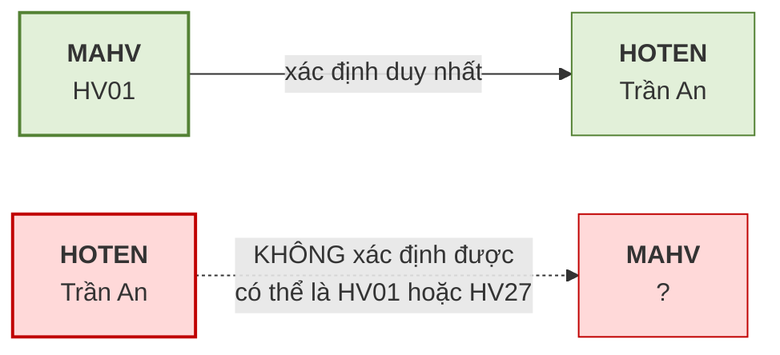
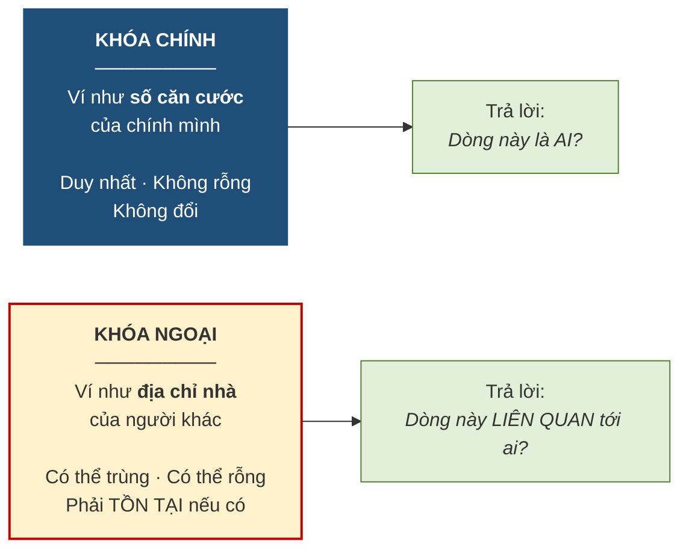

# 3.2. Phụ thuộc hàm và các loại khóa

*(1,5 tiết)*

## 3.2.1. Bàn giao thuật ngữ: từ "thuộc tính khóa" sang "khóa"

Ở Chương 2, giáo trình dùng nhất quán cụm **"thuộc tính khóa"**, vì trong mô hình ER mọi thứ gắn vào thực thể đều là thuộc tính và khóa chỉ là một loại thuộc tính đặc biệt — được vẽ bằng oval gạch chân.

Từ chương này trở đi, giáo trình dùng từ **"khóa"** với nghĩa kỹ thuật chặt chẽ hơn hẳn. Mô hình quan hệ không có một loại khóa mà có cả **một hệ thống năm loại khóa** phân biệt rõ ràng, mỗi loại phục vụ một mục đích khác nhau. Sự chuyển đổi thuật ngữ này không phải là câu nệ chữ nghĩa: nó đánh dấu bước chuyển từ *mô tả nghiệp vụ* sang *cấu trúc dữ liệu chặt chẽ*.

## 3.2.2. Phụ thuộc hàm và tính có chiều

Trước khi định nghĩa khóa, cần một công cụ để nói về **quan hệ xác định giữa các thuộc tính**.

!!! note "Định nghĩa 3.3"

    Thuộc tính `B` **phụ thuộc hàm** vào thuộc tính `A`, viết là **`A → B`**, nếu **mỗi giá trị của `A` xác định duy nhất một giá trị của `B`**. Khi đó `A` gọi là **vế trái** *(determinant)* và `B` là **vế phải**.

Cách đọc thực dụng của `A → B` là: *"biết `A` thì biết chắc `B`"*.

!!! example "Ví dụ 3.2"

    Trong bảng `HOCVIEN(MAHV, HOTEN, NGAYSINH)`, ta có `MAHV → HOTEN`: biết mã học viên là `HV01` thì biết chắc học viên đó tên Trần An. Ngược lại `HOTEN → MAHV` **không đúng**, vì trung tâm có thể có hai học viên cùng tên Trần An mang hai mã khác nhau.

Ví dụ trên minh họa đặc điểm quan trọng nhất của phụ thuộc hàm: **nó có chiều**.

**Hình 3.2. Phụ thuộc hàm có chiều — như một mũi tên một chiều**

!!! warning "Chú ý"

    Phụ thuộc hàm là một **quy tắc nghiệp vụ**, không phải một quan sát trên dữ liệu hiện có. Nếu hôm nay bảng chỉ có 3 học viên và tình cờ không ai trùng tên, ta **không được kết luận** `HOTEN → MAHV`. Câu hỏi đúng phải là: *"nghiệp vụ có cho phép hai học viên trùng tên không?"* Nếu có thì phụ thuộc hàm ấy không tồn tại, bất kể dữ liệu hiện tại trông thế nào. Đây là lỗi rất phổ biến, và Chương 5 sẽ quay lại điểm này khi dùng phụ thuộc hàm làm công cụ chuẩn hóa.

## 3.2.3. Năm loại khóa

!!! note "Định nghĩa 3.4"

    Cho quan hệ `R`:

    - **Siêu khóa** *(superkey)*: một tập thuộc tính **xác định duy nhất** mỗi bộ. Có thể thừa thuộc tính.
    - **Khóa dự tuyển** *(candidate key)*: một siêu khóa **tối thiểu** — bỏ bất kỳ thuộc tính nào cũng mất tính duy nhất.
    - **Khóa chính** *(primary key)*: khóa dự tuyển **được chọn** để định danh chính thức.
    - **Khóa phụ** *(secondary key)*: thuộc tính hoặc tổ hợp dùng để **tìm kiếm thuận tiện**, không nhất thiết duy nhất.
    - **Khóa ngoại** *(foreign key)*: thuộc tính trong bảng này nhưng là **khóa chính của bảng khác**, dùng để tạo liên kết.

**Bảng 3.3. Năm loại khóa — minh họa trên bảng `HOCVIEN(MAHV, CCCD, HOTEN, NGAYSINH, MALOP)`**

| Loại khóa | Ví dụ | Ghi chú |
|---|---|---|
| **Siêu khóa** | `{MAHV}`, `{CCCD}`, `{MAHV, HOTEN}`, `{MAHV, CCCD, HOTEN}` | Rất nhiều; hai tập cuối **thừa** |
| **Khóa dự tuyển** | `{MAHV}`, `{CCCD}` | Chỉ những siêu khóa **tối thiểu** |
| **Khóa chính** | `{MAHV}` | Người thiết kế **chọn một** trong các khóa dự tuyển |
| **Khóa phụ** | `{HOTEN}` | Dùng để tra cứu; **không duy nhất** |
| **Khóa ngoại** | `{MALOP}` | Là khóa chính của bảng `LOP` |

Quan hệ giữa ba loại khóa đầu là **quan hệ bao hàm thu hẹp dần**: mọi khóa chính đều là khóa dự tuyển, mọi khóa dự tuyển đều là siêu khóa, nhưng chiều ngược lại không đúng. Việc đi từ siêu khóa xuống khóa dự tuyển là bỏ đi phần **thừa**; việc đi từ khóa dự tuyển xuống khóa chính là một **quyết định của người thiết kế** — và tiêu chí để quyết định chính là phần khóa tự nhiên với khóa thay thế đã học ở mục 2.3.2.

!!! warning "Chú ý"

    Phân biệt **siêu khóa** và **khóa dự tuyển** chính là phân biệt *tính duy nhất* với *tính tối thiểu* — hai tiêu chí đã nêu ở Bảng 2.5 của Chương 2. Ở Chương 2 ta yêu cầu thuộc tính khóa thỏa mãn **cả hai**; ở đây ta đặt tên riêng cho từng mức: thỏa mãn duy nhất là **siêu khóa**, thỏa mãn thêm tối thiểu là **khóa dự tuyển**.

## 3.2.4. Khóa chính và khóa ngoại — hai vai trò khác nhau

Hai loại khóa này được dùng nhiều nhất, và cũng hay bị lẫn vai trò. Một phép loại suy giúp phân định rất rõ.

**Hình 3.3. Khóa chính là "căn cước", khóa ngoại là "địa chỉ liên hệ"**

Ba khác biệt then chốt cần nắm. Về **tính duy nhất**: khóa chính không được trùng, còn khóa ngoại **được phép trùng** — bốn lớp cùng do một giáo viên phụ trách thì cột `MAGV` của bảng `LOP` có bốn dòng giá trị giống nhau, hoàn toàn hợp lệ. Về **giá trị rỗng**: khóa chính tuyệt đối cấm, khóa ngoại thì tùy nghiệp vụ. Về **điều kiện tồn tại**: khóa ngoại nếu có giá trị thì giá trị ấy **bắt buộc phải tồn tại** ở bảng được tham chiếu.

Ba khác biệt trên chính là nội dung của hai ràng buộc toàn vẹn ở mục tiếp theo.

---

---

[← Trang trước](3-1-quan-he-bo-thuoc-tinh-va-mien-gia-tri.md) · [Trang sau →](3-3-cac-rang-buoc-toan-ven.md)
