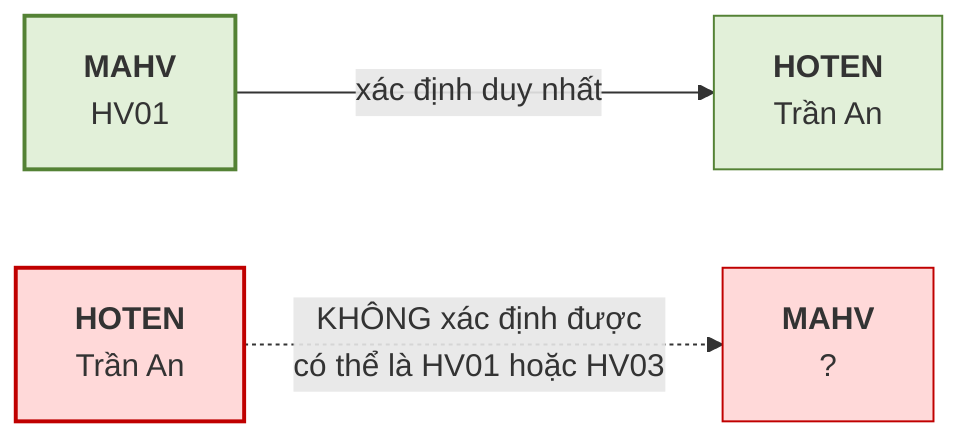
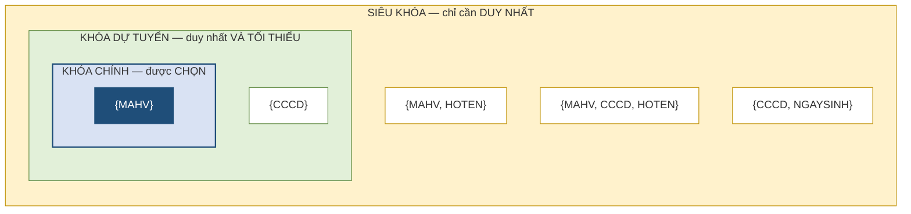
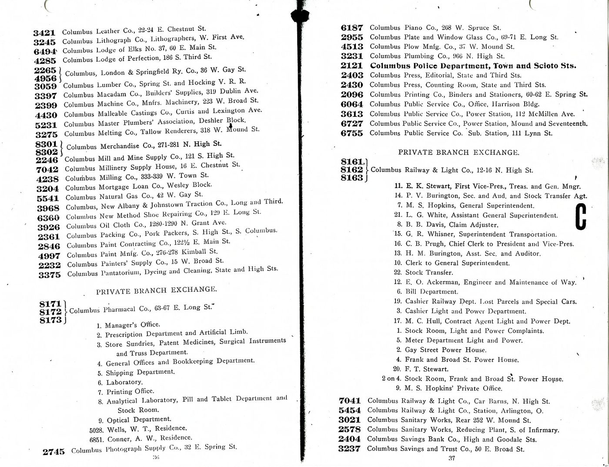
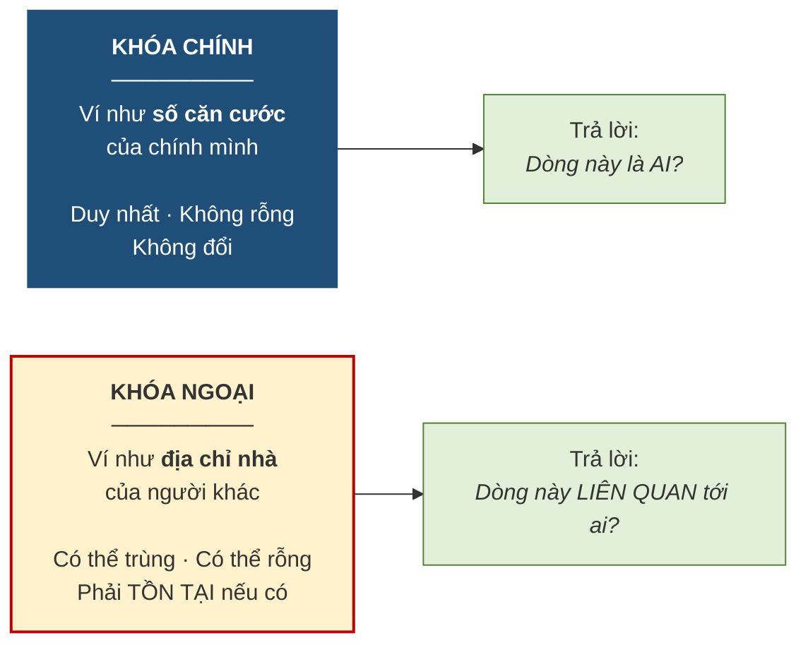

# 3.2. Phụ thuộc hàm và các loại khóa

*(1,5 tiết)*

## 3.2.1. Bàn giao thuật ngữ: từ "thuộc tính khóa" sang "khóa"

Ở Chương 2, giáo trình dùng nhất quán cụm **"thuộc tính khóa"**, vì trong mô hình ER mọi thứ gắn vào thực thể đều là thuộc tính và khóa chỉ là một loại thuộc tính đặc biệt — được vẽ bằng oval gạch chân.

Từ chương này trở đi, giáo trình dùng từ **"khóa"** với nghĩa kỹ thuật chặt chẽ hơn hẳn. Mô hình quan hệ không có một loại khóa mà có cả **một hệ thống năm loại khóa** phân biệt rõ ràng, mỗi loại phục vụ một mục đích khác nhau. Sự chuyển đổi thuật ngữ này không phải là câu nệ chữ nghĩa: nó đánh dấu bước chuyển từ *mô tả nghiệp vụ* sang *cấu trúc dữ liệu chặt chẽ*.

## 3.2.2. Phụ thuộc hàm và tính có chiều

Trước khi định nghĩa khóa, cần một công cụ để nói về **quan hệ xác định giữa các thuộc tính**.

!!! note "Định nghĩa 3.3"

    Thuộc tính `B` **phụ thuộc hàm** vào thuộc tính `A`, viết là **`A → B`**, nếu **mỗi giá trị của `A` xác định duy nhất một giá trị của `B`**. Khi đó `A` gọi là **vế trái** *(determinant)* và `B` là **vế phải**.

{width=50%}

*Ảnh minh họa: máy quét mã vạch ở quầy thu ngân. Quét mã là ra tên và giá: biết mã thì biết chắc giá (`MASP → DONGIA`), nhưng biết giá không suy ra được mã vì nhiều mặt hàng cùng giá — Nguồn: Wikimedia Commons · Network.nt · Public domain.*

Cách đọc thực dụng của `A → B` là: *"biết `A` thì biết chắc `B`"*.

!!! abstract "Công thức"

    Trên quan hệ `R`, phụ thuộc hàm `A → B` đúng khi và chỉ khi

    **với mọi hai bộ `t₁`, `t₂` của `R`: nếu `t₁[A] = t₂[A]` thì `t₁[B] = t₂[B]`.**

    Ký hiệu `t[A]` đọc là *"giá trị của bộ `t` tại cột `A`"*. Cả công thức đọc thành lời là: *"hai dòng nào giống nhau ở cột `A` thì bắt buộc phải giống nhau ở cột `B`"*. Cách viết này cho ta một **phép thử cụ thể**: muốn bác bỏ `A → B`, chỉ cần tìm được **hai dòng** cùng `A` mà khác `B`.

!!! example "Ví dụ 3.2"

    Trong bảng `HOCVIEN(MAHV, HOTEN, NGAYSINH)`, ta có `MAHV → HOTEN`: biết mã học viên là `HV01` thì biết chắc học viên đó tên Trần An. Ngược lại `HOTEN → MAHV` **không đúng**, vì trung tâm có thể có hai học viên cùng tên Trần An mang hai mã khác nhau.

Áp phép thử hai dòng lên dữ liệu — dùng lại đúng bảng đã dùng để bàn về tính tối thiểu ở Bảng 2.7 của Chương 2.

**Bảng 3.7. Phép thử hai dòng cho hai phụ thuộc hàm ngược chiều nhau**

| MAHV | HOTEN | NGAYSINH |
|---|---|---|
| HV01 | Trần An | 12/04/2005 |
| HV02 | Lê Bình | 30/09/2004 |
| HV03 | Trần An | 25/11/2005 |

| Kiểm tra | Tìm hai dòng cùng vế trái | Vế phải có khác nhau không? | Kết luận |
|---|---|---|---|
| `MAHV → HOTEN` | không có hai dòng nào cùng `MAHV` | — | **đúng** *(không tìm được phản ví dụ)* |
| `HOTEN → MAHV` | dòng 1 và dòng 3 cùng "Trần An" | `HV01 ≠ HV03` — **khác** | **sai** *(hai dòng này là phản ví dụ)* |

Ví dụ trên minh họa đặc điểm quan trọng nhất của phụ thuộc hàm: **nó có chiều**.

**Hình 3.2. Phụ thuộc hàm có chiều — như một mũi tên một chiều**

!!! warning "Chú ý"

    Phụ thuộc hàm là một **quy tắc nghiệp vụ**, không phải một quan sát trên dữ liệu hiện có. Nếu hôm nay bảng chỉ có 3 học viên và tình cờ không ai trùng tên, ta **không được kết luận** `HOTEN → MAHV`. Câu hỏi đúng phải là: *"nghiệp vụ có cho phép hai học viên trùng tên không?"* Nếu có thì phụ thuộc hàm ấy không tồn tại, bất kể dữ liệu hiện tại trông thế nào. Đây là lỗi rất phổ biến, và Chương 5 sẽ quay lại điểm này khi dùng phụ thuộc hàm làm công cụ chuẩn hóa.

## 3.2.3. Năm loại khóa

!!! note "Định nghĩa 3.4"

    Cho quan hệ `R`:

    - **Siêu khóa** *(superkey)*: một tập thuộc tính **xác định duy nhất** mỗi bộ. Có thể thừa thuộc tính.
    - **Khóa dự tuyển** *(candidate key)*: một siêu khóa **tối thiểu** — bỏ bất kỳ thuộc tính nào cũng mất tính duy nhất.
    - **Khóa chính** *(primary key)*: khóa dự tuyển **được chọn** để định danh chính thức.
    - **Khóa phụ** *(secondary key)*: thuộc tính hoặc tổ hợp dùng để **tìm kiếm thuận tiện**, không nhất thiết duy nhất.
    - **Khóa ngoại** *(foreign key)*: thuộc tính trong bảng này nhưng là **khóa chính của bảng khác**, dùng để tạo liên kết.

**Bảng 3.8. Năm loại khóa — minh họa trên bảng `HOCVIEN(MAHV, CCCD, HOTEN, NGAYSINH, MALOP)`**

| Loại khóa | Ví dụ | Ghi chú |
|---|---|---|
| **Siêu khóa** | `{MAHV}`, `{CCCD}`, `{MAHV, HOTEN}`, `{MAHV, CCCD, HOTEN}` | Rất nhiều; hai tập cuối **thừa** |
| **Khóa dự tuyển** | `{MAHV}`, `{CCCD}` | Chỉ những siêu khóa **tối thiểu** |
| **Khóa chính** | `{MAHV}` | Người thiết kế **chọn một** trong các khóa dự tuyển |
| **Khóa phụ** | `{HOTEN}` | Dùng để tra cứu; **không duy nhất** |
| **Khóa ngoại** | `{MALOP}` | Là khóa chính của bảng `LOP` |

Bảng dữ liệu dưới đây cho thấy vì sao bảng `HOCVIEN` này có **hai** khóa dự tuyển: cả `MAHV` lẫn `CCCD` đều không có hai dòng nào trùng, và mỗi cột một mình đã đủ — không cần ghép thêm gì.

**Bảng 3.9. Dữ liệu `HOCVIEN` có hai cột cùng đủ tư cách khóa dự tuyển**

| MAHV | CCCD | HOTEN | NGAYSINH | MALOP |
|---|---|---|---|---|
| HV01 | 048205001234 | Trần An | 12/04/2005 | A1 |
| HV02 | 048204005678 | Lê Bình | 30/09/2004 | A1 |
| HV03 | 048205009012 | Trần An | 25/11/2005 | A2 |

Quan hệ giữa ba loại khóa đầu là **quan hệ bao hàm thu hẹp dần**: mọi khóa chính đều là khóa dự tuyển, mọi khóa dự tuyển đều là siêu khóa, nhưng chiều ngược lại không đúng. Việc đi từ siêu khóa xuống khóa dự tuyển là bỏ đi phần **thừa**; việc đi từ khóa dự tuyển xuống khóa chính là một **quyết định của người thiết kế** — và tiêu chí để quyết định chính là phần khóa tự nhiên với khóa thay thế đã học ở mục 2.3.2.

**Hình 3.3. Ba loại khóa lồng nhau — thu hẹp dần từ siêu khóa tới khóa chính**

Đọc hình từ ngoài vào trong. Vòng ngoài cùng chứa **mọi tập thuộc tính đủ duy nhất**, kể cả những tập thừa như `{MAHV, HOTEN}`. Vòng giữa chỉ giữ lại những tập **không bỏ bớt được** — ở đây là `{MAHV}` và `{CCCD}`. Vòng trong cùng là **một** tập được người thiết kế chỉ định. Khóa ngoại và khóa phụ không nằm trong hình này vì chúng thuộc một trục phân loại khác: chúng nói về *vai trò* của thuộc tính, không nói về *tính duy nhất*.

!!! warning "Chú ý"

    Phân biệt **siêu khóa** và **khóa dự tuyển** chính là phân biệt *tính duy nhất* với *tính tối thiểu* — hai tiêu chí đã nêu ở Bảng 2.5 của Chương 2. Ở Chương 2 ta yêu cầu thuộc tính khóa thỏa mãn **cả hai**; ở đây ta đặt tên riêng cho từng mức: thỏa mãn duy nhất là **siêu khóa**, thỏa mãn thêm tối thiểu là **khóa dự tuyển**.

## 3.2.4. Khóa chính và khóa ngoại — hai vai trò khác nhau

{width=55%}

*Ảnh minh họa: một trang danh bạ điện thoại năm 1905. Số điện thoại ghi trong danh bạ là số *của người khác* mà ta ghi lại để liên hệ — giống khóa ngoại; còn số căn cước của chính mình mới giống khóa chính — Nguồn: Wikimedia Commons · DPLA · Public domain.*

Hai loại khóa này được dùng nhiều nhất, và cũng hay bị lẫn vai trò. Một phép loại suy giúp phân định rất rõ.

**Hình 3.4. Khóa chính là "căn cước", khóa ngoại là "địa chỉ liên hệ"**

Phép loại suy ấy hiện ra bằng dữ liệu như sau. Cột `MAGV` xuất hiện ở **cả hai bảng** nhưng với hai vai trò: trong `GIAOVIEN` nó là **khóa chính** *(căn cước của giáo viên)*, trong `LOP` nó là **khóa ngoại** *(địa chỉ liên hệ mà lớp ghi lại để biết giáo viên của mình là ai)*.

**Bảng 3.10. Cùng một cột `MAGV`, hai vai trò ở hai bảng**

*`GIAOVIEN` — `MAGV` là khóa chính:*

| MAGV | HOTEN_GV | BANGCAP |
|---|---|---|
| GV1 | Lê Hoa | Thạc sĩ |
| GV2 | Trần Mai | Cử nhân |
| GV3 | Phạm Nam | Cử nhân |

*`LOP` — `MAGV` là khóa ngoại trỏ về `GIAOVIEN`:*

| MALOP | TENLOP | MAGV |
|---|---|---|
| A1 | Anh cơ bản 1 | GV1 |
| A2 | Anh giao tiếp | GV2 |
| A3 | Anh nâng cao | GV1 |
| A4 | Luyện thi IELTS | GV1 |
| A6 | Anh thiếu nhi | *(rỗng)* |

Ba khác biệt then chốt cần nắm, và cả ba đều đọc được từ hai bảng trên. Về **tính duy nhất**: khóa chính không được trùng — ba dòng `GIAOVIEN` có ba mã khác nhau; còn khóa ngoại **được phép trùng** — `GV1` xuất hiện ở **ba dòng** của `LOP` vì cô Lê Hoa phụ trách ba lớp, hoàn toàn hợp lệ. Về **giá trị rỗng**: khóa chính tuyệt đối cấm, khóa ngoại thì tùy nghiệp vụ — lớp `A6` chưa phân giáo viên nên ô `MAGV` để rỗng. Về **điều kiện tồn tại**: khóa ngoại nếu có giá trị thì giá trị ấy **bắt buộc phải tồn tại** ở bảng được tham chiếu — mọi mã trong cột `MAGV` của `LOP` đều tìm thấy trong `GIAOVIEN`; ngược lại thì không bắt buộc: thầy `GV3` chưa được lớp nào tham chiếu tới, và điều đó không sao cả.

Ba khác biệt trên chính là nội dung của hai ràng buộc toàn vẹn ở mục tiếp theo.

!!! question "Tự kiểm tra 3.2"

    *(tự trả lời trước, rồi mở đáp án bên dưới)*

    1. Trên bảng `SANPHAM(MASP, TENSP, MANCC)`, phụ thuộc hàm `MASP → TENSP` có đúng không? Còn `TENSP → MASP`? Dùng phép thử hai dòng để trả lời.
    2. Với dữ liệu ở Bảng 3.9, tập `{MAHV, CCCD}` là siêu khóa hay khóa dự tuyển? Vì sao?
    3. Nhìn Bảng 3.10: nếu thêm lớp `A7` do cô Lê Hoa phụ trách, cột `MAGV` của `LOP` sẽ có bốn dòng `GV1`. Có vi phạm gì không?

??? success "Đáp án tự kiểm tra 3.2"

    *(1)* `MASP → TENSP` đúng: hai dòng cùng mã sản phẩm không thể có hai tên khác nhau. `TENSP → MASP` thường **sai**: hai sản phẩm khác mã có thể trùng tên *(hai loại "Bút bi xanh" của hai nhà cung cấp)* — đó là phản ví dụ. *(2)* `{MAHV, CCCD}` là **siêu khóa** nhưng **không** phải khóa dự tuyển: bỏ `CCCD` đi, `MAHV` vẫn đủ duy nhất, nên tập này thừa. *(3)* Không vi phạm gì: khóa ngoại **được phép trùng**; cột `MAGV` của `LOP` có bốn dòng `GV1` chỉ nói rằng cô Lê Hoa phụ trách bốn lớp.

---

---

[← Trang trước](3-1-quan-he-bo-thuoc-tinh-va-mien-gia-tri.md) · [Trang sau →](3-3-cac-rang-buoc-toan-ven.md)
