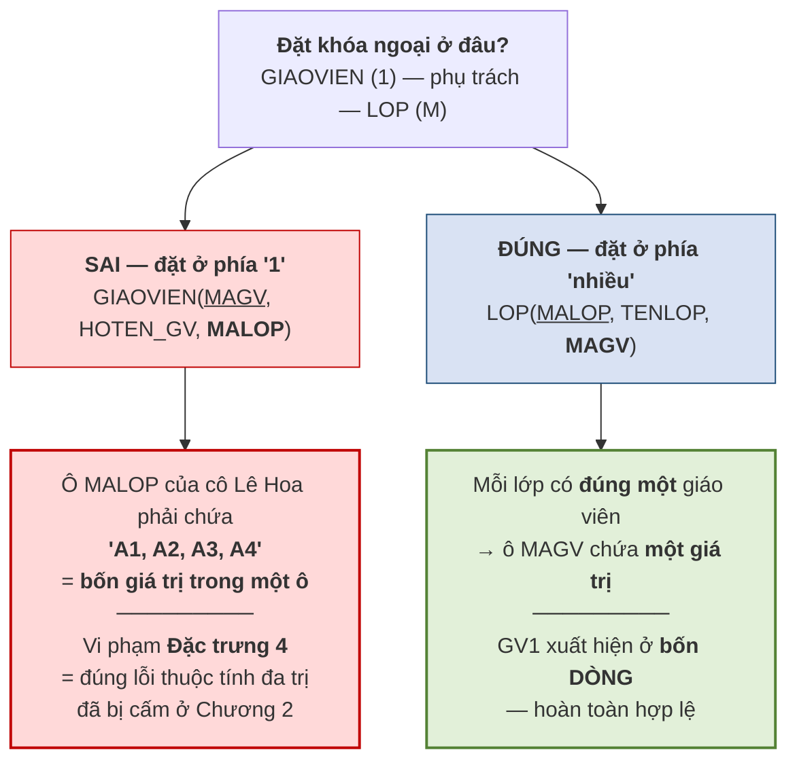
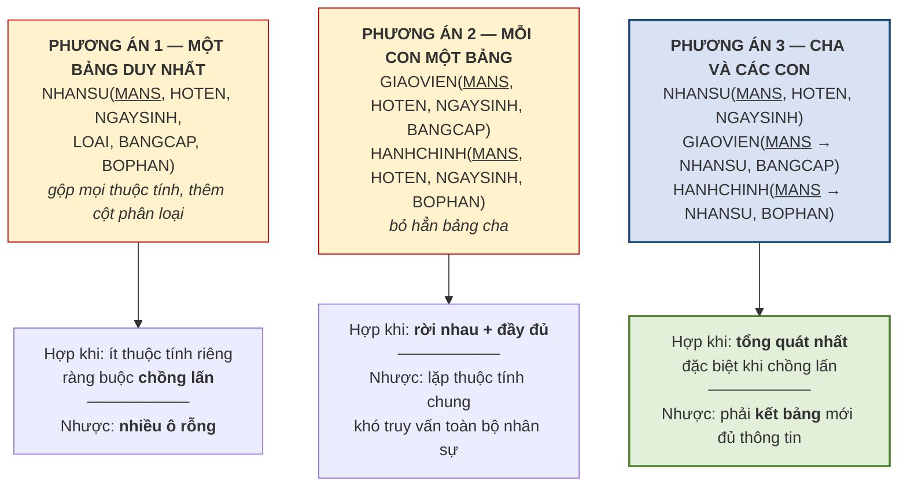

# 3.4. Bốn quy tắc ánh xạ ER sang mô hình quan hệ

*(1,5 tiết)*

Đây là kỹ năng trọng tâm của chương và là một trong những kỹ năng được Rubric 3 chấm trực tiếp. Điểm đáng mừng: công việc này gần như **máy móc**. Mọi quyết định sáng tạo đã được dùng hết ở Chương 2 — lúc phải nghĩ *"cất `HOCPHI` ở đâu"*. Ở đây chỉ cần áp quy tắc cho đúng.

!!! warning "Chú ý"

    Nhưng cũng chính vì máy móc mà nó nguy hiểm: **nếu lược đồ ER sai thì lược đồ quan hệ sẽ sai theo**. Ánh xạ không sửa được lỗi thiết kế, nó chỉ trung thành chuyển lỗi sang dạng khác. Vì vậy trước khi ánh xạ, luôn phải đối chiếu lược đồ ER với quy tắc nghiệp vụ một lần nữa.

## 3.4.1. Bốn quy tắc

**Bảng 3.5. Bốn quy tắc ánh xạ ER sang quan hệ**

| Quy tắc | Thành phần ER | Kết quả trong mô hình quan hệ |
|:--:|---|---|
| **QT1** | Thực thể **mạnh** | Một **bảng**; thuộc tính khóa trở thành **khóa chính**. Thuộc tính phức hợp tách thành các cột đơn |
| **QT2** | Liên kết **1:1** | Đưa khóa chính của **một bên** sang bên kia làm **khóa ngoại**. Chọn bên **tham gia bắt buộc** để tránh giá trị rỗng |
| **QT3** | Liên kết **1:M** | Đưa khóa chính bên **"1"** sang bên **"nhiều"** làm **khóa ngoại** |
| **QT4** | Liên kết **M:N** | Tạo một **bảng mới**, khóa chính là **khóa phức hợp** ghép khóa chính hai bên, cộng các thuộc tính riêng của liên kết |

Ba trường hợp còn lại — thực thể yếu, liên kết đệ quy và phân cấp cha/con — được xử lý ở các mục 3.4.3 đến 3.4.5.

## 3.4.2. Quy tắc QT3 — vì sao khóa ngoại bắt buộc ở phía "nhiều"

Đây là quy tắc hay bị áp sai nhất, nên đáng chứng minh thay vì chỉ ghi nhớ.

Xét liên kết *"giáo viên (1) phụ trách lớp (M)"*. Giả sử cô Lê Hoa phụ trách **bốn lớp**: A1, A2, A3, A4.

**Hình 3.4. Làm sai để thấy vì sao — khóa ngoại đặt nhầm bên**

Cách làm đúng cho ra bảng dữ liệu như sau — và nó hoàn toàn hợp lệ:

| MALOP | TENLOP | MAGV |
|---|---|---|
| A1 | Anh cơ bản 1 | GV1 |
| A2 | Anh giao tiếp | GV1 |
| A3 | Anh nâng cao | GV1 |
| A4 | Luyện thi IELTS | GV1 |

!!! warning "Chú ý"

    Câu cần nhớ: ***khóa ngoại luôn đặt ở phía "nhiều", vì phía "1" chỉ giữ nổi một giá trị trong mỗi ô.*** Coronel diễn đạt ý này như sau: *"gánh nặng thiết lập liên kết luôn đặt lên thực thể chứa khóa ngoại — thường là phía nhiều"* [3, tr. 113].

Điều đáng chú ý về mặt phương pháp: chứng minh trên **không dùng thêm kiến thức mới nào**. Nó chỉ dùng lại **Đặc trưng 4** ở mục 3.1.3. Đây là một ví dụ điển hình cho cách các quy tắc thiết kế được suy ra từ vài nguyên lý nền tảng chứ không phải học thuộc rời rạc.

## 3.4.3. Ánh xạ thuộc tính đa trị và thực thể yếu

Ở Chương 2, thuộc tính đa trị `SDT` đã được tách thành thực thể yếu `DIENTHOAI`. Bước ánh xạ chỉ việc chuyển nó thành bảng.

> **Quy tắc.** Một **thực thể yếu** trở thành **một bảng riêng**. Khóa chính của bảng ấy là **khóa phức hợp**, ghép từ ① khóa chính của thực thể chủ *(đồng thời là khóa ngoại trỏ về thực thể chủ)* và ② thuộc tính phân biệt riêng của thực thể yếu.

!!! example "Ví dụ 3.5"

    Thực thể yếu `DIENTHOAI` của Trung tâm ABC ánh xạ thành:

    `DIENTHOAI(`**`MAHV`**`,` **`SODT`**`)` — trong đó `MAHV` vừa là **một nửa khóa chính**, vừa là **khóa ngoại** trỏ về `HOCVIEN`.

    Dữ liệu minh họa:

    | MAHV | SODT |
    |---|---|
    | HV01 | 0905111111 |
    | HV01 | 0906222222 |
    | HV01 | 0907333333 |
    | HV02 | 0905444444 |

    Học viên HV01 có ba số điện thoại, thể hiện bằng **ba dòng** chứ không phải ba cột. Muốn thêm số thứ tư chỉ cần thêm một dòng — đúng như đã hứa ở mục 2.2.4.

    **Chú ý.** Điểm dễ sai là **quên rằng `MAHV` mang hai vai trò cùng lúc**. Nó vừa là thành phần khóa chính *(nên không được rỗng)*, vừa là khóa ngoại *(nên phải tồn tại ở bảng `HOCVIEN`)*. Đây là chỗ hai ràng buộc toàn vẹn ở mục 3.3 cùng tác động lên một cột.

## 3.4.4. Ánh xạ liên kết M:N và liên kết đệ quy

**Liên kết M:N** áp quy tắc QT4: tạo một bảng mới. Ở Chương 2, việc này đã làm sẵn dưới tên gọi *thực thể kết hợp*, nên bước ánh xạ chỉ là ghi lại.

!!! example "Ví dụ 3.6"

    Liên kết M:N giữa `HOCVIEN` và `LOP` ánh xạ thành:

    `GHIDANH(`**`MAHV`**`,` **`MALOP`**`, NGAYGHIDANH, HOCPHI)`

    Khóa chính là cặp `(MAHV, MALOP)`; đồng thời `MAHV` là khóa ngoại trỏ về `HOCVIEN` và `MALOP` là khóa ngoại trỏ về `LOP`.

Cần nhấn mạnh lại điều đã hứa ở Chương 2: **liên kết M:N phải tách kể cả khi nó không có thuộc tính riêng nào**. Lý do bây giờ đã chứng minh được. Nếu không tách, ta buộc phải đặt khóa ngoại ở một trong hai phía — mà cả hai phía đều là "nhiều", nên ô nào cũng phải chứa nhiều giá trị, vi phạm Đặc trưng 4. Không có chỗ nào đặt được khóa ngoại; bảng trung gian là lối thoát duy nhất.

**Liên kết đệ quy** ánh xạ theo đúng quy tắc của loại liên kết tương ứng, chỉ khác ở chỗ hai khóa ngoại cùng trỏ về một bảng nên **phải đặt tên khác nhau**.

!!! example "Ví dụ 3.7"

    Liên kết đệ quy M:N *"khóa học là tiên quyết của khóa học"* ánh xạ thành:

    `TIENQUYET(`**`MAKH_truoc`**`,` **`MAKH_sau`**`)`

    Cả hai cột đều là khóa ngoại trỏ về `KHOAHOC`, nhưng mang hai tên khác nhau để phân biệt vai trò. Nếu là liên kết đệ quy **1:M** — chẳng hạn *"nhân viên quản lý nhân viên"* — thì không cần bảng mới, chỉ cần thêm một cột: `NHANVIEN(`**`MANV`**`, HOTEN, MANV_quanly)`, trong đó `MANV_quanly` là khóa ngoại trỏ về chính bảng `NHANVIEN`.

## 3.4.5. Ánh xạ phân cấp cha/con của mô hình EER

Mục 2.7 của Chương 2 đã giới thiệu quan hệ cha/con. Mô hình quan hệ **không có khái niệm kế thừa**, nên phân cấp ấy phải được diễn đạt lại bằng bảng. Có **ba phương án**, và việc chọn phương án nào phụ thuộc trực tiếp vào **hai ràng buộc** đã xác định ở mục 2.7.5.

**Hình 3.5. Ba phương án ánh xạ phân cấp cha/con**

**Phương án 1 — một bảng duy nhất.** Gộp tất cả thuộc tính của cha và mọi con vào một bảng, thêm một cột `LOAI` để phân biệt. Ưu điểm là mọi truy vấn chỉ đọc một bảng. Nhược điểm là **ô rỗng tràn lan**: mọi giáo viên đều có ô `BOPHAN` trống và mọi nhân viên hành chính đều có ô `BANGCAP` trống. Chỉ nên dùng khi các con có **rất ít thuộc tính riêng**.

**Phương án 2 — mỗi con một bảng, bỏ bảng cha.** Mỗi thực thể con thành một bảng chứa **cả thuộc tính chung lẫn thuộc tính riêng**. Ưu điểm là không có ô rỗng. Nhược điểm là **lặp lại các thuộc tính chung** ở mọi bảng con, và câu hỏi *"toàn trung tâm có bao nhiêu nhân sự"* buộc phải hợp nhiều bảng. Phương án này **chỉ dùng được khi ràng buộc là rời nhau và đầy đủ** — vì nếu chồng lấn thì một người kiêm nhiệm sẽ bị lưu hai lần, còn nếu không đầy đủ thì bác bảo vệ không có bảng nào chứa.

**Phương án 3 — giữ cả bảng cha lẫn các bảng con.** Bảng cha chứa thuộc tính chung; mỗi bảng con chứa thuộc tính riêng và dùng **chính khóa chính của cha** làm khóa chính, đồng thời làm khóa ngoại trỏ về cha. Đây là phương án **tổng quát nhất**: nó xử lý được cả chồng lấn *(một người xuất hiện ở hai bảng con)* lẫn không đầy đủ *(một người chỉ có ở bảng cha)*. Nhược điểm là muốn lấy đủ thông tin về một giáo viên thì phải **kết hai bảng**.

**Bảng 3.6. Chọn phương án theo hai ràng buộc của phân cấp**

| Ràng buộc *(mục 2.7.5)* | Phương án phù hợp | Lý do |
|---|---|---|
| Rời nhau + Đầy đủ | **2** hoặc 3 | Không ai kiêm nhiệm, không ai đứng ngoài → bỏ bảng cha được |
| Rời nhau + Không đầy đủ | **3** | Cần bảng cha để chứa những người không thuộc con nào |
| Chồng lấn + Đầy đủ | **3** | Người kiêm nhiệm cần xuất hiện ở nhiều bảng con |
| Chồng lấn + Không đầy đủ | **3** | Trường hợp tổng quát nhất |
| Con có rất ít thuộc tính riêng | **1** | Không đáng tách; chấp nhận vài ô rỗng |

!!! warning "Chú ý"

    Bảng trên cho thấy vì sao mục 2.7.5 lại quan trọng đến thế. **Hai ràng buộc xác định ở bước thiết kế quan niệm quyết định trực tiếp cấu trúc bảng ở bước thiết kế logic.** Nếu ở Chương 2 người thiết kế không hỏi khách hàng *"có ai kiêm nhiệm không"* và *"có ai không thuộc nhóm nào không"*, thì tới đây sẽ chọn phương án theo cảm tính — và chọn sai thì hoặc mất dữ liệu, hoặc trùng lặp dữ liệu.

---

---

[← Trang trước](3-3-cac-rang-buoc-toan-ven.md) · [Trang sau →](3-5-dai-so-quan-he-phep-chon-va-phep-chieu.md)
