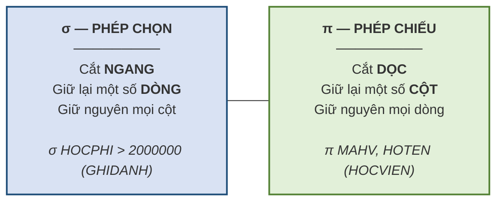
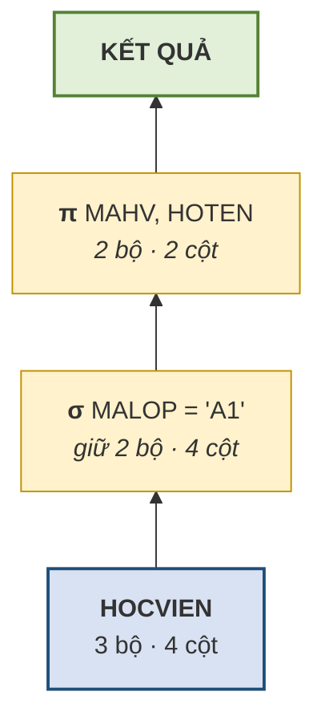

# 3.5. Đại số quan hệ — phép chọn và phép chiếu

*(1,0 tiết)*

## 3.5.1. Đại số quan hệ và tính đóng kín

Có cấu trúc rồi thì phải có cách lấy dữ liệu ra. Codd cung cấp công cụ ấy dưới dạng một hệ thống phép toán.

!!! note "Định nghĩa 3.7"

    **Đại số quan hệ** *(relational algebra)* là tập các phép toán **nhận đầu vào là một hoặc hai quan hệ và cho kết quả cũng là một quan hệ**.

Tính chất in đậm trong định nghĩa có tên riêng: **tính đóng kín** *(closure)*. Đây là đặc điểm quan trọng nhất của đại số quan hệ, và cũng là điều làm nên sức mạnh của nó.

Vì kết quả của một phép toán lại là một quan hệ, ta có thể **dùng kết quả ấy làm đầu vào cho phép toán tiếp theo**, và cứ thế ghép nối thành biểu thức phức tạp tùy ý. Giống như trong số học, vì tổng của hai số lại là một số nên ta viết được `(3 + 5) × 2 − 4`.

Tám phép toán chia làm hai nhóm:

- **Nhóm phép toán tập hợp** — kế thừa nguyên từ lý thuyết tập hợp: **hợp `∪`** *(đọc: "hợp")*, **giao `∩`** *("giao")*, **hiệu `−`** *("trừ")*, **tích Descartes `×`** *("nhân")*.
- **Nhóm phép toán quan hệ** — sinh ra riêng cho mô hình quan hệ: **chọn `σ`** *(chữ Hy Lạp sigma, đọc "xích-ma")*, **chiếu `π`** *(chữ pi, đọc "pi")*, **kết `⋈`** *(đọc "kết"; hình cái nơ)*, **chia `÷`** *("chia")*.

Trong các công thức, giáo trình dùng thêm hai ký hiệu: `t ∈ R` đọc là *"bộ `t` thuộc quan hệ `R`"*, và `⊥` đọc là *"rỗng"* *(null)*. Mọi công thức đều được kèm một câu đọc thành lời, người học không cần nhớ ký hiệu trước khi hiểu ý.

## 3.5.2. Phép chọn và phép chiếu

Hai phép toán này là cặp cơ bản nhất, và cách nhớ chúng cũng rất trực quan.

!!! note "Định nghĩa 3.8"

    **Phép chọn** *(selection)*, ký hiệu **`σ`** *(sigma)*, lấy ra **các bộ thỏa mãn một điều kiện**. Viết là `σ_<điều kiện>(R)`.

    **Phép chiếu** *(projection)*, ký hiệu **`π`** *(pi)*, lấy ra **một số thuộc tính** của mọi bộ. Viết là `π_<danh sách thuộc tính>(R)`.

!!! abstract "Công thức"

    `σ_P(R) = { t ∈ R | P(t) đúng }` — *"tập các bộ `t` của `R` sao cho điều kiện `P` đúng tại `t`"*. Kết quả có **cùng bậc** với `R`, lực lượng **≤** lực lượng của `R`.

    `π_X(R) = { t[X] | t ∈ R }` — *"tập các giá trị của mọi bộ `t` của `R` khi chỉ nhìn vào các cột trong `X`"*. Kết quả có **bậc bằng số cột trong `X`**, lực lượng **≤** lực lượng của `R` *(vì là tập hợp nên bộ trùng bị gộp)*.

**Hình 3.8. Phép chọn cắt ngang, phép chiếu cắt dọc**

!!! example "Ví dụ 3.8"

    Cho bảng `HOCVIEN`:

    | MAHV | HOTEN | NGAYSINH | MALOP |
    |---|---|---|---|
    | HV01 | Trần An | 2005-04-12 | A1 |
    | HV02 | Lê Bình | 2004-09-30 | A1 |
    | HV03 | Phạm Cường | 2006-01-15 | A2 |

    **Phép chọn** `σ_MALOP='A1'(HOCVIEN)` — *"những học viên thuộc lớp A1"* — cho kết quả **hai dòng đầu, đủ bốn cột**:

    | MAHV | HOTEN | NGAYSINH | MALOP |
    |---|---|---|---|
    | HV01 | Trần An | 2005-04-12 | A1 |
    | HV02 | Lê Bình | 2004-09-30 | A1 |

    **Phép chiếu** `π_MAHV,HOTEN(HOCVIEN)` — *"chỉ lấy mã và họ tên"* — cho kết quả **ba dòng, chỉ hai cột**:

    | MAHV | HOTEN |
    |---|---|
    | HV01 | Trần An |
    | HV02 | Lê Bình |
    | HV03 | Phạm Cường |

    **Phép chiếu lên một cột có giá trị lặp** `π_MALOP(HOCVIEN)` cho kết quả chỉ **hai dòng**, không phải ba:

    | MALOP |
    |---|
    | A1 |
    | A2 |

!!! warning "Chú ý — một đặc điểm hay bị quên của phép chiếu"

    Kết quả của phép chiếu là một **quan hệ**, mà quan hệ là một tập hợp nên **không chứa phần tử trùng lặp**. Do đó phép chiếu **tự động loại bỏ các dòng trùng nhau**. Chiếu bảng `HOCVIEN` lên riêng cột `MALOP` cho kết quả chỉ **hai dòng** — `A1` và `A2` — chứ không phải ba. Đây là điểm khác biệt so với câu lệnh `SELECT` của SQL, vốn giữ lại dòng trùng trừ khi được yêu cầu ngược lại.

## 3.5.3. Kết hợp phép chọn và phép chiếu

Nhờ tính đóng kín, hai phép toán trên ghép được với nhau.

!!! example "Ví dụ 3.9"

    Yêu cầu: *"Cho biết mã và họ tên các học viên thuộc lớp A1."*

    `π_MAHV,HOTEN( σ_MALOP='A1'(HOCVIEN) )`

    Đọc từ trong ra ngoài: trước hết **chọn** các dòng của lớp A1, sau đó **chiếu** kết quả ấy lên hai cột cần lấy.

    Kết quả trung gian sau phép chọn *(hai dòng, bốn cột)* rồi kết quả cuối sau phép chiếu *(hai dòng, hai cột)*:

    | MAHV | HOTEN | NGAYSINH | MALOP |
    |---|---|---|---|
    | HV01 | Trần An | 2005-04-12 | A1 |
    | HV02 | Lê Bình | 2004-09-30 | A1 |

    | MAHV | HOTEN |
    |---|---|
    | HV01 | Trần An |
    | HV02 | Lê Bình |

Một biểu thức lồng nhau đọc dễ nhất khi vẽ thành **cây**: lá là bảng gốc, mỗi nút là một phép toán, và ta tính **từ lá lên ngọn**. Cách vẽ này sẽ còn dùng cho các biểu thức dài hơn ở mục 3.7 và 3.8.

**Hình 3.9. Cây biểu thức của Ví dụ 3.9 — tính từ lá lên ngọn**

Thứ tự thực hiện có ảnh hưởng tới hiệu quả. Nên **chọn trước, chiếu sau**: lọc bỏ bớt dòng rồi mới cắt cột thì khối lượng dữ liệu phải xử lý ở bước sau nhỏ hơn. Nếu làm ngược lại — chiếu trước lên hai cột `MAHV`, `HOTEN` — thì kết quả trung gian là bảng hai cột ở Ví dụ 3.8: cột `MALOP` đã bị bỏ đi, và **không còn cách nào lọc theo lớp nữa** — phép chọn `σ_MALOP='A1'` áp lên một bảng không có cột `MALOP` là vô nghĩa. Trong trường hợp này, làm ngược thứ tự không chỉ chậm hơn mà là **sai**.

---

---

[← Trang trước](3-4-bon-quy-tac-anh-xa-er-sang-mo-hinh-quan-he.md) · [Trang sau →](3-6-cac-phep-toan-tap-hop.md)
