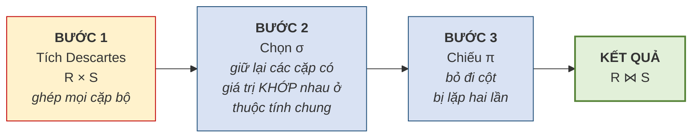
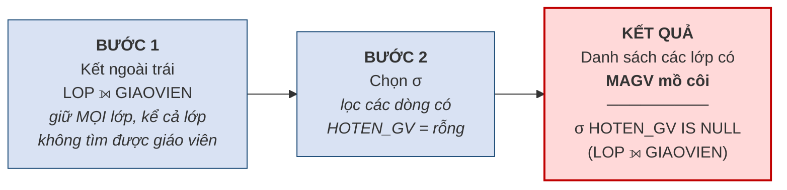
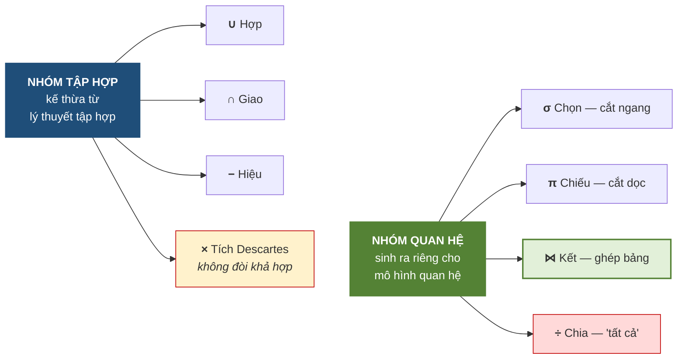

# 3.7. Phép kết và phép chia

*(1,0 tiết)*

## 3.7.1. Phép kết tự nhiên — thực chất là ba bước

Phép kết là phép toán **được dùng nhiều nhất** trong thực tế, vì nó chính là công cụ để ghép các bảng đã tách ở bước thiết kế trở lại thành thông tin có nghĩa.

!!! note "Định nghĩa 3.12"

    **Phép kết tự nhiên** *(natural join)* `R ⋈ S` ghép hai quan hệ dựa trên **các thuộc tính cùng tên**, chỉ giữ lại những cặp bộ có **giá trị khớp nhau** ở các thuộc tính ấy, và **loại bỏ cột trùng lặp** trong kết quả.

Định nghĩa trên nghe gọn nhưng che giấu ba thao tác. Vén màn ra, phép kết tự nhiên thực chất là:

**Hình 3.7. Phép kết tự nhiên thực chất là ba bước**

Hiểu được ba bước này giải thích được nhiều điều. Thứ nhất, nó cho thấy **phép kết không phải phép toán nguyên thủy** — nó diễn đạt được bằng ba phép đã học. Thứ hai, nó giải thích vì sao quên điều kiện kết lại sinh ra tích Descartes: bỏ Bước 2 thì chỉ còn Bước 1. Thứ ba, nó cho thấy vì sao phép kết **tốn kém về hiệu năng**, và vì sao hệ quản trị phải dùng chỉ mục để tối ưu.

!!! example "Ví dụ 3.13"

    Kết `LOP ⋈ GIAOVIEN` trên thuộc tính chung `MAGV`:

    `LOP`

    | MALOP | TENLOP | MAGV |
    |---|---|---|
    | A1 | Anh cơ bản 1 | GV1 |
    | A2 | Anh giao tiếp | GV2 |

    `GIAOVIEN`

    | MAGV | HOTEN_GV |
    |---|---|
    | GV1 | Lê Hoa |
    | GV2 | Trần Mai |

    Kết quả `LOP ⋈ GIAOVIEN`:

    | MALOP | TENLOP | MAGV | HOTEN_GV |
    |---|---|---|---|
    | A1 | Anh cơ bản 1 | GV1 | Lê Hoa |
    | A2 | Anh giao tiếp | GV2 | Trần Mai |

    Cột `MAGV` chỉ xuất hiện **một lần** trong kết quả — đó là tác dụng của Bước 3.

## 3.7.2. Các biến thể của phép kết

**Bảng 3.8. Các biến thể của phép kết**

| Biến thể | Ký hiệu | Đặc điểm |
|---|:--:|---|
| **Kết tự nhiên** *(natural join)* | `⋈` | Ghép theo thuộc tính **cùng tên**, tự động bỏ cột trùng |
| **Kết bằng** *(equijoin)* | `⋈_θ` | Ghép theo điều kiện **bằng** do người dùng chỉ định; **giữ cả hai cột** |
| **Kết theta** *(theta join)* | `⋈_θ` | Điều kiện có thể là `>`, `<`, `≠`… chứ không chỉ `=` |
| **Kết trong** *(inner join)* | `⋈` | Tên gọi chung cho các phép trên — **chỉ giữ bộ khớp** |
| **Kết ngoài trái** *(left outer join)* | `⟕` | Giữ **mọi bộ của bảng trái**; bên phải không khớp thì điền **rỗng** |
| **Kết ngoài phải** *(right outer join)* | `⟖` | Giữ **mọi bộ của bảng phải** |
| **Kết ngoài đầy đủ** *(full outer join)* | `⟗` | Giữ **mọi bộ của cả hai bảng** |

Khác biệt cốt lõi giữa **kết trong** và **kết ngoài** nằm ở cách xử lý các bộ **không tìm được bạn khớp**. Kết trong **vứt bỏ** chúng; kết ngoài **giữ lại** và điền giá trị rỗng vào phần thiếu.

Sự khác biệt này có hệ quả nghiệp vụ rất thực tế. Câu hỏi *"liệt kê các lớp cùng tên giáo viên phụ trách"* dùng kết trong sẽ **bỏ sót những lớp chưa phân giáo viên**. Nếu người quản lý dùng kết quả ấy để đếm số lớp đang mở, con số sẽ thiếu — và thiếu **trong im lặng**, đúng kiểu lỗi nguy hiểm đã bàn ở Chương 1.

## 3.7.3. Dùng kết ngoài để dò lỗi toàn vẹn tham chiếu

Đây là một kỹ thuật rất thực dụng, và cũng là chỗ đại số quan hệ trở thành công cụ **kiểm tra chất lượng dữ liệu** chứ không chỉ để truy vấn [3, Ch.3].

**Vấn đề đặt ra.** Mục 3.3.2 đã nêu ràng buộc toàn vẹn tham chiếu. Nhưng ràng buộc ấy chỉ có tác dụng **nếu đã được khai báo** với hệ quản trị. Trong thực tế người ta thường xuyên gặp những cơ sở dữ liệu cũ mà ràng buộc chưa được khai báo, hoặc dữ liệu được nạp hàng loạt từ hệ thống khác bằng con đường vòng qua kiểm tra. Khi ấy có thể tồn tại các **khóa ngoại mồ côi** — trỏ tới thứ không có thật.

Câu hỏi là: **làm sao tìm ra chúng?**

**Hình 3.8. Dùng kết ngoài trái để phát hiện khóa ngoại mồ côi**

**Nguyên lý hoạt động.** Kết ngoài trái giữ lại **mọi** dòng của bảng `LOP`. Với những lớp có `MAGV` hợp lệ, các cột lấy từ `GIAOVIEN` sẽ có giá trị. Với những lớp có `MAGV` mồ côi, **không tìm được bộ khớp** nên các cột ấy bị điền **rỗng**. Vậy chỉ cần lọc lấy các dòng có cột bên phải rỗng là ra danh sách lỗi.

!!! example "Ví dụ 3.14"

    Giả sử bảng `LOP` có dòng `(A5, 'Anh thương mại', 'GV99')` trong khi `GIAOVIEN` không có `GV99`.

    `LOP ⟕ GIAOVIEN` cho kết quả:

    | MALOP | TENLOP | MAGV | HOTEN_GV |
    |---|---|---|---|
    | A1 | Anh cơ bản 1 | GV1 | Lê Hoa |
    | A2 | Anh giao tiếp | GV2 | Trần Mai |
    | **A5** | **Anh thương mại** | **GV99** | *(rỗng)* |

    Áp thêm phép chọn `σ_HOTEN_GV rỗng` ta được đúng **dòng A5** — chính là lỗi cần tìm.

    **Chú ý — một cạm bẫy khi dùng kỹ thuật này.** Phải phân biệt hai nguyên nhân khiến cột bên phải bị rỗng. Nguyên nhân thứ nhất là **mồ côi thật** — `MAGV` có giá trị nhưng giá trị ấy không tồn tại. Nguyên nhân thứ hai là **khóa ngoại vốn rỗng** — lớp chưa phân giáo viên, và điều này có thể hoàn toàn hợp lệ. Muốn tách bạch, phải thêm điều kiện *"`MAGV` khác rỗng"* vào phép chọn. Bỏ qua chi tiết này sẽ báo nhầm hàng loạt dòng hợp lệ thành lỗi.

Kỹ thuật này nối thẳng sang Chương 4. Ở đó, việc **phát hiện** lỗi sẽ được nâng lên thành việc **ngăn chặn** lỗi bằng cách khai báo ràng buộc ngay từ đầu.

## 3.7.4. Phép chia

Phép chia là phép toán khó nhất trong tám phép, nhưng nó trả lời được một loại câu hỏi mà các phép khác không diễn đạt trực tiếp được: câu hỏi có chữ **"tất cả"**.

!!! note "Định nghĩa 3.13"

    Cho quan hệ `R(A, B)` và quan hệ `S(B)`. **Phép chia** `R ÷ S` cho kết quả là tập các giá trị `a` sao cho **với mọi** `b` thuộc `S`, cặp `(a, b)` đều có mặt trong `R`.

Cách đọc thực dụng: **`R ÷ S` tìm những `a` liên quan tới TẤT CẢ các `b` trong `S`.**

!!! example "Ví dụ 3.15"

    Yêu cầu: *"Cho biết những học viên đã ghi danh **tất cả** các lớp bắt buộc."*

    Cho `GHIDANH(MAHV, MALOP)` và `LOP_BATBUOC(MALOP)`:

    `GHIDANH`

    | MAHV | MALOP |
    |---|---|
    | HV01 | A1 |
    | HV01 | A2 |
    | HV02 | A1 |
    | HV03 | A1 |
    | HV03 | A2 |
    | HV03 | A3 |

    `LOP_BATBUOC` = { A1, A2 }

    Kết quả `GHIDANH ÷ LOP_BATBUOC` = **{ HV01, HV03 }**.

    Giải thích: HV01 có cả A1 và A2 nên đạt. HV03 có A1, A2 và thêm A3 — **thừa không sao**, vẫn đạt. HV02 chỉ có A1, **thiếu A2** nên loại.

**Cách tính từng bước.** Phép chia không phải phép toán nguyên thủy; nó diễn đạt được bằng các phép đã học, và việc lần theo cách diễn đạt ấy giúp hiểu bản chất phép toán.

| Bước | Biểu thức | Ý nghĩa | Kết quả với ví dụ trên |
|:--:|---|---|---|
| 1 | `T1 = π_MAHV(GHIDANH)` | Mọi học viên có ghi danh | {HV01, HV02, HV03} |
| 2 | `T2 = T1 × LOP_BATBUOC` | Mọi cặp **đáng lẽ phải có** nếu ai cũng học đủ | 6 cặp |
| 3 | `T3 = T2 − π_MAHV,MALOP(GHIDANH)` | Các cặp **còn thiếu** | {(HV02, A2)} |
| 4 | `T4 = π_MAHV(T3)` | Học viên **thiếu ít nhất một lớp** | {HV02} |
| 5 | `KQ = T1 − T4` | Học viên **không thiếu lớp nào** | **{HV01, HV03}** |

Lối suy luận ở đây rất đáng chú ý và đáng học riêng: thay vì tìm trực tiếp *"ai học đủ"*, ta đi đường vòng — tìm *"ai còn thiếu"* rồi **loại họ ra**. Đây là kỹ thuật **phủ định hai lần**, xuất hiện rất nhiều trong logic và trong thiết kế truy vấn.

!!! warning "Chú ý"

    Dấu hiệu để nhận ra bài toán cần phép chia là các cụm từ **"tất cả"**, **"mọi"**, **"toàn bộ"** trong câu hỏi nghiệp vụ. *"Học viên học **tất cả** các lớp bắt buộc"*, *"nhà cung cấp cung cấp **mọi** mặt hàng"*, *"sinh viên đã học **toàn bộ** học phần tiên quyết"*. Khi thấy những từ này, phép chia thường là lời giải gọn nhất.

    Trong thực tế, phép chia **ít được dùng trực tiếp** vì SQL không có toán tử tương ứng — người ta phải viết lại theo lối năm bước ở trên. Nhưng hiểu phép chia vẫn cần thiết, vì nó rèn đúng kiểu tư duy mà loại bài toán "tất cả" đòi hỏi.

## 3.7.5. Tổng hợp tám phép toán

**Hình 3.9. Tám phép toán của đại số quan hệ**

**Bảng 3.9. Từ điển dịch yêu cầu bằng lời sang phép toán**

| Câu hỏi nghiệp vụ chứa cụm… | Phép toán tương ứng |
|---|---|
| *"những … thỏa mãn điều kiện …"* | Chọn `σ` |
| *"chỉ cho biết cột … "*, *"danh sách tên …"* | Chiếu `π` |
| *"cả A và B"*, *"vừa … vừa …"* | Giao `∩` |
| *"A hoặc B"*, *"gộp danh sách"* | Hợp `∪` |
| *"chỉ có ở A"*, *"trừ những …"*, *"chưa từng …"* | Hiệu `−` |
| *"kèm theo thông tin từ bảng khác"* | Kết `⋈` |
| *"kể cả những … chưa có …"* | Kết ngoài `⟕` |
| *"tất cả"*, *"mọi"*, *"toàn bộ"* | Chia `÷` |

Bảng trên là công cụ thực dụng nhất của cả mục 3.5–3.7: khi gặp một yêu cầu bằng lời, người học **dò từ khóa** để tìm phép toán, rồi mới ghép biểu thức.

---

---

[← Trang trước](3-6-cac-phep-toan-tap-hop.md) · [Trang sau →](3-8-vi-du-tong-hop-trung-tam-anh-ngu-abc.md)
