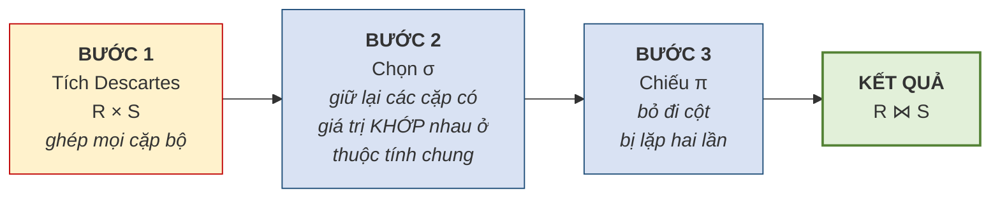
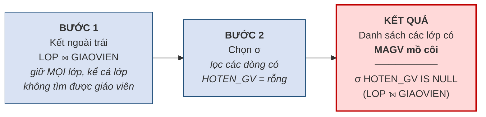
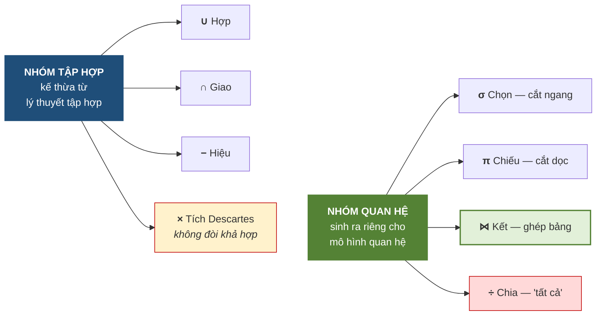

# 3.7. Phép kết và phép chia

*(1,0 tiết)*

## 3.7.1. Phép kết tự nhiên — thực chất là ba bước

Phép kết là phép toán **được dùng nhiều nhất** trong thực tế, vì nó chính là công cụ để ghép các bảng đã tách ở bước thiết kế trở lại thành thông tin có nghĩa.

!!! note "Định nghĩa 3.12"

    **Phép kết tự nhiên** *(natural join)* `R ⋈ S` ghép hai quan hệ dựa trên **các thuộc tính cùng tên**, chỉ giữ lại những cặp bộ có **giá trị khớp nhau** ở các thuộc tính ấy, và **loại bỏ cột trùng lặp** trong kết quả.

Định nghĩa trên nghe gọn nhưng che giấu ba thao tác. Vén màn ra, phép kết tự nhiên thực chất là:

**Hình 3.10. Phép kết tự nhiên thực chất là ba bước**

!!! abstract "Công thức"

    Với `A` là thuộc tính chung của `R` và `S`:

    `R ⋈ S = π_<mọi cột, bỏ S.A>( σ_<R.A = S.A>( R × S ) )`

    Đọc từ trong ra ngoài: *"nhân hai bảng, giữ lại các dòng có hai cột chung bằng nhau, rồi bỏ bản sao thừa của cột chung"*. Ba phép ở vế phải chính là ba bước của Hình 3.10.

Hiểu được ba bước này giải thích được nhiều điều. Thứ nhất, nó cho thấy **phép kết không phải phép toán nguyên thủy** — nó diễn đạt được bằng ba phép đã học. Thứ hai, nó giải thích vì sao quên điều kiện kết lại sinh ra tích Descartes: bỏ Bước 2 thì chỉ còn Bước 1. Thứ ba, nó cho thấy vì sao phép kết **tốn kém về hiệu năng**, và vì sao hệ quản trị phải dùng chỉ mục để tối ưu.

!!! example "Ví dụ 3.13"

    Kết `LOP ⋈ GIAOVIEN` trên thuộc tính chung `MAGV`, với đúng hai bảng đầu vào của Bảng 3.21. Đi qua từng bước:

    **Bước 1 — `LOP × GIAOVIEN`:** chính là bảng kết quả của Bảng 3.21 — 4 bộ, 5 cột, hai cột `MAGV`.

    **Bước 2 — `σ_LOP.MAGV = GIAOVIEN.MAGV`:** giữ lại hai dòng có hai cột `MAGV` bằng nhau *(dòng 1 và 4)*, loại hai dòng ghép cơ học:

    | MALOP | TENLOP | LOP.MAGV | GIAOVIEN.MAGV | HOTEN_GV |
    |---|---|---|---|---|
    | A1 | Anh cơ bản 1 | GV1 | GV1 | Lê Hoa |
    | A2 | Anh giao tiếp | GV2 | GV2 | Trần Mai |

    **Bước 3 — `π` bỏ cột `GIAOVIEN.MAGV`** *(nó luôn bằng `LOP.MAGV` nên thừa)*. Kết quả `LOP ⋈ GIAOVIEN`:

    | MALOP | TENLOP | MAGV | HOTEN_GV |
    |---|---|---|---|
    | A1 | Anh cơ bản 1 | GV1 | Lê Hoa |
    | A2 | Anh giao tiếp | GV2 | Trần Mai |

    Cột `MAGV` chỉ xuất hiện **một lần** trong kết quả — đó là tác dụng của Bước 3. Đặt ba bảng của ba bước cạnh nhau, người học thấy rõ phép kết đã "gọt" tích Descartes như thế nào: **từ 4 bộ 5 cột xuống 2 bộ 4 cột**.

## 3.7.2. Các biến thể của phép kết

**Bảng 3.22. Các biến thể của phép kết**

| Biến thể | Ký hiệu | Đặc điểm |
|---|:--:|---|
| **Kết tự nhiên** *(natural join)* | `⋈` | Ghép theo thuộc tính **cùng tên**, tự động bỏ cột trùng |
| **Kết bằng** *(equijoin)* | `⋈_A=B` | Ghép theo điều kiện **bằng** do người dùng chỉ định; **giữ cả hai cột** |
| **Kết theta** *(theta join)* | `⋈_θ` | Điều kiện có thể là `>`, `<`, `≠`… chứ không chỉ `=` |
| **Kết trong** *(inner join)* | `⋈` | Tên gọi chung cho các phép trên — **chỉ giữ bộ khớp** |
| **Kết ngoài trái** *(left outer join)* | `⟕` | Giữ **mọi bộ của bảng trái**; bên phải không khớp thì điền **rỗng** |
| **Kết ngoài phải** *(right outer join)* | `⟖` | Giữ **mọi bộ của bảng phải** |
| **Kết ngoài đầy đủ** *(full outer join)* | `⟗` | Giữ **mọi bộ của cả hai bảng** |

{width=55%}

*Ảnh minh họa: sổ điểm danh. Người vắng vẫn có dòng, chỉ để trống ô chữ ký — danh sách không mất ai. Kết ngoài giữ bộ không khớp và điền rỗng đúng như sổ điểm danh; kết trong thì bỏ hẳn — Nguồn: Wikimedia Commons · KeMang · CC0.*

Khác biệt cốt lõi giữa **kết trong** và **kết ngoài** nằm ở cách xử lý các bộ **không tìm được bạn khớp**. Kết trong **vứt bỏ** chúng; kết ngoài **giữ lại** và điền giá trị rỗng vào phần thiếu.

Sự khác biệt này có hệ quả nghiệp vụ rất thực tế. Câu hỏi *"liệt kê các lớp cùng tên giáo viên phụ trách"* dùng kết trong sẽ **bỏ sót những lớp chưa phân giáo viên**. Nếu người quản lý dùng kết quả ấy để đếm số lớp đang mở, con số sẽ thiếu — và thiếu **trong im lặng**, đúng kiểu lỗi nguy hiểm đã bàn ở Chương 1.

Để thấy bốn biến thể khác nhau ở đâu, cần một bộ dữ liệu có **một bộ "mồ côi" ở mỗi bên**: lớp `A6` chưa phân giáo viên, và thầy `GV3` chưa được phân lớp.

**Bảng 3.23. Kết trong và ba kết ngoài trên cùng một cặp bảng có bộ không khớp ở cả hai phía**

*Đầu vào:*

| `LOP` | MALOP | TENLOP | MAGV |
|---|---|---|---|
| | A1 | Anh cơ bản 1 | GV1 |
| | A2 | Anh giao tiếp | GV2 |
| | A6 | Anh thiếu nhi | *(rỗng)* |

| `GIAOVIEN` | MAGV | HOTEN_GV |
|---|---|---|
| | GV1 | Lê Hoa |
| | GV2 | Trần Mai |
| | GV3 | Phạm Nam |

*Kết trong `LOP ⋈ GIAOVIEN` — chỉ bộ khớp, 2 dòng; A6 và GV3 **biến mất**:*

| MALOP | TENLOP | MAGV | HOTEN_GV |
|---|---|---|---|
| A1 | Anh cơ bản 1 | GV1 | Lê Hoa |
| A2 | Anh giao tiếp | GV2 | Trần Mai |

*Kết ngoài trái `LOP ⟕ GIAOVIEN` — giữ mọi lớp, 3 dòng; A6 được điền rỗng bên phải:*

| MALOP | TENLOP | MAGV | HOTEN_GV |
|---|---|---|---|
| A1 | Anh cơ bản 1 | GV1 | Lê Hoa |
| A2 | Anh giao tiếp | GV2 | Trần Mai |
| A6 | Anh thiếu nhi | *(rỗng)* | *(rỗng)* |

*Kết ngoài phải `LOP ⟖ GIAOVIEN` — giữ mọi giáo viên, 3 dòng; GV3 được điền rỗng bên trái:*

| MALOP | TENLOP | MAGV | HOTEN_GV |
|---|---|---|---|
| A1 | Anh cơ bản 1 | GV1 | Lê Hoa |
| A2 | Anh giao tiếp | GV2 | Trần Mai |
| *(rỗng)* | *(rỗng)* | GV3 | Phạm Nam |

*Kết ngoài đầy đủ `LOP ⟗ GIAOVIEN` — giữ mọi bộ của cả hai bên, 4 dòng:*

| MALOP | TENLOP | MAGV | HOTEN_GV |
|---|---|---|---|
| A1 | Anh cơ bản 1 | GV1 | Lê Hoa |
| A2 | Anh giao tiếp | GV2 | Trần Mai |
| A6 | Anh thiếu nhi | *(rỗng)* | *(rỗng)* |
| *(rỗng)* | *(rỗng)* | GV3 | Phạm Nam |

Quy tắc đếm rất dễ nhớ: kết trong cho **2** dòng; kết ngoài trái thêm **1** lớp mồ côi thành 3; kết ngoài phải thêm **1** giáo viên mồ côi thành 3; kết ngoài đầy đủ thêm cả hai thành **4**. Chữ "trái/phải" chỉ **bên nào được giữ trọn vẹn**, và bên đó là bên viết trước hay sau dấu kết.

## 3.7.3. Dùng kết ngoài để dò lỗi toàn vẹn tham chiếu

Đây là một kỹ thuật rất thực dụng, và cũng là chỗ đại số quan hệ trở thành công cụ **kiểm tra chất lượng dữ liệu** chứ không chỉ để truy vấn [3, Ch.3].

**Vấn đề đặt ra.** Mục 3.3.2 đã nêu ràng buộc toàn vẹn tham chiếu. Nhưng ràng buộc ấy chỉ có tác dụng **nếu đã được khai báo** với hệ quản trị. Trong thực tế người ta thường xuyên gặp những cơ sở dữ liệu cũ mà ràng buộc chưa được khai báo, hoặc dữ liệu được nạp hàng loạt từ hệ thống khác bằng con đường vòng qua kiểm tra. Khi ấy có thể tồn tại các **khóa ngoại mồ côi** — trỏ tới thứ không có thật.

Câu hỏi là: **làm sao tìm ra chúng?**

**Hình 3.11. Dùng kết ngoài trái để phát hiện khóa ngoại mồ côi**

**Nguyên lý hoạt động.** Kết ngoài trái giữ lại **mọi** dòng của bảng `LOP`. Với những lớp có `MAGV` hợp lệ, các cột lấy từ `GIAOVIEN` sẽ có giá trị. Với những lớp có `MAGV` mồ côi, **không tìm được bộ khớp** nên các cột ấy bị điền **rỗng**. Vậy chỉ cần lọc lấy các dòng có cột bên phải rỗng là ra danh sách lỗi.

!!! example "Ví dụ 3.14"

    Giả sử bảng `LOP` có thêm dòng `(A5, 'Anh thương mại', 'GV99')` trong khi `GIAOVIEN` không có `GV99`, và vẫn có lớp `A6` chưa phân giáo viên như ở Bảng 3.23.

    `LOP ⟕ GIAOVIEN` cho kết quả:

    | MALOP | TENLOP | MAGV | HOTEN_GV | Vì sao bên phải rỗng? |
    |---|---|---|---|---|
    | A1 | Anh cơ bản 1 | GV1 | Lê Hoa | — |
    | A2 | Anh giao tiếp | GV2 | Trần Mai | — |
    | **A5** | **Anh thương mại** | **GV99** | *(rỗng)* | `GV99` **không tồn tại** → **mồ côi thật** |
    | A6 | Anh thiếu nhi | *(rỗng)* | *(rỗng)* | `MAGV` **vốn rỗng** → lớp chưa phân giáo viên, **hợp lệ** |

    Áp phép chọn `σ_HOTEN_GV = ⊥` ta được **cả A5 lẫn A6** — mà chỉ A5 là lỗi. Biểu thức đúng phải loại A6 ra:

    `σ_HOTEN_GV = ⊥ ∧ MAGV ≠ ⊥ ( LOP ⟕ GIAOVIEN )`

    đọc là *"những dòng mà bên phải rỗng **nhưng** khóa ngoại bên trái không rỗng"*. Kết quả chỉ còn **dòng A5** — chính là lỗi cần tìm.

!!! warning "Chú ý — một cạm bẫy khi dùng kỹ thuật này"

    Phải phân biệt hai nguyên nhân khiến cột bên phải bị rỗng, như cột cuối của bảng trong Ví dụ 3.14 đã chỉ ra. Nguyên nhân thứ nhất là **mồ côi thật** — `MAGV` có giá trị nhưng giá trị ấy không tồn tại. Nguyên nhân thứ hai là **khóa ngoại vốn rỗng** — lớp chưa phân giáo viên, và điều này có thể hoàn toàn hợp lệ. Muốn tách bạch, phải thêm điều kiện *"`MAGV` khác rỗng"* vào phép chọn. Bỏ qua chi tiết này sẽ báo nhầm hàng loạt dòng hợp lệ thành lỗi.

Kỹ thuật này nối thẳng sang Chương 4. Ở đó, việc **phát hiện** lỗi sẽ được nâng lên thành việc **ngăn chặn** lỗi bằng cách khai báo ràng buộc ngay từ đầu.

## 3.7.4. Phép chia

{width=60%}

*Ảnh minh họa: một bảng điểm cuối khóa. Muốn tốt nghiệp phải đạt *tất cả* môn bắt buộc: thừa môn tự chọn không sao, thiếu một môn bắt buộc là loại — đúng cấu trúc câu hỏi mà phép chia trả lời — Nguồn: Wikimedia Commons · Columbus Public Schools · Public domain.*

Phép chia là phép toán khó nhất trong tám phép, nhưng nó trả lời được một loại câu hỏi mà các phép khác không diễn đạt trực tiếp được: câu hỏi có chữ **"tất cả"**.

!!! note "Định nghĩa 3.13"

    Cho quan hệ `R(A, B)` và quan hệ `S(B)`. **Phép chia** `R ÷ S` cho kết quả là tập các giá trị `a` sao cho **với mọi** `b` thuộc `S`, cặp `(a, b)` đều có mặt trong `R`.

Cách đọc thực dụng: **`R ÷ S` tìm những `a` liên quan tới TẤT CẢ các `b` trong `S`.**

!!! example "Ví dụ 3.15"

    Yêu cầu: *"Cho biết những học viên đã ghi danh **tất cả** các lớp bắt buộc."*

    Cho `GHIDANH(MAHV, MALOP)` và `LOP_BATBUOC(MALOP)`:

    `GHIDANH`

    | MAHV | MALOP |
    |---|---|
    | HV01 | A1 |
    | HV01 | A2 |
    | HV02 | A1 |
    | HV03 | A1 |
    | HV03 | A2 |
    | HV03 | A3 |

    `LOP_BATBUOC` = { A1, A2 }

    Kết quả `GHIDANH ÷ LOP_BATBUOC` = **{ HV01, HV03 }**.

    Giải thích: HV01 có cả A1 và A2 nên đạt. HV03 có A1, A2 và thêm A3 — **thừa không sao**, vẫn đạt. HV02 chỉ có A1, **thiếu A2** nên loại.

Cách nhìn trực quan nhất của phép chia là **xếp `GHIDANH` thành một ma trận**: mỗi dòng một học viên, mỗi cột một lớp, đánh dấu ✓ nếu học viên đã ghi danh lớp ấy. Khi đó `R ÷ S` chỉ là câu hỏi: *"dòng nào có ✓ ở **tất cả** các cột thuộc `S`?"*

**Bảng 3.24. `GHIDANH` xếp thành ma trận học viên × lớp — phép chia là "đủ ✓ ở các cột bắt buộc"**

| | A1 *(bắt buộc)* | A2 *(bắt buộc)* | A3 | Đủ ✓ ở hai cột bắt buộc? |
|---|:--:|:--:|:--:|---|
| HV01 | ✓ | ✓ | | **Đạt** |
| HV02 | ✓ | | | Thiếu A2 → loại |
| HV03 | ✓ | ✓ | ✓ | **Đạt** *(A3 thừa, không ảnh hưởng)* |

!!! abstract "Công thức"

    Với `R(A, B)` và `S(B)`:

    `R ÷ S = π_A(R) − π_A( ( π_A(R) × S ) − R )`

    Đọc: *"lấy mọi `a` có mặt trong `R`, **trừ đi** những `a` mà khi ghép với một `b` nào đó của `S` lại cho ra cặp **không có** trong `R`"*. Bảng năm bước dưới đây chính là công thức này tính từ trong ra ngoài.

**Cách tính từng bước.** Phép chia không phải phép toán nguyên thủy; nó diễn đạt được bằng các phép đã học, và việc lần theo cách diễn đạt ấy giúp hiểu bản chất phép toán.

| Bước | Biểu thức | Ý nghĩa | Kết quả với ví dụ trên |
|:--:|---|---|---|
| 1 | `T1 = π_MAHV(GHIDANH)` | Mọi học viên có ghi danh | {HV01, HV02, HV03} |
| 2 | `T2 = T1 × LOP_BATBUOC` | Mọi cặp **đáng lẽ phải có** nếu ai cũng học đủ | 6 cặp |
| 3 | `T3 = T2 − π_MAHV,MALOP(GHIDANH)` | Các cặp **còn thiếu** | {(HV02, A2)} |
| 4 | `T4 = π_MAHV(T3)` | Học viên **thiếu ít nhất một lớp** | {HV02} |
| 5 | `KQ = T1 − T4` | Học viên **không thiếu lớp nào** | **{HV01, HV03}** |

Lối suy luận ở đây rất đáng chú ý và đáng học riêng: thay vì tìm trực tiếp *"ai học đủ"*, ta đi đường vòng — tìm *"ai còn thiếu"* rồi **loại họ ra**. Đây là kỹ thuật **phủ định hai lần**, xuất hiện rất nhiều trong logic và trong thiết kế truy vấn.

!!! warning "Chú ý"

    Dấu hiệu để nhận ra bài toán cần phép chia là các cụm từ **"tất cả"**, **"mọi"**, **"toàn bộ"** trong câu hỏi nghiệp vụ. *"Học viên học **tất cả** các lớp bắt buộc"*, *"nhà cung cấp cung cấp **mọi** mặt hàng"*, *"sinh viên đã học **toàn bộ** học phần tiên quyết"*. Khi thấy những từ này, phép chia thường là lời giải gọn nhất.

    Trong thực tế, phép chia **ít được dùng trực tiếp** vì SQL không có toán tử tương ứng — người ta phải viết lại theo lối năm bước ở trên. Nhưng hiểu phép chia vẫn cần thiết, vì nó rèn đúng kiểu tư duy mà loại bài toán "tất cả" đòi hỏi.

## 3.7.5. Tổng hợp tám phép toán

**Hình 3.12. Tám phép toán của đại số quan hệ**

Bảng dưới đây gom tám phép toán vào **một trang tra cứu** cho người tự học: ký hiệu, cách đọc, công thức và một ví dụ trên lược đồ ABC.

**Bảng 3.25. Bảng tra ký hiệu đại số quan hệ**

| Phép toán | Ký hiệu · cách đọc | Công thức | Ví dụ trên lược đồ ABC | Đọc thành lời |
|---|---|---|---|---|
| Chọn | `σ_P(R)` · "xích-ma" | `{ t ∈ R \| P(t) }` | `σ_MALOP='A1'(HOCVIEN)` | học viên thuộc lớp A1 |
| Chiếu | `π_X(R)` · "pi" | `{ t[X] \| t ∈ R }` | `π_HOTEN(HOCVIEN)` | chỉ lấy họ tên |
| Hợp | `R ∪ S` · "hợp" | `{ t \| t ∈ R hoặc t ∈ S }` | `A ∪ B` | học viên của cả hai cơ sở gộp lại |
| Giao | `R ∩ S` · "giao" | `{ t \| t ∈ R và t ∈ S }` | `A ∩ B` | học viên học ở cả hai cơ sở |
| Hiệu | `R − S` · "trừ" | `{ t \| t ∈ R và t ∉ S }` | `π_MALOP(LOP) − π_MALOP(GHIDANH)` | lớp chưa có ai ghi danh |
| Tích Descartes | `R × S` · "nhân" | `{ (r, s) \| r ∈ R, s ∈ S }` | `LOP × GIAOVIEN` | mọi cặp lớp – giáo viên |
| Kết tự nhiên | `R ⋈ S` · "kết" | `π(σ_R.A=S.A(R × S))` | `LOP ⋈ GIAOVIEN` | lớp kèm tên giáo viên phụ trách |
| Kết ngoài trái | `R ⟕ S` · "kết ngoài trái" | như `⋈`, giữ thêm bộ của `R` không khớp, điền `⊥` | `LOP ⟕ GIAOVIEN` | mọi lớp, kể cả lớp chưa có giáo viên |
| Chia | `R ÷ S` · "chia" | `π_A(R) − π_A((π_A(R) × S) − R)` | `π_MAHV,MALOP(GHIDANH) ÷ LOP_BATBUOC` | học viên đã học **tất cả** lớp bắt buộc |

**Bảng 3.26. Từ điển dịch yêu cầu bằng lời sang phép toán**

| Câu hỏi nghiệp vụ chứa cụm… | Phép toán tương ứng |
|---|---|
| *"những … thỏa mãn điều kiện …"* | Chọn `σ` |
| *"chỉ cho biết cột … "*, *"danh sách tên …"* | Chiếu `π` |
| *"cả A và B"*, *"vừa … vừa …"* | Giao `∩` |
| *"A hoặc B"*, *"gộp danh sách"* | Hợp `∪` |
| *"chỉ có ở A"*, *"trừ những …"*, *"chưa từng …"* | Hiệu `−` |
| *"kèm theo thông tin từ bảng khác"* | Kết `⋈` |
| *"kể cả những … chưa có …"* | Kết ngoài `⟕` |
| *"tất cả"*, *"mọi"*, *"toàn bộ"* | Chia `÷` |

Bảng trên là công cụ thực dụng nhất của cả mục 3.5–3.7: khi gặp một yêu cầu bằng lời, người học **dò từ khóa** để tìm phép toán, rồi mới ghép biểu thức.

!!! question "Tự kiểm tra 3.7"

    *(tự trả lời trước, rồi mở đáp án bên dưới)*

    1. Bỏ bước nào trong ba bước của phép kết tự nhiên thì kết quả trở thành tích Descartes? Bỏ bước nào thì kết quả có hai cột `MAGV`?
    2. Yêu cầu *"liệt kê mọi giáo viên, kể cả người chưa được phân lớp, kèm tên lớp nếu có"* dùng phép nào? Viết biểu thức với hai bảng `LOP`, `GIAOVIEN`.
    3. Yêu cầu *"học viên đã ghi danh mọi lớp của khóa `KH02`"* dùng phép nào? Viết biểu thức.

??? success "Đáp án tự kiểm tra 3.7"

    *(1)* Bỏ Bước 2 *(phép chọn)* thì còn nguyên tích Descartes; bỏ Bước 3 *(phép chiếu)* thì kết quả đúng dòng nhưng còn hai cột `MAGV`. *(2)* Kết ngoài **phải** *(giữ trọn bảng viết sau)*: `LOP ⟖ GIAOVIEN`; hoặc viết `GIAOVIEN ⟕ LOP` — kết ngoài trái với `GIAOVIEN` đứng trước. *(3)* Phép chia: `π_MAHV,MALOP(GHIDANH) ÷ π_MALOP( σ_MAKH='KH02'(LOP) )`.

---

---

[← Trang trước](3-6-cac-phep-toan-tap-hop.md) · [Trang sau →](3-8-vi-du-tong-hop-trung-tam-anh-ngu-abc.md)
