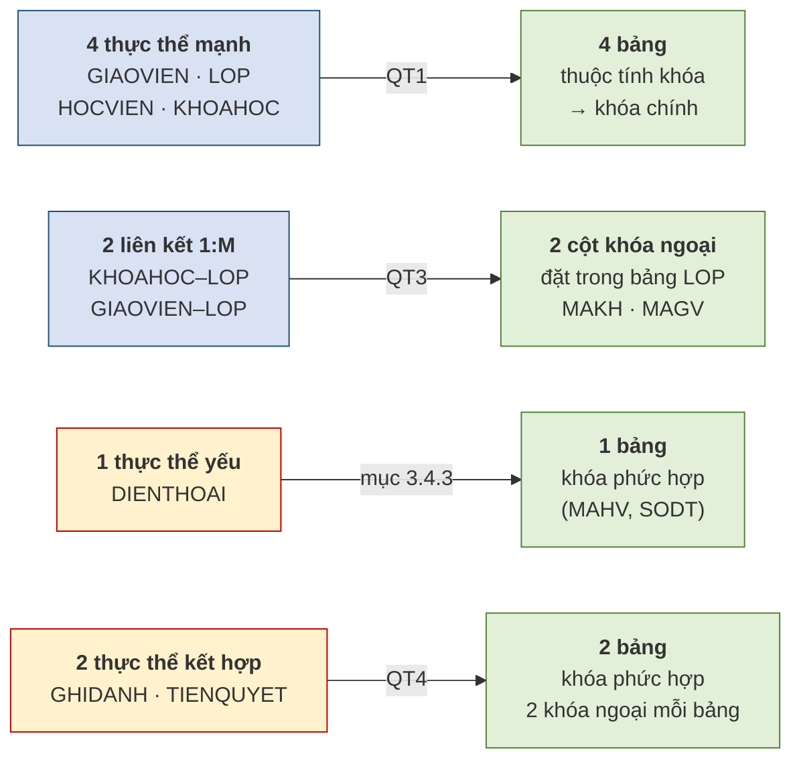
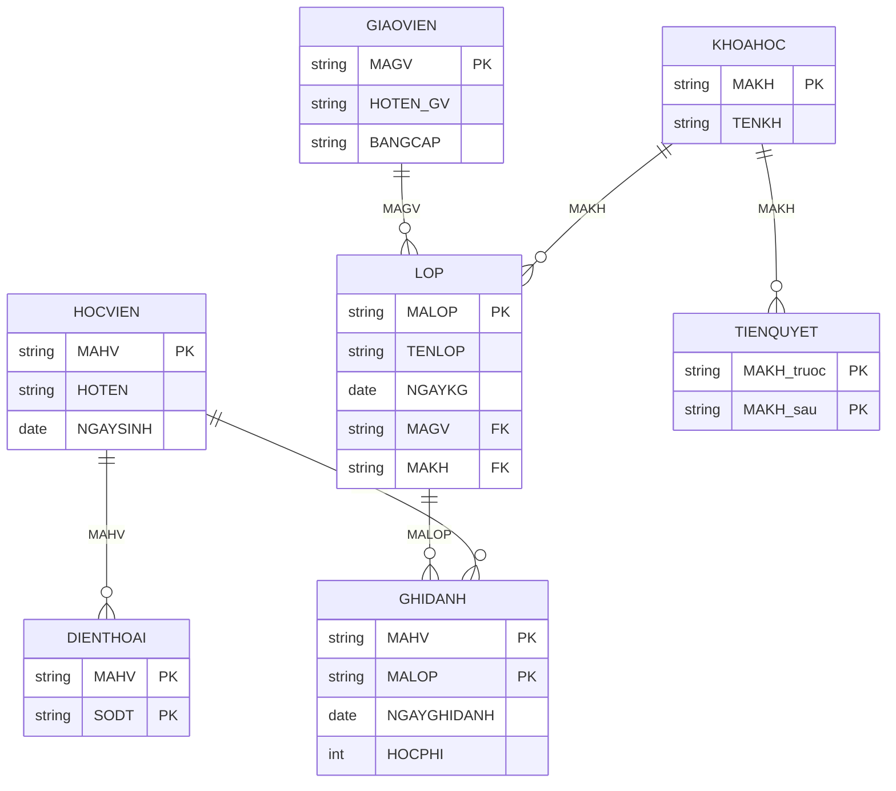

# 3.8. Ví dụ tổng hợp: Trung tâm Anh ngữ ABC

## 3.8.1. Ánh xạ từ lược đồ Chen của Chương 2

Đầu vào là lược đồ ER hoàn chỉnh ở **Hình 2.14** của Chương 2, gồm bảy thực thể. Áp lần lượt các quy tắc ánh xạ.

**Hình 3.10. Ánh xạ lược đồ Chen sang tập quan hệ**

**Bảng 3.10. Ánh xạ từng thành phần**

| Thành phần ER | Quy tắc | Kết quả |
|---|:--:|---|
| `GIAOVIEN` *(mạnh)* | QT1 | `GIAOVIEN(`**`MAGV`**`, HOTEN_GV, BANGCAP)` |
| `KHOAHOC` *(mạnh)* | QT1 | `KHOAHOC(`**`MAKH`**`, TENKH)` |
| `HOCVIEN` *(mạnh)* | QT1 | `HOCVIEN(`**`MAHV`**`, HOTEN, NGAYSINH)` |
| `LOP` *(mạnh)* + 2 liên kết 1:M | QT1 + QT3 | `LOP(`**`MALOP`**`, TENLOP, NGAYKG, MAGV↗, MAKH↗)` |
| `DIENTHOAI` *(yếu)* | mục 3.4.3 | `DIENTHOAI(`**`MAHV↗`**`,` **`SODT`**`)` |
| `GHIDANH` *(kết hợp)* | QT4 | `GHIDANH(`**`MAHV↗`**`,` **`MALOP↗`**`, NGAYGHIDANH, HOCPHI)` |
| `TIENQUYET` *(kết hợp, đệ quy)* | QT4 | `TIENQUYET(`**`MAKH_truoc↗`**`,` **`MAKH_sau↗`**`)` |

*(Ký hiệu **in đậm** = thành phần khóa chính; ↗ = khóa ngoại.)*

## 3.8.2. Lược đồ quan hệ hoàn chỉnh

**Hình 3.11. Lược đồ quan hệ của Trung tâm Anh ngữ ABC — bảy bảng**

## 3.8.3. Kiểm tra toàn vẹn trên lược đồ

Sau khi ánh xạ, phải kiểm tra hai ràng buộc ở mục 3.3 cho từng bảng.

**Bảng 3.11. Đối chiếu toàn vẹn cho bảy bảng**

| Bảng | Khóa chính | Khóa ngoại | Khóa ngoại được rỗng? |
|---|---|---|---|
| `GIAOVIEN` | `MAGV` | — | — |
| `KHOAHOC` | `MAKH` | — | — |
| `HOCVIEN` | `MAHV` | — | — |
| `LOP` | `MALOP` | `MAGV` → `GIAOVIEN` `MAKH` → `KHOAHOC` | **Không** *(quy tắc 3 và 6: mọi lớp phải có giáo viên và thuộc một khóa học)* |
| `DIENTHOAI` | `(MAHV, SODT)` | `MAHV` → `HOCVIEN` | **Không** *(là thành phần khóa chính)* |
| `GHIDANH` | `(MAHV, MALOP)` | `MAHV` → `HOCVIEN` `MALOP` → `LOP` | **Không** *(đều là thành phần khóa chính)* |
| `TIENQUYET` | `(MAKH_truoc, MAKH_sau)` | cả hai → `KHOAHOC` | **Không** |

Có một quy luật đáng rút ra từ bảng trên: **khóa ngoại đồng thời là thành phần khóa chính thì không bao giờ được rỗng** — vì toàn vẹn thực thể đã cấm rồi. Chỉ những khóa ngoại **không** thuộc khóa chính, như `MAGV` trong bảng `LOP`, mới cần xét tới quy tắc nghiệp vụ để quyết định.

## 3.8.4. Sáu truy vấn mẫu bằng đại số quan hệ

**Bảng 3.12. Sáu truy vấn trên lược đồ ABC**

| # | Yêu cầu nghiệp vụ | Biểu thức đại số quan hệ |
|:--:|---|---|
| 1 | Danh sách họ tên học viên sinh sau năm 2005 | `π_HOTEN( σ_NGAYSINH>'2005-12-31'(HOCVIEN) )` |
| 2 | Các lớp do cô Lê Hoa phụ trách | `π_MALOP,TENLOP( σ_HOTEN_GV='Lê Hoa'(LOP ⋈ GIAOVIEN) )` |
| 3 | Học viên và tên các lớp đã ghi danh | `π_HOTEN,TENLOP( HOCVIEN ⋈ GHIDANH ⋈ LOP )` |
| 4 | Các lớp **chưa có** học viên nào ghi danh | `π_MALOP(LOP) − π_MALOP(GHIDANH)` |
| 5 | Liệt kê mọi lớp, **kể cả** lớp chưa phân giáo viên | `LOP ⟕ GIAOVIEN` |
| 6 | Học viên đã ghi danh **tất cả** các lớp của khóa `KH01` | `π_MAHV,MALOP(GHIDANH) ÷ π_MALOP( σ_MAKH='KH01'(LOP) )` |

Ba truy vấn cuối minh họa đúng ba kỹ thuật vừa học. Truy vấn 4 dùng **phép hiệu** để diễn đạt ý *"chưa từng"*. Truy vấn 5 dùng **kết ngoài** để không bỏ sót. Truy vấn 6 dùng **phép chia** cho từ khóa *"tất cả"*.

## 3.8.5. Nhìn lại hành trình ba chương

Đến đây ba chương đầu khép lại thành một mạch hoàn chỉnh trên cùng một bài toán.

**Bảng 3.13. Ba chương, ba mức độ trưởng thành của cùng một thiết kế**

| | Chương 1 | Chương 2 | Chương 3 |
|---|---|---|---|
| **Công cụ** | Trực giác | Mô hình ER | Mô hình quan hệ |
| **Kết quả** | 3 bảng | 7 thực thể | **7 bảng có khóa đầy đủ** |
| **Cơ sở** | *"thấy lặp thì tách"* | Quy tắc nghiệp vụ | Bốn quy tắc ánh xạ |
| **Kiểm chứng được?** | Không | Đối chiếu quy tắc | Hai ràng buộc toàn vẹn |
| **Máy hiểu được?** | Không | Không | **Có** |

Điểm đáng chú ý nhất là dòng cuối cùng. Sau Chương 3, thiết kế lần đầu tiên trở thành thứ **máy tính xử lý được** — không còn là bản vẽ trên giấy.

Nhưng lược đồ vừa hoàn thành vẫn còn một khoảng trống lớn, và mục 3.3.4 đã chỉ ra nó: hai ràng buộc toàn vẹn hiện có chỉ bảo vệ **cấu trúc**. Chúng không ngăn được học phí âm, không ngăn được ngày khai giảng vô lý, không ngăn được lớp vượt sức chứa.

**Nối sang Chương 4.** Chương 4 xây dựng bộ **sáu loại ràng buộc toàn vẹn** đủ phủ kín các tình huống nghiệp vụ, và sẽ áp chúng lên đúng bảy bảng vừa thiết kế. Người học sẽ phát hiện ra rằng lược đồ trông có vẻ hoàn hảo này vẫn còn **ba lỗ hổng** chưa được bịt.

---

---

[← Trang trước](3-7-phep-ket-va-phep-chia.md) · [Trang sau →](tom-tat.md)
