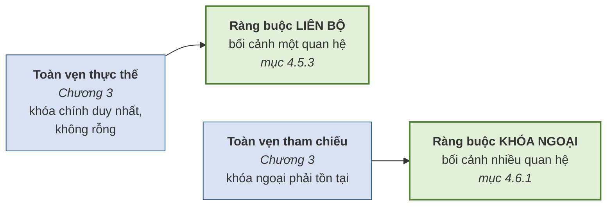
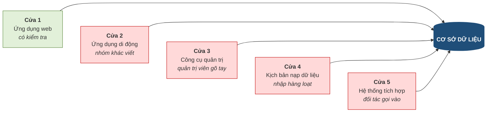

# 4.1. Khái niệm ràng buộc toàn vẹn

*(1,0 tiết)*

## 4.1.1. Ba lỗ hổng còn lại từ Chương 3

Mục 3.3.4 đã liệt kê ba loại lỗi mà hai ràng buộc toàn vẹn thực thể và tham chiếu không phát hiện được. Chương này nhận lại đúng ba món nợ ấy.

**Bảng 4.1. Ba lỗ hổng của một cơ sở dữ liệu "hoàn hảo"**

| Dữ liệu vô lý | Vì sao lọt qua | Cần loại ràng buộc nào |
|---|---|---|
| `HOCPHI = -500000` | Không liên quan tới khóa nào | Ràng buộc **miền giá trị** |
| Ngày khai giảng trước ngày thành lập khóa học | Hai giá trị nằm ở **hai bảng khác nhau** | Ràng buộc **liên thuộc tính liên quan hệ** |
| Lớp 25 chỗ nhận 40 học viên | Phải **đếm** mới biết, nhìn từng dòng không thấy | Ràng buộc **liên bộ liên quan hệ** |

Ba dòng trên cũng chính là ba mức độ khó tăng dần mà chương sẽ đi qua: từ ràng buộc chỉ nhìn **một ô**, tới ràng buộc phải nhìn **hai bảng**, tới ràng buộc phải **đếm trên toàn bảng**.

## 4.1.2. Ràng buộc toàn vẹn là gì

!!! note "Định nghĩa 4.1"

    **Ràng buộc toàn vẹn** *(integrity constraint)* là một **điều kiện mà dữ liệu trong cơ sở dữ liệu phải luôn luôn thỏa mãn**, ở mọi thời điểm, nhằm phản ánh đúng các quy tắc nghiệp vụ của tổ chức.

Ba chữ đáng chú ý trong định nghĩa là **"luôn luôn"**. Một ràng buộc không phải là điều kiện chỉ đúng lúc nhập liệu rồi thôi; nó phải đúng **trước và sau mọi thao tác**, trong suốt vòng đời hệ thống.

Ràng buộc toàn vẹn có nguồn gốc trực tiếp từ **quy tắc nghiệp vụ** đã học ở mục 2.1.2. Điều này tạo nên một mạch xuyên suốt ba chương:

| Chương | Quy tắc nghiệp vụ trở thành |
|---|---|
| Chương 2 | **Thành phần của lược đồ ER** — thực thể, liên kết, lực lượng |
| Chương 3 | **Cấu trúc bảng** — khóa chính, khóa ngoại |
| **Chương 4** | **Ràng buộc toàn vẹn** — phần quy tắc mà hai chương trên **chưa diễn đạt được** |

Nói cách khác, ràng buộc toàn vẹn là nơi chứa **phần còn lại** của nghiệp vụ — những quy tắc không thể hiện được bằng hình vẽ hay bằng cấu trúc bảng.

## 4.1.3. Hai ràng buộc của Chương 3 chỉ là trường hợp riêng

Một cách nhìn giúp hệ thống hóa: hai ràng buộc đã học ở Chương 3 **không phải là loại riêng biệt** — chúng chỉ là hai trường hợp cụ thể của bộ sáu loại sắp trình bày.

**Hình 4.1. Hai ràng buộc của Chương 3 chỉ là trường hợp riêng**

Cách nhìn này có giá trị thực tiễn: người học không phải nhớ hai hệ thống khái niệm song song, mà chỉ cần nhớ **một bộ sáu loại**, trong đó hai loại đã quen từ chương trước.

## 4.1.4. Ba tầng có thể đặt ràng buộc — vì sao chọn tầng cơ sở dữ liệu

Một quy tắc nghiệp vụ có thể được kiểm tra ở ba nơi khác nhau.

**Bảng 4.2. Ba tầng có thể đặt ràng buộc**

| Tầng | Cách làm | Ưu điểm | Nhược điểm |
|---|---|---|---|
| **Giao diện** | Kiểm tra ngay trên biểu mẫu trước khi gửi đi | Phản hồi tức thì, trải nghiệm tốt | **Rất dễ vượt qua** — chỉ cần gửi dữ liệu thẳng, không qua giao diện |
| **Ứng dụng** | Kiểm tra trong mã nguồn phần mềm | Diễn đạt được logic phức tạp | **Chỉ bảo vệ được đường đi qua ứng dụng đó** |
| **Cơ sở dữ liệu** | Khai báo ràng buộc cho hệ quản trị | **Bảo vệ mọi đường vào**, không thể vượt qua | Khó diễn đạt một vài loại logic rất phức tạp |

Điểm mấu chốt nằm ở dòng thứ hai. Người mới học thường nghĩ *"cứ để phần mềm ứng dụng kiểm tra là được"* — và đây là một trong những sai lầm tốn kém nhất trong nghề.

**Hình 4.2. Năm cửa vào cơ sở dữ liệu — ứng dụng chỉ khóa được một**

Trong hình, chỉ **cửa 1** có kiểm tra vì đó là ứng dụng đã cài logic. Bốn cửa còn lại **hoàn toàn mở**. Và bốn cửa ấy đều là những đường vào rất thật trong thực tế: ứng dụng di động do nhóm khác viết và có thể quên một điều kiện, quản trị viên sửa dữ liệu trực tiếp lúc cần gấp, kịch bản nạp dữ liệu hàng loạt bỏ qua mọi tầng ứng dụng, và hệ thống của đối tác gọi thẳng vào.

!!! warning "Chú ý — nguyên tắc nghề nghiệp"

    Ràng buộc đặt ở tầng ứng dụng có tác dụng **cải thiện trải nghiệm**; ràng buộc đặt ở tầng cơ sở dữ liệu mới có tác dụng **bảo đảm đúng đắn**. Hai việc này **không thay thế nhau**. Cách làm đúng là đặt ở **cả hai**: tầng giao diện báo lỗi sớm để người dùng dễ chịu, tầng cơ sở dữ liệu chốt chặn cuối cùng để không gì lọt qua.

    Có một câu tổng kết đáng nhớ: **dữ liệu sống lâu hơn ứng dụng**. Một cơ sở dữ liệu nghiệp vụ thường tồn tại mười đến hai mươi năm, trong khi các ứng dụng chạy trên nó được viết lại nhiều lần. Ràng buộc gắn với dữ liệu thì sống cùng dữ liệu; ràng buộc gắn với ứng dụng thì chết theo ứng dụng.

---

---

[← Trang trước](index.md) · [Trang sau →](4-2-ba-yeu-to-cua-mot-rang-buoc-toan-ven.md)
