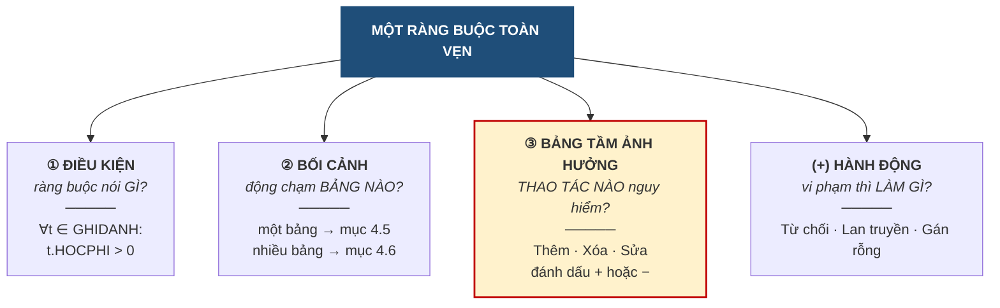

# 4.2. Ba yếu tố của một ràng buộc toàn vẹn

*(1,5 tiết)*

## 4.2.1. Ba yếu tố

Phát biểu *"học phí phải dương"* nghe thì rõ, nhưng chưa đủ để cài đặt. Muốn mô tả **đầy đủ** một ràng buộc, phải nêu đủ ba yếu tố, cộng thêm một yếu tố về xử lý.

**Hình 4.3. Ba yếu tố của một ràng buộc toàn vẹn**

Yếu tố thứ ba được tô đậm vì nó là **kỹ năng chữ ký của chương này**, và được dành hẳn mục 4.3.

## 4.2.2. Điều kiện — phát biểu hình thức

Điều kiện nên được viết bằng **ký hiệu logic** chứ không chỉ bằng lời, vì lời văn dễ mơ hồ còn ký hiệu thì không.

!!! example "Ví dụ 4.1"

    Ba cách phát biểu cùng một ràng buộc, từ mơ hồ tới chính xác:

    **(a)** *"Học phí phải hợp lý."* — Vô dụng. Thế nào là hợp lý?

    **(b)** *"Học phí phải lớn hơn 0."* — Đã dùng được, nhưng chưa nói rõ áp cho bảng nào.

    **(c)** `∀t ∈ GHIDANH : t.HOCPHI > 0` — **Chính xác**. Đọc là *"với mọi bộ `t` thuộc quan hệ `GHIDANH`, giá trị `HOCPHI` của `t` phải lớn hơn 0"*.

Ba ký hiệu cần nắm: **`∀`** đọc là *"với mọi"*, **`∃`** đọc là *"tồn tại"*, và **`⇒`** đọc là *"thì"* hoặc *"kéo theo"*.

!!! example "Ví dụ 4.2"

    Ràng buộc *"lớp không được khai giảng trước ngày khóa học được thành lập"* viết hình thức là:

    `∀l ∈ LOP, ∀k ∈ KHOAHOC : (l.MAKH = k.MAKH) ⇒ (l.NGAYKG ≥ k.NGAYTL)`

    Đọc: *"với mọi lớp `l` và mọi khóa học `k`, nếu lớp `l` thuộc khóa học `k` thì ngày khai giảng của `l` phải không sớm hơn ngày thành lập của `k`"*.

Dạng `(điều kiện) ⇒ (kết luận)` xuất hiện rất nhiều, vì phần lớn ràng buộc liên quan hệ đều có dạng *"nếu hai dòng khớp nhau ở khóa thì phải thỏa mãn thêm điều gì đó"*.

## 4.2.3. Bối cảnh — quyết định loại ràng buộc

!!! note "Định nghĩa 4.2"

    **Bối cảnh** *(context)* của một ràng buộc là **tập các quan hệ mà điều kiện của nó nhắc tới**.

Bối cảnh là yếu tố quyết định nhất, vì xác định xong bối cảnh là biết ngay ràng buộc thuộc nhóm nào: bối cảnh **một quan hệ** thì tra mục 4.5, bối cảnh **nhiều quan hệ** thì tra mục 4.6.

Cách xác định rất máy móc: đọc biểu thức điều kiện và **liệt kê mọi tên quan hệ xuất hiện trong đó**. Ở Ví dụ 4.1 chỉ có `GHIDANH` nên bối cảnh gồm một quan hệ. Ở Ví dụ 4.2 có cả `LOP` lẫn `KHOAHOC` nên bối cảnh gồm hai quan hệ.

## 4.2.4. Sáu loại ràng buộc toàn vẹn

Kết hợp **bối cảnh** *(một hay nhiều quan hệ)* với **phạm vi tác động** *(trong một ô, giữa các ô cùng dòng, hay giữa nhiều dòng)*, ta được bộ sáu loại đầy đủ.

**Bảng 4.3. Sáu loại ràng buộc toàn vẹn**

| Bối cảnh | Phạm vi | Tên loại | Ví dụ tại ABC |
|---|---|---|---|
| **Một** quan hệ | Một ô | **Miền giá trị** | `HOCPHI > 0` |
| **Một** quan hệ | Nhiều ô **cùng dòng** | **Liên thuộc tính** | `NGAYKT ≥ NGAYKG` |
| **Một** quan hệ | Nhiều **dòng** | **Liên bộ** | Không hai học viên trùng mã |
| **Nhiều** quan hệ | Giá trị khóa | **Khóa ngoại** | `GHIDANH.MAHV` phải tồn tại |
| **Nhiều** quan hệ | Nhiều ô ở **các bảng khác nhau** | **Liên thuộc tính liên quan hệ** | `LOP.NGAYKG ≥ KHOAHOC.NGAYTL` |
| **Nhiều** quan hệ | Nhiều **dòng** ở các bảng khác nhau | **Liên bộ liên quan hệ** | `LOP.SISO` bằng số dòng `GHIDANH` tương ứng |

Bảng này là **công cụ làm bài quan trọng nhất của chương**. Khi phải phát hiện ràng buộc cho một bài toán mới, người học đi lần lượt qua sáu dòng và tự hỏi *"bài này có ràng buộc loại đó không"* — cách làm ấy bảo đảm không bỏ sót loại nào. Mục 4.7.2 sẽ chuyển sáu dòng này thành sáu câu hỏi cụ thể.

---

---

[← Trang trước](4-1-khai-niem-rang-buoc-toan-ven.md) · [Trang sau →](4-3-lap-bang-tam-anh-huong.md)
