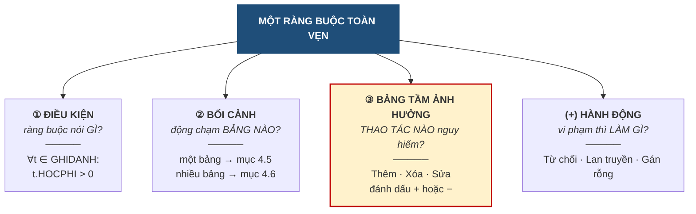

# 4.2. Ba yếu tố của một ràng buộc toàn vẹn

*(1,5 tiết)*

## 4.2.1. Ba yếu tố

Phát biểu *"học phí phải dương"* nghe thì rõ, nhưng chưa đủ để cài đặt. Muốn mô tả **đầy đủ** một ràng buộc, phải nêu đủ ba yếu tố, cộng thêm một yếu tố về xử lý.

**Hình 4.3. Ba yếu tố của một ràng buộc toàn vẹn**

Yếu tố thứ ba được tô đậm vì nó là **kỹ năng chữ ký của chương này**, và được dành hẳn mục 4.3.

## 4.2.2. Điều kiện — phát biểu hình thức

Điều kiện nên được viết bằng **ký hiệu logic** chứ không chỉ bằng lời, vì lời văn dễ mơ hồ còn ký hiệu thì không.

!!! example "Ví dụ 4.1"

    Ba cách phát biểu cùng một ràng buộc, từ mơ hồ tới chính xác:

    **(a)** *"Học phí phải hợp lý."* — Vô dụng. Thế nào là hợp lý?

    **(b)** *"Học phí phải lớn hơn 0."* — Đã dùng được, nhưng chưa nói rõ áp cho bảng nào.

    **(c)** `∀t ∈ GHIDANH : t.HOCPHI > 0` — **Chính xác**. Đọc là *"với mọi bộ `t` thuộc quan hệ `GHIDANH`, giá trị `HOCPHI` của `t` phải lớn hơn 0"*.

Ba ký hiệu cần nắm: **`∀`** đọc là *"với mọi"*, **`∃`** đọc là *"tồn tại"*, và **`⇒`** đọc là *"thì"* hoặc *"kéo theo"*. Người mới đọc công thức thường bị "dội" ngay ở ký hiệu đầu tiên. Cách khắc phục là **cắt công thức thành từng mảnh** và đọc mảnh nào ra mảnh nấy — Bảng 4.4 làm mẫu với phát biểu (c).

**Bảng 4.4. Đọc công thức `∀t ∈ GHIDANH : t.HOCPHI > 0` từng mảnh một**

| Mảnh | Đọc thành lời | Nghĩa là gì |
|---|---|---|
| `∀t` | *với mọi bộ t* | xét **từng dòng một**, không bỏ dòng nào |
| `∈ GHIDANH` | *thuộc quan hệ GHIDANH* | dòng ấy lấy ở **bảng nào** — đây chính là *bối cảnh* |
| `:` | *sao cho* / *thì phải* | phần sau dấu hai chấm là điều kiện phải thỏa |
| `t.HOCPHI` | *giá trị cột HOCPHI của dòng t* | chỉ đích danh **ô** đang xét |
| `> 0` | *lớn hơn không* | điều kiện cụ thể, máy kiểm tra được |

Ghép lại: *"xét từng dòng của bảng `GHIDANH`, ô `HOCPHI` của dòng ấy phải lớn hơn 0."* Mọi công thức trong chương đều đọc được theo cách này; công thức dài chỉ là nhiều mảnh hơn.

!!! example "Ví dụ 4.2"

    Ràng buộc *"lớp không được khai giảng trước ngày khóa học được thành lập"* viết hình thức là:

    `∀l ∈ LOP, ∀k ∈ KHOAHOC : (l.MAKH = k.MAKH) ⇒ (l.NGAYKG ≥ k.NGAYTL)`

    Đọc: *"với mọi lớp `l` và mọi khóa học `k`, nếu lớp `l` thuộc khóa học `k` thì ngày khai giảng của `l` phải không sớm hơn ngày thành lập của `k`"*.

Dạng `(điều kiện) ⇒ (kết luận)` xuất hiện rất nhiều, vì phần lớn ràng buộc liên quan hệ đều có dạng *"nếu hai dòng khớp nhau ở khóa thì phải thỏa mãn thêm điều gì đó"*.

## 4.2.3. Bối cảnh — quyết định loại ràng buộc

!!! note "Định nghĩa 4.2"

    **Bối cảnh** *(context)* của một ràng buộc là **tập các quan hệ mà điều kiện của nó nhắc tới**.

Bối cảnh là yếu tố quyết định nhất, vì xác định xong bối cảnh là biết ngay ràng buộc thuộc nhóm nào: bối cảnh **một quan hệ** thì tra mục 4.5, bối cảnh **nhiều quan hệ** thì tra mục 4.6.

Cách xác định rất máy móc: đọc biểu thức điều kiện và **liệt kê mọi tên quan hệ xuất hiện trong đó**. Ở Ví dụ 4.1 chỉ có `GHIDANH` nên bối cảnh gồm một quan hệ. Ở Ví dụ 4.2 có cả `LOP` lẫn `KHOAHOC` nên bối cảnh gồm hai quan hệ.

Đặt hai ví dụ cạnh nhau và điền đủ ba yếu tố của Hình 4.3, ta thấy ngay một ràng buộc "mô tả đầy đủ" trông như thế nào — và thấy hai ràng buộc khác nhau ở đâu.

**Bảng 4.5. Hai ràng buộc mô tả đầy đủ theo ba yếu tố**

| Yếu tố | Ví dụ 4.1 — học phí dương | Ví dụ 4.2 — lớp không khai giảng trước khóa học |
|---|---|---|
| **① Điều kiện** | `∀t ∈ GHIDANH : t.HOCPHI > 0` | `∀l ∈ LOP, ∀k ∈ KHOAHOC : (l.MAKH = k.MAKH) ⇒ (l.NGAYKG ≥ k.NGAYTL)` |
| **② Bối cảnh** | `{GHIDANH}` — **một** quan hệ | `{LOP, KHOAHOC}` — **hai** quan hệ |
| Loại *(tra Bảng 4.6)* | Miền giá trị | Liên thuộc tính liên quan hệ |
| **③ Bảng tầm ảnh hưởng** *(cách lập ở mục 4.3)* | `GHIDANH`: thêm **+** · xóa − · sửa **+** *(HOCPHI)* | `LOP`: thêm **+** · xóa − · sửa **+** *(NGAYKG, MAKH)*  ;  `KHOAHOC`: thêm − · xóa − · sửa **+** *(NGAYTL)* |
| **(+) Hành động** | Từ chối, báo *"học phí phải dương"* | Từ chối, báo *"ngày khai giảng sớm hơn ngày thành lập khóa"* |
| Công cụ khai báo *(mục 4.4)* | `CHECK (HOCPHI > 0)` | Trigger — `CHECK` không nhìn được sang bảng khác |

Bối cảnh một quan hệ thì bảng tầm ảnh hưởng có **một dòng**; bối cảnh hai quan hệ thì có **hai dòng**. Quy tắc "bao nhiêu quan hệ, bấy nhiêu dòng" sẽ được nhắc lại ở mục 4.3.5 vì đây là chỗ hay bị bỏ sót.

## 4.2.4. Sáu loại ràng buộc toàn vẹn

Kết hợp **bối cảnh** *(một hay nhiều quan hệ)* với **phạm vi tác động** *(trong một ô, giữa các ô cùng dòng, hay giữa nhiều dòng)*, ta được bộ sáu loại đầy đủ.

**Bảng 4.6. Sáu loại ràng buộc toàn vẹn**

| Bối cảnh | Phạm vi | Tên loại | Ví dụ tại ABC |
|---|---|---|---|
| **Một** quan hệ | Một ô | **Miền giá trị** | `HOCPHI > 0` |
| **Một** quan hệ | Nhiều ô **cùng dòng** | **Liên thuộc tính** | `NGAYKT ≥ NGAYKG` |
| **Một** quan hệ | Nhiều **dòng** | **Liên bộ** | Không hai học viên trùng mã |
| **Nhiều** quan hệ | Giá trị khóa | **Khóa ngoại** | `GHIDANH.MAHV` phải tồn tại |
| **Nhiều** quan hệ | Nhiều ô ở **các bảng khác nhau** | **Liên thuộc tính liên quan hệ** | `LOP.NGAYKG ≥ KHOAHOC.NGAYTL` |
| **Nhiều** quan hệ | Nhiều **dòng** ở các bảng khác nhau | **Liên bộ liên quan hệ** | `LOP.SISO` bằng số dòng `GHIDANH` tương ứng |

Bảng này là **công cụ làm bài quan trọng nhất của chương**. Khi phải phát hiện ràng buộc cho một bài toán mới, người học đi lần lượt qua sáu dòng và tự hỏi *"bài này có ràng buộc loại đó không"* — cách làm ấy bảo đảm không bỏ sót loại nào. Mục 4.7.2 sẽ chuyển sáu dòng này thành sáu câu hỏi cụ thể.

Vì sao là **sáu** mà không phải năm hay bảy? Vì sáu loại chính là **hai lựa chọn bối cảnh nhân với ba mức phạm vi** — xếp thành ma trận 2 × 3 thì nhìn thấy ngay, và cũng dễ nhớ hơn một danh sách sáu dòng.

**Bảng 4.7. Sáu loại ràng buộc là ma trận 2 × 3 — bối cảnh nhân phạm vi**

| Bối cảnh ╲ Phạm vi | Một **giá trị** | Nhiều ô **cùng dòng** | Nhiều **dòng** |
|---|---|---|---|
| **Một** quan hệ | **Miền giá trị** — R1: `HOCPHI > 0` | **Liên thuộc tính** — R2: `NGAYKT ≥ NGAYKG` | **Liên bộ** — R3: không trùng `MAHV` |
| **Nhiều** quan hệ | **Khóa ngoại** — R4: `GHIDANH.MAHV` phải có trong `HOCVIEN` | **Liên thuộc tính liên QH** — R5: `LOP.NGAYKG ≥ KHOAHOC.NGAYTL` | **Liên bộ liên QH** — R6: `SISO` = số dòng `GHIDANH` |
| *Công cụ khai báo* | `CHECK`, kiểu dữ liệu, `NOT NULL` · `FOREIGN KEY` | `CHECK` · trigger | `UNIQUE`/`PRIMARY KEY` · trigger |

Đi từ trái sang phải trong mỗi hàng, ràng buộc phải "nhìn" ngày càng rộng — một ô, một dòng, rồi cả bảng — nên **càng sang phải càng khó cài đặt**; đi từ trên xuống dưới thì phải nhìn thêm bảng khác, nên hàng dưới khó hơn hàng trên. Ô dưới cùng bên phải vì thế là loại khó nhất. Sáu mã R1–R6 là bộ ràng buộc mẫu của Trung tâm ABC, sẽ được lập đầy đủ ở Bảng 4.22.

!!! question "Tự kiểm tra 4.2"

    *(tự trả lời trước, rồi mở đáp án bên dưới)*

    1. Xếp mỗi ràng buộc sau vào đúng một ô của Bảng 4.7: (a) *"số điện thoại của học viên không trùng nhau"*; (b) *"ngày ghi danh không sớm hơn ngày khai giảng của lớp"*; (c) *"bằng cấp giáo viên chỉ nhận một trong ba giá trị"*; (d) *"mỗi khóa học có không quá 10 lớp"*.
    2. Viết ràng buộc (b) bằng ký hiệu logic theo dạng `(điều kiện) ⇒ (kết luận)`, rồi đọc thành lời như Bảng 4.4.
    3. Bối cảnh của ràng buộc (d) gồm những quan hệ nào? Bảng tầm ảnh hưởng của nó sẽ có mấy dòng?

??? success "Đáp án tự kiểm tra 4.2"

    *(1)* (a) một quan hệ `DIENTHOAI`, nhiều dòng → **liên bộ** *(khai báo bằng `UNIQUE`)*; (b) hai quan hệ `GHIDANH`, `LOP`, hai ô ở hai bảng → **liên thuộc tính liên quan hệ**; (c) một quan hệ `GIAOVIEN`, một ô → **miền giá trị**; (d) hai quan hệ `KHOAHOC`, `LOP`, phải **đếm** → **liên bộ liên quan hệ**. *(2)* `∀g ∈ GHIDANH, ∀l ∈ LOP : (g.MALOP = l.MALOP) ⇒ (g.NGAYGHIDANH ≥ l.NGAYKG)` — *"với mọi lượt ghi danh g và mọi lớp l, nếu g thuộc lớp l thì ngày ghi danh của g không sớm hơn ngày khai giảng của l"*. *(3)* Bối cảnh `{KHOAHOC, LOP}` — hai quan hệ, nên bảng tầm ảnh hưởng có **hai dòng** *(dù `KHOAHOC` có thể toàn dấu `−`, dòng ấy vẫn phải có mặt)*.

---

---

[← Trang trước](4-1-khai-niem-rang-buoc-toan-ven.md) · [Trang sau →](4-3-lap-bang-tam-anh-huong.md)
