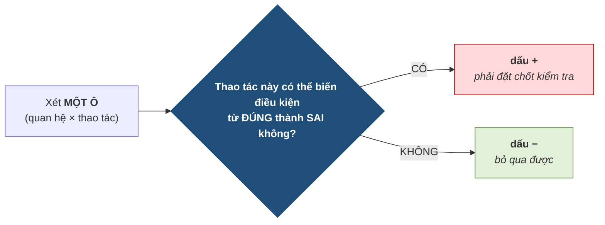
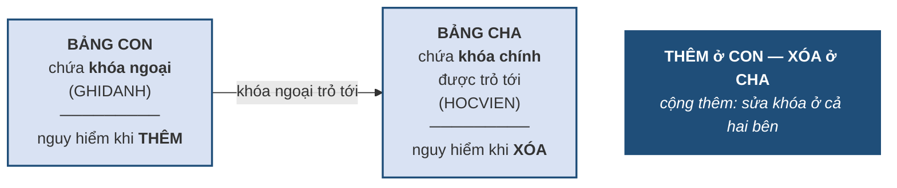

# 4.3. Lập bảng tầm ảnh hưởng

*(1,5 tiết)*

## 4.3.1. Bảng tầm ảnh hưởng dùng để làm gì

!!! note "Định nghĩa 4.3"

    **Bảng tầm ảnh hưởng** của một ràng buộc là bảng liệt kê, với **mỗi quan hệ trong bối cảnh** và **mỗi thao tác** thêm, xóa, sửa, xem thao tác đó **có khả năng làm vi phạm** ràng buộc hay không.

    Ký hiệu **`+`** nghĩa là **có thể gây vi phạm** — phải đặt chốt kiểm tra. Ký hiệu **`−`** nghĩa là **không thể gây vi phạm** — bỏ qua được. Với thao tác **sửa**, phải ghi rõ **thuộc tính** nào liên quan.

Câu hỏi tự nhiên là: **lập bảng này để làm gì?** Câu trả lời rất thực dụng: **để biết đặt chốt kiểm tra ở đâu.**

Mỗi lần kiểm tra một ràng buộc đều tốn thời gian xử lý. Nếu kiểm tra mọi ràng buộc ở mọi thao tác, hệ thống sẽ chậm tới mức không dùng được. Bảng tầm ảnh hưởng chỉ đích danh những chỗ **thật sự cần kiểm** — thường chỉ là một phần nhỏ trong tổng số ô.

## 4.3.2. Quy tắc vàng — "đúng thành sai"

Toàn bộ kỹ năng lập bảng tầm ảnh hưởng gói gọn trong **một câu hỏi duy nhất**, áp cho từng ô.

**Hình 4.4. Quy tắc vàng — một câu hỏi cho mọi ô**

Điểm cần nhấn mạnh: **giả thiết ngầm là điều kiện đang đúng trước thao tác**. Câu hỏi không phải *"thao tác này có làm dữ liệu sai không"* mà là *"nếu dữ liệu đang đúng, thao tác này có thể phá vỡ nó không"*.

!!! warning "Chú ý"

    **Đừng học thuộc kết quả** của các bảng tầm ảnh hưởng mẫu. Học thuộc sẽ sai ngay khi gặp bài mới, vì mỗi ràng buộc có cấu trúc khác nhau. Chỉ cần nhớ **một câu hỏi** và áp nó cho từng ô — cách này luôn đúng.

## 4.3.3. Ví dụ mẫu — ràng buộc khóa ngoại

Xét ràng buộc: *"mọi `MAHV` trong `GHIDANH` phải tồn tại trong `HOCVIEN`"*. Bối cảnh gồm hai quan hệ, nên bảng có **hai dòng và ba cột**, tức sáu ô cần xét. Để suy luận không bị trừu tượng, hãy đặt hai bảng dữ liệu nhỏ trước mặt và **giả thiết chúng đang đúng**: cả ba mã học viên trong `GHIDANH` đều có trong `HOCVIEN`.

**Bảng 4.8. Dữ liệu đang đúng — dùng để thử sáu thao tác**

| `HOCVIEN` *(cha)* | MAHV | HOTEN |
|---|---|---|
| | HV01 | Trần An |
| | HV02 | Lê Bình |
| | HV03 | Phạm Cường |

| `GHIDANH` *(con)* | MAHV↗ | MALOP↗ |
|---|---|---|
| | HV01 | A1 |
| | HV01 | A2 |
| | HV02 | A1 |

Với mỗi ô, hãy thử **một thao tác cụ thể** trên hai bảng này rồi hỏi câu hỏi vàng.

**Bảng 4.9. Suy luận từng ô — ràng buộc khóa ngoại**

| Ô cần xét | Suy luận: *"có thể biến đúng thành sai không?"* | Kết quả |
|---|---|:--:|
| **Thêm** vào `GHIDANH` | Nhập một dòng với `MAHV = 'HV99'` chưa hề tồn tại → **trỏ vào hư vô** | **+** |
| **Xóa** khỏi `GHIDANH` | Bớt một dòng nghĩa là bớt một thứ cần kiểm → càng an toàn hơn | **−** |
| **Sửa** `MAHV` ở `GHIDANH` | Đổi sang một mã không tồn tại → **trỏ vào hư vô** | **+** *(MAHV)* |
| **Thêm** vào `HOCVIEN` | Có thêm học viên mới; không tham chiếu nào đang có bị ảnh hưởng | **−** |
| **Xóa** khỏi `HOCVIEN` | Xóa HV01 trong khi `GHIDANH` **còn dòng trỏ tới** → tham chiếu treo | **+** |
| **Sửa** `MAHV` ở `HOCVIEN` | Đổi khóa chính → mọi dòng con đang trỏ tới **bị lệch** | **+** *(MAHV)* |

**Bảng tầm ảnh hưởng thu được:**

| Quan hệ | Thêm | Xóa | Sửa |
|---|:--:|:--:|:--:|
| `HOCVIEN` *(cha)* | − | **+** | **+** *(MAHV)* |
| `GHIDANH` *(con)* | **+** | − | **+** *(MAHV)* |

Đối chiếu lại với Bảng 4.8 để thấy ba ô `+` "đáng sợ" nhất: thêm dòng `(HV99, A1)` vào `GHIDANH` là tạo ra một mũi tên trỏ vào chỗ trống; xóa `HV01` khỏi `HOCVIEN` là để lại **hai** dòng con `(HV01, A1)` và `(HV01, A2)` không còn cha; đổi `HV02` thành `HV22` ở `HOCVIEN` là làm dòng `(HV02, A1)` lệch đích. Ba ô `−` thì ngược lại: xóa dòng `(HV02, A1)` hay thêm `HV04` vào `HOCVIEN` chỉ khiến dữ liệu **an toàn hơn**.

## 4.3.4. Câu thần chú "Thêm ở con, Xóa ở cha"

Bảng vừa lập có một cấu trúc **đối xứng chéo** rất dễ nhớ, và cấu trúc ấy đúng cho **mọi** ràng buộc khóa ngoại.

**Hình 4.5. Câu thần chú cho mọi ràng buộc khóa ngoại**

Lý do đằng sau câu thần chú rất trực quan. Thêm vào bảng con là **tạo ra một mũi tên mới** — mũi tên ấy có thể trỏ vào chỗ trống. Xóa ở bảng cha là **rút đi cái đích** — các mũi tên đang trỏ tới bỗng treo lơ lửng. Hai thao tác còn lại thì ngược lại: thêm vào cha là *tạo thêm đích*, xóa ở con là *bớt mũi tên* — cả hai đều chỉ làm tình hình an toàn hơn.

## 4.3.5. Ba lỗi thường gặp khi lập bảng

**Lỗi thứ nhất — đánh dấu `+` cho tất cả các ô "cho chắc ăn".** Đây là lỗi phổ biến nhất và cũng tai hại nhất, vì ba lý do. Về **mục đích**, bảng này sinh ra để *chỉ đúng chỗ* cần kiểm; đánh `+` hết thì bảng thành vô nghĩa. Về **hiệu năng**, mỗi dấu `+` là một lần kiểm tra thật sự tốn tài nguyên. Về **chuyên môn**, đánh `+` tràn lan chứng tỏ người làm **chưa hiểu** ràng buộc, và người chấm nhận ra ngay.

**Lỗi thứ hai — quên ghi thuộc tính ở cột "sửa".** Ghi `+` suông ở cột sửa là chưa đủ, vì sửa `HOTEN` thì vô hại còn sửa `MAHV` thì nguy hiểm. Phải ghi rõ `+ (MAHV)`.

**Lỗi thứ ba — quên rằng bối cảnh có bao nhiêu quan hệ thì bảng có bấy nhiêu dòng.** Ràng buộc bối cảnh hai quan hệ phải có **hai dòng**; chỉ lập một dòng là đã bỏ sót một nửa số ô cần xét.

Ba lỗi ấy trông thế nào trên giấy? Bảng 4.10 đặt bài làm sai cạnh bài làm đúng cho cùng ràng buộc khóa ngoại `GHIDANH.MAHV → HOCVIEN`.

**Bảng 4.10. Ba lỗi khi lập bảng tầm ảnh hưởng — cách sai và cách đúng**

| Lỗi | Bài làm **sai** | Bài làm **đúng** | Người chấm nhận ra vì |
|---|---|---|---|
| ① Đánh `+` cho chắc | `HOCVIEN`: **+ + +**  ·  `GHIDANH`: **+ + +** | `HOCVIEN`: − **+** **+**(MAHV)  ·  `GHIDANH`: **+** − **+**(MAHV) | Xóa ở con và thêm ở cha **không thể** làm khóa ngoại treo — sáu dấu `+` chứng tỏ chưa hề suy luận |
| ② `+` suông ở cột sửa | `HOCVIEN`: − + **+**  ·  `GHIDANH`: + − **+** | `HOCVIEN`: − + **+ (MAHV)**  ·  `GHIDANH`: + − **+ (MAHV)** | Sửa `HOTEN` vô hại, chỉ sửa `MAHV` mới nguy hiểm; không ghi thuộc tính thì chốt kiểm tra sẽ chạy cả khi đổi tên |
| ③ Thiếu dòng | `GHIDANH`: + − +(MAHV) *(chỉ một dòng)* | `HOCVIEN`: − + +(MAHV)  ·  `GHIDANH`: + − +(MAHV) | Bối cảnh có **hai** quan hệ; bỏ dòng `HOCVIEN` là bỏ luôn ô nguy hiểm nhất — *xóa ở cha* |

!!! question "Tự kiểm tra 4.3"

    *(tự trả lời trước, rồi mở đáp án bên dưới)*

    1. Lập bảng tầm ảnh hưởng cho **R2**: `∀t ∈ LOP : t.NGAYKT ≥ t.NGAYKG`. Bảng có mấy dòng, mấy ô `+`?
    2. Với khóa ngoại `DIENTHOAI.MAHV → HOCVIEN`, không cần suy luận lại từng ô, hãy viết ngay bảng tầm ảnh hưởng bằng câu thần chú ở Hình 4.5.
    3. Một bạn lập bảng cho R2 và đánh `+` ở ô *xóa*. Dùng câu hỏi vàng để chỉ ra bạn ấy sai ở đâu.

??? success "Đáp án tự kiểm tra 4.3"

    *(1)* Một dòng `LOP`: thêm **+** · xóa − · sửa **+** *(NGAYKG, NGAYKT)* — hai ô `+`. *(2)* Thêm ở con, xóa ở cha, sửa khóa ở cả hai: `HOCVIEN`: − **+** **+** *(MAHV)*; `DIENTHOAI`: **+** − **+** *(MAHV)*. *(3)* Giả thiết mọi dòng đang đúng; xóa đi một dòng thì các dòng còn lại **vẫn đúng như cũ** — không có cách nào biến đúng thành sai, nên ô *xóa* phải là `−`.

---

---

[← Trang trước](4-2-ba-yeu-to-cua-mot-rang-buoc-toan-ven.md) · [Trang sau →](4-4-hanh-dong-khi-vi-pham-va-cu-phap-khai-bao.md)
