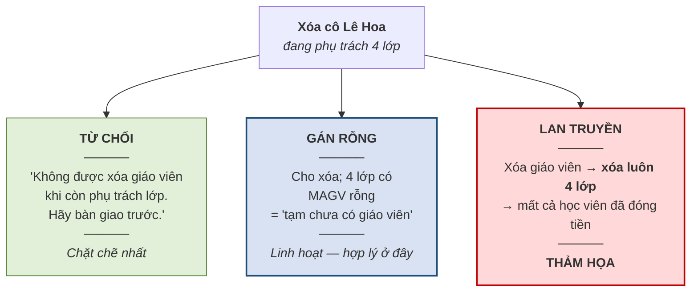

# 4.4. Hành động khi vi phạm và cú pháp khai báo

*(1,0 tiết)*

## 4.4.1. Ba hành động

Phát hiện vi phạm rồi thì phải làm gì? Có ba lựa chọn.

**Bảng 4.11. Ba hành động khi phát hiện vi phạm**

| Hành động | Ý nghĩa | Ví dụ tại ABC |
|---|---|---|
| **Từ chối** *(RESTRICT / NO ACTION)* | Chặn thao tác lại và báo lỗi | Không cho xóa học viên **còn ghi danh** |
| **Lan truyền** *(CASCADE)* | Thực hiện dây chuyền theo quy tắc đã định | Xóa học viên → **xóa luôn** các số điện thoại của người đó |
| **Gán rỗng** *(SET NULL)* | Đặt khóa ngoại về giá trị rỗng | Xóa giáo viên → `LOP.MAGV` thành rỗng |

## 4.4.2. Chọn hành động theo nghiệp vụ

!!! warning "Chú ý"

    Việc chọn hành động nào **do nghiệp vụ quyết định, không phải do kỹ thuật**. Đây là điểm quan trọng nhất của mục này.

**Hình 4.6. Cùng thao tác "xóa giáo viên" — ba lựa chọn, ba hệ quả**



{width=55%}

*Ảnh minh họa: dãy quân domino đang đổ dây chuyền. Hành động lan truyền (CASCADE) chính là thế: đẩy một quân — xóa một bản ghi cha — thì cả dãy đổ theo, trong im lặng, không ai kịp hỏi lại — Nguồn: Wikimedia Commons · Louise · CC BY 2.0.*

Ba nhánh của hình trên trở nên rất cụ thể khi nhìn vào dữ liệu. Giả sử trước lệnh xóa, cô Lê Hoa *(GV1)* phụ trách bốn lớp và bốn lớp ấy có tổng cộng 96 lượt ghi danh.

**Bảng 4.12. Cùng một lệnh "xóa GV1" — dữ liệu sau khi thực hiện theo ba hành động**

| Bảng | **Trước** khi xóa | Sau khi **TỪ CHỐI** | Sau khi **GÁN RỖNG** | Sau khi **LAN TRUYỀN** |
|---|---|---|---|---|
| `GIAOVIEN` | GV1 Lê Hoa · GV2 Trần Mai · GV3 Phạm Nam | *y nguyên* — lệnh bị hủy | GV2 · GV3 | GV2 · GV3 |
| `LOP` | A1 → GV1 · A3 → GV1 · A4 → GV1 · A5 → GV1 · A2 → GV2 | *y nguyên* | A1 → **rỗng** · A3 → **rỗng** · A4 → **rỗng** · A5 → **rỗng** · A2 → GV2 | **chỉ còn A2** — bốn lớp biến mất |
| `GHIDANH` | 96 lượt ghi danh của A1, A3, A4, A5 + các lớp khác | *y nguyên* | *y nguyên* — 96 học viên vẫn có lớp | **mất 96 dòng** nếu `GHIDANH.MALOP` cũng lan truyền; nếu không, lệnh bị chặn ở tầng dưới |
| Thông báo cho người dùng | — | *"Không thể xóa: giáo viên còn phụ trách 4 lớp"* | *(không có)* | *(không có — xóa trong im lặng)* |

Đọc cột cuối cùng thật chậm: không một dòng báo lỗi nào, và 96 học viên đã đóng tiền không còn lớp. Đó là lý do lan truyền được gọi là "thảm họa" ở Hình 4.6.

Nguyên tắc rút ra: **chỉ dùng lan truyền khi bản ghi con thật sự vô nghĩa nếu thiếu bản ghi cha.**

| Trường hợp | Dùng lan truyền? | Lý do |
|---|:--:|---|
| Xóa học viên → xóa số điện thoại | **Hợp lý** | Số điện thoại vô nghĩa nếu không còn học viên — nó là **thực thể yếu** *(mục 2.6.3)* |
| Xóa giáo viên → xóa lớp | **Thảm họa** | Lớp học **tồn tại độc lập**; cô này nghỉ thì cô khác dạy |

!!! warning "Chú ý"

    Dùng sai lan truyền là cách nhanh nhất để **mất dữ liệu hàng loạt**, vì nó xóa **trong im lặng** — hệ thống làm đúng điều được yêu cầu, không có lỗi nào để báo. Khi đi làm, nếu ai hỏi *"nên dùng CASCADE hay RESTRICT?"*, câu trả lời đúng không phải là một quy tắc kỹ thuật mà là một câu hỏi ngược: ***"dữ liệu con còn ý nghĩa độc lập không?"***

## 4.4.3. Cú pháp khai báo ràng buộc — mức đọc hiểu

Mục này cho thấy các ràng buộc vừa học **trông như thế nào** khi được khai báo với một hệ quản trị thật. Người học chỉ cần **đọc hiểu**; kỹ năng viết thuộc học phần *Hệ quản trị cơ sở dữ liệu*.

**Bảng 4.13. Bốn cơ chế khai báo ràng buộc**

| Từ khóa | Diễn đạt ràng buộc loại nào | Tương ứng mục |
|---|---|---|
| `NOT NULL` | Cấm để trống một cột | Toàn vẹn thực thể · miền giá trị |
| `UNIQUE` | Cấm trùng giá trị giữa các dòng | **Liên bộ** — mục 4.5.3 |
| `CHECK` | Điều kiện trên một hoặc nhiều cột **cùng dòng** | **Miền giá trị** và **liên thuộc tính** — mục 4.5.1, 4.5.2 |
| `FOREIGN KEY … REFERENCES` | Toàn vẹn tham chiếu, kèm hành động khi vi phạm | **Khóa ngoại** — mục 4.6.1 |

!!! example "Ví dụ 4.3 — khai báo bảng `GHIDANH` của Trung tâm ABC"

    *(Giảng viên minh họa trên lớp.)*

    ```sql
    CREATE TABLE GHIDANH (
        MAHV          VARCHAR(10)  NOT NULL,
        MALOP         VARCHAR(10)  NOT NULL,
        NGAYGHIDANH   DATE         NOT NULL,
        HOCPHI        INT          NOT NULL,

        PRIMARY KEY (MAHV, MALOP),

        CONSTRAINT ck_hocphi  CHECK (HOCPHI > 0),

        CONSTRAINT fk_ghidanh_hocvien
            FOREIGN KEY (MAHV) REFERENCES HOCVIEN(MAHV)
            ON DELETE NO ACTION,

        CONSTRAINT fk_ghidanh_lop
            FOREIGN KEY (MALOP) REFERENCES LOP(MALOP)
            ON DELETE CASCADE
    );
    ```

    **Đọc từng phần:**

    | Dòng khai báo | Diễn đạt điều gì |
    |---|---|
    | `MAHV VARCHAR(10) NOT NULL` | Miền giá trị: chuỗi tối đa 10 ký tự, **không được rỗng** |
    | `PRIMARY KEY (MAHV, MALOP)` | **Khóa chính phức hợp** — đúng như đã ánh xạ ở mục 3.4.4 |
    | `CHECK (HOCPHI > 0)` | Chính là ràng buộc **R1** — học phí phải dương |
    | `FOREIGN KEY (MAHV) … ON DELETE NO ACTION` | Toàn vẹn tham chiếu, và **từ chối** xóa học viên còn ghi danh |
    | `FOREIGN KEY (MALOP) … ON DELETE CASCADE` | Xóa lớp thì **xóa luôn** các lượt ghi danh của lớp đó |

!!! warning "Chú ý — hai hành động khác nhau trong cùng một bảng"

    Trong ví dụ trên, khóa ngoại trỏ về `HOCVIEN` dùng **từ chối**, còn khóa ngoại trỏ về `LOP` dùng **lan truyền**. Không hề mâu thuẫn: hồ sơ ghi danh của một học viên là dữ liệu cần bảo toàn kể cả khi học viên rời trung tâm, nhưng khi một lớp bị hủy thì các lượt ghi danh vào lớp đó không còn ý nghĩa. **Nghiệp vụ khác nhau nên hành động khác nhau** — đúng nguyên tắc ở mục 4.4.2.

Một điều cần biết về **giới hạn của khai báo**: cơ chế `CHECK` chỉ kiểm tra được trong phạm vi **một dòng**. Nó không diễn đạt được ràng buộc phải **đếm trên nhiều dòng** hay phải **so sánh với bảng khác** — tức hai loại khó nhất trong Bảng 4.6. Đó chính là lý do tồn tại của trigger, trình bày ở mục 4.6.4.

## 4.4.4. Từ phát hiện sang ngăn chặn

Mục 3.7.3 của Chương 3 đã dạy một kỹ thuật **phát hiện** khóa ngoại mồ côi bằng phép kết ngoài. Mục này bổ sung nửa còn lại: **ngăn chặn**.

**Bảng 4.14. Hai cách đối phó với lỗi toàn vẹn tham chiếu**

| | Phát hiện *(mục 3.7.3)* | Ngăn chặn *(mục 4.4.3)* |
|---|---|---|
| **Công cụ** | Kết ngoài trái kèm phép chọn | Khai báo `FOREIGN KEY` |
| **Thời điểm** | **Sau khi** lỗi đã xảy ra | **Ngay lúc** thao tác được thực hiện |
| **Kết quả** | Danh sách các dòng lỗi | Thao tác bị chặn, dữ liệu không bao giờ sai |
| **Dùng khi nào** | Cơ sở dữ liệu **cũ** chưa khai báo ràng buộc; sau khi nạp dữ liệu hàng loạt | Hệ thống **mới**, thiết kế từ đầu |

Trong thực tế cả hai đều cần. Ngăn chặn là biện pháp chính. Nhưng khi tiếp quản một hệ thống cũ, việc đầu tiên phải làm là **dùng kỹ thuật phát hiện để dọn sạch dữ liệu bẩn đã có** — vì hệ quản trị sẽ **từ chối** khai báo khóa ngoại nếu dữ liệu hiện tại đang vi phạm.

!!! question "Tự kiểm tra 4.4"

    *(tự trả lời trước, rồi mở đáp án bên dưới)*

    1. Lược đồ thư viện có ba khóa ngoại: `PHIEUMUON.MADG → DOCGIA`, `CHITIETMUON.MAPHIEU → PHIEUMUON`, `SACH.MATL → THELOAI`. Chọn hành động khi xóa bản ghi cha cho từng khóa và nêu lý do nghiệp vụ.
    2. Dòng `CONSTRAINT ck_ngay CHECK (NGAYKT >= NGAYKG)` diễn đạt ràng buộc loại nào trong Bảng 4.6? Vì sao `CHECK` làm được việc này?
    3. Vì sao **không thể** viết `CHECK` cho ràng buộc *"sĩ số bằng số dòng ghi danh"*?

??? success "Đáp án tự kiểm tra 4.4"

    *(1)* `PHIEUMUON.MADG → DOCGIA`: **từ chối** — phải giữ lịch sử mượn, độc giả còn phiếu thì không xóa; `CHITIETMUON.MAPHIEU → PHIEUMUON`: **lan truyền** — chi tiết phiếu vô nghĩa khi không còn phiếu *(thực thể yếu)*; `SACH.MATL → THELOAI`: **gán rỗng** *(hoặc từ chối)* — sách vẫn tồn tại khi bỏ một thể loại, chỉ tạm chưa phân loại. *(2)* Hai ô **cùng dòng** của `LOP` → **liên thuộc tính**; `CHECK` làm được vì nó kiểm tra trong phạm vi một dòng. *(3)* Phải **đếm dòng ở bảng khác** — `CHECK` chỉ nhìn được một dòng của một bảng, không đi theo khóa ngoại và không đếm được.

---


---

[← Trang trước](4-3-lap-bang-tam-anh-huong.md) · [Trang sau →](4-5-rang-buoc-toan-ven-boi-canh-mot-quan-he.md)
