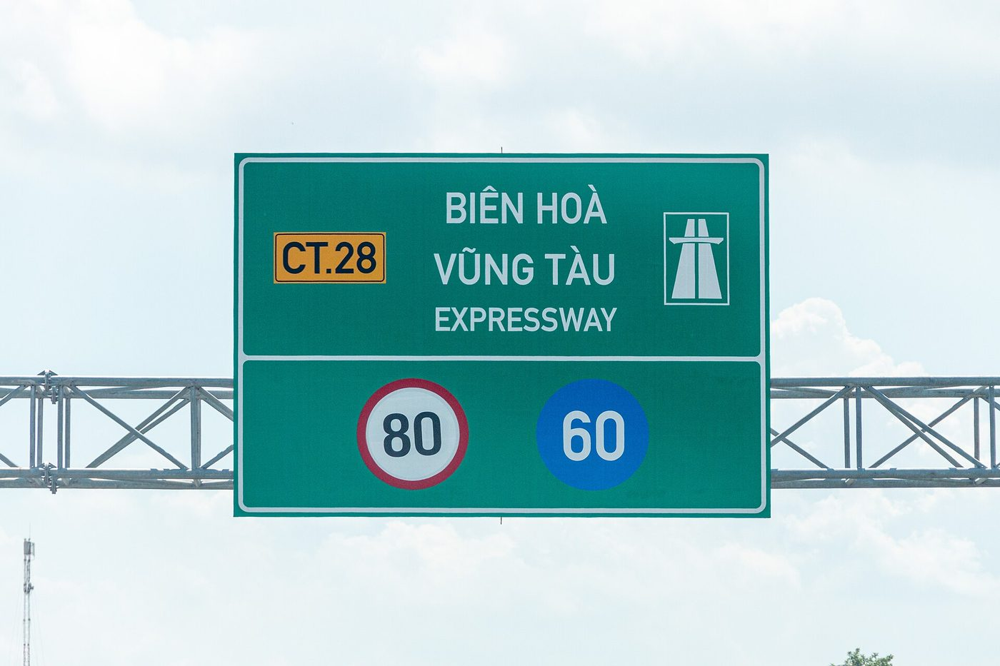
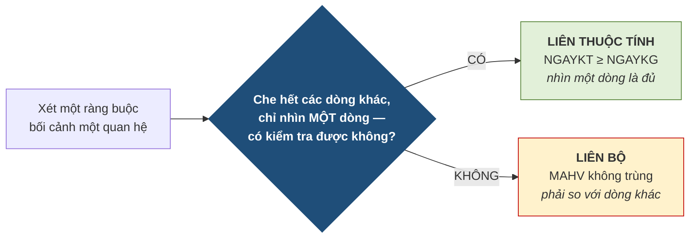

# 4.5. Ràng buộc toàn vẹn bối cảnh một quan hệ

*(1,0 tiết)*

Ba loại đầu tiên trong Bảng 4.6 có bối cảnh chỉ gồm **một quan hệ**.

## 4.5.1. Ràng buộc miền giá trị

!!! note "Định nghĩa 4.4"

    **Ràng buộc miền giá trị** *(domain constraint)* giới hạn **tập giá trị hợp lệ của một thuộc tính**, xét độc lập với mọi thuộc tính khác và mọi bộ khác.

!!! example "Ví dụ 4.4"

    Tại Trung tâm ABC:

    - `∀t ∈ GHIDANH : t.HOCPHI > 0` — học phí phải dương.
    - `∀t ∈ LOP : 5 ≤ t.SUCCHUA ≤ 40` — sức chứa nằm trong khoảng hợp lệ.
    - `∀t ∈ GIAOVIEN : t.BANGCAP ∈ {Cử nhân, Thạc sĩ, Tiến sĩ}` — chỉ nhận ba giá trị.

{width=55%}

*Ảnh minh họa: biển giới hạn tốc độ trên cao tốc Biên Hòa – Vũng Tàu: tối đa 80, tối thiểu 60. Một ràng buộc miền giá trị đúng nghĩa — chỉ giới hạn một con số, không cần biết xe nào, ai lái — Nguồn: Wikimedia Commons · MinhVN1863 · CC BY-SA 4.0.*

Đây là loại **dễ phát hiện và dễ cài đặt nhất** — khai báo bằng `CHECK` hoặc bằng chính kiểu dữ liệu. Bảng tầm ảnh hưởng của nó cũng đơn giản: chỉ **thêm** và **sửa** là nguy hiểm, còn **xóa** thì không bao giờ.

## 4.5.2. Ràng buộc liên thuộc tính

!!! note "Định nghĩa 4.5"

    **Ràng buộc liên thuộc tính** ràng buộc **quan hệ giữa nhiều thuộc tính trong cùng một bộ**.

!!! example "Ví dụ 4.5"

    `∀t ∈ LOP : t.NGAYKT ≥ t.NGAYKG` — ngày kết thúc không được sớm hơn ngày khai giảng. Cả hai giá trị đều nằm **trên cùng một dòng**.

Vẫn khai báo được bằng `CHECK`, vì `CHECK` làm việc trong phạm vi một dòng.

## 4.5.3. Ràng buộc liên bộ

!!! note "Định nghĩa 4.6"

    **Ràng buộc liên bộ** ràng buộc **quan hệ giữa nhiều bộ khác nhau** trong cùng một quan hệ.

!!! example "Ví dụ 4.6"

    `∀t₁, t₂ ∈ HOCVIEN, t₁ ≠ t₂ : t₁.MAHV ≠ t₂.MAHV` — không hai học viên nào trùng mã. Đây chính là **toàn vẹn thực thể** của Chương 3, nhìn dưới dạng tổng quát. Khai báo bằng `PRIMARY KEY` hoặc `UNIQUE`.

Loại này khó hơn hai loại trên, vì để kiểm tra một dòng thì hệ thống phải **so nó với các dòng khác** — không thể chỉ nhìn một dòng mà kết luận.

Ba loại vừa học đều "ở trong một bảng", nên có thể gom cả ba vào **một bảng dữ liệu** để tập nhận diện. Bảng `LOP` dưới đây có ba dòng sai, mỗi dòng sai theo một loại; hãy thử tự tìm trước khi đọc bảng giải thích.

**Bảng 4.15. Một bảng `LOP`, ba dòng sai, ba loại ràng buộc khác nhau**

| MALOP | TENLOP | NGAYKG | NGAYKT | SUCCHUA |
|---|---|---|---|---|
| A1 | Anh cơ bản 1 | 2026-09-01 | 2026-12-20 | 25 |
| A2 | Anh cơ bản 2 | 2026-09-08 | 2026-12-27 | **60** |
| A3 | Anh giao tiếp 1 | **2026-09-15** | **2026-08-30** | 20 |
| **A1** | Luyện thi IELTS | 2026-10-01 | 2027-01-15 | 15 |

| Dòng sai | Nhìn vào đâu thì thấy | Loại | Cần "che các dòng khác" không? | Công cụ khai báo |
|---|---|---|---|---|
| A2 | **một ô**: `SUCCHUA = 60` vượt khoảng 5–40 | Miền giá trị | Không — một ô là đủ | `CHECK (SUCCHUA BETWEEN 5 AND 40)` |
| A3 | **hai ô cùng dòng**: `NGAYKT` 30/08 sớm hơn `NGAYKG` 15/09 | Liên thuộc tính | Không — một dòng là đủ | `CHECK (NGAYKT >= NGAYKG)` |
| A1 *(dòng 4)* | **hai dòng**: `MALOP = A1` xuất hiện hai lần | Liên bộ | **Có** — phải so với dòng 1 | `PRIMARY KEY (MALOP)` |

Cột thứ tư của bảng giải thích chính là phép thử sẽ trình bày ngay dưới đây.

## 4.5.4. Phân biệt liên thuộc tính và liên bộ

Đây là chỗ nhầm lẫn nhiều nhất của mục 4.5, và có một phép thử rất dứt khoát.

**Hình 4.7. Phép thử "che các dòng khác đi"**

Phép thử này cũng giải thích luôn **vì sao độ khó cài đặt tăng dần**. Ràng buộc liên thuộc tính chỉ cần nhìn một dòng nên hệ quản trị kiểm tra tức thì bằng `CHECK`. Ràng buộc liên bộ phải quét cả bảng, nên hệ quản trị phải dựng sẵn **chỉ mục duy nhất** để kiểm cho nhanh.

---

---

[← Trang trước](4-4-hanh-dong-khi-vi-pham-va-cu-phap-khai-bao.md) · [Trang sau →](4-6-rang-buoc-toan-ven-boi-canh-nhieu-quan-he.md)
