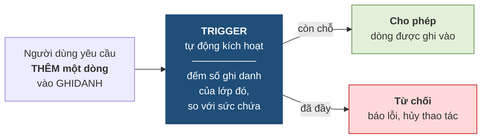

# 4.6. Ràng buộc toàn vẹn bối cảnh nhiều quan hệ

*(1,0 tiết)*

## 4.6.1. Ràng buộc khóa ngoại

!!! note "Định nghĩa 4.7"

    **Ràng buộc khóa ngoại** yêu cầu mỗi giá trị khóa ngoại **hoặc rỗng, hoặc phải khớp với một giá trị khóa chính đang tồn tại** ở quan hệ được tham chiếu.

Đây chính là **toàn vẹn tham chiếu** của Chương 3, và cũng là loại ràng buộc liên quan hệ **duy nhất được hệ quản trị hỗ trợ khai báo trực tiếp**. Bảng tầm ảnh hưởng của nó luôn theo mẫu *"thêm ở con, xóa ở cha"* đã lập ở mục 4.3.4.

## 4.6.2. Ràng buộc liên thuộc tính liên quan hệ

!!! note "Định nghĩa 4.8"

    Loại này ràng buộc **quan hệ giữa các thuộc tính nằm ở những quan hệ khác nhau**.

    **Ví dụ 4.7.** `∀l ∈ LOP, ∀k ∈ KHOAHOC : (l.MAKH = k.MAKH) ⇒ (l.NGAYKG ≥ k.NGAYTL)` — lớp không được khai giảng trước ngày khóa học được thành lập.

Loại này **không khai báo được bằng `CHECK`**, vì `CHECK` chỉ nhìn trong phạm vi một dòng của một bảng. Muốn thực thi phải dùng trigger.

Bảng tầm ảnh hưởng có hai dòng. Với `LOP`: thêm, và sửa `NGAYKG` hoặc `MAKH` đều nguy hiểm; xóa thì không. Với `KHOAHOC`: sửa `NGAYTL` nguy hiểm *(có thể đẩy ngày thành lập ra sau ngày khai giảng của lớp đã có)*; thêm và xóa thì không.

## 4.6.3. Ràng buộc liên bộ liên quan hệ — loại khó nhất

!!! note "Định nghĩa 4.9"

    Loại này ràng buộc **quan hệ giữa nhiều bộ nằm ở những quan hệ khác nhau**, thường liên quan tới phép **đếm** hoặc **tính tổng**.

    **Ví dụ 4.8.** `∀l ∈ LOP : l.SISO = |{g ∈ GHIDANH : g.MALOP = l.MALOP}|` — sĩ số ghi trong bảng `LOP` phải bằng số dòng ghi danh tương ứng trong `GHIDANH`.

Đây là loại **khó nhất trong sáu loại**, vì ba lý do cộng lại: phải nhìn **nhiều bảng**, phải nhìn **nhiều dòng**, và phải **tính toán** chứ không chỉ so sánh. Hệ quản trị không có cơ chế khai báo nào cho nó.

## 4.6.4. Trigger — công cụ cho ràng buộc mà khai báo không đủ

!!! note "Định nghĩa 4.10"

    **Trigger** *(bẫy sự kiện)* là một **đoạn chương trình được lưu ngay trong cơ sở dữ liệu**, tự động chạy mỗi khi một **sự kiện** xác định xảy ra — thêm, xóa hoặc sửa trên một bảng cụ thể.

**Hình 4.8. Trigger hoạt động thế nào**



Ý tưởng cốt lõi của trigger là: **nó nằm trong cơ sở dữ liệu, nên nó bảo vệ được cả năm cửa ở Hình 4.2**. Đây chính là điểm khác biệt so với việc viết cùng logic ấy trong mã nguồn ứng dụng.

!!! example "Ví dụ 4.9 — mã giả cho trigger kiểm tra sức chứa lớp"

    ```
    TRIGGER kiem_tra_suc_chua
        KÍCH HOẠT: SAU KHI THÊM một dòng vào GHIDANH
        THỰC HIỆN:
            n  ← đếm số dòng trong GHIDANH có MALOP = MALOP của dòng vừa thêm
            sc ← lấy SUCCHUA của lớp đó từ bảng LOP
            NẾU n > sc THÌ
                hủy thao tác và báo lỗi "Lớp đã đầy"
            KẾT THÚC NẾU
    ```

    Bảng tầm ảnh hưởng ở mục 4.3 cho biết **phải viết bao nhiêu trigger**. Ràng buộc này có các ô `+` ở *thêm `GHIDANH`*, *sửa `MALOP` của `GHIDANH`*, và *sửa `SUCCHUA` của `LOP`* — nghĩa là cần **ba** điểm kiểm tra chứ không phải một. Đây là công dụng thực tế rõ ràng nhất của bảng tầm ảnh hưởng.

    **Chú ý — trigger là công cụ mạnh nhưng nguy hiểm.** Ba rủi ro cần biết. Thứ nhất, trigger **chạy ngầm**: người dùng thấy thao tác bị từ chối mà không biết vì sao, gây khó khi tìm lỗi. Thứ hai, trigger có thể **gọi dây chuyền** — trigger này kích hoạt trigger kia, rất khó lần theo. Thứ ba, trigger **làm chậm** mọi thao tác trên bảng mà nó canh giữ.

    Vì vậy nguyên tắc là: **ưu tiên khai báo, chỉ dùng trigger khi khai báo không diễn đạt được**. Và trước khi viết trigger, hãy tự hỏi câu ở mục 4.7.5 — *"có phải thiết kế của mình đang có vấn đề không?"*

---


---

[← Trang trước](4-5-rang-buoc-toan-ven-boi-canh-mot-quan-he.md) · [Trang sau →](4-7-thuc-hanh-phat-hien-rang-buoc-toan-ven.md)
