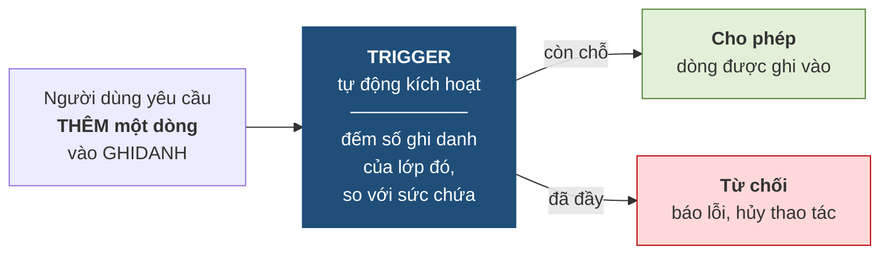

# 4.6. Ràng buộc toàn vẹn bối cảnh nhiều quan hệ

*(1,0 tiết)*

## 4.6.1. Ràng buộc khóa ngoại

!!! note "Định nghĩa 4.7"

    **Ràng buộc khóa ngoại** yêu cầu mỗi giá trị khóa ngoại **hoặc rỗng, hoặc phải khớp với một giá trị khóa chính đang tồn tại** ở quan hệ được tham chiếu.

Đây chính là **toàn vẹn tham chiếu** của Chương 3, và cũng là loại ràng buộc liên quan hệ **duy nhất được hệ quản trị hỗ trợ khai báo trực tiếp**. Bảng tầm ảnh hưởng của nó luôn theo mẫu *"thêm ở con, xóa ở cha"* đã lập ở mục 4.3.4.

## 4.6.2. Ràng buộc liên thuộc tính liên quan hệ

!!! note "Định nghĩa 4.8"

    Loại này ràng buộc **quan hệ giữa các thuộc tính nằm ở những quan hệ khác nhau**.

!!! example "Ví dụ 4.7"

    `∀l ∈ LOP, ∀k ∈ KHOAHOC : (l.MAKH = k.MAKH) ⇒ (l.NGAYKG ≥ k.NGAYTL)` — lớp không được khai giảng trước ngày khóa học được thành lập.

Loại này **không khai báo được bằng `CHECK`**, vì `CHECK` chỉ nhìn trong phạm vi một dòng của một bảng. Muốn thực thi phải dùng trigger.

Muốn thấy vì sao `CHECK` bất lực, hãy nhìn dữ liệu: ô sai nằm ở bảng `LOP`, nhưng **chuẩn để so** lại nằm ở bảng `KHOAHOC`.

**Bảng 4.16. Kiểm tra R5 phải đặt hai bảng cạnh nhau**

| `LOP` | MALOP | MAKH↗ | NGAYKG | | `KHOAHOC` | MAKH | NGAYTL | Kết luận |
|---|---|---|---|---|---|---|---|---|
| | A1 | KH01 | 2026-09-01 | ⟶ | | KH01 | 2020-01-15 | 2026 ≥ 2020 — **đúng** |
| | A2 | KH01 | 2026-09-08 | ⟶ | | KH01 | 2020-01-15 | **đúng** |
| | A3 | KH02 | **1990-09-01** | ⟶ | | KH02 | 2021-03-15 | 1990 < 2021 — **vi phạm** |

Nhìn riêng dòng A3 của `LOP` không thấy gì bất thường — ngày 01/09/1990 là một ngày hợp lệ. Chỉ khi **dò theo mũi tên `MAKH`** sang `KHOAHOC` và lấy `NGAYTL` ra so mới lộ lỗi. `CHECK` không đi theo mũi tên được, nên phải dùng trigger.

Bảng tầm ảnh hưởng có **hai dòng** vì bối cảnh có hai quan hệ, và mỗi ô đều suy ra được từ Bảng 4.16.

**Bảng 4.17. Bảng tầm ảnh hưởng của R5**

| Quan hệ | Thêm | Xóa | Sửa | Suy luận |
|---|:--:|:--:|:--:|---|
| `LOP` | **+** | − | **+** *(NGAYKG, MAKH)* | Thêm lớp với ngày khai giảng quá sớm → sai. Xóa lớp thì bớt một thứ phải so → an toàn. Sửa `NGAYKG` lùi về trước, hoặc đổi `MAKH` sang khóa thành lập muộn hơn → sai |
| `KHOAHOC` | − | − | **+** *(NGAYTL)* | Thêm khóa mới chưa có lớp nào → không ảnh hưởng. Xóa khóa thì khóa ngoại R4 đã chặn hoặc lớp cũng mất → R5 không bị phá. Sửa `NGAYTL` của KH01 thành 2027 → lớp A1 đang đúng bỗng sai |

## 4.6.3. Ràng buộc liên bộ liên quan hệ — loại khó nhất

!!! note "Định nghĩa 4.9"

    Loại này ràng buộc **quan hệ giữa nhiều bộ nằm ở những quan hệ khác nhau**, thường liên quan tới phép **đếm** hoặc **tính tổng**.

!!! example "Ví dụ 4.8"

    `∀l ∈ LOP : l.SISO = |{g ∈ GHIDANH : g.MALOP = l.MALOP}|` — sĩ số ghi trong bảng `LOP` phải bằng số dòng ghi danh tương ứng trong `GHIDANH`.

{width=45%}

*Ảnh minh họa: biển "cấm vào" kèm điều kiện ngoại lệ ghi bên dưới. Ràng buộc liên bộ liên quan hệ cũng vậy: muốn biết một dòng có được vào hay không, phải đọc thêm "điều kiện" nằm ở nơi khác — ở đây là phải đếm trên bảng khác — Nguồn: Wikimedia Commons · Albert Bridge · CC BY-SA 2.0.*

Đây là loại **khó nhất trong sáu loại**, vì ba lý do cộng lại: phải nhìn **nhiều bảng**, phải nhìn **nhiều dòng**, và phải **tính toán** chứ không chỉ so sánh. Hệ quản trị không có cơ chế khai báo nào cho nó. Ba lý do ấy hiện rõ khi kiểm tra R6 bằng tay trên dữ liệu.

**Bảng 4.18. Kiểm tra R6 — phải đếm trên bảng khác rồi mới so**

| `LOP` | MALOP | SISO | | Đếm dòng `GHIDANH` có `MALOP` tương ứng | Kết luận |
|---|---|:--:|---|---|---|
| | A1 | 3 | ⟶ | (HV01, A1) · (HV02, A1) · (HV03, A1) → **3** | 3 = 3 — **đúng** |
| | A2 | **2** | ⟶ | (HV01, A2) · (HV03, A2) · (HV04, A2) → **3** | 2 ≠ 3 — **vi phạm** |
| | A3 | 1 | ⟶ | (HV03, A3) → **1** | **đúng** |

Để kết luận về **một ô** `SISO` của lớp A2, phải sang bảng khác *(nhiều bảng)*, quét mọi dòng có `MALOP = A2` *(nhiều dòng)*, đếm rồi mới so *(tính toán)*. Không một mệnh đề `CHECK` hay `UNIQUE` nào làm được cả ba việc ấy.

## 4.6.4. Trigger — công cụ cho ràng buộc mà khai báo không đủ

!!! note "Định nghĩa 4.10"

    **Trigger** *(bẫy sự kiện)* là một **đoạn chương trình được lưu ngay trong cơ sở dữ liệu**, tự động chạy mỗi khi một **sự kiện** xác định xảy ra — thêm, xóa hoặc sửa trên một bảng cụ thể.

**Hình 4.8. Trigger hoạt động thế nào**



Ý tưởng cốt lõi của trigger là: **nó nằm trong cơ sở dữ liệu, nên nó bảo vệ được cả năm cửa ở Hình 4.2**. Đây chính là điểm khác biệt so với việc viết cùng logic ấy trong mã nguồn ứng dụng.

!!! example "Ví dụ 4.9 — mã giả cho trigger kiểm tra sức chứa lớp"

    ```
    TRIGGER kiem_tra_suc_chua
        KÍCH HOẠT: SAU KHI THÊM một dòng vào GHIDANH
        THỰC HIỆN:
            n  ← đếm số dòng trong GHIDANH có MALOP = MALOP của dòng vừa thêm
            sc ← lấy SUCCHUA của lớp đó từ bảng LOP
            NẾU n > sc THÌ
                hủy thao tác và báo lỗi "Lớp đã đầy"
            KẾT THÚC NẾU
    ```

    Bảng tầm ảnh hưởng ở mục 4.3 cho biết **phải viết bao nhiêu trigger**. Ràng buộc này có các ô `+` ở *thêm `GHIDANH`*, *sửa `MALOP` của `GHIDANH`*, và *sửa `SUCCHUA` của `LOP`* — nghĩa là cần **ba** điểm kiểm tra chứ không phải một. Đây là công dụng thực tế rõ ràng nhất của bảng tầm ảnh hưởng.

Mã giả đọc thì hiểu, nhưng để *tin* rằng nó chạy đúng, hãy chạy tay hai lần thêm trên cùng một bộ dữ liệu: lớp A6 chỉ có 3 chỗ và đã đủ 3 người; lớp A1 có 25 chỗ và mới 3 người.

**Bảng 4.19. Chạy tay trigger `kiem_tra_suc_chua` cho hai lần thêm vào `GHIDANH`**

| Bước của trigger | Thêm `(HV04, A6)` — A6 có `SUCCHUA = 3`, đã 3 dòng | Thêm `(HV04, A1)` — A1 có `SUCCHUA = 25`, đã 3 dòng |
|---|---|---|
| Sự kiện kích hoạt | *sau khi thêm* một dòng vào `GHIDANH` | *sau khi thêm* một dòng vào `GHIDANH` |
| `n ←` đếm dòng `GHIDANH` có `MALOP` của dòng vừa thêm | 3 dòng cũ + 1 dòng mới = **4** | 3 + 1 = **4** |
| `sc ←` `SUCCHUA` của lớp đó | **3** | **25** |
| So sánh `n > sc` | 4 > 3 — **đúng** | 4 > 25 — sai |
| Kết quả | **Hủy thao tác**, báo *"Lớp đã đầy"*; `GHIDANH` trở lại 3 dòng | Cho qua; `GHIDANH` có 4 dòng của A1 |

Vì sao cần tới **ba** trigger chứ không phải một? Câu trả lời nằm ở bảng tầm ảnh hưởng của chính ràng buộc này — mỗi ô `+` là một cửa mà dữ liệu sai có thể đi vào, và trigger trên "thêm `GHIDANH`" mới chỉ canh được một cửa.

**Bảng 4.20. Bảng tầm ảnh hưởng của ràng buộc "không vượt sức chứa" — ba ô `+`, ba trigger**

| Quan hệ | Thêm | Xóa | Sửa | Suy luận |
|---|:--:|:--:|:--:|---|
| `LOP` | − | − | **+** *(SUCCHUA)* | Thêm lớp mới chưa ai ghi danh → đếm ra 0 ≤ sức chứa. Xóa lớp thì hết cả hai vế. **Sửa `SUCCHUA` từ 25 xuống 3** trong khi lớp đã 22 người → sai |
| `GHIDANH` | **+** | − | **+** *(MALOP)* | **Thêm** một lượt ghi danh → số đếm tăng, có thể vượt *(trigger ở Ví dụ 4.9 canh cửa này)*. Xóa thì số đếm giảm → an toàn. **Đổi `MALOP`** sang lớp khác → lớp đích tăng thêm một, có thể vượt |

Ba ô `+` → ba điểm kiểm tra: một trigger cho *thêm `GHIDANH`* *(đã viết)*, một cho *sửa `MALOP` của `GHIDANH`*, một cho *sửa `SUCCHUA` của `LOP`*. Bỏ sót một cửa là bỏ ngỏ ràng buộc ở đúng cửa đó.

!!! warning "Chú ý — trigger là công cụ mạnh nhưng nguy hiểm"

    Ba rủi ro cần biết. Thứ nhất, trigger **chạy ngầm**: người dùng thấy thao tác bị từ chối mà không biết vì sao, gây khó khi tìm lỗi. Thứ hai, trigger có thể **gọi dây chuyền** — trigger này kích hoạt trigger kia, rất khó lần theo. Thứ ba, trigger **làm chậm** mọi thao tác trên bảng mà nó canh giữ.

    Vì vậy nguyên tắc là: **ưu tiên khai báo, chỉ dùng trigger khi khai báo không diễn đạt được**. Và trước khi viết trigger, hãy tự hỏi câu ở mục 4.7.5 — *"có phải thiết kế của mình đang có vấn đề không?"*

!!! question "Tự kiểm tra 4.5–4.6"

    *(tự trả lời trước, rồi mở đáp án bên dưới)*

    1. Ràng buộc *"mỗi học viên ghi danh không quá 3 lớp cùng lúc"* thuộc loại nào? Bối cảnh gồm mấy quan hệ? Khai báo bằng `CHECK` được không?
    2. Lập bảng tầm ảnh hưởng cho ràng buộc ở câu 1 và cho biết cần mấy trigger.
    3. Trong Bảng 4.15, nếu đổi `SUCCHUA` của A2 thành 40 và đổi mã dòng 4 thành A4 thì bảng còn dòng nào sai? Ràng buộc nào phát hiện được lỗi còn lại?

??? success "Đáp án tự kiểm tra 4.5–4.6"

    *(1)* Phải đếm số dòng `GHIDANH` của mỗi học viên → **liên bộ liên quan hệ**; bối cảnh `{HOCVIEN, GHIDANH}` — hai quan hệ *(hoặc chỉ `{GHIDANH}` nếu phát biểu là "không quá 3 dòng cùng `MAHV`", khi đó là **liên bộ**)*; không `CHECK` được vì phải đếm trên nhiều dòng. *(2)* `GHIDANH`: thêm **+** · xóa − · sửa **+** *(MAHV)*; `HOCVIEN`: − − − → **hai** ô `+`, cần **hai** trigger *(thêm và sửa `MAHV` ở `GHIDANH`)*. *(3)* Còn dòng **A3** sai *(ngày kết thúc trước ngày khai giảng)*; ràng buộc liên thuộc tính `CHECK (NGAYKT >= NGAYKG)` phát hiện được.

---


---

[← Trang trước](4-5-rang-buoc-toan-ven-boi-canh-mot-quan-he.md) · [Trang sau →](4-7-thuc-hanh-phat-hien-rang-buoc-toan-ven.md)
