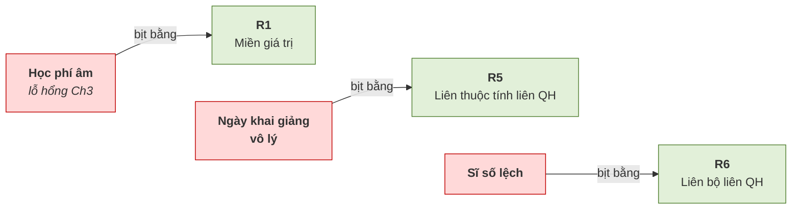
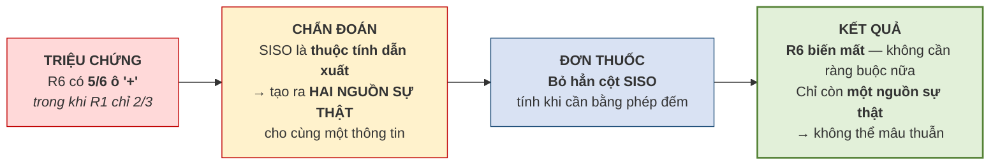

# 4.7. Thực hành phát hiện ràng buộc toàn vẹn

*(1,0 tiết)*

## 4.7.1. Lược đồ Trung tâm ABC bổ sung

Để có đủ tình huống cho cả sáu loại, lược đồ Chương 3 được bổ sung vài thuộc tính:

```
GIAOVIEN  (MAGV, HOTEN_GV, BANGCAP)
KHOAHOC   (MAKH, TENKH, NGAYTL)                            ← thêm NGAYTL
HOCVIEN   (MAHV, HOTEN, NGAYSINH)
LOP       (MALOP, TENLOP, NGAYKG, NGAYKT, SUCCHUA, SISO,   ← thêm NGAYKT, SUCCHUA, SISO
           MAGV↗GIAOVIEN, MAKH↗KHOAHOC)
DIENTHOAI (MAHV↗HOCVIEN, SODT)
GHIDANH   (MAHV↗HOCVIEN, MALOP↗LOP, NGAYGHIDANH, HOCPHI)
TIENQUYET (MAKH_truoc↗KHOAHOC, MAKH_sau↗KHOAHOC)
```

## 4.7.2. Sáu câu hỏi để không bỏ sót

{width=55%}

*Ảnh minh họa: phi hành gia đọc danh sách kiểm tra (checklist) trước khi thao tác. Nghề nào cũng cần một danh sách như vậy để không bỏ sót; sáu câu hỏi dưới đây là checklist của người thiết kế khi đi "săn" ràng buộc — Nguồn: Wikimedia Commons · NASA · Public domain.*

Bảng 4.6 được chuyển thành một **quy trình sáu câu hỏi**. Đi lần lượt qua sáu câu này thì không bỏ sót loại nào.

**Bảng 4.21. Sáu câu hỏi phát hiện ràng buộc**

| # | Câu hỏi | Nếu có thì đó là |
|:--:|---|---|
| ① | Có cột nào cần **giới hạn giá trị** không? | Miền giá trị |
| ② | Có **hai cột trong cùng một dòng** liên quan nhau không? | Liên thuộc tính |
| ③ | Có gì phải **duy nhất** không? | Liên bộ |
| ④ | Có **khóa ngoại** nào không? | Khóa ngoại |
| ⑤ | Có **cột ở hai bảng khác nhau** liên quan nhau không? | Liên thuộc tính liên quan hệ |
| ⑥ | Có phép **đếm** hoặc **tính tổng** nào không? | Liên bộ liên quan hệ |

Kinh nghiệm cho thấy người học hay bỏ sót câu ⑤ và ⑥, vì hai loại ấy **không lộ ra khi nhìn từng bảng riêng lẻ**. Muốn phát hiện chúng phải đặt các bảng cạnh nhau và hỏi *"có gì phải khớp giữa hai bảng này không"*.

## 4.7.3. Bộ sáu ràng buộc đầy đủ

Áp sáu câu hỏi vào lược đồ ABC, ta thu được một bộ ràng buộc **phủ đủ cả sáu loại**.

**Bảng 4.22. Sáu ràng buộc toàn vẹn của Trung tâm ABC**

| Mã | Phát biểu | Biểu thức | Loại | Bối cảnh |
|:--:|---|---|---|:--:|
| **R1** | Học phí phải dương | `∀t ∈ GHIDANH : t.HOCPHI > 0` | Miền giá trị | 1 QH |
| **R2** | Ngày kết thúc không sớm hơn ngày khai giảng | `∀t ∈ LOP : t.NGAYKT ≥ t.NGAYKG` | Liên thuộc tính | 1 QH |
| **R3** | Không hai học viên trùng mã | `∀t₁ ≠ t₂ ∈ HOCVIEN : t₁.MAHV ≠ t₂.MAHV` | Liên bộ | 1 QH |
| **R4** | Mã học viên trong ghi danh phải tồn tại | `∀g ∈ GHIDANH, ∃h ∈ HOCVIEN : g.MAHV = h.MAHV` | Khóa ngoại | 2 QH |
| **R5** | Lớp không khai giảng trước khi khóa học thành lập | `∀l ∈ LOP, ∀k ∈ KHOAHOC : (l.MAKH = k.MAKH) ⇒ (l.NGAYKG ≥ k.NGAYTL)` | Liên thuộc tính liên QH | 2 QH |
| **R6** | Sĩ số bằng số học viên đã ghi danh | `∀l ∈ LOP : l.SISO = \|{g ∈ GHIDANH : g.MALOP = l.MALOP}\|` | Liên bộ liên QH | 2 QH |

Bộ sáu này là **mẫu đối chiếu** rất hữu ích: khi làm bài tập cho bài toán khác, người học có thể so với bộ này để kiểm tra xem đã đủ sáu loại chưa.

## 4.7.4. Ba món nợ từ Chương 3 đã trả xong

**Hình 4.9. Ba lỗ hổng của Chương 3 và ràng buộc bịt chúng**



## 4.7.5. Cờ đỏ thiết kế — khi một ràng buộc quá khó

Hãy lập bảng tầm ảnh hưởng cho **R6** và so với **R1**. Bảng 4.18 ở mục 4.6.3 đã cho thấy R6 bị vi phạm ra sao *(lớp A2 ghi `SISO = 2` trong khi đếm được 3)*; giờ hãy hỏi câu hỏi vàng cho từng ô để biết **thao tác nào** có thể tạo ra tình trạng lệch đó.

**Bảng 4.23. Bảng tầm ảnh hưởng của R6**

| Quan hệ | Thêm | Xóa | Sửa | Suy luận |
|---|:--:|:--:|:--:|---|
| `LOP` | **+** | − | **+** *(SISO)* | Thêm lớp với `SISO = 30` mà chưa ai ghi danh → sai ngay. Xóa lớp thì mất cả hai vế nên vẫn nhất quán. Sửa `SISO` tùy tiện → sai |
| `GHIDANH` | **+** | **+** | **+** *(MALOP)* | Thêm hoặc xóa một lượt ghi danh làm **số đếm đổi** nhưng `SISO` **không đổi** → lệch. Đổi `MALOP` làm **lệch cả hai lớp** |

**Bảng 4.24. So sánh mức độ khó của hai ràng buộc**

| Ràng buộc | Số ô `+` | Ý nghĩa |
|---|:--:|---|
| **R1** — học phí dương | **2/3** | Bình thường — ràng buộc đơn giản, dễ thực thi |
| **R6** — sĩ số bằng số ghi danh | **5/6** | **Bất thường** — gần như mọi thao tác đều nguy hiểm |

Con số 5/6 là một **triệu chứng**. Khi gần như mọi thao tác đều có thể phá vỡ một ràng buộc, đó là dấu hiệu có gì đó sai từ gốc.

**Hình 4.10. Chẩn đoán và đơn thuốc cho R6**



Chẩn đoán này chính là câu hỏi đã treo lại từ **mục 2.2.5** của Chương 2, khi bàn thuộc tính dẫn xuất *"lưu lại hay tính lại"*. Đến đây đã có câu trả lời đầy đủ: lưu lại tạo ra **hai nguồn sự thật** cho cùng một thông tin, và hai nguồn sự thật thì sớm muộn cũng mâu thuẫn — đúng chuỗi nhân quả *dư thừa → không nhất quán* của mục 1.3.3.

!!! warning "Chú ý — một nguyên tắc nghề nghiệp quan trọng"

    ***Một ràng buộc quá khó thực thi thường là lời tố cáo về thiết kế, không phải về công cụ.***

    | Cách tiếp cận | Khi gặp ràng buộc khó |
    |---|---|
    | Người mới | Đi tìm **công cụ mạnh hơn** — viết trigger phức tạp, thêm mã kiểm tra |
    | Người có kinh nghiệm | **Dừng lại** và hỏi: *"thiết kế của mình có vấn đề không?"* |

    Rất nhiều trường hợp, **sửa thiết kế thì ràng buộc tự biến mất**. Ý này dẫn thẳng vào Chương 5.

---


---

[← Trang trước](4-6-rang-buoc-toan-ven-boi-canh-nhieu-quan-he.md) · [Trang sau →](4-8-vi-du-tong-hop-hoan-thien-thiet-ke-abc.md)
