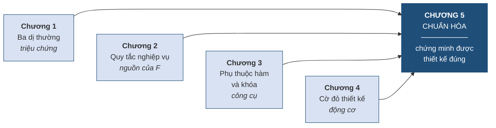

# 5.1. Thế nào là một cơ sở dữ liệu "tốt"

*(0,5 tiết)*

## 5.1.1. Bốn chương và một điểm chung

**Bảng 5.1. Bốn chương — căn cứ ra quyết định**

| Chương | Căn cứ khi quyết định tách bảng | Chứng minh được? |
|---|---|:--:|
| Chương 1 | *"Thấy giá trị lặp lại thì tách"* | Không |
| Chương 2 | *"Thấy quan hệ nhiều–nhiều thì tách"* | Không |
| Chương 3 | *"Quy tắc ánh xạ bảo thế"* | Không |
| Chương 4 | *"Thấy ràng buộc khó thì sửa thiết kế"* | Không |
| **Chương 5** | **Phụ thuộc hàm và dạng chuẩn** | **Có** |

Mọi thứ bốn chương qua đều hội tụ về chương này.

**Hình 5.1. Bốn chương hội tụ về Chương 5**

## 5.1.2. Định nghĩa "tốt" đo được

Từ *"tốt"* trong câu *"thiết kế cơ sở dữ liệu tốt"* xưa nay vẫn mơ hồ. Chương này thay nó bằng một định nghĩa **kiểm tra được**.

!!! note "Định nghĩa 5.1"

    Một lược đồ cơ sở dữ liệu được gọi là **tốt** nếu nó thỏa mãn **bốn tiêu chí**:

    1. **Không dư thừa** — mỗi sự thật được lưu ở **đúng một chỗ**.
    2. **Không có dị thường** thêm, sửa, xóa.
    3. **Bảo toàn thông tin** — tách ra rồi ghép lại phải được **đúng dữ liệu ban đầu**.
    4. **Bảo toàn phụ thuộc hàm** — mọi quy tắc nghiệp vụ vẫn kiểm tra được **không cần ghép bảng**.

**Bảng 5.2. Bốn tiêu chí — công cụ kiểm tra tương ứng**

| Tiêu chí | Kiểm bằng cách nào | Học ở mục |
|---|---|---|
| Không dư thừa | Xét **dạng chuẩn** đạt được | 5.7, 5.10 |
| Không dị thường | Hệ quả của tiêu chí 1 — xem *bảng vàng* | 5.7.6 |
| Bảo toàn thông tin | Điều kiện **lossless join** | 5.8.2 |
| Bảo toàn phụ thuộc hàm | Đối chiếu tập `F` với các bảng con | 5.8.3 |

Điểm quan trọng: bốn tiêu chí này **không phải lúc nào cũng đạt được cùng lúc**. Mục 5.8.4 sẽ chứng minh rằng đôi khi phải **chọn** giữa tiêu chí 1 và tiêu chí 4 — và đó là lý do trong thực tế người ta thường **dừng ở 3NF** thay vì leo lên BCNF.

## 5.1.3. Vị trí của chuẩn hóa trong quy trình thiết kế

Chuẩn hóa **không thay thế** thiết kế ER; nó bổ sung. Có hai cách dùng, và cả hai đều hợp lệ.

**Cách thứ nhất — kiểm tra lại.** Thiết kế ER trước *(Chương 2)*, ánh xạ sang quan hệ *(Chương 3)*, rồi **dùng chuẩn hóa để kiểm tra** kết quả. Nếu lược đồ đã đạt 3NF thì thiết kế ER đã tốt; nếu chưa, đó là dấu hiệu mô hình ER còn thiếu sót. Đây là cách dùng phổ biến nhất trong dự án thực tế.

**Cách thứ hai — chuẩn hóa từ đầu.** Xuất phát từ một bảng phẳng có sẵn *(chẳng hạn tệp Excel của khách hàng)* và chuẩn hóa dần lên. Cách này dùng khi cải tạo hệ thống cũ, và cũng chính là cách mục 5.9 sẽ minh họa.

!!! warning "Chú ý"

    Người học đôi khi hiểu nhầm rằng *"chuẩn hóa là để tiết kiệm dung lượng"*. Không phải. Dung lượng chỉ là hệ quả phụ, và ngày nay rất rẻ. **Mục đích thật sự của chuẩn hóa là loại bỏ dị thường** — tức bảo đảm dữ liệu **đúng**, không mâu thuẫn. Đây chính là chuỗi nhân quả đã nêu ở mục 1.3.3: dư thừa dẫn tới không nhất quán, không nhất quán dẫn tới quyết định sai.

---

---

[← Trang trước](index.md) · [Trang sau →](5-2-ba-loai-phu-thuoc-ham.md)
