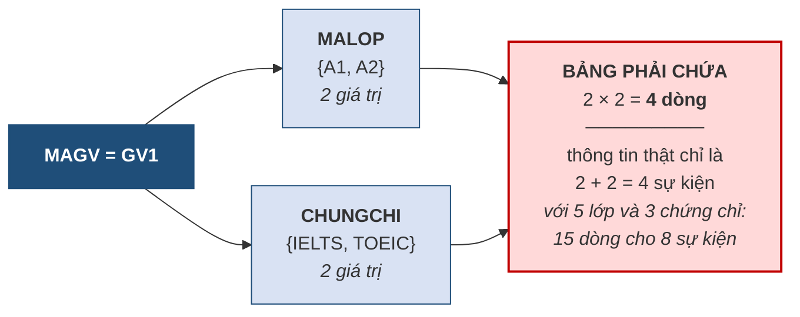

# 5.10. Dạng chuẩn mức cao và phi chuẩn hóa

*(0,5 tiết — xem lưu ý về thời lượng ở đầu chương)*

## 5.10.1. Dạng chuẩn Boyce–Codd

!!! note "Định nghĩa 5.17"

    Quan hệ `R` đạt **BCNF** nếu với **mọi** phụ thuộc hàm không tầm thường `X → A` trong `F`, `X` **luôn là siêu khóa**.

So sánh với định nghĩa 3NF ở mục 5.7.4, khác biệt nằm ở chỗ BCNF **bỏ đi vế "hoặc `A` là thuộc tính khóa"**. Đó là điều kiện chặt hơn.

**Bảng 5.10. 3NF và BCNF khác nhau ở đâu**

| | 3NF | BCNF |
|---|---|---|
| Điều kiện với mọi `X → A` | `X` là siêu khóa **HOẶC** `A` là thuộc tính khóa | `X` là siêu khóa |
| Bảo toàn phụ thuộc hàm | **Luôn đạt được** | **Không phải lúc nào cũng** |
| Khi nào hai cái khác nhau | Chỉ khi lược đồ có **nhiều khóa dự tuyển chồng lấn nhau** | |

Điểm cuối cùng đáng nhấn mạnh: với phần lớn lược đồ thực tế — những lược đồ chỉ có một khóa, hoặc có nhiều khóa nhưng không chồng lấn — **3NF và BCNF là một**. Khác biệt chỉ xuất hiện trong tình huống khá đặc thù, và đó là lý do thực hành thường dừng ở 3NF.

## 5.10.2. Phụ thuộc đa trị

Có một loại dư thừa mà **BCNF không diệt được**. Xét tình huống sau tại Trung tâm ABC.

!!! example "Ví dụ 5.8"

    Trung tâm muốn lưu: mỗi giáo viên dạy những lớp nào, và có những chứng chỉ gì. Hai thông tin này **hoàn toàn độc lập với nhau** — chứng chỉ của giáo viên không liên quan gì tới lớp cụ thể mà người ấy dạy.

    `GV_LOP_CC(MAGV, MALOP, CHUNGCHI)`

    | MAGV | MALOP | CHUNGCHI |
    |---|---|---|
    | GV1 | A1 | IELTS |
    | GV1 | A1 | TOEIC |
    | GV1 | A2 | IELTS |
    | GV1 | A2 | TOEIC |

    Giáo viên GV1 dạy 2 lớp và có 2 chứng chỉ, nên bảng phải chứa **2 × 2 = 4 dòng** — một sự **bùng nổ tích**. Nếu GV1 dạy 5 lớp và có 3 chứng chỉ thì cần 15 dòng, trong khi lượng thông tin thật chỉ là 5 + 3 = 8.

    Điều đáng chú ý: bảng này **đạt BCNF**. Khóa là cả ba thuộc tính `(MAGV, MALOP, CHUNGCHI)`, và **không có phụ thuộc hàm không tầm thường nào** — nên điều kiện BCNF thỏa mãn một cách rỗng. Vậy mà dư thừa vẫn còn nguyên.

    **Định nghĩa 5.18.** Cho quan hệ `R` và ba tập thuộc tính `X`, `Y`, `Z` với `Z = R − X − Y`. Ta nói `Y` **phụ thuộc đa trị** vào `X`, ký hiệu **`X ↠ Y`**, nếu: với mọi cặp bộ `t₁`, `t₂` có `t₁[X] = t₂[X]`, luôn tồn tại bộ `t₃` trong `R` sao cho `t₃[X] = t₁[X]`, `t₃[Y] = t₁[Y]` và `t₃[Z] = t₂[Z]`.

Cách hiểu thực dụng, bỏ qua ký hiệu: **`X ↠ Y` nghĩa là với mỗi giá trị của `X`, tập giá trị `Y` là cố định và hoàn toàn độc lập với tập giá trị `Z`.**

**Hình 5.11. Phụ thuộc đa trị — hai nhánh độc lập gây bùng nổ tích**



Hai tính chất cần nhớ. Thứ nhất, **phụ thuộc đa trị luôn xuất hiện theo cặp**: nếu `X ↠ Y` thì cũng có `X ↠ Z`. Thứ hai, **phụ thuộc hàm là trường hợp riêng của phụ thuộc đa trị** — nếu `X → Y` thì `X ↠ Y`.

Phụ thuộc đa trị gọi là **tầm thường** nếu `Y ⊆ X` hoặc `X ∪ Y = R`; các trường hợp còn lại là **không tầm thường**.

## 5.10.3. Dạng chuẩn 4 và thuật toán tách

!!! note "Định nghĩa 5.19"

    Quan hệ `R` đạt **dạng chuẩn 4 (4NF)** nếu nó đạt BCNF và với **mọi** phụ thuộc đa trị không tầm thường `X ↠ Y` trong `R`, `X` **luôn là siêu khóa**.

**Thuật toán tách về 4NF:**

```
LẶP cho tới khi không còn vi phạm:
    TÌM một phụ thuộc đa trị không tầm thường  X ↠ Y  trong R
        mà X KHÔNG phải siêu khóa
    NẾU tìm thấy:
        Đặt  Z = R − X − Y
        Tách R thành:   R1 = X ∪ Y      và     R2 = X ∪ Z
        Áp lại thuật toán cho R1 và R2
```

> **Định lý 5.3 (Fagin).** Phép tách theo một phụ thuộc đa trị **luôn bảo toàn thông tin**.

Đây là một kết quả rất tiện: khác với BCNF, ta không phải lo kiểm tra điều kiện lossless — tách theo phụ thuộc đa trị thì tự động bảo toàn.

!!! example "Ví dụ 5.9 — áp dụng cho Ví dụ 5.8"

    Trong `GV_LOP_CC(MAGV, MALOP, CHUNGCHI)` ta có `MAGV ↠ MALOP` *(và do đó `MAGV ↠ CHUNGCHI`)*, mà `MAGV` **không phải siêu khóa** — khóa là cả ba thuộc tính. Vậy lược đồ **vi phạm 4NF**.

    Đặt `X = {MAGV}`, `Y = {MALOP}`, `Z = {CHUNGCHI}`. Tách:

    ```
    GV_LOP(MAGV, MALOP)
    GV_CC (MAGV, CHUNGCHI)
    ```

    `GV_LOP`

    | MAGV | MALOP |
    |---|---|
    | GV1 | A1 |
    | GV1 | A2 |

    `GV_CC`

    | MAGV | CHUNGCHI |
    |---|---|
    | GV1 | IELTS |
    | GV1 | TOEIC |

    Từ **4 dòng** xuống còn **2 + 2 = 4 dòng**, nhưng với 5 lớp và 3 chứng chỉ thì từ **15 dòng** xuống còn **8 dòng** — và tỷ lệ tiết kiệm càng lớn khi dữ liệu càng nhiều. Quan trọng hơn: thêm một chứng chỉ mới nay chỉ cần **thêm một dòng**, thay vì thêm một dòng cho **mỗi lớp** giáo viên đang dạy.

    Theo Định lý 5.3, phép tách này bảo toàn thông tin — ghép `GV_LOP ⋈ GV_CC` cho lại đúng bảng gốc.

    **Chú ý — dấu hiệu nhận biết trên thực tế.** Vi phạm 4NF thường lộ ra khi một bảng chứa **hai danh sách độc lập** gắn với cùng một chủ thể. Câu hỏi để kiểm tra: *"hai thông tin này có liên quan gì tới nhau không, hay chúng chỉ tình cờ cùng thuộc về một người?"* Nếu chúng độc lập, bảng đang vi phạm 4NF và phải tách.

    Trên 4NF còn có **5NF** *(dạng chuẩn nối)*, xử lý các trường hợp phải tách thành **ba bảng trở lên** mới bảo toàn thông tin. Loại này rất hiếm trong thực tế và nằm ngoài phạm vi học phần.

## 5.10.4. Phi chuẩn hóa

Toàn bộ chương này hướng tới việc chuẩn hóa. Mục cuối cùng nói về việc **cố ý đi ngược lại**.

!!! note "Định nghĩa 5.20"

    **Phi chuẩn hóa** *(denormalization)* là việc **cố ý đưa dư thừa trở lại** lược đồ đã chuẩn hóa, nhằm đánh đổi lấy **tốc độ truy vấn**.

Lý do rất thực tế. Chuẩn hóa tách bảng ra nhiều, mà càng nhiều bảng thì truy vấn càng phải **ghép nhiều lần**. Với hệ thống báo cáo chạy trên hàng chục triệu dòng, chi phí ghép bảng có thể lớn tới mức không chấp nhận được.

**Bảng 5.11. Khi nào phi chuẩn hóa là hợp lý**

| Điều kiện | Vì sao |
|---|---|
| Dữ liệu **chủ yếu để đọc**, rất ít sửa | Dị thường sửa gần như không xảy ra |
| Hệ thống là **kho dữ liệu** hoặc báo cáo phân tích | Mục đích là tổng hợp nhanh, không phải giao dịch |
| Truy vấn ghép bảng đã đo được là **nút thắt hiệu năng** | Có bằng chứng, không phải phỏng đoán |
| Có **cơ chế bảo đảm** dữ liệu dư thừa luôn khớp | Trigger, hoặc quy trình nạp lại định kỳ |

!!! warning "Chú ý — thứ tự bắt buộc"

    Phi chuẩn hóa **chỉ được làm sau khi đã chuẩn hóa**, và phải là một **quyết định có ý thức, có ghi lại lý do**. Nó hoàn toàn khác với việc thiết kế cẩu thả ngay từ đầu. Người thiết kế phi chuẩn hóa **biết mình đang chấp nhận rủi ro gì và đổi lấy điều gì**; người thiết kế cẩu thả thì không.

Đến đây, câu hỏi treo từ **mục 2.2.5** của Chương 2 — *thuộc tính dẫn xuất `SISO` nên lưu hay tính lại* — có câu trả lời trọn vẹn:

| Chương | Câu trả lời |
|---|---|
| Chương 2 | *"Nguyên tắc là không lưu, vì lưu tạo ra dư thừa"* |
| Chương 4 | *"Lưu thì ràng buộc R6 có 5/6 ô `+` — cờ đỏ thiết kế, nên bỏ"* |
| **Chương 5** | *"Bỏ là đúng với hệ thống giao dịch. Nhưng nếu đây là kho dữ liệu báo cáo, đọc nhiều sửa ít, thì **lưu lại là phi chuẩn hóa hợp lý** — miễn là có cơ chế bảo đảm nó luôn khớp và có ghi lại lý do."* |

Ba câu trả lời không mâu thuẫn: chúng cho thấy **cùng một quyết định thiết kế có thể đúng hoặc sai tùy ngữ cảnh**, và điều làm nên người thiết kế giỏi là biết **hỏi đúng câu hỏi về ngữ cảnh** trước khi quyết định.

---


---

[← Trang trước](5-9-quy-trinh-chuan-hoa-hoan-chinh.md) · [Trang sau →](5-11-khep-lai-hoc-phan.md)
