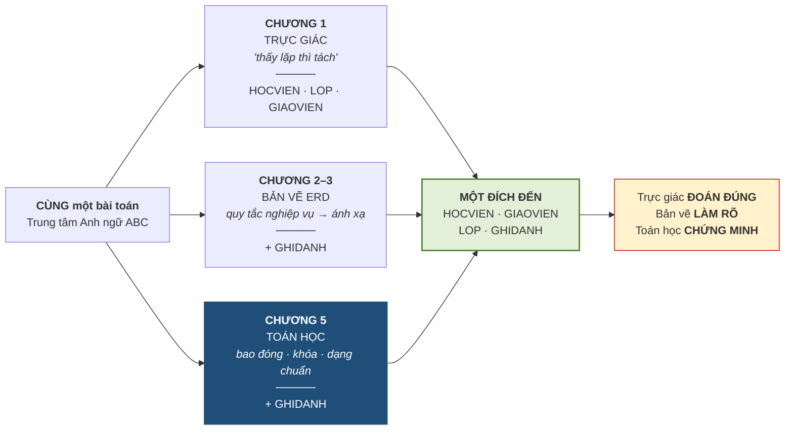
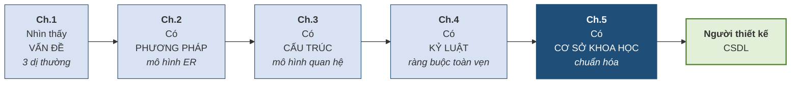

# 5.11. Khép lại học phần

## 5.11.1. Ba con đường, một đích đến

**Hình 5.12. Trực giác, bản vẽ, toán học — cùng ra một kết quả**

Ba con đường cho **cùng một kết quả** — nhưng khác biệt là rất lớn.

| | Chương 1 | Chương 5 |
|---|---|---|
| **Cơ sở tin tưởng** | Ta **tin** thiết kế đúng vì *"trông có vẻ ổn"* | Ta **chứng minh được** |
| **Nếu có người phản đối** | Không có gì để bảo vệ — cảm tính chọi cảm tính | Đưa chứng minh ra: đạt 3NF, tách bảo toàn thông tin, đã diệt đúng hai thủ phạm |
| **Khi bài toán lớn lên** | Trực giác **thất bại** | Thuật toán **vẫn chạy** |

> **Đây chính là bước trưởng thành của một người thiết kế cơ sở dữ liệu: từ *"tôi nghĩ thế này đúng"* sang *"tôi chứng minh được thế này đúng"*.**

## 5.11.2. Ba dị thường của Chương 1 — kiểm chứng lần cuối

**Bảng 5.12. Ba dị thường trên lược đồ 3NF**

| Dị thường *(Chương 1)* | Trên lược đồ 3NF | Kết quả |
|---|---|:--:|
| **Sửa**: cô Lê Hoa đổi tên hoặc số điện thoại | Nằm ở **đúng một dòng** trong `GIAOVIEN` → sửa một lần, **không thể** mâu thuẫn | Đã diệt |
| **Thêm**: mở lớp A3 chưa có học viên nào | Thêm thẳng vào `LOP`, **không cần** học viên nào | Đã diệt |
| **Xóa**: học viên cuối cùng của lớp nghỉ | Xóa khỏi `GHIDANH`; `LOP` và `GIAOVIEN` **nguyên vẹn** | Đã diệt |

Cả ba đã bị loại bỏ — và lần này ta biết **chính xác vì sao**. Không phải mơ hồ *"vì ta tách bảng"* như câu trả lời của Chương 1, mà vì ta đã **diệt đúng hai thủ phạm**: phụ thuộc **bộ phận** *(2NF)* và phụ thuộc **bắc cầu** *(3NF)*.

## 5.11.3. Thu hồi mọi lời hẹn

Học phần đã treo lại nhiều lời hẹn. Đây là chỗ trả hết.

**Bảng 5.13. Mọi lời hẹn và nơi trả**

| Lời hẹn | Treo ở | Trả tại |
|---|---|---|
| *"Chương 5 sẽ chuẩn hóa lại đúng bảng này bằng toán học, và ra đúng những bảng ta vừa đoán"* | mục 1.7 | **5.9** |
| *"Mỗi ô một giá trị đơn — sẽ được gọi tên chính thức ở Chương 5"* | mục 2.2.4 · 3.1.3 | **5.7.2** *(1NF)* |
| *"Thuộc tính dẫn xuất `SISO` sẽ được bàn lại dưới tên phi chuẩn hóa"* | mục 2.2.5 · 4.7.5 | **5.10.4** |
| *"Phụ thuộc hàm là quy tắc nghiệp vụ, Chương 5 sẽ dùng nó làm công cụ chuẩn hóa"* | mục 3.2.2 | **5.2** |
| *"Ràng buộc quá khó thường tố cáo thiết kế — ý này dẫn vào Chương 5"* | mục 4.7.5 | **5.8.4** |
| *"Bốn chương đều dựa vào cảm tính; Chương 5 cho công cụ chứng minh"* | Bảng 4.13 | **5.1 · 5.11** |

## 5.11.4. Hành trình năm chương

**Hình 5.13. Hành trình năm chương**

Học phần khép lại ở đây, nhưng công việc thì không. Điều học phần này trao cho người học không phải là một bộ quy tắc để học thuộc, mà là **một cách suy nghĩ**: trước khi lưu bất kỳ dữ liệu nào, hãy hỏi *"sự thật này thuộc về đâu, và nó có đang bị lưu ở hai chỗ không?"*

Bước tiếp theo là học phần **Hệ quản trị cơ sở dữ liệu**, nơi những lược đồ vừa thiết kế sẽ được cài đặt thật bằng SQL, cùng với các vấn đề mà học phần này đã hoãn lại: ngôn ngữ truy vấn, an toàn — bảo mật, và quản lý giao dịch.

---

---

[← Trang trước](5-10-dang-chuan-muc-cao-va-phi-chuan-hoa.md) · [Trang sau →](tom-tat.md)
