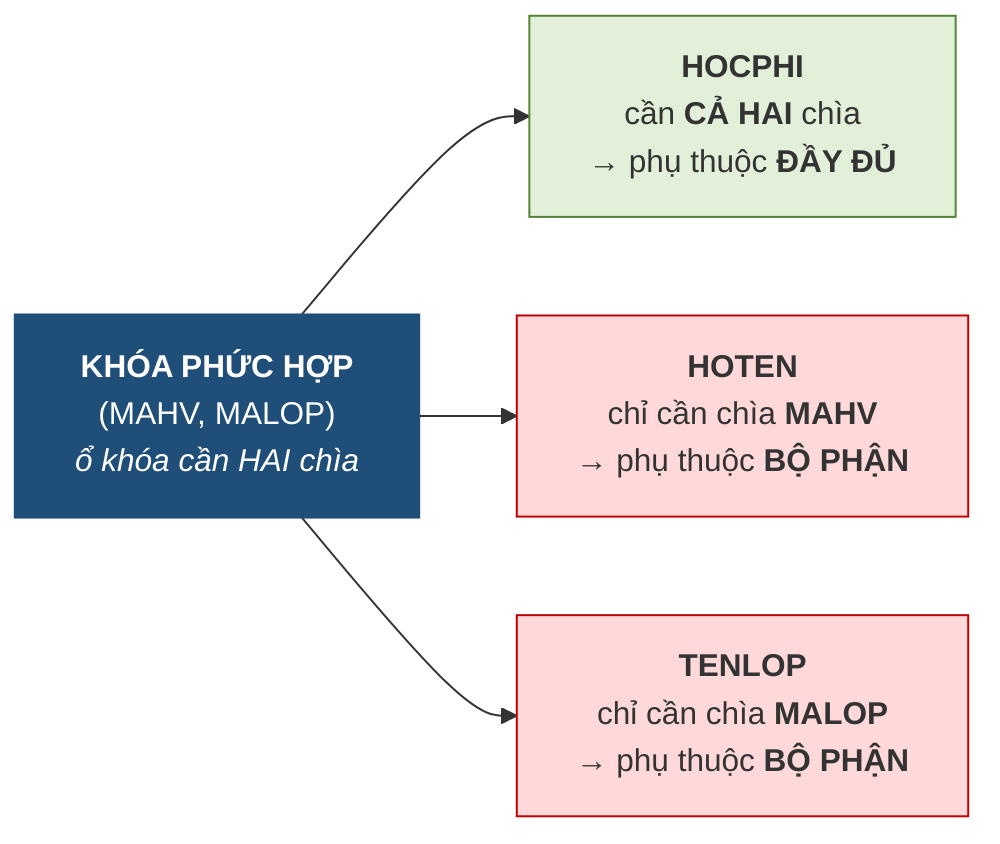
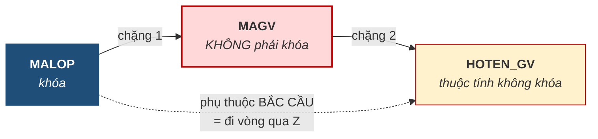

# 5.2. Ba loại phụ thuộc hàm

*(1,0 tiết)*

## 5.2.1. Nhắc lại và mở rộng

Mục 3.2.2 đã định nghĩa phụ thuộc hàm `X → Y`: *biết `X` thì biết chắc `Y`*. Ở Chương 3 khái niệm này chỉ dùng để định nghĩa khóa. Từ đây nó trở thành **công cụ phân tích chính**.

Cần nhắc lại một cảnh báo đã nêu ở Chương 3, vì nó là nguồn sai lầm phổ biến nhất của cả chương này:

!!! warning "Chú ý"

    Tập phụ thuộc hàm `F` đến từ **quy tắc nghiệp vụ**, **không phải** từ việc nhìn dữ liệu mẫu. Nếu bảng hiện có 3 dòng và tình cờ không ai trùng tên, ta **không được** kết luận `HOTEN → MAHV`. Câu hỏi đúng luôn là: *"nghiệp vụ có cho phép hai học viên trùng tên không?"* Toàn bộ chương này đứng trên `F`; `F` sai thì mọi kết quả sau đó đều sai.

**Bảng 5.3. Ba loại phụ thuộc hàm**

| Loại | Định nghĩa ngắn | Có hại không |
|---|---|---|
| **Đầy đủ** *(full)* | `X → Y` mà **không tập con thực sự nào** của `X` xác định được `Y` | Không — đây là dạng mong muốn |
| **Bộ phận** *(partial)* | `Y` phụ thuộc vào **một phần** của khóa phức hợp | **Có** — vi phạm 2NF |
| **Bắc cầu** *(transitive)* | `K → Z → Y`, trong đó `Z` **không phải khóa** | **Có** — vi phạm 3NF |

Hai loại sau là **hai thủ phạm** gây ra dị thường, và toàn bộ việc chuẩn hóa lên 3NF chính là **diệt lần lượt hai thủ phạm này**.

## 5.2.2. Phụ thuộc hàm đầy đủ

!!! note "Định nghĩa 5.2"

    Phụ thuộc hàm `X → Y` là **đầy đủ** nếu với mọi tập con thực sự `X' ⊂ X`, ta **không có** `X' → Y`.

!!! example "Ví dụ 5.1"

    Trong bảng `GHIDANH(MAHV, MALOP, HOCPHI)` với khóa `(MAHV, MALOP)`:

    - `(MAHV, MALOP) → HOCPHI` là **đầy đủ**: biết riêng học viên không đủ suy ra học phí *(mỗi học viên đóng nhiều mức cho nhiều lớp)*, biết riêng lớp cũng không đủ *(mỗi lớp thu nhiều mức tùy ưu đãi)*.

## 5.2.3. Phụ thuộc bộ phận

!!! note "Định nghĩa 5.3"

    Phụ thuộc hàm `X → Y` là **bộ phận** nếu tồn tại tập con thực sự `X' ⊂ X` sao cho `X' → Y`. Nói cách khác: `Y` chỉ cần **một phần** của `X` là đã xác định được.

{width=45%}

*Ảnh minh họa: phòng két an toàn của một ngân hàng. Mỗi ngăn chỉ mở được khi tra đủ hai chìa — chìa của ngân hàng và chìa của khách. Một khóa phức hợp cũng vậy: thuộc tính nào chỉ cần một trong hai chìa là đã mở được, thuộc tính ấy đang phụ thuộc bộ phận — Nguồn: Wikimedia Commons · FUAALIW kwo naucm · CC BY-SA 4.0.*

Loại này chỉ xuất hiện khi khóa là **khóa phức hợp** — vì phải có "phần" thì mới có "một phần".

**Hình 5.2. Phụ thuộc bộ phận — phép loại suy ổ khóa hai chìa**

Vì sao phụ thuộc bộ phận gây hại? Vì nó **buộc dữ liệu phải lặp lại**. Nếu `HOTEN` chỉ phụ thuộc vào `MAHV` nhưng lại nằm trong bảng có khóa `(MAHV, MALOP)`, thì học viên ghi danh bao nhiêu lớp, tên của người đó **lặp lại bấy nhiêu lần** — đúng gốc rễ dư thừa của mục 1.3. Bảng dưới đây cho thấy điều đó trên bốn dòng dữ liệu.

**Bảng 5.4. Phụ thuộc bộ phận nhìn trên dữ liệu — `GHIDANH_MORONG` với khóa `(MAHV, MALOP)`**

| MAHV | MALOP | HOTEN | HOCPHI |
|---|---|---|---|
| HV01 | A1 | **Trần An** | 2.000.000 |
| HV01 | A2 | **Trần An** | 2.500.000 |
| HV01 | A3 | **Trần An** | 2.200.000 |
| HV02 | A1 | Lê Bình | 1.800.000 |

| Thuộc tính | Phụ thuộc vào | Loại | Hệ quả trên bảng |
|---|---|---|---|
| `HOTEN` | chỉ `MAHV` — **nửa khóa** | **Bộ phận** | HV01 ghi danh ba lớp → "Trần An" chép **ba lần**; sửa một dòng thành "Trần Văn An" là mâu thuẫn ngay |
| `HOCPHI` | cả `(MAHV, MALOP)` | Đầy đủ | Mỗi dòng một giá trị riêng, không lặp |

Che cột `MALOP` đi, cột `HOTEN` vẫn đọc được từ `MAHV` — đó là dấu hiệu nhận biết phụ thuộc bộ phận nhanh nhất khi nhìn dữ liệu.

## 5.2.4. Phụ thuộc bắc cầu

!!! note "Định nghĩa 5.4"

    Phụ thuộc hàm là **bắc cầu** nếu tồn tại chuỗi `K → Z → Y`, trong đó `K` là khóa, `Z` **không phải khóa và không phải tập con của khóa**, còn `Y` là thuộc tính không khóa.

**Hình 5.3. Phụ thuộc bắc cầu — phải đi hai chặng**

Vì sao bắc cầu gây hại? Cũng vì lặp lại, nhưng theo cơ chế khác. Nếu `HOTEN_GV` nằm trong bảng `LOP`, thì một giáo viên phụ trách bao nhiêu lớp, tên của người ấy **lặp lại bấy nhiêu lần**. Đây chính xác là tình huống cô Lê Hoa lặp ba lần ở Bảng 1.5 của Chương 1 — nay đã có tên gọi.

**Bảng 5.5. Phụ thuộc bắc cầu nhìn trên dữ liệu — `LOP` với khóa `MALOP`**

| MALOP | TENLOP | MAGV | HOTEN_GV |
|---|---|---|---|
| A1 | Anh cơ bản 1 | GV1 | **Lê Hoa** |
| A3 | Anh nâng cao | GV1 | **Lê Hoa** |
| A4 | Luyện thi IELTS | GV1 | **Lê Hoa** |
| A2 | Anh giao tiếp | GV2 | Trần Mai |

| Chặng | Phụ thuộc | Đọc |
|:--:|---|---|
| 1 | `MALOP → MAGV` | biết lớp thì biết mã giáo viên |
| 2 | `MAGV → HOTEN_GV` | biết mã giáo viên thì biết tên |
| 1 + 2 | `MALOP → HOTEN_GV` *(đi vòng)* | tên giáo viên "bám" vào lớp qua trung gian `MAGV` — nên cô Lê Hoa dạy ba lớp thì tên chép ba lần |

Hai dị thường lộ ra ngay: **sửa** tên ở dòng A1 thành "Lê Thị Hoa" thì hai dòng còn lại lệch; **xóa** lớp A2 thì mất luôn việc trung tâm có cô Trần Mai. Cả hai đều biến mất khi tách `GIAOVIEN(MAGV, HOTEN_GV)` ra riêng — tức cắt đứt chặng 2 khỏi bảng `LOP`.

!!! warning "Chú ý — điều kiện `Z` không phải khóa là bắt buộc"

    Nếu `Z` cũng là một khóa dự tuyển thì chuỗi `K → Z → Y` **không phải** phụ thuộc bắc cầu có hại, vì lúc ấy `Z` xác định duy nhất mỗi dòng nên không gây lặp. Bỏ sót điều kiện này dẫn tới việc tách bảng không cần thiết.

!!! question "Tự kiểm tra 5.2"

    *(tự trả lời trước, rồi mở đáp án bên dưới)*

    1. Thêm cột `TENLOP` vào bảng ở Bảng 5.4. Cột này phụ thuộc vào gì, thuộc loại nào, và giá trị nào sẽ bị chép lặp?
    2. Bảng `HOCVIEN(MAHV, CCCD, HOTEN)` có `MAHV → CCCD` và `CCCD → HOTEN`. Chuỗi này có phải phụ thuộc bắc cầu **có hại** không?
    3. Bảng `GHIDANH_MORONG` hiện có bốn dòng và không có hai dòng nào trùng `HOCPHI`. Có được kết luận `HOCPHI → MAHV` không?

??? success "Đáp án tự kiểm tra 5.2"

    *(1)* `TENLOP` phụ thuộc vào `MALOP` — nửa khóa còn lại — nên cũng là **bộ phận**; "Anh cơ bản 1" chép lặp ở mọi dòng có `MALOP = A1` *(HV01 và HV02)*. *(2)* **Không có hại**: `CCCD` là khóa dự tuyển của `HOCVIEN` *(mỗi công dân một số)*, nên vi phạm điều kiện "`Z` không phải khóa"; không cần tách. *(3)* **Không**. `F` phải rút từ nghiệp vụ: hai lượt ghi danh hoàn toàn có thể cùng mức học phí, chỉ tình cờ dữ liệu hiện tại chưa có.

---

---

[← Trang trước](5-1-the-nao-la-mot-co-so-du-lieu-tot.md) · [Trang sau →](5-3-he-luat-dan-armstrong.md)
