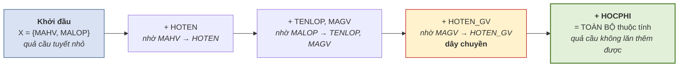

# 5.4. Bao đóng của tập thuộc tính

*(1,5 tiết)*

Đây là **công cụ trung tâm** của cả chương. Hầu hết mọi thứ sau đó — tìm khóa, xét dạng chuẩn, kiểm tra bảo toàn thông tin — đều quy về việc tính bao đóng.

## 5.4.1. Định nghĩa và thuật toán

!!! note "Định nghĩa 5.6"

    **Bao đóng** của tập thuộc tính `X` đối với tập phụ thuộc hàm `F`, ký hiệu **`X⁺`**, là **tập tất cả các thuộc tính suy ra được từ `X`** nhờ `F`.

**Thuật toán tính `X⁺`:**

```
BƯỚC 1.  Khởi tạo:  X⁺ ← X
BƯỚC 2.  Lặp lại cho tới khi X⁺ không đổi:
             với mỗi phụ thuộc  A → B  trong F
                 NẾU  A ⊆ X⁺  THÌ  X⁺ ← X⁺ ∪ B
BƯỚC 3.  Trả về X⁺
```

**Hình 5.4. Bao đóng — phép loại suy quả cầu tuyết**



{width=40%}

*Ảnh minh họa: cậu bé lăn tuyết đắp người tuyết. Quả cầu bắt đầu từ một nắm nhỏ, lăn tới đâu dính thêm tuyết tới đó, cho tới khi không dính thêm được nữa — thuật toán bao đóng lăn qua từng phụ thuộc hàm đúng như thế — Nguồn: Wikimedia Commons · DPLA · Public domain.*

Phép loại suy **quả cầu tuyết** nắm đúng bản chất: bắt đầu từ một nhúm nhỏ, lăn qua từng phụ thuộc và **dính thêm** thuộc tính mới, cho tới khi không dính thêm được gì nữa thì dừng.

!!! warning "Chú ý — điểm dễ sai nhất"

    Phải **lặp lại nhiều vòng**, không chỉ quét `F` một lượt. Ở Hình 5.4, `HOTEN_GV` chỉ dính vào **sau khi** `MAGV` đã dính — nếu chỉ quét một lượt theo thứ tự viết trong `F`, rất dễ bỏ sót. Cách an toàn là **quét lại từ đầu mỗi khi `X⁺` thay đổi**.

Bảng dưới đây dựng cố tình một `F` viết "ngược thứ tự" để thấy lỗi ấy xảy ra thế nào.

**Bảng 5.8. Tính `A⁺` với `F = {B → C, A → B}` — quét một lượt thì sót, hai vòng mới đủ**

| Vòng | Xét phụ thuộc | Vế trái `⊆ X⁺`? | `X⁺` sau bước |
|:--:|---|:--:|---|
| — | *khởi tạo* | — | `{A}` |
| 1 | `B → C` | `B ∉ {A}` → **bỏ qua** | `{A}` |
| 1 | `A → B` | Có | `{A, B}` |
| 2 | `B → C` | **Có** *(giờ đã có B)* | `{A, B, C}` |
| 2 | `A → B` | Có, không thêm gì | `{A, B, C}` |
| 3 | *quét lại* | — | không đổi → **dừng** |

Nếu dừng ngay sau vòng 1, ta kết luận sai `A⁺ = {A, B}` và tưởng `A` không phải siêu khóa của `R(A, B, C)` — trong khi thật ra `A⁺` là toàn bộ lược đồ. Chỉ một dòng bỏ sót ở đây kéo theo sai khóa, sai dạng chuẩn ở các mục sau.

## 5.4.2. Ví dụ tính từng bước

!!! example "Ví dụ 5.3"

    Cho `R(A, B, C, D)` và `F = {A → B, B → C, CD → A}`. Tính `(AD)⁺`.

    | Vòng | Xét phụ thuộc | `A ⊆ X⁺`? | `X⁺` sau bước |
    |:--:|---|:--:|---|
    | — | *khởi tạo* | — | `{A, D}` |
    | 1 | `A → B` | Có | `{A, B, D}` |
    | 1 | `B → C` | Có | `{A, B, C, D}` |
    | 1 | `CD → A` | Có | `{A, B, C, D}` *(không đổi)* |
    | 2 | *quét lại toàn bộ* | — | `{A, B, C, D}` *(không đổi → dừng)* |

    Vậy `(AD)⁺ = {A, B, C, D}` = toàn bộ thuộc tính, nên `AD` là **siêu khóa**.

## 5.4.3. Hai công dụng của bao đóng

**Công dụng thứ nhất — kiểm tra một phụ thuộc hàm có suy ra được không.**

> `X → Y` suy ra được từ `F` **khi và chỉ khi** `Y ⊆ X⁺`.

Đây là cách kiểm tra **nhanh và chắc chắn**, thay cho việc mò mẫm áp luật Armstrong.

**Công dụng thứ hai — kiểm tra một tập thuộc tính có phải siêu khóa không.**

> `X` là **siêu khóa** của `R` **khi và chỉ khi** `X⁺` = **toàn bộ** tập thuộc tính của `R`.

Công dụng này là nền tảng của thuật toán tìm khóa ở mục 5.5.

Cả hai công dụng đều quy về **một phép tính bao đóng rồi một phép so sánh**, như ba câu hỏi dưới đây trên lược đồ của Ví dụ 5.3.

**Bảng 5.9. Ba câu hỏi, ba bao đóng — `R(A, B, C, D)`, `F = {A → B, B → C, CD → A}`**

| Câu hỏi | Quy về | Tính | So sánh | Kết luận |
|---|---|---|---|---|
| `B → A` có suy ra được từ `F`? | `A ∈ B⁺`? | `B⁺ = {B, C}` | không chứa `A` | **Không** suy ra được |
| `AC → D` có suy ra được? | `D ∈ (AC)⁺`? | `(AC)⁺ = {A, C, B}` | không chứa `D` | **Không** |
| `BD` có phải siêu khóa? | `(BD)⁺ = R`? | `(BD)⁺ = {B, D, C, A}` | bằng toàn bộ `R` | **Có** — `BD` là siêu khóa |

Không cần áp luật Armstrong bằng tay lần nào; mọi câu hỏi "suy ra được không" đều trả lời bằng cách tính một bao đóng.

## 5.4.4. Phân biệt `F⁺` và `X⁺`

Hai ký hiệu trông giống nhau nhưng là **hai thứ hoàn toàn khác**, và đây là chỗ nhầm lẫn kinh điển.

**Bảng 5.10. `F⁺` và `X⁺` — hai thứ khác nhau**

| | `F⁺` | `X⁺` |
|---|---|---|
| **Đầu vào** | Một **tập phụ thuộc hàm** `F` | Một **tập thuộc tính** `X` *(kèm `F`)* |
| **Kết quả là** | Một **tập phụ thuộc hàm** | Một **tập thuộc tính** |
| **Nội dung** | Mọi phụ thuộc suy ra được từ `F` | Mọi thuộc tính suy ra được từ `X` |
| **Kích thước** | Rất lớn — **hàm mũ** | Nhỏ — không quá số thuộc tính của `R` |
| **Tính được không** | Trên lý thuyết được, thực tế **không khả thi** | **Rất dễ** — thuật toán ở mục 5.4.1 |

Câu phân biệt gọn nhất: **`F⁺` là tập các mũi tên; `X⁺` là tập các chữ cái.**

!!! warning "Chú ý"

    Chính vì `F⁺` quá lớn để tính mà toàn bộ lý thuyết chuẩn hóa được xây trên `X⁺`. Mọi câu hỏi tưởng như cần `F⁺` — *"phụ thuộc này có đúng không"*, *"tập này có phải khóa không"* — đều được quy về việc tính một vài bao đóng `X⁺`. Đó là đóng góp thực dụng lớn nhất của khái niệm bao đóng.

!!! question "Tự kiểm tra 5.4"

    *(tự trả lời trước, rồi mở đáp án bên dưới)*

    1. Với `R(A, B, C, D)` và `F = {A → B, B → C, CD → A}` của Ví dụ 5.3, tính `(CD)⁺` và `C⁺`, ghi rõ từng vòng.
    2. `C → B` có suy ra được từ `F` không? Trả lời bằng một bao đóng.
    3. Một bạn tính `F⁺` để trả lời câu 2. Bạn ấy có sai không? Vì sao giáo trình khuyên dùng `X⁺`?

??? success "Đáp án tự kiểm tra 5.4"

    *(1)* `(CD)⁺`: khởi tạo `{C, D}` → `CD → A` thêm `A` → `A → B` thêm `B` → `B → C` không đổi → vòng 2 không đổi → `{A, B, C, D}`. `C⁺`: `A → B` không áp *(A ∉)*, `B → C` không áp, `CD → A` không áp *(thiếu D)* → `{C}`. *(2)* `C → B` suy ra được khi và chỉ khi `B ∈ C⁺ = {C}` → **không**. *(3)* Không sai về lý thuyết nhưng **không khả thi**: `F⁺` cỡ hàm mũ; câu hỏi chỉ cần một bao đóng `C⁺` gồm một thuộc tính.

---


---

[← Trang trước](5-3-he-luat-dan-armstrong.md) · [Trang sau →](5-5-thuat-toan-tim-khoa.md)
