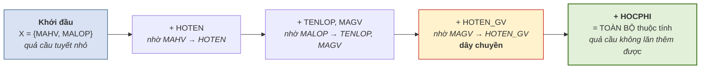

# 5.4. Bao đóng của tập thuộc tính

*(1,5 tiết)*

Đây là **công cụ trung tâm** của cả chương. Hầu hết mọi thứ sau đó — tìm khóa, xét dạng chuẩn, kiểm tra bảo toàn thông tin — đều quy về việc tính bao đóng.

## 5.4.1. Định nghĩa và thuật toán

!!! note "Định nghĩa 5.6"

    **Bao đóng** của tập thuộc tính `X` đối với tập phụ thuộc hàm `F`, ký hiệu **`X⁺`**, là **tập tất cả các thuộc tính suy ra được từ `X`** nhờ `F`.

**Thuật toán tính `X⁺`:**

```
BƯỚC 1.  Khởi tạo:  X⁺ ← X
BƯỚC 2.  Lặp lại cho tới khi X⁺ không đổi:
             với mỗi phụ thuộc  A → B  trong F
                 NẾU  A ⊆ X⁺  THÌ  X⁺ ← X⁺ ∪ B
BƯỚC 3.  Trả về X⁺
```

**Hình 5.4. Bao đóng — phép loại suy quả cầu tuyết**



Phép loại suy **quả cầu tuyết** nắm đúng bản chất: bắt đầu từ một nhúm nhỏ, lăn qua từng phụ thuộc và **dính thêm** thuộc tính mới, cho tới khi không dính thêm được gì nữa thì dừng.

!!! warning "Chú ý — điểm dễ sai nhất"

    Phải **lặp lại nhiều vòng**, không chỉ quét `F` một lượt. Ở Hình 5.4, `HOTEN_GV` chỉ dính vào **sau khi** `MAGV` đã dính — nếu chỉ quét một lượt theo thứ tự viết trong `F`, rất dễ bỏ sót. Cách an toàn là **quét lại từ đầu mỗi khi `X⁺` thay đổi**.

## 5.4.2. Ví dụ tính từng bước

!!! example "Ví dụ 5.3"

    Cho `R(A, B, C, D)` và `F = {A → B, B → C, CD → A}`. Tính `(AD)⁺`.

    | Vòng | Xét phụ thuộc | `A ⊆ X⁺`? | `X⁺` sau bước |
    |:--:|---|:--:|---|
    | — | *khởi tạo* | — | `{A, D}` |
    | 1 | `A → B` | Có | `{A, B, D}` |
    | 1 | `B → C` | Có | `{A, B, C, D}` |
    | 1 | `CD → A` | Có | `{A, B, C, D}` *(không đổi)* |
    | 2 | *quét lại toàn bộ* | — | `{A, B, C, D}` *(không đổi → dừng)* |

    Vậy `(AD)⁺ = {A, B, C, D}` = toàn bộ thuộc tính, nên `AD` là **siêu khóa**.

## 5.4.3. Hai công dụng của bao đóng

**Công dụng thứ nhất — kiểm tra một phụ thuộc hàm có suy ra được không.**

> `X → Y` suy ra được từ `F` **khi và chỉ khi** `Y ⊆ X⁺`.

Đây là cách kiểm tra **nhanh và chắc chắn**, thay cho việc mò mẫm áp luật Armstrong.

**Công dụng thứ hai — kiểm tra một tập thuộc tính có phải siêu khóa không.**

> `X` là **siêu khóa** của `R` **khi và chỉ khi** `X⁺` = **toàn bộ** tập thuộc tính của `R`.

Công dụng này là nền tảng của thuật toán tìm khóa ở mục 5.5.

## 5.4.4. Phân biệt `F⁺` và `X⁺`

Hai ký hiệu trông giống nhau nhưng là **hai thứ hoàn toàn khác**, và đây là chỗ nhầm lẫn kinh điển.

**Bảng 5.5. `F⁺` và `X⁺` — hai thứ khác nhau**

| | `F⁺` | `X⁺` |
|---|---|---|
| **Đầu vào** | Một **tập phụ thuộc hàm** `F` | Một **tập thuộc tính** `X` *(kèm `F`)* |
| **Kết quả là** | Một **tập phụ thuộc hàm** | Một **tập thuộc tính** |
| **Nội dung** | Mọi phụ thuộc suy ra được từ `F` | Mọi thuộc tính suy ra được từ `X` |
| **Kích thước** | Rất lớn — **hàm mũ** | Nhỏ — không quá số thuộc tính của `R` |
| **Tính được không** | Trên lý thuyết được, thực tế **không khả thi** | **Rất dễ** — thuật toán ở mục 5.4.1 |

Câu phân biệt gọn nhất: **`F⁺` là tập các mũi tên; `X⁺` là tập các chữ cái.**

!!! warning "Chú ý"

    Chính vì `F⁺` quá lớn để tính mà toàn bộ lý thuyết chuẩn hóa được xây trên `X⁺`. Mọi câu hỏi tưởng như cần `F⁺` — *"phụ thuộc này có đúng không"*, *"tập này có phải khóa không"* — đều được quy về việc tính một vài bao đóng `X⁺`. Đó là đóng góp thực dụng lớn nhất của khái niệm bao đóng.

---


---

[← Trang trước](5-3-he-luat-dan-armstrong.md) · [Trang sau →](5-5-thuat-toan-tim-khoa.md)
