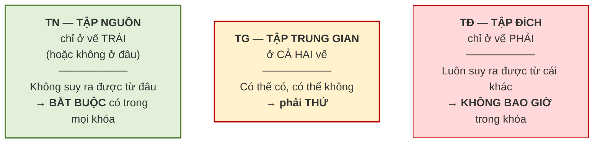

# 5.5. Thuật toán tìm khóa

*(2,0 tiết)*

## 5.5.1. Ba nhóm thuộc tính

Ý tưởng nền tảng: **không phải thuộc tính nào cũng có cơ hội nằm trong khóa như nhau**. Phân loại trước thì phạm vi tìm kiếm thu hẹp rất nhiều.

!!! note "Định nghĩa 5.7"

    Với lược đồ `R` và tập phụ thuộc hàm `F`, chia các thuộc tính thành ba nhóm:

    - **Tập nguồn `TN`**: các thuộc tính **chỉ xuất hiện ở vế trái**, hoặc **không xuất hiện** ở cả hai vế.
    - **Tập trung gian `TG`**: các thuộc tính xuất hiện ở **cả hai vế**.
    - **Tập đích `TĐ`**: các thuộc tính **chỉ xuất hiện ở vế phải**.

**Hình 5.5. Ba nhóm thuộc tính — và vì sao phân nhóm**



Lý do đằng sau ba nhóm rất trực quan. Thuộc tính thuộc **`TN`** không nằm ở vế phải của bất kỳ phụ thuộc nào, nên **không có cách nào suy ra nó** — muốn suy ra toàn bộ lược đồ thì buộc phải có nó ngay từ đầu. Ngược lại, thuộc tính thuộc **`TĐ`** luôn suy ra được từ thứ khác, nên đưa nó vào khóa chỉ làm khóa thừa, vi phạm tính tối thiểu. Chỉ nhóm **`TG`** là còn phải thử.

## 5.5.2. Thuật toán tìm một khóa

Với nhiều bài toán, chỉ cần **một** khóa là đủ để chuẩn hóa. Khi ấy có một lối tắt:

```
BƯỚC 1.  Xác định TN và TG
BƯỚC 2.  Tính (TN)⁺
             NẾU (TN)⁺ = toàn bộ thuộc tính  THÌ  TN chính là khóa duy nhất — DỪNG
BƯỚC 3.  Ngược lại, lần lượt ghép thêm từng tập con của TG (từ nhỏ tới lớn)
             cho tới khi tìm được siêu khóa tối thiểu
```

Bước 2 là **mẹo tiết kiệm thời gian** đáng nhớ: rất nhiều lược đồ thực tế có `(TN)⁺` phủ hết ngay, và khi đó bài toán kết thúc sau một phép tính bao đóng duy nhất.

## 5.5.3. Thuật toán tìm tất cả khóa

Nhưng một lược đồ **có thể có nhiều khóa**, và điều này quan trọng vì việc xét 2NF, 3NF phụ thuộc vào khái niệm *thuộc tính khóa* — tức thuộc tính nằm trong **bất kỳ** khóa nào. Bỏ sót một khóa có thể dẫn tới kết luận sai về dạng chuẩn.

```
BƯỚC 1.  Xác định TN và TG
BƯỚC 2.  Sinh mọi tập con Xᵢ của TG          (có 2^|TG| tập con)
BƯỚC 3.  Với mỗi Xᵢ, tính (TN ∪ Xᵢ)⁺
             NẾU (TN ∪ Xᵢ)⁺ = toàn bộ thuộc tính
                 THÌ  TN ∪ Xᵢ  là một SIÊU KHÓA
BƯỚC 4.  Trong các siêu khóa tìm được, LOẠI những siêu khóa
             chứa một siêu khóa khác  →  còn lại là TẤT CẢ các khóa
```

Bước 4 chính là bước bảo đảm **tính tối thiểu** đã học ở mục 2.3.1 và 3.2.3.

## 5.5.4. Mẹo rút gọn

Khi `TG` lớn, số tập con `2^|TG|` tăng rất nhanh — `|TG| = 10` đã cho hơn một nghìn tập con. Có một mẹo cắt giảm đáng kể khối lượng tính.

> **Mẹo.** Duyệt các tập con của `TG` theo **kích thước tăng dần**. Nếu `TN ∪ Xᵢ` đã là siêu khóa, thì **mọi tập cha** của `Xᵢ` cũng là siêu khóa nhưng **chắc chắn không tối thiểu** — nên **loại luôn, không cần tính bao đóng** cho chúng.

Mẹo này dựa trên một nhận xét đơn giản: bao đóng có tính **đơn điệu** — thêm thuộc tính vào `X` thì `X⁺` chỉ có thể lớn lên chứ không nhỏ đi. Vì vậy khi đã tìm được một siêu khóa nhỏ, mọi thứ chứa nó đều thừa.

## 5.5.5. Ví dụ đầy đủ — tìm tất cả khóa

!!! example "Ví dụ 5.4"

    Cho `R(A, B, C, D)` và `F = {A → B, B → C, CD → A}`. Tìm **tất cả** khóa.

    **Bước 1 — phân nhóm.** Vế trái xuất hiện: `A`, `B`, `C`, `D`. Vế phải xuất hiện: `B`, `C`, `A`.

    | Thuộc tính | Vế trái | Vế phải | Nhóm |
    |:--:|:--:|:--:|:--:|
    | `A` | có | có | **TG** |
    | `B` | có | có | **TG** |
    | `C` | có | có | **TG** |
    | `D` | có | không | **TN** |

    Vậy `TN = {D}`, `TG = {A, B, C}`, `TĐ = ∅`.

    **Bước 2–3 — duyệt `2³ = 8` tập con của `TG`**, theo kích thước tăng dần:

    | # | `Xᵢ` | `TN ∪ Xᵢ` | `(TN ∪ Xᵢ)⁺` | Siêu khóa? |
    |:--:|---|---|---|:--:|
    | 1 | `∅` | `D` | `{D}` | Không |
    | 2 | `{A}` | `AD` | `{A,B,C,D}` | **Có** |
    | 3 | `{B}` | `BD` | `{B,C,A,D}` | **Có** |
    | 4 | `{C}` | `CD` | `{C,D,A,B}` | **Có** |
    | 5 | `{A,B}` | `ABD` | — | *chứa `AD`* → **loại** |
    | 6 | `{A,C}` | `ACD` | — | *chứa `AD`* → **loại** |
    | 7 | `{B,C}` | `BCD` | — | *chứa `BD`* → **loại** |
    | 8 | `{A,B,C}` | `ABCD` | — | *chứa `AD`* → **loại** |

    Bốn dòng cuối được loại **không cần tính bao đóng**, nhờ mẹo ở mục 5.5.4.

    **Bước 4 — kết luận.** Ba siêu khóa `AD`, `BD`, `CD` đều **tối thiểu** *(không cái nào chứa cái nào)*.

    **Lược đồ có ba khóa: `AD`, `BD`, `CD`.**

    Hệ quả: thuộc tính khóa là `A`, `B`, `C`, `D` — **tất cả**. Khi mọi thuộc tính đều là thuộc tính khóa, lược đồ **tự động đạt 3NF** *(xem mục 5.7.4)*.

---


---

[← Trang trước](5-4-bao-dong-cua-tap-thuoc-tinh.md) · [Trang sau →](5-6-phu-toi-thieu.md)
