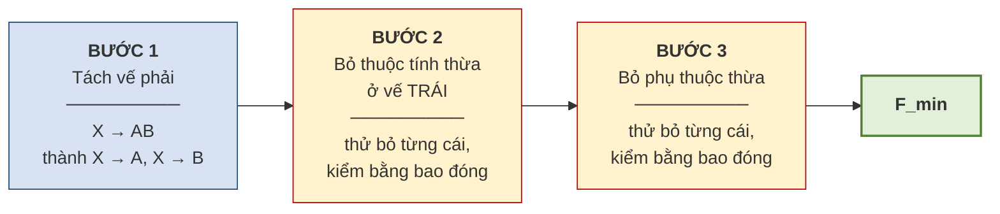

# 5.6. Phủ tối thiểu

*(1,5 tiết)*

## 5.6.1. Vì sao cần phủ tối thiểu

Tập `F` thu thập được từ nghiệp vụ thường **thừa**: có phụ thuộc suy ra được từ các phụ thuộc khác, có vế trái chứa thuộc tính không cần thiết. Làm việc trên một `F` thừa thì tốn công và dễ sai.

!!! note "Định nghĩa 5.8"

    **Phủ tối thiểu** *(minimal cover)* của `F` là một tập phụ thuộc hàm `F_min` **tương đương** với `F` *(tức `F⁺ = F_min⁺`)* và **không thể rút gọn thêm được nữa**.

## 5.6.2. Ba điều kiện

!!! note "Định nghĩa 5.9"

    `F_min` là phủ tối thiểu nếu thỏa mãn **đồng thời ba điều kiện**:

    1. **Vế phải chỉ có một thuộc tính** — mọi phụ thuộc có dạng `X → A` với `A` là một thuộc tính đơn.
    2. **Không thừa thuộc tính ở vế trái** — không bỏ được thuộc tính nào khỏi `X` mà tập vẫn tương đương.
    3. **Không thừa phụ thuộc** — không bỏ được phụ thuộc nào mà tập vẫn tương đương.

## 5.6.3. Thuật toán ba bước

**Hình 5.6. Thuật toán tìm phủ tối thiểu — phải làm đúng thứ tự**

!!! warning "Chú ý — thứ tự ba bước là bắt buộc"

    Phải bỏ thuộc tính thừa ở **vế trái trước**, rồi mới bỏ phụ thuộc thừa. Làm ngược lại có thể cho kết quả **không tối thiểu**, vì một phụ thuộc trông có vẻ cần thiết khi vế trái còn thừa, nhưng sau khi rút gọn vế trái thì lại hóa thừa.

**Cách kiểm tra ở Bước 2** — muốn biết thuộc tính `B` trong `XB → A` có thừa không: tính `X⁺` *(bỏ `B` đi)*. Nếu `A ∈ X⁺` thì `B` **thừa**, bỏ được.

**Cách kiểm tra ở Bước 3** — muốn biết phụ thuộc `X → A` có thừa không: tạm bỏ nó khỏi `F`, rồi tính `X⁺` trên tập còn lại. Nếu `A` vẫn thuộc `X⁺` thì phụ thuộc ấy **thừa**.

## 5.6.4. Ví dụ đầy đủ

!!! example "Ví dụ 5.5"

    Cho `F = {A → BC, B → C, AB → D}`. Tìm phủ tối thiểu.

    **Bước 1 — tách vế phải:**

    `F₁ = {A → B, A → C, B → C, AB → D}`

    **Bước 2 — bỏ thuộc tính thừa ở vế trái.** Chỉ `AB → D` có vế trái nhiều hơn một thuộc tính.

    - Thử bỏ `B`, xét `A → D`: tính `A⁺` trên `F₁` khi chưa dùng `AB → D` — ta có `A⁺ = {A, B, C}`. Vì `A → B` nên `A` suy ra `B`, do đó `AB` và `A` là tương đương. Vậy `B` **thừa**, thay `AB → D` bằng `A → D`.

    `F₂ = {A → B, A → C, B → C, A → D}`

    **Bước 3 — bỏ phụ thuộc thừa.**

    | Thử bỏ | Tính bao đóng trên tập còn lại | Kết luận |
    |---|---|---|
    | `A → B` | `A⁺ = {A, C, D}` — thiếu `B` | **Giữ** |
    | `A → C` | `A⁺ = {A, B, C, D}` *(nhờ `A→B` rồi `B→C`)* — có `C` | **BỎ** |
    | `B → C` | `B⁺ = {B}` — thiếu `C` | **Giữ** |
    | `A → D` | `A⁺ = {A, B, C}` — thiếu `D` | **Giữ** |

    **Kết quả:** `F_min = {A → B, B → C, A → D}`

    Từ bốn phụ thuộc ban đầu rút còn ba, và vế trái đã gọn nhất có thể.

---

---

[← Trang trước](5-5-thuat-toan-tim-khoa.md) · [Trang sau →](5-7-cac-dang-chuan-1nf-2nf-3nf.md)
