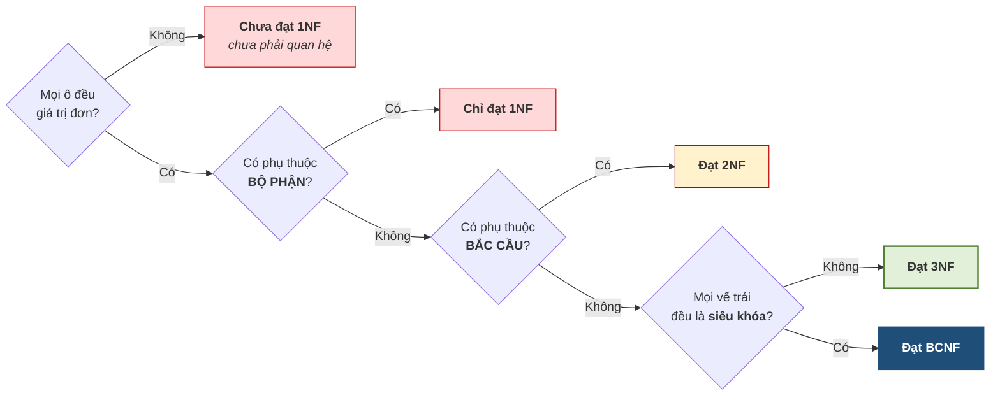

# 5.7. Các dạng chuẩn 1NF, 2NF, 3NF

*(1,5 tiết)*

## 5.7.1. Thuộc tính khóa và không khóa

Trước khi định nghĩa các dạng chuẩn, cần một khái niệm phụ.

!!! note "Định nghĩa 5.10"

    Một thuộc tính gọi là **thuộc tính khóa** *(prime attribute)* nếu nó thuộc **ít nhất một** khóa của lược đồ. Ngược lại gọi là **thuộc tính không khóa** *(non-prime attribute)*.

Chữ *"ít nhất một"* giải thích vì sao mục 5.5.3 phải tìm **tất cả** khóa: nếu chỉ tìm một khóa, ta có thể xếp nhầm một thuộc tính khóa thành không khóa, và kết luận sai về dạng chuẩn.

## 5.7.2. Dạng chuẩn 1

!!! note "Định nghĩa 5.11"

    Quan hệ `R` đạt **dạng chuẩn 1 (1NF)** nếu **mọi giá trị trong mọi ô đều là giá trị đơn** — không phải danh sách, không phải nhóm lặp.

Đây chính là **Đặc trưng 4** ở mục 3.1.3 của Chương 3, và cũng là nguyên tắc đã dùng ở mục 2.2.4 của Chương 2 khi bác bỏ cách nhồi ba số điện thoại vào một ô. **Đến đây nó được gọi đúng tên.**

!!! warning "Chú ý"

    Với mô hình quan hệ, 1NF **không phải một mức để phấn đấu** mà là **điều kiện tối thiểu để được gọi là quan hệ**. Một bảng không đạt 1NF thì chưa phải quan hệ, và mọi lý thuyết của chương này không áp dụng được cho nó.

## 5.7.3. Dạng chuẩn 2

!!! note "Định nghĩa 5.12"

    Quan hệ `R` đạt **dạng chuẩn 2 (2NF)** nếu nó đạt 1NF và **mọi thuộc tính không khóa đều phụ thuộc đầy đủ vào mọi khóa** — nghĩa là **không có phụ thuộc bộ phận**.

Vì phụ thuộc bộ phận chỉ xuất hiện khi khóa là khóa phức hợp, ta có một hệ quả tiện dụng:

> **Hệ quả.** Nếu **mọi khóa của `R` đều chỉ gồm một thuộc tính**, thì `R` **tự động đạt 2NF**.

**Cách sửa khi vi phạm:** tách thuộc tính phụ thuộc bộ phận ra thành bảng riêng, cùng với **phần khóa mà nó thật sự phụ thuộc vào**.

## 5.7.4. Dạng chuẩn 3

!!! note "Định nghĩa 5.13"

    Quan hệ `R` đạt **dạng chuẩn 3 (3NF)** nếu nó đạt 2NF và **không có thuộc tính không khóa nào phụ thuộc bắc cầu vào khóa**.

Có một cách phát biểu tương đương, tiện hơn khi làm bài:

> `R` đạt 3NF khi và chỉ khi với **mọi** phụ thuộc hàm không tầm thường `X → A` trong `F`, **hoặc** `X` là siêu khóa, **hoặc** `A` là thuộc tính khóa.

Phát biểu này giải thích ngay nhận xét ở cuối Ví dụ 5.4: nếu **mọi** thuộc tính đều là thuộc tính khóa thì vế *"hoặc `A` là thuộc tính khóa"* luôn đúng, nên lược đồ **tự động đạt 3NF**.

**Cách sửa khi vi phạm:** tách chuỗi bắc cầu `K → Z → Y` thành hai bảng — một bảng chứa `(K, Z)`, một bảng chứa `(Z, Y)`.

## 5.7.5. Câu thần chú và cây quyết định

Có một câu tiếng Anh tóm tắt cả ba dạng chuẩn, được dùng rộng rãi:

> *"The key, the whole key, and nothing but the key."*

Cách đọc: mọi thuộc tính không khóa phải phụ thuộc vào **khóa** *(1NF — có khóa)*, vào **toàn bộ khóa** *(2NF — không bộ phận)*, và **không phụ thuộc vào gì khác ngoài khóa** *(3NF — không bắc cầu)*.

**Hình 5.7. Cây quyết định — xác định dạng chuẩn cao nhất**

## 5.7.6. Bảng vàng — dạng chuẩn và dị thường

Đây là bảng nối thẳng Chương 5 về Chương 1, và cũng là câu trả lời cho câu hỏi *"chuẩn hóa để làm gì"*.

**Bảng 5.6. Dạng chuẩn diệt dị thường nào**

| Dạng chuẩn | Diệt thủ phạm | Dị thường bị loại bỏ |
|---|---|---|
| **1NF** | Ô đa giá trị | Không tìm kiếm được, không ràng buộc được |
| **2NF** | Phụ thuộc **bộ phận** | Dị thường **sửa** và **xóa** liên quan tới thuộc tính phụ thuộc nửa khóa |
| **3NF** | Phụ thuộc **bắc cầu** | Dị thường **sửa**, **thêm**, **xóa** liên quan tới bảng ẩn *(như `GIAOVIEN`)* |
| **BCNF** | Vế trái không phải siêu khóa | Các dị thường còn sót khi có nhiều khóa chồng lấn |

!!! warning "Chú ý"

    Ở Chương 1 người học **thấy** ba dị thường nhưng **không gọi tên được nguyên nhân**. Bảng trên chỉ đích danh: dị thường không phải hiện tượng ngẫu nhiên mà là **hệ quả trực tiếp** của phụ thuộc bộ phận và phụ thuộc bắc cầu. Đó là khác biệt giữa *thấy triệu chứng* và *chẩn đoán được bệnh*.

---

---

[← Trang trước](5-6-phu-toi-thieu.md) · [Trang sau →](5-8-phep-tach-luoc-do.md)
