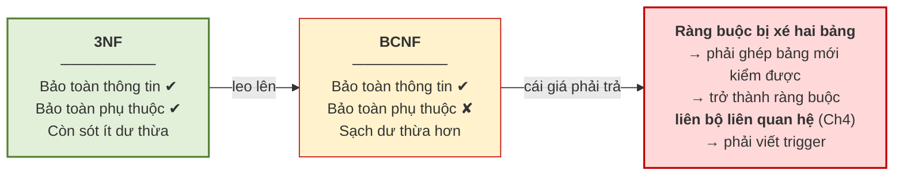

# 5.8. Phép tách lược đồ

*(1,5 tiết)*

Chuẩn hóa được thực hiện bằng cách **tách** một lược đồ thành nhiều lược đồ nhỏ hơn. Nhưng không phải phép tách nào cũng dùng được.

## 5.8.1. Tách sai và hiện tượng bộ giả

Hãy xem điều gì xảy ra khi tách sai.

!!! example "Ví dụ 5.6"

    Cho quan hệ `R(MAHV, MALOP, MAGV)` với dữ liệu:

    | MAHV | MALOP | MAGV |
    |---|---|---|
    | HV01 | A1 | GV1 |
    | HV02 | A2 | GV2 |

    **Tách sai** thành `R1(MAHV, MAGV)` và `R2(MALOP, MAGV)`:

    `R1`

    | MAHV | MAGV |
    |---|---|
    | HV01 | GV1 |
    | HV02 | GV2 |

    `R2`

    | MALOP | MAGV |
    |---|---|
    | A1 | GV1 |
    | A2 | GV2 |

    Giờ ghép lại bằng phép kết tự nhiên trên `MAGV`, ta được **đúng hai dòng ban đầu**. Phép tách này **có vẻ** không sao.

    Nhưng thêm một dòng dữ liệu nữa — học viên HV01 học thêm lớp A2 do chính GV1 dạy:

    | MAHV | MALOP | MAGV |
    |---|---|---|
    | HV01 | A1 | GV1 |
    | HV01 | A2 | GV1 |
    | HV02 | A2 | GV2 |

    Khi ấy `R1 = {(HV01,GV1), (HV02,GV2)}` và `R2 = {(A1,GV1), (A2,GV1), (A2,GV2)}`. Ghép lại:

    | MAHV | MALOP | MAGV | |
    |---|---|---|---|
    | HV01 | A1 | GV1 | đúng |
    | HV01 | A2 | GV1 | đúng |
    | HV02 | A2 | GV2 | đúng |

    Lần này vẫn đúng. Nhưng nếu GV2 cũng dạy lớp A1 thì `R2` có thêm `(A1, GV2)`, và phép ghép sẽ sinh ra dòng `(HV02, A1, GV2)` — **một dòng chưa từng tồn tại trong dữ liệu gốc**.

    **Định nghĩa 5.14.** **Bộ giả** *(spurious tuple)* là bộ **xuất hiện trong kết quả ghép các bảng con nhưng không có trong quan hệ gốc**.

**Hình 5.8. Nghịch lý bộ giả — không mất dòng nào mà vẫn mất sự thật**

!!! warning "Chú ý — vì sao bộ giả nguy hiểm hơn mất dữ liệu"

    Mất dữ liệu thì người dùng **biết mình thiếu** và đi tìm. Bộ giả thì ngược lại: hệ thống trả về **nhiều thông tin hơn sự thật**, và mọi dòng trông đều hợp lệ. Không ai biết dòng nào là thật, dòng nào là bịa. Đây đúng là kiểu lỗi **im lặng** đã bàn từ Chương 1 — và là kiểu lỗi tốn kém nhất.

## 5.8.2. Điều kiện bảo toàn thông tin

!!! note "Định nghĩa 5.15"

    Phép tách `R` thành `R1` và `R2` là **bảo toàn thông tin** *(lossless join)* nếu với mọi thể hiện của `R`, ta luôn có `R1 ⋈ R2 = R` — không thừa, không thiếu.

    **Định lý 5.1 (điều kiện đủ).** Phép tách `R` thành `R1` và `R2` là bảo toàn thông tin nếu **tập thuộc tính chung** `R1 ∩ R2` là **siêu khóa của ít nhất một trong hai** bảng con. Viết hình thức:

    `(R1 ∩ R2) → R1`  **hoặc**  `(R1 ∩ R2) → R2`

Áp vào Ví dụ 5.6: thuộc tính chung là `{MAGV}`, mà `MAGV` **không phải khóa** của `R1` *(một giáo viên dạy nhiều học viên)* cũng **không phải khóa** của `R2` *(một giáo viên dạy nhiều lớp)*. Điều kiện không thỏa mãn — đó chính là lý do sinh ra bộ giả.

!!! example "Ví dụ 5.7"

    Tách đúng: `R1(MAHV, MALOP)` và `R2(MALOP, MAGV)`. Thuộc tính chung là `{MALOP}`, mà `MALOP` **là khóa của `R2`** *(mỗi lớp có đúng một giáo viên)*. Điều kiện thỏa mãn ⟹ **bảo toàn thông tin**, không bao giờ sinh bộ giả.

Quy tắc thực hành rút ra rất gọn: **luôn tách theo phụ thuộc hàm**. Nếu tách `R` thành `R1(X ∪ Y)` và `R2(R − Y)` dựa trên một phụ thuộc `X → Y` có sẵn trong `F`, thì thuộc tính chung là `X`, và `X` là khóa của `R1` — điều kiện tự động thỏa mãn.

## 5.8.3. Bảo toàn phụ thuộc hàm

Bảo toàn thông tin mới là một nửa. Còn nửa kia.

!!! note "Định nghĩa 5.16"

    Phép tách là **bảo toàn phụ thuộc hàm** *(dependency preserving)* nếu mọi phụ thuộc hàm trong `F` đều **kiểm tra được trên một bảng con duy nhất**, không cần ghép bảng.

Vì sao điều này quan trọng? Vì nó liên quan trực tiếp tới **ràng buộc toàn vẹn** của Chương 4. Nếu một phụ thuộc hàm bị "xé" ra hai bảng, thì để kiểm tra nó, hệ quản trị phải **ghép hai bảng lại mỗi lần có thao tác** — tức là ràng buộc ấy trở thành **loại liên bộ liên quan hệ**, loại khó nhất trong Bảng 4.3, phải dùng trigger.

Nói cách khác: **mất bảo toàn phụ thuộc hàm nghĩa là biến một ràng buộc dễ thành một ràng buộc khó.**

## 5.8.4. Định lý — không phải lúc nào cũng đạt được cả hai

Đây là kết quả quan trọng nhất của mục 5.8, và cũng là lý do thực tế người ta thường dừng ở 3NF.

> **Định lý 5.2.**
>
> - Luôn tồn tại phép tách về **3NF** vừa **bảo toàn thông tin** vừa **bảo toàn phụ thuộc hàm**.
> - Luôn tồn tại phép tách về **BCNF** **bảo toàn thông tin**, nhưng **không phải lúc nào cũng bảo toàn được phụ thuộc hàm**.

**Hình 5.9. Leo cao hơn chưa chắc tốt hơn**

!!! warning "Chú ý — kết luận thực hành"

    Trong đa số dự án, **3NF là đích đến hợp lý**. Leo lên BCNF chỉ nên làm khi phần dư thừa còn sót ở 3NF thật sự gây phiền, **và** khi phép tách BCNF tình cờ vẫn bảo toàn được phụ thuộc hàm. Đây là một ví dụ điển hình cho nguyên tắc: **"chuẩn hơn" không đồng nghĩa với "tốt hơn"** — mọi lựa chọn thiết kế đều là một sự đánh đổi.

---

---

[← Trang trước](5-7-cac-dang-chuan-1nf-2nf-3nf.md) · [Trang sau →](5-9-quy-trinh-chuan-hoa-hoan-chinh.md)
