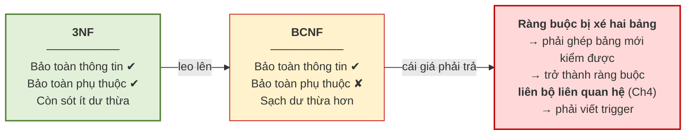

# 5.8. Phép tách lược đồ

*(1,5 tiết)*

{width=55%}

*Ảnh minh họa: các mảnh ghép hình. Tách một bức tranh thành mảnh thì phải ghép lại được đúng bức tranh ấy — không thiếu mảnh, và cũng không mọc thêm mảnh lạ. Phép tách lược đồ đặt ra đúng yêu cầu đó, và mảnh "mọc thêm" chính là bộ giả — Nguồn: Wikimedia Commons · Profpcde · CC0.*

Chuẩn hóa được thực hiện bằng cách **tách** một lược đồ thành nhiều lược đồ nhỏ hơn. Nhưng không phải phép tách nào cũng dùng được.

## 5.8.1. Tách sai và hiện tượng bộ giả

Hãy xem điều gì xảy ra khi tách sai.

!!! example "Ví dụ 5.6"

    Cho quan hệ `R(MAHV, MALOP, MAGV)` — *học viên nào học lớp nào, lớp ấy do ai dạy*. Cô Lê Hoa *(GV1)* dạy hai lớp A1 và A3; cô Trần Mai *(GV2)* dạy A2. Thử tách `R` thành `R1(MAHV, MAGV)` và `R2(MALOP, MAGV)` — tức tách theo cột `MAGV`.

**Bảng 5.14. Tách sai `R` theo `MAGV` — không mất dòng nào, ghép lại sinh hai bộ giả**

| `R` *(gốc)* | MAHV | MALOP | MAGV |
|---|---|---|---|
| | HV01 | A1 | GV1 |
| | HV02 | A3 | GV1 |
| | HV02 | A2 | GV2 |

| `R1(MAHV, MAGV)` | MAHV | MAGV | | `R2(MALOP, MAGV)` | MALOP | MAGV |
|---|---|---|---|---|---|---|
| | HV01 | GV1 | | | A1 | GV1 |
| | HV02 | GV1 | | | A3 | GV1 |
| | HV02 | GV2 | | | A2 | GV2 |

| `R1 ⋈ R2` *(ghép theo MAGV)* | MAHV | MALOP | MAGV | Có trong `R`? |
|---|---|---|---|---|
| | HV01 | A1 | GV1 | có |
| | **HV01** | **A3** | **GV1** | **không — bộ giả** |
| | **HV02** | **A1** | **GV1** | **không — bộ giả** |
| | HV02 | A3 | GV1 | có |
| | HV02 | A2 | GV2 | có |

Hai bảng con giữ đủ mọi dòng, trông không mất gì. Nhưng khi ghép lại theo `MAGV`, giá trị `GV1` khớp **hai** học viên với **hai** lớp, phép kết ghép đủ mọi cặp: `2 × 2 = 4` dòng, trong đó `(HV01, A3)` và `(HV02, A1)` **chưa từng có thật** — HV01 chưa bao giờ học A3, HV02 chưa bao giờ học A1. Kết quả có **năm** dòng thay vì ba.

!!! note "Định nghĩa 5.14"

    **Bộ giả** *(spurious tuple)* là bộ **xuất hiện trong kết quả ghép các bảng con nhưng không có trong quan hệ gốc**.

**Hình 5.9. Nghịch lý bộ giả — không mất dòng nào mà vẫn mất sự thật**

!!! warning "Chú ý — vì sao bộ giả nguy hiểm hơn mất dữ liệu"

    Mất dữ liệu thì người dùng **biết mình thiếu** và đi tìm. Bộ giả thì ngược lại: hệ thống trả về **nhiều thông tin hơn sự thật**, và mọi dòng trông đều hợp lệ. Không ai biết dòng nào là thật, dòng nào là bịa. Đây đúng là kiểu lỗi **im lặng** đã bàn từ Chương 1 — và là kiểu lỗi tốn kém nhất.

## 5.8.2. Điều kiện bảo toàn thông tin

!!! note "Định nghĩa 5.15"

    Phép tách `R` thành `R1` và `R2` là **bảo toàn thông tin** *(lossless join)* nếu với mọi thể hiện của `R`, ta luôn có `R1 ⋈ R2 = R` — không thừa, không thiếu.

> **Định lý 5.1 (điều kiện đủ).** Phép tách `R` thành `R1` và `R2` là bảo toàn thông tin nếu **tập thuộc tính chung** `R1 ∩ R2` là **siêu khóa của ít nhất một trong hai** bảng con. Viết hình thức:
>
> `(R1 ∩ R2) → R1`  **hoặc**  `(R1 ∩ R2) → R2`

Áp vào Ví dụ 5.6: thuộc tính chung là `{MAGV}`, mà `MAGV` **không phải khóa** của `R1` *(một giáo viên dạy nhiều học viên)* cũng **không phải khóa** của `R2` *(một giáo viên dạy nhiều lớp)*. Điều kiện không thỏa mãn — đó chính là lý do sinh ra bộ giả.

!!! example "Ví dụ 5.7"

    Tách đúng: `R1(MAHV, MALOP)` và `R2(MALOP, MAGV)`. Thuộc tính chung là `{MALOP}`, mà `MALOP` **là khóa của `R2`** *(mỗi lớp có đúng một giáo viên)*. Điều kiện thỏa mãn ⟹ **bảo toàn thông tin**, không bao giờ sinh bộ giả. Kiểm chứng trên đúng ba dòng của Ví dụ 5.6:

**Bảng 5.15. Tách đúng `R` theo `MALOP` — ghép lại được đúng ba dòng gốc**

| `R1(MAHV, MALOP)` | MAHV | MALOP | | `R2(MALOP, MAGV)` | MALOP | MAGV |
|---|---|---|---|---|---|---|
| | HV01 | A1 | | | A1 | GV1 |
| | HV02 | A3 | | | A3 | GV1 |
| | HV02 | A2 | | | A2 | GV2 |

| `R1 ⋈ R2` *(ghép theo MALOP)* | MAHV | MALOP | MAGV | Có trong `R`? |
|---|---|---|---|---|
| | HV01 | A1 | GV1 | có |
| | HV02 | A3 | GV1 | có |
| | HV02 | A2 | GV2 | có |

Vì `MALOP` là khóa của `R2`, mỗi dòng của `R1` chỉ khớp **đúng một** dòng của `R2` — không có chỗ nào để phép kết "nhân" ra dòng thừa. So với Bảng 5.14: cùng ba dòng gốc, chỉ khác cột dùng để tách, một bên sinh bộ giả, một bên không.

Quy tắc thực hành rút ra rất gọn: **luôn tách theo phụ thuộc hàm**. Nếu tách `R` thành `R1(X ∪ Y)` và `R2(R − Y)` dựa trên một phụ thuộc `X → Y` có sẵn trong `F`, thì thuộc tính chung là `X`, và `X` là khóa của `R1` — điều kiện tự động thỏa mãn.

## 5.8.3. Bảo toàn phụ thuộc hàm

Bảo toàn thông tin mới là một nửa. Còn nửa kia.

!!! note "Định nghĩa 5.16"

    Phép tách là **bảo toàn phụ thuộc hàm** *(dependency preserving)* nếu mọi phụ thuộc hàm trong `F` đều **kiểm tra được trên một bảng con duy nhất**, không cần ghép bảng.

Vì sao điều này quan trọng? Vì nó liên quan trực tiếp tới **ràng buộc toàn vẹn** của Chương 4. Nếu một phụ thuộc hàm bị "xé" ra hai bảng, thì để kiểm tra nó, hệ quản trị phải **ghép hai bảng lại mỗi lần có thao tác** — tức là ràng buộc ấy trở thành **loại liên bộ liên quan hệ**, loại khó nhất trong Bảng 4.6, phải dùng trigger.

Nói cách khác: **mất bảo toàn phụ thuộc hàm nghĩa là biến một ràng buộc dễ thành một ràng buộc khó.**

!!! example "Ví dụ 5.8"

    Bảng `LOP(MALOP, MAGV, HOTEN_GV)` có `F = {MALOP → MAGV, MAGV → HOTEN_GV}`. Tách thành `LOP_GV(MALOP, MAGV)` và `LOP_TEN(MALOP, HOTEN_GV)`. Thuộc tính chung `MALOP` là khóa của cả hai bảng con, nên phép tách **bảo toàn thông tin**. Nhưng hãy xem phụ thuộc `MAGV → HOTEN_GV` đi đâu.

**Bảng 5.16. Phép tách bảo toàn thông tin nhưng "xé" mất `MAGV → HOTEN_GV`**

| `LOP_GV` | MALOP | MAGV | | `LOP_TEN` | MALOP | HOTEN_GV |
|---|---|---|---|---|---|---|
| | A1 | GV1 | | | A1 | Lê Hoa |
| | A3 | GV1 | | | A3 | **Lê Thị Hoa** |
| | A2 | GV2 | | | A2 | Trần Mai |

| Phụ thuộc | Nằm trọn trong bảng nào? | Kiểm tra được không? |
|---|---|---|
| `MALOP → MAGV` | `LOP_GV` — là khóa chính | Có, miễn phí |
| `MAGV → HOTEN_GV` | **không bảng nào** — `MAGV` ở một bảng, `HOTEN_GV` ở bảng kia | **Chỉ khi ghép hai bảng** |

Dòng A3 ghi "Lê Thị Hoa" trong khi A1 ghi "Lê Hoa" — cùng GV1 mà hai tên. Nhìn riêng `LOP_GV` không thấy gì sai; nhìn riêng `LOP_TEN` cũng không, vì bảng ấy không biết A1 và A3 cùng một giáo viên. Muốn bắt lỗi phải ghép hai bảng theo `MALOP` rồi so — đúng loại ràng buộc **liên bộ liên quan hệ** của Chương 4. Tách đúng phải là `LOP(MALOP, MAGV)` và `GIAOVIEN(MAGV, HOTEN_GV)`: khi ấy `MAGV → HOTEN_GV` nằm trọn trong `GIAOVIEN`, là khóa chính của nó, và được kiểm tra miễn phí.

## 5.8.4. Định lý — không phải lúc nào cũng đạt được cả hai

Đây là kết quả quan trọng nhất của mục 5.8, và cũng là lý do thực tế người ta thường dừng ở 3NF.

> **Định lý 5.2.**
>
> - Luôn tồn tại phép tách về **3NF** vừa **bảo toàn thông tin** vừa **bảo toàn phụ thuộc hàm**.
> - Luôn tồn tại phép tách về **BCNF** **bảo toàn thông tin**, nhưng **không phải lúc nào cũng bảo toàn được phụ thuộc hàm**.

Vế thứ hai của định lý không phải chuyện hiếm; nó xảy ra ngay tại Trung tâm ABC khi lược đồ có **hai khóa chồng lấn nhau**.

!!! example "Ví dụ 5.9"

    Trung tâm quy định: *mỗi giáo viên chỉ dạy đúng một khóa học*; *mỗi học viên, trong một khóa học, chỉ học với một giáo viên* *(nhưng có thể học nhiều khóa)*. Bảng `HV_KH_GV(MAHV, MAKH, MAGV)` có `F = {MAGV → MAKH, (MAHV, MAKH) → MAGV}`.

**Bảng 5.17. `HV_KH_GV` đạt 3NF nhưng không đạt BCNF — và cái giá khi tách lên BCNF**

| MAHV | MAKH | MAGV |
|---|---|---|
| HV01 | **KH01** | **GV1** |
| HV02 | **KH01** | **GV1** |
| HV03 | KH01 | GV3 |
| HV01 | KH02 | GV2 |

| Bước phân tích | Kết quả |
|---|---|
| Tìm khóa | `TN = {MAHV}`, `TG = {MAKH, MAGV}` → hai khóa **`(MAHV, MAKH)`** và **`(MAHV, MAGV)`**, chồng lấn ở `MAHV`; cả ba thuộc tính đều là thuộc tính khóa |
| Xét `MAGV → MAKH` | `MAGV` **không** là siêu khóa; nhưng `MAKH` **là** thuộc tính khóa → **3NF thỏa**, **BCNF vi phạm** |
| Dư thừa còn sót | Sự thật "GV1 dạy KH01" chép **hai lần** *(hai dòng in đậm)* — đúng thứ 3NF chưa diệt hết |
| Tách lên BCNF theo `MAGV → MAKH` | `GV_KH(MAGV, MAKH)` và `HV_GV(MAHV, MAGV)` — bảo toàn thông tin vì `MAGV` là khóa của `GV_KH` |

| `GV_KH` | MAGV | MAKH | | `HV_GV` | MAHV | MAGV |
|---|---|---|---|---|---|---|
| | GV1 | KH01 | | | HV01 | GV1 |
| | GV3 | KH01 | | | HV02 | GV1 |
| | GV2 | KH02 | | | HV03 | GV3 |
| | | | | | **HV01** | **GV3** |

Dư thừa đã hết. Nhưng phụ thuộc `(MAHV, MAKH) → MAGV` — *một học viên trong một khóa chỉ học với một giáo viên* — **không còn nằm trọn trong bảng nào**. Thêm dòng in đậm `(HV01, GV3)` vào `HV_GV`: từng bảng vẫn hợp lệ, mà ghép lại thì HV01 đang học KH01 với **cả GV1 lẫn GV3**. Quy tắc nghiệp vụ bị vi phạm và không bảng con nào bắt được; muốn giữ nó phải viết trigger ghép hai bảng. Đó là cái giá của BCNF trong trường hợp này — và là lý do nên **dừng ở 3NF** với lược đồ như vậy.

**Hình 5.10. Leo cao hơn chưa chắc tốt hơn**

!!! warning "Chú ý — kết luận thực hành"

    Trong đa số dự án, **3NF là đích đến hợp lý**. Leo lên BCNF chỉ nên làm khi phần dư thừa còn sót ở 3NF thật sự gây phiền, **và** khi phép tách BCNF tình cờ vẫn bảo toàn được phụ thuộc hàm. Đây là một ví dụ điển hình cho nguyên tắc: **"chuẩn hơn" không đồng nghĩa với "tốt hơn"** — mọi lựa chọn thiết kế đều là một sự đánh đổi.

!!! question "Tự kiểm tra 5.8"

    *(tự trả lời trước, rồi mở đáp án bên dưới)*

    1. Tách `GHIDANH(MAHV, MALOP, HOCPHI)` thành `(MAHV, HOCPHI)` và `(MALOP, HOCPHI)`. Có bảo toàn thông tin không? Vì sao?
    2. Tách `LOP(MALOP, TENLOP, MAGV, HOTEN_GV)` thành `(MALOP, TENLOP, MAGV)` và `(MAGV, HOTEN_GV)`. Kiểm tra cả hai điều kiện bảo toàn.
    3. Vì sao "tách theo một phụ thuộc hàm có trong `F`" thì điều kiện bảo toàn thông tin tự động thỏa mãn?

??? success "Đáp án tự kiểm tra 5.8"

    *(1)* **Không**. Thuộc tính chung `HOCPHI` không phải khóa của bảng con nào *(nhiều học viên cùng mức phí, nhiều lớp cùng mức phí)*; hai học viên cùng đóng 2.000.000 cho hai lớp khác nhau sẽ ghép ra bộ giả. *(2)* Thuộc tính chung `MAGV` là khóa của `(MAGV, HOTEN_GV)` → **bảo toàn thông tin**; `MALOP → TENLOP, MAGV` nằm trọn trong bảng một, `MAGV → HOTEN_GV` nằm trọn trong bảng hai → **bảo toàn phụ thuộc hàm**. Đây chính là phép tách ở mục 5.9.5. *(3)* Tách `R` theo `X → Y` thành `R1(X ∪ Y)` và `R2(R − Y)` thì thuộc tính chung là `X`, mà `X → Y` nghĩa là `X` xác định mọi thuộc tính của `R1` → `X` là siêu khóa của `R1` → Định lý 5.1 thỏa.

---

---

[← Trang trước](5-7-cac-dang-chuan-1nf-2nf-3nf.md) · [Trang sau →](5-9-quy-trinh-chuan-hoa-hoan-chinh.md)
