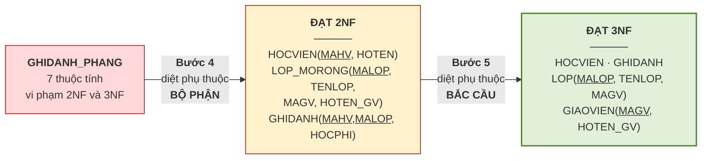

# 5.9. Quy trình chuẩn hóa hoàn chỉnh

*(1,0 tiết)*

Mục này là khoảnh khắc mà cả học phần hướng tới: **chuẩn hóa lại chính bảng phẳng của Chương 1, bằng toán học.**

## 5.9.1. Bài toán xuất phát

`GHIDANH_PHANG(MAHV, HOTEN, MALOP, TENLOP, MAGV, HOTEN_GV, HOCPHI)`

| MAHV | HOTEN | MALOP | TENLOP | MAGV | HOTEN_GV | HOCPHI |
|---|---|---|---|---|---|---|
| HV01 | Trần An | A1 | Anh cơ bản 1 | GV1 | Lê Hoa | 2.000.000 |
| HV01 | Trần An | A2 | Anh giao tiếp | GV2 | Trần Mai | 2.500.000 |
| HV02 | Lê Bình | A1 | Anh cơ bản 1 | GV1 | Lê Hoa | 2.000.000 |

## 5.9.2. Bước 1 — xác định tập phụ thuộc hàm

**Bảng 5.7. Tập phụ thuộc hàm `F` — rút từ quy tắc nghiệp vụ**

| Phụ thuộc hàm | Quy tắc nghiệp vụ tương ứng |
|---|---|
| `MAHV → HOTEN` | Mỗi học viên có **một** họ tên |
| `MALOP → TENLOP, MAGV` | Mỗi lớp có **một** tên và do **một** giáo viên phụ trách |
| `MAGV → HOTEN_GV` | Mỗi giáo viên có **một** họ tên |
| `(MAHV, MALOP) → HOCPHI` | Mỗi **lượt ghi danh** có **một** mức học phí |

## 5.9.3. Bước 2 — tìm khóa

Vế phải xuất hiện: `HOTEN`, `TENLOP`, `MAGV`, `HOTEN_GV`, `HOCPHI`. Vậy:

- `TN = {MAHV, MALOP}` — chỉ ở vế trái
- `TG = {MAGV}` — ở cả hai vế
- `TĐ = {HOTEN, TENLOP, HOTEN_GV, HOCPHI}`

Áp mẹo ở mục 5.5.2: thử `(TN)⁺` trước.

| Bước | Áp phụ thuộc | Tập đang biết |
|---|---|---|
| Khởi tạo | — | `{MAHV, MALOP}` |
| `MAHV → HOTEN` | `+ HOTEN` | `{MAHV, MALOP, HOTEN}` |
| `MALOP → TENLOP, MAGV` | `+ TENLOP, MAGV` | `{…, TENLOP, MAGV}` |
| `MAGV → HOTEN_GV` | `+ HOTEN_GV` *(dây chuyền)* | `{…, HOTEN_GV}` |
| `(MAHV, MALOP) → HOCPHI` | `+ HOCPHI` | **toàn bộ** |

`(TN)⁺` phủ hết ⟹ **`K = (MAHV, MALOP)` là khóa duy nhất**, và là khóa **phức hợp**.

!!! warning "Chú ý"

    Đây là lần đầu **trực giác và toán học gặp nhau**. Ở mục 2.6.4 của Chương 2, ta đã đoán ra thực thể `GHIDANH` bằng *phép thử tờ phiếu* — mỗi lượt ghi danh trung tâm in một tờ phiếu. Nay thuật toán TN–TG **tính ra** đúng khóa `(MAHV, MALOP)`, tức đúng "tờ phiếu" ấy. Trực giác đã đoán đúng; toán học vừa xác nhận.

## 5.9.4. Bước 3 — chẩn đoán dạng chuẩn

**Bảng 5.8. Chẩn đoán với khóa `K = (MAHV, MALOP)`**

| Dạng chuẩn | Kết luận | Bằng chứng |
|---|:--:|---|
| **1NF** | **Đạt** | Mọi ô đều là giá trị đơn |
| **2NF** | **Vi phạm** | `MAHV → HOTEN`: `HOTEN` là thuộc tính không khóa nhưng chỉ phụ thuộc **nửa khóa** → **phụ thuộc bộ phận**. Tương tự với `MALOP → TENLOP, MAGV` |
| **3NF** | **Vi phạm** | `MALOP → MAGV → HOTEN_GV`, mà `MAGV` không phải khóa → **phụ thuộc bắc cầu** |

Hai thủ phạm đã bị chỉ đích danh.

## 5.9.5. Bước 4 và 5 — tách về 2NF rồi 3NF

**Hình 5.10. Quy trình chuẩn hóa từng bước**



**Lược đồ cuối cùng, đạt 3NF:**

```
HOCVIEN  (MAHV, HOTEN)
GIAOVIEN (MAGV, HOTEN_GV)
LOP      (MALOP, TENLOP, MAGV↗GIAOVIEN)
GHIDANH  (MAHV↗HOCVIEN, MALOP↗LOP, HOCPHI)
```

## 5.9.6. Kiểm chứng bảo toàn thông tin

Áp Định lý 5.1 cho từng phép tách:

**Bảng 5.9. Kiểm chứng từng phép tách**

| Phép tách | Thuộc tính chung | Có là khóa của bảng con nào? | Kết luận |
|---|---|---|:--:|
| `HOCVIEN` và phần còn lại | `{MAHV}` | `MAHV` **là khóa của `HOCVIEN`** | **Bảo toàn** |
| `LOP` và `GIAOVIEN` | `{MAGV}` | `MAGV` **là khóa của `GIAOVIEN`** | **Bảo toàn** |
| `GHIDANH` và phần còn lại | `{MAHV, MALOP}` | là khóa của `GHIDANH` | **Bảo toàn** |

Cả ba phép tách đều bảo toàn thông tin ⟹ **không sinh bộ giả**. Đồng thời mọi phụ thuộc trong `F` đều nằm trọn trong một bảng con ⟹ **bảo toàn phụ thuộc hàm**. Thiết kế đạt cả bốn tiêu chí ở Định nghĩa 5.1.

---


---

[← Trang trước](5-8-phep-tach-luoc-do.md) · [Trang sau →](5-10-dang-chuan-muc-cao-va-phi-chuan-hoa.md)
