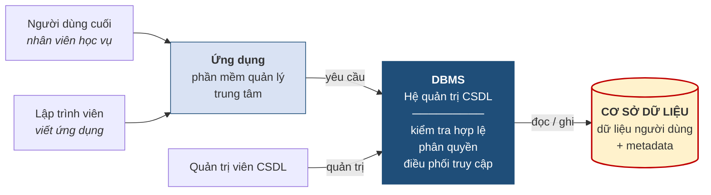
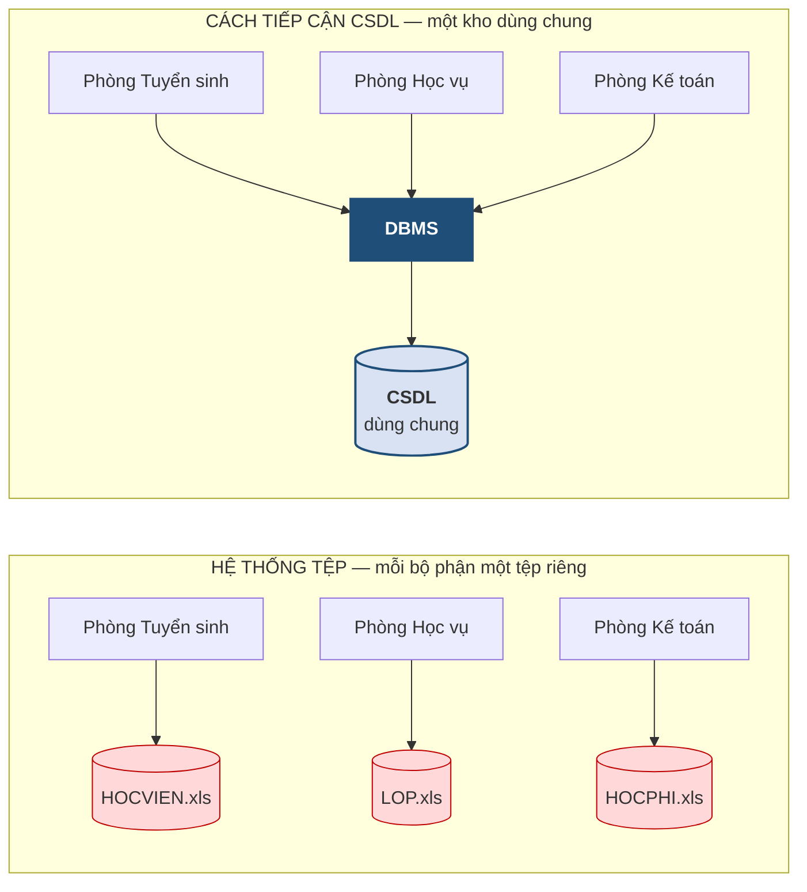
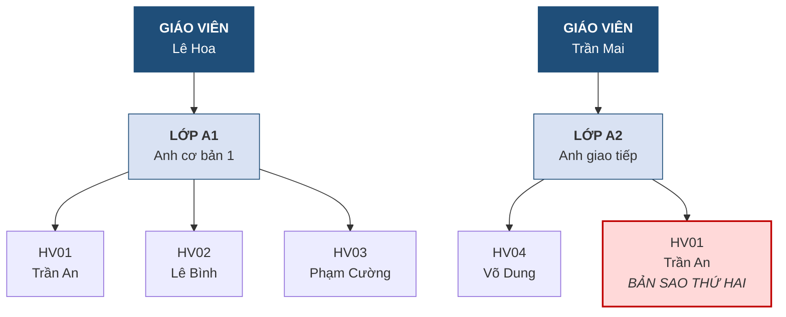
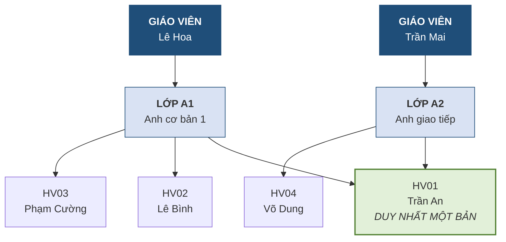
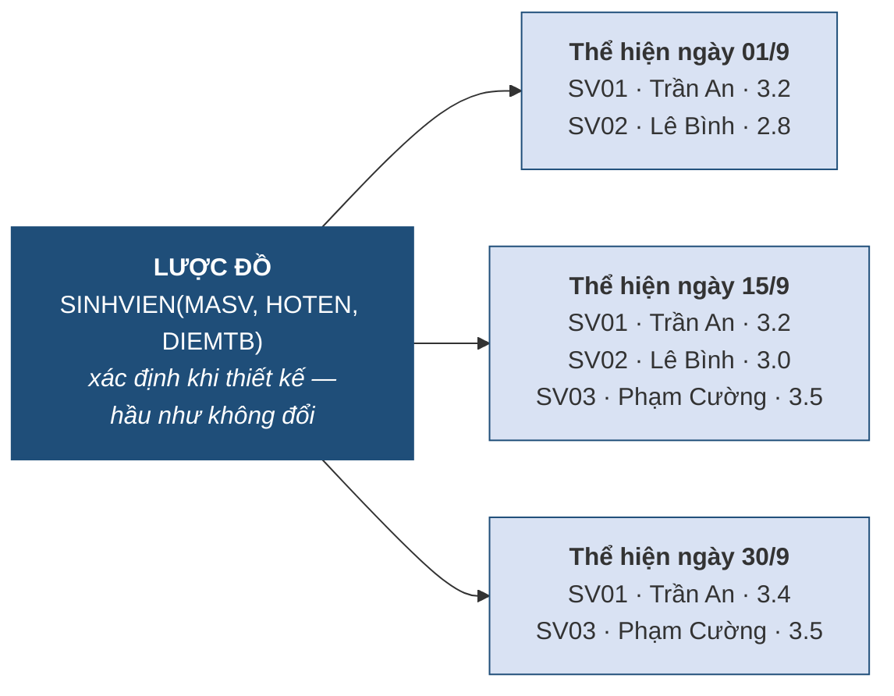
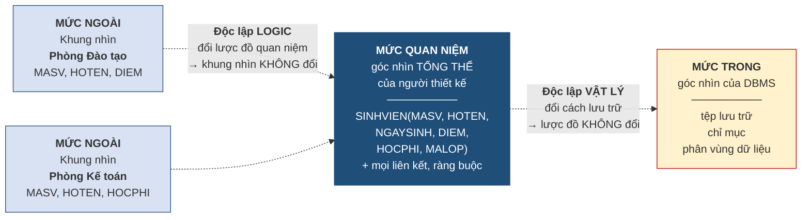
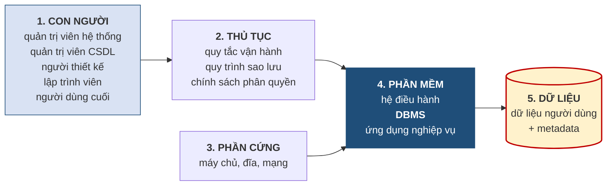
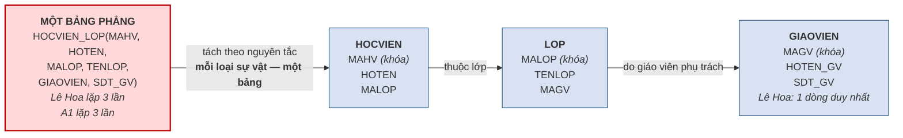

# CHƯƠNG 1. TỔNG QUAN VỀ CƠ SỞ DỮ LIỆU

> **Ghi chú biên soạn (v4 — bản giáo trình).** Bản này viết lại Chương 1 theo **văn phong giáo trình**: nội dung trình bày thành văn xuôi liền mạch, các khái niệm được nêu dưới dạng **Định nghĩa** có đánh số, minh họa bằng **Ví dụ** có đánh số. Hệ thống đánh số mục **1.1–1.6 khớp tuyệt đối với Mục 8 của đề cương chi tiết**, kèm thời lượng từng mục. Số hình vẽ rút từ 11 xuống **6**, số bảng rút còn **11** — chỉ giữ những hình và bảng mà văn xuôi không diễn đạt thay được. Các hoạt động tổ chức lớp học được chuyển xuống **Phụ lục 1A**. Thời lượng: **4 tiết** — gắn **CLO2**. Tài liệu tham khảo chính: [1] Tô Văn Nam (2005); [3] Coronel & Morris, *Database Systems*, Ch.1–Ch.2. Quy cách trình bày (Times New Roman 13, giãn dòng 1,5) áp khi định dạng bản Word.

---

## MỤC TIÊU CHƯƠNG

Sau khi học xong chương này, người học có thể *(gắn **CLO2** — mức Bloom: **Hiểu**)*:

1. **Phân biệt** dữ liệu với thông tin; **trình bày** được khái niệm cơ sở dữ liệu và vai trò của metadata.
2. **Phân biệt** ba khái niệm thường bị dùng lẫn lộn: cơ sở dữ liệu, hệ quản trị cơ sở dữ liệu và hệ cơ sở dữ liệu; **phân loại** được các hệ quản trị cơ sở dữ liệu theo ba tiêu chí thông dụng.
3. **Giải thích** bốn hạn chế của cách tổ chức dữ liệu bằng hệ thống tệp và **chỉ ra** cách tiếp cận cơ sở dữ liệu khắc phục từng hạn chế như thế nào.
4. **Phân biệt** mô hình dữ liệu, lược đồ và thể hiện; **trình bày** được các thế hệ mô hình dữ liệu và lý do mô hình quan hệ chiếm ưu thế.
5. **Mô tả** kiến trúc ba mức ANSI/SPARC, **giải thích** hai loại độc lập dữ liệu và **phân biệt** kiến trúc này với ba mức của mô hình dữ liệu.
6. **Phân loại** các nhóm ngôn ngữ cơ sở dữ liệu; **trình bày** khái niệm giao dịch cùng bốn tính chất ACID ở mức nhận biết; **mô tả** các chức năng của một hệ quản trị cơ sở dữ liệu và năm thành phần của một hệ cơ sở dữ liệu.

---

## DẪN NHẬP

Hãy hình dung một trung tâm Anh ngữ nhỏ. Ngày đầu khai trương, cô phụ trách tuyển sinh mở một tệp bảng tính để ghi danh sách học viên. Ít lâu sau, bộ phận học vụ cần theo dõi lớp học nên lập thêm một tệp nữa. Rồi kế toán cần thu học phí, lại thêm một tệp thứ ba. Mỗi tệp do một người giữ, mỗi người quen tay với cách sắp xếp của riêng mình. Trong sáu tháng đầu, mọi thứ vận hành trơn tru.

Sang năm thứ hai, số học viên tăng gấp năm lần và những rắc rối bắt đầu lộ ra. Một học viên đổi số điện thoại, báo cho bộ phận tuyển sinh; ba tháng sau kế toán gọi điện nhắc học phí thì gọi vào số cũ. Giám đốc trung tâm muốn biết *"doanh thu theo từng lớp trong quý vừa rồi"* — một câu hỏi tưởng đơn giản — nhưng để trả lời phải ghép tay ba tệp với nhau mất trọn một buổi chiều, và con số cuối cùng vẫn không ai dám chắc là đúng. Tệ hơn cả, khi một học viên xin nghỉ và bị xóa khỏi danh sách, hóa ra lớp học của em ấy cũng biến mất theo, bởi vì tên lớp chỉ được ghi trong chính dòng dữ liệu của em.

Câu chuyện này không phải là câu chuyện về phần mềm bảng tính. Bảng tính không có lỗi gì cả — nó vốn được thiết kế để tính toán, không phải để quản lý dữ liệu dùng chung cho nhiều người. Đây là câu chuyện về **cách tổ chức dữ liệu**, và chính những rắc rối vừa kể là lý do khiến ngành công nghệ thông tin phải phát triển ra một lớp công nghệ riêng: **cơ sở dữ liệu**.

Chương 1 đặt nền móng cho toàn bộ học phần. Chương này chưa dạy cách thiết kế — việc đó bắt đầu từ Chương 2 — mà làm một việc quan trọng hơn về mặt nhận thức: giúp người học **nhìn thấy vấn đề**. Chỉ khi hiểu rõ điều gì hỏng trong cách tổ chức dữ liệu tùy tiện, người học mới thấy các kỹ thuật ở những chương sau là cần thiết chứ không phải là quy tắc học thuộc.

Người học đã có sẵn hai điểm tựa để bước vào chương này. Thứ nhất, từ học phần *Tin học cơ bản*, ai cũng quen thao tác với tệp, thư mục và bảng tính; chương này sẽ chỉ ra chính xác bảng tính còn thiếu điều gì để trở thành cơ sở dữ liệu. Thứ hai, từ kinh nghiệm đời sống, ai cũng đã sử dụng cơ sở dữ liệu mà không để ý: mỗi lần tra cứu điểm thi, rút tiền ở máy ATM hay đặt vé xe khách qua ứng dụng, phía sau đều là một cơ sở dữ liệu đang làm việc.

Cần lưu ý ngay từ đầu về phạm vi. Học phần này tập trung vào **nền tảng và thiết kế**. Kỹ thuật viết câu lệnh SQL, các vấn đề an toàn — bảo mật và quản lý giao dịch chuyên sâu thuộc học phần *Hệ quản trị cơ sở dữ liệu* kế tiếp. Chương 1 chỉ giới thiệu những nội dung đó ở mức nhận biết, đủ để người học định vị được chúng trong bức tranh chung.

Toàn chương được dẫn dắt bằng một tình huống xuyên suốt: **Trung tâm Anh ngữ ABC**. Tình huống này sẽ còn theo người học đến hết Chương 5, mỗi chương lại được nhìn dưới một góc độ sâu hơn.

---

## 1.1. Dữ liệu, thông tin và cơ sở dữ liệu

*(1,0 tiết)*

### 1.1.1. Dữ liệu và thông tin

Hai từ *dữ liệu* và *thông tin* thường được dùng thay thế cho nhau trong giao tiếp hằng ngày, nhưng trong ngành cơ sở dữ liệu chúng chỉ hai thứ khác nhau, và việc phân biệt được chúng là bước đầu tiên để hiểu vì sao cơ sở dữ liệu phải lưu nhiều hơn là chỉ lưu con số.

> **Định nghĩa 1.1.** **Dữ liệu** *(data)* là những **sự kiện thô** *(raw facts)* chưa qua xử lý, được ghi nhận và lưu trữ. **Thông tin** *(information)* là **kết quả của việc xử lý dữ liệu** trong một ngữ cảnh xác định, nhằm làm lộ ra ý nghĩa phục vụ cho việc ra quyết định [3, tr. 5–7].

Có thể tóm tắt quan hệ giữa hai khái niệm này bằng một công thức dễ nhớ:

> **Dữ liệu + Ngữ cảnh + Xử lý = Thông tin**

Yếu tố then chốt trong công thức trên là **ngữ cảnh**. Một dữ liệu tách rời khỏi ngữ cảnh thì không nói lên điều gì, và điều đáng chú ý là cùng một dữ liệu đặt vào các ngữ cảnh khác nhau sẽ cho ra những thông tin khác hẳn nhau, thậm chí dẫn tới những hành động trái ngược.

> **Ví dụ 1.1.** Xét con số `38`. Tự thân nó vô nghĩa — đó là dữ liệu. Nếu biết thêm rằng đây là *nhiệt độ cơ thể tính bằng độ C của một bệnh nhân*, con số ấy trở thành thông tin "bệnh nhân đang sốt" và dẫn tới hành động cho khám ngay. Nếu đó là *sĩ số của lớp CNTT01*, nó thành thông tin "lớp có quy mô trung bình" và dẫn tới quyết định xếp phòng học bình thường. Còn nếu đó là *nhiệt độ ngoài trời*, thông tin thu được là "trời nắng gắt" và hành động hợp lý là hoãn hoạt động ngoài trời. Một dữ liệu, ba ngữ cảnh, ba hành động khác nhau.

Ví dụ trên dẫn tới một hệ quả thiết kế rất quan trọng, mà toàn bộ chương này sẽ khai triển: **một cơ sở dữ liệu không thể chỉ lưu dữ liệu; nó buộc phải lưu kèm cả phần mô tả ngữ cảnh của dữ liệu đó.** Phần mô tả ấy có tên riêng — *metadata* — và sẽ được trình bày ở mục 1.1.4.

> **Chú ý.** Một nhầm lẫn phổ biến là nghĩ rằng "thông tin chỉ là dữ liệu được trình bày đẹp hơn". Không phải như vậy. Bước xử lý có thể rất đơn giản (sắp xếp, đếm, cộng dồn) hoặc rất phức tạp (dự báo thống kê), nhưng **bắt buộc phải có bước xử lý và phải có ngữ cảnh** thì dữ liệu mới trở thành thông tin. Trình bày lại một danh sách cho gọn gàng không tạo ra thông tin mới.

### 1.1.2. Từ dữ liệu đến quyết định: tháp DIKW

Trong khoa học thông tin, người ta sắp xếp bốn tầng giá trị theo thứ tự tăng dần, gọi là **tháp DIKW** — viết tắt của *Data – Information – Knowledge – Wisdom*. Mô hình này giúp người học định vị được cơ sở dữ liệu nằm ở đâu trong toàn bộ chuỗi giá trị của một tổ chức.

**Bảng 1.1. Bốn tầng của tháp DIKW, minh họa tại Trung tâm Anh ngữ ABC**

| Tầng | Tên gọi | Trả lời câu hỏi | Ví dụ tại Trung tâm ABC |
|:--:|---|---|---|
| 1 | **Data** — dữ liệu | *Cái gì?* — sự kiện thô | `2.000.000`, `2.500.000`, `1.800.000` |
| 2 | **Information** — thông tin | *Ai? Ở đâu? Bao nhiêu?* | Doanh thu lớp A1 trong quý = 6.300.000 đồng |
| 3 | **Knowledge** — tri thức | *Như thế nào?* — quy luật | Lớp buổi tối luôn đông hơn lớp buổi sáng |
| 4 | **Wisdom** — minh triết | *Nên làm gì?* — quyết định | Nên mở thêm lớp tối và giảm bớt lớp sáng |

Cơ sở dữ liệu mà học phần này bàn tới nằm ở **tầng 1 và tầng 2**. Nhưng mục đích cuối cùng của mọi tổ chức lại nằm ở tầng 3 và tầng 4 — họ cần rút ra quy luật và ra quyết định. Điều này giải thích vì sao thiết kế cơ sở dữ liệu lại quan trọng đến vậy: **một cơ sở dữ liệu thiết kế tồi sẽ chặn đứng con đường đi lên các tầng trên**. Dữ liệu sai dẫn tới thông tin sai, thông tin sai dẫn tới quy luật rút ra sai, và cuối cùng là quyết định sai. Tổn thất không nằm ở tầng dữ liệu mà bộc lộ ở tầng quyết định, thường là rất muộn và rất đắt.

### 1.1.3. Ba dạng dữ liệu

Không phải mọi dữ liệu đều có hình dạng giống nhau, và điều này quyết định loại công nghệ nào phù hợp để lưu trữ chúng. Người ta phân biệt ba dạng [3, tr. 22–24].

**Bảng 1.2. Ba dạng dữ liệu**

| Dạng | Đặc điểm | Ví dụ | Công nghệ phù hợp |
|---|---|---|---|
| **Có cấu trúc** *(structured)* | Được tổ chức thành các trường có tên, có kiểu, có độ dài xác định trước | Bảng danh sách học viên: mã, họ tên, ngày sinh | **Cơ sở dữ liệu quan hệ** |
| **Bán cấu trúc** *(semi-structured)* | Có một số dấu hiệu tổ chức (nhãn, thẻ) nhưng không theo lược đồ cố định | Tệp XML, JSON, thư điện tử, trang web | CSDL dạng văn kiện, XML |
| **Phi cấu trúc** *(unstructured)* | Không có tổ chức nội tại để máy khai thác trực tiếp | Ảnh chụp, video, bản ghi âm, văn bản tự do | Hệ thống tệp, kho đối tượng |

Điều người học cần nắm là: **học phần này, và cơ sở dữ liệu quan hệ nói chung, xử lý dữ liệu có cấu trúc.** Đây là một giới hạn có chủ ý chứ không phải một khiếm khuyết. Chính vì buộc dữ liệu phải có cấu trúc rõ ràng mà cơ sở dữ liệu quan hệ mới có thể kiểm tra tính đúng đắn, bảo đảm nhất quán và trả lời truy vấn nhanh — những việc mà một kho ảnh hay một thư mục tài liệu không làm được.

Một điểm thường bị hiểu nhầm: dữ liệu phi cấu trúc không hề "kém giá trị" hơn. Thực tế trong nhiều tổ chức, phần lớn khối lượng dữ liệu là phi cấu trúc. Nhưng để khai thác được chúng, người ta phải **rút ra phần có cấu trúc** rồi lưu vào cơ sở dữ liệu. Chẳng hạn với một ảnh chụp thẻ học viên, cái được đưa vào cơ sở dữ liệu không phải bản thân bức ảnh mà là các trường trích xuất từ ảnh: mã học viên, họ tên, ngày cấp, cùng với đường dẫn tới tệp ảnh gốc.

### 1.1.4. Cơ sở dữ liệu và metadata

> **Định nghĩa 1.2.** **Cơ sở dữ liệu** *(database)* là một **tập hợp có tổ chức các dữ liệu có liên quan logic với nhau**, được lưu trữ tập trung và **dùng chung** cho nhiều người dùng, nhiều ứng dụng [3, tr. 7].

Ba tính từ trong định nghĩa trên đều mang ý nghĩa cụ thể, không phải là chữ nghĩa trang trí. **Có tổ chức** nghĩa là dữ liệu được sắp xếp theo một cấu trúc đã định trước, chứ không đổ vào một cách tùy tiện. **Có liên quan logic** nghĩa là các dữ liệu trong cùng một cơ sở dữ liệu cùng phục vụ một lĩnh vực hoạt động; danh sách học viên và danh sách lớp học thuộc về nhau, còn danh sách học viên và giá cổ phiếu thì không. **Dùng chung** nghĩa là nhiều bộ phận cùng làm việc trên một bản dữ liệu duy nhất — đây chính là điểm khác biệt căn bản so với cách mỗi phòng ban giữ một tệp riêng như trong tình huống ở phần Dẫn nhập.

Điểm đặc biệt nhất, và cũng là điểm dễ bị bỏ qua nhất, là một cơ sở dữ liệu chứa **hai phần** chứ không phải một:

1. **Dữ liệu người dùng cuối** — các sự kiện mà tổ chức quan tâm: học viên nào, học lớp nào, đóng bao nhiêu tiền.
2. **Metadata** *(siêu dữ liệu)* — "dữ liệu mô tả dữ liệu".

> **Định nghĩa 1.3.** **Metadata** là phần dữ liệu **mô tả đặc trưng của chính dữ liệu** được lưu trong cơ sở dữ liệu: tên các trường, kiểu dữ liệu, độ dài, tính bắt buộc, các ràng buộc phải thỏa mãn và mối liên hệ giữa các nhóm dữ liệu.

Khái niệm metadata thường gây khó khăn ở lần tiếp xúc đầu tiên vì nó có tính tự quy chiếu. Một phép loại suy giúp làm rõ: hãy nghĩ tới một **mẫu đơn đăng ký in sẵn**. Những gì *người ta điền vào* mẫu đơn — "Trần An", "12/04/2005" — đó là **dữ liệu**. Còn những gì *đã in sẵn trên mẫu đơn* — dòng chữ "Họ và tên" bên cạnh ô trống, ghi chú "chỉ nhận chữ cái", dấu sao đỏ báo hiệu trường bắt buộc, ô "Ngày sinh" chia sẵn thành ba ngăn ngày/tháng/năm — đó là **metadata**. Mẫu đơn tồn tại trước khi có người điền, và nó quy định người ta được phép điền cái gì.

Trong một cơ sở dữ liệu, metadata cũng có hình dạng tương tự. Bảng dưới đây trình bày metadata của một bảng `SINHVIEN`.

**Bảng 1.3. Metadata của bảng `SINHVIEN`**

| Tên cột | Kiểu dữ liệu | Bắt buộc? | Ràng buộc |
|---|---|:--:|---|
| `MASV` | Chuỗi (10) | Có | Khóa chính — không trùng, không rỗng |
| `HOTEN` | Chuỗi (50) | Có | — |
| `NGAYSINH` | Ngày tháng | Không | Phải trước ngày hiện tại |
| `DIEMTB` | Số thực | Không | Nằm trong khoảng từ 0 đến 4 |

Chính nhờ có metadata mà hệ quản trị cơ sở dữ liệu mới **tự động kiểm tra** được dữ liệu nhập vào. Khi người dùng gõ nhầm điểm trung bình là `40` thay vì `4.0`, hệ thống từ chối ngay lập tức vì nó biết trường này chỉ nhận giá trị từ 0 đến 4 — biết được điều đó là nhờ đọc metadata. Không có metadata, hệ quản trị cơ sở dữ liệu chỉ còn là một nơi chứa dữ liệu thụ động, không khác gì một thư mục tệp.

> **Chú ý.** Trong bảng tính, metadata gần như không tồn tại dưới dạng máy hiểu được. Tiêu đề cột "Điểm trung bình" ở dòng đầu tiên chỉ là một ô chứa chữ, đối với phần mềm bảng tính nó không khác gì các ô còn lại. Vì vậy bảng tính không thể ngăn người dùng gõ chữ "chưa có" vào cột điểm số, cũng không thể ngăn hai người nhập cùng một mã học viên. **Đây là khác biệt căn bản đầu tiên giữa bảng tính và cơ sở dữ liệu.**

---

## 1.2. Hệ quản trị cơ sở dữ liệu

*(0,5 tiết)*

### 1.2.1. Khái niệm và vai trò trung gian

Bản thân cơ sở dữ liệu chỉ là dữ liệu nằm trên đĩa. Để làm việc được với nó, cần một phần mềm chuyên trách.

> **Định nghĩa 1.4.** **Hệ quản trị cơ sở dữ liệu** *(Database Management System — DBMS)* là **phần mềm trung gian** giữa người dùng cùng các ứng dụng với cơ sở dữ liệu vật lý, có nhiệm vụ quản lý cấu trúc của cơ sở dữ liệu và điều khiển mọi truy cập vào dữ liệu [3, tr. 7–9].

Từ khóa cần nhấn mạnh là **trung gian**. Không ai — kể cả lập trình viên — được phép đọc hay ghi trực tiếp lên tệp dữ liệu. Mọi yêu cầu đều phải đi qua hệ quản trị cơ sở dữ liệu, và chính vì mọi thứ đều đi qua một cửa duy nhất mà phần mềm này mới có thể kiểm soát được tính đúng đắn, phân quyền truy cập và xử lý tình huống nhiều người cùng thao tác một lúc.

**Hình 1.1. Vai trò trung gian của hệ quản trị cơ sở dữ liệu**



Vai trò trung gian đem lại một lợi ích ít khi được nhận ra ngay: nó **giấu đi sự phức tạp của việc lưu trữ**. Người dùng chỉ cần nói "cho tôi danh sách học viên lớp A1"; họ không cần biết dữ liệu nằm ở tệp nào, trên ổ đĩa nào, được sắp xếp ra sao, có chỉ mục hay không. Toàn bộ phần đó do hệ quản trị cơ sở dữ liệu lo. Ý tưởng "giấu đi sự phức tạp" này sẽ được hệ thống hóa thành một kiến trúc chính thức ở mục 1.5.

### 1.2.2. Phân biệt cơ sở dữ liệu, hệ quản trị cơ sở dữ liệu và hệ cơ sở dữ liệu

Ba thuật ngữ này rất hay bị dùng lẫn, kể cả trong tài liệu chuyên môn. Cần phân biệt dứt khoát ngay từ đầu:

- **Cơ sở dữ liệu** *(database)* là **dữ liệu** — phần nội dung được lưu trữ, gồm dữ liệu người dùng và metadata.
- **Hệ quản trị cơ sở dữ liệu** *(DBMS)* là **phần mềm** quản lý cơ sở dữ liệu đó. MySQL, SQL Server, PostgreSQL, Oracle là những hệ quản trị cơ sở dữ liệu.
- **Hệ cơ sở dữ liệu** *(database system)* là **toàn bộ hệ thống** gồm cơ sở dữ liệu, hệ quản trị cơ sở dữ liệu, phần cứng, các ứng dụng, quy trình vận hành và con người sử dụng nó.

Một cách ghi nhớ: nếu ví cơ sở dữ liệu là **sách trong thư viện**, thì hệ quản trị cơ sở dữ liệu là **người thủ thư** cùng toàn bộ hệ thống phiếu mượn và quy tắc sắp xếp, còn hệ cơ sở dữ liệu là **cả thư viện** — bao gồm tòa nhà, giá sách, thủ thư, nội quy và bạn đọc.

> **Chú ý.** Câu nói thường gặp "*tôi đã cài đặt cơ sở dữ liệu MySQL*" là chưa chính xác về thuật ngữ. Cái được cài đặt là **hệ quản trị** cơ sở dữ liệu MySQL; cơ sở dữ liệu là thứ được tạo ra *sau đó*, bên trong hệ quản trị ấy. Một hệ quản trị có thể chứa nhiều cơ sở dữ liệu độc lập với nhau.

### 1.2.3. Phân loại hệ quản trị cơ sở dữ liệu

Người học thường đặt câu hỏi rất tự nhiên: *"Có nhiều hệ quản trị như vậy thì chúng khác nhau ở đâu, và khi nào dùng cái nào?"* Có ba tiêu chí phân loại thông dụng [3, tr. 15–19].

**Bảng 1.4. Ba cách phân loại hệ quản trị cơ sở dữ liệu**

| Tiêu chí | Các loại | Đặc điểm và ví dụ |
|---|---|---|
| **Số người dùng** | *Một người dùng* — chỉ phục vụ một người tại một thời điểm; trường hợp riêng là loại chạy trên máy để bàn | Microsoft Access dùng cho một người quản lý sổ sách cá nhân |
| | *Nhiều người dùng* — phục vụ đồng thời nhiều người; chia tiếp thành cấp phòng ban và cấp doanh nghiệp | MySQL, SQL Server, Oracle phục vụ cả trung tâm cùng lúc |
| **Vị trí lưu trữ** | *Tập trung* — toàn bộ dữ liệu đặt ở một nơi | Máy chủ đặt tại văn phòng trung tâm |
| | *Phân tán* — dữ liệu trải trên nhiều địa điểm nhưng người dùng vẫn thấy như một | Chuỗi trung tâm có nhiều chi nhánh, mỗi chi nhánh giữ một phần |
| **Mục đích sử dụng** | *Xử lý giao dịch trực tuyến* (OLTP) — tối ưu cho thêm, sửa, xóa nhanh và chính xác | Hệ thống ghi danh, thu học phí hằng ngày |
| | *Kho dữ liệu* (data warehouse) — tối ưu cho tổng hợp, phân tích trên khối lượng lớn | Hệ thống báo cáo doanh thu nhiều năm để tìm xu hướng |

Phân loại theo **mục đích sử dụng** đáng chú ý nhất đối với người thiết kế, vì hai mục đích này đòi hỏi hai cách thiết kế trái ngược nhau. Hệ thống xử lý giao dịch cần dữ liệu được tách nhỏ triệt để để tránh trùng lặp và bảo đảm chính xác; kho dữ liệu lại thường **cố ý gộp lại** để truy vấn tổng hợp chạy nhanh. Toàn bộ học phần này hướng tới nhóm thứ nhất; kỹ thuật cố ý gộp lại của nhóm thứ hai sẽ được nhắc tới ở Chương 5 dưới tên gọi *phi chuẩn hóa*.

---

## 1.3. Vì sao cần cơ sở dữ liệu

*(1,0 tiết)*

Mục này trả lời câu hỏi nền tảng nhất của chương: **nếu đã có tệp và bảng tính, tại sao còn phải học cơ sở dữ liệu?** Câu trả lời không nằm ở chỗ cơ sở dữ liệu "hiện đại hơn", mà nằm ở bốn hạn chế cụ thể, có thể chỉ ra và định lượng được, của cách tổ chức dữ liệu bằng hệ thống tệp.

### 1.3.1. Hệ thống tệp và bốn hạn chế của nó

Trước khi cơ sở dữ liệu ra đời vào cuối những năm 1960, các tổ chức quản lý dữ liệu bằng **hệ thống tệp** *(file system)*: mỗi bộ phận nghiệp vụ có tệp dữ liệu riêng và chương trình xử lý riêng. Cách làm này vẫn còn phổ biến đến ngày nay dưới hình thức "mỗi phòng một tệp bảng tính".

**Hình 1.2. Hệ thống tệp và cách tiếp cận cơ sở dữ liệu**



Nhìn vào **khối phía dưới** của hình vẽ — phần mô tả hệ thống tệp — có thể thấy ngay điều bất thường: **họ tên và số điện thoại của cùng một học viên xuất hiện trong cả ba tệp**. Từ quan sát đó, bốn hạn chế lần lượt lộ ra.

**Hạn chế thứ nhất — dư thừa dữ liệu** *(data redundancy)*. Cùng một sự kiện được lưu ở nhiều nơi. Đây không đơn thuần là chuyện tốn dung lượng lưu trữ; dung lượng ngày nay rất rẻ. Vấn đề nằm ở chỗ dư thừa là **nguồn gốc** của ba hạn chế còn lại.

**Hạn chế thứ hai — không nhất quán dữ liệu** *(data inconsistency)*. Khi một sự kiện được lưu ở ba nơi, chỉ cần cập nhật thiếu một nơi là cơ sở dữ liệu chứa hai giá trị mâu thuẫn cho cùng một sự thật. Điều đáng sợ là hệ thống **không hề báo lỗi**: cả hai giá trị đều là dữ liệu hợp lệ xét riêng lẻ. Sự mâu thuẫn chỉ bị phát hiện khi có người tình cờ đối chiếu, thường là rất muộn.

**Hạn chế thứ ba — dị thường khi cập nhật** *(update anomalies)*. Do cấu trúc lưu trữ nhập nhằng, các thao tác thêm, sửa, xóa gây ra những hậu quả ngoài ý muốn. Ba loại dị thường cụ thể sẽ được phân tích chi tiết ở mục 1.7.

**Hạn chế thứ tư — phụ thuộc dữ liệu** *(data dependence)*. Trong hệ thống tệp, mỗi chương trình phải tự biết cấu trúc vật lý của tệp: cột nào ở vị trí nào, dài bao nhiêu ký tự. Hệ quả là **chỉ cần đổi cấu trúc tệp một chút là mọi chương trình đọc tệp ấy đều phải sửa lại**. Thêm một cột "email" vào tệp học viên có thể buộc phải sửa và biên dịch lại năm chương trình khác nhau. Đây là hạn chế tốn kém nhất về lâu dài và cũng chính là hạn chế mà kiến trúc ba mức ở mục 1.5 được sinh ra để giải quyết.

### 1.3.2. Định lượng mức dư thừa trên một trường hợp cụ thể

Nói "dư thừa gây hại" là nói định tính. Người thiết kế cần biết định lượng. Ta xét bảng dữ liệu phẳng của Trung tâm ABC — cùng chính là bảng sẽ được dùng lại ở mục 1.7 và ở các chương sau.

**Bảng 1.5. Tệp phẳng `HOCVIEN_LOP` của Trung tâm Anh ngữ ABC**

| MAHV | HOTEN | MALOP | TENLOP | GIAOVIEN | SDT_GV |
|---|---|---|---|---|---|
| HV01 | Trần An | A1 | Anh cơ bản 1 | Lê Hoa | 0905111111 |
| HV02 | Lê Bình | A1 | Anh cơ bản 1 | Lê Hoa | 0905111111 |
| HV03 | Phạm Cường | A1 | Anh cơ bản 1 | Lê Hoa | 0905111111 |
| HV04 | Võ Dung | A2 | Anh giao tiếp | Trần Mai | 0905222222 |

Bảng có 4 dòng và 6 cột, tổng cộng 24 ô. Hãy đếm xem bao nhiêu ô trong số đó là **thừa** — hiểu theo nghĩa: nếu xóa đi, ta vẫn khôi phục lại được từ những ô còn lại.

Ba cột `MAHV`, `HOTEN` là dữ liệu riêng của từng học viên, không dòng nào lặp lại dòng nào: **8 ô, không thừa ô nào**. Cột `MALOP` chỉ có hai giá trị phân biệt là A1 và A2, nhưng mã lớp cần thiết để biết học viên nào học lớp nào, nên cũng **không thừa**. Ba cột còn lại thì khác. `TENLOP` phụ thuộc hoàn toàn vào `MALOP`: hễ biết A1 là biết ngay "Anh cơ bản 1". Ba dòng đầu cùng ghi "Anh cơ bản 1" nghĩa là **hai ô thừa**. Tương tự, `GIAOVIEN` và `SDT_GV` đều phụ thuộc vào `MALOP`, mỗi cột thừa hai ô ở ba dòng đầu — tổng cộng **bốn ô thừa** nữa.

Vậy trong 24 ô có **6 ô thừa, chiếm 25%**. Con số này không lớn vì bảng ví dụ chỉ có 4 dòng. Nhưng hãy để ý điều gì xảy ra khi trung tâm phát triển: nếu lớp A1 có 30 học viên thay vì 3, thì riêng thông tin của cô Lê Hoa sẽ bị lặp **30 lần**, và tỷ lệ ô thừa vọt lên xấp xỉ 50%. **Mức dư thừa tăng theo quy mô dữ liệu, trong khi lượng thông tin thật sự thì không đổi** — cô Lê Hoa vẫn chỉ có một số điện thoại duy nhất.

> **Chú ý.** Cách nhận diện dư thừa ở đây vẫn dựa vào trực giác — "thấy giá trị lặp lại thì nghi ngờ". Trực giác này đủ dùng cho một bảng 6 cột, nhưng sẽ thất bại với hệ thống hàng chục bảng. Chương 5 sẽ thay trực giác bằng một công cụ toán học chính xác gọi là **phụ thuộc hàm**, và khi đó câu "`TENLOP` phụ thuộc hoàn toàn vào `MALOP`" sẽ được viết gọn thành `MALOP → TENLOP`.

### 1.3.3. Từ dư thừa đến quyết định sai

Bốn hạn chế nêu ở mục 1.3.1 không đứng độc lập; chúng nối với nhau thành một chuỗi nhân quả mà gốc rễ là **dư thừa**.

Dư thừa khiến cùng một sự thật được lưu ở nhiều chỗ. Vì nằm ở nhiều chỗ nên mỗi lần thay đổi phải cập nhật đồng loạt, mà cập nhật đồng loạt thì sớm muộn cũng sót — sinh ra **không nhất quán**. Khi dữ liệu đã mâu thuẫn, mọi báo cáo tổng hợp từ nó đều đáng ngờ: hai bộ phận cùng đếm số học viên đang theo học có thể ra hai con số khác nhau, và không ai biết con số nào đúng. Báo cáo sai dẫn tới **quyết định sai** — trung tâm mở thêm lớp trong khi thực ra đang thừa chỗ, hoặc ngược lại.

Điều đáng lưu ý về mặt quản trị là **chi phí của chuỗi này tăng dần theo từng mắt xích**. Ở mắt xích đầu, dư thừa chỉ tốn ít dung lượng đĩa, gần như miễn phí. Ở mắt xích cuối, một quyết định kinh doanh sai có thể tốn hàng trăm triệu đồng. Nhưng vì tổn thất chỉ bộc lộ ở cuối chuỗi, người ta thường không truy ngược về nguyên nhân gốc, và tiếp tục sống chung với thiết kế tồi.

Đây chính là lý do sâu xa để học phần này tồn tại: **chặn chuỗi nhân quả ngay tại mắt xích đầu tiên, bằng cách thiết kế cơ sở dữ liệu sao cho không có dư thừa ngay từ đầu.**

### 1.3.4. Cách tiếp cận cơ sở dữ liệu khắc phục ra sao

Cách tiếp cận cơ sở dữ liệu giải quyết bốn hạn chế trên bằng hai thay đổi căn bản: **gộp dữ liệu vào một kho dùng chung** và **đặt một phần mềm trung gian kiểm soát mọi truy cập**.

**Bảng 1.6. So sánh hệ thống tệp và cách tiếp cận cơ sở dữ liệu**

| Tiêu chí | Hệ thống tệp | Cách tiếp cận cơ sở dữ liệu |
|---|---|---|
| **Tổ chức dữ liệu** | Mỗi bộ phận một tệp riêng | Một kho dùng chung |
| **Dư thừa** | Cao — dữ liệu lặp ở nhiều tệp | Được kiểm soát, giảm tới mức tối thiểu |
| **Nhất quán** | Khó bảo đảm, phải làm thủ công | Do hệ quản trị bảo đảm tự động |
| **Metadata** | Không có, hoặc chỉ nằm trong đầu người viết chương trình | Lưu ngay trong cơ sở dữ liệu, máy đọc được |
| **Phụ thuộc dữ liệu** | Chương trình gắn chặt với cấu trúc tệp | Được tách rời nhờ kiến trúc ba mức *(mục 1.5)* |
| **Nhiều người truy cập đồng thời** | Không kiểm soát được | Do hệ quản trị điều phối |
| **Phân quyền, an toàn** | Ở mức tệp — cho phép hoặc cấm cả tệp | Chi tiết tới từng bảng, từng cột |
| **Truy vấn tùy ý** | Phải viết chương trình mới | Dùng ngôn ngữ truy vấn có sẵn |

Tuy vậy, cần giữ một cái nhìn cân bằng. Cách tiếp cận cơ sở dữ liệu cũng có **cái giá** của nó: chi phí mua bản quyền hoặc hạ tầng máy chủ, yêu cầu nhân sự có chuyên môn để quản trị, và độ phức tạp cao hơn hẳn khi bắt đầu. Với một cửa hàng nhỏ ghi chép mười khách hàng, dùng bảng tính vẫn là lựa chọn hợp lý. **Cơ sở dữ liệu trở nên đáng giá khi dữ liệu được dùng chung bởi nhiều người, khi tính đúng đắn là bắt buộc, và khi hệ thống còn phải sống lâu dài.** Ba điều kiện ấy đúng với hầu hết hệ thống nghiệp vụ thực tế.

---

## 1.4. Mô hình dữ liệu, lược đồ và thể hiện

*(0,5 tiết)*

### 1.4.1. Mô hình dữ liệu

> **Định nghĩa 1.5.** **Mô hình dữ liệu** *(data model)* là một **tập hợp các khái niệm và quy tắc** dùng để mô tả cấu trúc của dữ liệu, các phép toán trên dữ liệu và các ràng buộc mà dữ liệu phải tuân thủ.

Mô hình dữ liệu đóng vai trò như một **bộ từ vựng chung**. Khi ta nói "hãy dùng mô hình quan hệ", điều đó có nghĩa là mọi người tham gia dự án cùng thống nhất rằng dữ liệu sẽ được tổ chức thành các *bảng* gồm *dòng* và *cột*, rằng các bảng liên hệ với nhau qua *khóa*, và rằng có một tập phép toán xác định để lấy dữ liệu ra. Không có bộ từ vựng chung ấy, mỗi người thiết kế theo một kiểu và không ai đọc được thiết kế của ai.

Có thể so sánh mô hình dữ liệu với **bản vẽ kiến trúc** trong xây dựng. Bản vẽ không phải ngôi nhà, nhưng nó quy ước rằng đường nét đậm là tường chịu lực, ô vuông có hai đường chéo là cửa sổ. Nhờ quy ước ấy mà kiến trúc sư ở Đà Nẵng vẽ xong, thợ xây ở Hà Nội đọc vẫn hiểu.

### 1.4.2. Các thế hệ mô hình dữ liệu

Mô hình quan hệ mà học phần này tập trung vào không phải là mô hình duy nhất, cũng không phải mô hình đầu tiên. Hiểu quá trình phát triển giúp người học nhận ra **vì sao** mô hình quan hệ chiếm ưu thế, thay vì chỉ chấp nhận nó như một sự đã rồi.

**Bảng 1.7. Các thế hệ mô hình dữ liệu**

| Thời kỳ | Mô hình | Cách tổ chức | Hạn chế chính |
|---|---|---|---|
| Những năm 1960 | **Phân cấp** *(hierarchical)* | Dữ liệu xếp thành cây; mỗi nút con có đúng một nút cha | Không diễn tả được quan hệ nhiều–nhiều; đổi cấu trúc rất tốn kém |
| Cuối 1960 – 1970 | **Mạng** *(network)* | Dữ liệu xếp thành đồ thị; một nút có thể có nhiều cha | Diễn tả được nhiều hơn nhưng cực kỳ phức tạp khi lập trình |
| Từ 1970 | **Quan hệ** *(relational)* | Dữ liệu là các **bảng**; liên kết thể hiện bằng **giá trị của khóa** | Có thể chậm hơn khi dữ liệu rất lớn và phi cấu trúc |
| Từ cuối 1980 | **Hướng đối tượng** | Dữ liệu và thao tác đóng gói thành đối tượng | Không đạt được mức phổ biến như mô hình quan hệ |
| Từ khoảng 2010 | **NoSQL** | Nhiều dạng: khóa–giá trị, văn kiện, cột rộng, đồ thị | Thường đánh đổi tính nhất quán để lấy tốc độ và khả năng mở rộng |

Bảng liệt kê ở trên mới chỉ cho biết các mô hình *tên gì*. Để thấy chúng **khác nhau ra sao trong thực tế**, cách tốt nhất là lấy **một dữ liệu duy nhất** rồi biểu diễn nó lần lượt dưới từng mô hình. Ta dùng ngay dữ liệu của Trung tâm Anh ngữ ABC.

> **Ví dụ 1.2 — Trung tâm Anh ngữ ABC dưới bốn mô hình dữ liệu.**
>
> **Dữ liệu cần lưu.** Cô *Lê Hoa* dạy lớp **A1** *(Anh cơ bản 1)* gồm ba học viên: Trần An, Lê Bình, Phạm Cường. Cô *Trần Mai* dạy lớp **A2** *(Anh giao tiếp)* có một học viên là Võ Dung.
>
> **Tình huống phát sinh.** Học viên **Trần An muốn học thêm lớp A2**. Đây là một yêu cầu hết sức bình thường trong đời sống của trung tâm — nhưng chính nó sẽ phơi bày sự khác nhau giữa các mô hình.

**a) Mô hình phân cấp — dữ liệu là một cái cây**

Mô hình phân cấp tổ chức dữ liệu thành cây, trong đó **mỗi nút con chỉ được có đúng một nút cha**. Với Trung tâm ABC, cách tổ chức tự nhiên là: giáo viên ở gốc, lớp là con của giáo viên, học viên là con của lớp.

**Hình 1.3. Trung tâm ABC trong mô hình phân cấp — Trần An buộc phải lưu hai lần**



Khi Trần An đăng ký thêm lớp A2, mô hình phân cấp lâm vào bế tắc. Quy tắc "mỗi con một cha" không cho phép nút *Trần An* vừa treo dưới lớp A1 vừa treo dưới lớp A2. Lối thoát duy nhất là **tạo thêm một bản sao** của Trần An dưới nhánh A2.

Hậu quả thì người học đã quá quen từ mục 1.3: dữ liệu của Trần An giờ nằm ở hai chỗ. Nếu em ấy đổi số điện thoại mà chỉ sửa một nhánh, cơ sở dữ liệu lập tức mâu thuẫn. **Toàn bộ chuỗi nhân quả dư thừa → không nhất quán → quyết định sai quay trở lại**, lần này không phải do người thiết kế cẩu thả mà do **chính mô hình dữ liệu ép buộc**.

Đây là hạn chế căn bản của mô hình phân cấp: nó chỉ diễn tả được quan hệ **một–nhiều**. Một giáo viên dạy nhiều lớp thì được; một học viên học nhiều lớp thì không.

**b) Mô hình mạng — nới lỏng quy tắc "một cha"**

Mô hình mạng ra đời để gỡ đúng nút thắt đó: nó cho phép **một nút có nhiều nút cha**.

**Hình 1.4. Trung tâm ABC trong mô hình mạng — Trần An chỉ còn một bản**



Bài toán dư thừa được giải quyết: Trần An chỉ tồn tại **một bản duy nhất**, có hai mũi tên trỏ tới từ hai lớp. Nhưng mô hình mạng lại sinh ra một khó khăn mới, lần này nằm ở phía người lập trình.

Các mũi tên trong Hình 1.4 không phải là dữ liệu — chúng là **con trỏ vật lý** tới địa chỉ lưu trữ. Muốn biết lớp A2 có những học viên nào, chương trình phải *tự lần theo* chuỗi con trỏ, từng bước một, theo đúng đường đi mà người thiết kế đã dựng sẵn. Người lập trình vì thế buộc phải thuộc lòng cấu trúc liên kết bên trong. Tệ hơn, nếu sau này muốn truy vấn theo một hướng chưa được dựng sẵn — chẳng hạn *"cô Lê Hoa đang dạy bao nhiêu học viên"* — thì phải **sửa lại cấu trúc dữ liệu**, không chỉ sửa chương trình.

**c) Mô hình quan hệ — thay con trỏ bằng giá trị**

Mô hình quan hệ giải bài toán theo một cách khác hẳn: nó **bỏ hoàn toàn con trỏ**, và diễn tả liên kết bằng **giá trị dữ liệu nằm ngay trong bảng**.

Cùng dữ liệu ấy được tổ chức thành các bảng như sau *(chỉ hiện các cột cần cho ví dụ)*:

> **GIAOVIEN**
>
> | MAGV | HOTEN_GV |
> |---|---|
> | GV01 | Lê Hoa |
> | GV02 | Trần Mai |
>
> **LOP**
>
> | MALOP | TENLOP | MAGV |
> |---|---|---|
> | A1 | Anh cơ bản 1 | GV01 |
> | A2 | Anh giao tiếp | GV02 |
>
> **HOCVIEN**
>
> | MAHV | HOTEN |
> |---|---|
> | HV01 | Trần An |
> | HV02 | Lê Bình |
> | HV03 | Phạm Cường |
> | HV04 | Võ Dung |
>
> **GHIDANH** — bảng ghi lại việc *ai học lớp nào*
>
> | MAHV | MALOP |
> |---|---|
> | HV01 | A1 |
> | HV02 | A1 |
> | HV03 | A1 |
> | HV04 | A2 |
> | **HV01** | **A2** |  ← *Trần An học thêm lớp A2* |

Hãy chú ý dòng cuối cùng của bảng `GHIDANH`. Việc Trần An đăng ký thêm lớp A2 được xử lý bằng đúng một thao tác: **thêm một dòng**. Không tạo bản sao học viên nào, không dựng thêm con trỏ nào, không sửa cấu trúc gì cả. Bảng `HOCVIEN` vẫn chỉ có bốn dòng, mỗi học viên đúng một bản.

Điểm tinh tế ở đây, và cũng là điều làm nên sức mạnh của mô hình quan hệ: **liên kết được thể hiện bằng sự trùng khớp giá trị**. Dòng `(HV01, A2)` nói rằng có một mối liên hệ giữa học viên `HV01` và lớp `A2`, đơn giản vì các giá trị ấy khớp với giá trị trong hai bảng kia. Không có bất kỳ địa chỉ vật lý nào tham gia. Hệ quả là hệ quản trị được **tự do thay đổi cách cất giữ dữ liệu trên đĩa** mà liên kết vẫn nguyên vẹn — chính là *độc lập dữ liệu vật lý* sẽ được trình bày ở mục 1.5.3.

Một hệ quả nữa cũng rất đáng giá: vì liên kết chỉ là giá trị, ta có thể hỏi theo **bất kỳ hướng nào** mà không cần dựng trước đường đi. Câu hỏi *"cô Lê Hoa dạy bao nhiêu học viên"* được trả lời bằng cách ghép ba bảng theo giá trị khớp nhau, không phải sửa cấu trúc như trong mô hình mạng.

> **Chú ý.** Bảng `GHIDANH` xuất hiện ở đây không phải ngẫu nhiên. Đó là cách mô hình quan hệ xử lý quan hệ **nhiều–nhiều**: khi một học viên học nhiều lớp *và* một lớp có nhiều học viên, ta tạo một bảng trung gian lưu các cặp. Kỹ thuật này sẽ được trình bày bài bản ở **Chương 2** và **Chương 3**; tên đầy đủ của nó là *tách quan hệ nhiều–nhiều*.

**d) Mô hình văn kiện — khi cấu trúc cây quay trở lại**

Trong nhóm NoSQL, dạng phổ biến nhất là **văn kiện** *(document)*: mỗi bản ghi là một cấu trúc lồng nhau, thường viết theo định dạng JSON. Dữ liệu của lớp A1 có thể được lưu trong một văn kiện duy nhất:

```json
{
  "malop": "A1",
  "tenlop": "Anh cơ bản 1",
  "giaovien": { "magv": "GV01", "hoten": "Lê Hoa", "sdt": "0905111111" },
  "hocvien": [
    { "mahv": "HV01", "hoten": "Trần An" },
    { "mahv": "HV02", "hoten": "Lê Bình" },
    { "mahv": "HV03", "hoten": "Phạm Cường" }
  ]
}
```

Ưu điểm lộ ra ngay: chỉ cần **một lần đọc** là lấy được trọn vẹn thông tin về lớp A1 — tên lớp, giáo viên và toàn bộ danh sách học viên. Mô hình quan hệ muốn có kết quả tương tự thì phải ghép bốn bảng. Với những hệ thống phục vụ hàng triệu lượt truy cập, khác biệt về tốc độ này là rất đáng kể.

Nhưng hãy nhìn kỹ cấu trúc: đó chính là **một cái cây** — lớp ở gốc, giáo viên và học viên là nhánh. Và vì thế những hạn chế của mô hình phân cấp cũng quay lại. Khi Trần An học thêm lớp A2, văn kiện của lớp A2 lại phải chứa **một bản sao nữa** của Trần An. Nếu em ấy đổi tên hay đổi số điện thoại, người lập trình phải tự tìm và sửa ở mọi văn kiện có chứa em — hệ quản trị không tự làm việc đó, vì nó không hề biết hai bản ghi kia nói về cùng một người.

> **Chú ý.** Điều này cho thấy sự đánh đổi trong thiết kế cơ sở dữ liệu là **có tính chu kỳ chứ không phải một chiều tiến hóa**. Mô hình văn kiện đổi *tính nhất quán do hệ thống bảo đảm* lấy *tốc độ đọc*. Sự đánh đổi ấy hợp lý với một trang thương mại điện tử hiển thị mô tả sản phẩm, nhưng không chấp nhận được với hệ thống quản lý điểm hay tài khoản ngân hàng.

**Tổng kết ví dụ.** Bốn mô hình vừa xét đều lưu đúng một sự thật như nhau, nhưng khác nhau ở chỗ **liên kết được biểu diễn bằng cái gì**: mô hình phân cấp và mô hình văn kiện dùng *vị trí lồng nhau*, mô hình mạng dùng *con trỏ*, còn mô hình quan hệ dùng *giá trị*. Chính lựa chọn cuối cùng — dùng giá trị — mới cho phép mô hình quan hệ vừa loại bỏ được dư thừa, vừa giữ được sự đơn giản cho người lập trình.

Bước ngoặt lớn nhất trong bảng trên xảy ra năm **1970**, khi E. F. Codd công bố mô hình quan hệ. Đóng góp mang tính cách mạng của Codd không phải là ý tưởng "lưu dữ liệu thành bảng" — bảng biểu đã có từ lâu — mà là hai điều sau.

Thứ nhất, ông đề xuất **thể hiện liên kết giữa các bảng bằng chính giá trị dữ liệu** chứ không bằng con trỏ vật lý. Trong mô hình phân cấp và mô hình mạng, muốn biết học viên nào thuộc lớp nào, chương trình phải lần theo các con trỏ trỏ tới địa chỉ lưu trữ. Trong mô hình quan hệ, ta chỉ cần ghi giá trị `MALOP = "A1"` vào dòng học viên. Sự khác biệt tưởng nhỏ này có hệ quả to lớn: **liên kết trở nên độc lập hoàn toàn với cách dữ liệu được cất giữ trên đĩa**, và do đó cấu trúc lưu trữ có thể thay đổi mà chương trình không cần sửa.

Thứ hai, ông đặt mô hình trên **nền tảng toán học** — lý thuyết tập hợp và logic vị từ. Nhờ đó, tính đúng đắn của một thiết kế có thể được **chứng minh** chứ không chỉ được tranh luận. Toàn bộ Chương 3 và Chương 5 của học phần này là sự khai triển của nền tảng toán học ấy.

> **Chú ý.** Sự xuất hiện của NoSQL đôi khi bị hiểu là "mô hình quan hệ đã lỗi thời". Cách hiểu đó không chính xác. NoSQL ra đời để giải quyết một lớp bài toán khác — dữ liệu cực lớn, cấu trúc thay đổi liên tục, chấp nhận nhất quán ở mức thấp hơn để đổi lấy tốc độ. Với các hệ thống nghiệp vụ đòi hỏi dữ liệu chính xác tuyệt đối như ngân hàng, quản lý đào tạo hay bán hàng, **mô hình quan hệ vẫn là lựa chọn chuẩn mực**.

### 1.4.3. Ba mức của mô hình dữ liệu

Trong quá trình thiết kế, mô hình dữ liệu được xây dựng qua ba mức, đi từ trừu tượng tới cụ thể.

- **Mô hình quan niệm** *(conceptual model)*: mô tả dữ liệu theo cách nhìn nghiệp vụ, hoàn toàn độc lập với công nghệ. Ở mức này ta nói "trung tâm có học viên, có lớp, mỗi học viên đăng ký một hoặc nhiều lớp". Công cụ thể hiện là **sơ đồ thực thể – liên kết (ERD)** — nội dung của Chương 2.
- **Mô hình logic** *(logical model)*: chuyển mô hình quan niệm sang một mô hình dữ liệu cụ thể, thường là mô hình quan hệ, nhưng vẫn chưa gắn với một hệ quản trị nào. Ở mức này ta viết `HOCVIEN(MAHV, HOTEN, MALOP)` cùng các khóa. Đây là nội dung Chương 3.
- **Mô hình vật lý** *(physical model)*: mô tả cách dữ liệu thực sự được lưu trữ trên thiết bị — kiểu dữ liệu cụ thể của hệ quản trị, chỉ mục, phân vùng. Mức này thuộc phạm vi học phần *Hệ quản trị cơ sở dữ liệu*.

Ba mức này tương ứng với ba câu hỏi kế tiếp nhau: **"Nghiệp vụ có những gì?"** rồi **"Tổ chức thành bảng ra sao?"** rồi **"Lưu lên đĩa thế nào?"**. Người thiết kế đi tuần tự từ trên xuống; đi tắt là nguyên nhân phổ biến nhất của những thiết kế hỏng.

### 1.4.4. Lược đồ và thể hiện

Đây là cặp khái niệm trừu tượng nhất của chương, nhưng cũng là cặp khái niệm được dùng lại nhiều nhất ở các chương sau.

> **Định nghĩa 1.6.** **Lược đồ** *(schema)* là **phần mô tả cấu trúc** của cơ sở dữ liệu — gồm tên các bảng, tên và kiểu các cột, các ràng buộc và liên kết. Lược đồ được xác định khi thiết kế và **rất ít khi thay đổi**.
>
> **Thể hiện** *(instance)* là **tập dữ liệu thực tế** đang có trong cơ sở dữ liệu **tại một thời điểm cụ thể**. Thể hiện **thay đổi liên tục** theo từng thao tác thêm, sửa, xóa.

Cách phân biệt dễ nhớ nhất: **lược đồ là cái khuôn, thể hiện là cái bánh đúc ra từ khuôn đó**. Một cái khuôn dùng được hàng nghìn lần, mỗi lần cho ra một chiếc bánh khác nhau về nhân, về màu, nhưng tất cả đều cùng hình dạng.

**Hình 1.5. Một lược đồ — nhiều thể hiện theo thời gian**



Ba thể hiện trong hình khác nhau hoàn toàn về nội dung: số dòng khác nhau, điểm số thay đổi, có sinh viên mới thêm vào và có sinh viên đã rút. Nhưng **cả ba đều tuân theo đúng một lược đồ**: đều có ba cột với đúng tên ấy và đúng kiểu ấy.

> **Chú ý.** Người mới học hay nói "*cơ sở dữ liệu của tôi thay đổi liên tục*". Cần nói chính xác hơn: **thể hiện** thay đổi liên tục, còn **lược đồ** thì gần như đứng yên. Nếu một hệ thống mà lược đồ cũng phải sửa liên tục thì đó là dấu hiệu thiết kế ban đầu chưa tốt, vì mỗi lần sửa lược đồ đều kéo theo chi phí sửa ứng dụng và chuyển đổi dữ liệu cũ.

---

## 1.5. Kiến trúc ba mức và tính độc lập dữ liệu

*(0,5 tiết)*

### 1.5.1. Kiến trúc ba mức ANSI/SPARC

Hãy trở lại hạn chế thứ tư của hệ thống tệp: **phụ thuộc dữ liệu** — chương trình gắn chặt với cấu trúc lưu trữ. Kiến trúc ba mức là lời giải chính thức cho hạn chế đó.

Vấn đề đặt ra như sau. Cùng một cơ sở dữ liệu của trường, phòng Đào tạo cần xem *điểm*, phòng Kế toán cần xem *học phí*, còn quản trị viên cần biết dữ liệu nằm ở tệp nào trên ổ đĩa nào. Ba người, ba nhu cầu hoàn toàn khác nhau, nhưng chỉ có một cơ sở dữ liệu. Làm sao phục vụ được cả ba mà không để nhu cầu của người này ràng buộc người kia?

Ủy ban ANSI/SPARC vào những năm 1970 đưa ra lời giải: **tách sự mô tả dữ liệu thành ba mức trừu tượng** [3, tr. 46–49].

**Hình 1.6. Kiến trúc ba mức ANSI/SPARC và hai loại độc lập dữ liệu**



**Mức ngoài** *(external level)* là góc nhìn của từng nhóm người dùng. Mỗi nhóm chỉ thấy phần dữ liệu liên quan tới công việc của mình, dưới dạng một **khung nhìn** *(view)*. Một cơ sở dữ liệu có thể có rất nhiều khung nhìn khác nhau. Phòng Kế toán không nhìn thấy cột điểm, và điều đó vừa đơn giản hóa công việc của họ vừa là một biện pháp bảo mật.

**Mức quan niệm** *(conceptual level)* là góc nhìn tổng thể của người thiết kế: toàn bộ các bảng, các cột, các liên kết và ràng buộc của cả tổ chức. Mức này **chỉ có một**, và nó chính là sản phẩm của công việc thiết kế mà học phần này dạy.

**Mức trong** *(internal level)* là góc nhìn của hệ quản trị cơ sở dữ liệu: dữ liệu được lưu vào tệp nào, tổ chức theo cấu trúc gì, có chỉ mục nào để tìm nhanh. Mức này cũng chỉ có một.

Một phép loại suy giúp ghi nhớ ba mức trên là **nhà hàng**. Mức ngoài là **thực đơn** mà khách cầm trên tay — chỉ ghi tên món và giá, và nhà hàng có thể có nhiều thực đơn khác nhau cho khách chay, cho trẻ em, cho tiệc cưới. Mức quan niệm là **sổ công thức tổng thể** mà bếp trưởng nắm giữ — đầy đủ mọi món, định lượng từng nguyên liệu. Mức trong là **kho và tủ đông** — nguyên liệu cất ở ngăn nào, sắp xếp ra sao. Điểm mấu chốt: **khách không cần biết kho lạnh nằm ở đâu, và bếp trưởng không cần biết khách đang đọc trang nào của thực đơn.** Mỗi mức làm việc của mình.

### 1.5.2. Phân biệt kiến trúc ba mức với ba mức của mô hình dữ liệu

Đến đây người học đã gặp **hai bộ ba mức** khác nhau: ba mức mô hình dữ liệu ở mục 1.4.3 và ba mức kiến trúc ở mục 1.5.1. Vì tên gọi có phần trùng nhau — cả hai đều có từ "quan niệm" và "vật lý" — nên đây là chỗ nhầm lẫn kinh điển. Cần phân biệt dứt khoát.

**Bảng 1.8. Hai bộ "ba mức" — không được lẫn lộn**

| | **Ba mức của MÔ HÌNH dữ liệu** *(mục 1.4.3)* | **Ba mức của KIẾN TRÚC** *(mục 1.5.1)* |
|---|---|---|
| **Trả lời câu hỏi** | Thiết kế đi qua những **giai đoạn** nào? | Một cơ sở dữ liệu đang chạy được **mô tả** ở mấy tầng? |
| **Bản chất** | Các **bước trong quy trình thiết kế**, nối tiếp nhau theo thời gian | Các **tầng mô tả cùng tồn tại** song song tại mọi thời điểm |
| **Tên các mức** | Quan niệm → Logic → Vật lý | Ngoài → Quan niệm → Trong |
| **Số lượng** | Ba bước làm lần lượt, xong bước này sang bước kia | Mức ngoài có **nhiều**; mức quan niệm và mức trong mỗi thứ **một** |
| **Ai quan tâm** | Người thiết kế, trong giai đoạn xây dựng hệ thống | Người dùng, người thiết kế và hệ quản trị, trong suốt vòng đời hệ thống |

Cách phân biệt ngắn gọn: **ba mức mô hình là ba chặng của một hành trình; ba mức kiến trúc là ba tầng của một tòa nhà.** Hành trình đi qua từng chặng rồi kết thúc; tòa nhà thì cả ba tầng cùng đứng đó suốt thời gian sử dụng.

Điểm giao nhau giữa hai bộ khái niệm nằm ở chỗ: sản phẩm của **mô hình logic** (chặng thứ hai của hành trình thiết kế) chính là thứ được đặt vào **mức quan niệm** (tầng giữa của kiến trúc). Nói cách khác, cái mà người thiết kế vẽ ra ở Chương 3 sẽ trở thành lược đồ quan niệm của hệ thống khi vận hành.

### 1.5.3. Tính độc lập dữ liệu

Lợi ích lớn nhất mà kiến trúc ba mức mang lại có tên riêng.

> **Định nghĩa 1.7.** **Tính độc lập dữ liệu** *(data independence)* là khả năng **thay đổi mô tả dữ liệu ở một mức mà không phải sửa mô tả ở mức cao hơn**. Có hai loại:
>
> - **Độc lập dữ liệu vật lý** *(physical data independence)*: thay đổi cách lưu trữ ở mức trong mà **không phải sửa lược đồ quan niệm**.
> - **Độc lập dữ liệu logic** *(logical data independence)*: thay đổi lược đồ quan niệm mà **không phải sửa các khung nhìn** ở mức ngoài.

> **Ví dụ 1.3 (độc lập vật lý).** Quản trị viên nhận thấy việc tìm sinh viên theo họ tên chạy chậm, nên tạo thêm một chỉ mục trên cột `HOTEN`. Đây là thay đổi thuần túy ở mức trong. Lược đồ quan niệm `SINHVIEN(MASV, HOTEN, ...)` không đổi một chữ, và **không một ứng dụng nào phải sửa hay biên dịch lại**. Tương tự khi chuyển toàn bộ dữ liệu sang một ổ đĩa mới nhanh hơn.

> **Ví dụ 1.4 (độc lập logic).** Nhà trường quyết định bổ sung cột `EMAIL` vào bảng `SINHVIEN`. Đây là thay đổi ở mức quan niệm. Khung nhìn của phòng Kế toán vốn chỉ gồm `MASV, HOTEN, HOCPHI` nên **hoàn toàn không bị ảnh hưởng**, và phần mềm kế toán chạy bình thường như chưa có gì xảy ra.

Trong thực tế, **độc lập vật lý dễ đạt được hơn độc lập logic**. Các hệ quản trị hiện đại bảo đảm độc lập vật lý gần như trọn vẹn. Độc lập logic khó hơn vì có những thay đổi ở mức quan niệm — chẳng hạn xóa hẳn một cột mà khung nhìn đang dùng — thì không cách nào che giấu được với mức ngoài.

### 1.5.4. Điều gì xảy ra khi mất tính độc lập dữ liệu

Giá trị của tính độc lập dữ liệu chỉ thật sự hiện ra khi ta hình dung viễn cảnh không có nó. Xét lại Trung tâm ABC, giả sử trung tâm quản lý bằng hệ thống tệp và có năm chương trình cùng đọc tệp `HOCVIEN.dat`, trong đó mỗi dòng được quy ước: 10 ký tự đầu là mã học viên, 50 ký tự tiếp theo là họ tên, 10 ký tự tiếp là số điện thoại.

Nay trung tâm cần lưu thêm địa chỉ thư điện tử. Vì không có tầng trung gian nào che chắn, hậu quả dây chuyền như sau. Cấu trúc dòng dữ liệu thay đổi, nên **cả năm chương trình** đều phải được mở ra, sửa lại phần đọc tệp, biên dịch lại và triển khai lại. Trong thời gian chuyển đổi, tệp cũ và tệp mới có cấu trúc khác nhau, nên phải viết thêm một chương trình chuyển đổi dữ liệu. Nếu một trong năm chương trình bị bỏ sót — điều rất dễ xảy ra khi hệ thống đã chạy nhiều năm và người viết ban đầu đã nghỉ việc — thì chương trình đó sẽ đọc sai toàn bộ dữ liệu từ vị trí ký tự thứ 71 trở đi, mà **không báo lỗi gì cả**, chỉ đơn giản là hiển thị những chuỗi ký tự vô nghĩa.

Với kiến trúc ba mức, cũng yêu cầu ấy được xử lý bằng một thao tác duy nhất là thêm một cột vào lược đồ quan niệm. Các ứng dụng cũ vốn không hỏi tới cột mới nên tiếp tục chạy nguyên vẹn.

**Đây chính là câu trả lời cho câu hỏi "học kiến trúc ba mức để làm gì".** Nó không phải là lý thuyết suông; nó là cơ chế quyết định chi phí bảo trì của hệ thống trong suốt vòng đời — thường kéo dài mười đến hai mươi năm.

---

## 1.6. Ngôn ngữ, giao dịch và cấu trúc của một hệ quản trị cơ sở dữ liệu

*(0,5 tiết)*

### 1.6.1. Các nhóm ngôn ngữ cơ sở dữ liệu

Muốn làm việc với cơ sở dữ liệu, người dùng phải "nói chuyện" với hệ quản trị bằng một ngôn ngữ. Các câu lệnh được chia thành bốn nhóm theo mục đích sử dụng.

**Bảng 1.9. Bốn nhóm ngôn ngữ cơ sở dữ liệu**

| Nhóm | Tên đầy đủ | Mục đích | Lệnh tiêu biểu |
|---|---|---|---|
| **DDL** | *Data Definition Language* | **Định nghĩa cấu trúc** — tạo, sửa, xóa bảng và các đối tượng | `CREATE`, `ALTER`, `DROP` |
| **DML** | *Data Manipulation Language* | **Thao tác dữ liệu** — thêm, sửa, xóa dòng dữ liệu | `INSERT`, `UPDATE`, `DELETE` |
| **DQL** | *Data Query Language* | **Truy vấn** — lấy dữ liệu ra để xem | `SELECT` |
| **DCL** | *Data Control Language* | **Kiểm soát quyền** — cấp và thu hồi quyền truy cập | `GRANT`, `REVOKE` |

Cách phân biệt cốt lõi nằm ở chỗ **đối tượng tác động**. Lệnh DDL tác động lên **metadata** — chúng thay đổi cái khuôn, tức là lược đồ. Lệnh DML và DQL tác động lên **dữ liệu** — chúng thay đổi hoặc đọc cái bánh, tức là thể hiện. Đây chính là cặp khái niệm lược đồ – thể hiện ở mục 1.4.4 được nhìn lại từ góc độ câu lệnh.

> **Chú ý.** Trong thực tế, **DQL thường được xem là một phần của DML** vì cả hai đều làm việc trên dữ liệu chứ không phải trên cấu trúc. Tài liệu này tách riêng để làm nổi bật vai trò đặc biệt quan trọng của truy vấn. Ngoài ra còn có nhóm **TCL** *(Transaction Control Language)* gồm `COMMIT` và `ROLLBACK`, gắn với nội dung giao dịch ở mục kế tiếp.

Cần nhắc lại phạm vi: học phần này **không dạy viết câu lệnh SQL**. Bảng trên nhằm giúp người học nhận biết được các nhóm lệnh khi gặp, và hiểu rằng thiết kế mà mình vẽ ra ở các chương sau cuối cùng sẽ được diễn đạt bằng các lệnh DDL. Kỹ năng viết SQL thuộc học phần *Hệ quản trị cơ sở dữ liệu*.

### 1.6.2. Giao dịch và các tính chất ACID

> **Định nghĩa 1.8.** **Giao dịch** *(transaction)* là một **dãy các thao tác trên cơ sở dữ liệu được xem như một đơn vị công việc không thể chia nhỏ**: hoặc toàn bộ dãy thao tác đó được thực hiện trọn vẹn, hoặc không thao tác nào có hiệu lực.

Ví dụ kinh điển là chuyển khoản ngân hàng. Chuyển 1 triệu đồng từ tài khoản A sang tài khoản B gồm hai thao tác: trừ 1 triệu ở A, rồi cộng 1 triệu vào B. Nếu hệ thống mất điện đúng vào khoảnh khắc giữa hai thao tác, tiền đã bị trừ ở A nhưng chưa được cộng vào B — **1 triệu đồng biến mất**. Cơ chế giao dịch bảo đảm tình huống đó không xảy ra: khi hệ thống khởi động lại, thao tác trừ tiền dở dang sẽ được hoàn tác, số dư của A trở về nguyên trạng.

Một giao dịch đúng đắn phải thỏa mãn bốn tính chất, gọi tắt là **ACID**.

**Bảng 1.10. Bốn tính chất ACID của giao dịch**

| Chữ | Tính chất | Nội dung | Ví dụ với thao tác chuyển khoản |
|:--:|---|---|---|
| **A** | *Atomicity* — **nguyên tố** | Làm hết hoặc không làm gì | Không thể trừ tiền ở A mà không cộng vào B |
| **C** | *Consistency* — **nhất quán** | Trước và sau giao dịch, mọi ràng buộc đều được thỏa mãn | Tổng số dư của A và B không đổi sau khi chuyển |
| **I** | *Isolation* — **cô lập** | Các giao dịch chạy đồng thời không làm nhiễu nhau | Hai người cùng chuyển tiền không làm sai số dư của nhau |
| **D** | *Durability* — **bền vững** | Kết quả đã xác nhận thì tồn tại vĩnh viễn | Đã báo "chuyển thành công" thì mất điện cũng không mất tiền |

Trong bốn tính chất, **Consistency có liên hệ trực tiếp nhất với học phần này**. Nó phát biểu rằng sau mỗi giao dịch, mọi ràng buộc của cơ sở dữ liệu phải còn nguyên vẹn. Nhưng để hệ quản trị kiểm tra được điều đó, **các ràng buộc phải được khai báo trước** — và việc xác định cho đúng những ràng buộc ấy chính là nội dung Chương 4.

Nội dung giao dịch chỉ được trình bày ở **mức nhận biết** trong học phần này. Các cơ chế cài đặt như khóa, nhật ký giao dịch, xử lý bế tắc thuộc học phần *Hệ quản trị cơ sở dữ liệu*.

### 1.6.3. Các chức năng của một hệ quản trị cơ sở dữ liệu

Một hệ quản trị cơ sở dữ liệu hiện đại đảm nhận đồng thời nhiều chức năng, có thể nhóm thành sáu nhóm chính [3, tr. 12–15].

**Quản lý từ điển dữ liệu.** Hệ quản trị lưu trữ toàn bộ metadata và tra cứu chúng mỗi khi xử lý một yêu cầu. Đây là chức năng nền tảng nhất — mọi chức năng khác đều dựa lên nó.

**Quản lý lưu trữ dữ liệu.** Hệ quản trị quyết định dữ liệu được cất giữ ra sao trên thiết bị, tạo và duy trì các cấu trúc phụ trợ như chỉ mục để tăng tốc truy vấn. Người dùng hoàn toàn không cần biết tới phần này — đó chính là biểu hiện của tính độc lập dữ liệu vật lý.

**Biến đổi và trình bày dữ liệu.** Hệ quản trị chuyển đổi giữa định dạng lưu trữ bên trong và định dạng mà người dùng mong đợi. Một ngày tháng có thể được lưu dưới dạng số nguyên nhưng hiển thị theo kiểu ngày/tháng/năm.

**Quản lý an toàn.** Hệ quản trị kiểm soát ai được xem gì, ai được sửa gì, tới từng bảng và từng cột.

**Điều khiển truy cập đồng thời.** Khi nhiều người cùng thao tác trên một dữ liệu, hệ quản trị bảo đảm kết quả vẫn đúng. Nếu hai nhân viên cùng lúc ghi danh học viên vào lớp cuối cùng còn một chỗ trống, hệ quản trị phải bảo đảm chỉ một người thành công.

**Sao lưu và phục hồi.** Hệ quản trị cung cấp cơ chế sao lưu định kỳ và khôi phục dữ liệu sau sự cố, bảo đảm tính bền vững đã nêu trong ACID.

### 1.6.4. Năm thành phần của một hệ cơ sở dữ liệu

Như đã phân biệt ở mục 1.2.2, *hệ cơ sở dữ liệu* rộng hơn nhiều so với phần mềm hệ quản trị. Nó gồm **năm thành phần**.

**Hình 1.7. Năm thành phần của một hệ cơ sở dữ liệu**



Thành phần **con người** gồm nhiều vai trò khác nhau, và người học nên định vị được mình sẽ đứng ở đâu sau khi ra trường. *Quản trị viên hệ thống* lo phần cứng và mạng. *Quản trị viên cơ sở dữ liệu* chịu trách nhiệm vận hành hệ quản trị: phân quyền, sao lưu, theo dõi hiệu năng. *Người thiết kế cơ sở dữ liệu* xây dựng lược đồ — **đây chính là vai trò mà học phần này đào tạo**. *Lập trình viên* viết các ứng dụng sử dụng cơ sở dữ liệu. *Người dùng cuối* là nhân viên nghiệp vụ khai thác hệ thống hằng ngày.

Thành phần **thủ tục** thường bị bỏ quên nhưng lại quyết định hệ thống có sống được lâu dài hay không. Một hệ thống có phần mềm tốt, phần cứng mạnh nhưng không có quy trình sao lưu rõ ràng thì vẫn có thể mất sạch dữ liệu chỉ vì một sự cố ổ cứng.

### 1.6.5. Từ điển dữ liệu trong một hệ quản trị thực tế

Metadata đã được giới thiệu ở mục 1.1.4 như một khái niệm. Mục này cho thấy nó tồn tại **thực sự** bên trong hệ quản trị dưới dạng nào — nội dung này giảng viên trình diễn trực tiếp trên lớp, người học chỉ cần quan sát và đọc hiểu, không phải tự cài đặt hay viết lệnh.

Điều đáng ngạc nhiên là: **hệ quản trị lưu metadata bằng chính các bảng dữ liệu**. Nghĩa là trong cơ sở dữ liệu có những bảng đặc biệt mà nội dung của chúng lại là mô tả về các bảng khác. Tập hợp các bảng đặc biệt này gọi là **từ điển dữ liệu** *(data dictionary)* hay **catalog hệ thống**. Trong MySQL, PostgreSQL và SQL Server, chúng nằm trong một lược đồ chuẩn tên là `INFORMATION_SCHEMA`.

> **Ví dụ 1.5.** Sau khi tạo bảng `SINHVIEN`, nếu tra cứu bảng hệ thống `INFORMATION_SCHEMA.COLUMNS` và lọc theo tên bảng, hệ quản trị sẽ trả về một kết quả có dạng như sau:
>
> | TABLE_NAME | COLUMN_NAME | DATA_TYPE | IS_NULLABLE | CHARACTER_MAXIMUM_LENGTH |
> |---|---|---|:--:|:--:|
> | SINHVIEN | MASV | varchar | NO | 10 |
> | SINHVIEN | HOTEN | varchar | NO | 50 |
> | SINHVIEN | NGAYSINH | date | YES | *(trống)* |
> | SINHVIEN | DIEMTB | decimal | YES | *(trống)* |
>
> Hãy đối chiếu kết quả này với Bảng 1.3 ở mục 1.1.4. Đó chính là **cùng một metadata**: một bên là cách con người ghi ra giấy khi thiết kế, một bên là cách hệ quản trị tự lưu lại để máy sử dụng.

Quan sát này có ý nghĩa vượt xa một thao tác kỹ thuật. Nó cho thấy metadata **không phải là tài liệu đi kèm cơ sở dữ liệu, mà là một bộ phận của chính cơ sở dữ liệu**. Nhờ vậy hệ quản trị có thể tự đọc metadata để kiểm tra dữ liệu nhập vào, và các công cụ bên ngoài có thể tự sinh ra tài liệu thiết kế hoặc mã nguồn từ cơ sở dữ liệu đang chạy.

---

## 1.7. Ví dụ tổng hợp: Trung tâm Anh ngữ ABC

Mục này vận dụng toàn bộ khái niệm của chương vào một tình huống trọn vẹn. Ví dụ ở đây sẽ được dùng lại và mở rộng liên tục cho đến hết Chương 5, nên người học cần nắm thật chắc.

**Tình huống.** Trung tâm Anh ngữ ABC quản lý toàn bộ hoạt động bằng **một bảng dữ liệu duy nhất**, chính là Bảng 1.5 đã trình bày ở mục 1.3.2. Ta phân tích tình huống này theo bốn bước.

**Bước 1 — Nhận diện dư thừa.** Như đã đếm ở mục 1.3.2, thông tin của cô Lê Hoa gồm họ tên và số điện thoại bị lặp lại **ba lần**, tên lớp "Anh cơ bản 1" cũng lặp **ba lần**. Sáu trong hai mươi tư ô là thừa.

**Bước 2 — Chỉ ra ba dị thường.** Dư thừa không dừng lại ở lãng phí; nó sinh ra ba loại sự cố cụ thể khi vận hành.

**Bảng 1.11. Ba dị thường trên bảng phẳng và cách thiết kế mới khắc phục**

| Loại dị thường | Tình huống trên bảng phẳng | Hậu quả | Trên thiết kế ba bảng |
|---|---|---|---|
| **Dị thường sửa** *(update)* | Cô Lê Hoa đổi số điện thoại | Phải sửa **ba dòng**; sót một dòng là cơ sở dữ liệu có hai số điện thoại khác nhau cho cùng một người | Số điện thoại nằm ở **đúng một dòng** trong bảng `GIAOVIEN`; sửa một lần, **không thể** mâu thuẫn |
| **Dị thường thêm** *(insert)* | Mở lớp A3 mới, chưa tuyển được học viên nào | **Không thêm được**, vì mỗi dòng bắt buộc phải có mã học viên. Muốn lưu lớp A3 phải bịa ra một học viên không có thật | Thêm lớp A3 vào bảng `LOP`, **không cần** học viên nào |
| **Dị thường xóa** *(delete)* | Học viên HV04 nghỉ học, xóa dòng của em | **Mất luôn** thông tin lớp A2 và cô Trần Mai, dù lớp và giáo viên vẫn đang tồn tại | Xóa HV04 khỏi bảng `HOCVIEN`; lớp A2 và cô Trần Mai **vẫn nguyên vẹn** |

Trong ba loại trên, **dị thường xóa nguy hiểm nhất** vì đó là mất mát dữ liệu thật sự và mất **trong im lặng** — hệ thống không báo lỗi, không cảnh báo, người dùng chỉ phát hiện ra khi cần tới thông tin đã mất.

**Bước 3 — Tách bảng để khắc phục.** Nguyên tắc tách rất đơn giản về mặt trực giác: **mỗi loại sự vật được lưu vào một bảng riêng**. Ở đây có ba loại sự vật là học viên, lớp học và giáo viên, nên ta tách thành ba bảng.

**Hình 1.8. Từ một bảng phẳng thành ba bảng liên kết**



Ba bảng thu được, viết theo quy ước sẽ dùng từ Chương 3 trở đi:

- `GIAOVIEN(MAGV, HOTEN_GV, SDT_GV)`
- `LOP(MALOP, TENLOP, MAGV)` — trong đó `MAGV` liên kết tới bảng `GIAOVIEN`
- `HOCVIEN(MAHV, HOTEN, MALOP)` — trong đó `MALOP` liên kết tới bảng `LOP`

Nhưng lược đồ mới chỉ là cái khuôn. Điều thuyết phục nhất là nhìn **chính bốn dòng dữ liệu của Bảng 1.5** được phân bố lại vào ba bảng.

**Bảng 1.12. Cùng dữ liệu ấy sau khi tách thành ba bảng**

`GIAOVIEN`

| MAGV | HOTEN_GV | SDT_GV |
|---|---|---|
| GV1 | Lê Hoa | 0905111111 |
| GV2 | Trần Mai | 0905222222 |

`LOP`

| MALOP | TENLOP | MAGV |
|---|---|---|
| A1 | Anh cơ bản 1 | GV1 |
| A2 | Anh giao tiếp | GV2 |

`HOCVIEN`

| MAHV | HOTEN | MALOP |
|---|---|---|
| HV01 | Trần An | A1 |
| HV02 | Lê Bình | A1 |
| HV03 | Phạm Cường | A1 |
| HV04 | Võ Dung | A2 |

Hãy đối chiếu với Bảng 1.5. Cô **Lê Hoa** trước đây xuất hiện **ba lần**, nay chỉ còn **một dòng duy nhất** trong bảng `GIAOVIEN`. Tên lớp *"Anh cơ bản 1"* trước lặp ba lần, nay cũng chỉ còn một. Ba dòng học viên của lớp A1 giờ chỉ giữ lại mã lớp `A1` — một giá trị ngắn đóng vai trò **con đường dẫn** tới thông tin đầy đủ nằm ở bảng khác.

> **Chú ý — một con số bất ngờ, và bài học rút ra từ nó.** Hãy đếm số ô của thiết kế mới: `GIAOVIEN` có 2 × 3 = 6 ô, `LOP` có 2 × 3 = 6 ô, `HOCVIEN` có 4 × 3 = 12 ô. Tổng cộng **24 ô** — **đúng bằng** 24 ô của bảng phẳng ban đầu. Tách bảng ở quy mô này **không tiết kiệm được ô nào cả**, vì phần dư thừa loại bỏ được vừa đúng bằng phần cột khóa phải thêm vào.
>
> Điều đó dẫn tới một kết luận quan trọng: **chuẩn hóa không phải để tiết kiệm dung lượng.** Mục đích thật sự là **loại bỏ dị thường** — tức bảo đảm dữ liệu luôn đúng và không mâu thuẫn. Dung lượng chỉ là hệ quả phụ, và nó chỉ hiện ra khi dữ liệu lớn lên.
>
> Thử với quy mô thật: nếu lớp A1 có **30 học viên** thay vì 3, tổng cộng 31 học viên. Bảng phẳng cần 31 × 6 = **186 ô**. Thiết kế ba bảng cần 6 + 6 + 31 × 3 = **105 ô** — tiết kiệm khoảng **44%**. Càng nhiều dữ liệu, khoảng cách càng lớn; nhưng ngay cả khi nó bằng không như ví dụ trên, việc tách vẫn đáng làm, **vì lý do đúng đắn chứ không phải vì lý do dung lượng**.

**Bước 4 — Kiểm chứng.** Cột cuối của Bảng 1.11 đã cho thấy cả ba dị thường đều biến mất trên thiết kế mới. Điều đáng chú ý là chúng biến mất **không phải nhờ một quy tắc vá lỗi nào**, mà nhờ nguyên nhân gốc rễ đã được loại bỏ: sau khi tách, mỗi sự thật chỉ còn được lưu ở **đúng một chỗ**.

> **Chú ý — và một lời hẹn với các chương sau.** Ở chương này ta tách bảng **bằng trực giác**, theo cảm nhận "thấy giá trị lặp lại thì tách ra". Cách làm ấy đủ dùng cho một bảng sáu cột, nhưng sẽ sụp đổ khi đứng trước một hệ thống bốn mươi bảng: lúc đó không còn nhìn bằng mắt mà thấy được, và hai người thiết kế sẽ cho ra hai kết quả khác nhau mà không ai chứng minh được ai đúng.
>
> Vì vậy học phần cần một **phương pháp**. Chương 2 sẽ thay trực giác bằng một quy trình có kỷ luật để phát hiện ra các loại sự vật cần tách. Chương 3 cho ta cấu trúc chặt chẽ để biểu diễn chúng. Chương 4 bổ sung các ràng buộc bảo vệ tính đúng đắn. Và **Chương 5 sẽ chuẩn hóa lại đúng bảng phẳng này bằng công cụ toán học — kết quả thu được sẽ đúng bằng ba bảng mà hôm nay ta vừa đoán ra, nhưng lần đó ta chứng minh được vì sao nó đúng.**

---

## TÓM TẮT CHƯƠNG

**Dữ liệu và thông tin không phải là một.** Dữ liệu là sự kiện thô; thông tin là kết quả xử lý dữ liệu trong một ngữ cảnh xác định. Vì ngữ cảnh mang tính quyết định, cơ sở dữ liệu buộc phải lưu kèm cả phần mô tả ngữ cảnh, gọi là **metadata**. Cơ sở dữ liệu quan hệ làm việc với **dữ liệu có cấu trúc**.

**Cần phân biệt ba khái niệm:** cơ sở dữ liệu là *dữ liệu*, hệ quản trị cơ sở dữ liệu là *phần mềm* quản lý dữ liệu ấy, còn hệ cơ sở dữ liệu là *toàn bộ hệ thống* gồm năm thành phần: con người, thủ tục, phần cứng, phần mềm và dữ liệu.

**Hệ thống tệp có bốn hạn chế:** dư thừa, không nhất quán, dị thường khi cập nhật và phụ thuộc dữ liệu. Bốn hạn chế này nối thành một chuỗi nhân quả có gốc là **dư thừa** và có ngọn là **quyết định sai** — với chi phí tăng dần theo từng mắt xích.

**Lược đồ là cấu trúc, thể hiện là dữ liệu tại một thời điểm.** Lược đồ gần như đứng yên, thể hiện thay đổi liên tục.

**Kiến trúc ba mức ANSI/SPARC** — ngoài, quan niệm, trong — tạo ra **tính độc lập dữ liệu**, cho phép thay đổi ở một mức mà không phải sửa mức cao hơn. Cần phân biệt kiến trúc này với **ba mức của mô hình dữ liệu** (quan niệm, logic, vật lý): một bên là ba tầng cùng tồn tại, một bên là ba chặng nối tiếp của quy trình thiết kế.

**Các lệnh cơ sở dữ liệu chia thành bốn nhóm** DDL, DML, DQL, DCL — trong đó DDL tác động lên metadata còn DML và DQL tác động lên dữ liệu. **Giao dịch** là đơn vị công việc không thể chia nhỏ, phải thỏa mãn bốn tính chất **ACID**.

**Ví dụ Trung tâm ABC** cho thấy một bảng phẳng sinh ra ba dị thường thêm, sửa, xóa, và việc tách thành ba bảng liên kết loại bỏ được cả ba — vì mỗi sự thật chỉ còn nằm ở đúng một chỗ.

**Nối sang Chương 2.** Chương này đã cho thấy *vấn đề*; điều còn thiếu là *phương pháp*. Việc tách bảng vừa rồi dựa trên trực giác, không có cơ sở để chứng minh và không mở rộng được cho hệ thống lớn. Chương 2 giới thiệu **mô hình thực thể – liên kết (ER)** — công cụ giúp người thiết kế phát hiện một cách có hệ thống rằng cần bao nhiêu bảng, mỗi bảng gồm những gì, và chúng liên hệ với nhau ra sao.

---

## CÂU HỎI ÔN TẬP

Người học tự trả lời trước khi đối chiếu với gợi ý ở cuối mục.

1. Vì sao nói "dữ liệu không có ngữ cảnh thì không phải là thông tin"? Cho một ví dụ của riêng bạn, khác với ví dụ trong sách.
2. Metadata là gì? Nêu ba thành phần điển hình của metadata cho một cột dữ liệu.
3. Phân biệt cơ sở dữ liệu, hệ quản trị cơ sở dữ liệu và hệ cơ sở dữ liệu. Câu nói "*tôi vừa cài đặt cơ sở dữ liệu MySQL*" sai ở chỗ nào?
4. Kể tên bốn hạn chế của hệ thống tệp. Trong bốn hạn chế đó, hạn chế nào là **nguyên nhân gốc** của những hạn chế còn lại? Giải thích.
5. Cho một bảng có 5 dòng và 7 cột, trong đó ba cột cuối phụ thuộc hoàn toàn vào cột thứ hai và cột thứ hai chỉ nhận đúng hai giá trị phân biệt. Hãy ước lượng số ô dư thừa.
6. Phân biệt lược đồ và thể hiện. Trong hai thứ đó, thứ nào thay đổi thường xuyên hơn, và vì sao điều ngược lại là dấu hiệu đáng lo?
7. Trình bày ba mức của kiến trúc ANSI/SPARC. Vì sao mức ngoài có thể có nhiều, còn mức quan niệm chỉ có một?
8. Phân biệt độc lập dữ liệu logic và độc lập dữ liệu vật lý. Cho một ví dụ cho mỗi loại.
9. Ba mức của **mô hình dữ liệu** khác ba mức của **kiến trúc** ở điểm nào? Hai bộ khái niệm này giao nhau ở đâu?
10. Bốn nhóm ngôn ngữ cơ sở dữ liệu khác nhau ở điểm gì? Nhóm nào tác động lên metadata?
11. Giao dịch là gì? Giải thích tính chất *Atomicity* qua ví dụ chuyển khoản.
12. Trong ba loại dị thường của bảng phẳng, loại nào nguy hiểm nhất? Vì sao?

**Gợi ý trả lời một số câu**

*Câu 4.* Nguyên nhân gốc là **dư thừa**. Vì cùng một sự thật được lưu ở nhiều chỗ nên mỗi lần cập nhật phải sửa đồng loạt; sót một chỗ là sinh ra **không nhất quán**. Cấu trúc lưu trữ gộp nhiều loại sự vật vào một bảng cũng chính là nguồn gốc của các **dị thường**. Riêng **phụ thuộc dữ liệu** có nguyên nhân khác — nó đến từ việc chương trình gắn chặt với cấu trúc tệp — và được giải quyết bằng kiến trúc ba mức.

*Câu 5.* Bảng có 35 ô. Ba cột cuối phụ thuộc vào cột thứ hai, mà cột thứ hai chỉ có hai giá trị phân biệt, nghĩa là chỉ cần lưu **2 dòng** thông tin cho ba cột ấy thay vì 5. Mỗi cột thừa 3 ô, ba cột thừa **9 ô** — chiếm khoảng 26%.

*Câu 7.* Mức ngoài có nhiều vì **mỗi nhóm người dùng có một nhu cầu khác nhau**, và việc cho mỗi nhóm một khung nhìn riêng vừa đơn giản hóa công việc của họ vừa là biện pháp bảo mật. Mức quan niệm chỉ có một vì nó là **mô tả tổng thể duy nhất** của toàn tổ chức; nếu có hai mô tả tổng thể khác nhau thì chính cơ sở dữ liệu đã mâu thuẫn với bản thân nó.

*Câu 12.* **Dị thường xóa** nguy hiểm nhất, vì hai lý do. Thứ nhất, đây là mất mát dữ liệu thật sự chứ không chỉ là mâu thuẫn. Thứ hai, và quan trọng hơn, nó xảy ra **trong im lặng** — hệ thống thực hiện đúng lệnh xóa được yêu cầu, không có lỗi nào để báo, nên người dùng không hề biết mình vừa mất dữ liệu cho tới khi cần dùng tới.

---

## BÀI TẬP CHƯƠNG

### Mức A — Nhận biết và tái hiện

**Bài A1.** Với mỗi tình huống sau, cho biết đó là *dữ liệu* hay *thông tin*, và giải thích: (a) dãy số `28, 31, 30, 29`; (b) câu "nhiệt độ trung bình tháng này là 29,5 °C"; (c) ô ghi `0905111111` trong một bảng; (d) câu "80% học viên lớp tối đi học đầy đủ".

**Bài A2.** Chọn một bảng dữ liệu quen thuộc trong đời sống của bạn — danh bạ điện thoại, bảng điểm cá nhân, sổ chi tiêu. Lập **bảng metadata** cho bảng đó theo mẫu Bảng 1.3, gồm bốn cột: tên cột, kiểu dữ liệu, bắt buộc hay không, ràng buộc.

**Bài A3.** Lập bảng đối chiếu hai cột giữa hệ thống tệp và cách tiếp cận cơ sở dữ liệu, theo **năm tiêu chí** do bạn tự chọn trong Bảng 1.6.

### Mức B — Vận dụng

**Bài B1.** Cho bảng phẳng sau của một hiệu sách:

| MADH | TENKH | SDT_KH | MASACH | TENSACH | GIA | SOLUONG |
|---|---|---|---|---|---|---|
| DH01 | Trần An | 0905111 | S01 | Lập trình C | 120000 | 2 |
| DH02 | Trần An | 0905111 | S02 | Cơ sở dữ liệu | 150000 | 1 |
| DH03 | Lê Bình | 0905222 | S01 | Lập trình C | 120000 | 3 |

a) Đếm số ô dư thừa và tính tỷ lệ phần trăm.
b) Chỉ ra **ba dị thường** thêm, sửa, xóa bằng ba tình huống cụ thể.
c) Đề xuất cách **tách bảng** và vẽ sơ đồ tương tự Hình 1.8.

**Bài B2.** Một trường đại học có phần mềm quản lý điểm đã chạy được tám năm. Nay nhà trường muốn bổ sung cột "điểm rèn luyện" vào hồ sơ sinh viên.
a) Nếu hệ thống được xây bằng **tệp**, hãy liệt kê những việc phải làm và những rủi ro có thể gặp.
b) Nếu hệ thống dùng **cơ sở dữ liệu có kiến trúc ba mức**, việc gì phải làm và vì sao ít rủi ro hơn?
c) Tính chất nào trong mục 1.5.3 được vận dụng ở câu (b)?

**Bài B3.** Với mỗi thay đổi sau, cho biết nó xảy ra ở **mức nào** của kiến trúc ANSI/SPARC, và loại **độc lập dữ liệu** nào giúp hạn chế ảnh hưởng: (a) tạo thêm chỉ mục trên cột họ tên; (b) thêm một cột mới vào bảng; (c) tạo một khung nhìn mới cho phòng công tác sinh viên; (d) chuyển toàn bộ dữ liệu sang ổ đĩa mới.

### Mức C — Nâng cao

**Bài C1.** Có ý kiến cho rằng: *"Dư thừa dữ liệu ngày nay không còn là vấn đề, vì dung lượng lưu trữ rất rẻ."* Hãy phản biện ý kiến này bằng lập luận dựa trên mục 1.3.3, có kèm ví dụ cụ thể.

**Bài C2.** Một trung tâm thương mại điện tử lưu lịch sử đơn hàng của mười năm để phân tích xu hướng mua sắm. Theo phân loại ở mục 1.2.3, hệ thống này thuộc loại nào? Vì sao đối với hệ thống loại này, người ta đôi khi **cố ý** chấp nhận dư thừa dữ liệu?

**Bài C3** *(tự chọn).* Tìm hiểu thêm về **mười hai quy tắc của Codd** [3, Chapter 3]. Chọn ba quy tắc bạn thấy thú vị nhất, giải thích bằng lời của mình và cho một ví dụ minh họa cho mỗi quy tắc.

---

## TÀI LIỆU THAM KHẢO CỦA CHƯƠNG

**[1]** Tô Văn Nam (2005). *Giáo trình cơ sở dữ liệu*. NXB Giáo dục — chương mở đầu.

**[2]** Vũ Đức Thi (1997). *Cơ sở dữ liệu — kiến thức và thực hành*. NXB Thống kê.

**[3]** Coronel, C. & Morris, S. *Database Systems: Design, Implementation & Management*. Cengage Learning — **Chapter 1** (*Database Systems*): các mục về dữ liệu và thông tin (tr. 5–7), khái niệm cơ sở dữ liệu và metadata (tr. 7–9), chức năng của hệ quản trị (tr. 12–15), phân loại hệ quản trị (tr. 15–19), các dạng dữ liệu (tr. 22–24), hạn chế của hệ thống tệp (tr. 26–33); **Chapter 2** (*Data Models*): các mức trừu tượng dữ liệu (tr. 46–49), các thế hệ mô hình dữ liệu.

**Hướng dẫn tự học.** Người học nên đọc trước Chapter 1 của [3] để có cái nhìn tổng quan, sau đó đọc chương mở đầu của [1] để đối chiếu thuật ngữ tiếng Việt. Phần mục 2.6 của [3] về các mức trừu tượng nên đọc **sau khi** đã học xong mục 1.5 của giáo trình này, vì nó dùng ngay các khái niệm ở đó.

---

## PHỤ LỤC 1A. GỢI Ý TỔ CHỨC DẠY HỌC

*Phần này dành cho giảng viên, không thuộc nội dung bắt buộc của người học.*

### 1A.1. Hoạt động nhóm — *"Excel có phải cơ sở dữ liệu không?"*

*(nhóm 4–5 người, 20 phút — dùng để thu thập minh chứng CLO1 theo Rubric 1b)*

Phát cho mỗi nhóm một bảng dữ liệu in sẵn có lỗi cài cắm: một học viên xuất hiện hai lần với hai số điện thoại khác nhau, một ô điểm ghi chữ "chưa có" thay vì số, một lớp không có học viên nào nên không xuất hiện trong bảng.

Yêu cầu mỗi nhóm trả lời ba câu hỏi và trình bày trong 3 phút: (1) Tìm ra càng nhiều lỗi càng tốt; (2) Với mỗi lỗi, cho biết cơ sở dữ liệu có ngăn được không và ngăn bằng cách nào; (3) Kết luận: bảng tính thiếu điều gì để trở thành cơ sở dữ liệu?

Câu trả lời mà hoạt động này hướng tới là **metadata** — bảng tính không có phần mô tả máy hiểu được về dữ liệu, nên không thể tự kiểm tra.

### 1A.2. Hoạt động cá nhân — nhận diện metadata

*(10 phút)*

Yêu cầu mỗi người học lấy điện thoại, mở danh bạ, và viết ra giấy phần metadata của một mục trong danh bạ: những trường nào có sẵn, trường nào bắt buộc, trường nào chỉ nhận chữ số. Sau đó đối chiếu với Bảng 1.3.

Hoạt động này biến khái niệm trừu tượng nhất của mục 1.1 thành thứ người học sờ được, và chuẩn bị trực tiếp cho nhiệm vụ tự học tuần 1.

### 1A.3. Thảo luận cả lớp — chuỗi nhân quả

*(15 phút)*

Nêu tình huống: hai bộ phận của trung tâm cùng đếm số học viên đang theo học và ra hai con số lệch nhau 12 người. Dẫn dắt cả lớp truy ngược nguyên nhân theo chuỗi ở mục 1.3.3, từ *quyết định sai* lùi dần về *dư thừa*.

Câu hỏi chốt để cả lớp cùng suy nghĩ: *"Tổn thất xuất hiện ở cuối chuỗi nhưng nguyên nhân nằm ở đầu chuỗi. Vì sao trong thực tế người ta ít khi truy ngược về tận gốc?"*

### 1A.4. Ứng dụng thực tế — cơ sở dữ liệu quanh ta

Có thể dùng làm phần mở đầu buổi học hoặc phần chuyển tiếp giữa các mục. Với mỗi hoạt động quen thuộc dưới đây, đặt câu hỏi *"phía sau việc này là cơ sở dữ liệu nào, lưu những gì?"*: tra cứu điểm thi trên cổng thông tin sinh viên; rút tiền tại máy ATM; đặt vé xe khách qua ứng dụng; quét mã khi mua hàng ở siêu thị; đăng ký khám bệnh tại bệnh viện.

Nên nhấn mạnh trường hợp **máy ATM** vì nó minh họa trực tiếp tính chất *Atomicity* ở mục 1.6.2, và trường hợp **siêu thị** vì mỗi lần quét mã là một giao dịch đồng thời cập nhật tồn kho và doanh thu.

### 1A.5. Phiếu phản hồi một phút

*(cuối buổi, ẩn danh)*

Phát cho mỗi người học một mẩu giấy nhỏ và yêu cầu trả lời hai câu trong đúng một phút:

1. Khái niệm nào trong buổi học hôm nay bạn thấy **khó hiểu nhất**?
2. Hãy nêu **một câu** tóm tắt điều bạn nhớ nhất sau buổi học.

Kết quả dùng để điều chỉnh nhịp giảng ở buổi kế tiếp. Nếu nhiều phiếu cùng nêu một khái niệm — kinh nghiệm cho thấy thường là *metadata* hoặc cặp *lược đồ – thể hiện* — cần dành 5 phút đầu buổi sau để giảng lại bằng một ví dụ khác.

---

## DANH MỤC HÌNH (Chương 1)

| Hình | Tên hình | Mục |
|---|---|---|
| Hình 1.1 | Vai trò trung gian của hệ quản trị cơ sở dữ liệu | 1.2.1 |
| Hình 1.2 | Hệ thống tệp và cách tiếp cận cơ sở dữ liệu | 1.3.1 |
| Hình 1.3 | Trung tâm ABC trong mô hình phân cấp — Trần An buộc phải lưu hai lần | 1.4.2 |
| Hình 1.4 | Trung tâm ABC trong mô hình mạng — Trần An chỉ còn một bản | 1.4.2 |
| Hình 1.5 | Một lược đồ — nhiều thể hiện theo thời gian | 1.4.4 |
| Hình 1.6 | Kiến trúc ba mức ANSI/SPARC và hai loại độc lập dữ liệu | 1.5.1 |
| Hình 1.7 | Năm thành phần của một hệ cơ sở dữ liệu | 1.6.4 |
| Hình 1.8 | Từ một bảng phẳng thành ba bảng liên kết | 1.7 |

## DANH MỤC BẢNG (Chương 1)

| Bảng | Tên bảng | Mục |
|---|---|---|
| Bảng 1.1 | Bốn tầng của tháp DIKW, minh họa tại Trung tâm Anh ngữ ABC | 1.1.2 |
| Bảng 1.2 | Ba dạng dữ liệu | 1.1.3 |
| Bảng 1.3 | Metadata của bảng `SINHVIEN` | 1.1.4 |
| Bảng 1.4 | Ba cách phân loại hệ quản trị cơ sở dữ liệu | 1.2.3 |
| Bảng 1.5 | Tệp phẳng `HOCVIEN_LOP` của Trung tâm Anh ngữ ABC | 1.3.2 |
| Bảng 1.6 | So sánh hệ thống tệp và cách tiếp cận cơ sở dữ liệu | 1.3.4 |
| Bảng 1.7 | Các thế hệ mô hình dữ liệu | 1.4.2 |
| Bảng 1.8 | Hai bộ "ba mức" — không được lẫn lộn | 1.5.2 |
| Bảng 1.9 | Bốn nhóm ngôn ngữ cơ sở dữ liệu | 1.6.1 |
| Bảng 1.10 | Bốn tính chất ACID của giao dịch | 1.6.2 |
| Bảng 1.11 | Ba dị thường trên bảng phẳng và cách thiết kế mới khắc phục | 1.7 |
| Bảng 1.12 | Cùng dữ liệu ấy sau khi tách thành ba bảng | 1.7 |

## DANH MỤC TỪ VIẾT TẮT

| Viết tắt | Tiếng Anh | Tiếng Việt |
|---|---|---|
| **ACID** | Atomicity, Consistency, Isolation, Durability | Nguyên tố, nhất quán, cô lập, bền vững |
| **ANSI/SPARC** | American National Standards Institute / Standards Planning and Requirements Committee | Ủy ban đề xuất kiến trúc ba mức |
| **CSDL** | — | Cơ sở dữ liệu |
| **DBMS** | Database Management System | Hệ quản trị cơ sở dữ liệu |
| **DCL** | Data Control Language | Ngôn ngữ kiểm soát dữ liệu |
| **DDL** | Data Definition Language | Ngôn ngữ định nghĩa dữ liệu |
| **DIKW** | Data, Information, Knowledge, Wisdom | Dữ liệu, thông tin, tri thức, minh triết |
| **DML** | Data Manipulation Language | Ngôn ngữ thao tác dữ liệu |
| **DQL** | Data Query Language | Ngôn ngữ truy vấn dữ liệu |
| **ERD** | Entity–Relationship Diagram | Sơ đồ thực thể – liên kết |
| **OLTP** | Online Transaction Processing | Xử lý giao dịch trực tuyến |
| **RBTV** | — | Ràng buộc toàn vẹn |
| **SQL** | Structured Query Language | Ngôn ngữ truy vấn có cấu trúc |
