# CHƯƠNG 2. MÔ HÌNH THỰC THỂ – LIÊN KẾT (ER) VÀ ER MỞ RỘNG

> **Ghi chú biên soạn (v6 — bản giáo trình, ký pháp Chen).** Bản này viết Chương 2 theo **văn phong giáo trình**, thống nhất với Chương 1. Hệ thống mục **2.1–2.8 khớp tuyệt đối với Mục 8 của đề cương chi tiết** *(8 tiết · CLO2, CLO3)*. So với bản v4, có năm thay đổi: ① **ký pháp Chen được chọn làm ký pháp chính** và được dạy ngay tại mục 2.2.2, trước khi trình bày các khái niệm, thay vì chỉ nhắc ở cuối chương; ② **ký pháp Crow’s Foot được trình bày kỹ** thành một mục riêng (2.8.3) kèm cách đọc và ba hạn chế; ③ **ví dụ tổng hợp dùng Chen qua từng bước** (Hình 2.14 → 2.15 → 2.16) rồi đối chiếu với Crow’s Foot (Hình 2.17); ④ thống nhất thuật ngữ **“thuộc tính khóa”** cho Chương 2, để dành từ **“khóa”** cho bộ khái niệm của mô hình quan hệ ở Chương 3; ⑤ **bổ sung mục 2.1.4 giới thiệu tổng quan lược đồ ER** *(khái niệm ERD, ba thành phần cơ bản, Hình 2.1)* — đặt trước bảng phiên dịch quy tắc nghiệp vụ *(nay là mục 2.1.5)*, để người học không gặp các thuật ngữ thực thể, thuộc tính, liên kết trước khi được giới thiệu; các hình từ 2.1 trở đi và các định nghĩa từ 2.2 trở đi được dồn số tương ứng. Số hình: **17**. Các hoạt động tổ chức lớp học ở **Phụ lục 2A**. Tài liệu tham khảo: [1] Tô Văn Nam (2005); [3] Coronel & Morris, *Database Systems*, Ch.4 và Ch.5.

---

## MỤC TIÊU CHƯƠNG

Sau khi học xong chương này, người học có thể:

1. **Trình bày** ba mức thiết kế cơ sở dữ liệu và vai trò của **quy tắc nghiệp vụ**; **đánh giá** được một quy tắc nghiệp vụ có đạt tiêu chí "đếm được" hay không *(CLO2)*.
2. **Mô tả** được ba thành phần cơ bản của một **lược đồ ER** và **đọc thành lời** một lược đồ ER đơn giản *(CLO2)*.
3. **Phân biệt** thực thể với thể hiện thực thể; **phân loại** thuộc tính theo bốn cặp tiêu chí và **xử lý đúng** thuộc tính đa trị *(CLO2, CLO3)*.
4. **Xác định** thuộc tính khóa của một thực thể theo hai tiêu chí bắt buộc; **lựa chọn** giữa khóa tự nhiên và khóa thay thế có lập luận *(CLO3)*.
5. **Vận dụng kỹ thuật hỏi hai chiều** để xác định chính xác loại liên kết 1:1, 1:M hay M:N *(CLO3)*.
6. **Xác định** lực lượng và tính tham gia của liên kết; **đọc và vẽ** thành thạo lược đồ theo **ký pháp Chen**, đồng thời **đọc được** lược đồ theo ký pháp Crow's Foot *(CLO2, CLO3)*.
7. **Nhận diện và xử lý** ba trường hợp đặc biệt: liên kết đệ quy, thực thể yếu và liên kết nhiều–nhiều *(CLO3)*.
8. **Trình bày** các khái niệm của mô hình ER mở rộng — thực thể cha/con, kế thừa, chuyên biệt hóa — và **xác định** được hai loại ràng buộc rời nhau/chồng lấn và đầy đủ/không đầy đủ *(CLO2, CLO3)*.
9. **Thực hiện** trọn vẹn quy trình năm bước để xây dựng lược đồ ER cho một bài toán thực tế *(CLO3)*.

---

## DẪN NHẬP

Chương 1 đã tách một bảng phẳng của Trung tâm Anh ngữ ABC thành ba bảng liên kết, và cả ba dị thường thêm, sửa, xóa đều biến mất. Nhưng cách tách ấy dựa hoàn toàn vào **trực giác** — nhìn thấy giá trị lặp lại thì tách ra.

Trực giác có một đặc điểm nguy hiểm: nó hoạt động rất tốt trên bài toán nhỏ, nên người ta tin tưởng nó, rồi mang nó áp cho bài toán lớn và thất bại. Với một bảng sáu cột, mắt người nhìn ra ngay chỗ lặp. Với một hệ thống bốn mươi bảng và hai trăm cột, không ai nhìn ra được nữa. Tệ hơn, hai người thiết kế cùng dùng trực giác sẽ cho ra hai kết quả khác nhau, và **không ai có cơ sở nào để nói ai đúng**.

Vấn đề còn sâu hơn thế. Trực giác chỉ nhìn được vào **dữ liệu đã có sẵn**. Nhưng công việc thật của người thiết kế thường bắt đầu khi chưa có dữ liệu nào cả — chỉ có một bản mô tả nghiệp vụ bằng lời của khách hàng. Lúc ấy không có bảng nào để mà "nhìn thấy chỗ lặp".

Chương 2 thay trực giác bằng một **phương pháp**. Phương pháp ấy có tên là **mô hình thực thể – liên kết**, viết tắt là **ER** *(Entity–Relationship)*, do Peter Chen đề xuất năm 1976. Ý tưởng nền tảng của nó rất đơn giản và rất tự nhiên: trước khi nghĩ tới bảng biểu, hãy mô tả **thế giới thực** bằng hai loại thành phần — những **sự vật** ta cần lưu thông tin, và những **mối liên hệ** giữa chúng.

Điều đáng nói là mô hình ER không sinh ra để phục vụ máy tính, mà để phục vụ **cuộc đối thoại giữa người thiết kế và khách hàng**. Một sơ đồ ER vẽ xong có thể đưa cho chủ trung tâm Anh ngữ xem, và người ấy — dù không biết gì về cơ sở dữ liệu — vẫn đọc được và chỉ ra chỗ sai. Đó là giá trị lớn nhất của mô hình này, và cũng là lý do nó sống sót gần năm mươi năm qua trong khi nhiều công nghệ khác đã biến mất.

Người học bước vào chương này với ba điểm tựa từ Chương 1. Thứ nhất là cặp khái niệm **lược đồ – thể hiện**: nó sẽ lặp lại ở đây dưới hình thức *thực thể – thể hiện thực thể*. Thứ hai là **ba mức của mô hình dữ liệu**; toàn bộ Chương 2 chính là công việc ở mức đầu tiên — mức quan niệm. Thứ ba là chuỗi nhân quả **dư thừa → dị thường**; nó sẽ quay lại làm tiêu chuẩn để phán xét mọi quyết định thiết kế trong chương này.

Chương kết thúc bằng một kết quả đáng chú ý: cùng bài toán Trung tâm ABC, phương pháp ER cho ra **bảy thực thể** thay vì ba bảng mà trực giác ở Chương 1 tìm được. Bốn thực thể chênh lệch ấy không phải do Chương 1 sai, mà do trực giác **nhìn không thấy** chúng.

---

## 2.1. Quá trình thiết kế cơ sở dữ liệu và quy tắc nghiệp vụ

*(1,0 tiết)*

### 2.1.1. Ba mức thiết kế

Chương 1 đã giới thiệu ba mức của mô hình dữ liệu ở mục 1.4.3. Mục này nhìn lại chúng dưới góc độ **quy trình làm việc**, vì đó chính là bản đồ cho phần còn lại của học phần.

**Thiết kế quan niệm** *(conceptual design)* trả lời câu hỏi **"nghiệp vụ có những gì?"**. Kết quả là một lược đồ ER mô tả thế giới thực, hoàn toàn độc lập với mọi công nghệ. Đây là nội dung của **Chương 2**.

**Thiết kế logic** *(logical design)* trả lời câu hỏi **"tổ chức thành bảng ra sao?"**. Kết quả là một tập các quan hệ với đầy đủ khóa chính và khóa ngoại. Đây là nội dung của **Chương 3**, và một phần của Chương 5.

**Thiết kế vật lý** *(physical design)* trả lời câu hỏi **"lưu lên đĩa thế nào?"** — chọn kiểu dữ liệu cụ thể, tạo chỉ mục, phân vùng. Phần này thuộc học phần *Hệ quản trị cơ sở dữ liệu*.

> **Chú ý.** Trình tự ba mức phải được tôn trọng. Sai lầm phổ biến nhất của người mới học là **nhảy thẳng vào thiết kế bảng** ngay khi đọc xong đề bài, bỏ qua mức quan niệm. Hậu quả là thiết kế bám sát cách diễn đạt tình cờ của đề bài thay vì bám sát bản chất nghiệp vụ, và khi nghiệp vụ thay đổi một chút thì toàn bộ thiết kế phải làm lại.

### 2.1.2. Quy tắc nghiệp vụ — nguyên liệu đầu vào

Thiết kế quan niệm cần nguyên liệu, và nguyên liệu ấy là quy tắc nghiệp vụ.

> **Định nghĩa 2.1.** **Quy tắc nghiệp vụ** *(business rule)* là một **phát biểu ngắn gọn, rõ ràng, bằng ngôn ngữ tự nhiên**, mô tả một chính sách, một quy trình hoặc một ràng buộc trong hoạt động của tổ chức.

Quy tắc nghiệp vụ không do người thiết kế nghĩ ra. Chúng được **thu thập** từ ba nguồn: phỏng vấn người sử dụng hệ thống, đọc tài liệu và biểu mẫu hiện hành, và quan sát quy trình làm việc thực tế. Đây là công việc của con người với con người, không phải công việc kỹ thuật — nhưng chất lượng của toàn bộ thiết kế phụ thuộc vào nó.

Vai trò của quy tắc nghiệp vụ đối với người thiết kế có ba mặt. Thứ nhất, chúng **xác định phạm vi**: cái gì cần lưu, cái gì không. Thứ hai, chúng **quyết định cấu trúc**: mỗi quy tắc thường ứng với một thành phần cụ thể của lược đồ ER. Thứ ba, chúng là **căn cứ để tranh luận**: khi hai người thiết kế bất đồng, cách giải quyết không phải là ai lớn tiếng hơn mà là quay lại đọc quy tắc nghiệp vụ.

### 2.1.3. Thế nào là một quy tắc nghiệp vụ tốt

Không phải phát biểu nào của khách hàng cũng dùng được. Một quy tắc nghiệp vụ tốt phải **đếm được** — nghĩa là từ nó, người thiết kế rút ra được một con số hoặc một quyết định dứt khoát.

> **Ví dụ 2.1.** Xét ba phát biểu sau về Trung tâm ABC.
>
> **(a)** *"Chúng tôi quản lý học viên rất chặt chẽ."* — Đây **không phải** quy tắc nghiệp vụ. Nó không cho biết cần lưu gì, cũng không cho biết ràng buộc nào. Người thiết kế không rút ra được điều gì.
>
> **(b)** *"Học viên có thể học nhiều lớp."* — Đây là một quy tắc **chấp nhận được nhưng chưa đủ**. Nó cho biết một chiều của liên kết, còn thiếu chiều kia.
>
> **(c)** *"Một học viên có thể ghi danh nhiều lớp; một lớp có nhiều học viên; mỗi lượt ghi danh được ghi nhận ngày ghi danh và mức học phí."* — Đây là một quy tắc **tốt**. Từ nó, người thiết kế rút ra ngay: liên kết là **nhiều–nhiều**, và liên kết ấy **có thuộc tính riêng**.

Ba đặc điểm của một quy tắc nghiệp vụ tốt có thể tóm lại như sau. Nó **nói về một sự việc cụ thể** chứ không phải một cảm nhận chung. Nó **dùng các từ chỉ số lượng** — một, nhiều, không quá, ít nhất — để người đọc đếm được. Và nó **nêu cả hai chiều** khi mô tả mối liên hệ giữa hai sự vật.

> **Chú ý.** Khi khách hàng phát biểu mơ hồ, nhiệm vụ của người thiết kế **không phải** là tự đoán mà là **hỏi lại cho rõ**. Câu hỏi hữu ích nhất luôn có dạng *"Một X thì liên quan tới bao nhiêu Y?"* — và phải hỏi cả chiều ngược lại. Kỹ thuật này được trình bày ở mục 2.4.2.

### 2.1.4. Lược đồ ER — sản phẩm của thiết kế quan niệm

Mục 2.1.1 đã nói rằng thiết kế quan niệm cho ra một **lược đồ ER**, nhưng chưa nói lược đồ ấy trông như thế nào. Cần bổ khuyết điều đó ngay bây giờ, vì lý do rất giản dị: người thợ chỉ đọc được bản vẽ khi đã hình dung được ngôi nhà hoàn thiện. Mục này đưa ra **cái nhìn toàn cảnh** — vừa đủ để đọc một lược đồ nhỏ và để hiểu các mục sau đang bàn về cái gì. Chi tiết của từng thành phần sẽ được trình bày lần lượt từ mục 2.2 đến mục 2.7.

> **Định nghĩa 2.2.** **Mô hình thực thể – liên kết** *(Entity–Relationship model, ER)* là một mô hình dữ liệu ở **mức quan niệm**, mô tả thế giới thực bằng **ba loại thành phần**: **thực thể**, **thuộc tính** và **liên kết**. Bản vẽ biểu diễn mô hình ấy được gọi là **lược đồ ER** *(Entity–Relationship Diagram, ERD)*.

Ba thành phần ấy không phải là phát minh kỹ thuật xa lạ. Chúng ứng với ba câu hỏi rất đời thường mà bất kỳ ai cũng đặt ra khi tìm hiểu một tổ chức.

**Thực thể** trả lời câu hỏi **"ở đây có những sự vật nào?"** — học viên, lớp học, giáo viên. Trên lược đồ, mỗi thực thể là một **hình chữ nhật**.

**Thuộc tính** trả lời câu hỏi **"mỗi sự vật ấy cần biết những gì?"** — học viên thì cần biết mã, họ tên, ngày sinh. Trên lược đồ, mỗi thuộc tính là một **hình oval** nối vào thực thể của nó bằng một đoạn thẳng.

**Liên kết** trả lời câu hỏi **"các sự vật ấy quan hệ với nhau ra sao?"** — giáo viên phụ trách lớp. Trên lược đồ, mỗi liên kết là một **hình thoi** đặt giữa hai thực thể, và **con số ghi trên cạnh nối** cho biết một bên đi với bao nhiêu bên kia.

Hình 2.1 là một lược đồ ER hoàn chỉnh — nhỏ nhất có thể, nhưng đã đủ cả ba thành phần.

**Hình 2.1. Một lược đồ ER nhỏ — ba thành phần cơ bản**

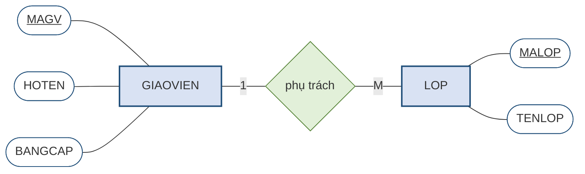

Điều đáng chú ý nhất ở hình trên là nó **đọc thành lời được**, và câu đọc ra là một câu tiếng Việt bình thường: *"Mỗi giáo viên — có mã giáo viên, họ tên, bằng cấp — phụ trách nhiều lớp; mỗi lớp — có mã lớp, tên lớp — do đúng một giáo viên phụ trách."* Chính đặc điểm này làm nên giá trị của mô hình ER. Chủ trung tâm ABC không biết gì về cơ sở dữ liệu vẫn đọc được lược đồ và có thể nói ngay: *"chỗ này chưa đúng, một lớp bên tôi đôi khi có hai giáo viên dạy chung"*. Một sai sót được phát hiện ở giai đoạn này chỉ tốn công sửa một nét vẽ; cũng sai sót ấy nếu để lọt tới lúc hệ thống đã chạy thì tốn kém gấp bội.

> **Chú ý.** Lược đồ ER **không phải** bản thiết kế bảng. Trong Hình 2.1 không có dòng dữ liệu nào, không có kiểu dữ liệu, không có khóa ngoại — vì đây là bản mô tả **thế giới thực**, chưa phải bản mô tả **cách lưu trữ**. Việc biến lược đồ ER thành các bảng cụ thể là công việc của Chương 3.

Ba thành phần trên mới là bộ khung. Trên bộ khung ấy, mô hình ER còn bổ sung một số sắc thái mà chương này sẽ lần lượt trình bày: thuộc tính nào đóng vai trò **thuộc tính khóa** để phân biệt các cá thể *(mục 2.3)*; một liên kết có **kết nối** và **sự tham gia** ra sao *(mục 2.5)*; và ba trường hợp đặc biệt — liên kết đệ quy, thực thể yếu, liên kết nhiều–nhiều *(mục 2.6)*. Bộ ký hiệu đầy đủ được tổng hợp thành bảng tra ở **mục 2.2.2**.

### 2.1.5. Từ quy tắc nghiệp vụ sang thành phần của mô hình ER

Đã có nguyên liệu *(quy tắc nghiệp vụ, mục 2.1.2)* và đã biết sản phẩm cần làm ra trông như thế nào *(lược đồ ER, mục 2.1.4)*, còn lại là câu hỏi nối hai đầu ấy: **đọc một câu quy tắc nghiệp vụ thì rút ra được thành phần nào của lược đồ?**

Có một quy luật rất tiện dụng: **loại từ trong câu quy tắc nghiệp vụ gợi ý loại thành phần trong lược đồ ER**. Quy luật này không phải là công thức máy móc, nhưng nó cho người thiết kế một điểm khởi đầu vững chắc.

**Bảng 2.1. Phiên dịch quy tắc nghiệp vụ sang thành phần ER**

| Trong câu quy tắc nghiệp vụ | Thường tương ứng với | Ví dụ tại Trung tâm ABC |
|---|---|---|
| **Danh từ** chỉ sự vật cần lưu thông tin | **Thực thể** *(mục 2.2)* | *"trung tâm có nhiều **giáo viên**"* → thực thể `GIAOVIEN` |
| **Danh từ** chỉ đặc điểm của một sự vật | **Thuộc tính** *(mục 2.2)* | *"mỗi giáo viên có **họ tên**, **bằng cấp**"* |
| **Động từ** nối hai danh từ | **Liên kết** *(mục 2.4)* | *"mỗi lớp **do** một giáo viên **phụ trách**"* |
| Từ chỉ **số lượng**: một, nhiều | **Kết nối** *(1:1, 1:M, M:N — mục 2.5)* | *"một giáo viên phụ trách **nhiều** lớp"* |
| Cụm **"có thể"**, **"chưa có"** | **Tham gia tùy chọn** *(mục 2.5)* | *"giáo viên **có thể chưa** phụ trách lớp nào"* |
| Cụm **"bắt buộc"**, **"phải"** | **Tham gia bắt buộc** *(mục 2.5)* | *"mỗi lớp **phải** thuộc một khóa học"* |
| **Nhiều giá trị** cho cùng một đặc điểm | **Thuộc tính đa trị** → phải tách *(mục 2.2.4)* | *"học viên có **nhiều số điện thoại**"* |

Cột giữa có ghi kèm số mục, vì ở đây người học mới chỉ cần **nhận ra tên gọi** của từng thành phần chứ chưa cần nắm hết sắc thái của nó; mỗi thành phần sẽ được học kỹ ở mục tương ứng. Bảng này vì vậy nên được xem như một **bảng tra dùng lại nhiều lần**: mục 2.9 sẽ quay lại dùng đúng nó để giải trọn vẹn bài toán Trung tâm ABC.

Cần nhấn mạnh rằng bảng trên là **gợi ý chứ không phải quy tắc tuyệt đối**. Không phải danh từ nào cũng thành thực thể — nếu một danh từ chỉ có duy nhất một đặc điểm và không liên kết với gì khác, nó thường chỉ nên là thuộc tính. Mục 2.2.1 sẽ đưa ra tiêu chí phân biệt.

---

## 2.2. Thực thể và thuộc tính

*(1,5 tiết)*

Mục 2.1.4 đã giới thiệu ba thành phần của lược đồ ER ở mức toàn cảnh. Từ đây trở đi, chương này đi vào từng thành phần theo đúng thứ tự ấy. Mục 2.2 bàn về **hai thành phần đầu — thực thể và thuộc tính**; liên kết sẽ được bàn từ mục 2.4.

### 2.2.1. Thực thể và thể hiện thực thể

> **Định nghĩa 2.3.** **Thực thể** *(entity)* — chính xác hơn là **kiểu thực thể** *(entity type)* — là một **loại sự vật hoặc sự kiện** mà tổ chức cần lưu trữ thông tin về nó. **Thể hiện thực thể** *(entity instance)* là **một cá thể cụ thể** thuộc loại đó.

Cặp khái niệm này song song hoàn toàn với cặp *lược đồ – thể hiện* ở mục 1.4.4 của Chương 1. `HOCVIEN` là một thực thể — nó là cái khuôn, mô tả rằng mọi học viên đều có mã, họ tên, ngày sinh. Còn "HV01, Trần An, sinh 12/04/2005" là một **thể hiện** — một cá thể cụ thể đúc ra từ khuôn ấy. Trong lược đồ ER ta chỉ vẽ **thực thể**; các thể hiện chỉ xuất hiện khi hệ thống đã vận hành và có dữ liệu thật.

Câu hỏi khó hơn là: **khi nào một danh từ xứng đáng trở thành thực thể?** Có ba tiêu chí thực dụng.

Thứ nhất, nó phải có **nhiều hơn một đặc điểm** cần lưu. Nếu về "màu sắc" ta chỉ cần lưu duy nhất tên màu, thì màu sắc nên là một thuộc tính chứ không phải một thực thể. Nhưng nếu ta còn cần lưu mã màu, nhà cung cấp sơn và ngày cập nhật bảng màu, thì nó đã đủ tư cách làm thực thể.

Thứ hai, nó phải có **nhiều cá thể phân biệt được**. Một sự vật chỉ tồn tại đúng một bản — chẳng hạn "bản thân trung tâm ABC" — không nên làm thực thể, vì bảng dữ liệu tương ứng sẽ chỉ có một dòng.

Thứ ba, nó phải **có liên kết với sự vật khác**. Một danh từ đứng biệt lập, không liên hệ với bất cứ gì trong hệ thống, thường là dấu hiệu nó nằm ngoài phạm vi bài toán.

### 2.2.2. Ký pháp Chen — bộ ký hiệu của lược đồ ER

Hình 2.1 mới dùng tới ba ký hiệu cơ bản — chữ nhật, oval, hình thoi. Bộ ký hiệu đầy đủ còn vài ký hiệu nữa, và trước khi đi tiếp vào các khái niệm thì cần thống nhất **cách vẽ** cho cả chương. Giáo trình này chọn **ký pháp Chen** làm ký pháp chính, vì ba lý do.

Thứ nhất, đây là **ký pháp gốc**, do chính Peter Chen đề xuất năm 1976 cùng với mô hình ER. Thứ hai, nó **tường minh nhất**: mỗi khái niệm có một ký hiệu riêng, nhìn vào hình là đọc ra ngay, không cần tra bảng quy ước. Thứ ba — và quan trọng nhất về mặt sư phạm — nó **buộc người vẽ phải nghĩ**: muốn vẽ một thuộc tính đa trị, ta phải cố tình vẽ hai đường viền; muốn vẽ một thuộc tính khóa, ta phải cố tình gạch chân. Mỗi nét vẽ là một quyết định thiết kế được ghi nhận. Ký pháp Crow's Foot gọn hơn nhưng lại giấu bớt các quyết định ấy đi, nên phù hợp hơn ở giai đoạn làm tài liệu chứ không phải giai đoạn học.

**Bảng 2.2. Bộ ký hiệu của ký pháp Chen**

| Khái niệm | Ký hiệu Chen | Ghi chú |
|---|---|---|
| **Thực thể** | Hình chữ nhật | Ghi tên thực thể, viết in |
| **Thực thể yếu** | Hình chữ nhật **hai đường viền** | Xem mục 2.6.3 |
| **Thuộc tính** | Hình **oval** nối với thực thể bằng một đoạn thẳng | |
| **Thuộc tính khóa** | Oval có tên **gạch chân** | Xem mục 2.3 |
| **Thuộc tính đa trị** | Oval **hai đường viền** | Phải tách — xem mục 2.2.4 |
| **Thuộc tính dẫn xuất** | Oval **nét đứt** | Thường không lưu — xem mục 2.2.5 |
| **Thuộc tính phức hợp** | Oval mẹ, các oval con nối vào | |
| **Liên kết** | Hình **thoi** đặt giữa hai thực thể | Ghi động từ |
| **Liên kết định danh** | Hình thoi **hai đường viền** | Nối tới thực thể yếu |
| **Lực lượng** | Ghi `1`, `M`, `N` **trên cạnh nối** | Xem mục 2.5 |
| **Tham gia bắt buộc** | Cạnh nối vẽ **hai vạch** | |

**Hình 2.2. Bộ ký hiệu Chen — tổng quan**

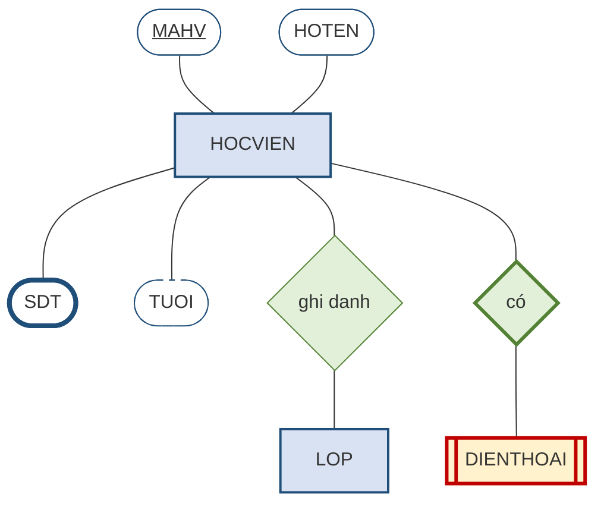

Đọc hình trên theo thứ tự: `MAHV` là **thuộc tính khóa** *(gạch chân)*; `HOTEN` là thuộc tính thường; `SDT` là **thuộc tính đa trị** *(viền dày, thể hiện hai đường viền)*; `TUOI` là **thuộc tính dẫn xuất** *(nét đứt)*; `DIENTHOAI` là **thực thể yếu** *(chữ nhật hai viền)* nối với `HOCVIEN` qua **liên kết định danh** *(hình thoi viền dày)*.

> **Chú ý về hình vẽ trong giáo trình này.** Công cụ vẽ được dùng để tạo hình minh họa thể hiện oval dưới dạng **hình bo tròn hai đầu**, và thể hiện "hai đường viền" bằng **đường viền dày**. Khi vẽ tay hoặc vẽ bằng draw.io, người học hãy vẽ đúng chuẩn: **oval thật** và **hai đường viền thật**.

### 2.2.3. Bốn cặp phân loại thuộc tính

> **Định nghĩa 2.4.** **Thuộc tính** *(attribute)* là một **đặc điểm** của thực thể mà ta cần lưu trữ.

Thuộc tính được phân loại theo bốn cặp tiêu chí độc lập với nhau. Một thuộc tính cụ thể sẽ mang một giá trị trên mỗi cặp — chẳng hạn có thể vừa là *phức hợp* vừa là *đơn trị* vừa là *lưu trữ* vừa là *bắt buộc*.

**Bảng 2.3. Bốn cặp phân loại thuộc tính**

| Cặp tiêu chí | Loại thứ nhất | Loại thứ hai | Ví dụ tại Trung tâm ABC |
|---|---|---|---|
| **Theo cấu trúc** | **Đơn** *(simple)* — không chia nhỏ được | **Phức hợp** *(composite)* — gồm nhiều phần có nghĩa | `NGAYSINH` là đơn; `DIACHI` là phức hợp *(số nhà, đường, quận, tỉnh)* |
| **Theo số giá trị** | **Đơn trị** *(single-valued)* — một cá thể có một giá trị | **Đa trị** *(multivalued)* — một cá thể có nhiều giá trị | `HOTEN` là đơn trị; `SDT` của học viên là **đa trị** |
| **Theo nguồn gốc** | **Lưu trữ** *(stored)* — được nhập vào và cất giữ | **Dẫn xuất** *(derived)* — tính ra từ thuộc tính khác | `NGAYSINH` là lưu trữ; `TUOI` là **dẫn xuất** |
| **Theo tính bắt buộc** | **Bắt buộc** *(required)* — không được để trống | **Tùy chọn** *(optional)* — được phép trống | `HOTEN` bắt buộc; `EMAIL` có thể tùy chọn |

Để thấy rõ hai ký pháp khác nhau thế nào, hãy vẽ **cùng một thực thể** theo cả hai cách.

**Hình 2.3. Thuộc tính của thực thể `HOCVIEN` — ký pháp Chen và ký pháp Crow's Foot**

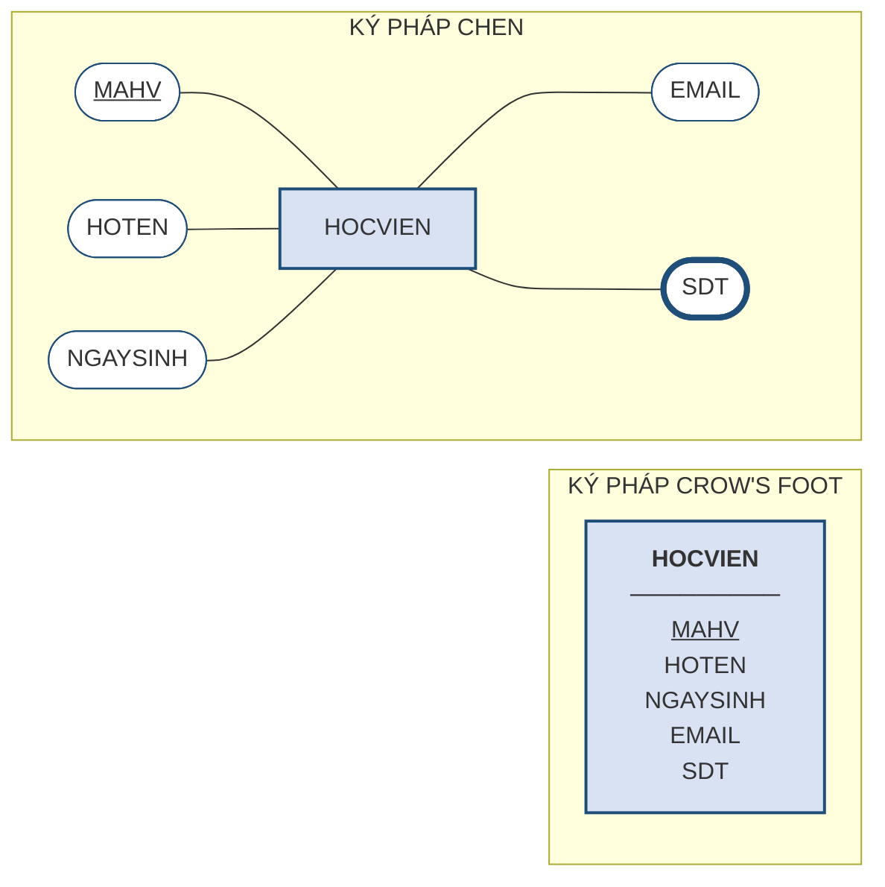

Hai cách vẽ chứa **cùng một lượng thông tin**, nhưng phân bố khác hẳn. Ký pháp Chen **trải thuộc tính ra ngoài** thành các oval riêng biệt: nhờ vậy mỗi thuộc tính có chỗ để mang ký hiệu riêng của nó — gạch chân cho khóa, viền kép cho đa trị, nét đứt cho dẫn xuất. Ký pháp Crow's Foot **gom thuộc tính vào trong ô chữ nhật** thành một danh sách: gọn hơn rất nhiều, nhưng vì mỗi thuộc tính chỉ còn là một dòng chữ nên nó **mất chỗ để thể hiện các sắc thái ấy** — thường chỉ giữ lại được gạch chân cho khóa.

Đó là lý do giáo trình chọn Chen cho phần học lý thuyết và phần giải bài, còn Crow's Foot dùng khi cần trình bày lược đồ lớn. Mục 2.8.3 sẽ trình bày kỹ ký pháp Crow's Foot.

Hai cặp đầu có hệ quả thiết kế trực tiếp. Với thuộc tính **phức hợp**, người thiết kế phải quyết định: tách thành các thuộc tính con hay giữ nguyên một khối? Nguyên tắc là **tách nếu về sau còn cần truy vấn theo từng phần**. Nếu trung tâm cần thống kê học viên theo quận, thì `DIACHI` phải tách. Nếu địa chỉ chỉ dùng để in lên giấy chứng nhận, giữ nguyên một khối là đủ.

Với thuộc tính **đa trị**, không có lựa chọn nào cả — nó **bắt buộc phải tách**, và đây là nội dung mục tiếp theo.

### 2.2.4. Thuộc tính đa trị và ba cách xử lý

Đây là quyết định thiết kế đầu tiên trong chương có một đáp án đúng duy nhất, nên đáng để phân tích kỹ.

> **Ví dụ 2.2.** Học viên Trần An có **ba số điện thoại**. Cần lưu trữ như thế nào?

**Hình 2.4. Ba cách xử lý thuộc tính đa trị — chỉ một cách đúng**

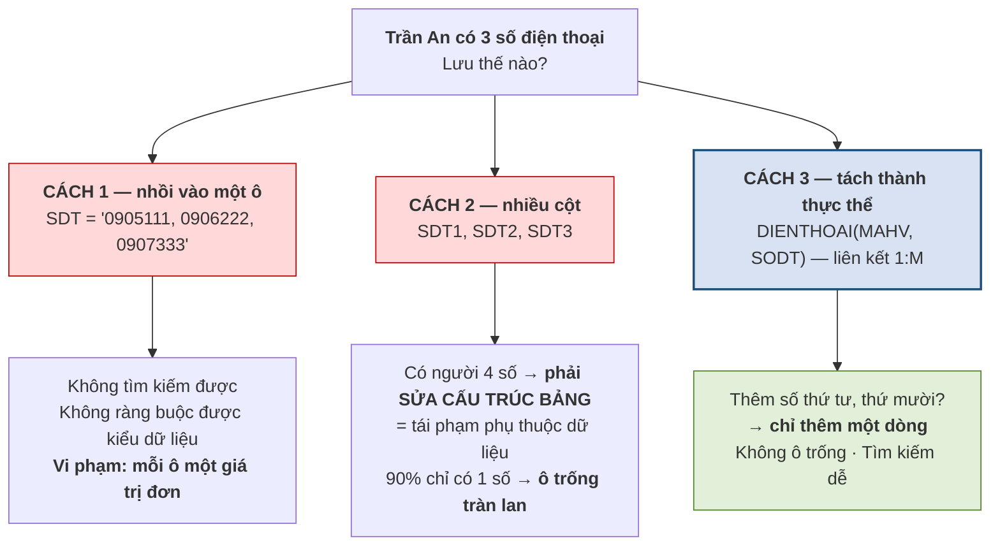

**Cách 1 — nhồi mọi số vào một ô**, ngăn cách bằng dấu phẩy. Cách này hỏng vì ba lý do. Không tìm kiếm được: câu hỏi *"số 0906222 là của ai?"* buộc hệ thống phải dò từng chuỗi ký tự. Không kiểm tra được: hệ quản trị chỉ thấy một chuỗi văn bản nên không thể bảo đảm mỗi phần tử đều là số điện thoại hợp lệ. Và quan trọng nhất, nó vi phạm nguyên tắc **mỗi ô chứa đúng một giá trị đơn** — nguyên tắc này sẽ được gọi tên chính thức ở Chương 5 là **dạng chuẩn 1**.

**Cách 2 — tạo ba cột** `SDT1`, `SDT2`, `SDT3`. Cách này thoạt nhìn hợp lý nhưng hỏng vì hai lý do nghiêm trọng hơn. Thứ nhất, nó **đoán trước một con số** mà thực tế không đoán được: hôm nay ba cột là đủ, ngày mai có học viên khai bốn số thì phải **sửa cấu trúc bảng** — đúng là lỗi *phụ thuộc dữ liệu* mà Chương 1 đã chỉ ra ở mục 1.3.1. Thứ hai, nếu chín mươi phần trăm học viên chỉ có một số, thì hai cột còn lại **trống ở hầu hết các dòng**, gây lãng phí và làm mọi truy vấn phức tạp thêm.

**Cách 3 — tách thành một thực thể riêng** `DIENTHOAI` với liên kết một–nhiều tới `HOCVIEN`. Đây là cách duy nhất đúng. Muốn thêm số thứ tư, thứ mười, chỉ cần **thêm một dòng**; không có ô trống nào; và tìm kiếm theo số điện thoại trở thành một truy vấn bình thường.

**Bảng 2.4. Kiểm chứng cách 3 bằng bốn câu hỏi khó**

| Câu hỏi | Cách 1 | Cách 2 | Cách 3 |
|---|:--:|:--:|:--:|
| Học viên khai thêm số thứ tư | Sửa chuỗi, dễ sai | **Sửa cấu trúc bảng** | Thêm một dòng |
| Tìm chủ nhân của số `0906222` | Dò từng chuỗi | Tìm trên 3 cột | Truy vấn thường |
| Đếm số học viên có trên hai số | Rất khó | Đếm ô không trống | Đếm nhóm |
| Bảo đảm số điện thoại đúng định dạng | Không thể | Được, nhưng ba lần | Được, một lần |

> **Chú ý.** Quy tắc rút ra là dứt khoát: **thuộc tính đa trị luôn phải tách thành một thực thể riêng.** Đây không phải là lời khuyên tùy hoàn cảnh mà là một yêu cầu bắt buộc. Người học nên tập phản xạ: hễ trong đề bài xuất hiện chữ *"nhiều"* đứng trước một đặc điểm — nhiều số điện thoại, nhiều bằng cấp, nhiều kỹ năng — thì lập tức đánh dấu để tách ở bước xử lý đặc biệt.

### 2.2.5. Thuộc tính dẫn xuất — lưu lại hay tính lại?

Thuộc tính dẫn xuất đặt ra một câu hỏi thiết kế thú vị: đã tính được từ dữ liệu khác thì có nên lưu không?

Xét thuộc tính `TUOI` của học viên. Nó tính được từ `NGAYSINH`. Nếu **lưu lại**, mỗi lần đọc rất nhanh nhưng dữ liệu **sai ngay sau sinh nhật của học viên** trừ khi có cơ chế cập nhật. Nếu **tính lại mỗi lần cần**, dữ liệu luôn đúng nhưng tốn chút thời gian xử lý.

Nguyên tắc chung là **không lưu thuộc tính dẫn xuất**, vì lưu lại chính là tạo ra dư thừa — và dư thừa dẫn tới không nhất quán, đúng chuỗi nhân quả của mục 1.3.3. Trong lược đồ ER, thuộc tính dẫn xuất vẫn được vẽ ra để ghi nhận nhu cầu nghiệp vụ, nhưng đánh dấu riêng *(thường bằng đường nét đứt)* để người làm bước sau biết rằng nó không cần một cột trong bảng.

Ngoại lệ chỉ xuất hiện khi phép tính quá tốn kém và được dùng liên tục — chẳng hạn `SISO` của lớp, nếu phải đếm lại trên hàng vạn dòng ghi danh mỗi lần hiển thị. Khi ấy người ta chấp nhận lưu, nhưng **phải kèm cơ chế bảo đảm nó luôn khớp**. Tình huống này sẽ quay lại ở Chương 4 dưới dạng một ràng buộc toàn vẹn khó, và ở Chương 5 dưới tên gọi *phi chuẩn hóa*.

---

## 2.3. Thuộc tính khóa và định danh

*(0,5 tiết)*

### 2.3.1. Hai tiêu chí bắt buộc của thuộc tính khóa

> **Định nghĩa 2.5.** **Thuộc tính khóa** hay **thuộc tính định danh** *(key attribute / identifier)* của một thực thể là **một thuộc tính, hoặc một nhóm thuộc tính**, dùng để **phân biệt duy nhất** từng thể hiện của thực thể đó.
>
> Trong ký pháp Chen, thuộc tính khóa được vẽ như mọi thuộc tính khác — **một hình oval** — nhưng tên của nó được **gạch chân**.

> **Chú ý về thuật ngữ.** Giáo trình này dùng **"thuộc tính khóa"** ở Chương 2 và để dành từ **"khóa"** cho Chương 3. Lý do không phải là câu nệ chữ nghĩa mà nằm ở bản chất hai mô hình. Trong mô hình ER, **mọi thứ gắn vào thực thể đều là thuộc tính**; khóa chỉ là một *loại thuộc tính đặc biệt* — và ký pháp Chen thể hiện đúng điều đó bằng cách vẫn vẽ nó là một oval, chỉ thêm gạch chân. Sang Chương 3, mô hình quan hệ mới đưa ra cả một hệ thống khái niệm riêng — *siêu khóa, khóa dự tuyển, khóa chính, khóa ngoại* — và khi ấy từ "khóa" mang nghĩa kỹ thuật chặt chẽ hơn hẳn. Nhiều tài liệu tiếng Việt gọi tắt cả hai là "khóa"; người học cần biết để không bối rối khi đọc tài liệu khác.

Một thuộc tính khóa hợp lệ phải thỏa mãn **đồng thời hai tiêu chí**, thiếu một trong hai đều không dùng được.

**Bảng 2.5. Hai tiêu chí bắt buộc của một thuộc tính khóa**

| Tiêu chí | Nội dung | Hỏng ra sao nếu vi phạm |
|---|---|---|
| **Tính duy nhất** | Không có hai thể hiện nào mang cùng giá trị | Hai học viên cùng mã → không phân biệt được ai với ai |
| **Tính tối thiểu** | Bỏ bớt bất kỳ thuộc tính nào trong nhóm thì mất tính duy nhất | Thừa thuộc tính → tốn chỗ, ràng buộc sai, tham chiếu phình to |

Tính tối thiểu thường bị bỏ qua nhưng rất quan trọng. Giả sử ta chọn thuộc tính khóa của `HOCVIEN` là cặp `(MAHV, HOTEN)`. Cặp này đúng là duy nhất — nhưng **không tối thiểu**, vì chỉ riêng `MAHV` đã đủ duy nhất rồi. Hậu quả thực tế: mọi thực thể khác muốn tham chiếu tới học viên đều phải mang theo cả hai thuộc tính, và nếu học viên đổi tên thì phải sửa dây chuyền ở mọi nơi.

### 2.3.2. Thuộc tính khóa tự nhiên và khóa thay thế

Khi chọn thuộc tính khóa, người thiết kế đứng trước hai lựa chọn cơ bản [3, Ch.5].

> **Định nghĩa 2.6.** **Khóa tự nhiên** *(natural key)* là thuộc tính khóa được lấy từ **một thuộc tính vốn có ý nghĩa nghiệp vụ** của sự vật — số căn cước, biển số xe, mã số thuế.
>
> **Khóa thay thế** *(surrogate key)* là thuộc tính khóa **do hệ thống tự sinh ra**, thường là một số nguyên tăng dần, **không mang bất kỳ ý nghĩa nghiệp vụ nào**.

> **Ví dụ 2.3.** Với thực thể `HOCVIEN` của Trung tâm ABC, có thể chọn:
>
> - **Khóa tự nhiên:** số căn cước công dân của học viên.
> - **Khóa thay thế:** một mã `MAHV` do hệ thống tự sinh — HV01, HV02, HV03…

**Bảng 2.6. So sánh khóa tự nhiên và khóa thay thế**

| Tiêu chí | Khóa tự nhiên | Khóa thay thế |
|---|---|---|
| **Ý nghĩa** | Người đọc hiểu ngay giá trị nói gì | Vô nghĩa, chỉ để phân biệt |
| **Tính ổn định** | Có thể **đổi** *(đổi số căn cước, đổi biển số)* | Không bao giờ đổi |
| **Luôn có sẵn?** | Có thể **chưa có** lúc nhập liệu *(trẻ em chưa có căn cước)* | Luôn sinh được ngay |
| **Kích thước** | Thường dài, kiểu chuỗi | Ngắn, số nguyên — khóa ngoại nhẹ |
| **Rủi ro riêng tư** | Số căn cước lan sang mọi bảng tham chiếu | Không lộ thông tin gì |
| **Kiểm tra trùng lặp** | Tự nhiên phát hiện được người trùng | Có thể tạo **hai bản ghi cho cùng một người** mà không biết |

Kinh nghiệm thực tiễn dẫn tới một khuyến nghị khá thống nhất: **ưu tiên khóa thay thế cho khóa chính, đồng thời vẫn khai báo khóa tự nhiên như một ràng buộc duy nhất**. Cách làm này gộp được ưu điểm của cả hai — khóa chính ngắn gọn và bất biến để các bảng khác tham chiếu, còn tính duy nhất theo nghiệp vụ vẫn được hệ quản trị bảo vệ.

Lý do quyết định nằm ở cột **tính ổn định**. Khóa chính là thứ mà mọi bảng khác tham chiếu tới; nếu nó thay đổi, toàn bộ tham chiếu phải sửa theo. Mà thuộc tính nghiệp vụ thì **luôn có khả năng thay đổi** — điều mà người thiết kế ở thời điểm đầu dự án thường tin chắc là không bao giờ xảy ra.

> **Chú ý.** Đừng dùng khóa thay thế như một cái cớ để **né tránh việc suy nghĩ**. Gán một mã tự sinh cho mọi thực thể là việc dễ, nhưng nếu không đồng thời xác định đâu là tổ hợp thuộc tính thật sự phân biệt các cá thể, hệ thống sẽ lặng lẽ chứa các bản ghi trùng lặp — cùng một học viên đăng ký hai lần với hai mã khác nhau. **Khóa thay thế thay thế cho khóa chính, không thay thế cho việc phân tích.**

### 2.3.3. Thuộc tính khóa phức hợp

Đôi khi không thuộc tính đơn lẻ nào đủ phân biệt, và ta cần **thuộc tính khóa phức hợp** — nhóm gồm từ hai thuộc tính trở lên. Trong ký pháp Chen, cả hai oval đều được gạch chân.

Trường hợp điển hình là thực thể `GHIDANH` của Trung tâm ABC. Một lượt ghi danh không có mã riêng; điều phân biệt lượt này với lượt kia là **cặp** *(học viên nào, lớp nào)*. Vì vậy thuộc tính khóa của nó là `(MAHV, MALOP)`.

Thuộc tính khóa phức hợp xuất hiện tự nhiên ở hai chỗ mà chương này sẽ gặp lại: **thực thể yếu** *(mục 2.6.3)* và **thực thể kết hợp sinh ra từ liên kết nhiều–nhiều** *(mục 2.6.4)*.

---

## 2.4. Liên kết và kỹ thuật hỏi hai chiều

*(1,0 tiết)*

### 2.4.1. Liên kết

> **Định nghĩa 2.7.** **Liên kết** *(relationship)* là một **mối liên hệ có ý nghĩa nghiệp vụ** giữa các thực thể.
>
> Trong ký pháp Chen, liên kết được vẽ bằng một **hình thoi** đặt giữa hai thực thể, bên trong ghi **động từ** mô tả mối liên hệ.

Trong quy tắc nghiệp vụ, liên kết thường xuất hiện dưới dạng **động từ** nối hai danh từ: giáo viên **phụ trách** lớp, học viên **ghi danh** lớp, khóa học **là tiên quyết của** khóa học khác.

Việc dành hẳn một ký hiệu riêng cho liên kết là một lựa chọn có chủ ý của Chen, và nó có giá trị thực tế. Vì liên kết là một hình độc lập chứ không phải chỉ là một đường kẻ, **nó có chỗ để mang thuộc tính riêng** — điều sẽ trở nên thiết yếu ở mục 2.6.4 khi ta gặp liên kết nhiều–nhiều có thuộc tính. Ký pháp Crow's Foot vẽ liên kết chỉ bằng một đường nối, nên khi liên kết có thuộc tính thì buộc phải tạo thêm một ô chữ nhật — tức là phải quyết định sớm hơn.

Việc phát hiện ra có một liên kết thường không khó. Cái khó nằm ở bước tiếp theo: **xác định cho đúng loại liên kết ấy là 1:1, 1:M hay M:N**. Xác định sai ở đây kéo theo sai toàn bộ thiết kế các bước sau, và đây là lỗi phổ biến nhất của người mới học.

### 2.4.2. Kỹ thuật hỏi hai chiều

Có một kỹ thuật đơn giản loại bỏ gần như hoàn toàn khả năng nhầm lẫn: **luôn đặt hai câu hỏi, mỗi câu cho một chiều**, rồi ghép hai câu trả lời lại.

**Hình 2.5. Kỹ thuật hỏi hai chiều — quy trình xác định loại liên kết**

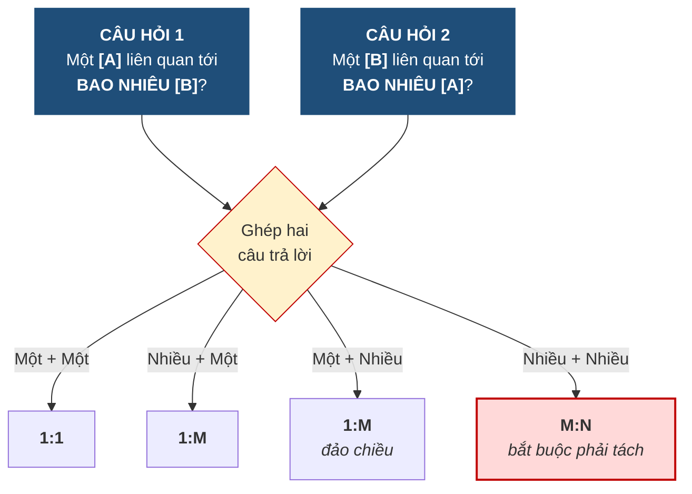

Sức mạnh của kỹ thuật này nằm ở chỗ nó **buộc người thiết kế phải hỏi cả chiều ngược lại** — mà chiều ngược lại chính là chiều người ta hay quên. Khi nghe *"một giáo viên phụ trách nhiều lớp"*, phản xạ tự nhiên là kết luận ngay 1:M. Nhưng nếu không hỏi tiếp *"một lớp do bao nhiêu giáo viên phụ trách?"*, ta có thể bỏ sót trường hợp trung tâm cho phép hai giáo viên đồng phụ trách một lớp — và khi ấy liên kết thật sự là M:N.

### 2.4.3. Áp dụng cho Trung tâm Anh ngữ ABC

**Bảng 2.7. Bảng hỏi hai chiều cho Trung tâm ABC**

| Cặp thực thể | Câu hỏi chiều thứ nhất | Câu hỏi chiều thứ hai | Kết luận |
|---|---|---|:--:|
| `GIAOVIEN` – `LOP` | Một giáo viên phụ trách bao nhiêu lớp? → **Nhiều** *(hoặc chưa lớp nào)* | Một lớp do bao nhiêu giáo viên phụ trách? → **Một** | **1:M** |
| `KHOAHOC` – `LOP` | Một khóa học mở bao nhiêu lớp? → **Nhiều** | Một lớp thuộc bao nhiêu khóa học? → **Một** | **1:M** |
| `HOCVIEN` – `DIENTHOAI` | Một học viên có bao nhiêu số? → **Nhiều** | Một số thuộc bao nhiêu học viên? → **Một** | **1:M** |
| `HOCVIEN` – `LOP` | Một học viên ghi danh bao nhiêu lớp? → **Nhiều** | Một lớp có bao nhiêu học viên? → **Nhiều** | **M:N** |
| `KHOAHOC` – `KHOAHOC` | Một khóa là tiên quyết của bao nhiêu khóa? → **Nhiều** | Một khóa có bao nhiêu khóa tiên quyết? → **Nhiều** | **M:N đệ quy** |

Hai dòng cuối cần lưu ý đặc biệt vì chúng là **liên kết nhiều–nhiều**, và như mục 2.6.4 sẽ chỉ ra, loại liên kết này **bắt buộc phải tách** trước khi chuyển sang thiết kế bảng.

---

## 2.5. Kết nối, lực lượng và sự tham gia

*(1,0 tiết)*

### 2.5.1. Kết nối và lực lượng

Hai khái niệm này thường bị dùng lẫn, nhưng chúng mô tả hai mức chi tiết khác nhau của cùng một sự việc.

> **Định nghĩa 2.8.** **Kết nối** *(connectivity)* mô tả **loại** của liên kết ở mức khái quát: một–một *(1:1)*, một–nhiều *(1:M)* hay nhiều–nhiều *(M:N)*.
>
> **Lực lượng** *(cardinality)* mô tả **con số cụ thể**: số lượng tối thiểu và tối đa các thể hiện tham gia, viết dưới dạng cặp `(min, max)`.

> **Ví dụ 2.4.** Quy tắc *"mỗi lớp có ít nhất 5 và nhiều nhất 25 học viên"* cho biết **kết nối** là nhiều–nhiều nếu xét cả hai chiều, còn **lực lượng** ở phía học viên là `(5, 25)`.

Trong ký pháp Chen, kết nối được ghi bằng các ký tự **`1`, `M`, `N` đặt ngay trên cạnh nối** giữa thực thể và hình thoi liên kết; còn lực lượng chi tiết thì viết dưới dạng cặp `(min, max)` đặt cạnh đó.

**Hình 2.6. Ký pháp Chen — ba loại kết nối, minh họa tại Trung tâm ABC**

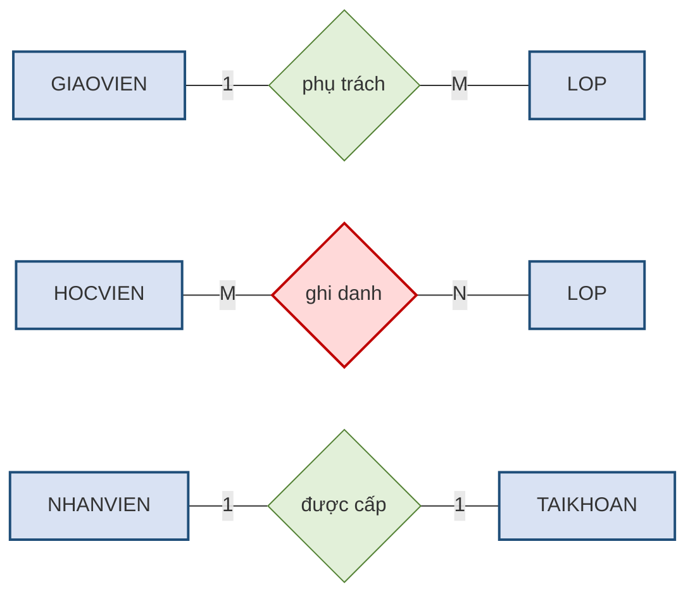

Cách đọc rất trực tiếp và đây là ưu điểm lớn của ký pháp Chen: **con số ghi ở đầu nào cho biết số lượng thực thể ở đầu đó**. Dòng thứ nhất đọc là *"một giáo viên phụ trách M lớp, một lớp do 1 giáo viên phụ trách"* — tức **1:M**. Dòng thứ hai có `M` và `N` ở hai đầu nên là **M:N**, và liên kết này được tô đỏ vì nó **bắt buộc phải tách** theo mục 2.6.4.

> **Chú ý.** Một số tài liệu ghi con số theo quy ước ngược lại — đặt ở đầu **đối diện**. Khi đọc lược đồ của người khác, việc đầu tiên cần làm là **kiểm tra quy ước** bằng một liên kết mà bản thân mình chắc chắn biết loại, rồi mới đọc các liên kết còn lại. Giáo trình này nhất quán dùng quy ước *"con số ở đầu nào mô tả đầu đó"*.

Lực lượng chi tiết hơn kết nối, và nó ghi lại những quy định nghiệp vụ mà kết nối không diễn tả nổi. Tuy vậy phần lớn các con số lực lượng **không được hệ quản trị kiểm tra tự động** — chúng sẽ trở thành các ràng buộc toàn vẹn phải xử lý riêng ở Chương 4.

### 2.5.2. Sự tham gia: tùy chọn hay bắt buộc

> **Định nghĩa 2.9.** **Sự tham gia** *(participation)* cho biết một thể hiện của thực thể **có buộc phải** tham gia vào liên kết hay không.
>
> - **Tham gia bắt buộc** *(mandatory)*: mọi thể hiện đều phải tham gia — tương ứng `min = 1`.
> - **Tham gia tùy chọn** *(optional)*: có thể có thể hiện không tham gia — tương ứng `min = 0`.

Điểm dễ nhầm nhất — và đáng nhấn mạnh — là **hai chiều của cùng một liên kết có thể có tính tham gia khác nhau**.

> **Ví dụ 2.5.** Xét liên kết *"giáo viên phụ trách lớp"* tại Trung tâm ABC.
>
> - Chiều từ `LOP`: **bắt buộc**. Không thể tồn tại một lớp không có giáo viên nào phụ trách — trung tâm không mở lớp như vậy.
> - Chiều từ `GIAOVIEN`: **tùy chọn**. Một giáo viên mới tuyển, chưa được phân lớp nào, vẫn là giáo viên của trung tâm và vẫn phải có trong hệ thống.

Sự bất đối xứng này có hệ quả rất cụ thể ở Chương 3. Tham gia **bắt buộc** sẽ trở thành ràng buộc *không được rỗng* trên khóa ngoại; tham gia **tùy chọn** thì cho phép rỗng. Xác định sai một trong hai, hệ thống hoặc từ chối những dữ liệu hợp lệ, hoặc chấp nhận những dữ liệu vô nghĩa.

> **Chú ý.** Trong đề bài, tính tham gia tùy chọn hầu như luôn được báo hiệu bằng những cụm từ như *"có thể"*, *"chưa có"*, *"không nhất thiết"*. Người học nên tập thói quen **khoanh tròn những cụm từ này ngay khi đọc đề** — chúng là thông tin thiết kế chứ không phải lời văn thừa.

### 2.5.3. Thể hiện sự tham gia trong hai ký pháp

**Trong ký pháp Chen**, tính tham gia được thể hiện bằng **số nét của cạnh nối** giữa thực thể và hình thoi liên kết: cạnh **một nét** nghĩa là tham gia **tùy chọn**, cạnh **hai nét song song** nghĩa là tham gia **bắt buộc**. Cách khác, tường minh hơn và ngày càng phổ biến, là **ghi thẳng cặp `(min, max)`** lên cạnh nối — khi đó `(0, N)` là tùy chọn còn `(1, N)` là bắt buộc. Giáo trình này dùng cách ghi cặp số vì nó không gây nhầm và đọc được ngay.

**Trong ký pháp Crow's Foot**, tính tham gia và kết nối được gộp vào **một ký hiệu duy nhất đặt ở đầu mút** của đường liên kết. Đây là điểm mạnh nhất của ký pháp này.

**Bảng 2.8. Ký hiệu đầu mút Crow's Foot — gộp kết nối và tham gia**

| Ký hiệu đầu mút | Đọc là | Nghĩa `(min, max)` |
|---|---|:--:|
| Hai gạch ngang | Đúng một, bắt buộc | `(1, 1)` |
| Vòng tròn kèm một gạch | Không quá một, tùy chọn | `(0, 1)` |
| Một gạch kèm chân quạ | Một hoặc nhiều, bắt buộc | `(1, N)` |
| Vòng tròn kèm chân quạ | Không hoặc nhiều, tùy chọn | `(0, N)` |

**Hình 2.7. Bốn ký hiệu đầu mút của ký pháp Crow's Foot**

Trên hình, **thực thể nằm bên phải** và đường liên kết đi tới từ bên trái. Thứ tự đặt ký hiệu tuân theo đúng quy tắc *đọc từ ngoài vào trong*: ký hiệu **xa thực thể** cho biết `min`, ký hiệu **sát thực thể** cho biết `max`.

Có một mẹo đọc rất dễ nhớ: **vòng tròn đọc là "không", gạch đọc là "một", chân quạ đọc là "nhiều"**. Ký hiệu ở đầu mút gồm hai phần — phần ngoài cùng cho biết `min`, phần trong cho biết `max`. Vậy "vòng tròn kèm chân quạ" đọc là *"không hoặc nhiều"*.

Mục 2.8.3 sẽ trình bày kỹ hơn cách đọc một lược đồ Crow's Foot hoàn chỉnh.

---

## 2.6. Bậc liên kết, thực thể yếu và thực thể kết hợp

*(1,5 tiết)*

### 2.6.1. Bậc của liên kết

> **Định nghĩa 2.10.** **Bậc** *(degree)* của một liên kết là **số thực thể tham gia** vào liên kết đó.

Liên kết **bậc hai** *(binary)* nối hai thực thể khác nhau và chiếm áp đảo trong thực tế. Liên kết **bậc một** *(unary)* nối một thực thể với chính nó — gọi là liên kết đệ quy, trình bày ở mục sau. Liên kết **bậc ba** *(ternary)* nối ba thực thể cùng lúc; loại này hiếm và thường nên tách thành các liên kết bậc hai để dễ xử lý.

### 2.6.2. Liên kết đệ quy

> **Định nghĩa 2.11.** **Liên kết đệ quy** *(recursive relationship)* là liên kết mà **một thực thể liên hệ với chính nó**.

Loại liên kết này thường gây bối rối lúc đầu, nhưng nó xuất hiện rất nhiều trong đời sống.

**Hình 2.8. Ba ví dụ liên kết đệ quy, vẽ theo ký pháp Chen**

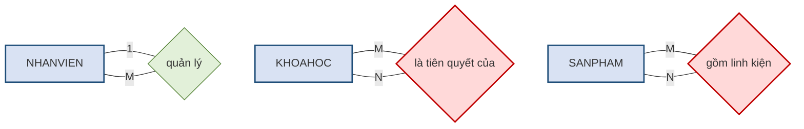

Điểm đáng chú ý về mặt ký pháp: liên kết đệ quy vẽ theo Chen **không có gì đặc biệt** — vẫn là một hình thoi, chỉ khác ở chỗ **cả hai cạnh của nó cùng nối về một hình chữ nhật**. Đây lại là một ưu điểm nữa của Chen: người học không phải nhớ thêm ký hiệu mới nào cho trường hợp này.

Ví dụ thứ nhất là **quan hệ quản lý**: một nhân viên quản lý nhiều nhân viên khác, và mỗi nhân viên có một người quản lý. Đây là đệ quy 1:M.

Ví dụ thứ hai là **khóa học tiên quyết** — chính là quy tắc thứ bảy trong bài toán Trung tâm ABC. Một khóa học có thể là tiên quyết của nhiều khóa khác, và một khóa có thể đòi hỏi nhiều khóa tiên quyết. Đây là đệ quy M:N.

Ví dụ thứ ba là **cấu thành sản phẩm**: một sản phẩm gồm nhiều linh kiện, mà mỗi linh kiện cũng có thể là một sản phẩm được lắp từ các linh kiện nhỏ hơn.

> **Chú ý.** Liên kết đệ quy **M:N phải tách** giống hệt liên kết M:N thông thường. Điểm khác biệt duy nhất là bảng sinh ra sẽ có **hai cột cùng tham chiếu về một bảng**, nên phải đặt tên hai cột khác nhau để phân biệt vai trò — chẳng hạn `TIENQUYET(MAKH_truoc, MAKH_sau)`. Quên đặt tên phân biệt là lỗi rất hay gặp.

### 2.6.3. Thực thể mạnh và thực thể yếu

> **Định nghĩa 2.12.** **Thực thể yếu** *(weak entity)* là thực thể thỏa mãn **đồng thời hai điều kiện**:
>
> 1. **Phụ thuộc tồn tại**: nó không thể tồn tại nếu thực thể chủ không tồn tại.
> 2. **Thuộc tính khóa không đầy đủ**: nó phải mượn thuộc tính khóa của thực thể chủ mới đủ phân biệt.
>
> Thực thể không thỏa mãn cả hai điều kiện gọi là **thực thể mạnh** *(strong entity)*.

Phải nhấn mạnh chữ **đồng thời**. Rất nhiều thực thể phụ thuộc tồn tại vào thực thể khác nhưng vẫn có thuộc tính khóa riêng đầy đủ, và những thực thể đó **không phải** là thực thể yếu.

> **Ví dụ 2.6.** Thực thể `DIENTHOAI` của Trung tâm ABC là thực thể **yếu**. Điều kiện thứ nhất thỏa mãn: một số điện thoại chỉ tồn tại trong hệ thống khi gắn với một học viên; xóa học viên thì số điện thoại của họ cũng không còn ý nghĩa. Điều kiện thứ hai cũng thỏa mãn: bản thân số điện thoại không đủ làm thuộc tính khóa nếu ta cho phép hai học viên dùng chung một số máy bàn gia đình, nên thuộc tính khóa phải là cặp `(MAHV, SODT)`.
>
> Ngược lại, thực thể `LOP` **không phải** là thực thể yếu, dù mỗi lớp đều phải thuộc một khóa học. Lý do: `MALOP` tự nó đã đủ phân biệt mọi lớp, không cần mượn `MAKH`. Đây chỉ là phụ thuộc tồn tại chứ không phải thực thể yếu.

Trong ký pháp Chen, thực thể yếu và liên kết dẫn tới nó đều được vẽ bằng **hai đường viền** — một quy ước rất hợp lý, vì hai đặc điểm ấy luôn đi cùng nhau.

**Hình 2.9. Thực thể yếu trong ký pháp Chen — trường hợp `DIENTHOAI`**

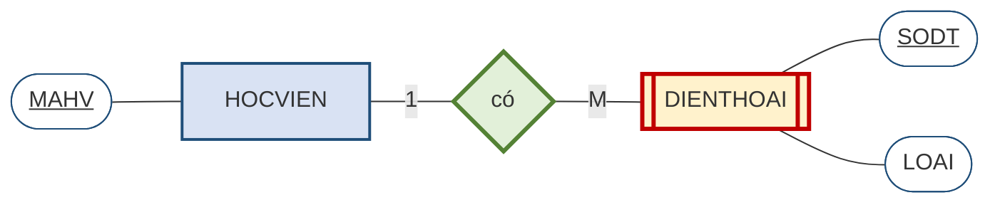

Hình trên đọc như sau. `DIENTHOAI` vẽ **chữ nhật hai viền** vì nó là thực thể yếu. Liên kết *"có"* vẽ **hình thoi hai viền** vì đây là **liên kết định danh** *(identifying relationship)* — chính nó cung cấp phần khóa còn thiếu. Bên trong `DIENTHOAI`, thuộc tính `SODT` được gạch chân, nhưng **nó chỉ là một nửa của thuộc tính khóa**; nửa còn lại là `MAHV` mượn từ `HOCVIEN` qua liên kết định danh. Ghép lại mới đủ phân biệt.

**Bảng 2.9. Cùng một sự vật, hai cách đặt thuộc tính khóa cho hai kết luận khác nhau**

| Tình huống | Thuộc tính khóa | Có phải thực thể yếu? |
|---|---|---|
| Mỗi số điện thoại chỉ thuộc đúng một học viên và không trùng lặp trong toàn hệ thống | `SODT` — đủ duy nhất một mình | **Không** — chỉ phụ thuộc tồn tại |
| Hai học viên trong cùng gia đình khai chung một số máy bàn | `(MAHV, SODT)` — phải mượn khóa của thực thể chủ | **Có** — thực thể yếu |

Ví dụ này minh họa một điều quan trọng về nghề thiết kế: **cùng một sự vật ngoài đời có thể cho hai mô hình khác nhau, tùy vào quy tắc nghiệp vụ**. Không có đáp án đúng tuyệt đối tách rời khỏi ngữ cảnh — và đó chính là lý do quy tắc nghiệp vụ ở mục 2.1 phải được thu thập cho thật rõ ràng.

### 2.6.4. Thực thể kết hợp — vì sao liên kết M:N bắt buộc phải tách

Đây là nội dung quan trọng nhất của mục 2.6, và là chỗ mà thiết kế của người mới học hay đổ vỡ.

Xét quy tắc thứ năm của Trung tâm ABC: *"Một học viên ghi danh nhiều lớp; một lớp có nhiều học viên. Mỗi lượt ghi danh ghi nhận ngày ghi danh và học phí."*

Câu hỏi đặt ra rất cụ thể: **thuộc tính `HOCPHI` thuộc về thực thể nào?**

**Hình 2.10. Liên kết M:N ẩn chứa một thực thể**

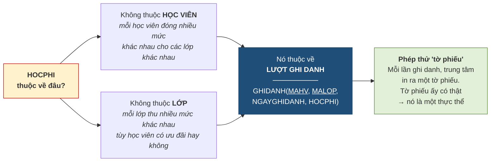

Thuộc tính `HOCPHI` **không thuộc về học viên**, vì cùng một học viên có thể đóng các mức khác nhau cho các lớp khác nhau. Nó cũng **không thuộc về lớp**, vì cùng một lớp có thể thu các mức khác nhau tùy học viên có được ưu đãi hay không. Nó chỉ có nghĩa khi gắn với **một cặp cụ thể** *(học viên này, lớp này)*.

Điều đó cho thấy giữa hai thực thể đang tồn tại một **sự vật thứ ba mà ta chưa đặt tên**: bản thân *lượt ghi danh*. Khi được đặt tên và cấp thuộc tính khóa, nó trở thành một thực thể đầy đủ.

> **Định nghĩa 2.13.** **Thực thể kết hợp** *(associative entity / bridge entity)* là thực thể sinh ra từ việc **tách một liên kết nhiều–nhiều**. Thuộc tính khóa của nó là **khóa phức hợp** ghép từ thuộc tính khóa của hai thực thể gốc, và nó có thể mang **thuộc tính riêng**.

Sau khi tách, liên kết M:N ban đầu được thay bằng **hai liên kết 1:M**: `HOCVIEN` một–nhiều `GHIDANH`, và `LOP` một–nhiều `GHIDANH`.

Một mẹo nhận biết rất hiệu quả là **phép thử tờ phiếu**: hãy tự hỏi *"mỗi lần sự việc này xảy ra, tổ chức có in ra hay ghi lại một tờ giấy nào không?"* Nếu có — phiếu ghi danh, hóa đơn, phiếu mượn sách, vé xe — thì tờ giấy ấy chính là một thực thể có thật, và các thông tin ghi trên đó chính là thuộc tính của nó.

> **Chú ý.** Cần phân biệt hai tình huống. Nếu liên kết M:N **có thuộc tính riêng** như trường hợp `GHIDANH`, thì việc tách là hiển nhiên. Nhưng ngay cả khi liên kết M:N **không có thuộc tính nào**, ta **vẫn phải tách** ở bước chuyển sang mô hình quan hệ — vì mô hình quan hệ không có cách nào biểu diễn trực tiếp một liên kết nhiều–nhiều. Điều này sẽ được chứng minh ở Chương 3.

---

## 2.7. Mô hình ER mở rộng (EER)

*(1,0 tiết)*

### 2.7.1. Vì sao cần mở rộng mô hình ER

Mô hình ER cơ bản trình bày ở các mục trên đã đủ dùng cho phần lớn bài toán. Nhưng có một tình huống mà nó xử lý rất vụng về, và tình huống ấy lại xuất hiện thường xuyên: khi **nhiều loại sự vật vừa giống nhau vừa khác nhau**.

> **Ví dụ 2.7.** Trung tâm ABC muốn quản lý toàn bộ **nhân sự** — bao gồm giáo viên và nhân viên hành chính. Cả hai nhóm đều có mã nhân sự, họ tên, ngày sinh, số điện thoại, ngày vào làm. Nhưng riêng giáo viên còn có bằng cấp và chứng chỉ tiếng Anh; riêng nhân viên hành chính có bộ phận công tác và ca làm việc.

Với mô hình ER cơ bản, người thiết kế chỉ có hai lựa chọn, và **cả hai đều tồi**.

Lựa chọn thứ nhất là **tạo hai thực thể riêng biệt** `GIAOVIEN` và `NHANVIEN_HANHCHINH`. Khi ấy năm thuộc tính chung phải khai báo **hai lần**. Đó chính là dư thừa — lần này không phải dư thừa dữ liệu mà là **dư thừa ở mức cấu trúc**. Hậu quả rất thực tế: khi trung tâm muốn bổ sung trường "email công vụ" cho mọi nhân sự, phải sửa ở hai chỗ; quên một chỗ là hai nhóm nhân sự có cấu trúc lệch nhau.

Lựa chọn thứ hai là **gộp tất cả vào một thực thể** `NHANSU` với đầy đủ mọi thuộc tính. Khi ấy mọi giáo viên đều có ô "bộ phận công tác" bỏ trống, và mọi nhân viên hành chính đều có ô "bằng cấp" bỏ trống. Bảng dữ liệu đầy ô rỗng, và tệ hơn, hệ thống **không thể ngăn** việc điền nhầm bộ phận công tác cho một giáo viên.

**Mô hình ER mở rộng** *(Extended Entity–Relationship — EER)* bổ sung đúng những khái niệm cần thiết để thoát khỏi thế lưỡng nan này.

### 2.7.2. Thực thể cha và thực thể con

> **Định nghĩa 2.14.** **Thực thể cha** *(supertype)* là thực thể chứa các **thuộc tính chung** cho một nhóm sự vật. **Thực thể con** *(subtype)* là thực thể chứa các **thuộc tính riêng** của một tập hợp con cụ thể trong nhóm đó.
>
> Quan hệ giữa chúng gọi là **quan hệ cha–con** hay **quan hệ IS-A** — đọc là *"một thực thể con LÀ MỘT thực thể cha"*.

**Hình 2.11. Phân cấp chuyên biệt hóa tại Trung tâm ABC**

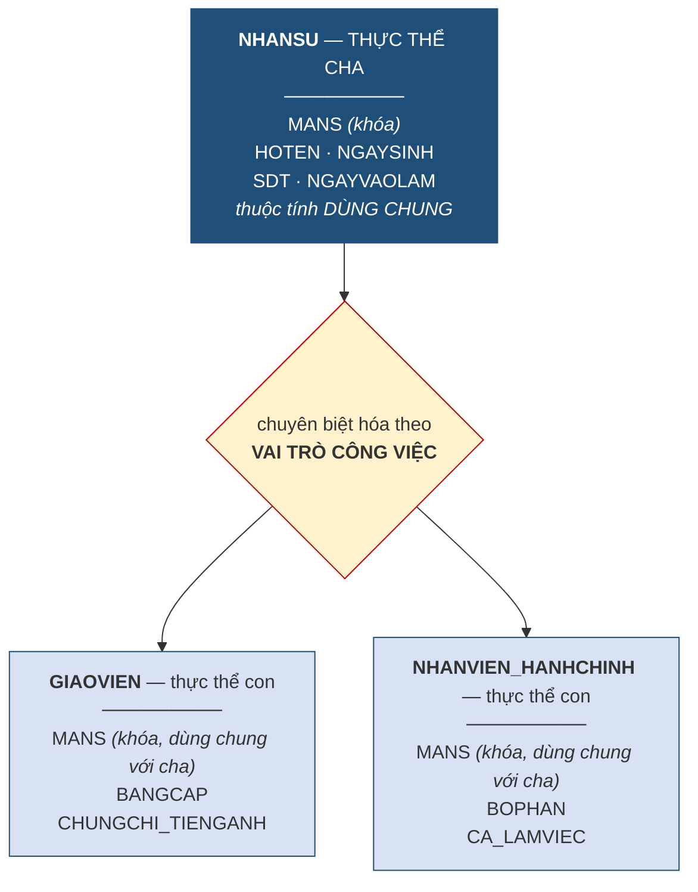

Cách đọc sơ đồ trên: *"Một giáo viên **là một** nhân sự"* và *"một nhân viên hành chính **là một** nhân sự"*. Phép thử để kiểm tra xem có đúng là quan hệ cha–con hay không chính là câu **"LÀ MỘT"**: nếu đặt vào câu ấy mà nghe xuôi thì đúng, còn nếu phải nói *"có một"* thì đó là liên kết thông thường chứ không phải cha–con.

> **Chú ý.** Đây là chỗ nhầm lẫn phổ biến nhất khi học EER. *"Lớp **có** nhiều học viên"* — dùng động từ **có**, nên đó là **liên kết** bình thường. *"Giáo viên **là một** nhân sự"* — dùng **là một**, nên đó là **quan hệ cha–con**. Người học nên đọc thành tiếng câu tiếng Việt trước khi vẽ.

Trong ký pháp chuẩn, quan hệ cha–con được vẽ bằng một hình tròn hoặc hình tam giác đặt giữa cha và các con, bên trong ghi ký hiệu ràng buộc sẽ trình bày ở mục 2.7.5.

### 2.7.3. Tính kế thừa

> **Định nghĩa 2.15.** **Kế thừa** *(inheritance)* là nguyên tắc theo đó **thực thể con tự động có mọi thuộc tính và mọi liên kết của thực thể cha**, mà không cần khai báo lại.

Đây chính là cơ chế loại bỏ dư thừa cấu trúc. Trong Hình 2.11, thực thể `GIAOVIEN` chỉ khai báo hai thuộc tính riêng, nhưng trên thực tế nó **có đầy đủ bảy thuộc tính** — năm thuộc tính kế thừa từ `NHANSU` cộng hai thuộc tính riêng.

Kế thừa áp dụng cho **cả liên kết**, và điều này rất đáng chú ý. Nếu ta khai báo liên kết *"nhân sự thuộc về một phòng ban"* ở mức thực thể cha, thì cả giáo viên lẫn nhân viên hành chính đều tự động có liên kết ấy.

Ngược lại, **liên kết riêng của thực thể con thì không lan lên cha**. Liên kết *"giáo viên phụ trách lớp"* chỉ gắn với `GIAOVIEN`; nhân viên hành chính không phụ trách lớp nào. Đây chính là ưu điểm lớn nhất của EER so với phương án gộp chung ở mục 2.7.1: nó **diễn tả được rằng chỉ một nhóm con mới có liên kết ấy**.

Thuộc tính khóa của thực thể con luôn là **thuộc tính khóa của thực thể cha**. Trong ví dụ trên, thuộc tính khóa của `GIAOVIEN` vẫn là `MANS`, không phải một mã mới. Lý do rất tự nhiên: một giáo viên **là một** nhân sự, nên hai bên nói về cùng một cá thể và phải dùng chung định danh.

### 2.7.4. Chuyên biệt hóa và tổng quát hóa

Có hai hướng đi để đến được một phân cấp cha–con, và chúng phản ánh hai tình huống làm việc khác nhau trong thực tế.

> **Định nghĩa 2.16.** **Chuyên biệt hóa** *(specialization)* là quá trình đi **từ trên xuống**: xuất phát từ một thực thể tổng quát, phát hiện ra các nhóm con có thuộc tính riêng và tách chúng ra.
>
> **Tổng quát hóa** *(generalization)* là quá trình đi **từ dưới lên**: xuất phát từ nhiều thực thể riêng lẻ, nhận ra chúng có phần chung và gộp phần chung ấy thành một thực thể cha.

**Chuyên biệt hóa** là con đường thường gặp khi xây hệ thống mới. Người thiết kế bắt đầu với `NHANSU`, rồi trong quá trình phỏng vấn phát hiện ra giáo viên cần lưu bằng cấp còn nhân viên hành chính thì không — thế là tách.

**Tổng quát hóa** là con đường thường gặp khi cải tạo hệ thống cũ. Trung tâm đã có sẵn hai bảng riêng biệt, chạy nhiều năm; người thiết kế nhìn vào và nhận ra chúng lặp lại năm cột giống hệt nhau — thế là gộp phần chung lên thành `NHANSU`.

Hai quá trình cho ra **cùng một kết quả**; chúng chỉ khác nhau ở điểm xuất phát.

### 2.7.5. Hai ràng buộc của phân cấp cha–con

Vẽ được phân cấp mới chỉ là một nửa công việc. Phần còn lại là trả lời **hai câu hỏi ràng buộc**, và câu trả lời quyết định trực tiếp cách cài đặt ở Chương 3.

**Câu hỏi thứ nhất — một cá thể có thể thuộc mấy nhóm con cùng lúc?**

> **Định nghĩa 2.17.** Ràng buộc **rời nhau** *(disjoint)*: mỗi thể hiện của thực thể cha chỉ thuộc **đúng một** thực thể con. Ký hiệu **`d`**.
>
> Ràng buộc **chồng lấn** *(overlapping)*: một thể hiện **có thể thuộc nhiều** thực thể con cùng lúc. Ký hiệu **`o`**.

**Câu hỏi thứ hai — mọi cá thể có bắt buộc thuộc một nhóm con nào đó không?**

> **Định nghĩa 2.18.** Ràng buộc **đầy đủ** *(total / complete)*: mọi thể hiện của cha **đều phải** thuộc ít nhất một con. Ký hiệu bằng **hai gạch** nối cha với vòng tròn.
>
> Ràng buộc **không đầy đủ** *(partial / incomplete)*: **có thể có** thể hiện của cha không thuộc con nào. Ký hiệu bằng **một gạch**.

Hai câu hỏi độc lập với nhau, nên có bốn tổ hợp.

**Bảng 2.10. Bốn tổ hợp ràng buộc và ví dụ tại Trung tâm ABC**

| Tổ hợp | Nghĩa | Tình huống minh họa |
|---|---|---|
| **Rời nhau + Đầy đủ** | Mỗi nhân sự thuộc **đúng một** nhóm, và **không ai** đứng ngoài | Trung tâm quy định mọi nhân sự **hoặc** là giáo viên **hoặc** là nhân viên hành chính, không kiêm nhiệm |
| **Rời nhau + Không đầy đủ** | Mỗi nhân sự thuộc **nhiều nhất một** nhóm, **có người** đứng ngoài | Ngoài hai nhóm trên còn có bảo vệ, tạp vụ — chưa được mô hình hóa thành nhóm con |
| **Chồng lấn + Đầy đủ** | Có thể thuộc **nhiều nhóm**, nhưng **không ai** đứng ngoài | Một giáo viên kiêm quản lý học vụ — thuộc cả hai nhóm; mọi nhân sự đều thuộc ít nhất một nhóm |
| **Chồng lấn + Không đầy đủ** | Có thể thuộc **nhiều nhóm**, và **có người** đứng ngoài | Trường hợp tổng quát nhất, ít ràng buộc nhất |

> **Ví dụ 2.8.** Với Trung tâm ABC, câu trả lời **phụ thuộc hoàn toàn vào quy tắc nghiệp vụ**, không phải vào sở thích của người thiết kế. Nếu chủ trung tâm nói *"cô Lê Hoa vừa dạy lớp A1 vừa phụ trách học vụ buổi sáng"*, thì ràng buộc là **chồng lấn**. Nếu chủ trung tâm nói *"chúng tôi còn có một bác bảo vệ và một cô tạp vụ"*, thì ràng buộc là **không đầy đủ**. Đây chính là lý do mục 2.1 nhấn mạnh việc thu thập quy tắc nghiệp vụ cho rõ — nếu không hỏi, người thiết kế sẽ mặc định sai.

### 2.7.6. Khi nào nên và không nên dùng EER

EER là công cụ mạnh, và giống mọi công cụ mạnh, nó bị lạm dụng khá thường xuyên. Ba tiêu chí sau giúp quyết định.

**Nên dùng** khi các nhóm con có **thuộc tính riêng khác nhau đáng kể** — từ khoảng ba thuộc tính trở lên; hoặc khi chúng có **liên kết riêng** mà nhóm khác không có; hoặc khi nghiệp vụ **thật sự phân biệt** các nhóm ấy trong quy trình làm việc.

**Không nên dùng** khi sự khác biệt giữa các nhóm chỉ nằm ở **một thuộc tính** — khi ấy chỉ cần thêm một cột phân loại là đủ; hoặc khi các nhóm con **không có thuộc tính riêng nào**, chỉ khác nhau về tên gọi; hoặc khi phân cấp sâu quá **ba tầng**, vì lúc đó sơ đồ trở nên khó đọc hơn cả vấn đề nó định giải quyết.

> **Chú ý.** Người học đã biết lập trình hướng đối tượng rất dễ lạm dụng EER, vì quan hệ cha–con trông giống hệt tính kế thừa của lớp đối tượng. Nhưng có một khác biệt căn bản: trong lập trình, kế thừa là công cụ **tái sử dụng mã nguồn**; trong thiết kế cơ sở dữ liệu, quan hệ cha–con phải phản ánh một **sự phân loại có thật trong nghiệp vụ**. Tiêu chuẩn để dùng nó không phải là "làm thế cho gọn", mà là "nghiệp vụ có thật sự phân biệt hai nhóm này không".

---

## 2.8. Quy trình xây dựng lược đồ ER và các ký pháp

*(0,5 tiết)*

### 2.8.1. Quy trình năm bước

**Hình 2.12. Quy trình năm bước xây dựng lược đồ ER**

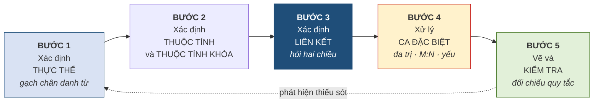

Mũi tên nét đứt quay ngược từ Bước 5 về Bước 1 không phải là chi tiết trang trí. Thiết kế cơ sở dữ liệu là một quá trình **lặp**: bước kiểm tra cuối cùng gần như luôn phát hiện ra thiếu sót, và khi ấy phải quay lại. Người thiết kế có kinh nghiệm coi việc lặp hai đến ba vòng là bình thường.

**Bước 1 — xác định thực thể.** Đọc kỹ quy tắc nghiệp vụ và gạch chân các danh từ chỉ sự vật cần lưu thông tin, rồi lọc lại bằng ba tiêu chí ở mục 2.2.1.

**Bước 2 — xác định thuộc tính và thuộc tính khóa.** Với mỗi thực thể, liệt kê các đặc điểm cần lưu và chọn thuộc tính khóa theo hai tiêu chí ở mục 2.3.1. Ở bước này chỉ **đánh dấu** các thuộc tính đa trị, chưa xử lý.

**Bước 3 — xác định liên kết.** Với mỗi cặp thực thể có thể liên quan, áp dụng kỹ thuật hỏi hai chiều để xác định loại liên kết, rồi xác định tính tham gia cho từng chiều.

**Bước 4 — xử lý các trường hợp đặc biệt.** Tách thuộc tính đa trị, tách liên kết M:N thành thực thể kết hợp, xử lý thực thể yếu và liên kết đệ quy.

**Bước 5 — vẽ và kiểm tra.** Vẽ lược đồ hoàn chỉnh rồi **đối chiếu ngược lại từng quy tắc nghiệp vụ**: mỗi quy tắc phải tìm được chỗ của nó trong lược đồ. Quy tắc nào không tìm được chỗ nghĩa là còn thiếu sót.

> **Chú ý.** Sai lầm phổ biến nhất là **làm gộp Bước 2 và Bước 4** — vừa liệt kê thuộc tính vừa tách bảng. Cách làm này rối và rất dễ bỏ sót. Hãy hoàn thành trọn vẹn việc liệt kê trước, rồi mới xử lý các ca đặc biệt trong một lượt riêng.

### 2.8.2. Ký pháp Chen — tóm tắt

Ký pháp Chen đã được dạy và dùng xuyên suốt từ mục 2.2.2, nên ở đây chỉ cần tổng kết lại **điểm mạnh và điểm yếu**.

**Điểm mạnh** nằm ở chỗ mỗi khái niệm có **một ký hiệu riêng**: thực thể là chữ nhật, thuộc tính là oval, liên kết là hình thoi, và các sắc thái — khóa, đa trị, dẫn xuất, yếu, định danh — đều có ký hiệu phân biệt. Nhờ vậy một lược đồ Chen **tự nó là tài liệu đầy đủ**, không cần chú giải kèm theo. Đặc biệt, vì liên kết là một hình độc lập nên **nó mang được thuộc tính riêng** — điều mà Crow's Foot không làm trực tiếp được.

**Điểm yếu** là **tốn diện tích**. Mỗi thuộc tính chiếm một oval riêng cộng một đoạn nối, nên một thực thể sáu thuộc tính đã chiếm chỗ bằng cả một cụm hình. Một lược đồ mười thực thể vẽ đầy đủ theo Chen thường không vừa khổ A4.

Cách xử lý thông dụng cho lược đồ lớn — và cũng là cách giáo trình này dùng ở mục 2.9.5 — là vẽ Chen **chỉ với thực thể, liên kết và thuộc tính khóa**, còn danh sách thuộc tính đầy đủ thì trình bày riêng bằng văn bản hoặc bằng một lược đồ Crow's Foot đi kèm.

### 2.8.3. Ký pháp Crow's Foot

Ký pháp **Crow's Foot** *(chân quạ)* là ký pháp được các công cụ vẽ và các tài liệu thiết kế công nghiệp dùng phổ biến nhất hiện nay. Người học cần đọc thành thạo nó, vì hầu hết lược đồ gặp trong thực tế đều ở dạng này.

**Cách vẽ thực thể.** Mỗi thực thể là một **hình chữ nhật chia hai ngăn**: ngăn trên ghi **tên thực thể**, ngăn dưới liệt kê **các thuộc tính**, mỗi thuộc tính một dòng. Thuộc tính khóa được **gạch chân** hoặc đánh dấu `PK`; thuộc tính tham chiếu tới thực thể khác đánh dấu `FK`. Toàn bộ thuộc tính nằm **bên trong** ô, không có oval nào cả — đây là khác biệt lớn nhất so với Chen.

**Cách vẽ liên kết.** Liên kết **không có hình riêng**; nó chỉ là một **đường nối** giữa hai ô chữ nhật, với **ký hiệu đầu mút** ở mỗi đầu theo Bảng 2.8, và tên liên kết ghi trên đường nối.

**Hình 2.13. Cùng một liên kết vẽ bằng hai ký pháp**

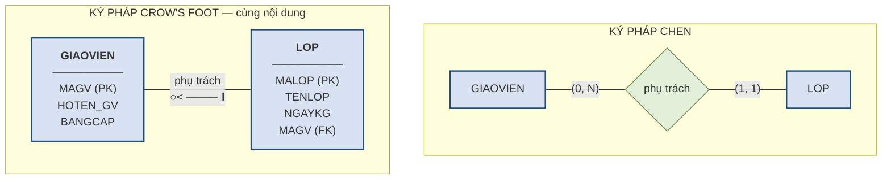

**Cách đọc một đường liên kết — chỗ hay đọc ngược.** Quy tắc là: **ký hiệu ở đầu nào mô tả số lượng thực thể ở đầu đó**. Trong Hình 2.13, đầu phía `LOP` mang chân quạ, nghĩa là *"một giáo viên phụ trách nhiều lớp"*; đầu phía `GIAOVIEN` mang hai gạch, nghĩa là *"một lớp do đúng một giáo viên phụ trách"*. Vòng tròn ở phía `LOP` cho biết giáo viên **có thể chưa** phụ trách lớp nào.

Người mới học rất hay đọc ngược — nhìn chân quạ ở phía `LOP` rồi kết luận "một lớp có nhiều giáo viên". Mẹo tránh nhầm: **đặt ngón tay che một đầu, đọc đầu còn lại, rồi mới đổi bên.**

**Ba hạn chế cần biết.** Thứ nhất, Crow's Foot **không có chỗ vẽ thuộc tính của liên kết** — muốn diễn tả `HOCPHI` của lượt ghi danh thì buộc phải tạo hẳn một ô chữ nhật `GHIDANH`, tức là đã làm luôn việc tách ở Bước 4. Thứ hai, nó **không phân biệt được thuộc tính đa trị hay dẫn xuất**, vì mỗi thuộc tính chỉ là một dòng chữ. Thứ ba, ký hiệu **thực thể yếu** không thống nhất giữa các công cụ.

> **Chú ý.** Chính ba hạn chế trên là lý do giáo trình chọn **Chen làm ký pháp chính khi học và khi giải bài**: nó ép người thiết kế phải nhận diện và ghi lại đầy đủ mọi đặc điểm. Crow's Foot được dùng ở bước **trình bày kết quả cuối cùng**, khi các quyết định đã chốt và điều cần nhất là sự gọn gàng.

### 2.8.4. Sơ lược về sơ đồ lớp UML

**UML** *(Unified Modeling Language)* là ngôn ngữ mô hình hóa dùng rộng rãi trong công nghệ phần mềm. Sơ đồ lớp *(class diagram)* của UML có nhiều điểm tương đồng với lược đồ ER, nên người học cần biết cách đối chiếu.

**Bảng 2.11. Đối chiếu mô hình ER và sơ đồ lớp UML**

| Mô hình ER | Sơ đồ lớp UML | Ghi chú |
|---|---|---|
| Thực thể *(entity)* | Lớp *(class)* | Tương đương |
| Thuộc tính *(attribute)* | Thuộc tính *(attribute)* | Tương đương |
| Liên kết *(relationship)* | Liên kết *(association)* | Tương đương |
| Lực lượng `(min, max)` | Bội số *(multiplicity)* `min..max` | UML viết `0..*` thay cho `(0, N)` |
| Thực thể cha – con *(EER)* | Tổng quát hóa *(generalization)* | Tương đương |
| Thực thể kết hợp | Lớp liên kết *(association class)* | Tương đương |
| *(không có)* | **Phương thức** *(method)* | UML mô tả cả **hành vi**; ER chỉ mô tả **dữ liệu** |

Khác biệt căn bản nằm ở dòng cuối cùng. UML mô tả cả dữ liệu lẫn **hành vi** của đối tượng, vì nó phục vụ thiết kế phần mềm nói chung. Mô hình ER chỉ mô tả **dữ liệu**, vì nó phục vụ thiết kế cơ sở dữ liệu. Do đó một sơ đồ lớp UML có thể chuyển thành lược đồ ER bằng cách bỏ đi phần phương thức, nhưng chiều ngược lại thì thiếu thông tin.

---

## 2.9. Ví dụ tổng hợp: Trung tâm Anh ngữ ABC

Mục này vận dụng trọn vẹn quy trình năm bước cho bài toán đã theo suốt học phần.

### 2.9.1. Đề bài — bảy quy tắc nghiệp vụ

1. Trung tâm có nhiều **giáo viên**; mỗi giáo viên có mã, họ tên, bằng cấp.
2. Trung tâm mở nhiều **lớp**; mỗi lớp có mã lớp, tên lớp, ngày khai giảng.
3. Mỗi **lớp** do **đúng một** giáo viên phụ trách. Một **giáo viên** có thể phụ trách **nhiều** lớp, hoặc **chưa** lớp nào *(giáo viên mới)*.
4. Mỗi **học viên** có mã, họ tên, ngày sinh và **nhiều số điện thoại**.
5. Một **học viên** ghi danh **nhiều** lớp; một **lớp** có **nhiều** học viên. Mỗi lượt ghi danh ghi nhận **ngày ghi danh** và **học phí**.
6. Mỗi lớp thuộc **một khóa học** *(ví dụ Anh cơ bản 1)*; một khóa học mở **nhiều** lớp.
7. Một **khóa học** có thể là **tiên quyết** của nhiều khóa học khác.

Trước khi bắt tay vào Bước 1, nên đọc lướt toàn đề để **đánh dấu các bẫy thiết kế**, dựa vào bảng phiên dịch ở mục 2.1.5 *(Bảng 2.1)*.

**Bảng 2.12. Nhận diện bẫy thiết kế ngay khi đọc đề**

| Quy tắc | Từ khóa đáng chú ý | Dấu hiệu | Xử lý ở bước |
|:--:|---|---|:--:|
| 3 | *"có thể"*, *"chưa lớp nào"* | Tham gia **tùy chọn** `min = 0` | Bước 3 |
| 4 | *"nhiều số điện thoại"* | Thuộc tính **đa trị** → phải tách | Bước 4 |
| 5 | *"nhiều…nhiều"* kèm *"học phí"* | **M:N có thuộc tính riêng** → thực thể kết hợp | Bước 4 |
| 7 | *"tiên quyết"* của chính khóa học | Liên kết **đệ quy M:N** | Bước 4 |

### 2.9.2. Bước 1 và 2 — thực thể, thuộc tính, thuộc tính khóa

Gạch chân các danh từ chỉ sự vật cần lưu thông tin, thu được **bốn thực thể** ban đầu: `GIAOVIEN`, `LOP`, `HOCVIEN`, `KHOAHOC`. Liệt kê thuộc tính và chọn thuộc tính khóa *(in đậm)*:

- `GIAOVIEN(`**`MAGV`**`, HOTEN_GV, BANGCAP)`
- `LOP(`**`MALOP`**`, TENLOP, NGAYKG)`
- `HOCVIEN(`**`MAHV`**`, HOTEN, NGAYSINH)`
- `KHOAHOC(`**`MAKH`**`, TENKH)`

Vẽ theo ký pháp Chen, bốn thực thể này cùng thuộc tính của chúng có dạng như sau. Ở bước này **chưa có liên kết nào** — các thực thể còn đứng rời nhau.

**Hình 2.14. Bước 1–2 — bốn thực thể với thuộc tính, ký pháp Chen**

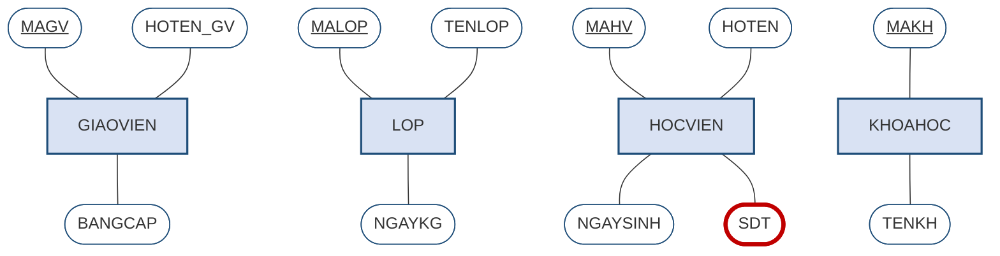

> **Chú ý.** Thuộc tính `SDT` của học viên là **đa trị**, nên trong Hình 2.14 nó được vẽ bằng **oval viền kép** và tô đỏ để đánh dấu. Nó **chưa** được xử lý ở bước này; việc tách sẽ làm ở Bước 4. Đây là minh họa cho lời khuyên ở mục 2.8.1: làm đúng thứ tự, đừng nhảy cóc. Ghi nhận vấn đề ngay khi phát hiện, nhưng xử lý đúng lượt của nó.

### 2.9.3. Bước 3 — xác định liên kết

Áp dụng kỹ thuật hỏi hai chiều cho từng cặp thực thể; kết quả đã được lập thành **Bảng 2.7** ở mục 2.4.3. Bổ sung thêm tính tham gia:

- `GIAOVIEN` – `LOP`: **1:M**. Phía lớp **bắt buộc** *(mọi lớp đều phải có giáo viên)*; phía giáo viên **tùy chọn** *(giáo viên mới chưa có lớp)*.
- `KHOAHOC` – `LOP`: **1:M**. Phía lớp **bắt buộc**; phía khóa học **tùy chọn** *(khóa học có thể chưa mở lớp nào)*.
- `HOCVIEN` – `LOP`: **M:N**, có thuộc tính riêng.
- `KHOAHOC` – `KHOAHOC`: **M:N đệ quy**.

Nối các hình thoi liên kết vào lược đồ Chen, ta được bức tranh sau. Để hình dễ đọc, từ đây trở đi chỉ hiện **thuộc tính khóa**; danh sách thuộc tính đầy đủ đã có ở Hình 2.14.

**Hình 2.15. Bước 3 — thêm liên kết và lực lượng, ký pháp Chen**

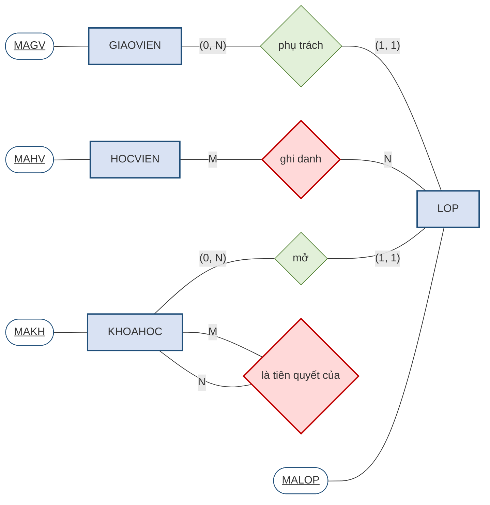

Hai hình thoi tô đỏ là hai liên kết **M:N** — chúng chính là danh sách việc phải làm ở Bước 4. Lược đồ hiện tại **chưa dùng được**: mô hình quan hệ ở Chương 3 không biểu diễn được liên kết M:N, và thuộc tính `HOCPHI` của quy tắc 5 vẫn chưa có chỗ đặt.

### 2.9.4. Bước 4 — xử lý ba ca đặc biệt

**Ca thứ nhất — thuộc tính đa trị `SDT`.** Theo mục 2.2.4, tách thành thực thể yếu `DIENTHOAI(`**`MAHV`**`,` **`SODT`**`)`, liên kết 1:M với `HOCVIEN`. Thuộc tính khóa là cặp phức hợp vì hai học viên trong cùng gia đình có thể khai chung một số máy bàn.

**Ca thứ hai — liên kết M:N giữa `HOCVIEN` và `LOP`.** Theo mục 2.6.4, tách thành thực thể kết hợp `GHIDANH(`**`MAHV`**`,` **`MALOP`**`, NGAYGHIDANH, HOCPHI)`. Liên kết M:N ban đầu được thay bằng hai liên kết 1:M.

**Ca thứ ba — liên kết đệ quy M:N của `KHOAHOC`.** Theo mục 2.6.2, tách thành `TIENQUYET(`**`MAKH_truoc`**`,` **`MAKH_sau`**`)`. Chú ý hai cột đều tham chiếu về `KHOAHOC` nhưng phải mang **tên khác nhau** để phân biệt vai trò.

Sau Bước 4, số thực thể tăng từ bốn lên **bảy**.

### 2.9.5. Bước 5 — lược đồ ER hoàn chỉnh

Lược đồ cuối cùng được trình bày bằng **cả hai ký pháp**, vì mỗi ký pháp cho thấy một mặt khác nhau của cùng một thiết kế.

**Hình 2.16. Lược đồ ER hoàn chỉnh của Trung tâm Anh ngữ ABC — ký pháp Chen**

*(chỉ hiện thuộc tính khóa; danh sách thuộc tính đầy đủ xem Hình 2.17)*

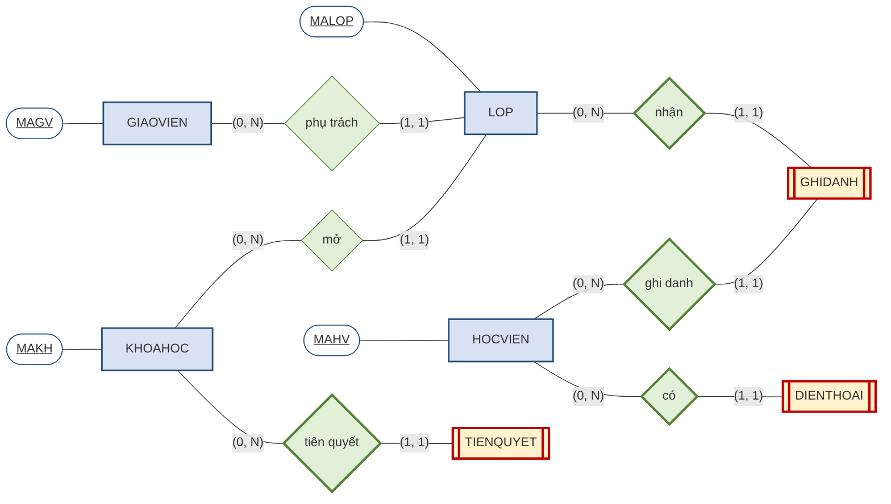

So sánh Hình 2.16 với Hình 2.15 cho thấy rõ tác dụng của Bước 4. **Hai hình thoi đỏ M:N đã biến mất**, thay vào đó là ba **thực thể yếu hoặc kết hợp** *(vẽ chữ nhật hai viền)* nối qua các **liên kết định danh** *(hình thoi hai viền)*. Mọi liên kết còn lại đều là **1:M** — dạng duy nhất mà mô hình quan hệ ở Chương 3 biểu diễn được trực tiếp.

Cùng lược đồ ấy trình bày theo Crow's Foot thì gọn hơn nhiều và **hiện được đầy đủ thuộc tính**:

**Hình 2.17. Lược đồ ER của Trung tâm Anh ngữ ABC — ký pháp Crow's Foot**

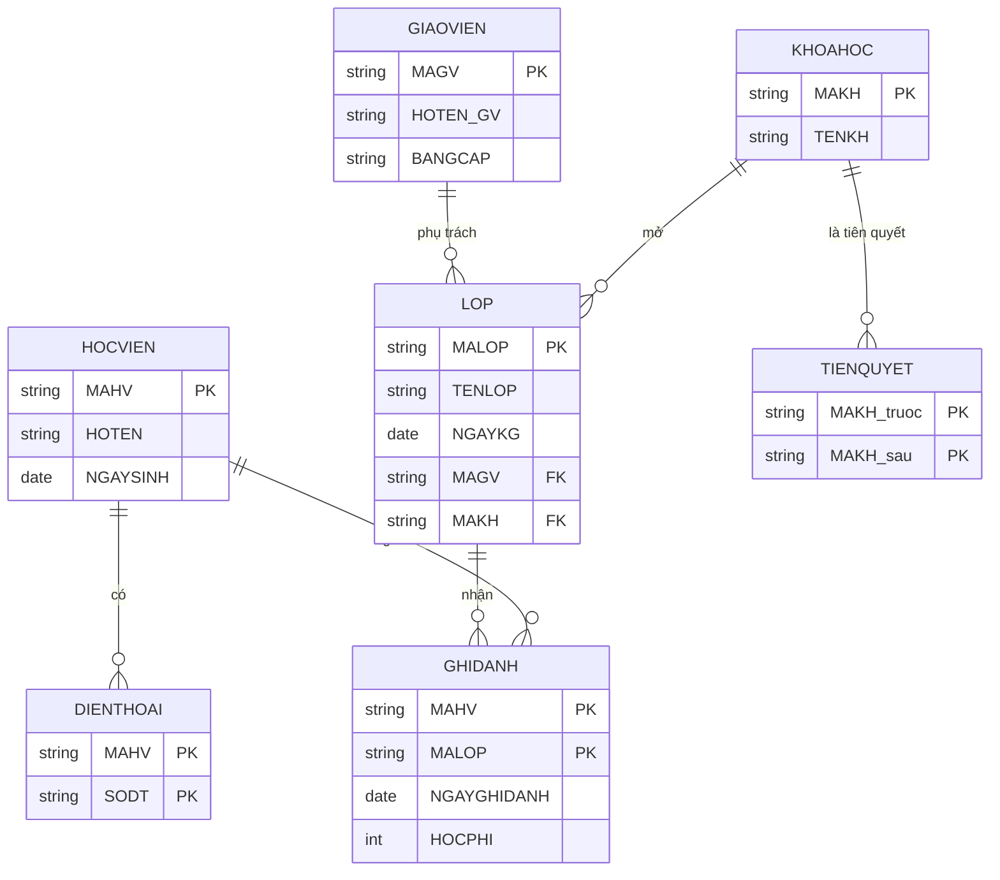

**Bảng 2.13. Bảy thực thể của lược đồ cuối cùng**

| # | Thực thể | Loại | Nguồn gốc |
|:--:|---|---|---|
| 1 | `GIAOVIEN` | Mạnh | Quy tắc 1 |
| 2 | `LOP` | Mạnh | Quy tắc 2 |
| 3 | `HOCVIEN` | Mạnh | Quy tắc 4 |
| 4 | `KHOAHOC` | Mạnh | Quy tắc 6 |
| 5 | `DIENTHOAI` | **Yếu** | Tách thuộc tính đa trị *(quy tắc 4)* |
| 6 | `GHIDANH` | **Kết hợp** | Tách liên kết M:N *(quy tắc 5)* |
| 7 | `TIENQUYET` | **Kết hợp** | Tách liên kết M:N đệ quy *(quy tắc 7)* |

Bước kiểm tra cuối cùng là **đối chiếu ngược từng quy tắc nghiệp vụ với lược đồ**. Cả bảy quy tắc đều tìm được chỗ của mình: quy tắc 1, 2, 4, 6 thành thực thể và thuộc tính; quy tắc 3 và 6 thành liên kết 1:M; quy tắc 5 thành `GHIDANH`; quy tắc 7 thành `TIENQUYET`. Lược đồ đầy đủ.

### 2.9.6. Nhìn lại Chương 1 — bốn thực thể mà trực giác không thấy

Chương 1 giải cùng bài toán này bằng trực giác và thu được **ba bảng**: `GIAOVIEN`, `LOP`, `HOCVIEN`. Chương 2 giải bằng phương pháp và thu được **bảy thực thể**. Bốn thực thể chênh lệch là `KHOAHOC`, `DIENTHOAI`, `GHIDANH`, `TIENQUYET`.

Điều đáng suy nghĩ là **vì sao trực giác không nhìn thấy chúng**. Câu trả lời nằm ở chỗ trực giác chỉ làm được một việc duy nhất: nhìn vào dữ liệu đã có và phát hiện chỗ lặp lại. Bốn thực thể bị bỏ sót đều **không lộ ra dưới dạng lặp lại** trong bảng phẳng ban đầu.

`KHOAHOC` không xuất hiện vì bảng phẳng ở Chương 1 chưa có cột nào về khóa học. `DIENTHOAI` không xuất hiện vì bảng ấy chỉ để chỗ cho một số điện thoại. `GHIDANH` không xuất hiện vì bảng phẳng gán mỗi học viên vào đúng một lớp, nên quan hệ nhiều–nhiều bị che khuất hoàn toàn. Và `TIENQUYET` không xuất hiện vì quan hệ tiên quyết giữa các khóa học **không nằm trong dữ liệu**, nó nằm trong **quy tắc nghiệp vụ** — thứ mà chỉ có phỏng vấn mới moi ra được.

Đây chính là bài học lớn nhất của Chương 2: **thiết kế cơ sở dữ liệu không phải là công việc dọn dẹp dữ liệu có sẵn, mà là công việc mô hình hóa nghiệp vụ.** Dữ liệu hiện có chỉ phản ánh những gì hệ thống cũ *tình cờ* ghi lại được — thường là một phần rất nhỏ của nghiệp vụ thật.

**Bảng 2.14. Cùng một cặp thực thể, hai quy tắc nghiệp vụ khác nhau cho hai lược đồ khác nhau**

| Quy tắc nghiệp vụ | Kết luận về liên kết | Lược đồ |
|---|---|---|
| *"Mỗi học viên chỉ học một lớp duy nhất"* | **1:M** | Chỉ cần đặt `MALOP` vào `HOCVIEN` — hai thực thể |
| *"Một học viên ghi danh nhiều lớp, mỗi lượt có học phí riêng"* | **M:N có thuộc tính** | Phải sinh thêm `GHIDANH` — ba thực thể |

Bảng trên khép lại chương bằng một kết luận về nghề nghiệp: **không có lược đồ đúng tuyệt đối, chỉ có lược đồ đúng với một tập quy tắc nghiệp vụ xác định.** Người thiết kế giỏi không phải là người vẽ nhanh, mà là người **hỏi đúng câu hỏi** trước khi vẽ.

---

## TÓM TẮT CHƯƠNG

**Thiết kế cơ sở dữ liệu đi qua ba mức** quan niệm, logic, vật lý; Chương 2 làm việc ở mức quan niệm. Nguyên liệu đầu vào là **quy tắc nghiệp vụ** — phải rõ ràng và **đếm được**, nêu cả hai chiều của mỗi mối liên hệ.

**Thực thể là loại sự vật, thể hiện thực thể là cá thể cụ thể** — cặp khái niệm song song với lược đồ và thể hiện ở Chương 1. Thuộc tính phân loại theo bốn cặp tiêu chí; trong đó **thuộc tính đa trị bắt buộc phải tách** thành thực thể riêng, và **thuộc tính dẫn xuất thường không nên lưu**.

**Thuộc tính khóa phải thỏa mãn đồng thời tính duy nhất và tính tối thiểu.** Nên ưu tiên **khóa thay thế** làm khóa chính vì tính ổn định, đồng thời vẫn khai báo khóa tự nhiên như một ràng buộc duy nhất.

**Kỹ thuật hỏi hai chiều** loại bỏ gần hết khả năng nhầm loại liên kết: luôn hỏi cả *"một A liên quan bao nhiêu B"* lẫn chiều ngược lại. **Tính tham gia có thể khác nhau ở hai chiều** của cùng một liên kết.

**Ba trường hợp đặc biệt phải xử lý ở Bước 4:** thuộc tính đa trị, liên kết M:N *(tách thành thực thể kết hợp)*, và liên kết đệ quy. **Thực thể yếu** phải thỏa mãn đồng thời phụ thuộc tồn tại và khóa không đầy đủ.

**Mô hình EER** bổ sung quan hệ **cha–con** để xử lý tình huống nhiều loại sự vật vừa giống vừa khác nhau. Thực thể con **kế thừa** mọi thuộc tính và liên kết của cha, và dùng chung thuộc tính khóa với cha. Mỗi phân cấp phải xác định **hai ràng buộc**: rời nhau hay chồng lấn, đầy đủ hay không đầy đủ. Phép thử để nhận biết quan hệ cha–con là câu **"LÀ MỘT"**.

**Quy trình năm bước** — thực thể, thuộc tính và khóa, liên kết, ca đặc biệt, vẽ và kiểm tra — là một quá trình **lặp**, không phải một chiều.

**Ví dụ Trung tâm ABC** cho ra **bảy thực thể**, so với ba bảng mà trực giác ở Chương 1 tìm được. Bốn thực thể chênh lệch cho thấy thiết kế cơ sở dữ liệu là **mô hình hóa nghiệp vụ**, không phải dọn dẹp dữ liệu có sẵn.

**Nối sang Chương 3.** Lược đồ ER vừa xây dựng là một sơ đồ dành cho **con người đọc** — nó chưa phải là thứ máy tính hiểu được. Chương 3 giới thiệu **mô hình quan hệ**, cho ta cấu trúc toán học chặt chẽ để biểu diễn dữ liệu, cùng **quy tắc ánh xạ** từ lược đồ ER sang tập các quan hệ. Khi ấy bảy thực thể trong Hình 2.17 sẽ trở thành bảy bảng cụ thể, có khóa chính và khóa ngoại rõ ràng.

---

## CÂU HỎI ÔN TẬP

1. Vì sao phải làm thiết kế quan niệm trước thiết kế logic? Điều gì xảy ra nếu nhảy thẳng vào thiết kế bảng?
2. Phát biểu *"Trung tâm chúng tôi phục vụ khách hàng tận tình"* có phải quy tắc nghiệp vụ không? Vì sao?
3. Nêu ba tiêu chí để một danh từ xứng đáng trở thành thực thể. Cho một ví dụ danh từ **không** nên làm thực thể.
4. Vì sao thuộc tính đa trị **bắt buộc** phải tách? Phân tích cụ thể hai cách xử lý sai.
5. Nêu hai tiêu chí bắt buộc của thuộc tính khóa. Cặp `(MAHV, HOTEN)` vi phạm tiêu chí nào?
6. So sánh khóa tự nhiên và khóa thay thế. Vì sao khuyến nghị chung là ưu tiên khóa thay thế làm khóa chính?
7. Trình bày kỹ thuật hỏi hai chiều. Vì sao chỉ hỏi một chiều là không đủ?
8. Cho ví dụ một liên kết mà **tính tham gia khác nhau ở hai chiều**, và giải thích hệ quả ở bước thiết kế bảng.
9. Nêu hai điều kiện của thực thể yếu. Vì sao `LOP` không phải thực thể yếu dù mỗi lớp đều thuộc một khóa học?
10. Vì sao liên kết M:N phải tách, kể cả khi nó **không có** thuộc tính riêng nào?
11. Trình bày quan hệ cha–con trong EER. Phép thử nào giúp phân biệt nó với liên kết thông thường?
12. Phân biệt chuyên biệt hóa và tổng quát hóa. Hai quá trình này khác nhau ở điểm nào?
13. Nêu bốn tổ hợp ràng buộc của phân cấp cha–con. Cho một ví dụ cho tổ hợp *chồng lấn + không đầy đủ*.
14. Khi nào **không nên** dùng EER? Nêu ba trường hợp.
15. Vì sao lược đồ ER của Chương 2 có bảy thực thể trong khi Chương 1 chỉ tìm được ba bảng?

**Gợi ý trả lời một số câu**

*Câu 5.* Cặp `(MAHV, HOTEN)` thỏa mãn **tính duy nhất** nhưng vi phạm **tính tối thiểu**, vì bỏ `HOTEN` đi thì `MAHV` vẫn đủ phân biệt. Hậu quả: mọi bảng tham chiếu tới học viên phải mang theo cả hai cột, và khi học viên đổi tên thì phải sửa dây chuyền.

*Câu 9.* Thực thể yếu phải thỏa mãn **đồng thời** phụ thuộc tồn tại **và** khóa không đầy đủ. `LOP` thỏa mãn điều kiện thứ nhất — lớp phải thuộc một khóa học — nhưng **không** thỏa mãn điều kiện thứ hai, vì `MALOP` tự nó đã đủ phân biệt mọi lớp mà không cần mượn `MAKH`. Đây chỉ là phụ thuộc tồn tại thông thường.

*Câu 10.* Vì **mô hình quan hệ không có cách nào biểu diễn trực tiếp liên kết nhiều–nhiều**. Trong mô hình quan hệ, liên kết được thể hiện bằng khóa ngoại đặt ở một phía; với M:N thì đặt ở phía nào cũng sai, vì cả hai phía đều cần lưu nhiều giá trị. Chương 3 sẽ chứng minh điều này.

*Câu 11.* Quan hệ cha–con nối một thực thể tổng quát với các nhóm con có thuộc tính riêng; thực thể con kế thừa mọi thuộc tính và liên kết của cha, đồng thời dùng chung thuộc tính khóa. Phép thử là câu **"LÀ MỘT"**: nếu nói *"giáo viên **là một** nhân sự"* nghe xuôi thì là cha–con; còn nếu phải nói *"lớp **có** học viên"* thì đó là liên kết thông thường.

---

## BÀI TẬP CHƯƠNG

### Mức A — Nhận biết và tái hiện

**Bài A1.** Với mỗi phát biểu sau, cho biết nó tương ứng với thành phần nào của lược đồ ER *(thực thể, thuộc tính, liên kết, kết nối, tham gia, thuộc tính đa trị)*: (a) *"mỗi cuốn sách có một tên và một năm xuất bản"*; (b) *"độc giả mượn sách"*; (c) *"một độc giả có thể mượn nhiều cuốn cùng lúc"*; (d) *"độc giả có thể chưa mượn cuốn nào"*; (e) *"mỗi tác giả có thể có nhiều bút danh"*.

**Bài A2.** Phân loại các thuộc tính sau theo **cả bốn cặp tiêu chí** ở Bảng 2.3: `HOTEN`, `DIACHI`, `NGAYSINH`, `TUOI`, `SODIENTHOAI` *(một người có nhiều số)*, `EMAIL` *(có thể không có)*.

**Bài A3.** Vẽ lại Hình 2.12 *(quy trình năm bước)* từ trí nhớ, và với mỗi bước nêu **một sai lầm thường gặp**.

### Mức B — Vận dụng

**Bài B1.** Một **thư viện** hoạt động theo các quy tắc sau:

1. Mỗi **đầu sách** có mã, tên sách, năm xuất bản, và **nhiều tác giả**.
2. Thư viện có **nhiều bản sao** của mỗi đầu sách; mỗi bản sao có số hiệu riêng và tình trạng.
3. Mỗi **độc giả** có mã thẻ, họ tên, ngày sinh.
4. Một độc giả **mượn nhiều** bản sao; một bản sao được **nhiều** độc giả mượn qua các lần khác nhau. Mỗi lượt mượn ghi nhận **ngày mượn** và **ngày hẹn trả**.
5. Mỗi đầu sách thuộc **một thể loại**; một thể loại có **nhiều** đầu sách.

Yêu cầu: (a) lập **bảng hỏi hai chiều** cho mọi cặp thực thể; (b) chỉ ra các **ca đặc biệt** phải xử lý ở Bước 4; (c) vẽ **lược đồ ER hoàn chỉnh**; (d) **đối chiếu ngược** từng quy tắc với lược đồ.

**Bài B2.** Với lược đồ vừa vẽ ở Bài B1, xác định **tính tham gia** cho từng chiều của mỗi liên kết, kèm lý do nghiệp vụ.

**Bài B3.** Một bệnh viện quản lý **nhân viên y tế** gồm **bác sĩ** *(có chuyên khoa, số chứng chỉ hành nghề)* và **điều dưỡng** *(có khoa công tác, ca trực)*. Cả hai đều có mã, họ tên, ngày sinh, ngày vào làm.
a) Vẽ phân cấp cha–con theo EER.
b) Xác định **hai ràng buộc** *(rời nhau/chồng lấn, đầy đủ/không đầy đủ)* và nêu quy tắc nghiệp vụ tương ứng cho lựa chọn của bạn.
c) Nếu bệnh viện còn có nhân viên hành chính chưa được mô hình hóa, ràng buộc thứ hai thay đổi thế nào?

### Mức C — Nâng cao

**Bài C1.** Cho quy tắc: *"Mỗi nhân viên có đúng một người quản lý trực tiếp, trừ giám đốc là người không có quản lý. Một người quản lý phụ trách nhiều nhân viên."*
a) Đây là liên kết loại gì, bậc mấy?
b) Xác định tính tham gia cho từng chiều.
c) Vì sao tình huống *"giám đốc không có quản lý"* lại là một thông tin thiết kế quan trọng chứ không phải chi tiết vụn vặt?

**Bài C2.** Có ý kiến: *"Cứ dùng khóa thay thế cho mọi thực thể là an toàn nhất, khỏi phải suy nghĩ."* Hãy phản biện, dựa vào phần Chú ý ở mục 2.3.2, kèm một tình huống cụ thể cho thấy hậu quả.

**Bài C3.** So sánh hai phương án thiết kế cho tình huống ở mục 2.7.1 — *tạo hai thực thể riêng* và *gộp thành một thực thể* — với phương án EER. Với mỗi phương án, nêu **một tình huống thay đổi nghiệp vụ** và cho biết phương án nào chịu đựng tốt nhất.

**Bài C4** *(tự chọn).* Tìm hiểu thêm về **bẫy thiết kế** *(design traps)* trong [3, Ch.4], đặc biệt là *fan trap*. Mô tả bằng lời của mình một tình huống fan trap và cách khắc phục.

---

## TÀI LIỆU THAM KHẢO CỦA CHƯƠNG

**[1]** Tô Văn Nam (2005). *Giáo trình cơ sở dữ liệu*. NXB Giáo dục — chương về mô hình thực thể – liên kết.

**[2]** Vũ Đức Thi (1997). *Cơ sở dữ liệu — kiến thức và thực hành*. NXB Thống kê.

**[3]** Coronel, C. & Morris, S. *Database Systems: Design, Implementation & Management*. Cengage Learning — **Chapter 4** (*Entity Relationship Modeling*): quy tắc nghiệp vụ (tr. 148–150), các thành phần của mô hình ER, kết nối và lực lượng, thực thể yếu, thực thể kết hợp, quy trình thiết kế và các bẫy thiết kế; **Chapter 5** (*Advanced Data Modeling*): mô hình EER, thực thể cha–con, chuyên biệt hóa và tổng quát hóa, các ràng buộc rời nhau/chồng lấn và đầy đủ/không đầy đủ, khóa tự nhiên và khóa thay thế.

**Hướng dẫn tự học.** Nên đọc Chapter 4 của [3] song song với các mục 2.1–2.6 của giáo trình này. Chapter 5 chỉ nên đọc **sau khi** đã nắm chắc mục 2.7, vì nó dùng ngay các khái niệm cha–con và ràng buộc phân cấp. Bài tập B1 *(thư viện)* nên làm trước khi đọc Chương 3, vì lược đồ thu được sẽ tiếp tục dùng làm bài tập ánh xạ ở chương sau.

---

## PHỤ LỤC 2A. GỢI Ý TỔ CHỨC DẠY HỌC

*Phần này dành cho giảng viên, không thuộc nội dung bắt buộc của người học.*

### 2A.1. Hoạt động nhóm — *"Phòng thiết kế"*

*(nhóm 4–5 người, 30 phút — thu thập minh chứng CLO1 và CLO3)*

Phát cho mỗi nhóm một đề bài ngắn khác nhau *(quán cà phê, phòng khám, cửa hàng cho thuê xe)* gồm 5–7 quy tắc nghiệp vụ, trong đó **cài sẵn ít nhất một thuộc tính đa trị và một liên kết M:N có thuộc tính**.

Yêu cầu mỗi nhóm thực hiện trọn quy trình năm bước và vẽ lược đồ lên giấy A3. Sau đó tổ chức **tham quan chéo**: các nhóm dán bài lên tường, đi xem bài của nhau và ghi nhận xét lên giấy nhớ dán bên cạnh. Cuối cùng mỗi nhóm đọc nhận xét nhận được và trình bày một điều họ sẽ sửa.

Hoạt động này rèn đúng kỹ năng mà Rubric 3 sẽ chấm: phát biểu quy tắc nghiệp vụ "đếm được" và bảo vệ quyết định thiết kế.

### 2A.2. Hoạt động cá nhân — kỹ thuật hỏi hai chiều

*(15 phút)*

Chiếu lên bảng năm cặp thực thể quen thuộc *(sinh viên – lớp học phần, tác giả – sách, khách hàng – đơn hàng, bác sĩ – bệnh nhân, xã – huyện)*. Mỗi người học tự đặt hai câu hỏi cho từng cặp và ghi kết luận vào bảng ba cột.

Sau đó gọi ngẫu nhiên vài người học đọc kết quả. Điểm cần dẫn dắt là **các cặp gây tranh cãi** — chẳng hạn *bác sĩ – bệnh nhân* có thể là 1:M hay M:N tùy quy định của bệnh viện. Đó chính là lúc chứng minh cho cả lớp thấy: không có đáp án đúng nếu chưa có quy tắc nghiệp vụ.

### 2A.3. Thảo luận cả lớp — *"Ba hay bảy?"*

*(15 phút)*

Chiếu song song kết quả Chương 1 *(ba bảng)* và kết quả Chương 2 *(bảy thực thể)*, rồi đặt câu hỏi: *"Chương 1 sai à?"*

Dẫn dắt để cả lớp tự đi tới kết luận ở mục 2.9.6: Chương 1 không sai, nhưng trực giác chỉ nhìn được vào **dữ liệu đã có**, trong khi bốn thực thể còn lại nằm trong **quy tắc nghiệp vụ** — thứ chỉ phỏng vấn mới moi ra được.

Câu hỏi chốt: *"Nếu khách hàng đưa cho ta một tệp Excel và bảo 'anh cứ thiết kế theo cái này', ta nên trả lời thế nào?"*

### 2A.4. Ứng dụng thực tế

Với mỗi hệ thống quen thuộc dưới đây, đặt câu hỏi *"lược đồ ER của nó có những thực thể gì, và chỗ nào chắc chắn có liên kết M:N?"*: hệ thống đăng ký học phần của trường; ứng dụng đặt xe; sàn thương mại điện tử; mạng xã hội *(quan hệ bạn bè là đệ quy M:N)*; hệ thống quản lý bệnh viện.

Trường hợp **mạng xã hội** đặc biệt đáng dùng vì quan hệ bạn bè vừa là **đệ quy** vừa là **M:N**, và còn có thuộc tính riêng *(ngày kết bạn, trạng thái chờ xác nhận)* — minh họa đủ cả ba ca đặc biệt trong một ví dụ.

### 2A.5. Phiếu phản hồi một phút

*(cuối buổi, ẩn danh)*

1. Trong buổi học hôm nay, khái niệm nào bạn thấy **khó hiểu nhất**?
2. Nêu **một câu** tóm tắt điều bạn nhớ nhất.

Kinh nghiệm cho thấy hai khái niệm hay được nêu nhất ở chương này là **thực thể yếu** *(vì phải thỏa mãn đồng thời hai điều kiện)* và **ràng buộc rời nhau/chồng lấn của EER**. Nếu nhiều phiếu cùng nêu, nên dành 5 phút đầu buổi sau giảng lại bằng ví dụ khác với ví dụ đã dùng.

---

## DANH MỤC HÌNH (Chương 2)

| Hình | Tên hình | Mục |
|---|---|---|
| Hình 2.1 | Một lược đồ ER nhỏ — ba thành phần cơ bản | 2.1.4 |
| Hình 2.2 | Bộ ký hiệu Chen — tổng quan | 2.2.2 |
| Hình 2.3 | Thuộc tính của thực thể `HOCVIEN` — ký pháp Chen và ký pháp Crow's Foot | 2.2.3 |
| Hình 2.4 | Ba cách xử lý thuộc tính đa trị — chỉ một cách đúng | 2.2.4 |
| Hình 2.5 | Kỹ thuật hỏi hai chiều — quy trình xác định loại liên kết | 2.4.2 |
| Hình 2.6 | Ký pháp Chen — ba loại kết nối, minh họa tại Trung tâm ABC | 2.5.1 |
| Hình 2.7 | Bốn ký hiệu đầu mút của ký pháp Crow's Foot | 2.5.3 |
| Hình 2.8 | Ba ví dụ liên kết đệ quy, vẽ theo ký pháp Chen | 2.6.2 |
| Hình 2.9 | Thực thể yếu trong ký pháp Chen — trường hợp `DIENTHOAI` | 2.6.3 |
| Hình 2.10 | Liên kết M:N ẩn chứa một thực thể | 2.6.4 |
| Hình 2.11 | Phân cấp chuyên biệt hóa tại Trung tâm ABC | 2.7.2 |
| Hình 2.12 | Quy trình năm bước xây dựng lược đồ ER | 2.8.1 |
| Hình 2.13 | Cùng một liên kết vẽ bằng hai ký pháp | 2.8.3 |
| Hình 2.14 | Bước 1–2 — bốn thực thể với thuộc tính, ký pháp Chen | 2.9.2 |
| Hình 2.15 | Bước 3 — thêm liên kết và lực lượng, ký pháp Chen | 2.9.3 |
| Hình 2.16 | Lược đồ ER hoàn chỉnh của Trung tâm Anh ngữ ABC — ký pháp Chen | 2.9.5 |
| Hình 2.17 | Lược đồ ER của Trung tâm Anh ngữ ABC — ký pháp Crow's Foot | 2.9.5 |

## DANH MỤC BẢNG (Chương 2)

| Bảng | Tên bảng | Mục |
|---|---|---|
| Bảng 2.1 | Phiên dịch quy tắc nghiệp vụ sang thành phần ER | 2.1.5 |
| Bảng 2.2 | Bộ ký hiệu của ký pháp Chen | 2.2.2 |
| Bảng 2.3 | Bốn cặp phân loại thuộc tính | 2.2.3 |
| Bảng 2.4 | Kiểm chứng cách 3 bằng bốn câu hỏi khó | 2.2.4 |
| Bảng 2.5 | Hai tiêu chí bắt buộc của một thuộc tính khóa | 2.3.1 |
| Bảng 2.6 | So sánh khóa tự nhiên và khóa thay thế | 2.3.2 |
| Bảng 2.7 | Bảng hỏi hai chiều cho Trung tâm ABC | 2.4.3 |
| Bảng 2.8 | Ký hiệu đầu mút Crow's Foot — gộp kết nối và tham gia | 2.5.3 |
| Bảng 2.9 | Cùng một sự vật, hai cách đặt thuộc tính khóa cho hai kết luận khác nhau | 2.6.3 |
| Bảng 2.10 | Bốn tổ hợp ràng buộc và ví dụ tại Trung tâm ABC | 2.7.5 |
| Bảng 2.11 | Đối chiếu mô hình ER và sơ đồ lớp UML | 2.8.4 |
| Bảng 2.12 | Nhận diện bẫy thiết kế ngay khi đọc đề | 2.9.1 |
| Bảng 2.13 | Bảy thực thể của lược đồ cuối cùng | 2.9.5 |
| Bảng 2.14 | Cùng một cặp thực thể, hai quy tắc nghiệp vụ khác nhau cho hai lược đồ khác nhau | 2.9.6 |

## DANH MỤC TỪ VIẾT TẮT

| Viết tắt | Tiếng Anh | Tiếng Việt |
|---|---|---|
| **1:1** | one-to-one | Liên kết một–một |
| **1:M** | one-to-many | Liên kết một–nhiều |
| **M:N** | many-to-many | Liên kết nhiều–nhiều |
| **CSDL** | — | Cơ sở dữ liệu |
| **EER** | Extended Entity–Relationship | Mô hình thực thể – liên kết mở rộng |
| **ER** | Entity–Relationship | Mô hình thực thể – liên kết |
| **ERD** | Entity–Relationship Diagram | Sơ đồ thực thể – liên kết |
| **FK** | Foreign Key | Khóa ngoại |
| **PK** | Primary Key | Khóa chính |
| **UML** | Unified Modeling Language | Ngôn ngữ mô hình hóa thống nhất |
