# CHƯƠNG 3. MÔ HÌNH DỮ LIỆU QUAN HỆ VÀ CÁC PHÉP TOÁN

> **Ghi chú biên soạn (v4 — bản giáo trình).** Bản này viết lại Chương 3 theo **văn phong giáo trình**, thống nhất với Chương 1 và Chương 2. Hệ thống mục **3.1–3.7 khớp tuyệt đối với Mục 8 của đề cương chi tiết** *(8 tiết · CLO2, CLO3)*. So với bản trước, chương này **bổ sung bốn nội dung**: ① **ánh xạ thực thể yếu** *(đề cương mục 3.4)*; ② **ánh xạ phân cấp cha/con của EER** — vá lỗ hổng do việc bổ sung mục 2.7 ở Chương 2 tạo ra; ③ **kỹ thuật dùng kết ngoài để dò lỗi toàn vẹn tham chiếu** *(đề cương mục 3.7, theo [3, Ch.3])*; ④ **điều kiện khả hợp** trình bày tách bạch, làm rõ vì sao tích Descartes không đòi hỏi điều kiện này. Ví dụ ánh xạ đi thẳng từ **lược đồ Chen của Chương 2**. Số hình: **11**. Hoạt động tổ chức lớp học ở **Phụ lục 3A**. Tài liệu tham khảo: [1] Tô Văn Nam (2005); [3] Coronel & Morris, *Database Systems*, Ch.3.

---

## MỤC TIÊU CHƯƠNG

Sau khi học xong chương này, người học có thể:

1. **Trình bày** khái niệm quan hệ, bộ, thuộc tính, miền giá trị và **tám đặc trưng** của một bảng quan hệ; **phân biệt** chính xác *quan hệ (relation)* với *liên kết (relationship)* *(CLO2)*.
2. **Xác định** phụ thuộc hàm giữa các thuộc tính và **giải thích** tính có chiều của nó *(CLO2, CLO3)*.
3. **Phân biệt** năm loại khóa — siêu khóa, khóa dự tuyển, khóa chính, khóa ngoại, khóa phụ *(CLO2)*.
4. **Trình bày** hai ràng buộc toàn vẹn thực thể và tham chiếu; **giải thích** vì sao khóa chính cấm giá trị rỗng còn khóa ngoại thì được phép *(CLO2)*.
5. **Vận dụng bốn quy tắc ánh xạ** để chuyển một lược đồ ER — kể cả thực thể yếu, liên kết M:N, liên kết đệ quy và phân cấp cha/con — thành lược đồ quan hệ đầy đủ khóa chính và khóa ngoại *(CLO3)*.
6. **Thực hiện** các phép toán đại số quan hệ: chọn, chiếu, bốn phép toán tập hợp, các biến thể của phép kết và phép chia *(CLO3)*.
7. **Vận dụng phép kết ngoài** để phát hiện lỗi toàn vẹn tham chiếu trong một cơ sở dữ liệu có sẵn *(CLO3)*.
8. **Diễn đạt** một yêu cầu truy vấn bằng lời thành biểu thức đại số quan hệ *(CLO3)*.

---

## DẪN NHẬP

Cuối Chương 2, người học đã có trong tay một lược đồ ER hoàn chỉnh của Trung tâm Anh ngữ ABC với bảy thực thể. Nhưng lược đồ ấy vẫn là **một bản vẽ dành cho con người đọc**. Không hệ quản trị cơ sở dữ liệu nào trên thế giới nhận đầu vào là một hình chữ nhật nối với vài hình oval.

Chương 3 làm công việc bắc cầu: chuyển bản vẽ ấy thành một cấu trúc **chặt chẽ về mặt toán học** mà máy tính xử lý được. Cấu trúc đó là **mô hình quan hệ**, do E. F. Codd công bố năm 1970 và đã được giới thiệu sơ lược ở mục 1.4.2 của Chương 1.

Chương này có hai nửa rõ rệt, và người học nên ý thức được điều đó ngay từ đầu.

**Nửa thứ nhất — cấu trúc.** Các mục 3.1 đến 3.4 trả lời câu hỏi *"dữ liệu được tổ chức thế nào?"*. Ở đây ta học khái niệm quan hệ, hệ thống các loại khóa, hai ràng buộc toàn vẹn nền tảng, và cuối cùng là **bốn quy tắc ánh xạ** biến lược đồ ER thành tập bảng. Phần này chủ yếu là kỹ năng thao tác: một khi đã nắm quy tắc, việc ánh xạ gần như máy móc.

**Nửa thứ hai — phép toán.** Các mục 3.5 đến 3.7 trả lời câu hỏi *"lấy dữ liệu ra bằng cách nào?"*. Đây là **đại số quan hệ** — tám phép toán cho phép ta lấy ra bất kỳ thông tin nào từ các bảng đã có. Phần này trừu tượng hơn nhưng cũng chính là chỗ sức mạnh của mô hình quan hệ bộc lộ.

Có một điểm cần nói ngay để tránh hiểu nhầm về phạm vi. Học phần này **không dạy viết câu lệnh SQL**; đó là nội dung của học phần *Hệ quản trị cơ sở dữ liệu*. Nhưng đại số quan hệ chính là **nền tảng lý thuyết của SQL** — mỗi phép toán ở đây tương ứng với một thành phần của câu lệnh truy vấn. Người học nắm chắc đại số quan hệ sẽ học SQL nhanh hơn nhiều, vì lúc đó chỉ còn phải học cú pháp chứ không phải học lại tư duy.

Chương kết thúc bằng việc ánh xạ trọn vẹn lược đồ ABC thành **bảy bảng** với đầy đủ khóa, rồi dùng chính bảy bảng ấy để trả lời sáu câu hỏi nghiệp vụ bằng đại số quan hệ. Đó là lúc ba chương đầu khép lại thành một mạch hoàn chỉnh: Chương 1 thấy vấn đề, Chương 2 có phương pháp, Chương 3 có cấu trúc.

---

## 3.1. Quan hệ, bộ, thuộc tính và miền giá trị

*(1,0 tiết)*

### 3.1.1. Quan hệ — và một cạm bẫy thuật ngữ

> **Định nghĩa 3.1.** **Quan hệ** *(relation)* là một **bảng hai chiều** gồm các dòng và các cột, trong đó mỗi dòng biểu diễn một thể hiện thực thể và mỗi cột biểu diễn một thuộc tính.

Trước khi đi tiếp, cần gỡ ngay một hiểu nhầm rất phổ biến, và cũng là hiểu nhầm được Coronel cảnh báo riêng [3, tr. 60].

Nhiều người tưởng mô hình được gọi là *"mô hình **quan hệ**"* vì nó có **"quan hệ giữa các bảng"**. Điều đó **sai**. Codd là một **nhà toán học**, và trong toán học **"relation"** là một thuật ngữ đã có sẵn từ trước, **đồng nghĩa với "bảng"** — cụ thể là một tập các bộ. Ông dùng từ ấy để chỉ **chính cái bảng**, không phải mối liên hệ giữa các bảng.

| Thuật ngữ | Nghĩa | Học ở |
|---|---|---|
| **Quan hệ** *(relation)* | **Chính cái bảng** | Chương 3 |
| **Liên kết** *(relationship)* | Mối liên hệ **giữa** các thực thể hoặc bảng | Chương 2 |

Có một lập luận phản bác rất gọn cho cách hiểu sai. Mô hình **phân cấp** và mô hình **mạng** — hai mô hình ra đời trước Codd và đã trình bày ở mục 1.4.2 — **cũng có liên kết** giữa dữ liệu, thậm chí chằng chịt hơn nhiều. Vậy tại sao chúng không được gọi là "mô hình quan hệ"? Bởi vì *"quan hệ"* **không** có nghĩa là *"có liên kết"*; nó có nghĩa là **"dữ liệu được biểu diễn bằng bảng"**.

> **Chú ý.** Câu cần nhớ: ***"quan hệ" là danh từ chỉ cái bảng, không phải mối liên hệ.*** Người học nên tự kiểm tra bằng cách đọc lại tên chương: *"Mô hình dữ liệu quan hệ"* nghĩa là *"mô hình dữ liệu dạng bảng"*.

### 3.1.2. Bộ, thuộc tính, miền giá trị, bậc và lực lượng

Mô hình quan hệ có một bộ thuật ngữ toán học riêng, song song với cách gọi thông thường.

**Bảng 3.1. Ba lớp thuật ngữ song song**

| Thuật ngữ toán học | Cách gọi trong cơ sở dữ liệu | Cách gọi thông thường |
|---|---|---|
| Quan hệ *(relation)* | Bảng *(table)* | Bảng |
| Bộ *(tuple)* | Bản ghi *(record)* | Dòng |
| Thuộc tính *(attribute)* | Trường *(field)* | Cột |
| Miền giá trị *(domain)* | Kiểu dữ liệu và ràng buộc | Giá trị hợp lệ |

> **Định nghĩa 3.2.** **Miền giá trị** *(domain)* của một thuộc tính là **tập hợp mọi giá trị hợp lệ** mà thuộc tính đó được phép nhận.
>
> **Bậc** *(degree)* của một quan hệ là **số thuộc tính** của nó. **Lực lượng** *(cardinality)* của một quan hệ là **số bộ** hiện có trong nó.

> **Ví dụ 3.1.** Quan hệ `HOCVIEN(MAHV, HOTEN, NGAYSINH)` có **bậc bằng 3**. Nếu trung tâm hiện có 250 học viên thì **lực lượng bằng 250**. Miền giá trị của `NGAYSINH` là *"mọi ngày hợp lệ, trước ngày hiện tại"*; miền giá trị của `MAHV` là *"chuỗi 4 ký tự, bắt đầu bằng HV"*.

Cần lưu ý rằng **bậc là đặc trưng của lược đồ** nên gần như không đổi, còn **lực lượng là đặc trưng của thể hiện** nên thay đổi liên tục — đúng cặp khái niệm lược đồ và thể hiện đã học ở mục 1.4.4.

> **Chú ý.** Từ *"lực lượng"* ở đây **khác nghĩa** với *"lực lượng"* trong mô hình ER ở mục 2.5.1. Ở Chương 2, lực lượng là cặp `(min, max)` mô tả số thể hiện tham gia một liên kết. Ở Chương 3, lực lượng là **số dòng của một bảng**. Cùng một từ tiếng Việt dịch từ *cardinality*, nhưng dùng trong hai ngữ cảnh khác nhau.

### 3.1.3. Tám đặc trưng của một bảng quan hệ

Không phải bảng nào cũng là quan hệ. Một bảng chỉ được coi là quan hệ khi thỏa mãn tám đặc trưng sau [3, tr. 60].

**Bảng 3.2. Tám đặc trưng của một bảng quan hệ**

| # | Đặc trưng |
|:--:|---|
| 1 | Là cấu trúc **hai chiều** gồm dòng và cột |
| 2 | Mỗi **dòng (bộ)** biểu diễn **một** thể hiện thực thể |
| 3 | Mỗi **cột** là một thuộc tính, có **tên phân biệt** trong bảng |
| 4 | ⭐ Mỗi **ô chứa đúng một giá trị đơn** |
| 5 | Mọi giá trị trong cùng một cột có **cùng định dạng dữ liệu** |
| 6 | Mỗi cột có một **miền giá trị** xác định |
| 7 | ⭐ **Thứ tự dòng và thứ tự cột không quan trọng** |
| 8 | Mỗi bảng phải có thuộc tính hoặc tổ hợp thuộc tính **định danh duy nhất** mỗi dòng |

Hai đặc trưng được đánh dấu sao đáng dừng lại phân tích, vì chúng có hệ quả trực tiếp tới công việc thiết kế.

**Đặc trưng 4 — mỗi ô một giá trị đơn.** Người học đã gặp nguyên tắc này ở Chương 2 mà chưa biết tên nó. Chính vì nguyên tắc này mà cách nhồi ba số điện thoại vào một ô bị bác bỏ ở mục 2.2.4. Hôm nay ta gọi đúng tên, và ở mục 3.4.2 sẽ dùng nó thêm một lần nữa để **chứng minh** vì sao khóa ngoại bắt buộc phải đặt ở phía "nhiều". Ở Chương 5, nguyên tắc này sẽ được nâng lên thành **dạng chuẩn 1**.

**Đặc trưng 7 — thứ tự không quan trọng.** Đây là đặc trưng nghe lạ nhất với người quen dùng bảng tính, nên cần một bảng đối chiếu.

| | Trong bảng tính | Trong cơ sở dữ liệu |
|---|---|---|
| Có khái niệm "dòng thứ 5" không? | **Có** — người dùng nói "dòng 5", "ô C7" | **Không** — khái niệm đó không tồn tại |
| Lấy dữ liệu ra bằng gì? | Bằng **vị trí** *(tọa độ ô)* | Bằng **giá trị khóa** *(`MAHV = 'HV01'`)* |
| Vì sao? | Bảng tính là một lưới tọa độ | Bảng là một **tập hợp** toán học — mà tập hợp không có thứ tự |

> **Chú ý — một cảnh báo nghề nghiệp.** Không bao giờ được viết chương trình theo kiểu *"lấy dòng đầu tiên vì đó là bản ghi mới nhất"*. Không có gì bảo đảm điều đó. Chương trình có thể chạy đúng hôm nay và sai vào ngày hệ quản trị thay đổi cách tối ưu truy vấn. Muốn có thứ tự thì **phải sắp xếp tường minh** theo một cột cụ thể.

### 3.1.4. Từ điển phiên dịch Chương 2 sang Chương 3

Toàn bộ công việc của mục 3.4 là dịch từ ngôn ngữ ER sang ngôn ngữ quan hệ. Hình dưới đây là bảng từ vựng của phép dịch ấy.

**Hình 3.1. Từ điển phiên dịch — từ mô hình ER sang mô hình quan hệ**

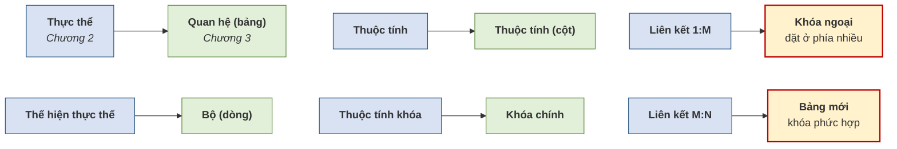

Bốn dòng đầu là phép dịch **một–một**, gần như đổi tên. Hai dòng cuối, được tô đậm, là chỗ **phép dịch không còn máy móc**: một liên kết ở Chương 2 không biến thành một bảng, mà biến thành **một cột khóa ngoại** hoặc **một bảng hoàn toàn mới**. Đó là nội dung chính của mục 3.4.

---

## 3.2. Phụ thuộc hàm và các loại khóa

*(1,5 tiết)*

### 3.2.1. Bàn giao thuật ngữ: từ "thuộc tính khóa" sang "khóa"

Ở Chương 2, giáo trình dùng nhất quán cụm **"thuộc tính khóa"**, vì trong mô hình ER mọi thứ gắn vào thực thể đều là thuộc tính và khóa chỉ là một loại thuộc tính đặc biệt — được vẽ bằng oval gạch chân.

Từ chương này trở đi, giáo trình dùng từ **"khóa"** với nghĩa kỹ thuật chặt chẽ hơn hẳn. Mô hình quan hệ không có một loại khóa mà có cả **một hệ thống năm loại khóa** phân biệt rõ ràng, mỗi loại phục vụ một mục đích khác nhau. Sự chuyển đổi thuật ngữ này không phải là câu nệ chữ nghĩa: nó đánh dấu bước chuyển từ *mô tả nghiệp vụ* sang *cấu trúc dữ liệu chặt chẽ*.

### 3.2.2. Phụ thuộc hàm và tính có chiều

Trước khi định nghĩa khóa, cần một công cụ để nói về **quan hệ xác định giữa các thuộc tính**.

> **Định nghĩa 3.3.** Thuộc tính `B` **phụ thuộc hàm** vào thuộc tính `A`, viết là **`A → B`**, nếu **mỗi giá trị của `A` xác định duy nhất một giá trị của `B`**. Khi đó `A` gọi là **vế trái** *(determinant)* và `B` là **vế phải**.

Cách đọc thực dụng của `A → B` là: *"biết `A` thì biết chắc `B`"*.

> **Ví dụ 3.2.** Trong bảng `HOCVIEN(MAHV, HOTEN, NGAYSINH)`, ta có `MAHV → HOTEN`: biết mã học viên là `HV01` thì biết chắc học viên đó tên Trần An. Ngược lại `HOTEN → MAHV` **không đúng**, vì trung tâm có thể có hai học viên cùng tên Trần An mang hai mã khác nhau.

Ví dụ trên minh họa đặc điểm quan trọng nhất của phụ thuộc hàm: **nó có chiều**.

**Hình 3.2. Phụ thuộc hàm có chiều — như một mũi tên một chiều**

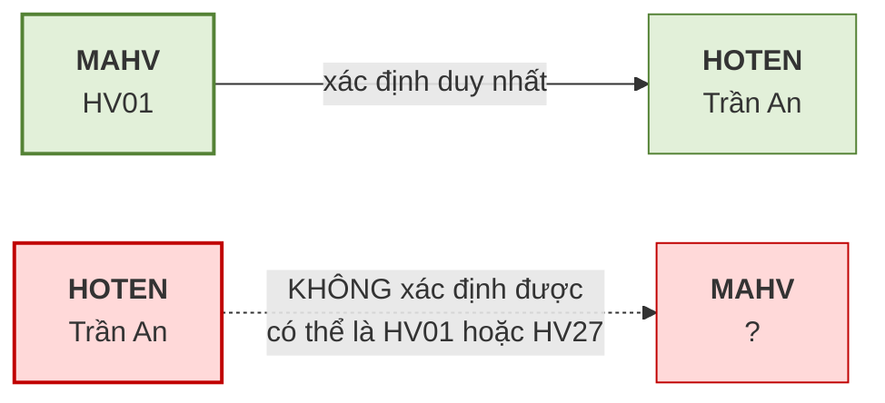

> **Chú ý.** Phụ thuộc hàm là một **quy tắc nghiệp vụ**, không phải một quan sát trên dữ liệu hiện có. Nếu hôm nay bảng chỉ có 3 học viên và tình cờ không ai trùng tên, ta **không được kết luận** `HOTEN → MAHV`. Câu hỏi đúng phải là: *"nghiệp vụ có cho phép hai học viên trùng tên không?"* Nếu có thì phụ thuộc hàm ấy không tồn tại, bất kể dữ liệu hiện tại trông thế nào. Đây là lỗi rất phổ biến, và Chương 5 sẽ quay lại điểm này khi dùng phụ thuộc hàm làm công cụ chuẩn hóa.

### 3.2.3. Năm loại khóa

> **Định nghĩa 3.4.** Cho quan hệ `R`:
>
> - **Siêu khóa** *(superkey)*: một tập thuộc tính **xác định duy nhất** mỗi bộ. Có thể thừa thuộc tính.
> - **Khóa dự tuyển** *(candidate key)*: một siêu khóa **tối thiểu** — bỏ bất kỳ thuộc tính nào cũng mất tính duy nhất.
> - **Khóa chính** *(primary key)*: khóa dự tuyển **được chọn** để định danh chính thức.
> - **Khóa phụ** *(secondary key)*: thuộc tính hoặc tổ hợp dùng để **tìm kiếm thuận tiện**, không nhất thiết duy nhất.
> - **Khóa ngoại** *(foreign key)*: thuộc tính trong bảng này nhưng là **khóa chính của bảng khác**, dùng để tạo liên kết.

**Bảng 3.3. Năm loại khóa — minh họa trên bảng `HOCVIEN(MAHV, CCCD, HOTEN, NGAYSINH, MALOP)`**

| Loại khóa | Ví dụ | Ghi chú |
|---|---|---|
| **Siêu khóa** | `{MAHV}`, `{CCCD}`, `{MAHV, HOTEN}`, `{MAHV, CCCD, HOTEN}` | Rất nhiều; hai tập cuối **thừa** |
| **Khóa dự tuyển** | `{MAHV}`, `{CCCD}` | Chỉ những siêu khóa **tối thiểu** |
| **Khóa chính** | `{MAHV}` | Người thiết kế **chọn một** trong các khóa dự tuyển |
| **Khóa phụ** | `{HOTEN}` | Dùng để tra cứu; **không duy nhất** |
| **Khóa ngoại** | `{MALOP}` | Là khóa chính của bảng `LOP` |

Quan hệ giữa ba loại khóa đầu là **quan hệ bao hàm thu hẹp dần**: mọi khóa chính đều là khóa dự tuyển, mọi khóa dự tuyển đều là siêu khóa, nhưng chiều ngược lại không đúng. Việc đi từ siêu khóa xuống khóa dự tuyển là bỏ đi phần **thừa**; việc đi từ khóa dự tuyển xuống khóa chính là một **quyết định của người thiết kế** — và tiêu chí để quyết định chính là phần khóa tự nhiên với khóa thay thế đã học ở mục 2.3.2.

> **Chú ý.** Phân biệt **siêu khóa** và **khóa dự tuyển** chính là phân biệt *tính duy nhất* với *tính tối thiểu* — hai tiêu chí đã nêu ở Bảng 2.5 của Chương 2. Ở Chương 2 ta yêu cầu thuộc tính khóa thỏa mãn **cả hai**; ở đây ta đặt tên riêng cho từng mức: thỏa mãn duy nhất là **siêu khóa**, thỏa mãn thêm tối thiểu là **khóa dự tuyển**.

### 3.2.4. Khóa chính và khóa ngoại — hai vai trò khác nhau

Hai loại khóa này được dùng nhiều nhất, và cũng hay bị lẫn vai trò. Một phép loại suy giúp phân định rất rõ.

**Hình 3.3. Khóa chính là "căn cước", khóa ngoại là "địa chỉ liên hệ"**

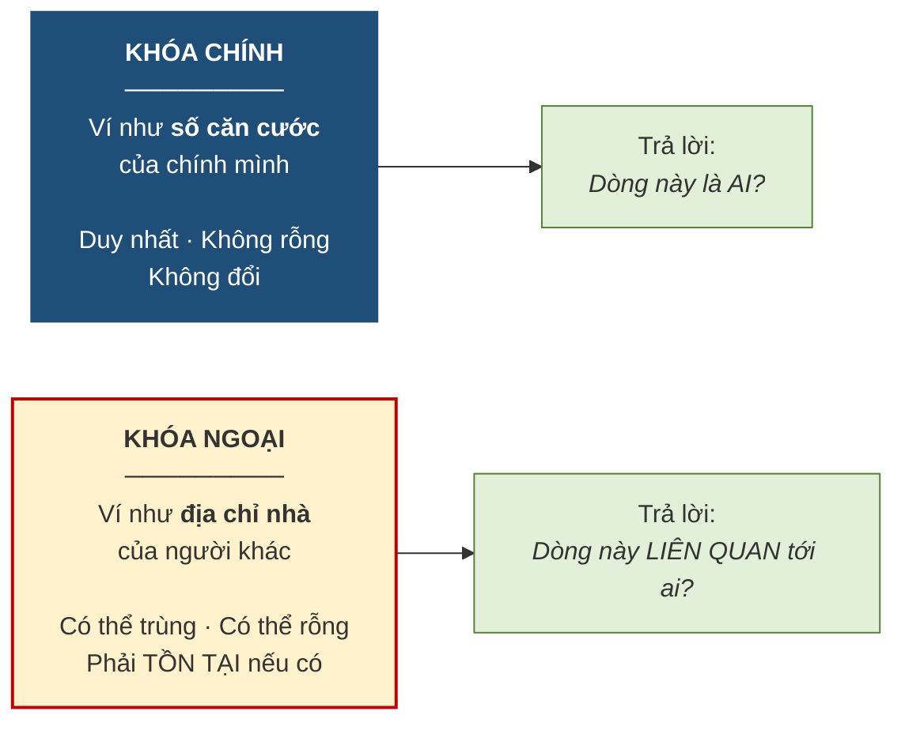

Ba khác biệt then chốt cần nắm. Về **tính duy nhất**: khóa chính không được trùng, còn khóa ngoại **được phép trùng** — bốn lớp cùng do một giáo viên phụ trách thì cột `MAGV` của bảng `LOP` có bốn dòng giá trị giống nhau, hoàn toàn hợp lệ. Về **giá trị rỗng**: khóa chính tuyệt đối cấm, khóa ngoại thì tùy nghiệp vụ. Về **điều kiện tồn tại**: khóa ngoại nếu có giá trị thì giá trị ấy **bắt buộc phải tồn tại** ở bảng được tham chiếu.

Ba khác biệt trên chính là nội dung của hai ràng buộc toàn vẹn ở mục tiếp theo.

---

## 3.3. Các ràng buộc toàn vẹn

*(1,0 tiết)*

Mô hình quan hệ đặt ra **hai ràng buộc bắt buộc** mà mọi cơ sở dữ liệu quan hệ đều phải tuân thủ. Chúng đơn giản tới mức dễ bị coi nhẹ, nhưng thiếu chúng thì toàn bộ mô hình sụp đổ.

### 3.3.1. Toàn vẹn thực thể

> **Định nghĩa 3.5.** **Toàn vẹn thực thể** *(entity integrity)*: khóa chính của mọi quan hệ phải **duy nhất** và **không được nhận giá trị rỗng** *(null)* ở bất kỳ thành phần nào.

Lý do rất trực tiếp. Khóa chính tồn tại để **định danh** một dòng. Nếu nó rỗng thì dòng đó không có danh tính — ta không có cách nào chỉ đích danh nó để đọc, sửa hay xóa. Nếu nó trùng thì hai dòng có cùng danh tính, và hệ thống không phân biệt được chúng.

Với khóa chính phức hợp, ràng buộc áp cho **từng thành phần**: trong bảng `GHIDANH(MAHV, MALOP, ...)`, cả `MAHV` lẫn `MALOP` đều không được rỗng.

### 3.3.2. Toàn vẹn tham chiếu

> **Định nghĩa 3.6.** **Toàn vẹn tham chiếu** *(referential integrity)*: mỗi giá trị của khóa ngoại **hoặc là rỗng, hoặc phải khớp với một giá trị khóa chính đang tồn tại** ở bảng được tham chiếu.

Ràng buộc này ngăn hiện tượng **tham chiếu mồ côi** — một dòng trỏ tới thứ không tồn tại.

> **Ví dụ 3.3.** Bảng `LOP` có dòng `(A5, 'Anh thương mại', 'GV99')`. Nếu bảng `GIAOVIEN` không có giáo viên nào mang mã `GV99`, thì lớp A5 đang được phụ trách bởi **một người không tồn tại**. Toàn vẹn tham chiếu chặn đúng tình huống này ngay tại thời điểm nhập liệu.

### 3.3.3. Vì sao khóa chính cấm rỗng còn khóa ngoại thì được phép

Đây là câu hỏi người học hay thắc mắc, và câu trả lời nằm ở **ý nghĩa nghiệp vụ của giá trị rỗng trong từng trường hợp**.

Với **khóa chính**, giá trị rỗng có nghĩa là *"dòng này không có danh tính"* — một điều vô nghĩa. Một học viên không có mã học viên thì không phải là một học viên trong hệ thống.

Với **khóa ngoại**, giá trị rỗng lại có nghĩa hoàn toàn hợp lý: *"dòng này hiện chưa liên kết với dòng nào cả"*. Và đây chính là cách mô hình quan hệ cài đặt khái niệm **tham gia tùy chọn** đã học ở mục 2.5.2.

> **Ví dụ 3.4.** Quy tắc 3 của Trung tâm ABC nói giáo viên **có thể chưa** phụ trách lớp nào. Ở chiều ngược lại, mọi lớp **bắt buộc** phải có giáo viên. Điều này ánh xạ thành: cột `MAGV` trong bảng `LOP` là khóa ngoại **không được rỗng**. Nếu quy tắc nghiệp vụ đổi thành *"lớp có thể tạm thời chưa phân giáo viên"*, thì cột ấy **được phép rỗng**.

Nói cách khác: **tính tham gia ở Chương 2 quyết định việc khóa ngoại ở Chương 3 có được rỗng hay không.** Xác định sai tính tham gia ở bước thiết kế quan niệm sẽ dẫn tới ràng buộc sai ở bước cài đặt — hệ thống hoặc từ chối dữ liệu hợp lệ, hoặc chấp nhận dữ liệu vô nghĩa.

### 3.3.4. Ba lỗ hổng mà hai ràng buộc này không chặn được

Hai ràng buộc trên là **điều kiện cần chứ chưa đủ**. Chúng chỉ bảo vệ **cấu trúc**; chúng không biết gì về **nghiệp vụ**.

**Bảng 3.4. Ba loại lỗi mà toàn vẹn thực thể và tham chiếu không phát hiện được**

| Tình huống sai | Hai ràng buộc có chặn? | Vì sao không |
|---|:--:|---|
| `HOCPHI = -500000` | **Không** | Đây là ràng buộc **miền giá trị**; hai ràng buộc trên chỉ quan tâm khóa |
| `NGAYKG` của lớp **trước** ngày trung tâm thành lập | **Không** | Ràng buộc **liên thuộc tính**, thuộc phạm vi nghiệp vụ |
| Số học viên trong một lớp **vượt sức chứa** | **Không** | Ràng buộc **liên bộ liên quan hệ**, phải đếm mới biết |

Ba lỗ hổng này chính là lý do tồn tại của **Chương 4 — Ràng buộc toàn vẹn**. Ở đó ta sẽ xây dựng một bộ sáu loại ràng buộc đủ để phủ kín các tình huống nghiệp vụ.

---

## 3.4. Bốn quy tắc ánh xạ ER sang mô hình quan hệ

*(1,5 tiết)*

Đây là kỹ năng trọng tâm của chương và là một trong những kỹ năng được Rubric 3 chấm trực tiếp. Điểm đáng mừng: công việc này gần như **máy móc**. Mọi quyết định sáng tạo đã được dùng hết ở Chương 2 — lúc phải nghĩ *"cất `HOCPHI` ở đâu"*. Ở đây chỉ cần áp quy tắc cho đúng.

> **Chú ý.** Nhưng cũng chính vì máy móc mà nó nguy hiểm: **nếu lược đồ ER sai thì lược đồ quan hệ sẽ sai theo**. Ánh xạ không sửa được lỗi thiết kế, nó chỉ trung thành chuyển lỗi sang dạng khác. Vì vậy trước khi ánh xạ, luôn phải đối chiếu lược đồ ER với quy tắc nghiệp vụ một lần nữa.

### 3.4.1. Bốn quy tắc

**Bảng 3.5. Bốn quy tắc ánh xạ ER sang quan hệ**

| Quy tắc | Thành phần ER | Kết quả trong mô hình quan hệ |
|:--:|---|---|
| **QT1** | Thực thể **mạnh** | Một **bảng**; thuộc tính khóa trở thành **khóa chính**. Thuộc tính phức hợp tách thành các cột đơn |
| **QT2** | Liên kết **1:1** | Đưa khóa chính của **một bên** sang bên kia làm **khóa ngoại**. Chọn bên **tham gia bắt buộc** để tránh giá trị rỗng |
| **QT3** | Liên kết **1:M** | Đưa khóa chính bên **"1"** sang bên **"nhiều"** làm **khóa ngoại** |
| **QT4** | Liên kết **M:N** | Tạo một **bảng mới**, khóa chính là **khóa phức hợp** ghép khóa chính hai bên, cộng các thuộc tính riêng của liên kết |

Ba trường hợp còn lại — thực thể yếu, liên kết đệ quy và phân cấp cha/con — được xử lý ở các mục 3.4.3 đến 3.4.5.

### 3.4.2. Quy tắc QT3 — vì sao khóa ngoại bắt buộc ở phía "nhiều"

Đây là quy tắc hay bị áp sai nhất, nên đáng chứng minh thay vì chỉ ghi nhớ.

Xét liên kết *"giáo viên (1) phụ trách lớp (M)"*. Giả sử cô Lê Hoa phụ trách **bốn lớp**: A1, A2, A3, A4.

**Hình 3.4. Làm sai để thấy vì sao — khóa ngoại đặt nhầm bên**

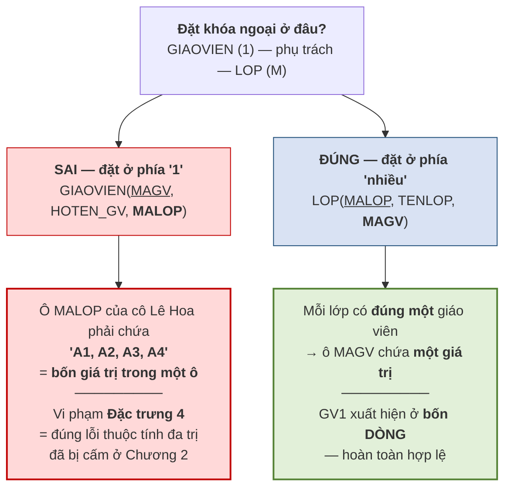

Cách làm đúng cho ra bảng dữ liệu như sau — và nó hoàn toàn hợp lệ:

| MALOP | TENLOP | MAGV |
|---|---|---|
| A1 | Anh cơ bản 1 | GV1 |
| A2 | Anh giao tiếp | GV1 |
| A3 | Anh nâng cao | GV1 |
| A4 | Luyện thi IELTS | GV1 |

> **Chú ý.** Câu cần nhớ: ***khóa ngoại luôn đặt ở phía "nhiều", vì phía "1" chỉ giữ nổi một giá trị trong mỗi ô.*** Coronel diễn đạt ý này như sau: *"gánh nặng thiết lập liên kết luôn đặt lên thực thể chứa khóa ngoại — thường là phía nhiều"* [3, tr. 113].

Điều đáng chú ý về mặt phương pháp: chứng minh trên **không dùng thêm kiến thức mới nào**. Nó chỉ dùng lại **Đặc trưng 4** ở mục 3.1.3. Đây là một ví dụ điển hình cho cách các quy tắc thiết kế được suy ra từ vài nguyên lý nền tảng chứ không phải học thuộc rời rạc.

### 3.4.3. Ánh xạ thuộc tính đa trị và thực thể yếu

Ở Chương 2, thuộc tính đa trị `SDT` đã được tách thành thực thể yếu `DIENTHOAI`. Bước ánh xạ chỉ việc chuyển nó thành bảng.

> **Quy tắc.** Một **thực thể yếu** trở thành **một bảng riêng**. Khóa chính của bảng ấy là **khóa phức hợp**, ghép từ ① khóa chính của thực thể chủ *(đồng thời là khóa ngoại trỏ về thực thể chủ)* và ② thuộc tính phân biệt riêng của thực thể yếu.

> **Ví dụ 3.5.** Thực thể yếu `DIENTHOAI` của Trung tâm ABC ánh xạ thành:
>
> `DIENTHOAI(`**`MAHV`**`,` **`SODT`**`)` — trong đó `MAHV` vừa là **một nửa khóa chính**, vừa là **khóa ngoại** trỏ về `HOCVIEN`.
>
> Dữ liệu minh họa:
>
> | MAHV | SODT |
> |---|---|
> | HV01 | 0905111111 |
> | HV01 | 0906222222 |
> | HV01 | 0907333333 |
> | HV02 | 0905444444 |
>
> Học viên HV01 có ba số điện thoại, thể hiện bằng **ba dòng** chứ không phải ba cột. Muốn thêm số thứ tư chỉ cần thêm một dòng — đúng như đã hứa ở mục 2.2.4.

> **Chú ý.** Điểm dễ sai là **quên rằng `MAHV` mang hai vai trò cùng lúc**. Nó vừa là thành phần khóa chính *(nên không được rỗng)*, vừa là khóa ngoại *(nên phải tồn tại ở bảng `HOCVIEN`)*. Đây là chỗ hai ràng buộc toàn vẹn ở mục 3.3 cùng tác động lên một cột.

### 3.4.4. Ánh xạ liên kết M:N và liên kết đệ quy

**Liên kết M:N** áp quy tắc QT4: tạo một bảng mới. Ở Chương 2, việc này đã làm sẵn dưới tên gọi *thực thể kết hợp*, nên bước ánh xạ chỉ là ghi lại.

> **Ví dụ 3.6.** Liên kết M:N giữa `HOCVIEN` và `LOP` ánh xạ thành:
>
> `GHIDANH(`**`MAHV`**`,` **`MALOP`**`, NGAYGHIDANH, HOCPHI)`
>
> Khóa chính là cặp `(MAHV, MALOP)`; đồng thời `MAHV` là khóa ngoại trỏ về `HOCVIEN` và `MALOP` là khóa ngoại trỏ về `LOP`.

Cần nhấn mạnh lại điều đã hứa ở Chương 2: **liên kết M:N phải tách kể cả khi nó không có thuộc tính riêng nào**. Lý do bây giờ đã chứng minh được. Nếu không tách, ta buộc phải đặt khóa ngoại ở một trong hai phía — mà cả hai phía đều là "nhiều", nên ô nào cũng phải chứa nhiều giá trị, vi phạm Đặc trưng 4. Không có chỗ nào đặt được khóa ngoại; bảng trung gian là lối thoát duy nhất.

**Liên kết đệ quy** ánh xạ theo đúng quy tắc của loại liên kết tương ứng, chỉ khác ở chỗ hai khóa ngoại cùng trỏ về một bảng nên **phải đặt tên khác nhau**.

> **Ví dụ 3.7.** Liên kết đệ quy M:N *"khóa học là tiên quyết của khóa học"* ánh xạ thành:
>
> `TIENQUYET(`**`MAKH_truoc`**`,` **`MAKH_sau`**`)`
>
> Cả hai cột đều là khóa ngoại trỏ về `KHOAHOC`, nhưng mang hai tên khác nhau để phân biệt vai trò. Nếu là liên kết đệ quy **1:M** — chẳng hạn *"nhân viên quản lý nhân viên"* — thì không cần bảng mới, chỉ cần thêm một cột: `NHANVIEN(`**`MANV`**`, HOTEN, MANV_quanly)`, trong đó `MANV_quanly` là khóa ngoại trỏ về chính bảng `NHANVIEN`.

### 3.4.5. Ánh xạ phân cấp cha/con của mô hình EER

Mục 2.7 của Chương 2 đã giới thiệu quan hệ cha/con. Mô hình quan hệ **không có khái niệm kế thừa**, nên phân cấp ấy phải được diễn đạt lại bằng bảng. Có **ba phương án**, và việc chọn phương án nào phụ thuộc trực tiếp vào **hai ràng buộc** đã xác định ở mục 2.7.5.

**Hình 3.5. Ba phương án ánh xạ phân cấp cha/con**

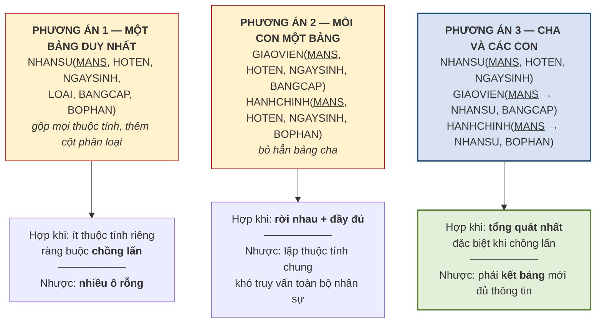

**Phương án 1 — một bảng duy nhất.** Gộp tất cả thuộc tính của cha và mọi con vào một bảng, thêm một cột `LOAI` để phân biệt. Ưu điểm là mọi truy vấn chỉ đọc một bảng. Nhược điểm là **ô rỗng tràn lan**: mọi giáo viên đều có ô `BOPHAN` trống và mọi nhân viên hành chính đều có ô `BANGCAP` trống. Chỉ nên dùng khi các con có **rất ít thuộc tính riêng**.

**Phương án 2 — mỗi con một bảng, bỏ bảng cha.** Mỗi thực thể con thành một bảng chứa **cả thuộc tính chung lẫn thuộc tính riêng**. Ưu điểm là không có ô rỗng. Nhược điểm là **lặp lại các thuộc tính chung** ở mọi bảng con, và câu hỏi *"toàn trung tâm có bao nhiêu nhân sự"* buộc phải hợp nhiều bảng. Phương án này **chỉ dùng được khi ràng buộc là rời nhau và đầy đủ** — vì nếu chồng lấn thì một người kiêm nhiệm sẽ bị lưu hai lần, còn nếu không đầy đủ thì bác bảo vệ không có bảng nào chứa.

**Phương án 3 — giữ cả bảng cha lẫn các bảng con.** Bảng cha chứa thuộc tính chung; mỗi bảng con chứa thuộc tính riêng và dùng **chính khóa chính của cha** làm khóa chính, đồng thời làm khóa ngoại trỏ về cha. Đây là phương án **tổng quát nhất**: nó xử lý được cả chồng lấn *(một người xuất hiện ở hai bảng con)* lẫn không đầy đủ *(một người chỉ có ở bảng cha)*. Nhược điểm là muốn lấy đủ thông tin về một giáo viên thì phải **kết hai bảng**.

**Bảng 3.6. Chọn phương án theo hai ràng buộc của phân cấp**

| Ràng buộc *(mục 2.7.5)* | Phương án phù hợp | Lý do |
|---|---|---|
| Rời nhau + Đầy đủ | **2** hoặc 3 | Không ai kiêm nhiệm, không ai đứng ngoài → bỏ bảng cha được |
| Rời nhau + Không đầy đủ | **3** | Cần bảng cha để chứa những người không thuộc con nào |
| Chồng lấn + Đầy đủ | **3** | Người kiêm nhiệm cần xuất hiện ở nhiều bảng con |
| Chồng lấn + Không đầy đủ | **3** | Trường hợp tổng quát nhất |
| Con có rất ít thuộc tính riêng | **1** | Không đáng tách; chấp nhận vài ô rỗng |

> **Chú ý.** Bảng trên cho thấy vì sao mục 2.7.5 lại quan trọng đến thế. **Hai ràng buộc xác định ở bước thiết kế quan niệm quyết định trực tiếp cấu trúc bảng ở bước thiết kế logic.** Nếu ở Chương 2 người thiết kế không hỏi khách hàng *"có ai kiêm nhiệm không"* và *"có ai không thuộc nhóm nào không"*, thì tới đây sẽ chọn phương án theo cảm tính — và chọn sai thì hoặc mất dữ liệu, hoặc trùng lặp dữ liệu.

---

## 3.5. Đại số quan hệ — phép chọn và phép chiếu

*(1,0 tiết)*

### 3.5.1. Đại số quan hệ và tính đóng kín

Có cấu trúc rồi thì phải có cách lấy dữ liệu ra. Codd cung cấp công cụ ấy dưới dạng một hệ thống phép toán.

> **Định nghĩa 3.7.** **Đại số quan hệ** *(relational algebra)* là tập các phép toán **nhận đầu vào là một hoặc hai quan hệ và cho kết quả cũng là một quan hệ**.

Tính chất in đậm trong định nghĩa có tên riêng: **tính đóng kín** *(closure)*. Đây là đặc điểm quan trọng nhất của đại số quan hệ, và cũng là điều làm nên sức mạnh của nó.

Vì kết quả của một phép toán lại là một quan hệ, ta có thể **dùng kết quả ấy làm đầu vào cho phép toán tiếp theo**, và cứ thế ghép nối thành biểu thức phức tạp tùy ý. Giống như trong số học, vì tổng của hai số lại là một số nên ta viết được `(3 + 5) × 2 − 4`.

Tám phép toán chia làm hai nhóm:

- **Nhóm phép toán tập hợp** — kế thừa nguyên từ lý thuyết tập hợp: **hợp `∪`**, **giao `∩`**, **hiệu `−`**, **tích Descartes `×`**.
- **Nhóm phép toán quan hệ** — sinh ra riêng cho mô hình quan hệ: **chọn `σ`**, **chiếu `π`**, **kết `⋈`**, **chia `÷`**.

### 3.5.2. Phép chọn và phép chiếu

Hai phép toán này là cặp cơ bản nhất, và cách nhớ chúng cũng rất trực quan.

> **Định nghĩa 3.8.** **Phép chọn** *(selection)*, ký hiệu **`σ`** *(sigma)*, lấy ra **các bộ thỏa mãn một điều kiện**. Viết là `σ_<điều kiện>(R)`.
>
> **Phép chiếu** *(projection)*, ký hiệu **`π`** *(pi)*, lấy ra **một số thuộc tính** của mọi bộ. Viết là `π_<danh sách thuộc tính>(R)`.

**Hình 3.6. Phép chọn cắt ngang, phép chiếu cắt dọc**

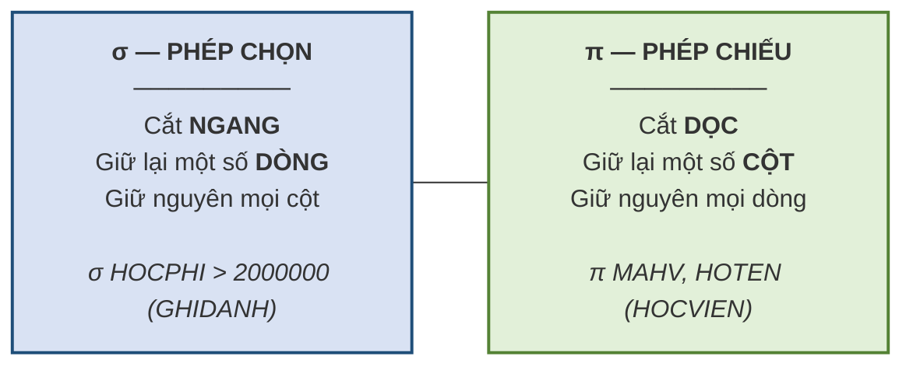

> **Ví dụ 3.8.** Cho bảng `HOCVIEN`:
>
> | MAHV | HOTEN | NGAYSINH | MALOP |
> |---|---|---|---|
> | HV01 | Trần An | 2005-04-12 | A1 |
> | HV02 | Lê Bình | 2004-09-30 | A1 |
> | HV03 | Phạm Cường | 2006-01-15 | A2 |
>
> **Phép chọn** `σ_MALOP='A1'(HOCVIEN)` cho kết quả **hai dòng đầu, đủ bốn cột**.
>
> **Phép chiếu** `π_MAHV,HOTEN(HOCVIEN)` cho kết quả **ba dòng, chỉ hai cột** `MAHV` và `HOTEN`.

> **Chú ý — một đặc điểm hay bị quên của phép chiếu.** Kết quả của phép chiếu là một **quan hệ**, mà quan hệ là một tập hợp nên **không chứa phần tử trùng lặp**. Do đó phép chiếu **tự động loại bỏ các dòng trùng nhau**. Chiếu bảng `HOCVIEN` lên riêng cột `MALOP` cho kết quả chỉ **hai dòng** — `A1` và `A2` — chứ không phải ba. Đây là điểm khác biệt so với câu lệnh `SELECT` của SQL, vốn giữ lại dòng trùng trừ khi được yêu cầu ngược lại.

### 3.5.3. Kết hợp phép chọn và phép chiếu

Nhờ tính đóng kín, hai phép toán trên ghép được với nhau.

> **Ví dụ 3.9.** Yêu cầu: *"Cho biết mã và họ tên các học viên thuộc lớp A1."*
>
> `π_MAHV,HOTEN( σ_MALOP='A1'(HOCVIEN) )`
>
> Đọc từ trong ra ngoài: trước hết **chọn** các dòng của lớp A1, sau đó **chiếu** kết quả ấy lên hai cột cần lấy.

Thứ tự thực hiện có ảnh hưởng tới hiệu quả. Nên **chọn trước, chiếu sau**: lọc bỏ bớt dòng rồi mới cắt cột thì khối lượng dữ liệu phải xử lý ở bước sau nhỏ hơn. Nếu làm ngược lại — chiếu trước lên hai cột `MAHV`, `HOTEN` — thì cột `MALOP` đã bị bỏ đi, và **không còn cách nào lọc theo lớp nữa**. Trong trường hợp này, làm ngược thứ tự không chỉ chậm hơn mà là **sai**.

---

## 3.6. Các phép toán tập hợp

*(1,0 tiết)*

### 3.6.1. Điều kiện khả hợp

Ba phép toán `∪`, `∩`, `−` chỉ áp dụng được khi hai quan hệ **tương thích với nhau về cấu trúc**.

> **Định nghĩa 3.9.** Hai quan hệ `R` và `S` gọi là **khả hợp** *(union-compatible)* nếu thỏa mãn **đồng thời hai điều kiện**:
>
> 1. Chúng có **cùng bậc** — tức cùng số thuộc tính.
> 2. Các thuộc tính **tương ứng theo thứ tự** có **cùng miền giá trị**.

Điều kiện thứ hai nói *"cùng miền giá trị"* chứ không nói *"cùng tên"*. Tên thuộc tính có thể khác nhau; điều quan trọng là chúng chứa **cùng loại dữ liệu**.

> **Ví dụ 3.10.** Hai quan hệ `HOCVIEN_CS1(MAHV, HOTEN)` và `HOCVIEN_CS2(MA, TEN)` là **khả hợp**: cùng bậc 2, và cặp thuộc tính tương ứng cùng miền giá trị *(mã học viên và họ tên)*. Ngược lại, `HOCVIEN(MAHV, HOTEN, NGAYSINH)` và `LOP(MALOP, TENLOP)` **không khả hợp** vì khác bậc.

Điều kiện này không phải là hình thức. Nếu hợp hai bảng khác cấu trúc, kết quả sẽ là một bảng mà các dòng có **số cột khác nhau** hoặc **ý nghĩa cột lệch nhau** — không còn là một quan hệ hợp lệ, vi phạm Đặc trưng 3 và 5 ở mục 3.1.3.

### 3.6.2. Hợp, giao và hiệu

> **Định nghĩa 3.10.** Cho hai quan hệ **khả hợp** `R` và `S`:
>
> - **Hợp** `R ∪ S`: mọi bộ thuộc `R` **hoặc** thuộc `S` *(bộ trùng chỉ lấy một lần)*.
> - **Giao** `R ∩ S`: các bộ thuộc **cả** `R` **và** `S`.
> - **Hiệu** `R − S`: các bộ thuộc `R` **nhưng không** thuộc `S`.

> **Ví dụ 3.11.** Trung tâm ABC có hai cơ sở. Gọi `A` là tập học viên cơ sở 1, `B` là tập học viên cơ sở 2, cả hai cùng cấu trúc `(MAHV, HOTEN)`.
>
> | Yêu cầu nghiệp vụ | Biểu thức |
> |---|---|
> | Danh sách **toàn bộ** học viên của trung tâm | `A ∪ B` |
> | Học viên **học ở cả hai** cơ sở | `A ∩ B` |
> | Học viên **chỉ học ở cơ sở 1** | `A − B` |

Cần lưu ý rằng **phép hiệu không giao hoán**: `A − B` khác `B − A`. `A − B` cho học viên chỉ ở cơ sở 1, còn `B − A` cho học viên chỉ ở cơ sở 2. Trong khi đó `∪` và `∩` đều giao hoán.

### 3.6.3. Tích Descartes — phép duy nhất không đòi hỏi khả hợp

> **Định nghĩa 3.11.** **Tích Descartes** *(Cartesian product)* `R × S` ghép **mỗi bộ của `R` với mọi bộ của `S`**. Nếu `R` có bậc `m` và lực lượng `p`, còn `S` có bậc `n` và lực lượng `q`, thì `R × S` có **bậc `m + n`** và **lực lượng `p × q`**.

Tích Descartes được xếp vào **nhóm phép toán tập hợp** vì nó kế thừa trực tiếp từ lý thuyết tập hợp, giống ba phép trên. Nhưng nó **khác ba phép kia ở một điểm căn bản**, và đây là chỗ người học hay nhầm.

**Ba phép `∪`, `∩`, `−` đòi hỏi khả hợp; tích Descartes thì không.** Lý do nằm ở bản chất phép toán. Ba phép đầu **so sánh các bộ với nhau** để quyết định giữ hay bỏ, nên hai bộ phải có cùng cấu trúc mới so sánh được. Tích Descartes **không so sánh gì cả** — nó chỉ nối hai bộ lại thành một bộ dài hơn, nên hai quan hệ đầu vào có cấu trúc thế nào cũng được.

**Bảng 3.7. Bốn phép toán tập hợp — đối chiếu**

| Phép toán | Đòi hỏi khả hợp? | Bậc kết quả | Lực lượng kết quả |
|---|:--:|---|---|
| Hợp `∪` | **Có** | Bằng bậc đầu vào | ≤ `p + q` *(bỏ trùng)* |
| Giao `∩` | **Có** | Bằng bậc đầu vào | ≤ min(`p`, `q`) |
| Hiệu `−` | **Có** | Bằng bậc đầu vào | ≤ `p` |
| **Tích Descartes `×`** | **Không** | **`m + n`** | **`p × q`** |

> **Ví dụ 3.12.** `HOCVIEN` có 3 bộ và bậc 4; `LOP` có 2 bộ và bậc 3. Khi ấy `HOCVIEN × LOP` có **bậc 7** và **lực lượng 6**. Trong 6 bộ ấy, chỉ một số ít là có ý nghĩa — những cặp mà học viên thật sự thuộc lớp đó. Phần còn lại là ghép cơ học vô nghĩa.

Nhận xét trên dẫn thẳng tới phép toán quan trọng nhất của chương, trình bày ở mục sau: **phép kết chính là tích Descartes có lọc**.

> **Chú ý.** Tích Descartes hiếm khi được dùng một mình vì kết quả **phình rất nhanh**. Hai bảng mỗi bảng 1.000 dòng cho ra một triệu dòng. Trong thực tế, khi một truy vấn vô tình sinh ra tích Descartes — thường do quên điều kiện kết — người ta gọi đó là *"tích Descartes ngoài ý muốn"*, và đây là một trong những lỗi gây treo hệ thống phổ biến nhất.

---

## 3.7. Phép kết và phép chia

*(1,0 tiết)*

### 3.7.1. Phép kết tự nhiên — thực chất là ba bước

Phép kết là phép toán **được dùng nhiều nhất** trong thực tế, vì nó chính là công cụ để ghép các bảng đã tách ở bước thiết kế trở lại thành thông tin có nghĩa.

> **Định nghĩa 3.12.** **Phép kết tự nhiên** *(natural join)* `R ⋈ S` ghép hai quan hệ dựa trên **các thuộc tính cùng tên**, chỉ giữ lại những cặp bộ có **giá trị khớp nhau** ở các thuộc tính ấy, và **loại bỏ cột trùng lặp** trong kết quả.

Định nghĩa trên nghe gọn nhưng che giấu ba thao tác. Vén màn ra, phép kết tự nhiên thực chất là:

**Hình 3.7. Phép kết tự nhiên thực chất là ba bước**

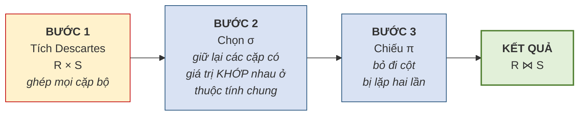

Hiểu được ba bước này giải thích được nhiều điều. Thứ nhất, nó cho thấy **phép kết không phải phép toán nguyên thủy** — nó diễn đạt được bằng ba phép đã học. Thứ hai, nó giải thích vì sao quên điều kiện kết lại sinh ra tích Descartes: bỏ Bước 2 thì chỉ còn Bước 1. Thứ ba, nó cho thấy vì sao phép kết **tốn kém về hiệu năng**, và vì sao hệ quản trị phải dùng chỉ mục để tối ưu.

> **Ví dụ 3.13.** Kết `LOP ⋈ GIAOVIEN` trên thuộc tính chung `MAGV`:
>
> `LOP`
>
> | MALOP | TENLOP | MAGV |
> |---|---|---|
> | A1 | Anh cơ bản 1 | GV1 |
> | A2 | Anh giao tiếp | GV2 |
>
> `GIAOVIEN`
>
> | MAGV | HOTEN_GV |
> |---|---|
> | GV1 | Lê Hoa |
> | GV2 | Trần Mai |
>
> Kết quả `LOP ⋈ GIAOVIEN`:
>
> | MALOP | TENLOP | MAGV | HOTEN_GV |
> |---|---|---|---|
> | A1 | Anh cơ bản 1 | GV1 | Lê Hoa |
> | A2 | Anh giao tiếp | GV2 | Trần Mai |
>
> Cột `MAGV` chỉ xuất hiện **một lần** trong kết quả — đó là tác dụng của Bước 3.

### 3.7.2. Các biến thể của phép kết

**Bảng 3.8. Các biến thể của phép kết**

| Biến thể | Ký hiệu | Đặc điểm |
|---|:--:|---|
| **Kết tự nhiên** *(natural join)* | `⋈` | Ghép theo thuộc tính **cùng tên**, tự động bỏ cột trùng |
| **Kết bằng** *(equijoin)* | `⋈_θ` | Ghép theo điều kiện **bằng** do người dùng chỉ định; **giữ cả hai cột** |
| **Kết theta** *(theta join)* | `⋈_θ` | Điều kiện có thể là `>`, `<`, `≠`… chứ không chỉ `=` |
| **Kết trong** *(inner join)* | `⋈` | Tên gọi chung cho các phép trên — **chỉ giữ bộ khớp** |
| **Kết ngoài trái** *(left outer join)* | `⟕` | Giữ **mọi bộ của bảng trái**; bên phải không khớp thì điền **rỗng** |
| **Kết ngoài phải** *(right outer join)* | `⟖` | Giữ **mọi bộ của bảng phải** |
| **Kết ngoài đầy đủ** *(full outer join)* | `⟗` | Giữ **mọi bộ của cả hai bảng** |

Khác biệt cốt lõi giữa **kết trong** và **kết ngoài** nằm ở cách xử lý các bộ **không tìm được bạn khớp**. Kết trong **vứt bỏ** chúng; kết ngoài **giữ lại** và điền giá trị rỗng vào phần thiếu.

Sự khác biệt này có hệ quả nghiệp vụ rất thực tế. Câu hỏi *"liệt kê các lớp cùng tên giáo viên phụ trách"* dùng kết trong sẽ **bỏ sót những lớp chưa phân giáo viên**. Nếu người quản lý dùng kết quả ấy để đếm số lớp đang mở, con số sẽ thiếu — và thiếu **trong im lặng**, đúng kiểu lỗi nguy hiểm đã bàn ở Chương 1.

### 3.7.3. Dùng kết ngoài để dò lỗi toàn vẹn tham chiếu

Đây là một kỹ thuật rất thực dụng, và cũng là chỗ đại số quan hệ trở thành công cụ **kiểm tra chất lượng dữ liệu** chứ không chỉ để truy vấn [3, Ch.3].

**Vấn đề đặt ra.** Mục 3.3.2 đã nêu ràng buộc toàn vẹn tham chiếu. Nhưng ràng buộc ấy chỉ có tác dụng **nếu đã được khai báo** với hệ quản trị. Trong thực tế người ta thường xuyên gặp những cơ sở dữ liệu cũ mà ràng buộc chưa được khai báo, hoặc dữ liệu được nạp hàng loạt từ hệ thống khác bằng con đường vòng qua kiểm tra. Khi ấy có thể tồn tại các **khóa ngoại mồ côi** — trỏ tới thứ không có thật.

Câu hỏi là: **làm sao tìm ra chúng?**

**Hình 3.8. Dùng kết ngoài trái để phát hiện khóa ngoại mồ côi**

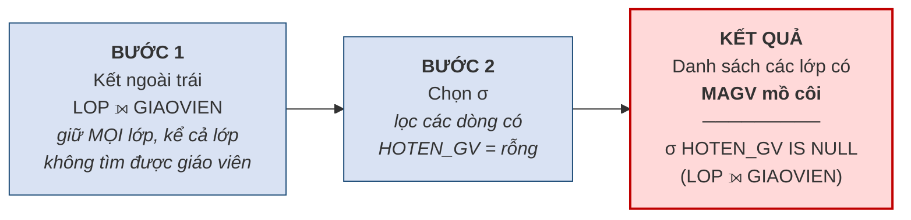

**Nguyên lý hoạt động.** Kết ngoài trái giữ lại **mọi** dòng của bảng `LOP`. Với những lớp có `MAGV` hợp lệ, các cột lấy từ `GIAOVIEN` sẽ có giá trị. Với những lớp có `MAGV` mồ côi, **không tìm được bộ khớp** nên các cột ấy bị điền **rỗng**. Vậy chỉ cần lọc lấy các dòng có cột bên phải rỗng là ra danh sách lỗi.

> **Ví dụ 3.14.** Giả sử bảng `LOP` có dòng `(A5, 'Anh thương mại', 'GV99')` trong khi `GIAOVIEN` không có `GV99`.
>
> `LOP ⟕ GIAOVIEN` cho kết quả:
>
> | MALOP | TENLOP | MAGV | HOTEN_GV |
> |---|---|---|---|
> | A1 | Anh cơ bản 1 | GV1 | Lê Hoa |
> | A2 | Anh giao tiếp | GV2 | Trần Mai |
> | **A5** | **Anh thương mại** | **GV99** | *(rỗng)* |
>
> Áp thêm phép chọn `σ_HOTEN_GV rỗng` ta được đúng **dòng A5** — chính là lỗi cần tìm.

> **Chú ý — một cạm bẫy khi dùng kỹ thuật này.** Phải phân biệt hai nguyên nhân khiến cột bên phải bị rỗng. Nguyên nhân thứ nhất là **mồ côi thật** — `MAGV` có giá trị nhưng giá trị ấy không tồn tại. Nguyên nhân thứ hai là **khóa ngoại vốn rỗng** — lớp chưa phân giáo viên, và điều này có thể hoàn toàn hợp lệ. Muốn tách bạch, phải thêm điều kiện *"`MAGV` khác rỗng"* vào phép chọn. Bỏ qua chi tiết này sẽ báo nhầm hàng loạt dòng hợp lệ thành lỗi.

Kỹ thuật này nối thẳng sang Chương 4. Ở đó, việc **phát hiện** lỗi sẽ được nâng lên thành việc **ngăn chặn** lỗi bằng cách khai báo ràng buộc ngay từ đầu.

### 3.7.4. Phép chia

Phép chia là phép toán khó nhất trong tám phép, nhưng nó trả lời được một loại câu hỏi mà các phép khác không diễn đạt trực tiếp được: câu hỏi có chữ **"tất cả"**.

> **Định nghĩa 3.13.** Cho quan hệ `R(A, B)` và quan hệ `S(B)`. **Phép chia** `R ÷ S` cho kết quả là tập các giá trị `a` sao cho **với mọi** `b` thuộc `S`, cặp `(a, b)` đều có mặt trong `R`.

Cách đọc thực dụng: **`R ÷ S` tìm những `a` liên quan tới TẤT CẢ các `b` trong `S`.**

> **Ví dụ 3.15.** Yêu cầu: *"Cho biết những học viên đã ghi danh **tất cả** các lớp bắt buộc."*
>
> Cho `GHIDANH(MAHV, MALOP)` và `LOP_BATBUOC(MALOP)`:
>
> `GHIDANH`
>
> | MAHV | MALOP |
> |---|---|
> | HV01 | A1 |
> | HV01 | A2 |
> | HV02 | A1 |
> | HV03 | A1 |
> | HV03 | A2 |
> | HV03 | A3 |
>
> `LOP_BATBUOC` = { A1, A2 }
>
> Kết quả `GHIDANH ÷ LOP_BATBUOC` = **{ HV01, HV03 }**.
>
> Giải thích: HV01 có cả A1 và A2 nên đạt. HV03 có A1, A2 và thêm A3 — **thừa không sao**, vẫn đạt. HV02 chỉ có A1, **thiếu A2** nên loại.

**Cách tính từng bước.** Phép chia không phải phép toán nguyên thủy; nó diễn đạt được bằng các phép đã học, và việc lần theo cách diễn đạt ấy giúp hiểu bản chất phép toán.

| Bước | Biểu thức | Ý nghĩa | Kết quả với ví dụ trên |
|:--:|---|---|---|
| 1 | `T1 = π_MAHV(GHIDANH)` | Mọi học viên có ghi danh | {HV01, HV02, HV03} |
| 2 | `T2 = T1 × LOP_BATBUOC` | Mọi cặp **đáng lẽ phải có** nếu ai cũng học đủ | 6 cặp |
| 3 | `T3 = T2 − π_MAHV,MALOP(GHIDANH)` | Các cặp **còn thiếu** | {(HV02, A2)} |
| 4 | `T4 = π_MAHV(T3)` | Học viên **thiếu ít nhất một lớp** | {HV02} |
| 5 | `KQ = T1 − T4` | Học viên **không thiếu lớp nào** | **{HV01, HV03}** |

Lối suy luận ở đây rất đáng chú ý và đáng học riêng: thay vì tìm trực tiếp *"ai học đủ"*, ta đi đường vòng — tìm *"ai còn thiếu"* rồi **loại họ ra**. Đây là kỹ thuật **phủ định hai lần**, xuất hiện rất nhiều trong logic và trong thiết kế truy vấn.

> **Chú ý.** Dấu hiệu để nhận ra bài toán cần phép chia là các cụm từ **"tất cả"**, **"mọi"**, **"toàn bộ"** trong câu hỏi nghiệp vụ. *"Học viên học **tất cả** các lớp bắt buộc"*, *"nhà cung cấp cung cấp **mọi** mặt hàng"*, *"sinh viên đã học **toàn bộ** học phần tiên quyết"*. Khi thấy những từ này, phép chia thường là lời giải gọn nhất.
>
> Trong thực tế, phép chia **ít được dùng trực tiếp** vì SQL không có toán tử tương ứng — người ta phải viết lại theo lối năm bước ở trên. Nhưng hiểu phép chia vẫn cần thiết, vì nó rèn đúng kiểu tư duy mà loại bài toán "tất cả" đòi hỏi.

### 3.7.5. Tổng hợp tám phép toán

**Hình 3.9. Tám phép toán của đại số quan hệ**

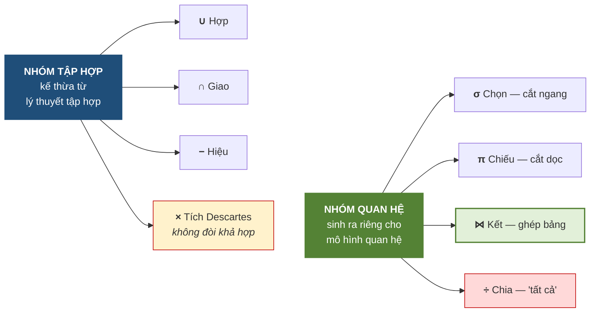

**Bảng 3.9. Từ điển dịch yêu cầu bằng lời sang phép toán**

| Câu hỏi nghiệp vụ chứa cụm… | Phép toán tương ứng |
|---|---|
| *"những … thỏa mãn điều kiện …"* | Chọn `σ` |
| *"chỉ cho biết cột … "*, *"danh sách tên …"* | Chiếu `π` |
| *"cả A và B"*, *"vừa … vừa …"* | Giao `∩` |
| *"A hoặc B"*, *"gộp danh sách"* | Hợp `∪` |
| *"chỉ có ở A"*, *"trừ những …"*, *"chưa từng …"* | Hiệu `−` |
| *"kèm theo thông tin từ bảng khác"* | Kết `⋈` |
| *"kể cả những … chưa có …"* | Kết ngoài `⟕` |
| *"tất cả"*, *"mọi"*, *"toàn bộ"* | Chia `÷` |

Bảng trên là công cụ thực dụng nhất của cả mục 3.5–3.7: khi gặp một yêu cầu bằng lời, người học **dò từ khóa** để tìm phép toán, rồi mới ghép biểu thức.

---

## 3.8. Ví dụ tổng hợp: Trung tâm Anh ngữ ABC

### 3.8.1. Ánh xạ từ lược đồ Chen của Chương 2

Đầu vào là lược đồ ER hoàn chỉnh ở **Hình 2.14** của Chương 2, gồm bảy thực thể. Áp lần lượt các quy tắc ánh xạ.

**Hình 3.10. Ánh xạ lược đồ Chen sang tập quan hệ**

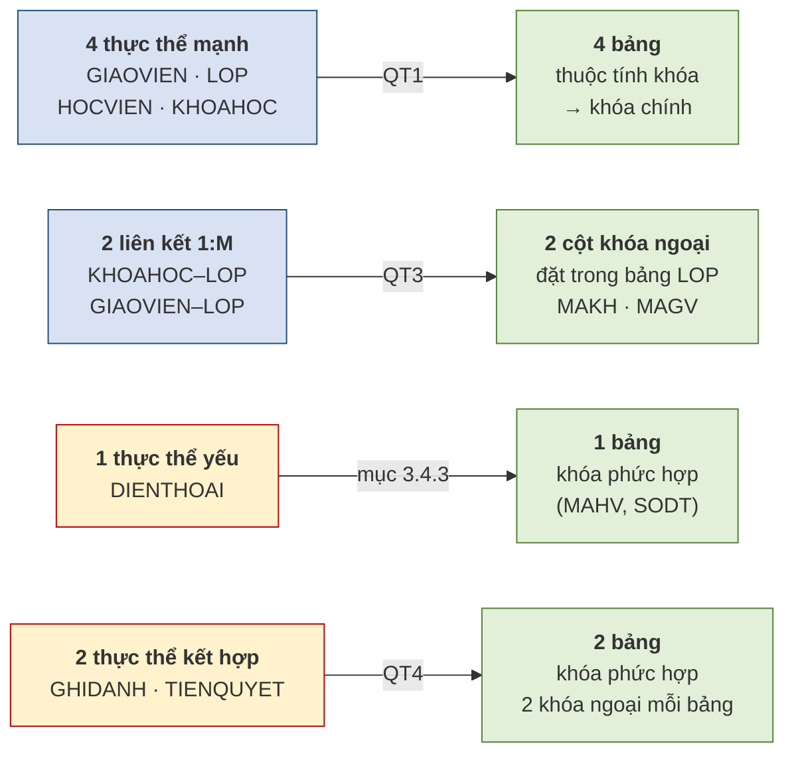

**Bảng 3.10. Ánh xạ từng thành phần**

| Thành phần ER | Quy tắc | Kết quả |
|---|:--:|---|
| `GIAOVIEN` *(mạnh)* | QT1 | `GIAOVIEN(`**`MAGV`**`, HOTEN_GV, BANGCAP)` |
| `KHOAHOC` *(mạnh)* | QT1 | `KHOAHOC(`**`MAKH`**`, TENKH)` |
| `HOCVIEN` *(mạnh)* | QT1 | `HOCVIEN(`**`MAHV`**`, HOTEN, NGAYSINH)` |
| `LOP` *(mạnh)* + 2 liên kết 1:M | QT1 + QT3 | `LOP(`**`MALOP`**`, TENLOP, NGAYKG, MAGV↗, MAKH↗)` |
| `DIENTHOAI` *(yếu)* | mục 3.4.3 | `DIENTHOAI(`**`MAHV↗`**`,` **`SODT`**`)` |
| `GHIDANH` *(kết hợp)* | QT4 | `GHIDANH(`**`MAHV↗`**`,` **`MALOP↗`**`, NGAYGHIDANH, HOCPHI)` |
| `TIENQUYET` *(kết hợp, đệ quy)* | QT4 | `TIENQUYET(`**`MAKH_truoc↗`**`,` **`MAKH_sau↗`**`)` |

*(Ký hiệu **in đậm** = thành phần khóa chính; ↗ = khóa ngoại.)*

### 3.8.2. Lược đồ quan hệ hoàn chỉnh

**Hình 3.11. Lược đồ quan hệ của Trung tâm Anh ngữ ABC — bảy bảng**

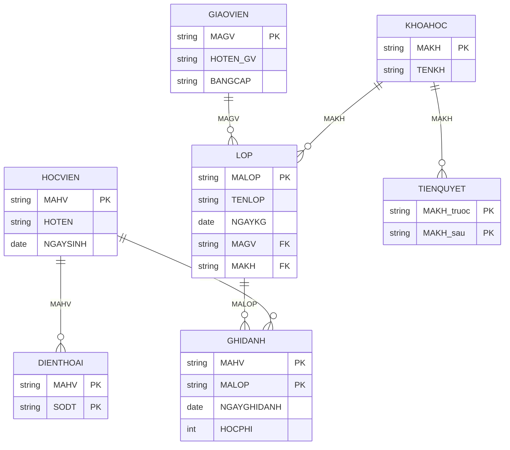

### 3.8.3. Kiểm tra toàn vẹn trên lược đồ

Sau khi ánh xạ, phải kiểm tra hai ràng buộc ở mục 3.3 cho từng bảng.

**Bảng 3.11. Đối chiếu toàn vẹn cho bảy bảng**

| Bảng | Khóa chính | Khóa ngoại | Khóa ngoại được rỗng? |
|---|---|---|---|
| `GIAOVIEN` | `MAGV` | — | — |
| `KHOAHOC` | `MAKH` | — | — |
| `HOCVIEN` | `MAHV` | — | — |
| `LOP` | `MALOP` | `MAGV` → `GIAOVIEN` `MAKH` → `KHOAHOC` | **Không** *(quy tắc 3 và 6: mọi lớp phải có giáo viên và thuộc một khóa học)* |
| `DIENTHOAI` | `(MAHV, SODT)` | `MAHV` → `HOCVIEN` | **Không** *(là thành phần khóa chính)* |
| `GHIDANH` | `(MAHV, MALOP)` | `MAHV` → `HOCVIEN` `MALOP` → `LOP` | **Không** *(đều là thành phần khóa chính)* |
| `TIENQUYET` | `(MAKH_truoc, MAKH_sau)` | cả hai → `KHOAHOC` | **Không** |

Có một quy luật đáng rút ra từ bảng trên: **khóa ngoại đồng thời là thành phần khóa chính thì không bao giờ được rỗng** — vì toàn vẹn thực thể đã cấm rồi. Chỉ những khóa ngoại **không** thuộc khóa chính, như `MAGV` trong bảng `LOP`, mới cần xét tới quy tắc nghiệp vụ để quyết định.

### 3.8.4. Sáu truy vấn mẫu bằng đại số quan hệ

**Bảng 3.12. Sáu truy vấn trên lược đồ ABC**

| # | Yêu cầu nghiệp vụ | Biểu thức đại số quan hệ |
|:--:|---|---|
| 1 | Danh sách họ tên học viên sinh sau năm 2005 | `π_HOTEN( σ_NGAYSINH>'2005-12-31'(HOCVIEN) )` |
| 2 | Các lớp do cô Lê Hoa phụ trách | `π_MALOP,TENLOP( σ_HOTEN_GV='Lê Hoa'(LOP ⋈ GIAOVIEN) )` |
| 3 | Học viên và tên các lớp đã ghi danh | `π_HOTEN,TENLOP( HOCVIEN ⋈ GHIDANH ⋈ LOP )` |
| 4 | Các lớp **chưa có** học viên nào ghi danh | `π_MALOP(LOP) − π_MALOP(GHIDANH)` |
| 5 | Liệt kê mọi lớp, **kể cả** lớp chưa phân giáo viên | `LOP ⟕ GIAOVIEN` |
| 6 | Học viên đã ghi danh **tất cả** các lớp của khóa `KH01` | `π_MAHV,MALOP(GHIDANH) ÷ π_MALOP( σ_MAKH='KH01'(LOP) )` |

Ba truy vấn cuối minh họa đúng ba kỹ thuật vừa học. Truy vấn 4 dùng **phép hiệu** để diễn đạt ý *"chưa từng"*. Truy vấn 5 dùng **kết ngoài** để không bỏ sót. Truy vấn 6 dùng **phép chia** cho từ khóa *"tất cả"*.

### 3.8.5. Nhìn lại hành trình ba chương

Đến đây ba chương đầu khép lại thành một mạch hoàn chỉnh trên cùng một bài toán.

**Bảng 3.13. Ba chương, ba mức độ trưởng thành của cùng một thiết kế**

| | Chương 1 | Chương 2 | Chương 3 |
|---|---|---|---|
| **Công cụ** | Trực giác | Mô hình ER | Mô hình quan hệ |
| **Kết quả** | 3 bảng | 7 thực thể | **7 bảng có khóa đầy đủ** |
| **Cơ sở** | *"thấy lặp thì tách"* | Quy tắc nghiệp vụ | Bốn quy tắc ánh xạ |
| **Kiểm chứng được?** | Không | Đối chiếu quy tắc | Hai ràng buộc toàn vẹn |
| **Máy hiểu được?** | Không | Không | **Có** |

Điểm đáng chú ý nhất là dòng cuối cùng. Sau Chương 3, thiết kế lần đầu tiên trở thành thứ **máy tính xử lý được** — không còn là bản vẽ trên giấy.

Nhưng lược đồ vừa hoàn thành vẫn còn một khoảng trống lớn, và mục 3.3.4 đã chỉ ra nó: hai ràng buộc toàn vẹn hiện có chỉ bảo vệ **cấu trúc**. Chúng không ngăn được học phí âm, không ngăn được ngày khai giảng vô lý, không ngăn được lớp vượt sức chứa.

**Nối sang Chương 4.** Chương 4 xây dựng bộ **sáu loại ràng buộc toàn vẹn** đủ phủ kín các tình huống nghiệp vụ, và sẽ áp chúng lên đúng bảy bảng vừa thiết kế. Người học sẽ phát hiện ra rằng lược đồ trông có vẻ hoàn hảo này vẫn còn **ba lỗ hổng** chưa được bịt.

---

## TÓM TẮT CHƯƠNG

**Quan hệ nghĩa là bảng, không phải mối liên hệ.** Đây là cạm bẫy thuật ngữ lớn nhất của chương. Một bảng chỉ là quan hệ khi thỏa mãn **tám đặc trưng**, trong đó hai đặc trưng quan trọng nhất là *mỗi ô một giá trị đơn* và *thứ tự dòng cột không quan trọng*.

**Phụ thuộc hàm `A → B`** nghĩa là biết `A` thì biết chắc `B`; nó **có chiều** và là một **quy tắc nghiệp vụ**, không phải quan sát trên dữ liệu hiện có.

**Năm loại khóa** thu hẹp dần: siêu khóa *(duy nhất)* → khóa dự tuyển *(thêm tối thiểu)* → khóa chính *(được chọn)*. Ngoài ra có khóa phụ để tra cứu và khóa ngoại để liên kết.

**Hai ràng buộc toàn vẹn**: *thực thể* — khóa chính duy nhất và không rỗng; *tham chiếu* — khóa ngoại hoặc rỗng hoặc phải tồn tại. Khóa chính cấm rỗng vì rỗng nghĩa là không có danh tính; khóa ngoại được phép rỗng vì rỗng nghĩa là *chưa liên kết* — đó chính là cách cài đặt **tham gia tùy chọn** của Chương 2.

**Bốn quy tắc ánh xạ**: thực thể mạnh thành bảng; 1:1 đưa khóa sang một bên; **1:M đưa khóa ngoại sang phía "nhiều"**; M:N tạo bảng mới. Thực thể yếu thành bảng có khóa phức hợp; phân cấp cha/con có **ba phương án**, chọn theo hai ràng buộc rời nhau/chồng lấn và đầy đủ/không đầy đủ.

**Đại số quan hệ có tính đóng kín** — kết quả lại là quan hệ nên ghép nối được. Tám phép toán chia hai nhóm: **tập hợp** *(∪, ∩, −, ×)* và **quan hệ** *(σ, π, ⋈, ÷)*. Ba phép ∪, ∩, − đòi **khả hợp**; **tích Descartes thì không**, vì nó chỉ nối bộ chứ không so sánh bộ.

**Phép kết thực chất là ba bước**: tích Descartes, chọn, chiếu. **Kết ngoài** giữ lại cả những bộ không khớp, và nhờ đó **dò được khóa ngoại mồ côi**. **Phép chia** trả lời các câu hỏi có chữ *"tất cả"*, tính bằng kỹ thuật phủ định hai lần.

**Ví dụ ABC** cho ra **bảy bảng** với đầy đủ khóa chính và khóa ngoại — lần đầu tiên thiết kế trở thành thứ máy tính xử lý được.

---

## CÂU HỎI ÔN TẬP

1. Vì sao mô hình được gọi là *"mô hình quan hệ"*? Bác bỏ cách hiểu *"vì nó có quan hệ giữa các bảng"*.
2. Nêu tám đặc trưng của một bảng quan hệ. Đặc trưng nào đã được dùng ở Chương 2 mà chưa gọi tên?
3. Phân biệt *bậc* và *lực lượng*. Vì sao từ *"lực lượng"* ở Chương 3 khác nghĩa với ở Chương 2?
4. Vì sao không được viết chương trình kiểu *"lấy dòng đầu tiên vì đó là bản ghi mới nhất"*?
5. Phụ thuộc hàm là gì? Vì sao nói nó là **quy tắc nghiệp vụ** chứ không phải quan sát trên dữ liệu?
6. Phân biệt siêu khóa, khóa dự tuyển và khóa chính. Quan hệ giữa ba loại này là gì?
7. Nêu hai ràng buộc toàn vẹn. Vì sao khóa chính cấm rỗng còn khóa ngoại được phép?
8. **Chứng minh** vì sao khóa ngoại của liên kết 1:M bắt buộc phải đặt ở phía "nhiều".
9. Vì sao liên kết M:N phải tách thành bảng mới **kể cả khi** nó không có thuộc tính riêng?
10. Nêu ba phương án ánh xạ phân cấp cha/con. Với ràng buộc *chồng lấn + không đầy đủ*, chọn phương án nào và vì sao?
11. Tính đóng kín của đại số quan hệ là gì? Nó mang lại lợi ích gì?
12. Điều kiện khả hợp gồm mấy điều kiện? **Vì sao tích Descartes không đòi hỏi khả hợp** trong khi ba phép tập hợp còn lại thì có?
13. Phép kết tự nhiên gồm ba bước nào? Bỏ bước nào thì thành tích Descartes?
14. Trình bày kỹ thuật dùng kết ngoài để dò khóa ngoại mồ côi. Cạm bẫy khi dùng kỹ thuật này là gì?
15. Dấu hiệu nào cho biết một bài toán cần dùng phép chia?

**Gợi ý trả lời một số câu**

*Câu 8.* Giả sử đặt khóa ngoại ở phía "1", tức thêm cột `MALOP` vào bảng `GIAOVIEN`. Vì một giáo viên phụ trách nhiều lớp nên ô `MALOP` của giáo viên ấy phải chứa **nhiều giá trị** — vi phạm **Đặc trưng 4** *(mỗi ô một giá trị đơn)*, tức đúng lỗi thuộc tính đa trị đã bị cấm từ Chương 2. Đặt ở phía "nhiều" thì mỗi lớp chỉ có một giáo viên nên mỗi ô chỉ chứa một giá trị; giáo viên lặp lại ở nhiều **dòng**, điều này hoàn toàn hợp lệ.

*Câu 12.* Khả hợp gồm **hai** điều kiện: cùng bậc, và các thuộc tính tương ứng cùng miền giá trị. Ba phép `∪`, `∩`, `−` **so sánh các bộ với nhau** để quyết định giữ hay bỏ, nên hai bộ phải cùng cấu trúc mới so sánh được. Tích Descartes **không so sánh gì cả** — nó chỉ nối hai bộ thành một bộ dài hơn *(bậc kết quả bằng tổng hai bậc)*, nên hai quan hệ đầu vào có cấu trúc bất kỳ đều ghép được.

*Câu 14.* Kết ngoài trái `LOP ⟕ GIAOVIEN` giữ mọi dòng của `LOP`; những lớp có `MAGV` mồ côi sẽ có các cột bên phải **rỗng**. Lọc lấy các dòng ấy là ra danh sách lỗi. **Cạm bẫy**: cột bên phải rỗng có **hai nguyên nhân** — mồ côi thật, hoặc `MAGV` vốn rỗng *(lớp chưa phân giáo viên, có thể hợp lệ)*. Phải thêm điều kiện *"`MAGV` khác rỗng"*, nếu không sẽ báo nhầm hàng loạt dòng hợp lệ thành lỗi.

---

## BÀI TẬP CHƯƠNG

### Mức A — Nhận biết và tái hiện

**Bài A1.** Cho `SANPHAM(MASP, TENSP, DONGIA, MANCC)` có 120 dòng. Xác định **bậc** và **lực lượng**. Chỉ ra khóa chính và khóa ngoại có thể có.

**Bài A2.** Với mỗi cặp sau, cho biết có **khả hợp** hay không, giải thích: (a) `A(MASV, HOTEN)` và `B(MAGV, HOTEN_GV)`; (b) `A(MASV, HOTEN)` và `C(MASV, HOTEN, DIEM)`; (c) `A(MASV, HOTEN)` và `D(MASV, NGAYSINH)`.

**Bài A3.** Với mỗi phép toán trong tám phép, nêu **một câu hỏi nghiệp vụ** của Trung tâm ABC mà phép ấy giải quyết.

### Mức B — Vận dụng

**Bài B1.** Dùng lược đồ ER của **thư viện** đã vẽ ở Bài B1 Chương 2, hãy: (a) áp bốn quy tắc ánh xạ để thu được lược đồ quan hệ đầy đủ; (b) chỉ rõ khóa chính, khóa ngoại của từng bảng; (c) lập bảng đối chiếu toàn vẹn theo mẫu Bảng 3.11, ghi rõ khóa ngoại nào được phép rỗng và vì sao.

**Bài B2.** Trên lược đồ thư viện vừa ánh xạ, viết biểu thức đại số quan hệ cho các yêu cầu: (a) tên các đầu sách xuất bản sau 2020; (b) tên độc giả và tên sách họ đang mượn; (c) các bản sao **chưa từng** được mượn; (d) liệt kê mọi độc giả, **kể cả** người chưa mượn cuốn nào; (e) độc giả đã mượn **tất cả** đầu sách thuộc thể loại "Tin học".

**Bài B3.** Cho bảng `GHIDANH` có một dòng `(HV99, A1, '2025-09-01', 2000000)` trong khi `HOCVIEN` không có `HV99`.
a) Ràng buộc nào bị vi phạm?
b) Viết biểu thức đại số quan hệ **phát hiện** mọi dòng lỗi tương tự.
c) Nêu hai nguyên nhân thực tế khiến tình huống này xảy ra dù hệ quản trị có hỗ trợ ràng buộc.

**Bài B4.** Bệnh viện ở Bài B3 Chương 2 có phân cấp `NHANVIEN_YTE` → `BACSI` / `DIEUDUONG`. Với **từng tổ hợp** trong bốn tổ hợp ràng buộc, hãy viết lược đồ quan hệ thu được theo phương án phù hợp nhất và giải thích lựa chọn.

### Mức C — Nâng cao

**Bài C1.** Chứng minh rằng phép **giao** `∩` không phải phép toán nguyên thủy, bằng cách diễn đạt nó qua phép **hiệu**. *(Gợi ý: xét `R − (R − S)`.)*

**Bài C2.** Trình bày **năm bước** tính `R ÷ S` cho trường hợp cụ thể: `R = GHIDANH(MAHV, MALOP)` với dữ liệu tự chọn gồm ít nhất 4 học viên, và `S` là tập ba lớp bắt buộc. Ghi rõ kết quả trung gian của từng bước.

**Bài C3.** Có ý kiến: *"Cứ khai báo đủ khóa chính và khóa ngoại là cơ sở dữ liệu an toàn."* Hãy phản biện dựa vào mục 3.3.4, kèm ba tình huống cụ thể tại Trung tâm ABC mà hai ràng buộc ấy **không** chặn được.

**Bài C4** *(tự chọn).* Tìm hiểu **mười hai quy tắc của Codd** [3, Ch.3]. Chọn ba quy tắc, giải thích bằng lời của mình và cho một ví dụ minh họa cho mỗi quy tắc.

---

## TÀI LIỆU THAM KHẢO CỦA CHƯƠNG

**[1]** Tô Văn Nam (2005). *Giáo trình cơ sở dữ liệu*. NXB Giáo dục — chương về mô hình dữ liệu quan hệ và đại số quan hệ.

**[2]** Vũ Đức Thi (1997). *Cơ sở dữ liệu — kiến thức và thực hành*. NXB Thống kê.

**[3]** Coronel, C. & Morris, S. *Database Systems: Design, Implementation & Management*. Cengage Learning — **Chapter 3** (*The Relational Database Model*): cạm bẫy thuật ngữ *relation* (tr. 60), tám đặc trưng của bảng quan hệ (tr. 60), các loại khóa, hai ràng buộc toàn vẹn, đại số quan hệ và các phép toán, kỹ thuật dùng kết ngoài phát hiện lỗi toàn vẹn tham chiếu, ánh xạ ER sang quan hệ (tr. 113), mười hai quy tắc của Codd.

**Hướng dẫn tự học.** Nên đọc Chapter 3 của [3] song song với các mục 3.1–3.3. Phần đại số quan hệ *(mục 3.5–3.7)* cần **làm bài tập mới hiểu** — đọc suông không đủ; khuyến nghị làm hết Bài B2 trước khi sang Chương 4. Bài B1 *(ánh xạ lược đồ thư viện)* nên hoàn thành trước buổi học Chương 4, vì lược đồ thu được sẽ tiếp tục dùng để phát hiện ràng buộc toàn vẹn ở chương sau.

---

## PHỤ LỤC 3A. GỢI Ý TỔ CHỨC DẠY HỌC

*Phần này dành cho giảng viên, không thuộc nội dung bắt buộc của người học.*

### 3A.1. Hoạt động nhóm — *"Xưởng ánh xạ"*

*(nhóm 4–5 người, 30 phút — thu thập minh chứng CLO1 và CLO3)*

Phát cho mỗi nhóm **lược đồ ER mà nhóm khác đã vẽ** ở hoạt động 2A.1 của Chương 2, kèm yêu cầu ánh xạ sang lược đồ quan hệ đầy đủ khóa.

Việc dùng bài của nhóm khác có hai tác dụng. Thứ nhất, nó buộc người học phải **đọc hiểu lược đồ do người khác vẽ** — kỹ năng thực tế mà làm bài của chính mình không rèn được. Thứ hai, nếu lược đồ gốc có lỗi thì nhóm ánh xạ sẽ phát hiện ra, và đó chính là minh chứng sống động cho câu *"ERD sai thì bảng sai theo"* ở mục 3.4.

Kết thúc, hai nhóm ngồi lại đối chiếu và cùng thống nhất bản sửa.

### 3A.2. Hoạt động cá nhân — dịch yêu cầu sang biểu thức

*(15 phút)*

Chiếu lên bảng tám yêu cầu nghiệp vụ bằng lời trên lược đồ ABC, mỗi yêu cầu ứng với một phép toán khác nhau. Người học tự viết biểu thức, sau đó đối chiếu với **Bảng 3.9** *(từ điển dịch)*.

Nên cố ý đưa vào **một yêu cầu bẫy** dùng chữ *"tất cả"* để kiểm tra xem người học có nhận ra phép chia hay không, và **một yêu cầu bẫy** kiểu *"kể cả những lớp chưa có giáo viên"* để kiểm tra kết ngoài.

### 3A.3. Thảo luận cả lớp — *"Làm sai để thấy vì sao"*

*(15 phút)*

Trước khi giảng mục 3.4.2, hãy **đặt câu hỏi mở** cho cả lớp: *"Liên kết giáo viên – lớp là 1:M. Theo các bạn nên đặt `MAGV` vào bảng `LOP`, hay đặt `MALOP` vào bảng `GIAOVIEN`?"*

Thường sẽ có một số người học chọn phương án sai. Khi đó **không sửa ngay**, mà yêu cầu họ **thử điền dữ liệu thật** cho trường hợp cô Lê Hoa phụ trách bốn lớp. Chính họ sẽ tự phát hiện phải nhồi bốn giá trị vào một ô.

Đây là kiểu học hiệu quả nhất cho quy tắc này: sinh viên tự va vào mâu thuẫn thay vì được cho biết kết luận.

### 3A.4. Ứng dụng thực tế

Với mỗi hệ thống dưới đây, đặt câu hỏi *"chỗ nào chắc chắn có bảng trung gian sinh ra từ liên kết M:N?"*: hệ thống đăng ký học phần *(sinh viên – học phần)*; sàn thương mại điện tử *(đơn hàng – sản phẩm)*; ứng dụng nghe nhạc *(danh sách phát – bài hát)*; hệ thống rạp chiếu phim *(suất chiếu – ghế)*.

Trường hợp **rạp chiếu phim** đáng dùng nhất, vì bảng trung gian *(vé)* có thuộc tính riêng rất rõ ràng — giá vé, thời điểm đặt, trạng thái thanh toán — nên minh họa sắc nét cho câu hỏi *"thuộc tính này thuộc về đâu"* của mục 2.6.4.

### 3A.5. Phiếu phản hồi một phút

*(cuối buổi, ẩn danh)*

1. Trong buổi học hôm nay, khái niệm nào bạn thấy **khó hiểu nhất**?
2. Nêu **một câu** tóm tắt điều bạn nhớ nhất.

Kinh nghiệm cho thấy ba nội dung hay được nêu nhất ở chương này là **phép chia**, **phân biệt siêu khóa với khóa dự tuyển**, và **ba phương án ánh xạ phân cấp cha/con**. Với phép chia, cách giảng lại hiệu quả nhất là bỏ hẳn định nghĩa hình thức và đi thẳng vào **năm bước tính** ở mục 3.7.4 với dữ liệu cụ thể.

---

## DANH MỤC HÌNH (Chương 3)

| Hình | Tên hình | Mục |
|---|---|---|
| Hình 3.1 | Từ điển phiên dịch — từ mô hình ER sang mô hình quan hệ | 3.1.4 |
| Hình 3.2 | Phụ thuộc hàm có chiều — như một mũi tên một chiều | 3.2.2 |
| Hình 3.3 | Khóa chính là "căn cước", khóa ngoại là "địa chỉ liên hệ" | 3.2.4 |
| Hình 3.4 | Làm sai để thấy vì sao — khóa ngoại đặt nhầm bên | 3.4.2 |
| Hình 3.5 | Ba phương án ánh xạ phân cấp cha/con | 3.4.5 |
| Hình 3.6 | Phép chọn cắt ngang, phép chiếu cắt dọc | 3.5.2 |
| Hình 3.7 | Phép kết tự nhiên thực chất là ba bước | 3.7.1 |
| Hình 3.8 | Dùng kết ngoài trái để phát hiện khóa ngoại mồ côi | 3.7.3 |
| Hình 3.9 | Tám phép toán của đại số quan hệ | 3.7.5 |
| Hình 3.10 | Ánh xạ lược đồ Chen sang tập quan hệ | 3.8.1 |
| Hình 3.11 | Lược đồ quan hệ của Trung tâm Anh ngữ ABC — bảy bảng | 3.8.2 |

## DANH MỤC BẢNG (Chương 3)

| Bảng | Tên bảng | Mục |
|---|---|---|
| Bảng 3.1 | Ba lớp thuật ngữ song song | 3.1.2 |
| Bảng 3.2 | Tám đặc trưng của một bảng quan hệ | 3.1.3 |
| Bảng 3.3 | Năm loại khóa | 3.2.3 |
| Bảng 3.4 | Ba loại lỗi mà toàn vẹn thực thể và tham chiếu không phát hiện được | 3.3.4 |
| Bảng 3.5 | Bốn quy tắc ánh xạ ER sang quan hệ | 3.4.1 |
| Bảng 3.6 | Chọn phương án ánh xạ phân cấp theo hai ràng buộc | 3.4.5 |
| Bảng 3.7 | Bốn phép toán tập hợp — đối chiếu | 3.6.3 |
| Bảng 3.8 | Các biến thể của phép kết | 3.7.2 |
| Bảng 3.9 | Từ điển dịch yêu cầu bằng lời sang phép toán | 3.7.5 |
| Bảng 3.10 | Ánh xạ từng thành phần của lược đồ ABC | 3.8.1 |
| Bảng 3.11 | Đối chiếu toàn vẹn cho bảy bảng | 3.8.3 |
| Bảng 3.12 | Sáu truy vấn trên lược đồ ABC | 3.8.4 |
| Bảng 3.13 | Ba chương, ba mức độ trưởng thành của cùng một thiết kế | 3.8.5 |

## DANH MỤC TỪ VIẾT TẮT

| Viết tắt | Tiếng Anh | Tiếng Việt |
|---|---|---|
| **CSDL** | — | Cơ sở dữ liệu |
| **EER** | Extended Entity–Relationship | Mô hình thực thể – liên kết mở rộng |
| **ER** | Entity–Relationship | Mô hình thực thể – liên kết |
| **FK** | Foreign Key | Khóa ngoại |
| **PK** | Primary Key | Khóa chính |
| **QT1–QT4** | — | Bốn quy tắc ánh xạ ER sang quan hệ |
| **RBTV** | — | Ràng buộc toàn vẹn |
| **SQL** | Structured Query Language | Ngôn ngữ truy vấn có cấu trúc |
| **σ** | selection | Phép chọn |
| **π** | projection | Phép chiếu |
| **⋈** | join | Phép kết |
| **⟕** | left outer join | Phép kết ngoài trái |
| **÷** | division | Phép chia |
