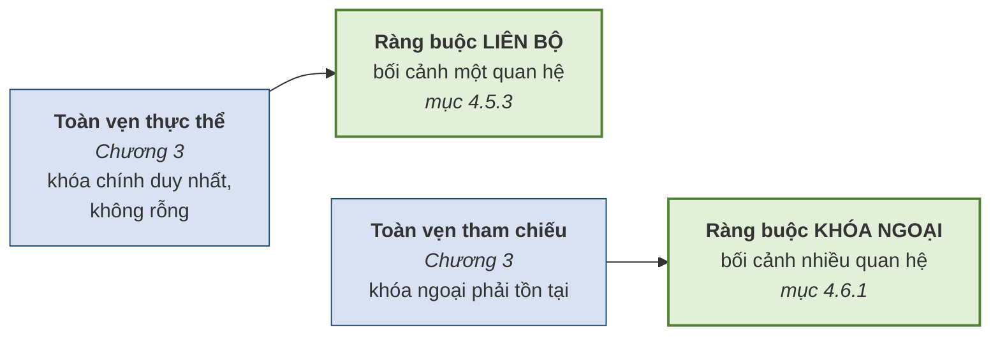
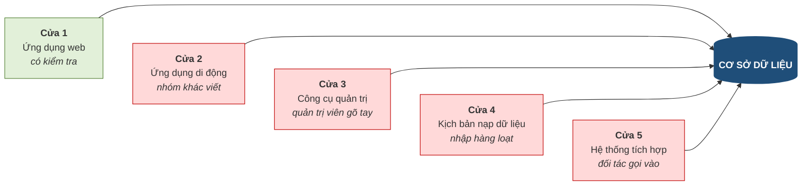
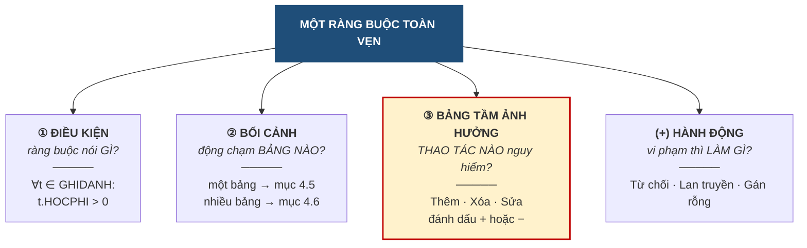
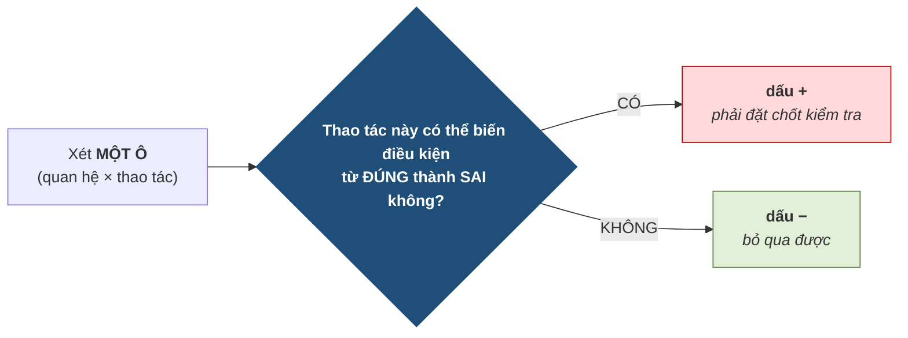
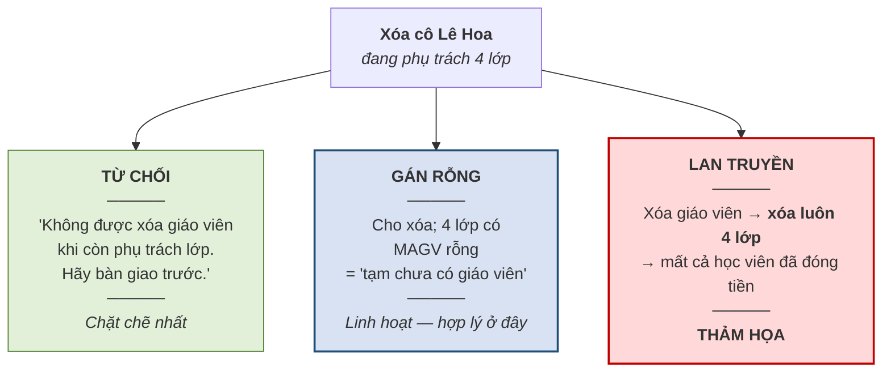
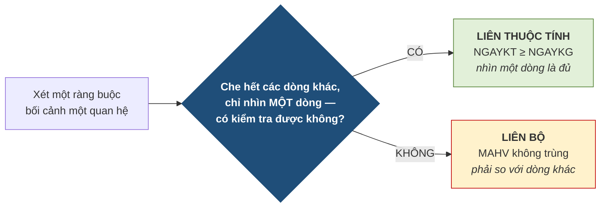
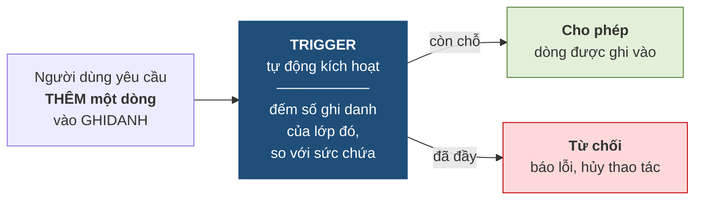
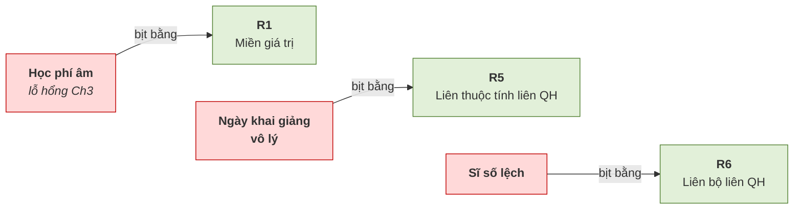
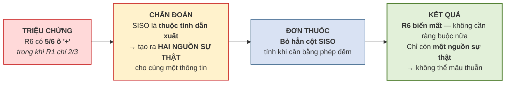

# CHƯƠNG 4. RÀNG BUỘC TOÀN VẸN

> **Ghi chú biên soạn (v4 — bản giáo trình).** Bản này viết lại Chương 4 theo **văn phong giáo trình**, thống nhất với các chương trước. Hệ thống mục **4.1–4.7 khớp tuyệt đối với Mục 8 của đề cương chi tiết** *(8 tiết · CLO2, CLO3)*. So với bản trước, chương này **bổ sung bốn nội dung**: ① **cú pháp khai báo ràng buộc** — `CHECK`, `NOT NULL`, `UNIQUE`, `FOREIGN KEY … ON DELETE` — trình bày ở **mức đọc hiểu**, giảng viên minh họa, không yêu cầu người học viết SQL *(đề cương mục 4.4)*; ② **giới thiệu trigger** bằng mã giả *(đề cương mục 4.6)*; ③ **lập bảng tầm ảnh hưởng** nâng từ tiểu mục lên **mục riêng 1,5 tiết** vì đây là kỹ năng bị Rubric 3 chấm trực tiếp; ④ **ba tầng đặt ràng buộc** để làm rõ lập luận *"vì sao chọn tầng cơ sở dữ liệu"*. Số hình: **10**. Hoạt động tổ chức lớp học ở **Phụ lục 4A**. Khung ràng buộc *(điều kiện – bối cảnh – bảng tầm ảnh hưởng)* theo [1] Tô Văn Nam (2005) và [2] Vũ Đức Thi (1997); đối chiếu [3] Coronel & Morris, Ch.3.

---

## MỤC TIÊU CHƯƠNG

Sau khi học xong chương này, người học có thể:

1. **Trình bày** khái niệm ràng buộc toàn vẹn và **giải thích** vì sao phải đặt ràng buộc ở **tầng cơ sở dữ liệu** chứ không chỉ ở tầng ứng dụng *(CLO2)*.
2. **Mô tả đầy đủ** một ràng buộc toàn vẹn qua **ba yếu tố**: điều kiện, bối cảnh, bảng tầm ảnh hưởng *(CLO2)*.
3. ⭐ **Lập được bảng tầm ảnh hưởng** cho một ràng buộc bất kỳ, bằng cách áp quy tắc *"đúng thành sai"* cho từng ô *(CLO3)*.
4. **Lựa chọn** hành động xử lý khi vi phạm — từ chối, lan truyền, gán rỗng — dựa trên **lý do nghiệp vụ** *(CLO3)*.
5. **Đọc hiểu** các câu lệnh khai báo ràng buộc trong một hệ quản trị thực tế và **đối chiếu** chúng với ràng buộc đã phát biểu bằng lời *(CLO2)*.
6. **Phân loại** một ràng buộc vào đúng một trong **sáu loại** theo bối cảnh và phạm vi tác động *(CLO2, CLO3)*.
7. **Phát hiện đầy đủ** tập ràng buộc toàn vẹn của một bài toán thực tế, không bỏ sót loại nào *(CLO3)*.
8. **Nhận diện "cờ đỏ thiết kế"** — hiểu rằng một ràng buộc quá khó thực thi thường là dấu hiệu thiết kế cần cải thiện *(CLO3)*.

---

## DẪN NHẬP

Cuối Chương 3, lược đồ quan hệ của Trung tâm Anh ngữ ABC trông đã hoàn hảo: bảy bảng, khóa chính đầy đủ, khóa ngoại nối đúng chỗ, hai ràng buộc toàn vẹn được tôn trọng. Một hệ quản trị cơ sở dữ liệu nhận lược đồ này sẽ tạo ra bảy bảng mà không phàn nàn gì.

Nhưng hãy thử nhập vào đó ba dòng dữ liệu sau:

- Một lượt ghi danh với `HOCPHI = -500000` — **học phí âm năm trăm nghìn đồng**.
- Một lớp có ngày khai giảng là năm 1990, trong khi trung tâm mới thành lập năm 2020.
- Một lớp sức chứa 25 người nhưng có 40 học viên ghi danh.

Cả ba dòng đều được hệ quản trị **chấp nhận, không một lời cảnh báo**. Khóa chính không rỗng và không trùng; khóa ngoại đều trỏ tới dòng có thật. Hai ràng buộc của Chương 3 đã được thỏa mãn trọn vẹn — và cả ba dữ liệu vô lý vẫn lọt vào.

Nguyên nhân nằm ở chỗ hai ràng buộc ấy chỉ bảo vệ **cấu trúc**. Chúng biết một khóa ngoại phải trỏ tới đâu, nhưng **không biết gì về nghiệp vụ của trung tâm**. Chúng không biết học phí phải dương, không biết trung tâm thành lập năm nào, không biết mỗi lớp chứa được bao nhiêu người.

Chương 4 lấp đúng khoảng trống đó. Nội dung của chương là xây dựng một **bộ sáu loại ràng buộc** đủ để diễn đạt mọi quy tắc nghiệp vụ, cùng một **quy trình có kỷ luật** để phát hiện chúng mà không bỏ sót.

Chương này có một đặc điểm riêng đáng lưu ý. Ba chương trước dạy cách **xây dựng** — xây mô hình, xây bảng. Chương 4 dạy cách **bảo vệ** cái đã xây. Đây là công việc mà người mới học thường xem nhẹ, vì nó không tạo ra thứ gì nhìn thấy được. Nhưng trong thực tế nghề nghiệp, phần lớn sự cố dữ liệu nghiêm trọng đều bắt nguồn từ những ràng buộc **lẽ ra phải có mà không ai nghĩ tới**.

Chương cũng chứa một ý tưởng bất ngờ, xuất hiện ở mục 4.7.5 và dẫn thẳng sang Chương 5: **khi một ràng buộc trở nên quá khó thực thi, đó thường không phải lỗi của công cụ mà là lời tố cáo về thiết kế.** Người thiết kế có kinh nghiệm, khi gặp ràng buộc khó, không đi tìm công cụ mạnh hơn mà dừng lại xem thiết kế của mình có vấn đề gì.

---

## 4.1. Khái niệm ràng buộc toàn vẹn

*(1,0 tiết)*

### 4.1.1. Ba lỗ hổng còn lại từ Chương 3

Mục 3.3.4 đã liệt kê ba loại lỗi mà hai ràng buộc toàn vẹn thực thể và tham chiếu không phát hiện được. Chương này nhận lại đúng ba món nợ ấy.

**Bảng 4.1. Ba lỗ hổng của một cơ sở dữ liệu "hoàn hảo"**

| Dữ liệu vô lý | Vì sao lọt qua | Cần loại ràng buộc nào |
|---|---|---|
| `HOCPHI = -500000` | Không liên quan tới khóa nào | Ràng buộc **miền giá trị** |
| Ngày khai giảng trước ngày thành lập khóa học | Hai giá trị nằm ở **hai bảng khác nhau** | Ràng buộc **liên thuộc tính liên quan hệ** |
| Lớp 25 chỗ nhận 40 học viên | Phải **đếm** mới biết, nhìn từng dòng không thấy | Ràng buộc **liên bộ liên quan hệ** |

Ba dòng trên cũng chính là ba mức độ khó tăng dần mà chương sẽ đi qua: từ ràng buộc chỉ nhìn **một ô**, tới ràng buộc phải nhìn **hai bảng**, tới ràng buộc phải **đếm trên toàn bảng**.

### 4.1.2. Ràng buộc toàn vẹn là gì

> **Định nghĩa 4.1.** **Ràng buộc toàn vẹn** *(integrity constraint)* là một **điều kiện mà dữ liệu trong cơ sở dữ liệu phải luôn luôn thỏa mãn**, ở mọi thời điểm, nhằm phản ánh đúng các quy tắc nghiệp vụ của tổ chức.

Ba chữ đáng chú ý trong định nghĩa là **"luôn luôn"**. Một ràng buộc không phải là điều kiện chỉ đúng lúc nhập liệu rồi thôi; nó phải đúng **trước và sau mọi thao tác**, trong suốt vòng đời hệ thống.

Ràng buộc toàn vẹn có nguồn gốc trực tiếp từ **quy tắc nghiệp vụ** đã học ở mục 2.1.2. Điều này tạo nên một mạch xuyên suốt ba chương:

| Chương | Quy tắc nghiệp vụ trở thành |
|---|---|
| Chương 2 | **Thành phần của lược đồ ER** — thực thể, liên kết, lực lượng |
| Chương 3 | **Cấu trúc bảng** — khóa chính, khóa ngoại |
| **Chương 4** | **Ràng buộc toàn vẹn** — phần quy tắc mà hai chương trên **chưa diễn đạt được** |

Nói cách khác, ràng buộc toàn vẹn là nơi chứa **phần còn lại** của nghiệp vụ — những quy tắc không thể hiện được bằng hình vẽ hay bằng cấu trúc bảng.

### 4.1.3. Hai ràng buộc của Chương 3 chỉ là trường hợp riêng

Một cách nhìn giúp hệ thống hóa: hai ràng buộc đã học ở Chương 3 **không phải là loại riêng biệt** — chúng chỉ là hai trường hợp cụ thể của bộ sáu loại sắp trình bày.

**Hình 4.1. Hai ràng buộc của Chương 3 chỉ là trường hợp riêng**



Cách nhìn này có giá trị thực tiễn: người học không phải nhớ hai hệ thống khái niệm song song, mà chỉ cần nhớ **một bộ sáu loại**, trong đó hai loại đã quen từ chương trước.

### 4.1.4. Ba tầng có thể đặt ràng buộc — vì sao chọn tầng cơ sở dữ liệu

Một quy tắc nghiệp vụ có thể được kiểm tra ở ba nơi khác nhau.

**Bảng 4.2. Ba tầng có thể đặt ràng buộc**

| Tầng | Cách làm | Ưu điểm | Nhược điểm |
|---|---|---|---|
| **Giao diện** | Kiểm tra ngay trên biểu mẫu trước khi gửi đi | Phản hồi tức thì, trải nghiệm tốt | **Rất dễ vượt qua** — chỉ cần gửi dữ liệu thẳng, không qua giao diện |
| **Ứng dụng** | Kiểm tra trong mã nguồn phần mềm | Diễn đạt được logic phức tạp | **Chỉ bảo vệ được đường đi qua ứng dụng đó** |
| **Cơ sở dữ liệu** | Khai báo ràng buộc cho hệ quản trị | **Bảo vệ mọi đường vào**, không thể vượt qua | Khó diễn đạt một vài loại logic rất phức tạp |

Điểm mấu chốt nằm ở dòng thứ hai. Người mới học thường nghĩ *"cứ để phần mềm ứng dụng kiểm tra là được"* — và đây là một trong những sai lầm tốn kém nhất trong nghề.

**Hình 4.2. Năm cửa vào cơ sở dữ liệu — ứng dụng chỉ khóa được một**



Trong hình, chỉ **cửa 1** có kiểm tra vì đó là ứng dụng đã cài logic. Bốn cửa còn lại **hoàn toàn mở**. Và bốn cửa ấy đều là những đường vào rất thật trong thực tế: ứng dụng di động do nhóm khác viết và có thể quên một điều kiện, quản trị viên sửa dữ liệu trực tiếp lúc cần gấp, kịch bản nạp dữ liệu hàng loạt bỏ qua mọi tầng ứng dụng, và hệ thống của đối tác gọi thẳng vào.

> **Chú ý — nguyên tắc nghề nghiệp.** Ràng buộc đặt ở tầng ứng dụng có tác dụng **cải thiện trải nghiệm**; ràng buộc đặt ở tầng cơ sở dữ liệu mới có tác dụng **bảo đảm đúng đắn**. Hai việc này **không thay thế nhau**. Cách làm đúng là đặt ở **cả hai**: tầng giao diện báo lỗi sớm để người dùng dễ chịu, tầng cơ sở dữ liệu chốt chặn cuối cùng để không gì lọt qua.
>
> Có một câu tổng kết đáng nhớ: **dữ liệu sống lâu hơn ứng dụng**. Một cơ sở dữ liệu nghiệp vụ thường tồn tại mười đến hai mươi năm, trong khi các ứng dụng chạy trên nó được viết lại nhiều lần. Ràng buộc gắn với dữ liệu thì sống cùng dữ liệu; ràng buộc gắn với ứng dụng thì chết theo ứng dụng.

---

## 4.2. Ba yếu tố của một ràng buộc toàn vẹn

*(1,5 tiết)*

### 4.2.1. Ba yếu tố

Phát biểu *"học phí phải dương"* nghe thì rõ, nhưng chưa đủ để cài đặt. Muốn mô tả **đầy đủ** một ràng buộc, phải nêu đủ ba yếu tố, cộng thêm một yếu tố về xử lý.

**Hình 4.3. Ba yếu tố của một ràng buộc toàn vẹn**



Yếu tố thứ ba được tô đậm vì nó là **kỹ năng chữ ký của chương này**, và được dành hẳn mục 4.3.

### 4.2.2. Điều kiện — phát biểu hình thức

Điều kiện nên được viết bằng **ký hiệu logic** chứ không chỉ bằng lời, vì lời văn dễ mơ hồ còn ký hiệu thì không.

> **Ví dụ 4.1.** Ba cách phát biểu cùng một ràng buộc, từ mơ hồ tới chính xác:
>
> **(a)** *"Học phí phải hợp lý."* — Vô dụng. Thế nào là hợp lý?
>
> **(b)** *"Học phí phải lớn hơn 0."* — Đã dùng được, nhưng chưa nói rõ áp cho bảng nào.
>
> **(c)** `∀t ∈ GHIDANH : t.HOCPHI > 0` — **Chính xác**. Đọc là *"với mọi bộ `t` thuộc quan hệ `GHIDANH`, giá trị `HOCPHI` của `t` phải lớn hơn 0"*.

Ba ký hiệu cần nắm: **`∀`** đọc là *"với mọi"*, **`∃`** đọc là *"tồn tại"*, và **`⇒`** đọc là *"thì"* hoặc *"kéo theo"*.

> **Ví dụ 4.2.** Ràng buộc *"lớp không được khai giảng trước ngày khóa học được thành lập"* viết hình thức là:
>
> `∀l ∈ LOP, ∀k ∈ KHOAHOC : (l.MAKH = k.MAKH) ⇒ (l.NGAYKG ≥ k.NGAYTL)`
>
> Đọc: *"với mọi lớp `l` và mọi khóa học `k`, nếu lớp `l` thuộc khóa học `k` thì ngày khai giảng của `l` phải không sớm hơn ngày thành lập của `k`"*.

Dạng `(điều kiện) ⇒ (kết luận)` xuất hiện rất nhiều, vì phần lớn ràng buộc liên quan hệ đều có dạng *"nếu hai dòng khớp nhau ở khóa thì phải thỏa mãn thêm điều gì đó"*.

### 4.2.3. Bối cảnh — quyết định loại ràng buộc

> **Định nghĩa 4.2.** **Bối cảnh** *(context)* của một ràng buộc là **tập các quan hệ mà điều kiện của nó nhắc tới**.

Bối cảnh là yếu tố quyết định nhất, vì xác định xong bối cảnh là biết ngay ràng buộc thuộc nhóm nào: bối cảnh **một quan hệ** thì tra mục 4.5, bối cảnh **nhiều quan hệ** thì tra mục 4.6.

Cách xác định rất máy móc: đọc biểu thức điều kiện và **liệt kê mọi tên quan hệ xuất hiện trong đó**. Ở Ví dụ 4.1 chỉ có `GHIDANH` nên bối cảnh gồm một quan hệ. Ở Ví dụ 4.2 có cả `LOP` lẫn `KHOAHOC` nên bối cảnh gồm hai quan hệ.

### 4.2.4. Sáu loại ràng buộc toàn vẹn

Kết hợp **bối cảnh** *(một hay nhiều quan hệ)* với **phạm vi tác động** *(trong một ô, giữa các ô cùng dòng, hay giữa nhiều dòng)*, ta được bộ sáu loại đầy đủ.

**Bảng 4.3. Sáu loại ràng buộc toàn vẹn**

| Bối cảnh | Phạm vi | Tên loại | Ví dụ tại ABC |
|---|---|---|---|
| **Một** quan hệ | Một ô | **Miền giá trị** | `HOCPHI > 0` |
| **Một** quan hệ | Nhiều ô **cùng dòng** | **Liên thuộc tính** | `NGAYKT ≥ NGAYKG` |
| **Một** quan hệ | Nhiều **dòng** | **Liên bộ** | Không hai học viên trùng mã |
| **Nhiều** quan hệ | Giá trị khóa | **Khóa ngoại** | `GHIDANH.MAHV` phải tồn tại |
| **Nhiều** quan hệ | Nhiều ô ở **các bảng khác nhau** | **Liên thuộc tính liên quan hệ** | `LOP.NGAYKG ≥ KHOAHOC.NGAYTL` |
| **Nhiều** quan hệ | Nhiều **dòng** ở các bảng khác nhau | **Liên bộ liên quan hệ** | `LOP.SISO` bằng số dòng `GHIDANH` tương ứng |

Bảng này là **công cụ làm bài quan trọng nhất của chương**. Khi phải phát hiện ràng buộc cho một bài toán mới, người học đi lần lượt qua sáu dòng và tự hỏi *"bài này có ràng buộc loại đó không"* — cách làm ấy bảo đảm không bỏ sót loại nào. Mục 4.7.2 sẽ chuyển sáu dòng này thành sáu câu hỏi cụ thể.

---

## 4.3. Lập bảng tầm ảnh hưởng

*(1,5 tiết)*

### 4.3.1. Bảng tầm ảnh hưởng dùng để làm gì

> **Định nghĩa 4.3.** **Bảng tầm ảnh hưởng** của một ràng buộc là bảng liệt kê, với **mỗi quan hệ trong bối cảnh** và **mỗi thao tác** thêm, xóa, sửa, xem thao tác đó **có khả năng làm vi phạm** ràng buộc hay không.
>
> Ký hiệu **`+`** nghĩa là **có thể gây vi phạm** — phải đặt chốt kiểm tra. Ký hiệu **`−`** nghĩa là **không thể gây vi phạm** — bỏ qua được. Với thao tác **sửa**, phải ghi rõ **thuộc tính** nào liên quan.

Câu hỏi tự nhiên là: **lập bảng này để làm gì?** Câu trả lời rất thực dụng: **để biết đặt chốt kiểm tra ở đâu.**

Mỗi lần kiểm tra một ràng buộc đều tốn thời gian xử lý. Nếu kiểm tra mọi ràng buộc ở mọi thao tác, hệ thống sẽ chậm tới mức không dùng được. Bảng tầm ảnh hưởng chỉ đích danh những chỗ **thật sự cần kiểm** — thường chỉ là một phần nhỏ trong tổng số ô.

### 4.3.2. Quy tắc vàng — "đúng thành sai"

Toàn bộ kỹ năng lập bảng tầm ảnh hưởng gói gọn trong **một câu hỏi duy nhất**, áp cho từng ô.

**Hình 4.4. Quy tắc vàng — một câu hỏi cho mọi ô**



Điểm cần nhấn mạnh: **giả thiết ngầm là điều kiện đang đúng trước thao tác**. Câu hỏi không phải *"thao tác này có làm dữ liệu sai không"* mà là *"nếu dữ liệu đang đúng, thao tác này có thể phá vỡ nó không"*.

> **Chú ý.** **Đừng học thuộc kết quả** của các bảng tầm ảnh hưởng mẫu. Học thuộc sẽ sai ngay khi gặp bài mới, vì mỗi ràng buộc có cấu trúc khác nhau. Chỉ cần nhớ **một câu hỏi** và áp nó cho từng ô — cách này luôn đúng.

### 4.3.3. Ví dụ mẫu — ràng buộc khóa ngoại

Xét ràng buộc: *"mọi `MAHV` trong `GHIDANH` phải tồn tại trong `HOCVIEN`"*. Bối cảnh gồm hai quan hệ, nên bảng có **hai dòng và ba cột**, tức sáu ô cần xét.

**Bảng 4.4. Suy luận từng ô — ràng buộc khóa ngoại**

| Ô cần xét | Suy luận: *"có thể biến đúng thành sai không?"* | Kết quả |
|---|---|:--:|
| **Thêm** vào `GHIDANH` | Nhập một dòng với `MAHV = 'HV99'` chưa hề tồn tại → **trỏ vào hư vô** | **+** |
| **Xóa** khỏi `GHIDANH` | Bớt một dòng nghĩa là bớt một thứ cần kiểm → càng an toàn hơn | **−** |
| **Sửa** `MAHV` ở `GHIDANH` | Đổi sang một mã không tồn tại → **trỏ vào hư vô** | **+** *(MAHV)* |
| **Thêm** vào `HOCVIEN` | Có thêm học viên mới; không tham chiếu nào đang có bị ảnh hưởng | **−** |
| **Xóa** khỏi `HOCVIEN` | Xóa HV01 trong khi `GHIDANH` **còn dòng trỏ tới** → tham chiếu treo | **+** |
| **Sửa** `MAHV` ở `HOCVIEN` | Đổi khóa chính → mọi dòng con đang trỏ tới **bị lệch** | **+** *(MAHV)* |

**Bảng tầm ảnh hưởng thu được:**

| Quan hệ | Thêm | Xóa | Sửa |
|---|:--:|:--:|:--:|
| `HOCVIEN` *(cha)* | − | **+** | **+** *(MAHV)* |
| `GHIDANH` *(con)* | **+** | − | **+** *(MAHV)* |

### 4.3.4. Câu thần chú "Thêm ở con, Xóa ở cha"

Bảng vừa lập có một cấu trúc **đối xứng chéo** rất dễ nhớ, và cấu trúc ấy đúng cho **mọi** ràng buộc khóa ngoại.

**Hình 4.5. Câu thần chú cho mọi ràng buộc khóa ngoại**


Lý do đằng sau câu thần chú rất trực quan. Thêm vào bảng con là **tạo ra một mũi tên mới** — mũi tên ấy có thể trỏ vào chỗ trống. Xóa ở bảng cha là **rút đi cái đích** — các mũi tên đang trỏ tới bỗng treo lơ lửng. Hai thao tác còn lại thì ngược lại: thêm vào cha là *tạo thêm đích*, xóa ở con là *bớt mũi tên* — cả hai đều chỉ làm tình hình an toàn hơn.

### 4.3.5. Ba lỗi thường gặp khi lập bảng

**Lỗi thứ nhất — đánh dấu `+` cho tất cả các ô "cho chắc ăn".** Đây là lỗi phổ biến nhất và cũng tai hại nhất, vì ba lý do. Về **mục đích**, bảng này sinh ra để *chỉ đúng chỗ* cần kiểm; đánh `+` hết thì bảng thành vô nghĩa. Về **hiệu năng**, mỗi dấu `+` là một lần kiểm tra thật sự tốn tài nguyên. Về **chuyên môn**, đánh `+` tràn lan chứng tỏ người làm **chưa hiểu** ràng buộc, và người chấm nhận ra ngay.

**Lỗi thứ hai — quên ghi thuộc tính ở cột "sửa".** Ghi `+` suông ở cột sửa là chưa đủ, vì sửa `HOTEN` thì vô hại còn sửa `MAHV` thì nguy hiểm. Phải ghi rõ `+ (MAHV)`.

**Lỗi thứ ba — quên rằng bối cảnh có bao nhiêu quan hệ thì bảng có bấy nhiêu dòng.** Ràng buộc bối cảnh hai quan hệ phải có **hai dòng**; chỉ lập một dòng là đã bỏ sót một nửa số ô cần xét.

---

## 4.4. Hành động khi vi phạm và cú pháp khai báo

*(1,0 tiết)*

### 4.4.1. Ba hành động

Phát hiện vi phạm rồi thì phải làm gì? Có ba lựa chọn.

**Bảng 4.5. Ba hành động khi phát hiện vi phạm**

| Hành động | Ý nghĩa | Ví dụ tại ABC |
|---|---|---|
| **Từ chối** *(RESTRICT / NO ACTION)* | Chặn thao tác lại và báo lỗi | Không cho xóa học viên **còn ghi danh** |
| **Lan truyền** *(CASCADE)* | Thực hiện dây chuyền theo quy tắc đã định | Xóa học viên → **xóa luôn** các số điện thoại của người đó |
| **Gán rỗng** *(SET NULL)* | Đặt khóa ngoại về giá trị rỗng | Xóa giáo viên → `LOP.MAGV` thành rỗng |

### 4.4.2. Chọn hành động theo nghiệp vụ

> **Chú ý.** Việc chọn hành động nào **do nghiệp vụ quyết định, không phải do kỹ thuật**. Đây là điểm quan trọng nhất của mục này.

**Hình 4.6. Cùng thao tác "xóa giáo viên" — ba lựa chọn, ba hệ quả**



Nguyên tắc rút ra: **chỉ dùng lan truyền khi bản ghi con thật sự vô nghĩa nếu thiếu bản ghi cha.**

| Trường hợp | Dùng lan truyền? | Lý do |
|---|:--:|---|
| Xóa học viên → xóa số điện thoại | **Hợp lý** | Số điện thoại vô nghĩa nếu không còn học viên — nó là **thực thể yếu** *(mục 2.6.3)* |
| Xóa giáo viên → xóa lớp | **Thảm họa** | Lớp học **tồn tại độc lập**; cô này nghỉ thì cô khác dạy |

> **Chú ý.** Dùng sai lan truyền là cách nhanh nhất để **mất dữ liệu hàng loạt**, vì nó xóa **trong im lặng** — hệ thống làm đúng điều được yêu cầu, không có lỗi nào để báo. Khi đi làm, nếu ai hỏi *"nên dùng CASCADE hay RESTRICT?"*, câu trả lời đúng không phải là một quy tắc kỹ thuật mà là một câu hỏi ngược: ***"dữ liệu con còn ý nghĩa độc lập không?"***

### 4.4.3. Cú pháp khai báo ràng buộc — mức đọc hiểu

Mục này cho thấy các ràng buộc vừa học **trông như thế nào** khi được khai báo với một hệ quản trị thật. Người học chỉ cần **đọc hiểu**; kỹ năng viết thuộc học phần *Hệ quản trị cơ sở dữ liệu*.

**Bảng 4.6. Bốn cơ chế khai báo ràng buộc**

| Từ khóa | Diễn đạt ràng buộc loại nào | Tương ứng mục |
|---|---|---|
| `NOT NULL` | Cấm để trống một cột | Toàn vẹn thực thể · miền giá trị |
| `UNIQUE` | Cấm trùng giá trị giữa các dòng | **Liên bộ** — mục 4.5.3 |
| `CHECK` | Điều kiện trên một hoặc nhiều cột **cùng dòng** | **Miền giá trị** và **liên thuộc tính** — mục 4.5.1, 4.5.2 |
| `FOREIGN KEY … REFERENCES` | Toàn vẹn tham chiếu, kèm hành động khi vi phạm | **Khóa ngoại** — mục 4.6.1 |

> **Ví dụ 4.3 — khai báo bảng `GHIDANH` của Trung tâm ABC.** *(Giảng viên minh họa trên lớp.)*
>
> ```sql
> CREATE TABLE GHIDANH (
>     MAHV          VARCHAR(10)  NOT NULL,
>     MALOP         VARCHAR(10)  NOT NULL,
>     NGAYGHIDANH   DATE         NOT NULL,
>     HOCPHI        INT          NOT NULL,
>
>     PRIMARY KEY (MAHV, MALOP),
>
>     CONSTRAINT ck_hocphi  CHECK (HOCPHI > 0),
>
>     CONSTRAINT fk_ghidanh_hocvien
>         FOREIGN KEY (MAHV) REFERENCES HOCVIEN(MAHV)
>         ON DELETE NO ACTION,
>
>     CONSTRAINT fk_ghidanh_lop
>         FOREIGN KEY (MALOP) REFERENCES LOP(MALOP)
>         ON DELETE CASCADE
> );
> ```
>
> **Đọc từng phần:**
>
> | Dòng khai báo | Diễn đạt điều gì |
> |---|---|
> | `MAHV VARCHAR(10) NOT NULL` | Miền giá trị: chuỗi tối đa 10 ký tự, **không được rỗng** |
> | `PRIMARY KEY (MAHV, MALOP)` | **Khóa chính phức hợp** — đúng như đã ánh xạ ở mục 3.4.4 |
> | `CHECK (HOCPHI > 0)` | Chính là ràng buộc **R1** — học phí phải dương |
> | `FOREIGN KEY (MAHV) … ON DELETE NO ACTION` | Toàn vẹn tham chiếu, và **từ chối** xóa học viên còn ghi danh |
> | `FOREIGN KEY (MALOP) … ON DELETE CASCADE` | Xóa lớp thì **xóa luôn** các lượt ghi danh của lớp đó |

> **Chú ý — hai hành động khác nhau trong cùng một bảng.** Trong ví dụ trên, khóa ngoại trỏ về `HOCVIEN` dùng **từ chối**, còn khóa ngoại trỏ về `LOP` dùng **lan truyền**. Không hề mâu thuẫn: hồ sơ ghi danh của một học viên là dữ liệu cần bảo toàn kể cả khi học viên rời trung tâm, nhưng khi một lớp bị hủy thì các lượt ghi danh vào lớp đó không còn ý nghĩa. **Nghiệp vụ khác nhau nên hành động khác nhau** — đúng nguyên tắc ở mục 4.4.2.

Một điều cần biết về **giới hạn của khai báo**: cơ chế `CHECK` chỉ kiểm tra được trong phạm vi **một dòng**. Nó không diễn đạt được ràng buộc phải **đếm trên nhiều dòng** hay phải **so sánh với bảng khác** — tức hai loại khó nhất trong Bảng 4.3. Đó chính là lý do tồn tại của trigger, trình bày ở mục 4.6.4.

### 4.4.4. Từ phát hiện sang ngăn chặn

Mục 3.7.3 của Chương 3 đã dạy một kỹ thuật **phát hiện** khóa ngoại mồ côi bằng phép kết ngoài. Mục này bổ sung nửa còn lại: **ngăn chặn**.

**Bảng 4.7. Hai cách đối phó với lỗi toàn vẹn tham chiếu**

| | Phát hiện *(mục 3.7.3)* | Ngăn chặn *(mục 4.4.3)* |
|---|---|---|
| **Công cụ** | Kết ngoài trái kèm phép chọn | Khai báo `FOREIGN KEY` |
| **Thời điểm** | **Sau khi** lỗi đã xảy ra | **Ngay lúc** thao tác được thực hiện |
| **Kết quả** | Danh sách các dòng lỗi | Thao tác bị chặn, dữ liệu không bao giờ sai |
| **Dùng khi nào** | Cơ sở dữ liệu **cũ** chưa khai báo ràng buộc; sau khi nạp dữ liệu hàng loạt | Hệ thống **mới**, thiết kế từ đầu |

Trong thực tế cả hai đều cần. Ngăn chặn là biện pháp chính. Nhưng khi tiếp quản một hệ thống cũ, việc đầu tiên phải làm là **dùng kỹ thuật phát hiện để dọn sạch dữ liệu bẩn đã có** — vì hệ quản trị sẽ **từ chối** khai báo khóa ngoại nếu dữ liệu hiện tại đang vi phạm.

---

## 4.5. Ràng buộc toàn vẹn bối cảnh một quan hệ

*(1,0 tiết)*

Ba loại đầu tiên trong Bảng 4.3 có bối cảnh chỉ gồm **một quan hệ**.

### 4.5.1. Ràng buộc miền giá trị

> **Định nghĩa 4.4.** **Ràng buộc miền giá trị** *(domain constraint)* giới hạn **tập giá trị hợp lệ của một thuộc tính**, xét độc lập với mọi thuộc tính khác và mọi bộ khác.

> **Ví dụ 4.4.** Tại Trung tâm ABC:
>
> - `∀t ∈ GHIDANH : t.HOCPHI > 0` — học phí phải dương.
> - `∀t ∈ LOP : 5 ≤ t.SUCCHUA ≤ 40` — sức chứa nằm trong khoảng hợp lệ.
> - `∀t ∈ GIAOVIEN : t.BANGCAP ∈ {Cử nhân, Thạc sĩ, Tiến sĩ}` — chỉ nhận ba giá trị.

Đây là loại **dễ phát hiện và dễ cài đặt nhất** — khai báo bằng `CHECK` hoặc bằng chính kiểu dữ liệu. Bảng tầm ảnh hưởng của nó cũng đơn giản: chỉ **thêm** và **sửa** là nguy hiểm, còn **xóa** thì không bao giờ.

### 4.5.2. Ràng buộc liên thuộc tính

> **Định nghĩa 4.5.** **Ràng buộc liên thuộc tính** ràng buộc **quan hệ giữa nhiều thuộc tính trong cùng một bộ**.

> **Ví dụ 4.5.** `∀t ∈ LOP : t.NGAYKT ≥ t.NGAYKG` — ngày kết thúc không được sớm hơn ngày khai giảng. Cả hai giá trị đều nằm **trên cùng một dòng**.

Vẫn khai báo được bằng `CHECK`, vì `CHECK` làm việc trong phạm vi một dòng.

### 4.5.3. Ràng buộc liên bộ

> **Định nghĩa 4.6.** **Ràng buộc liên bộ** ràng buộc **quan hệ giữa nhiều bộ khác nhau** trong cùng một quan hệ.

> **Ví dụ 4.6.** `∀t₁, t₂ ∈ HOCVIEN, t₁ ≠ t₂ : t₁.MAHV ≠ t₂.MAHV` — không hai học viên nào trùng mã. Đây chính là **toàn vẹn thực thể** của Chương 3, nhìn dưới dạng tổng quát. Khai báo bằng `PRIMARY KEY` hoặc `UNIQUE`.

Loại này khó hơn hai loại trên, vì để kiểm tra một dòng thì hệ thống phải **so nó với các dòng khác** — không thể chỉ nhìn một dòng mà kết luận.

### 4.5.4. Phân biệt liên thuộc tính và liên bộ

Đây là chỗ nhầm lẫn nhiều nhất của mục 4.5, và có một phép thử rất dứt khoát.

**Hình 4.7. Phép thử "che các dòng khác đi"**



Phép thử này cũng giải thích luôn **vì sao độ khó cài đặt tăng dần**. Ràng buộc liên thuộc tính chỉ cần nhìn một dòng nên hệ quản trị kiểm tra tức thì bằng `CHECK`. Ràng buộc liên bộ phải quét cả bảng, nên hệ quản trị phải dựng sẵn **chỉ mục duy nhất** để kiểm cho nhanh.

---

## 4.6. Ràng buộc toàn vẹn bối cảnh nhiều quan hệ

*(1,0 tiết)*

### 4.6.1. Ràng buộc khóa ngoại

> **Định nghĩa 4.7.** **Ràng buộc khóa ngoại** yêu cầu mỗi giá trị khóa ngoại **hoặc rỗng, hoặc phải khớp với một giá trị khóa chính đang tồn tại** ở quan hệ được tham chiếu.

Đây chính là **toàn vẹn tham chiếu** của Chương 3, và cũng là loại ràng buộc liên quan hệ **duy nhất được hệ quản trị hỗ trợ khai báo trực tiếp**. Bảng tầm ảnh hưởng của nó luôn theo mẫu *"thêm ở con, xóa ở cha"* đã lập ở mục 4.3.4.

### 4.6.2. Ràng buộc liên thuộc tính liên quan hệ

> **Định nghĩa 4.8.** Loại này ràng buộc **quan hệ giữa các thuộc tính nằm ở những quan hệ khác nhau**.

> **Ví dụ 4.7.** `∀l ∈ LOP, ∀k ∈ KHOAHOC : (l.MAKH = k.MAKH) ⇒ (l.NGAYKG ≥ k.NGAYTL)` — lớp không được khai giảng trước ngày khóa học được thành lập.

Loại này **không khai báo được bằng `CHECK`**, vì `CHECK` chỉ nhìn trong phạm vi một dòng của một bảng. Muốn thực thi phải dùng trigger.

Bảng tầm ảnh hưởng có hai dòng. Với `LOP`: thêm, và sửa `NGAYKG` hoặc `MAKH` đều nguy hiểm; xóa thì không. Với `KHOAHOC`: sửa `NGAYTL` nguy hiểm *(có thể đẩy ngày thành lập ra sau ngày khai giảng của lớp đã có)*; thêm và xóa thì không.

### 4.6.3. Ràng buộc liên bộ liên quan hệ — loại khó nhất

> **Định nghĩa 4.9.** Loại này ràng buộc **quan hệ giữa nhiều bộ nằm ở những quan hệ khác nhau**, thường liên quan tới phép **đếm** hoặc **tính tổng**.

> **Ví dụ 4.8.** `∀l ∈ LOP : l.SISO = |{g ∈ GHIDANH : g.MALOP = l.MALOP}|` — sĩ số ghi trong bảng `LOP` phải bằng số dòng ghi danh tương ứng trong `GHIDANH`.

Đây là loại **khó nhất trong sáu loại**, vì ba lý do cộng lại: phải nhìn **nhiều bảng**, phải nhìn **nhiều dòng**, và phải **tính toán** chứ không chỉ so sánh. Hệ quản trị không có cơ chế khai báo nào cho nó.

### 4.6.4. Trigger — công cụ cho ràng buộc mà khai báo không đủ

> **Định nghĩa 4.10.** **Trigger** *(bẫy sự kiện)* là một **đoạn chương trình được lưu ngay trong cơ sở dữ liệu**, tự động chạy mỗi khi một **sự kiện** xác định xảy ra — thêm, xóa hoặc sửa trên một bảng cụ thể.

**Hình 4.8. Trigger hoạt động thế nào**



Ý tưởng cốt lõi của trigger là: **nó nằm trong cơ sở dữ liệu, nên nó bảo vệ được cả năm cửa ở Hình 4.2**. Đây chính là điểm khác biệt so với việc viết cùng logic ấy trong mã nguồn ứng dụng.

> **Ví dụ 4.9 — mã giả cho trigger kiểm tra sức chứa lớp.**
>
> ```
> TRIGGER kiem_tra_suc_chua
>     KÍCH HOẠT: SAU KHI THÊM một dòng vào GHIDANH
>     THỰC HIỆN:
>         n  ← đếm số dòng trong GHIDANH có MALOP = MALOP của dòng vừa thêm
>         sc ← lấy SUCCHUA của lớp đó từ bảng LOP
>         NẾU n > sc THÌ
>             hủy thao tác và báo lỗi "Lớp đã đầy"
>         KẾT THÚC NẾU
> ```
>
> Bảng tầm ảnh hưởng ở mục 4.3 cho biết **phải viết bao nhiêu trigger**. Ràng buộc này có các ô `+` ở *thêm `GHIDANH`*, *sửa `MALOP` của `GHIDANH`*, và *sửa `SUCCHUA` của `LOP`* — nghĩa là cần **ba** điểm kiểm tra chứ không phải một. Đây là công dụng thực tế rõ ràng nhất của bảng tầm ảnh hưởng.

> **Chú ý — trigger là công cụ mạnh nhưng nguy hiểm.** Ba rủi ro cần biết. Thứ nhất, trigger **chạy ngầm**: người dùng thấy thao tác bị từ chối mà không biết vì sao, gây khó khi tìm lỗi. Thứ hai, trigger có thể **gọi dây chuyền** — trigger này kích hoạt trigger kia, rất khó lần theo. Thứ ba, trigger **làm chậm** mọi thao tác trên bảng mà nó canh giữ.
>
> Vì vậy nguyên tắc là: **ưu tiên khai báo, chỉ dùng trigger khi khai báo không diễn đạt được**. Và trước khi viết trigger, hãy tự hỏi câu ở mục 4.7.5 — *"có phải thiết kế của mình đang có vấn đề không?"*

---

## 4.7. Thực hành phát hiện ràng buộc toàn vẹn

*(1,0 tiết)*

### 4.7.1. Lược đồ Trung tâm ABC bổ sung

Để có đủ tình huống cho cả sáu loại, lược đồ Chương 3 được bổ sung vài thuộc tính:

```
GIAOVIEN  (MAGV, HOTEN_GV, BANGCAP)
KHOAHOC   (MAKH, TENKH, NGAYTL)                            ← thêm NGAYTL
HOCVIEN   (MAHV, HOTEN, NGAYSINH)
LOP       (MALOP, TENLOP, NGAYKG, NGAYKT, SUCCHUA, SISO,   ← thêm NGAYKT, SUCCHUA, SISO
           MAGV↗GIAOVIEN, MAKH↗KHOAHOC)
DIENTHOAI (MAHV↗HOCVIEN, SODT)
GHIDANH   (MAHV↗HOCVIEN, MALOP↗LOP, NGAYGHIDANH, HOCPHI)
TIENQUYET (MAKH_truoc↗KHOAHOC, MAKH_sau↗KHOAHOC)
```

### 4.7.2. Sáu câu hỏi để không bỏ sót

Bảng 4.3 được chuyển thành một **quy trình sáu câu hỏi**. Đi lần lượt qua sáu câu này thì không bỏ sót loại nào.

**Bảng 4.8. Sáu câu hỏi phát hiện ràng buộc**

| # | Câu hỏi | Nếu có thì đó là |
|:--:|---|---|
| ① | Có cột nào cần **giới hạn giá trị** không? | Miền giá trị |
| ② | Có **hai cột trong cùng một dòng** liên quan nhau không? | Liên thuộc tính |
| ③ | Có gì phải **duy nhất** không? | Liên bộ |
| ④ | Có **khóa ngoại** nào không? | Khóa ngoại |
| ⑤ | Có **cột ở hai bảng khác nhau** liên quan nhau không? | Liên thuộc tính liên quan hệ |
| ⑥ | Có phép **đếm** hoặc **tính tổng** nào không? | Liên bộ liên quan hệ |

Kinh nghiệm cho thấy người học hay bỏ sót câu ⑤ và ⑥, vì hai loại ấy **không lộ ra khi nhìn từng bảng riêng lẻ**. Muốn phát hiện chúng phải đặt các bảng cạnh nhau và hỏi *"có gì phải khớp giữa hai bảng này không"*.

### 4.7.3. Bộ sáu ràng buộc đầy đủ

Áp sáu câu hỏi vào lược đồ ABC, ta thu được một bộ ràng buộc **phủ đủ cả sáu loại**.

**Bảng 4.9. Sáu ràng buộc toàn vẹn của Trung tâm ABC**

| Mã | Phát biểu | Biểu thức | Loại | Bối cảnh |
|:--:|---|---|---|:--:|
| **R1** | Học phí phải dương | `∀t ∈ GHIDANH : t.HOCPHI > 0` | Miền giá trị | 1 QH |
| **R2** | Ngày kết thúc không sớm hơn ngày khai giảng | `∀t ∈ LOP : t.NGAYKT ≥ t.NGAYKG` | Liên thuộc tính | 1 QH |
| **R3** | Không hai học viên trùng mã | `∀t₁ ≠ t₂ ∈ HOCVIEN : t₁.MAHV ≠ t₂.MAHV` | Liên bộ | 1 QH |
| **R4** | Mã học viên trong ghi danh phải tồn tại | `∀g ∈ GHIDANH, ∃h ∈ HOCVIEN : g.MAHV = h.MAHV` | Khóa ngoại | 2 QH |
| **R5** | Lớp không khai giảng trước khi khóa học thành lập | `∀l ∈ LOP, ∀k ∈ KHOAHOC : (l.MAKH = k.MAKH) ⇒ (l.NGAYKG ≥ k.NGAYTL)` | Liên thuộc tính liên QH | 2 QH |
| **R6** | Sĩ số bằng số học viên đã ghi danh | `∀l ∈ LOP : l.SISO = \|{g ∈ GHIDANH : g.MALOP = l.MALOP}\|` | Liên bộ liên QH | 2 QH |

Bộ sáu này là **mẫu đối chiếu** rất hữu ích: khi làm bài tập cho bài toán khác, người học có thể so với bộ này để kiểm tra xem đã đủ sáu loại chưa.

### 4.7.4. Ba món nợ từ Chương 3 đã trả xong

**Hình 4.9. Ba lỗ hổng của Chương 3 và ràng buộc bịt chúng**



### 4.7.5. Cờ đỏ thiết kế — khi một ràng buộc quá khó

Hãy lập bảng tầm ảnh hưởng cho **R6** và so với **R1**.

**Bảng 4.10. Bảng tầm ảnh hưởng của R6**

| Quan hệ | Thêm | Xóa | Sửa | Suy luận |
|---|:--:|:--:|:--:|---|
| `LOP` | **+** | − | **+** *(SISO)* | Thêm lớp với `SISO = 30` mà chưa ai ghi danh → sai ngay. Xóa lớp thì mất cả hai vế nên vẫn nhất quán. Sửa `SISO` tùy tiện → sai |
| `GHIDANH` | **+** | **+** | **+** *(MALOP)* | Thêm hoặc xóa một lượt ghi danh làm **số đếm đổi** nhưng `SISO` **không đổi** → lệch. Đổi `MALOP` làm **lệch cả hai lớp** |

**Bảng 4.11. So sánh mức độ khó của hai ràng buộc**

| Ràng buộc | Số ô `+` | Ý nghĩa |
|---|:--:|---|
| **R1** — học phí dương | **2/3** | Bình thường — ràng buộc đơn giản, dễ thực thi |
| **R6** — sĩ số bằng số ghi danh | **5/6** | **Bất thường** — gần như mọi thao tác đều nguy hiểm |

Con số 5/6 là một **triệu chứng**. Khi gần như mọi thao tác đều có thể phá vỡ một ràng buộc, đó là dấu hiệu có gì đó sai từ gốc.

**Hình 4.10. Chẩn đoán và đơn thuốc cho R6**



Chẩn đoán này chính là câu hỏi đã treo lại từ **mục 2.2.5** của Chương 2, khi bàn thuộc tính dẫn xuất *"lưu lại hay tính lại"*. Đến đây đã có câu trả lời đầy đủ: lưu lại tạo ra **hai nguồn sự thật** cho cùng một thông tin, và hai nguồn sự thật thì sớm muộn cũng mâu thuẫn — đúng chuỗi nhân quả *dư thừa → không nhất quán* của mục 1.3.3.

> **Chú ý — một nguyên tắc nghề nghiệp quan trọng.** ***Một ràng buộc quá khó thực thi thường là lời tố cáo về thiết kế, không phải về công cụ.***
>
> | Cách tiếp cận | Khi gặp ràng buộc khó |
> |---|---|
> | Người mới | Đi tìm **công cụ mạnh hơn** — viết trigger phức tạp, thêm mã kiểm tra |
> | Người có kinh nghiệm | **Dừng lại** và hỏi: *"thiết kế của mình có vấn đề không?"* |
>
> Rất nhiều trường hợp, **sửa thiết kế thì ràng buộc tự biến mất**. Ý này dẫn thẳng vào Chương 5.

---

## 4.8. Ví dụ tổng hợp — hoàn thiện thiết kế ABC

### 4.8.1. Chọn hành động cho từng khóa ngoại

Lược đồ ABC có sáu khóa ngoại. Với mỗi khóa phải chọn hành động khi xóa bản ghi cha, và lựa chọn hoàn toàn dựa vào nghiệp vụ.

**Bảng 4.12. Cùng thao tác "xóa", ba khóa ngoại, ba hành động khác nhau**

| Khóa ngoại | Tình huống | Hành động | Lý do nghiệp vụ |
|---|---|---|---|
| `GHIDANH.MAHV → HOCVIEN` | Xóa học viên **còn ghi danh** | **Từ chối** | Phải bảo toàn **hồ sơ học tập** — học viên đã đóng tiền, đã học |
| `DIENTHOAI.MAHV → HOCVIEN` | Xóa học viên | **Lan truyền** | Số điện thoại **vô nghĩa** nếu không còn học viên — đây là **thực thể yếu** *(mục 2.6.3)* |
| `LOP.MAGV → GIAOVIEN` | Xóa giáo viên | **Gán rỗng** | Lớp **vẫn tồn tại**, chỉ là tạm thời chưa có giáo viên |

Điểm đáng chú ý: **cùng một thao tác "xóa" nhưng ba khóa ngoại cần ba hành động khác nhau**, và khác nhau vì **nghiệp vụ khác nhau** chứ không phải vì kỹ thuật khác nhau. Đây chính là nội dung mà Rubric 3 chấm ở tiêu chí *"thuyết minh và bảo vệ quyết định thiết kế"*.

### 4.8.2. Thiết kế sau khi sửa

Áp đơn thuốc ở mục 4.7.5 — bỏ cột `SISO` khỏi bảng `LOP` — ta được thiết kế cuối cùng:

- Bảng `LOP` còn `(MALOP, TENLOP, NGAYKG, NGAYKT, SUCCHUA, MAGV, MAKH)`.
- **R6 biến mất hoàn toàn.** Muốn biết sĩ số thì đếm trên `GHIDANH`.
- Ràng buộc *"không vượt sức chứa"* vẫn còn và vẫn cần trigger, nhưng nay chỉ so **số đếm thực tế** với `SUCCHUA` — không còn nguy cơ hai nguồn sự thật lệch nhau.

Bộ ràng buộc rút từ sáu xuống **năm**, và ràng buộc khó nhất đã được loại bỏ **bằng cách sửa thiết kế chứ không phải bằng cách viết thêm mã**.

### 4.8.3. Nhìn lại bốn chương

**Bảng 4.13. Bốn chương — và một điểm chung đáng lo**

| | Chương 1 | Chương 2 | Chương 3 | Chương 4 |
|---|---|---|---|---|
| **Việc làm được** | Thấy vấn đề | Mô hình hóa nghiệp vụ | Có cấu trúc chặt chẽ | Bảo vệ tính đúng đắn |
| **Kết quả** | 3 bảng | 7 thực thể | 7 bảng có khóa | 5 ràng buộc |
| **Căn cứ khi quyết định tách bảng** | *"thấy lặp thì tách"* | *"thấy nhiều thì tách"* | *"quy tắc bảo thế"* | *"thấy khó thì sửa"* |
| **Chứng minh được không?** | **Không** | **Không** | **Không** | **Không** |

Dòng cuối cùng là điều đáng suy nghĩ nhất của cả chương. Bốn chương đã đi qua, thiết kế đã tốt hơn rất nhiều — nhưng **mọi quyết định tách bảng vẫn dựa trên cảm tính có kinh nghiệm**, không phải trên chứng minh.

Ngay cả chẩn đoán vừa rồi về `SISO` cũng vậy: ta nhận ra vấn đề vì bảng tầm ảnh hưởng có 5/6 ô `+` — một dấu hiệu **kinh nghiệm**, không phải một **định lý**. Nếu bài toán có bốn mươi bảng, dấu hiệu ấy sẽ không còn nhìn ra được.

**Nối sang Chương 5.** Chương 5 đưa vào công cụ toán học — **phụ thuộc hàm và các dạng chuẩn** — cho phép **chứng minh** một thiết kế là tốt hay chưa tốt, thay vì chỉ cảm nhận. Điều đáng chờ đợi là: khi chuẩn hóa lại bài toán Trung tâm ABC bằng toán học, kết quả sẽ ra **đúng những bảng mà bốn chương qua ta đã đoán được** — nhưng lần này **chứng minh được vì sao đúng**.

---

## TÓM TẮT CHƯƠNG

**Ràng buộc toàn vẹn** là điều kiện dữ liệu phải **luôn luôn** thỏa mãn. Nó chứa phần quy tắc nghiệp vụ mà mô hình ER và cấu trúc bảng chưa diễn đạt được. Hai ràng buộc của Chương 3 chỉ là **hai trường hợp riêng** trong bộ sáu loại.

**Ràng buộc phải đặt ở tầng cơ sở dữ liệu**, vì một cơ sở dữ liệu có **nhiều cửa vào** mà ứng dụng chỉ khóa được một. Tầng ứng dụng cải thiện trải nghiệm; tầng cơ sở dữ liệu bảo đảm đúng đắn. **Dữ liệu sống lâu hơn ứng dụng.**

**Ba yếu tố** mô tả đầy đủ một ràng buộc: điều kiện *(viết bằng ký hiệu logic)*, bối cảnh *(quyết định loại)*, và bảng tầm ảnh hưởng.

**Bảng tầm ảnh hưởng** trả lời câu hỏi *đặt chốt kiểm tra ở đâu*, lập bằng **một câu hỏi duy nhất**: *"thao tác này có thể biến điều kiện từ đúng thành sai không?"*. Với ràng buộc khóa ngoại, kết quả luôn là **"thêm ở con, xóa ở cha"**. Lỗi phổ biến nhất là đánh dấu `+` cho tất cả các ô.

**Ba hành động khi vi phạm** — từ chối, lan truyền, gán rỗng — do **nghiệp vụ quyết định**. Chỉ dùng lan truyền khi bản ghi con thật sự vô nghĩa nếu thiếu cha.

**Bốn cơ chế khai báo** `NOT NULL`, `UNIQUE`, `CHECK`, `FOREIGN KEY` xử lý được bốn loại ràng buộc đầu. Hai loại liên quan hệ khó nhất phải dùng **trigger** — mạnh nhưng chạy ngầm, dễ gọi dây chuyền và làm chậm hệ thống, nên chỉ dùng khi khai báo không đủ.

**Sáu loại ràng buộc** phân theo bối cảnh và phạm vi. Phép thử phân biệt liên thuộc tính với liên bộ là **"che các dòng khác đi, còn kiểm tra được không"**.

**Cờ đỏ thiết kế:** một ràng buộc quá khó thực thi thường **tố cáo thiết kế** chứ không phải công cụ. Ràng buộc R6 với 5/6 ô `+` dẫn tới chẩn đoán `SISO` là **thuộc tính dẫn xuất tạo hai nguồn sự thật**; bỏ nó đi thì ràng buộc tự biến mất.

**Nối sang Chương 5.** Sau bốn chương, thiết kế đã tốt lên nhiều nhưng **mọi quyết định vẫn dựa trên cảm tính**. Chương 5 cung cấp công cụ để **chứng minh**.

---

## CÂU HỎI ÔN TẬP

1. Vì sao hai ràng buộc của Chương 3 không đủ? Cho ba ví dụ dữ liệu vô lý mà chúng không chặn được.
2. Vì sao nói *"cứ để phần mềm ứng dụng kiểm tra là được"* là một sai lầm tốn kém? Nêu ít nhất ba đường vào cơ sở dữ liệu không đi qua ứng dụng.
3. Nêu ba yếu tố mô tả đầy đủ một ràng buộc. Yếu tố nào quyết định loại của ràng buộc?
4. Viết bằng ký hiệu logic ràng buộc *"mỗi lớp có nhiều nhất 40 học viên"*.
5. Bảng tầm ảnh hưởng dùng để làm gì? Vì sao **không nên** đánh dấu `+` cho mọi ô?
6. Phát biểu **quy tắc vàng** khi lập bảng tầm ảnh hưởng. Giả thiết ngầm của câu hỏi ấy là gì?
7. Giải thích câu thần chú *"thêm ở con, xóa ở cha"*. Vì sao thêm vào bảng cha lại **không** nguy hiểm?
8. Nêu ba hành động khi vi phạm. Khi nào **được phép** dùng lan truyền?
9. Vì sao trong cùng bảng `GHIDANH`, khóa ngoại trỏ về `HOCVIEN` dùng *từ chối* còn khóa ngoại trỏ về `LOP` dùng *lan truyền*?
10. Cơ chế `CHECK` diễn đạt được những loại ràng buộc nào? Nó **không** diễn đạt được loại nào, và vì sao?
11. Phép thử nào phân biệt ràng buộc **liên thuộc tính** với **liên bộ**?
12. Trigger là gì? Nêu ba rủi ro khi dùng trigger.
13. Vì sao ràng buộc **liên bộ liên quan hệ** là loại khó nhất trong sáu loại?
14. Ràng buộc R6 có 5/6 ô `+`. Điều đó **chẩn đoán** ra vấn đề gì, và **đơn thuốc** là gì?
15. Sau bốn chương, điều gì vẫn còn thiếu trong cách ta ra quyết định thiết kế?

**Gợi ý trả lời một số câu**

*Câu 6.* Quy tắc vàng: *"thao tác này có thể biến điều kiện từ **đúng** thành **sai** không?"* Giả thiết ngầm là **điều kiện đang đúng trước thao tác**. Nếu bỏ giả thiết này thì câu hỏi trở thành *"dữ liệu có thể sai không"* — luôn luôn có, và bảng mất ý nghĩa.

*Câu 7.* Thêm vào bảng **con** là **tạo ra một mũi tên mới**, mà mũi tên ấy có thể trỏ vào chỗ không tồn tại. Xóa ở bảng **cha** là **rút đi cái đích**, làm các mũi tên đang trỏ tới bị treo. Ngược lại, thêm vào cha chỉ là **tạo thêm đích** — không mũi tên nào đang có bị ảnh hưởng; xóa ở con là **bớt mũi tên** — càng ít thứ phải kiểm.

*Câu 10.* `CHECK` chỉ kiểm tra được trong phạm vi **một dòng của một bảng**, nên nó diễn đạt được ràng buộc **miền giá trị** và **liên thuộc tính**. Nó **không** diễn đạt được ràng buộc **liên bộ** *(phải so với dòng khác)*, **liên thuộc tính liên quan hệ** và **liên bộ liên quan hệ** *(phải nhìn bảng khác)*. Đó là lý do phải dùng trigger cho ba loại ấy.

*Câu 14.* **Chẩn đoán**: `SISO` là **thuộc tính dẫn xuất** — nó tính được từ số dòng của `GHIDANH`. Lưu nó tạo ra **hai nguồn sự thật** cho cùng một thông tin, nên gần như thao tác nào cũng làm hai nguồn lệch nhau. **Đơn thuốc**: bỏ hẳn cột `SISO`, tính khi cần bằng phép đếm. Khi đó **R6 biến mất** — không cần ràng buộc nữa vì chỉ còn một nguồn sự thật.

---

## BÀI TẬP CHƯƠNG

### Mức A — Nhận biết và tái hiện

**Bài A1.** Phân loại mỗi ràng buộc sau vào một trong sáu loại: (a) *"điểm thi từ 0 đến 10"*; (b) *"ngày trả không sớm hơn ngày mượn"*; (c) *"mỗi số thẻ độc giả là duy nhất"*; (d) *"mã sách trong phiếu mượn phải có trong danh mục sách"*; (e) *"ngày mượn không sớm hơn ngày cấp thẻ"*; (f) *"mỗi độc giả mượn không quá 5 cuốn cùng lúc"*.

**Bài A2.** Viết bằng ký hiệu logic ba ràng buộc: (a) mọi giáo viên phải có bằng cấp thuộc tập {Cử nhân, Thạc sĩ, Tiến sĩ}; (b) ngày ghi danh không muộn hơn ngày khai giảng của lớp; (c) không hai lớp nào trùng mã.

**Bài A3.** Đọc đoạn khai báo sau và **phát biểu bằng lời** từng ràng buộc mà nó diễn đạt:

```sql
CREATE TABLE LOP (
    MALOP    VARCHAR(10)  NOT NULL PRIMARY KEY,
    TENLOP   NVARCHAR(50) NOT NULL,
    NGAYKG   DATE         NOT NULL,
    NGAYKT   DATE         NOT NULL,
    SUCCHUA  INT          CHECK (SUCCHUA BETWEEN 5 AND 40),
    MAGV     VARCHAR(10)  NULL,
    CONSTRAINT ck_ngay CHECK (NGAYKT >= NGAYKG),
    CONSTRAINT fk_lop_gv FOREIGN KEY (MAGV)
        REFERENCES GIAOVIEN(MAGV) ON DELETE SET NULL
);
```

### Mức B — Vận dụng

**Bài B1.** Dùng lược đồ quan hệ **thư viện** đã ánh xạ ở Bài B1 Chương 3, hãy phát hiện **đầy đủ ít nhất 8 ràng buộc toàn vẹn**, phủ **đủ cả sáu loại**. Với mỗi ràng buộc, ghi: mã, phát biểu bằng lời, biểu thức hình thức, loại, bối cảnh.

**Bài B2.** Chọn **ba ràng buộc** trong Bài B1 — một loại dễ, một loại trung bình, một loại khó — và lập **bảng tầm ảnh hưởng** đầy đủ cho từng ràng buộc, kèm **suy luận từng ô** theo mẫu Bảng 4.4.

**Bài B3.** Với mọi khóa ngoại trong lược đồ thư viện, đề xuất **hành động khi xóa bản ghi cha**, kèm **lý do nghiệp vụ** cho từng lựa chọn. Chỉ ra ít nhất một trường hợp mà dùng lan truyền sẽ là **thảm họa**.

**Bài B4.** Ràng buộc *"mỗi độc giả mượn không quá 5 cuốn cùng lúc"*:
a) Thuộc loại nào? Bối cảnh gồm những quan hệ nào?
b) Lập bảng tầm ảnh hưởng.
c) Viết **mã giả** cho trigger thực thi ràng buộc này.
d) Từ bảng tầm ảnh hưởng, cho biết cần **bao nhiêu** điểm kiểm tra.

### Mức C — Nâng cao

**Bài C1.** Có ý kiến: *"Đặt ràng buộc ở tầng cơ sở dữ liệu làm hệ thống chạy chậm, nên tốt nhất là để ứng dụng kiểm tra hết."* Hãy phản biện, dựa vào mục 4.1.4, kèm một tình huống cụ thể minh họa hậu quả.

**Bài C2.** Thư viện muốn lưu thêm cột `SOCUONDANGMUON` trong bảng `DOCGIA` để biết ngay mỗi độc giả đang mượn bao nhiêu cuốn.
a) Lập bảng tầm ảnh hưởng cho ràng buộc *"`SOCUONDANGMUON` bằng số phiếu mượn chưa trả"*.
b) Đếm số ô `+`. Đây có phải **cờ đỏ thiết kế** không?
c) Đề xuất **đơn thuốc** và cho biết ràng buộc nào biến mất sau khi sửa.

**Bài C3.** Mục 3.7.3 dạy dùng kết ngoài để **phát hiện** khóa ngoại mồ côi; mục 4.4.3 dạy dùng khai báo để **ngăn chặn**. Giả sử bạn tiếp quản một cơ sở dữ liệu cũ chưa khai báo ràng buộc nào và đang có dữ liệu mồ côi.
a) Vì sao **không thể** khai báo khóa ngoại ngay?
b) Nêu quy trình từng bước để dọn dẹp rồi khai báo được.

**Bài C4** *(tự chọn).* Tìm hiểu về **assertion** — cơ chế khai báo ràng buộc trên nhiều bảng trong chuẩn SQL. Vì sao hầu hết hệ quản trị thương mại **không hỗ trợ** cơ chế này, và người ta dùng gì để thay thế?

---

## TÀI LIỆU THAM KHẢO CỦA CHƯƠNG

**[1]** Tô Văn Nam (2005). *Giáo trình cơ sở dữ liệu*. NXB Giáo dục — chương về ràng buộc toàn vẹn; khung *điều kiện – bối cảnh – bảng tầm ảnh hưởng*.

**[2]** Vũ Đức Thi (1997). *Cơ sở dữ liệu — kiến thức và thực hành*. NXB Thống kê — phần toàn vẹn dữ liệu và phân loại ràng buộc.

**[3]** Coronel, C. & Morris, S. *Database Systems: Design, Implementation & Management*. Cengage Learning — **Chapter 3** (*The Relational Database Model*): toàn vẹn thực thể và toàn vẹn tham chiếu, các cơ chế khai báo `NOT NULL`, `UNIQUE`, `CHECK`, `FOREIGN KEY … ON DELETE`, các hành động xử lý khi vi phạm.

**Hướng dẫn tự học.** Nên đọc phần ràng buộc toàn vẹn của [1] và [2] song song với các mục 4.5–4.6. Kỹ năng **lập bảng tầm ảnh hưởng** *(mục 4.3)* chỉ thành thạo qua luyện tập — khuyến nghị làm hết Bài B2 trước khi sang Chương 5. Bài B1 *(phát hiện ràng buộc trên lược đồ thư viện)* nên hoàn thành và giữ lại, vì lược đồ ấy sẽ tiếp tục được chuẩn hóa ở Chương 5.

---

## PHỤ LỤC 4A. GỢI Ý TỔ CHỨC DẠY HỌC

*Phần này dành cho giảng viên, không thuộc nội dung bắt buộc của người học.*

### 4A.1. Hoạt động nhóm — *"Săn ràng buộc"*

*(nhóm 4–5 người, 30 phút — thu thập minh chứng CLO1 và CLO3)*

Phát cho mỗi nhóm một lược đồ quan hệ đã hoàn chỉnh *(có thể dùng lược đồ thư viện, hoặc lược đồ do nhóm khác làm ở Chương 3)*, kèm yêu cầu: **tìm càng nhiều ràng buộc càng tốt, và phải phủ đủ sáu loại**.

Tính điểm theo **hai chiều**: số lượng ràng buộc tìm được, và độ phủ sáu loại. Cách tính này quan trọng, vì nếu chỉ tính số lượng thì các nhóm sẽ đổ dồn vào loại miền giá trị — loại dễ tìm nhất — và bỏ qua hai loại liên quan hệ.

Kết thúc, cho các nhóm đối chiếu chéo và đặc biệt yêu cầu chỉ ra **ràng buộc nào nhóm bạn tìm được mà nhóm mình bỏ sót**.

### 4A.2. Hoạt động cá nhân — lập bảng tầm ảnh hưởng

*(15 phút)*

Cho một ràng buộc khóa ngoại quen thuộc, yêu cầu mỗi người học tự lập bảng tầm ảnh hưởng **có ghi suy luận từng ô** theo mẫu Bảng 4.4 — không được ghi kết quả suông.

Sau đó chiếu đáp án và yêu cầu tự chấm. Điểm cần dẫn dắt là những người đánh dấu `+` cho cả sáu ô: hỏi họ *"nếu mọi ô đều `+` thì lập bảng này để làm gì?"*

### 4A.3. Thảo luận cả lớp — *"Cứ để ứng dụng kiểm tra"*

*(15 phút)*

Trước khi giảng mục 4.1.4, đặt câu hỏi: *"Phần mềm của trung tâm đã kiểm tra học phí phải dương ngay trên biểu mẫu nhập liệu rồi. Vậy có cần khai báo ràng buộc trong cơ sở dữ liệu nữa không?"*

Thường sẽ có nhiều người học trả lời *"không cần"*. Khi đó **không bác bỏ ngay**, mà hỏi tiếp từng tình huống: *"Nếu năm sau trung tâm làm thêm ứng dụng di động thì sao?"*, *"Nếu quản trị viên sửa thẳng vào bảng lúc cần gấp thì sao?"*, *"Nếu nhập một tệp Excel 5.000 dòng vào hệ thống thì sao?"*

Cả lớp sẽ tự đi tới Hình 4.2. Cách này hiệu quả hơn nhiều so với việc trình bày kết luận trước.

### 4A.4. Ứng dụng thực tế

Với mỗi hệ thống dưới đây, đặt câu hỏi *"ràng buộc nào ở đây thuộc loại khó nhất, và vì sao?"*: hệ thống đặt vé máy bay *(số ghế đã bán không vượt số ghế của máy bay)*; ví điện tử *(số dư không âm sau mỗi giao dịch)*; hệ thống đăng ký học phần *(sĩ số lớp, và điều kiện học phần tiên quyết)*; kho hàng *(tồn kho bằng nhập trừ xuất)*.

Trường hợp **kho hàng** đáng dùng nhất, vì nó là bản sao chính xác của bài toán `SISO`: cột tồn kho là **thuộc tính dẫn xuất**, và câu hỏi *"nên lưu hay tính lại"* có cùng lời giải — kèm cùng sự đánh đổi về hiệu năng sẽ bàn ở Chương 5 dưới tên *phi chuẩn hóa*.

### 4A.5. Phiếu phản hồi một phút

*(cuối buổi, ẩn danh)*

1. Trong buổi học hôm nay, khái niệm nào bạn thấy **khó hiểu nhất**?
2. Nêu **một câu** tóm tắt điều bạn nhớ nhất.

Kinh nghiệm cho thấy hai chỗ hay được nêu nhất là **phân biệt liên thuộc tính với liên bộ** và **lập bảng tầm ảnh hưởng cho ràng buộc liên quan hệ**. Với chỗ thứ nhất, cách giảng lại hiệu quả nhất là dùng phép thử *"che các dòng khác đi"* ở Hình 4.7 với một ví dụ mới. Với chỗ thứ hai, nên làm chậm lại và **suy luận thành tiếng từng ô một** thay vì đưa ra bảng kết quả.

---

## DANH MỤC HÌNH (Chương 4)

| Hình | Tên hình | Mục |
|---|---|---|
| Hình 4.1 | Hai ràng buộc của Chương 3 chỉ là trường hợp riêng | 4.1.3 |
| Hình 4.2 | Năm cửa vào cơ sở dữ liệu — ứng dụng chỉ khóa được một | 4.1.4 |
| Hình 4.3 | Ba yếu tố của một ràng buộc toàn vẹn | 4.2.1 |
| Hình 4.4 | Quy tắc vàng — một câu hỏi cho mọi ô | 4.3.2 |
| Hình 4.5 | Câu thần chú cho mọi ràng buộc khóa ngoại | 4.3.4 |
| Hình 4.6 | Cùng thao tác "xóa giáo viên" — ba lựa chọn, ba hệ quả | 4.4.2 |
| Hình 4.7 | Phép thử "che các dòng khác đi" | 4.5.4 |
| Hình 4.8 | Trigger hoạt động thế nào | 4.6.4 |
| Hình 4.9 | Ba lỗ hổng của Chương 3 và ràng buộc bịt chúng | 4.7.4 |
| Hình 4.10 | Chẩn đoán và đơn thuốc cho R6 | 4.7.5 |

## DANH MỤC BẢNG (Chương 4)

| Bảng | Tên bảng | Mục |
|---|---|---|
| Bảng 4.1 | Ba lỗ hổng của một cơ sở dữ liệu "hoàn hảo" | 4.1.1 |
| Bảng 4.2 | Ba tầng có thể đặt ràng buộc | 4.1.4 |
| Bảng 4.3 | Sáu loại ràng buộc toàn vẹn | 4.2.4 |
| Bảng 4.4 | Suy luận từng ô — ràng buộc khóa ngoại | 4.3.3 |
| Bảng 4.5 | Ba hành động khi phát hiện vi phạm | 4.4.1 |
| Bảng 4.6 | Bốn cơ chế khai báo ràng buộc | 4.4.3 |
| Bảng 4.7 | Hai cách đối phó với lỗi toàn vẹn tham chiếu | 4.4.4 |
| Bảng 4.8 | Sáu câu hỏi phát hiện ràng buộc | 4.7.2 |
| Bảng 4.9 | Sáu ràng buộc toàn vẹn của Trung tâm ABC | 4.7.3 |
| Bảng 4.10 | Bảng tầm ảnh hưởng của R6 | 4.7.5 |
| Bảng 4.11 | So sánh mức độ khó của hai ràng buộc | 4.7.5 |
| Bảng 4.12 | Cùng thao tác "xóa", ba khóa ngoại, ba hành động khác nhau | 4.8.1 |
| Bảng 4.13 | Bốn chương — và một điểm chung đáng lo | 4.8.3 |

## DANH MỤC TỪ VIẾT TẮT

| Viết tắt | Tiếng Anh | Tiếng Việt |
|---|---|---|
| **CSDL** | — | Cơ sở dữ liệu |
| **DBMS** | Database Management System | Hệ quản trị cơ sở dữ liệu |
| **FK** | Foreign Key | Khóa ngoại |
| **PK** | Primary Key | Khóa chính |
| **QH** | — | Quan hệ |
| **RBTV** | — | Ràng buộc toàn vẹn |
| **SQL** | Structured Query Language | Ngôn ngữ truy vấn có cấu trúc |
| **∀** | for all | Với mọi |
| **∃** | there exists | Tồn tại |
| **⇒** | implies | Kéo theo, thì |
