# CHƯƠNG 5. LÝ THUYẾT THIẾT KẾ CƠ SỞ DỮ LIỆU QUAN HỆ (CHUẨN HÓA)

> **Ghi chú biên soạn (v4 — bản giáo trình).** Bản này viết lại Chương 5 theo **văn phong giáo trình**, thống nhất với bốn chương trước. Hệ thống mục **5.1–5.10 khớp tuyệt đối với Mục 8 của đề cương chi tiết** *(12 tiết · CLO2, CLO3)*, trong đó **đã tích hợp trọn vẹn hai chuyên đề cũ** — *chuẩn hóa và phụ thuộc hàm*, *phép tách lược đồ và thuật toán nâng cao*. So với bản trước, chương này **bổ sung bốn nội dung**: ① **thuật toán tìm TẤT CẢ khóa** kèm mẹo rút gọn *(đề cương mục 5.5)*; ② **hiện tượng bộ giả** *(spurious tuples)* được gọi đúng tên và minh họa bằng dữ liệu *(đề cương mục 5.8)*; ③ **phụ thuộc đa trị và dạng chuẩn 4** trình bày đầy đủ kèm thuật toán tách *(đề cương mục 5.10)*; ④ **mục 5.10** gom BCNF, 4NF và phi chuẩn hóa thành một mục hoàn chỉnh. Số hình: **13**. Hoạt động tổ chức lớp học ở **Phụ lục 5A**. Tài liệu tham khảo: [1] Tô Văn Nam (2005); [2] Vũ Đức Thi (1997); [3] Coronel & Morris, *Database Systems*, Ch.6.
>
> ⏱️ **Lưu ý về thời lượng.** Đề cương dành **0,5 tiết** cho mục 5.10, nhưng mục này nay chứa **BCNF**, **4NF đầy đủ kèm thuật toán tách**, và **phi chuẩn hóa**. Nếu lớp không kịp, khuyến nghị giảng trên lớp phần **5.10.1 (BCNF)** và **5.10.4 (phi chuẩn hóa)**, chuyển **5.10.2–5.10.3 (phụ thuộc đa trị và 4NF)** sang **tự học có hướng dẫn** — hai tiểu mục ấy đã được viết đủ chi tiết để người học tự đọc.

---

## MỤC TIÊU CHƯƠNG

Sau khi học xong chương này, người học có thể:

1. **Phát biểu** định nghĩa **đo được** của một cơ sở dữ liệu "tốt" và **xác định** vị trí của chuẩn hóa trong quy trình thiết kế *(CLO2)*.
2. **Phân biệt** ba loại phụ thuộc hàm — đầy đủ, bộ phận, bắc cầu — và **chỉ ra** chúng trên một lược đồ cụ thể *(CLO2, CLO3)*.
3. **Vận dụng hệ luật dẫn Armstrong** để suy ra các phụ thuộc hàm mới *(CLO3)*.
4. ⭐ **Tính được bao đóng `X⁺`** của một tập thuộc tính và **phân biệt** nó với `F⁺` *(CLO3)*.
5. ⭐ **Tìm được tất cả khóa** của một lược đồ quan hệ bằng thuật toán TN–TG *(CLO3)*.
6. **Tìm được phủ tối thiểu** của một tập phụ thuộc hàm theo thuật toán ba bước *(CLO3)*.
7. **Xác định** dạng chuẩn cao nhất mà một lược đồ đạt được, có **chứng minh** *(CLO3)*.
8. **Thực hiện phép tách** lược đồ và **chứng minh** phép tách bảo toàn thông tin; **giải thích** hiện tượng **bộ giả** khi tách sai *(CLO3)*.
9. **Chuẩn hóa trọn vẹn** một lược đồ từ bảng phẳng về 3NF, có lập luận đầy đủ ở mỗi bước *(CLO3)*.
10. **Trình bày** BCNF, phụ thuộc đa trị và 4NF; **giải thích** khi nào **phi chuẩn hóa** là hợp lý *(CLO2)*.

---

## DẪN NHẬP

Bảng 4.13 ở cuối Chương 4 kết thúc bằng một dòng đáng suy nghĩ. Bốn chương đã đi qua, thiết kế cơ sở dữ liệu của Trung tâm Anh ngữ ABC đã tốt lên rất nhiều — nhưng ở cột cuối cùng, câu hỏi *"chứng minh được không?"* nhận bốn lần trả lời **"không"**.

Ở Chương 1 ta tách bảng vì *"thấy giá trị lặp lại"*. Ở Chương 2 ta tách thực thể vì *"thấy quan hệ nhiều–nhiều"*. Ở Chương 3 ta đặt khóa ngoại vì *"quy tắc ánh xạ bảo thế"*. Ở Chương 4 ta bỏ cột `SISO` vì *"bảng tầm ảnh hưởng có 5 trên 6 ô cộng"*. Mọi lần đều **đúng** — nhưng mọi lần đều dựa vào **kinh nghiệm và trực giác**, không phải chứng minh.

Điều đó có hai hệ quả. Thứ nhất, khi hai người thiết kế bất đồng, **không có trọng tài** — cảm tính chọi cảm tính. Thứ hai, và nghiêm trọng hơn: trực giác **không mở rộng được**. Với bảy bảng thì nhìn ra, với bốn mươi bảng thì không.

Chương 5 cung cấp thứ còn thiếu: một **công cụ toán học** để chứng minh một thiết kế là tốt hay chưa tốt. Công cụ ấy gồm hai phần. Phần thứ nhất là **phụ thuộc hàm** — người học đã gặp ở mục 3.2.2 nhưng khi đó chỉ dùng để định nghĩa khóa; ở đây nó trở thành công cụ phân tích chính. Phần thứ hai là hệ thống **các dạng chuẩn** — một thang đo cho biết lược đồ đang ở mức nào và còn thiếu gì.

Chương này khó hơn bốn chương trước, và cái khó nằm ở tính trừu tượng. Bốn chương đầu luôn có thứ để nhìn: bảng dữ liệu, sơ đồ ER, lược đồ quan hệ. Chương 5 làm việc chủ yếu với **ký hiệu**. Vì vậy giáo trình sắp xếp theo trình tự **công cụ trước, ứng dụng sau**: các mục 5.2 đến 5.6 xây dựng công cụ toán học, các mục 5.7 đến 5.9 dùng chúng để chuẩn hóa. Người học nên chấp nhận rằng bốn mục đầu tiên có vẻ chưa dùng vào việc gì — chúng là móng, và móng thì không nhìn thấy được khi nhà đã xây xong.

Chương kết thúc bằng khoảnh khắc mà cả học phần hướng tới. Khi chuẩn hóa lại **chính bảng phẳng của Chương 1** bằng toán học, kết quả sẽ ra **đúng những bảng mà bốn chương qua ta đã đoán được**. Trực giác đã đoán đúng, bản vẽ đã làm rõ, và toán học **chứng minh**. Đó chính là bước trưởng thành từ *"tôi nghĩ thế này đúng"* sang *"tôi chứng minh được thế này đúng"*.

---

## 5.1. Thế nào là một cơ sở dữ liệu "tốt"

*(0,5 tiết)*

### 5.1.1. Bốn chương và một điểm chung

**Bảng 5.1. Bốn chương — căn cứ ra quyết định**

| Chương | Căn cứ khi quyết định tách bảng | Chứng minh được? |
|---|---|:--:|
| Chương 1 | *"Thấy giá trị lặp lại thì tách"* | Không |
| Chương 2 | *"Thấy quan hệ nhiều–nhiều thì tách"* | Không |
| Chương 3 | *"Quy tắc ánh xạ bảo thế"* | Không |
| Chương 4 | *"Thấy ràng buộc khó thì sửa thiết kế"* | Không |
| **Chương 5** | **Phụ thuộc hàm và dạng chuẩn** | **Có** |

Mọi thứ bốn chương qua đều hội tụ về chương này.

**Hình 5.1. Bốn chương hội tụ về Chương 5**

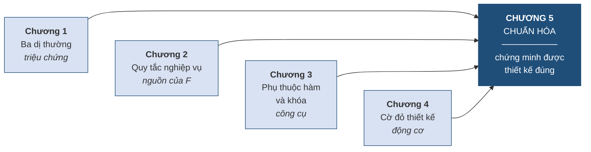

### 5.1.2. Định nghĩa "tốt" đo được

Từ *"tốt"* trong câu *"thiết kế cơ sở dữ liệu tốt"* xưa nay vẫn mơ hồ. Chương này thay nó bằng một định nghĩa **kiểm tra được**.

> **Định nghĩa 5.1.** Một lược đồ cơ sở dữ liệu được gọi là **tốt** nếu nó thỏa mãn **bốn tiêu chí**:
>
> 1. **Không dư thừa** — mỗi sự thật được lưu ở **đúng một chỗ**.
> 2. **Không có dị thường** thêm, sửa, xóa.
> 3. **Bảo toàn thông tin** — tách ra rồi ghép lại phải được **đúng dữ liệu ban đầu**.
> 4. **Bảo toàn phụ thuộc hàm** — mọi quy tắc nghiệp vụ vẫn kiểm tra được **không cần ghép bảng**.

**Bảng 5.2. Bốn tiêu chí — công cụ kiểm tra tương ứng**

| Tiêu chí | Kiểm bằng cách nào | Học ở mục |
|---|---|---|
| Không dư thừa | Xét **dạng chuẩn** đạt được | 5.7, 5.10 |
| Không dị thường | Hệ quả của tiêu chí 1 — xem *bảng vàng* | 5.7.6 |
| Bảo toàn thông tin | Điều kiện **lossless join** | 5.8.2 |
| Bảo toàn phụ thuộc hàm | Đối chiếu tập `F` với các bảng con | 5.8.3 |

Điểm quan trọng: bốn tiêu chí này **không phải lúc nào cũng đạt được cùng lúc**. Mục 5.8.4 sẽ chứng minh rằng đôi khi phải **chọn** giữa tiêu chí 1 và tiêu chí 4 — và đó là lý do trong thực tế người ta thường **dừng ở 3NF** thay vì leo lên BCNF.

### 5.1.3. Vị trí của chuẩn hóa trong quy trình thiết kế

Chuẩn hóa **không thay thế** thiết kế ER; nó bổ sung. Có hai cách dùng, và cả hai đều hợp lệ.

**Cách thứ nhất — kiểm tra lại.** Thiết kế ER trước *(Chương 2)*, ánh xạ sang quan hệ *(Chương 3)*, rồi **dùng chuẩn hóa để kiểm tra** kết quả. Nếu lược đồ đã đạt 3NF thì thiết kế ER đã tốt; nếu chưa, đó là dấu hiệu mô hình ER còn thiếu sót. Đây là cách dùng phổ biến nhất trong dự án thực tế.

**Cách thứ hai — chuẩn hóa từ đầu.** Xuất phát từ một bảng phẳng có sẵn *(chẳng hạn tệp Excel của khách hàng)* và chuẩn hóa dần lên. Cách này dùng khi cải tạo hệ thống cũ, và cũng chính là cách mục 5.9 sẽ minh họa.

> **Chú ý.** Người học đôi khi hiểu nhầm rằng *"chuẩn hóa là để tiết kiệm dung lượng"*. Không phải. Dung lượng chỉ là hệ quả phụ, và ngày nay rất rẻ. **Mục đích thật sự của chuẩn hóa là loại bỏ dị thường** — tức bảo đảm dữ liệu **đúng**, không mâu thuẫn. Đây chính là chuỗi nhân quả đã nêu ở mục 1.3.3: dư thừa dẫn tới không nhất quán, không nhất quán dẫn tới quyết định sai.

---

## 5.2. Ba loại phụ thuộc hàm

*(1,0 tiết)*

### 5.2.1. Nhắc lại và mở rộng

Mục 3.2.2 đã định nghĩa phụ thuộc hàm `X → Y`: *biết `X` thì biết chắc `Y`*. Ở Chương 3 khái niệm này chỉ dùng để định nghĩa khóa. Từ đây nó trở thành **công cụ phân tích chính**.

Cần nhắc lại một cảnh báo đã nêu ở Chương 3, vì nó là nguồn sai lầm phổ biến nhất của cả chương này:

> **Chú ý.** Tập phụ thuộc hàm `F` đến từ **quy tắc nghiệp vụ**, **không phải** từ việc nhìn dữ liệu mẫu. Nếu bảng hiện có 3 dòng và tình cờ không ai trùng tên, ta **không được** kết luận `HOTEN → MAHV`. Câu hỏi đúng luôn là: *"nghiệp vụ có cho phép hai học viên trùng tên không?"* Toàn bộ chương này đứng trên `F`; `F` sai thì mọi kết quả sau đó đều sai.

**Bảng 5.3. Ba loại phụ thuộc hàm**

| Loại | Định nghĩa ngắn | Có hại không |
|---|---|---|
| **Đầy đủ** *(full)* | `X → Y` mà **không tập con thực sự nào** của `X` xác định được `Y` | Không — đây là dạng mong muốn |
| **Bộ phận** *(partial)* | `Y` phụ thuộc vào **một phần** của khóa phức hợp | **Có** — vi phạm 2NF |
| **Bắc cầu** *(transitive)* | `K → Z → Y`, trong đó `Z` **không phải khóa** | **Có** — vi phạm 3NF |

Hai loại sau là **hai thủ phạm** gây ra dị thường, và toàn bộ việc chuẩn hóa lên 3NF chính là **diệt lần lượt hai thủ phạm này**.

### 5.2.2. Phụ thuộc hàm đầy đủ

> **Định nghĩa 5.2.** Phụ thuộc hàm `X → Y` là **đầy đủ** nếu với mọi tập con thực sự `X' ⊂ X`, ta **không có** `X' → Y`.

> **Ví dụ 5.1.** Trong bảng `GHIDANH(MAHV, MALOP, HOCPHI)` với khóa `(MAHV, MALOP)`:
>
> - `(MAHV, MALOP) → HOCPHI` là **đầy đủ**: biết riêng học viên không đủ suy ra học phí *(mỗi học viên đóng nhiều mức cho nhiều lớp)*, biết riêng lớp cũng không đủ *(mỗi lớp thu nhiều mức tùy ưu đãi)*.

### 5.2.3. Phụ thuộc bộ phận

> **Định nghĩa 5.3.** Phụ thuộc hàm `X → Y` là **bộ phận** nếu tồn tại tập con thực sự `X' ⊂ X` sao cho `X' → Y`. Nói cách khác: `Y` chỉ cần **một phần** của `X` là đã xác định được.

Loại này chỉ xuất hiện khi khóa là **khóa phức hợp** — vì phải có "phần" thì mới có "một phần".

**Hình 5.2. Phụ thuộc bộ phận — phép loại suy ổ khóa hai chìa**

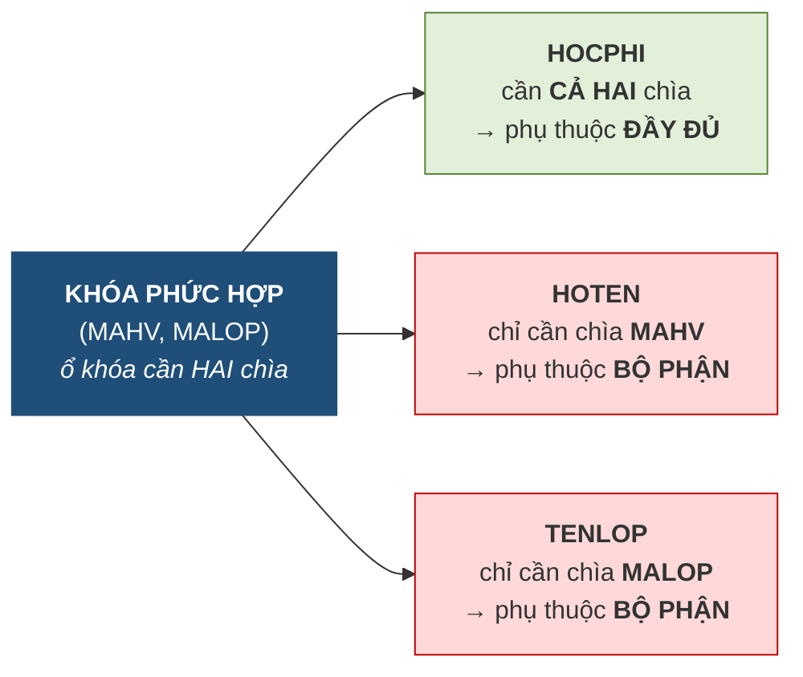

Vì sao phụ thuộc bộ phận gây hại? Vì nó **buộc dữ liệu phải lặp lại**. Nếu `HOTEN` chỉ phụ thuộc vào `MAHV` nhưng lại nằm trong bảng có khóa `(MAHV, MALOP)`, thì học viên ghi danh bao nhiêu lớp, tên của người đó **lặp lại bấy nhiêu lần** — đúng gốc rễ dư thừa của mục 1.3.

### 5.2.4. Phụ thuộc bắc cầu

> **Định nghĩa 5.4.** Phụ thuộc hàm là **bắc cầu** nếu tồn tại chuỗi `K → Z → Y`, trong đó `K` là khóa, `Z` **không phải khóa và không phải tập con của khóa**, còn `Y` là thuộc tính không khóa.

**Hình 5.3. Phụ thuộc bắc cầu — phải đi hai chặng**

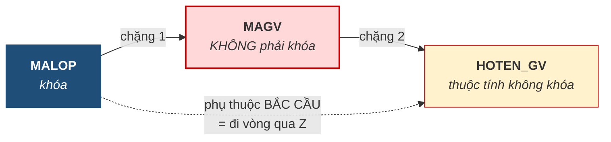

Vì sao bắc cầu gây hại? Cũng vì lặp lại, nhưng theo cơ chế khác. Nếu `HOTEN_GV` nằm trong bảng `LOP`, thì một giáo viên phụ trách bao nhiêu lớp, tên của người ấy **lặp lại bấy nhiêu lần**. Đây chính xác là tình huống cô Lê Hoa lặp ba lần ở Bảng 1.5 của Chương 1 — nay đã có tên gọi.

> **Chú ý — điều kiện `Z` không phải khóa là bắt buộc.** Nếu `Z` cũng là một khóa dự tuyển thì chuỗi `K → Z → Y` **không phải** phụ thuộc bắc cầu có hại, vì lúc ấy `Z` xác định duy nhất mỗi dòng nên không gây lặp. Bỏ sót điều kiện này dẫn tới việc tách bảng không cần thiết.

---

## 5.3. Hệ luật dẫn Armstrong

*(1,0 tiết)*

Tập `F` mà người thiết kế thu thập được từ nghiệp vụ thường chỉ là **một phần** các phụ thuộc hàm thật sự tồn tại. Nhiều phụ thuộc khác **suy ra được** từ `F`. Hệ luật Armstrong *(1974)* cho biết cách suy.

### 5.3.1. Ba luật gốc

> **Định nghĩa 5.5 (Hệ tiên đề Armstrong).** Cho `X`, `Y`, `Z` là các tập thuộc tính của quan hệ `R`:
>
> - **Luật phản xạ** *(reflexivity)*: nếu `Y ⊆ X` thì `X → Y`.
> - **Luật tăng trưởng** *(augmentation)*: nếu `X → Y` thì `XZ → YZ`.
> - **Luật bắc cầu** *(transitivity)*: nếu `X → Y` và `Y → Z` thì `X → Z`.

Ba luật này là **đúng đắn** *(mọi thứ suy ra được đều đúng)* và **đầy đủ** *(mọi thứ đúng đều suy ra được)* — đó là kết quả do Armstrong chứng minh, và cũng là lý do chỉ cần ba luật này là đủ.

Trong ba luật, **luật phản xạ** thoạt nhìn có vẻ vô nghĩa: *biết `(MAHV, MALOP)` thì biết `MAHV`* — hiển nhiên. Nhưng chính vì hiển nhiên mà nó cần thiết: nó cho phép sinh ra các **phụ thuộc tầm thường** *(trivial)*, làm điểm khởi đầu cho các phép suy diễn khác.

### 5.3.2. Ba luật dẫn xuất

Từ ba luật gốc suy ra được ba luật tiện dụng hơn khi làm bài.

**Bảng 5.4. Ba luật gốc và ba luật dẫn xuất**

| Luật | Phát biểu | Loại |
|---|---|---|
| **Phản xạ** | `Y ⊆ X` ⟹ `X → Y` | Gốc |
| **Tăng trưởng** | `X → Y` ⟹ `XZ → YZ` | Gốc |
| **Bắc cầu** | `X → Y`, `Y → Z` ⟹ `X → Z` | Gốc |
| **Hợp** *(union)* | `X → Y`, `X → Z` ⟹ `X → YZ` | Dẫn xuất |
| **Tách** *(decomposition)* | `X → YZ` ⟹ `X → Y` và `X → Z` | Dẫn xuất |
| **Bắc cầu giả** *(pseudotransitivity)* | `X → Y`, `WY → Z` ⟹ `WX → Z` | Dẫn xuất |

Hai luật **hợp** và **tách** dùng nhiều nhất trong thực hành, vì chúng cho phép **gộp** hoặc **tách** vế phải tùy tiện. Nhờ đó ta luôn có thể viết `F` ở dạng **mỗi phụ thuộc chỉ có một thuộc tính ở vế phải** — điều kiện đầu tiên của phủ tối thiểu ở mục 5.6.

> **Ví dụ 5.2.** Cho `F = {A → B, B → C}`. Chứng minh `A → BC`.
>
> | Bước | Suy luận | Luật dùng |
> |:--:|---|---|
> | 1 | `A → B` | giả thiết |
> | 2 | `B → C` | giả thiết |
> | 3 | `A → C` | bắc cầu (1, 2) |
> | 4 | `A → BC` | hợp (1, 3) |

### 5.3.3. Vì sao cần hệ luật này

Có hai lý do thực dụng.

Thứ nhất, hệ luật Armstrong là **nền tảng của thuật toán bao đóng** ở mục 5.4 — thuật toán ấy chính là việc áp luật bắc cầu lặp đi lặp lại một cách có hệ thống.

Thứ hai, nó cho phép **phát hiện phụ thuộc bắc cầu ẩn**. Nhìn vào `F = {MALOP → MAGV, MAGV → HOTEN_GV}` thì hai phụ thuộc trông vô hại, nhưng luật bắc cầu cho ra `MALOP → HOTEN_GV` — và đó chính là vi phạm 3NF. Không có luật này, người thiết kế phải nhìn ra bằng mắt, tức lại quay về trực giác.

---

## 5.4. Bao đóng của tập thuộc tính

*(1,5 tiết)*

Đây là **công cụ trung tâm** của cả chương. Hầu hết mọi thứ sau đó — tìm khóa, xét dạng chuẩn, kiểm tra bảo toàn thông tin — đều quy về việc tính bao đóng.

### 5.4.1. Định nghĩa và thuật toán

> **Định nghĩa 5.6.** **Bao đóng** của tập thuộc tính `X` đối với tập phụ thuộc hàm `F`, ký hiệu **`X⁺`**, là **tập tất cả các thuộc tính suy ra được từ `X`** nhờ `F`.

**Thuật toán tính `X⁺`:**

```
BƯỚC 1.  Khởi tạo:  X⁺ ← X
BƯỚC 2.  Lặp lại cho tới khi X⁺ không đổi:
             với mỗi phụ thuộc  A → B  trong F
                 NẾU  A ⊆ X⁺  THÌ  X⁺ ← X⁺ ∪ B
BƯỚC 3.  Trả về X⁺
```

**Hình 5.4. Bao đóng — phép loại suy quả cầu tuyết**

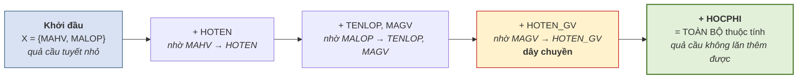

Phép loại suy **quả cầu tuyết** nắm đúng bản chất: bắt đầu từ một nhúm nhỏ, lăn qua từng phụ thuộc và **dính thêm** thuộc tính mới, cho tới khi không dính thêm được gì nữa thì dừng.

> **Chú ý — điểm dễ sai nhất.** Phải **lặp lại nhiều vòng**, không chỉ quét `F` một lượt. Ở Hình 5.4, `HOTEN_GV` chỉ dính vào **sau khi** `MAGV` đã dính — nếu chỉ quét một lượt theo thứ tự viết trong `F`, rất dễ bỏ sót. Cách an toàn là **quét lại từ đầu mỗi khi `X⁺` thay đổi**.

### 5.4.2. Ví dụ tính từng bước

> **Ví dụ 5.3.** Cho `R(A, B, C, D)` và `F = {A → B, B → C, CD → A}`. Tính `(AD)⁺`.
>
> | Vòng | Xét phụ thuộc | `A ⊆ X⁺`? | `X⁺` sau bước |
> |:--:|---|:--:|---|
> | — | *khởi tạo* | — | `{A, D}` |
> | 1 | `A → B` | Có | `{A, B, D}` |
> | 1 | `B → C` | Có | `{A, B, C, D}` |
> | 1 | `CD → A` | Có | `{A, B, C, D}` *(không đổi)* |
> | 2 | *quét lại toàn bộ* | — | `{A, B, C, D}` *(không đổi → dừng)* |
>
> Vậy `(AD)⁺ = {A, B, C, D}` = toàn bộ thuộc tính, nên `AD` là **siêu khóa**.

### 5.4.3. Hai công dụng của bao đóng

**Công dụng thứ nhất — kiểm tra một phụ thuộc hàm có suy ra được không.**

> `X → Y` suy ra được từ `F` **khi và chỉ khi** `Y ⊆ X⁺`.

Đây là cách kiểm tra **nhanh và chắc chắn**, thay cho việc mò mẫm áp luật Armstrong.

**Công dụng thứ hai — kiểm tra một tập thuộc tính có phải siêu khóa không.**

> `X` là **siêu khóa** của `R` **khi và chỉ khi** `X⁺` = **toàn bộ** tập thuộc tính của `R`.

Công dụng này là nền tảng của thuật toán tìm khóa ở mục 5.5.

### 5.4.4. Phân biệt `F⁺` và `X⁺`

Hai ký hiệu trông giống nhau nhưng là **hai thứ hoàn toàn khác**, và đây là chỗ nhầm lẫn kinh điển.

**Bảng 5.5. `F⁺` và `X⁺` — hai thứ khác nhau**

| | `F⁺` | `X⁺` |
|---|---|---|
| **Đầu vào** | Một **tập phụ thuộc hàm** `F` | Một **tập thuộc tính** `X` *(kèm `F`)* |
| **Kết quả là** | Một **tập phụ thuộc hàm** | Một **tập thuộc tính** |
| **Nội dung** | Mọi phụ thuộc suy ra được từ `F` | Mọi thuộc tính suy ra được từ `X` |
| **Kích thước** | Rất lớn — **hàm mũ** | Nhỏ — không quá số thuộc tính của `R` |
| **Tính được không** | Trên lý thuyết được, thực tế **không khả thi** | **Rất dễ** — thuật toán ở mục 5.4.1 |

Câu phân biệt gọn nhất: **`F⁺` là tập các mũi tên; `X⁺` là tập các chữ cái.**

> **Chú ý.** Chính vì `F⁺` quá lớn để tính mà toàn bộ lý thuyết chuẩn hóa được xây trên `X⁺`. Mọi câu hỏi tưởng như cần `F⁺` — *"phụ thuộc này có đúng không"*, *"tập này có phải khóa không"* — đều được quy về việc tính một vài bao đóng `X⁺`. Đó là đóng góp thực dụng lớn nhất của khái niệm bao đóng.

---

## 5.5. Thuật toán tìm khóa

*(2,0 tiết)*

### 5.5.1. Ba nhóm thuộc tính

Ý tưởng nền tảng: **không phải thuộc tính nào cũng có cơ hội nằm trong khóa như nhau**. Phân loại trước thì phạm vi tìm kiếm thu hẹp rất nhiều.

> **Định nghĩa 5.7.** Với lược đồ `R` và tập phụ thuộc hàm `F`, chia các thuộc tính thành ba nhóm:
>
> - **Tập nguồn `TN`**: các thuộc tính **chỉ xuất hiện ở vế trái**, hoặc **không xuất hiện** ở cả hai vế.
> - **Tập trung gian `TG`**: các thuộc tính xuất hiện ở **cả hai vế**.
> - **Tập đích `TĐ`**: các thuộc tính **chỉ xuất hiện ở vế phải**.

**Hình 5.5. Ba nhóm thuộc tính — và vì sao phân nhóm**


Lý do đằng sau ba nhóm rất trực quan. Thuộc tính thuộc **`TN`** không nằm ở vế phải của bất kỳ phụ thuộc nào, nên **không có cách nào suy ra nó** — muốn suy ra toàn bộ lược đồ thì buộc phải có nó ngay từ đầu. Ngược lại, thuộc tính thuộc **`TĐ`** luôn suy ra được từ thứ khác, nên đưa nó vào khóa chỉ làm khóa thừa, vi phạm tính tối thiểu. Chỉ nhóm **`TG`** là còn phải thử.

### 5.5.2. Thuật toán tìm một khóa

Với nhiều bài toán, chỉ cần **một** khóa là đủ để chuẩn hóa. Khi ấy có một lối tắt:

```
BƯỚC 1.  Xác định TN và TG
BƯỚC 2.  Tính (TN)⁺
             NẾU (TN)⁺ = toàn bộ thuộc tính  THÌ  TN chính là khóa duy nhất — DỪNG
BƯỚC 3.  Ngược lại, lần lượt ghép thêm từng tập con của TG (từ nhỏ tới lớn)
             cho tới khi tìm được siêu khóa tối thiểu
```

Bước 2 là **mẹo tiết kiệm thời gian** đáng nhớ: rất nhiều lược đồ thực tế có `(TN)⁺` phủ hết ngay, và khi đó bài toán kết thúc sau một phép tính bao đóng duy nhất.

### 5.5.3. Thuật toán tìm tất cả khóa

Nhưng một lược đồ **có thể có nhiều khóa**, và điều này quan trọng vì việc xét 2NF, 3NF phụ thuộc vào khái niệm *thuộc tính khóa* — tức thuộc tính nằm trong **bất kỳ** khóa nào. Bỏ sót một khóa có thể dẫn tới kết luận sai về dạng chuẩn.

```
BƯỚC 1.  Xác định TN và TG
BƯỚC 2.  Sinh mọi tập con Xᵢ của TG          (có 2^|TG| tập con)
BƯỚC 3.  Với mỗi Xᵢ, tính (TN ∪ Xᵢ)⁺
             NẾU (TN ∪ Xᵢ)⁺ = toàn bộ thuộc tính
                 THÌ  TN ∪ Xᵢ  là một SIÊU KHÓA
BƯỚC 4.  Trong các siêu khóa tìm được, LOẠI những siêu khóa
             chứa một siêu khóa khác  →  còn lại là TẤT CẢ các khóa
```

Bước 4 chính là bước bảo đảm **tính tối thiểu** đã học ở mục 2.3.1 và 3.2.3.

### 5.5.4. Mẹo rút gọn

Khi `TG` lớn, số tập con `2^|TG|` tăng rất nhanh — `|TG| = 10` đã cho hơn một nghìn tập con. Có một mẹo cắt giảm đáng kể khối lượng tính.

> **Mẹo.** Duyệt các tập con của `TG` theo **kích thước tăng dần**. Nếu `TN ∪ Xᵢ` đã là siêu khóa, thì **mọi tập cha** của `Xᵢ` cũng là siêu khóa nhưng **chắc chắn không tối thiểu** — nên **loại luôn, không cần tính bao đóng** cho chúng.

Mẹo này dựa trên một nhận xét đơn giản: bao đóng có tính **đơn điệu** — thêm thuộc tính vào `X` thì `X⁺` chỉ có thể lớn lên chứ không nhỏ đi. Vì vậy khi đã tìm được một siêu khóa nhỏ, mọi thứ chứa nó đều thừa.

### 5.5.5. Ví dụ đầy đủ — tìm tất cả khóa

> **Ví dụ 5.4.** Cho `R(A, B, C, D)` và `F = {A → B, B → C, CD → A}`. Tìm **tất cả** khóa.
>
> **Bước 1 — phân nhóm.** Vế trái xuất hiện: `A`, `B`, `C`, `D`. Vế phải xuất hiện: `B`, `C`, `A`.
>
> | Thuộc tính | Vế trái | Vế phải | Nhóm |
> |:--:|:--:|:--:|:--:|
> | `A` | có | có | **TG** |
> | `B` | có | có | **TG** |
> | `C` | có | có | **TG** |
> | `D` | có | không | **TN** |
>
> Vậy `TN = {D}`, `TG = {A, B, C}`, `TĐ = ∅`.
>
> **Bước 2–3 — duyệt `2³ = 8` tập con của `TG`**, theo kích thước tăng dần:
>
> | # | `Xᵢ` | `TN ∪ Xᵢ` | `(TN ∪ Xᵢ)⁺` | Siêu khóa? |
> |:--:|---|---|---|:--:|
> | 1 | `∅` | `D` | `{D}` | Không |
> | 2 | `{A}` | `AD` | `{A,B,C,D}` | **Có** |
> | 3 | `{B}` | `BD` | `{B,C,A,D}` | **Có** |
> | 4 | `{C}` | `CD` | `{C,D,A,B}` | **Có** |
> | 5 | `{A,B}` | `ABD` | — | *chứa `AD`* → **loại** |
> | 6 | `{A,C}` | `ACD` | — | *chứa `AD`* → **loại** |
> | 7 | `{B,C}` | `BCD` | — | *chứa `BD`* → **loại** |
> | 8 | `{A,B,C}` | `ABCD` | — | *chứa `AD`* → **loại** |
>
> Bốn dòng cuối được loại **không cần tính bao đóng**, nhờ mẹo ở mục 5.5.4.
>
> **Bước 4 — kết luận.** Ba siêu khóa `AD`, `BD`, `CD` đều **tối thiểu** *(không cái nào chứa cái nào)*.
>
> **Lược đồ có ba khóa: `AD`, `BD`, `CD`.**
>
> Hệ quả: thuộc tính khóa là `A`, `B`, `C`, `D` — **tất cả**. Khi mọi thuộc tính đều là thuộc tính khóa, lược đồ **tự động đạt 3NF** *(xem mục 5.7.4)*.

---

## 5.6. Phủ tối thiểu

*(1,5 tiết)*

### 5.6.1. Vì sao cần phủ tối thiểu

Tập `F` thu thập được từ nghiệp vụ thường **thừa**: có phụ thuộc suy ra được từ các phụ thuộc khác, có vế trái chứa thuộc tính không cần thiết. Làm việc trên một `F` thừa thì tốn công và dễ sai.

> **Định nghĩa 5.8.** **Phủ tối thiểu** *(minimal cover)* của `F` là một tập phụ thuộc hàm `F_min` **tương đương** với `F` *(tức `F⁺ = F_min⁺`)* và **không thể rút gọn thêm được nữa**.

### 5.6.2. Ba điều kiện

> **Định nghĩa 5.9.** `F_min` là phủ tối thiểu nếu thỏa mãn **đồng thời ba điều kiện**:
>
> 1. **Vế phải chỉ có một thuộc tính** — mọi phụ thuộc có dạng `X → A` với `A` là một thuộc tính đơn.
> 2. **Không thừa thuộc tính ở vế trái** — không bỏ được thuộc tính nào khỏi `X` mà tập vẫn tương đương.
> 3. **Không thừa phụ thuộc** — không bỏ được phụ thuộc nào mà tập vẫn tương đương.

### 5.6.3. Thuật toán ba bước

**Hình 5.6. Thuật toán tìm phủ tối thiểu — phải làm đúng thứ tự**

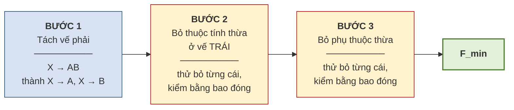

> **Chú ý — thứ tự ba bước là bắt buộc.** Phải bỏ thuộc tính thừa ở **vế trái trước**, rồi mới bỏ phụ thuộc thừa. Làm ngược lại có thể cho kết quả **không tối thiểu**, vì một phụ thuộc trông có vẻ cần thiết khi vế trái còn thừa, nhưng sau khi rút gọn vế trái thì lại hóa thừa.

**Cách kiểm tra ở Bước 2** — muốn biết thuộc tính `B` trong `XB → A` có thừa không: tính `X⁺` *(bỏ `B` đi)*. Nếu `A ∈ X⁺` thì `B` **thừa**, bỏ được.

**Cách kiểm tra ở Bước 3** — muốn biết phụ thuộc `X → A` có thừa không: tạm bỏ nó khỏi `F`, rồi tính `X⁺` trên tập còn lại. Nếu `A` vẫn thuộc `X⁺` thì phụ thuộc ấy **thừa**.

### 5.6.4. Ví dụ đầy đủ

> **Ví dụ 5.5.** Cho `F = {A → BC, B → C, AB → D}`. Tìm phủ tối thiểu.
>
> **Bước 1 — tách vế phải:**
>
> `F₁ = {A → B, A → C, B → C, AB → D}`
>
> **Bước 2 — bỏ thuộc tính thừa ở vế trái.** Chỉ `AB → D` có vế trái nhiều hơn một thuộc tính.
>
> - Thử bỏ `B`, xét `A → D`: tính `A⁺` trên `F₁` khi chưa dùng `AB → D` — ta có `A⁺ = {A, B, C}`. Vì `A → B` nên `A` suy ra `B`, do đó `AB` và `A` là tương đương. Vậy `B` **thừa**, thay `AB → D` bằng `A → D`.
>
> `F₂ = {A → B, A → C, B → C, A → D}`
>
> **Bước 3 — bỏ phụ thuộc thừa.**
>
> | Thử bỏ | Tính bao đóng trên tập còn lại | Kết luận |
> |---|---|---|
> | `A → B` | `A⁺ = {A, C, D}` — thiếu `B` | **Giữ** |
> | `A → C` | `A⁺ = {A, B, C, D}` *(nhờ `A→B` rồi `B→C`)* — có `C` | **BỎ** |
> | `B → C` | `B⁺ = {B}` — thiếu `C` | **Giữ** |
> | `A → D` | `A⁺ = {A, B, C}` — thiếu `D` | **Giữ** |
>
> **Kết quả:** `F_min = {A → B, B → C, A → D}`
>
> Từ bốn phụ thuộc ban đầu rút còn ba, và vế trái đã gọn nhất có thể.

---

## 5.7. Các dạng chuẩn 1NF, 2NF, 3NF

*(1,5 tiết)*

### 5.7.1. Thuộc tính khóa và không khóa

Trước khi định nghĩa các dạng chuẩn, cần một khái niệm phụ.

> **Định nghĩa 5.10.** Một thuộc tính gọi là **thuộc tính khóa** *(prime attribute)* nếu nó thuộc **ít nhất một** khóa của lược đồ. Ngược lại gọi là **thuộc tính không khóa** *(non-prime attribute)*.

Chữ *"ít nhất một"* giải thích vì sao mục 5.5.3 phải tìm **tất cả** khóa: nếu chỉ tìm một khóa, ta có thể xếp nhầm một thuộc tính khóa thành không khóa, và kết luận sai về dạng chuẩn.

### 5.7.2. Dạng chuẩn 1

> **Định nghĩa 5.11.** Quan hệ `R` đạt **dạng chuẩn 1 (1NF)** nếu **mọi giá trị trong mọi ô đều là giá trị đơn** — không phải danh sách, không phải nhóm lặp.

Đây chính là **Đặc trưng 4** ở mục 3.1.3 của Chương 3, và cũng là nguyên tắc đã dùng ở mục 2.2.4 của Chương 2 khi bác bỏ cách nhồi ba số điện thoại vào một ô. **Đến đây nó được gọi đúng tên.**

> **Chú ý.** Với mô hình quan hệ, 1NF **không phải một mức để phấn đấu** mà là **điều kiện tối thiểu để được gọi là quan hệ**. Một bảng không đạt 1NF thì chưa phải quan hệ, và mọi lý thuyết của chương này không áp dụng được cho nó.

### 5.7.3. Dạng chuẩn 2

> **Định nghĩa 5.12.** Quan hệ `R` đạt **dạng chuẩn 2 (2NF)** nếu nó đạt 1NF và **mọi thuộc tính không khóa đều phụ thuộc đầy đủ vào mọi khóa** — nghĩa là **không có phụ thuộc bộ phận**.

Vì phụ thuộc bộ phận chỉ xuất hiện khi khóa là khóa phức hợp, ta có một hệ quả tiện dụng:

> **Hệ quả.** Nếu **mọi khóa của `R` đều chỉ gồm một thuộc tính**, thì `R` **tự động đạt 2NF**.

**Cách sửa khi vi phạm:** tách thuộc tính phụ thuộc bộ phận ra thành bảng riêng, cùng với **phần khóa mà nó thật sự phụ thuộc vào**.

### 5.7.4. Dạng chuẩn 3

> **Định nghĩa 5.13.** Quan hệ `R` đạt **dạng chuẩn 3 (3NF)** nếu nó đạt 2NF và **không có thuộc tính không khóa nào phụ thuộc bắc cầu vào khóa**.

Có một cách phát biểu tương đương, tiện hơn khi làm bài:

> `R` đạt 3NF khi và chỉ khi với **mọi** phụ thuộc hàm không tầm thường `X → A` trong `F`, **hoặc** `X` là siêu khóa, **hoặc** `A` là thuộc tính khóa.

Phát biểu này giải thích ngay nhận xét ở cuối Ví dụ 5.4: nếu **mọi** thuộc tính đều là thuộc tính khóa thì vế *"hoặc `A` là thuộc tính khóa"* luôn đúng, nên lược đồ **tự động đạt 3NF**.

**Cách sửa khi vi phạm:** tách chuỗi bắc cầu `K → Z → Y` thành hai bảng — một bảng chứa `(K, Z)`, một bảng chứa `(Z, Y)`.

### 5.7.5. Câu thần chú và cây quyết định

Có một câu tiếng Anh tóm tắt cả ba dạng chuẩn, được dùng rộng rãi:

> *"The key, the whole key, and nothing but the key."*

Cách đọc: mọi thuộc tính không khóa phải phụ thuộc vào **khóa** *(1NF — có khóa)*, vào **toàn bộ khóa** *(2NF — không bộ phận)*, và **không phụ thuộc vào gì khác ngoài khóa** *(3NF — không bắc cầu)*.

**Hình 5.7. Cây quyết định — xác định dạng chuẩn cao nhất**

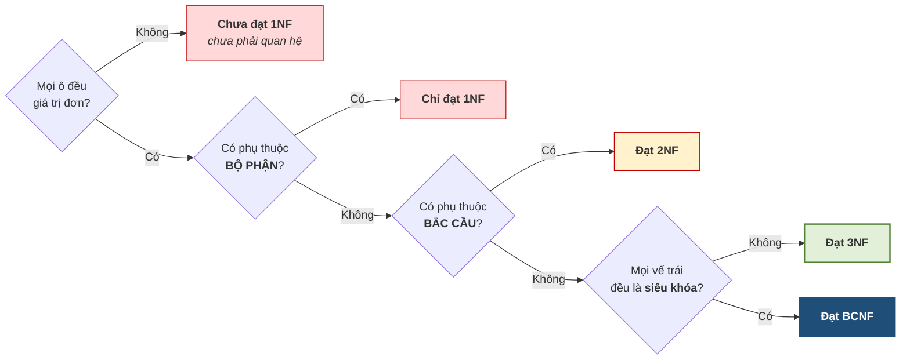

### 5.7.6. Bảng vàng — dạng chuẩn và dị thường

Đây là bảng nối thẳng Chương 5 về Chương 1, và cũng là câu trả lời cho câu hỏi *"chuẩn hóa để làm gì"*.

**Bảng 5.6. Dạng chuẩn diệt dị thường nào**

| Dạng chuẩn | Diệt thủ phạm | Dị thường bị loại bỏ |
|---|---|---|
| **1NF** | Ô đa giá trị | Không tìm kiếm được, không ràng buộc được |
| **2NF** | Phụ thuộc **bộ phận** | Dị thường **sửa** và **xóa** liên quan tới thuộc tính phụ thuộc nửa khóa |
| **3NF** | Phụ thuộc **bắc cầu** | Dị thường **sửa**, **thêm**, **xóa** liên quan tới bảng ẩn *(như `GIAOVIEN`)* |
| **BCNF** | Vế trái không phải siêu khóa | Các dị thường còn sót khi có nhiều khóa chồng lấn |

> **Chú ý.** Ở Chương 1 người học **thấy** ba dị thường nhưng **không gọi tên được nguyên nhân**. Bảng trên chỉ đích danh: dị thường không phải hiện tượng ngẫu nhiên mà là **hệ quả trực tiếp** của phụ thuộc bộ phận và phụ thuộc bắc cầu. Đó là khác biệt giữa *thấy triệu chứng* và *chẩn đoán được bệnh*.

---

## 5.8. Phép tách lược đồ

*(1,5 tiết)*

Chuẩn hóa được thực hiện bằng cách **tách** một lược đồ thành nhiều lược đồ nhỏ hơn. Nhưng không phải phép tách nào cũng dùng được.

### 5.8.1. Tách sai và hiện tượng bộ giả

Hãy xem điều gì xảy ra khi tách sai.

> **Ví dụ 5.6.** Cho quan hệ `R(MAHV, MALOP, MAGV)` với dữ liệu:
>
> | MAHV | MALOP | MAGV |
> |---|---|---|
> | HV01 | A1 | GV1 |
> | HV02 | A2 | GV2 |
>
> **Tách sai** thành `R1(MAHV, MAGV)` và `R2(MALOP, MAGV)`:
>
> `R1`
>
> | MAHV | MAGV |
> |---|---|
> | HV01 | GV1 |
> | HV02 | GV2 |
>
> `R2`
>
> | MALOP | MAGV |
> |---|---|
> | A1 | GV1 |
> | A2 | GV2 |
>
> Giờ ghép lại bằng phép kết tự nhiên trên `MAGV`, ta được **đúng hai dòng ban đầu**. Phép tách này **có vẻ** không sao.
>
> Nhưng thêm một dòng dữ liệu nữa — học viên HV01 học thêm lớp A2 do chính GV1 dạy:
>
> | MAHV | MALOP | MAGV |
> |---|---|---|
> | HV01 | A1 | GV1 |
> | HV01 | A2 | GV1 |
> | HV02 | A2 | GV2 |
>
> Khi ấy `R1 = {(HV01,GV1), (HV02,GV2)}` và `R2 = {(A1,GV1), (A2,GV1), (A2,GV2)}`. Ghép lại:
>
> | MAHV | MALOP | MAGV | |
> |---|---|---|---|
> | HV01 | A1 | GV1 | đúng |
> | HV01 | A2 | GV1 | đúng |
> | HV02 | A2 | GV2 | đúng |
>
> Lần này vẫn đúng. Nhưng nếu GV2 cũng dạy lớp A1 thì `R2` có thêm `(A1, GV2)`, và phép ghép sẽ sinh ra dòng `(HV02, A1, GV2)` — **một dòng chưa từng tồn tại trong dữ liệu gốc**.

> **Định nghĩa 5.14.** **Bộ giả** *(spurious tuple)* là bộ **xuất hiện trong kết quả ghép các bảng con nhưng không có trong quan hệ gốc**.

**Hình 5.8. Nghịch lý bộ giả — không mất dòng nào mà vẫn mất sự thật**


> **Chú ý — vì sao bộ giả nguy hiểm hơn mất dữ liệu.** Mất dữ liệu thì người dùng **biết mình thiếu** và đi tìm. Bộ giả thì ngược lại: hệ thống trả về **nhiều thông tin hơn sự thật**, và mọi dòng trông đều hợp lệ. Không ai biết dòng nào là thật, dòng nào là bịa. Đây đúng là kiểu lỗi **im lặng** đã bàn từ Chương 1 — và là kiểu lỗi tốn kém nhất.

### 5.8.2. Điều kiện bảo toàn thông tin

> **Định nghĩa 5.15.** Phép tách `R` thành `R1` và `R2` là **bảo toàn thông tin** *(lossless join)* nếu với mọi thể hiện của `R`, ta luôn có `R1 ⋈ R2 = R` — không thừa, không thiếu.

> **Định lý 5.1 (điều kiện đủ).** Phép tách `R` thành `R1` và `R2` là bảo toàn thông tin nếu **tập thuộc tính chung** `R1 ∩ R2` là **siêu khóa của ít nhất một trong hai** bảng con. Viết hình thức:
>
> `(R1 ∩ R2) → R1`  **hoặc**  `(R1 ∩ R2) → R2`

Áp vào Ví dụ 5.6: thuộc tính chung là `{MAGV}`, mà `MAGV` **không phải khóa** của `R1` *(một giáo viên dạy nhiều học viên)* cũng **không phải khóa** của `R2` *(một giáo viên dạy nhiều lớp)*. Điều kiện không thỏa mãn — đó chính là lý do sinh ra bộ giả.

> **Ví dụ 5.7.** Tách đúng: `R1(MAHV, MALOP)` và `R2(MALOP, MAGV)`. Thuộc tính chung là `{MALOP}`, mà `MALOP` **là khóa của `R2`** *(mỗi lớp có đúng một giáo viên)*. Điều kiện thỏa mãn ⟹ **bảo toàn thông tin**, không bao giờ sinh bộ giả.

Quy tắc thực hành rút ra rất gọn: **luôn tách theo phụ thuộc hàm**. Nếu tách `R` thành `R1(X ∪ Y)` và `R2(R − Y)` dựa trên một phụ thuộc `X → Y` có sẵn trong `F`, thì thuộc tính chung là `X`, và `X` là khóa của `R1` — điều kiện tự động thỏa mãn.

### 5.8.3. Bảo toàn phụ thuộc hàm

Bảo toàn thông tin mới là một nửa. Còn nửa kia.

> **Định nghĩa 5.16.** Phép tách là **bảo toàn phụ thuộc hàm** *(dependency preserving)* nếu mọi phụ thuộc hàm trong `F` đều **kiểm tra được trên một bảng con duy nhất**, không cần ghép bảng.

Vì sao điều này quan trọng? Vì nó liên quan trực tiếp tới **ràng buộc toàn vẹn** của Chương 4. Nếu một phụ thuộc hàm bị "xé" ra hai bảng, thì để kiểm tra nó, hệ quản trị phải **ghép hai bảng lại mỗi lần có thao tác** — tức là ràng buộc ấy trở thành **loại liên bộ liên quan hệ**, loại khó nhất trong Bảng 4.3, phải dùng trigger.

Nói cách khác: **mất bảo toàn phụ thuộc hàm nghĩa là biến một ràng buộc dễ thành một ràng buộc khó.**

### 5.8.4. Định lý — không phải lúc nào cũng đạt được cả hai

Đây là kết quả quan trọng nhất của mục 5.8, và cũng là lý do thực tế người ta thường dừng ở 3NF.

> **Định lý 5.2.**
>
> - Luôn tồn tại phép tách về **3NF** vừa **bảo toàn thông tin** vừa **bảo toàn phụ thuộc hàm**.
> - Luôn tồn tại phép tách về **BCNF** **bảo toàn thông tin**, nhưng **không phải lúc nào cũng bảo toàn được phụ thuộc hàm**.

**Hình 5.9. Leo cao hơn chưa chắc tốt hơn**

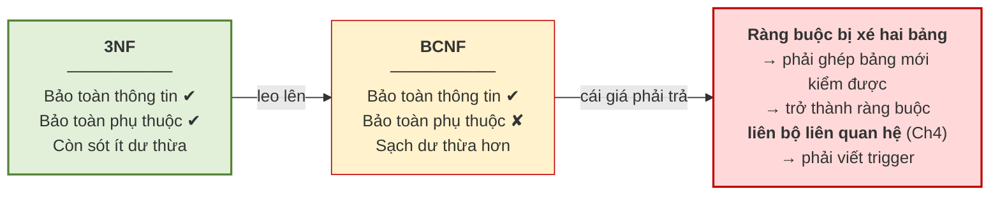

> **Chú ý — kết luận thực hành.** Trong đa số dự án, **3NF là đích đến hợp lý**. Leo lên BCNF chỉ nên làm khi phần dư thừa còn sót ở 3NF thật sự gây phiền, **và** khi phép tách BCNF tình cờ vẫn bảo toàn được phụ thuộc hàm. Đây là một ví dụ điển hình cho nguyên tắc: **"chuẩn hơn" không đồng nghĩa với "tốt hơn"** — mọi lựa chọn thiết kế đều là một sự đánh đổi.

---

## 5.9. Quy trình chuẩn hóa hoàn chỉnh

*(1,0 tiết)*

Mục này là khoảnh khắc mà cả học phần hướng tới: **chuẩn hóa lại chính bảng phẳng của Chương 1, bằng toán học.**

### 5.9.1. Bài toán xuất phát

`GHIDANH_PHANG(MAHV, HOTEN, MALOP, TENLOP, MAGV, HOTEN_GV, HOCPHI)`

| MAHV | HOTEN | MALOP | TENLOP | MAGV | HOTEN_GV | HOCPHI |
|---|---|---|---|---|---|---|
| HV01 | Trần An | A1 | Anh cơ bản 1 | GV1 | Lê Hoa | 2.000.000 |
| HV01 | Trần An | A2 | Anh giao tiếp | GV2 | Trần Mai | 2.500.000 |
| HV02 | Lê Bình | A1 | Anh cơ bản 1 | GV1 | Lê Hoa | 2.000.000 |

### 5.9.2. Bước 1 — xác định tập phụ thuộc hàm

**Bảng 5.7. Tập phụ thuộc hàm `F` — rút từ quy tắc nghiệp vụ**

| Phụ thuộc hàm | Quy tắc nghiệp vụ tương ứng |
|---|---|
| `MAHV → HOTEN` | Mỗi học viên có **một** họ tên |
| `MALOP → TENLOP, MAGV` | Mỗi lớp có **một** tên và do **một** giáo viên phụ trách |
| `MAGV → HOTEN_GV` | Mỗi giáo viên có **một** họ tên |
| `(MAHV, MALOP) → HOCPHI` | Mỗi **lượt ghi danh** có **một** mức học phí |

### 5.9.3. Bước 2 — tìm khóa

Vế phải xuất hiện: `HOTEN`, `TENLOP`, `MAGV`, `HOTEN_GV`, `HOCPHI`. Vậy:

- `TN = {MAHV, MALOP}` — chỉ ở vế trái
- `TG = {MAGV}` — ở cả hai vế
- `TĐ = {HOTEN, TENLOP, HOTEN_GV, HOCPHI}`

Áp mẹo ở mục 5.5.2: thử `(TN)⁺` trước.

| Bước | Áp phụ thuộc | Tập đang biết |
|---|---|---|
| Khởi tạo | — | `{MAHV, MALOP}` |
| `MAHV → HOTEN` | `+ HOTEN` | `{MAHV, MALOP, HOTEN}` |
| `MALOP → TENLOP, MAGV` | `+ TENLOP, MAGV` | `{…, TENLOP, MAGV}` |
| `MAGV → HOTEN_GV` | `+ HOTEN_GV` *(dây chuyền)* | `{…, HOTEN_GV}` |
| `(MAHV, MALOP) → HOCPHI` | `+ HOCPHI` | **toàn bộ** |

`(TN)⁺` phủ hết ⟹ **`K = (MAHV, MALOP)` là khóa duy nhất**, và là khóa **phức hợp**.

> **Chú ý.** Đây là lần đầu **trực giác và toán học gặp nhau**. Ở mục 2.6.4 của Chương 2, ta đã đoán ra thực thể `GHIDANH` bằng *phép thử tờ phiếu* — mỗi lượt ghi danh trung tâm in một tờ phiếu. Nay thuật toán TN–TG **tính ra** đúng khóa `(MAHV, MALOP)`, tức đúng "tờ phiếu" ấy. Trực giác đã đoán đúng; toán học vừa xác nhận.

### 5.9.4. Bước 3 — chẩn đoán dạng chuẩn

**Bảng 5.8. Chẩn đoán với khóa `K = (MAHV, MALOP)`**

| Dạng chuẩn | Kết luận | Bằng chứng |
|---|:--:|---|
| **1NF** | **Đạt** | Mọi ô đều là giá trị đơn |
| **2NF** | **Vi phạm** | `MAHV → HOTEN`: `HOTEN` là thuộc tính không khóa nhưng chỉ phụ thuộc **nửa khóa** → **phụ thuộc bộ phận**. Tương tự với `MALOP → TENLOP, MAGV` |
| **3NF** | **Vi phạm** | `MALOP → MAGV → HOTEN_GV`, mà `MAGV` không phải khóa → **phụ thuộc bắc cầu** |

Hai thủ phạm đã bị chỉ đích danh.

### 5.9.5. Bước 4 và 5 — tách về 2NF rồi 3NF

**Hình 5.10. Quy trình chuẩn hóa từng bước**

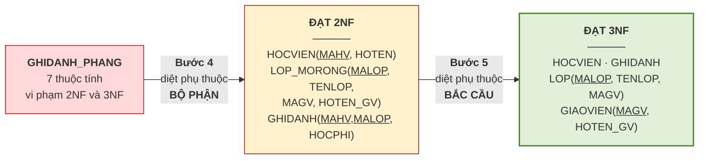

**Lược đồ cuối cùng, đạt 3NF:**

```
HOCVIEN  (MAHV, HOTEN)
GIAOVIEN (MAGV, HOTEN_GV)
LOP      (MALOP, TENLOP, MAGV↗GIAOVIEN)
GHIDANH  (MAHV↗HOCVIEN, MALOP↗LOP, HOCPHI)
```

### 5.9.6. Kiểm chứng bảo toàn thông tin

Áp Định lý 5.1 cho từng phép tách:

**Bảng 5.9. Kiểm chứng từng phép tách**

| Phép tách | Thuộc tính chung | Có là khóa của bảng con nào? | Kết luận |
|---|---|---|:--:|
| `HOCVIEN` và phần còn lại | `{MAHV}` | `MAHV` **là khóa của `HOCVIEN`** | **Bảo toàn** |
| `LOP` và `GIAOVIEN` | `{MAGV}` | `MAGV` **là khóa của `GIAOVIEN`** | **Bảo toàn** |
| `GHIDANH` và phần còn lại | `{MAHV, MALOP}` | là khóa của `GHIDANH` | **Bảo toàn** |

Cả ba phép tách đều bảo toàn thông tin ⟹ **không sinh bộ giả**. Đồng thời mọi phụ thuộc trong `F` đều nằm trọn trong một bảng con ⟹ **bảo toàn phụ thuộc hàm**. Thiết kế đạt cả bốn tiêu chí ở Định nghĩa 5.1.

---

## 5.10. Dạng chuẩn mức cao và phi chuẩn hóa

*(0,5 tiết — xem lưu ý về thời lượng ở đầu chương)*

### 5.10.1. Dạng chuẩn Boyce–Codd

> **Định nghĩa 5.17.** Quan hệ `R` đạt **BCNF** nếu với **mọi** phụ thuộc hàm không tầm thường `X → A` trong `F`, `X` **luôn là siêu khóa**.

So sánh với định nghĩa 3NF ở mục 5.7.4, khác biệt nằm ở chỗ BCNF **bỏ đi vế "hoặc `A` là thuộc tính khóa"**. Đó là điều kiện chặt hơn.

**Bảng 5.10. 3NF và BCNF khác nhau ở đâu**

| | 3NF | BCNF |
|---|---|---|
| Điều kiện với mọi `X → A` | `X` là siêu khóa **HOẶC** `A` là thuộc tính khóa | `X` là siêu khóa |
| Bảo toàn phụ thuộc hàm | **Luôn đạt được** | **Không phải lúc nào cũng** |
| Khi nào hai cái khác nhau | Chỉ khi lược đồ có **nhiều khóa dự tuyển chồng lấn nhau** | |

Điểm cuối cùng đáng nhấn mạnh: với phần lớn lược đồ thực tế — những lược đồ chỉ có một khóa, hoặc có nhiều khóa nhưng không chồng lấn — **3NF và BCNF là một**. Khác biệt chỉ xuất hiện trong tình huống khá đặc thù, và đó là lý do thực hành thường dừng ở 3NF.

### 5.10.2. Phụ thuộc đa trị

Có một loại dư thừa mà **BCNF không diệt được**. Xét tình huống sau tại Trung tâm ABC.

> **Ví dụ 5.8.** Trung tâm muốn lưu: mỗi giáo viên dạy những lớp nào, và có những chứng chỉ gì. Hai thông tin này **hoàn toàn độc lập với nhau** — chứng chỉ của giáo viên không liên quan gì tới lớp cụ thể mà người ấy dạy.
>
> `GV_LOP_CC(MAGV, MALOP, CHUNGCHI)`
>
> | MAGV | MALOP | CHUNGCHI |
> |---|---|---|
> | GV1 | A1 | IELTS |
> | GV1 | A1 | TOEIC |
> | GV1 | A2 | IELTS |
> | GV1 | A2 | TOEIC |
>
> Giáo viên GV1 dạy 2 lớp và có 2 chứng chỉ, nên bảng phải chứa **2 × 2 = 4 dòng** — một sự **bùng nổ tích**. Nếu GV1 dạy 5 lớp và có 3 chứng chỉ thì cần 15 dòng, trong khi lượng thông tin thật chỉ là 5 + 3 = 8.
>
> Điều đáng chú ý: bảng này **đạt BCNF**. Khóa là cả ba thuộc tính `(MAGV, MALOP, CHUNGCHI)`, và **không có phụ thuộc hàm không tầm thường nào** — nên điều kiện BCNF thỏa mãn một cách rỗng. Vậy mà dư thừa vẫn còn nguyên.

> **Định nghĩa 5.18.** Cho quan hệ `R` và ba tập thuộc tính `X`, `Y`, `Z` với `Z = R − X − Y`. Ta nói `Y` **phụ thuộc đa trị** vào `X`, ký hiệu **`X ↠ Y`**, nếu: với mọi cặp bộ `t₁`, `t₂` có `t₁[X] = t₂[X]`, luôn tồn tại bộ `t₃` trong `R` sao cho `t₃[X] = t₁[X]`, `t₃[Y] = t₁[Y]` và `t₃[Z] = t₂[Z]`.

Cách hiểu thực dụng, bỏ qua ký hiệu: **`X ↠ Y` nghĩa là với mỗi giá trị của `X`, tập giá trị `Y` là cố định và hoàn toàn độc lập với tập giá trị `Z`.**

**Hình 5.11. Phụ thuộc đa trị — hai nhánh độc lập gây bùng nổ tích**

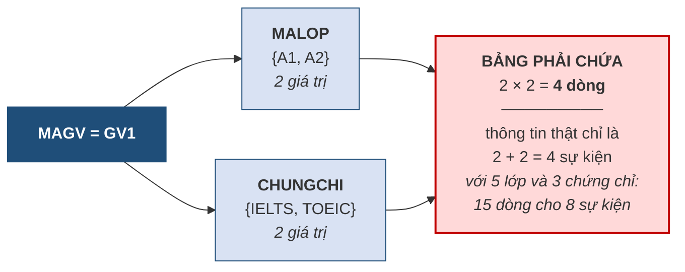

Hai tính chất cần nhớ. Thứ nhất, **phụ thuộc đa trị luôn xuất hiện theo cặp**: nếu `X ↠ Y` thì cũng có `X ↠ Z`. Thứ hai, **phụ thuộc hàm là trường hợp riêng của phụ thuộc đa trị** — nếu `X → Y` thì `X ↠ Y`.

Phụ thuộc đa trị gọi là **tầm thường** nếu `Y ⊆ X` hoặc `X ∪ Y = R`; các trường hợp còn lại là **không tầm thường**.

### 5.10.3. Dạng chuẩn 4 và thuật toán tách

> **Định nghĩa 5.19.** Quan hệ `R` đạt **dạng chuẩn 4 (4NF)** nếu nó đạt BCNF và với **mọi** phụ thuộc đa trị không tầm thường `X ↠ Y` trong `R`, `X` **luôn là siêu khóa**.

**Thuật toán tách về 4NF:**

```
LẶP cho tới khi không còn vi phạm:
    TÌM một phụ thuộc đa trị không tầm thường  X ↠ Y  trong R
        mà X KHÔNG phải siêu khóa
    NẾU tìm thấy:
        Đặt  Z = R − X − Y
        Tách R thành:   R1 = X ∪ Y      và     R2 = X ∪ Z
        Áp lại thuật toán cho R1 và R2
```

> **Định lý 5.3 (Fagin).** Phép tách theo một phụ thuộc đa trị **luôn bảo toàn thông tin**.

Đây là một kết quả rất tiện: khác với BCNF, ta không phải lo kiểm tra điều kiện lossless — tách theo phụ thuộc đa trị thì tự động bảo toàn.

> **Ví dụ 5.9 — áp dụng cho Ví dụ 5.8.**
>
> Trong `GV_LOP_CC(MAGV, MALOP, CHUNGCHI)` ta có `MAGV ↠ MALOP` *(và do đó `MAGV ↠ CHUNGCHI`)*, mà `MAGV` **không phải siêu khóa** — khóa là cả ba thuộc tính. Vậy lược đồ **vi phạm 4NF**.
>
> Đặt `X = {MAGV}`, `Y = {MALOP}`, `Z = {CHUNGCHI}`. Tách:
>
> ```
> GV_LOP(MAGV, MALOP)
> GV_CC (MAGV, CHUNGCHI)
> ```
>
> `GV_LOP`
>
> | MAGV | MALOP |
> |---|---|
> | GV1 | A1 |
> | GV1 | A2 |
>
> `GV_CC`
>
> | MAGV | CHUNGCHI |
> |---|---|
> | GV1 | IELTS |
> | GV1 | TOEIC |
>
> Từ **4 dòng** xuống còn **2 + 2 = 4 dòng**, nhưng với 5 lớp và 3 chứng chỉ thì từ **15 dòng** xuống còn **8 dòng** — và tỷ lệ tiết kiệm càng lớn khi dữ liệu càng nhiều. Quan trọng hơn: thêm một chứng chỉ mới nay chỉ cần **thêm một dòng**, thay vì thêm một dòng cho **mỗi lớp** giáo viên đang dạy.
>
> Theo Định lý 5.3, phép tách này bảo toàn thông tin — ghép `GV_LOP ⋈ GV_CC` cho lại đúng bảng gốc.

> **Chú ý — dấu hiệu nhận biết trên thực tế.** Vi phạm 4NF thường lộ ra khi một bảng chứa **hai danh sách độc lập** gắn với cùng một chủ thể. Câu hỏi để kiểm tra: *"hai thông tin này có liên quan gì tới nhau không, hay chúng chỉ tình cờ cùng thuộc về một người?"* Nếu chúng độc lập, bảng đang vi phạm 4NF và phải tách.
>
> Trên 4NF còn có **5NF** *(dạng chuẩn nối)*, xử lý các trường hợp phải tách thành **ba bảng trở lên** mới bảo toàn thông tin. Loại này rất hiếm trong thực tế và nằm ngoài phạm vi học phần.

### 5.10.4. Phi chuẩn hóa

Toàn bộ chương này hướng tới việc chuẩn hóa. Mục cuối cùng nói về việc **cố ý đi ngược lại**.

> **Định nghĩa 5.20.** **Phi chuẩn hóa** *(denormalization)* là việc **cố ý đưa dư thừa trở lại** lược đồ đã chuẩn hóa, nhằm đánh đổi lấy **tốc độ truy vấn**.

Lý do rất thực tế. Chuẩn hóa tách bảng ra nhiều, mà càng nhiều bảng thì truy vấn càng phải **ghép nhiều lần**. Với hệ thống báo cáo chạy trên hàng chục triệu dòng, chi phí ghép bảng có thể lớn tới mức không chấp nhận được.

**Bảng 5.11. Khi nào phi chuẩn hóa là hợp lý**

| Điều kiện | Vì sao |
|---|---|
| Dữ liệu **chủ yếu để đọc**, rất ít sửa | Dị thường sửa gần như không xảy ra |
| Hệ thống là **kho dữ liệu** hoặc báo cáo phân tích | Mục đích là tổng hợp nhanh, không phải giao dịch |
| Truy vấn ghép bảng đã đo được là **nút thắt hiệu năng** | Có bằng chứng, không phải phỏng đoán |
| Có **cơ chế bảo đảm** dữ liệu dư thừa luôn khớp | Trigger, hoặc quy trình nạp lại định kỳ |

> **Chú ý — thứ tự bắt buộc.** Phi chuẩn hóa **chỉ được làm sau khi đã chuẩn hóa**, và phải là một **quyết định có ý thức, có ghi lại lý do**. Nó hoàn toàn khác với việc thiết kế cẩu thả ngay từ đầu. Người thiết kế phi chuẩn hóa **biết mình đang chấp nhận rủi ro gì và đổi lấy điều gì**; người thiết kế cẩu thả thì không.

Đến đây, câu hỏi treo từ **mục 2.2.5** của Chương 2 — *thuộc tính dẫn xuất `SISO` nên lưu hay tính lại* — có câu trả lời trọn vẹn:

| Chương | Câu trả lời |
|---|---|
| Chương 2 | *"Nguyên tắc là không lưu, vì lưu tạo ra dư thừa"* |
| Chương 4 | *"Lưu thì ràng buộc R6 có 5/6 ô `+` — cờ đỏ thiết kế, nên bỏ"* |
| **Chương 5** | *"Bỏ là đúng với hệ thống giao dịch. Nhưng nếu đây là kho dữ liệu báo cáo, đọc nhiều sửa ít, thì **lưu lại là phi chuẩn hóa hợp lý** — miễn là có cơ chế bảo đảm nó luôn khớp và có ghi lại lý do."* |

Ba câu trả lời không mâu thuẫn: chúng cho thấy **cùng một quyết định thiết kế có thể đúng hoặc sai tùy ngữ cảnh**, và điều làm nên người thiết kế giỏi là biết **hỏi đúng câu hỏi về ngữ cảnh** trước khi quyết định.

---

## 5.11. Khép lại học phần

### 5.11.1. Ba con đường, một đích đến

**Hình 5.12. Trực giác, bản vẽ, toán học — cùng ra một kết quả**

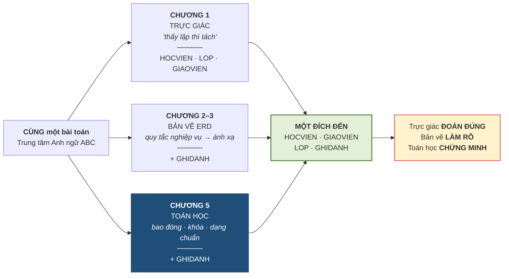

Ba con đường cho **cùng một kết quả** — nhưng khác biệt là rất lớn.

| | Chương 1 | Chương 5 |
|---|---|---|
| **Cơ sở tin tưởng** | Ta **tin** thiết kế đúng vì *"trông có vẻ ổn"* | Ta **chứng minh được** |
| **Nếu có người phản đối** | Không có gì để bảo vệ — cảm tính chọi cảm tính | Đưa chứng minh ra: đạt 3NF, tách bảo toàn thông tin, đã diệt đúng hai thủ phạm |
| **Khi bài toán lớn lên** | Trực giác **thất bại** | Thuật toán **vẫn chạy** |

> **Đây chính là bước trưởng thành của một người thiết kế cơ sở dữ liệu: từ *"tôi nghĩ thế này đúng"* sang *"tôi chứng minh được thế này đúng"*.**

### 5.11.2. Ba dị thường của Chương 1 — kiểm chứng lần cuối

**Bảng 5.12. Ba dị thường trên lược đồ 3NF**

| Dị thường *(Chương 1)* | Trên lược đồ 3NF | Kết quả |
|---|---|:--:|
| **Sửa**: cô Lê Hoa đổi tên hoặc số điện thoại | Nằm ở **đúng một dòng** trong `GIAOVIEN` → sửa một lần, **không thể** mâu thuẫn | Đã diệt |
| **Thêm**: mở lớp A3 chưa có học viên nào | Thêm thẳng vào `LOP`, **không cần** học viên nào | Đã diệt |
| **Xóa**: học viên cuối cùng của lớp nghỉ | Xóa khỏi `GHIDANH`; `LOP` và `GIAOVIEN` **nguyên vẹn** | Đã diệt |

Cả ba đã bị loại bỏ — và lần này ta biết **chính xác vì sao**. Không phải mơ hồ *"vì ta tách bảng"* như câu trả lời của Chương 1, mà vì ta đã **diệt đúng hai thủ phạm**: phụ thuộc **bộ phận** *(2NF)* và phụ thuộc **bắc cầu** *(3NF)*.

### 5.11.3. Thu hồi mọi lời hẹn

Học phần đã treo lại nhiều lời hẹn. Đây là chỗ trả hết.

**Bảng 5.13. Mọi lời hẹn và nơi trả**

| Lời hẹn | Treo ở | Trả tại |
|---|---|---|
| *"Chương 5 sẽ chuẩn hóa lại đúng bảng này bằng toán học, và ra đúng những bảng ta vừa đoán"* | mục 1.7 | **5.9** |
| *"Mỗi ô một giá trị đơn — sẽ được gọi tên chính thức ở Chương 5"* | mục 2.2.4 · 3.1.3 | **5.7.2** *(1NF)* |
| *"Thuộc tính dẫn xuất `SISO` sẽ được bàn lại dưới tên phi chuẩn hóa"* | mục 2.2.5 · 4.7.5 | **5.10.4** |
| *"Phụ thuộc hàm là quy tắc nghiệp vụ, Chương 5 sẽ dùng nó làm công cụ chuẩn hóa"* | mục 3.2.2 | **5.2** |
| *"Ràng buộc quá khó thường tố cáo thiết kế — ý này dẫn vào Chương 5"* | mục 4.7.5 | **5.8.4** |
| *"Bốn chương đều dựa vào cảm tính; Chương 5 cho công cụ chứng minh"* | Bảng 4.13 | **5.1 · 5.11** |

### 5.11.4. Hành trình năm chương

**Hình 5.13. Hành trình năm chương**

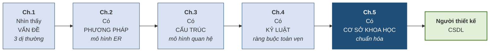

Học phần khép lại ở đây, nhưng công việc thì không. Điều học phần này trao cho người học không phải là một bộ quy tắc để học thuộc, mà là **một cách suy nghĩ**: trước khi lưu bất kỳ dữ liệu nào, hãy hỏi *"sự thật này thuộc về đâu, và nó có đang bị lưu ở hai chỗ không?"*

Bước tiếp theo là học phần **Hệ quản trị cơ sở dữ liệu**, nơi những lược đồ vừa thiết kế sẽ được cài đặt thật bằng SQL, cùng với các vấn đề mà học phần này đã hoãn lại: ngôn ngữ truy vấn, an toàn — bảo mật, và quản lý giao dịch.

---

## TÓM TẮT CHƯƠNG

**Một cơ sở dữ liệu "tốt"** được định nghĩa bằng **bốn tiêu chí đo được**: không dư thừa, không dị thường, bảo toàn thông tin, bảo toàn phụ thuộc hàm. Bốn tiêu chí này **không phải lúc nào cũng đạt được cùng lúc**.

**Ba loại phụ thuộc hàm**: đầy đủ *(vô hại)*, **bộ phận** *(vi phạm 2NF)*, **bắc cầu** *(vi phạm 3NF)*. Hai loại sau là **hai thủ phạm** gây dị thường. Tập `F` đến từ **quy tắc nghiệp vụ**, không phải từ dữ liệu mẫu.

**Hệ luật Armstrong** gồm ba luật gốc *(phản xạ, tăng trưởng, bắc cầu)* và ba luật dẫn xuất *(hợp, tách, bắc cầu giả)*. Nó **đúng đắn và đầy đủ**.

**Bao đóng `X⁺`** là công cụ trung tâm, tính bằng thuật toán lăn quả cầu tuyết. Hai công dụng: kiểm tra một phụ thuộc có suy ra được không, và kiểm tra một tập có phải siêu khóa không. **`F⁺` là tập các mũi tên; `X⁺` là tập các chữ cái.**

**Thuật toán tìm khóa** chia thuộc tính thành `TN` *(bắt buộc trong khóa)*, `TG` *(phải thử)*, `TĐ` *(không bao giờ trong khóa)*. Tìm **tất cả** khóa bằng cách duyệt `2^|TG|` tập con, với **mẹo rút gọn**: đã là siêu khóa thì mọi tập cha đều không tối thiểu, loại luôn.

**Phủ tối thiểu** thỏa mãn ba điều kiện: vế phải một thuộc tính, không thừa thuộc tính vế trái, không thừa phụ thuộc. **Thứ tự ba bước là bắt buộc.**

**Ba dạng chuẩn**: 1NF *(ô đơn trị)*, 2NF *(không bộ phận)*, 3NF *(không bắc cầu)* — tóm tắt bằng câu *"the key, the whole key, and nothing but the key"*.

**Phép tách sai sinh ra bộ giả** — những dòng chưa từng tồn tại. Điều này **nguy hiểm hơn mất dữ liệu**, vì hệ thống trả về nhiều hơn sự thật mà mọi dòng đều trông hợp lệ. Điều kiện tránh: **thuộc tính chung phải là siêu khóa của ít nhất một bảng con**. Quy tắc thực hành: **luôn tách theo phụ thuộc hàm**.

**Định lý quan trọng**: 3NF luôn đạt được cả bảo toàn thông tin lẫn bảo toàn phụ thuộc; **BCNF thì không phải lúc nào cũng**. Vì vậy **3NF thường là đích đến hợp lý** — "chuẩn hơn" không đồng nghĩa với "tốt hơn".

**BCNF** chặt hơn 3NF ở chỗ bỏ vế *"hoặc `A` là thuộc tính khóa"*. **Phụ thuộc đa trị `X ↠ Y`** gây bùng nổ tích ngay cả khi bảng đã đạt BCNF; **4NF** loại bỏ nó, và **phép tách theo phụ thuộc đa trị luôn bảo toàn thông tin** *(định lý Fagin)*.

**Phi chuẩn hóa** là cố ý đưa dư thừa trở lại để đổi lấy tốc độ — chỉ hợp lý với hệ thống đọc nhiều sửa ít, và **chỉ được làm sau khi đã chuẩn hóa**, có ghi lại lý do.

**Kết quả cuối cùng**: chuẩn hóa bằng toán học cho ra **đúng bốn bảng** mà trực giác ở Chương 1 và bản vẽ ở Chương 2–3 đã đoán được. Trực giác **đoán đúng**, bản vẽ **làm rõ**, toán học **chứng minh**.

---

## CÂU HỎI ÔN TẬP

1. Nêu **bốn tiêu chí** của một cơ sở dữ liệu "tốt". Hai tiêu chí nào đôi khi **không thể đạt cùng lúc**?
2. Vì sao nói *"chuẩn hóa không phải để tiết kiệm dung lượng"*? Vậy mục đích thật sự là gì?
3. Phân biệt phụ thuộc **đầy đủ**, **bộ phận**, **bắc cầu**. Vì sao hai loại sau gây hại?
4. Trong định nghĩa phụ thuộc bắc cầu `K → Z → Y`, vì sao điều kiện *"`Z` không phải khóa"* là **bắt buộc**?
5. Nêu ba luật gốc của Armstrong. Vì sao luật phản xạ tuy hiển nhiên nhưng vẫn cần thiết?
6. Trình bày thuật toán tính `X⁺`. Điểm dễ sai nhất khi thực hiện là gì?
7. Phân biệt `F⁺` và `X⁺`. Vì sao toàn bộ lý thuyết chuẩn hóa được xây trên `X⁺` chứ không phải `F⁺`?
8. Giải thích vì sao thuộc tính thuộc `TN` **bắt buộc** có trong mọi khóa, còn thuộc tính thuộc `TĐ` thì **không bao giờ**.
9. Vì sao phải tìm **tất cả** khóa chứ không chỉ một khóa?
10. Trình bày **mẹo rút gọn** khi tìm tất cả khóa. Mẹo này dựa trên tính chất nào của bao đóng?
11. Nêu ba điều kiện của phủ tối thiểu. Vì sao **thứ tự ba bước** trong thuật toán là bắt buộc?
12. Phát biểu 1NF, 2NF, 3NF. Giải thích câu *"the key, the whole key, and nothing but the key"*.
13. **Bộ giả** là gì? Vì sao nó **nguy hiểm hơn** việc mất dữ liệu?
14. Phát biểu điều kiện bảo toàn thông tin. Vì sao *"luôn tách theo phụ thuộc hàm"* thì điều kiện tự động thỏa mãn?
15. Vì sao **mất bảo toàn phụ thuộc hàm** lại là điều đáng lo? Liên hệ với Chương 4.
16. Vì sao thực hành thường **dừng ở 3NF** thay vì leo lên BCNF?
17. Cho một bảng **đã đạt BCNF** nhưng vẫn dư thừa. Nguyên nhân là gì và khắc phục thế nào?
18. Khi nào **phi chuẩn hóa** là hợp lý? Vì sao nó khác với thiết kế cẩu thả?

**Gợi ý trả lời một số câu**

*Câu 7.* `F⁺` là tập **mọi phụ thuộc hàm** suy ra được từ `F` — kích thước **hàm mũ**, thực tế không tính nổi. `X⁺` là tập **mọi thuộc tính** suy ra được từ `X` — kích thước không quá số thuộc tính của `R`, tính rất nhanh. Mọi câu hỏi tưởng như cần `F⁺` đều quy được về việc tính vài bao đóng `X⁺`; đó là đóng góp thực dụng lớn nhất của khái niệm bao đóng.

*Câu 10.* Mẹo: duyệt các tập con của `TG` theo **kích thước tăng dần**; nếu `TN ∪ Xᵢ` đã là siêu khóa thì **mọi tập cha** của `Xᵢ` chắc chắn không tối thiểu, loại luôn không cần tính bao đóng. Mẹo dựa trên **tính đơn điệu** của bao đóng: thêm thuộc tính vào `X` thì `X⁺` chỉ có thể lớn lên.

*Câu 13.* **Bộ giả** là bộ xuất hiện khi ghép các bảng con nhưng **không có trong quan hệ gốc**. Nguy hiểm hơn mất dữ liệu vì: mất dữ liệu thì người dùng **biết mình thiếu** và đi tìm; còn bộ giả khiến hệ thống trả về **nhiều hơn sự thật**, mọi dòng đều trông hợp lệ, và **không ai biết dòng nào bịa**.

*Câu 15.* Nếu một phụ thuộc hàm bị xé ra hai bảng, thì để kiểm tra nó hệ quản trị phải **ghép hai bảng mỗi lần có thao tác** — tức ràng buộc ấy trở thành loại **liên bộ liên quan hệ**, loại khó nhất trong Bảng 4.3 của Chương 4, phải viết trigger. Nói gọn: **mất bảo toàn phụ thuộc hàm nghĩa là biến một ràng buộc dễ thành một ràng buộc khó.**

*Câu 17.* Nguyên nhân là **phụ thuộc đa trị**: bảng chứa **hai danh sách độc lập** gắn với cùng một chủ thể, gây **bùng nổ tích**. BCNF không phát hiện được vì bảng có thể không có phụ thuộc hàm không tầm thường nào. Khắc phục: tách về **4NF** — tách `R` thành `X ∪ Y` và `X ∪ Z`; theo định lý Fagin phép tách này luôn bảo toàn thông tin.

---

## BÀI TẬP CHƯƠNG

### Mức A — Nhận biết và tái hiện

**Bài A1.** Cho `R(A,B,C,D,E)` và `F = {A → B, BC → D, D → E}`. Tính `(AC)⁺` và `(BD)⁺`, ghi rõ từng vòng lặp.

**Bài A2.** Với mỗi phát biểu, cho biết đúng hay sai và giải thích: (a) mọi quan hệ đạt 3NF đều đạt 2NF; (b) mọi quan hệ đạt BCNF đều đạt 3NF; (c) nếu khóa chỉ gồm một thuộc tính thì quan hệ luôn đạt 2NF; (d) nếu mọi thuộc tính đều là thuộc tính khóa thì quan hệ luôn đạt 3NF; (e) mọi quan hệ đạt BCNF đều đạt 4NF.

**Bài A3.** Cho `F = {AB → C, A → D, D → B}`. Xác định `TN`, `TG`, `TĐ` cho `R(A,B,C,D)`.

### Mức B — Vận dụng

**Bài B1.** Cho `R(A,B,C,D,E)` và `F = {AB → C, C → D, D → A, B → E}`.
a) Xác định `TN`, `TG`, `TĐ`.
b) Tìm **tất cả** khóa, trình bày bảng duyệt đầy đủ và chỉ rõ chỗ áp **mẹo rút gọn**.
c) Xác định thuộc tính khóa và thuộc tính không khóa.
d) Xác định **dạng chuẩn cao nhất** mà `R` đạt được, có chứng minh.

**Bài B2.** Cho `F = {A → BC, CD → E, B → D, E → A}`. Tìm **phủ tối thiểu**, trình bày đủ ba bước.

**Bài B3.** Cho bảng phẳng của một **hiệu sách**:

`DONHANG(MADH, NGAYDAT, MAKH, TENKH, SDT_KH, MASP, TENSP, DONGIA, SOLUONG)`

với các quy tắc nghiệp vụ: mỗi đơn hàng có một ngày đặt và một khách hàng; mỗi khách hàng có một tên và một số điện thoại; mỗi sản phẩm có một tên và một đơn giá; mỗi dòng đơn hàng ghi số lượng của một sản phẩm trong một đơn.

a) Viết tập phụ thuộc hàm `F`.
b) Tìm tất cả khóa.
c) Chẩn đoán dạng chuẩn, chỉ đích danh các phụ thuộc **bộ phận** và **bắc cầu**.
d) Chuẩn hóa về **3NF**, trình bày từng bước.
e) **Chứng minh** mọi phép tách đều bảo toàn thông tin.

**Bài B4.** Dùng lược đồ **thư viện** đã làm ở các chương trước:
a) Viết tập phụ thuộc hàm `F` từ các quy tắc nghiệp vụ.
b) Kiểm tra từng bảng xem đã đạt 3NF chưa.
c) Nếu có bảng chưa đạt, chuẩn hóa và giải thích.

### Mức C — Nâng cao

**Bài C1.** Cho `R(A,B,C)` và `F = {AB → C, C → B}`.
a) Tìm tất cả khóa.
b) Chứng minh `R` đạt **3NF** nhưng **không đạt BCNF**.
c) Tách về BCNF và chỉ ra **phụ thuộc hàm nào bị mất**.
d) Liên hệ với Định lý 5.2 và giải thích vì sao trường hợp này nên **dừng ở 3NF**.

**Bài C2.** Cho quan hệ `NHANVIEN_KYNANG_NGOAINGU(MANV, KYNANG, NGOAINGU)` trong đó kỹ năng và ngoại ngữ của một nhân viên **độc lập với nhau**.
a) Với một nhân viên có 4 kỹ năng và 3 ngoại ngữ, bảng phải chứa bao nhiêu dòng?
b) Bảng này có đạt BCNF không? Giải thích.
c) Chỉ ra các phụ thuộc đa trị và **tách về 4NF**.
d) Sau khi tách, cần bao nhiêu dòng? Tính tỷ lệ tiết kiệm.

**Bài C3.** Một hệ thống thương mại điện tử lưu bảng `DONHANG` đã chuẩn hóa 3NF. Bộ phận báo cáo phàn nàn rằng truy vấn *"doanh thu theo tháng theo danh mục sản phẩm"* phải ghép 5 bảng và chạy mất 40 giây.
a) Đề xuất một phương án **phi chuẩn hóa** cụ thể.
b) Chỉ ra **dư thừa** mà phương án ấy tạo ra và **dị thường** có thể phát sinh.
c) Đề xuất **cơ chế bảo đảm** dữ liệu dư thừa luôn khớp.
d) Nêu **điều kiện** để phương án này chấp nhận được, đối chiếu Bảng 5.11.

**Bài C4** *(tự chọn).* Tìm hiểu về **dạng chuẩn 5 (5NF)** hay *dạng chuẩn nối*. Cho một ví dụ về quan hệ phải tách thành **ba bảng** mới bảo toàn thông tin, và giải thích vì sao tách thành hai bảng là không đủ.

---

## TÀI LIỆU THAM KHẢO CỦA CHƯƠNG

**[1]** Tô Văn Nam (2005). *Giáo trình cơ sở dữ liệu*. NXB Giáo dục — chương về lý thuyết thiết kế cơ sở dữ liệu quan hệ; phụ thuộc hàm, bao đóng, thuật toán tìm khóa, các dạng chuẩn.

**[2]** Vũ Đức Thi (1997). *Cơ sở dữ liệu — kiến thức và thực hành*. NXB Thống kê — hệ luật dẫn Armstrong, phủ tối thiểu, phép tách lược đồ và các thuật toán.

**[3]** Coronel, C. & Morris, S. *Database Systems: Design, Implementation & Management*. Cengage Learning — **Chapter 6** (*Normalization of Database Tables*): quy trình chuẩn hóa 1NF–3NF, BCNF, 4NF, phụ thuộc đa trị, phi chuẩn hóa và các điều kiện áp dụng, danh mục kiểm tra mô hình hóa dữ liệu.

**Hướng dẫn tự học.** Chương này **chỉ nắm được qua luyện tập** — đọc suông không đủ. Trình tự khuyến nghị: làm hết Bài A1 *(bao đóng)* trước khi đọc mục 5.5; làm Bài B1 *(tìm tất cả khóa)* trước khi đọc mục 5.7; làm Bài B3 *(chuẩn hóa hiệu sách)* sau khi đọc xong mục 5.9. Hai tiểu mục **5.10.2–5.10.3** *(phụ thuộc đa trị và 4NF)* được viết đủ chi tiết để tự đọc nếu lớp không kịp giảng; kèm Bài C2 để tự kiểm tra.

---

## PHỤ LỤC 5A. GỢI Ý TỔ CHỨC DẠY HỌC

*Phần này dành cho giảng viên, không thuộc nội dung bắt buộc của người học.*

### 5A.1. Hoạt động nhóm — *"Bệnh viện lược đồ"*

*(nhóm 4–5 người, 40 phút — thu thập minh chứng CLO1 và CLO3)*

Tổ chức theo ba vai: **chẩn đoán → điều trị → tái khám**.

Phát cho mỗi nhóm một lược đồ "bệnh" — một bảng phẳng kèm tập phụ thuộc hàm, có cài sẵn cả phụ thuộc bộ phận lẫn bắc cầu. Nhóm phải: ① **chẩn đoán** — tìm khóa, xác định dạng chuẩn, chỉ đích danh thủ phạm; ② **điều trị** — tách về 3NF; ③ **tái khám** — chứng minh phép tách bảo toàn thông tin và kiểm tra lại dạng chuẩn của từng bảng con.

Sau đó **đổi bài chéo**: mỗi nhóm nhận bài của nhóm khác và đóng vai *bác sĩ hội chẩn* — kiểm tra xem chẩn đoán có đúng không, có bỏ sót thủ phạm nào không.

Cách tổ chức này rèn đúng ba tiêu chí đầu của Rubric 3, và ẩn dụ y học giúp người học nhớ trình tự làm bài.

### 5A.2. Hoạt động cá nhân — chạy tay thuật toán

*(20 phút)*

Chia làm hai lượt. **Lượt một** *(10 phút)*: mỗi người tính một bao đóng `X⁺` với `F` cho sẵn, **bắt buộc ghi từng vòng lặp** — không được ghi kết quả suông. **Lượt hai** *(10 phút)*: tìm tất cả khóa của một lược đồ có `|TG| = 3`, lập bảng duyệt 8 dòng.

Điểm cần dẫn dắt ở lượt một là những người **chỉ quét `F` một lượt** và bỏ sót thuộc tính dính vào ở vòng sau. Điểm cần dẫn dắt ở lượt hai là những người **quên bước lọc tính tối thiểu** và báo cả siêu khóa thừa là khóa.

### 5A.3. Thảo luận cả lớp — *"Chuẩn hơn có tốt hơn không?"*

*(15 phút)*

Sau khi giảng xong mục 5.8.4, đặt câu hỏi: *"Nếu BCNF chặt hơn 3NF, vì sao trong thực tế người ta lại thường dừng ở 3NF?"*

Dẫn dắt để cả lớp nhận ra sự đánh đổi: leo lên BCNF có thể **xé một phụ thuộc hàm ra hai bảng**, biến một ràng buộc dễ thành ràng buộc **liên bộ liên quan hệ** phải viết trigger — đúng loại khó nhất đã học ở Chương 4.

Câu hỏi chốt, mở rộng ra ngoài môn học: *"Còn ở đâu trong nghề nghiệp mà 'chuẩn hơn' lại không đồng nghĩa với 'tốt hơn'?"*

### 5A.4. Ứng dụng thực tế

Với mỗi hệ thống dưới đây, đặt câu hỏi *"hệ thống này nên chuẩn hóa tới đâu, và vì sao?"*: hệ thống ngân hàng lõi *(giao dịch, đọc ghi liên tục)*; kho dữ liệu báo cáo bán hàng *(đọc nhiều, nạp lại hàng đêm)*; ứng dụng ghi nhật ký cảm biến *(ghi rất nhiều, gần như không sửa)*; hệ thống quản lý đào tạo của trường.

Cặp **ngân hàng lõi** và **kho dữ liệu báo cáo** đáng dùng nhất vì chúng nằm ở hai đầu đối lập: một bên bắt buộc chuẩn hóa cao vì tính đúng đắn là tối thượng, một bên phi chuẩn hóa là hợp lý vì mục đích là tổng hợp nhanh trên dữ liệu chỉ đọc.

### 5A.5. Phiếu phản hồi một phút

*(cuối buổi, ẩn danh)*

1. Trong buổi học hôm nay, khái niệm nào bạn thấy **khó hiểu nhất**?
2. Nêu **một câu** tóm tắt điều bạn nhớ nhất.

Kinh nghiệm cho thấy ba chỗ hay được nêu nhất là **phân biệt `F⁺` với `X⁺`**, **bước lọc tính tối thiểu khi tìm tất cả khóa**, và **phụ thuộc đa trị**. Với chỗ thứ nhất, câu *"`F⁺` là tập các mũi tên, `X⁺` là tập các chữ cái"* thường đủ để gỡ. Với chỗ thứ ba, nên bỏ hẳn định nghĩa hình thức và đi thẳng vào **bảng dữ liệu bùng nổ tích** ở Ví dụ 5.8 — nhìn thấy 15 dòng cho 8 sự kiện là hiểu ngay.

---

## DANH MỤC HÌNH (Chương 5)

| Hình | Tên hình | Mục |
|---|---|---|
| Hình 5.1 | Bốn chương hội tụ về Chương 5 | 5.1.1 |
| Hình 5.2 | Phụ thuộc bộ phận — phép loại suy ổ khóa hai chìa | 5.2.3 |
| Hình 5.3 | Phụ thuộc bắc cầu — phải đi hai chặng | 5.2.4 |
| Hình 5.4 | Bao đóng — phép loại suy quả cầu tuyết | 5.4.1 |
| Hình 5.5 | Ba nhóm thuộc tính — và vì sao phân nhóm | 5.5.1 |
| Hình 5.6 | Thuật toán tìm phủ tối thiểu — phải làm đúng thứ tự | 5.6.3 |
| Hình 5.7 | Cây quyết định — xác định dạng chuẩn cao nhất | 5.7.5 |
| Hình 5.8 | Nghịch lý bộ giả — không mất dòng nào mà vẫn mất sự thật | 5.8.1 |
| Hình 5.9 | Leo cao hơn chưa chắc tốt hơn | 5.8.4 |
| Hình 5.10 | Quy trình chuẩn hóa từng bước | 5.9.5 |
| Hình 5.11 | Phụ thuộc đa trị — hai nhánh độc lập gây bùng nổ tích | 5.10.2 |
| Hình 5.12 | Trực giác, bản vẽ, toán học — cùng ra một kết quả | 5.11.1 |
| Hình 5.13 | Hành trình năm chương | 5.11.4 |

## DANH MỤC BẢNG (Chương 5)

| Bảng | Tên bảng | Mục |
|---|---|---|
| Bảng 5.1 | Bốn chương — căn cứ ra quyết định | 5.1.1 |
| Bảng 5.2 | Bốn tiêu chí — công cụ kiểm tra tương ứng | 5.1.2 |
| Bảng 5.3 | Ba loại phụ thuộc hàm | 5.2.1 |
| Bảng 5.4 | Ba luật gốc và ba luật dẫn xuất | 5.3.2 |
| Bảng 5.5 | `F⁺` và `X⁺` — hai thứ khác nhau | 5.4.4 |
| Bảng 5.6 | Dạng chuẩn diệt dị thường nào | 5.7.6 |
| Bảng 5.7 | Tập phụ thuộc hàm `F` — rút từ quy tắc nghiệp vụ | 5.9.2 |
| Bảng 5.8 | Chẩn đoán với khóa `K = (MAHV, MALOP)` | 5.9.4 |
| Bảng 5.9 | Kiểm chứng từng phép tách | 5.9.6 |
| Bảng 5.10 | 3NF và BCNF khác nhau ở đâu | 5.10.1 |
| Bảng 5.11 | Khi nào phi chuẩn hóa là hợp lý | 5.10.4 |
| Bảng 5.12 | Ba dị thường trên lược đồ 3NF | 5.11.2 |
| Bảng 5.13 | Mọi lời hẹn và nơi trả | 5.11.3 |

## DANH MỤC TỪ VIẾT TẮT

| Viết tắt | Tiếng Anh | Tiếng Việt |
|---|---|---|
| **1NF · 2NF · 3NF** | First / Second / Third Normal Form | Dạng chuẩn 1 · 2 · 3 |
| **4NF · 5NF** | Fourth / Fifth Normal Form | Dạng chuẩn 4 · 5 |
| **BCNF** | Boyce–Codd Normal Form | Dạng chuẩn Boyce–Codd |
| **CSDL** | — | Cơ sở dữ liệu |
| **F** | set of functional dependencies | Tập phụ thuộc hàm |
| **F⁺** | closure of F | Bao đóng của tập phụ thuộc hàm |
| **PTH** | functional dependency | Phụ thuộc hàm |
| **RBTV** | — | Ràng buộc toàn vẹn |
| **TN · TG · TĐ** | — | Tập nguồn · tập trung gian · tập đích |
| **X⁺** | closure of attribute set X | Bao đóng của tập thuộc tính `X` |
| **→** | functional dependency | Phụ thuộc hàm |
| **↠** | multivalued dependency | Phụ thuộc đa trị |
| **⋈** | natural join | Phép kết tự nhiên |
